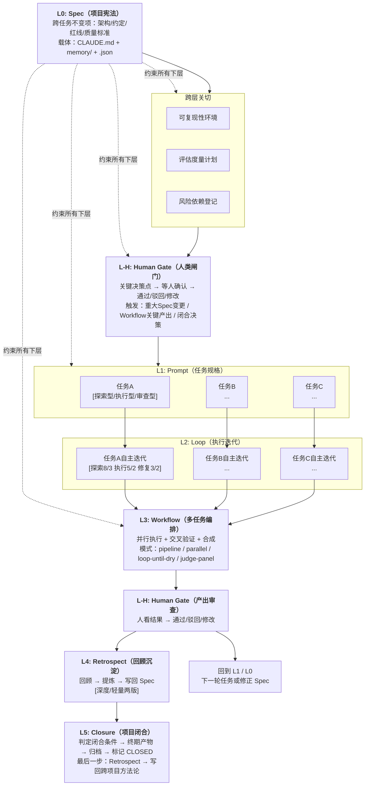
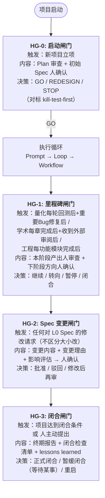
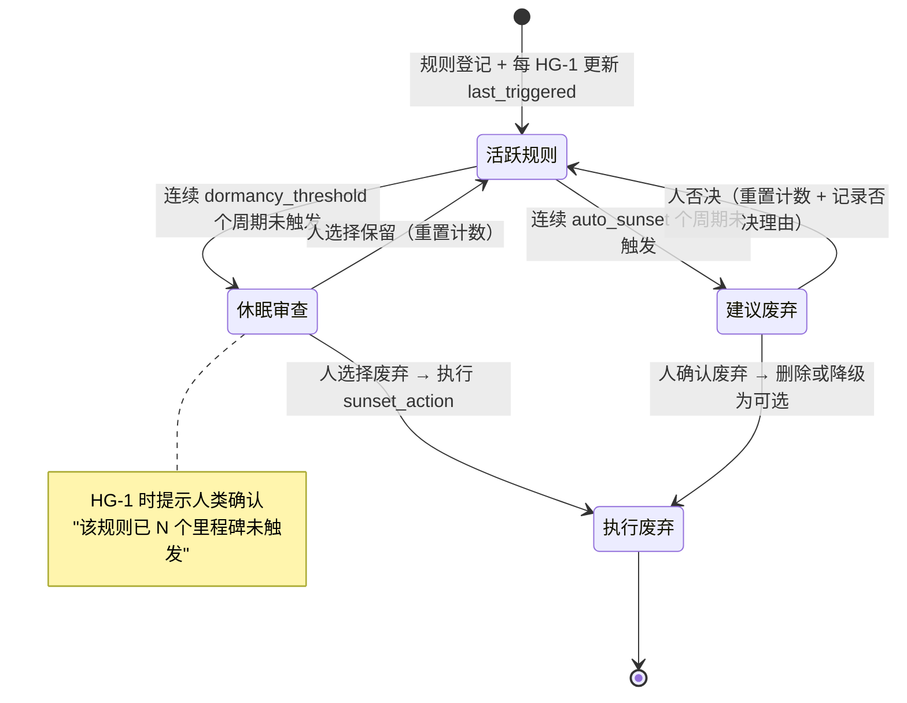
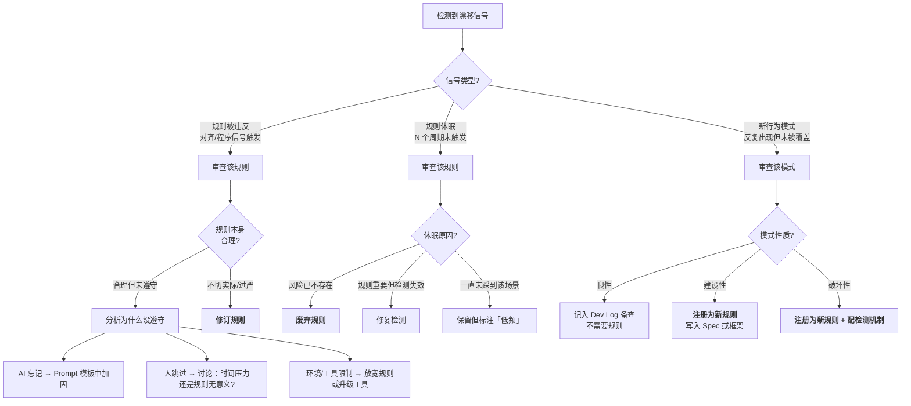
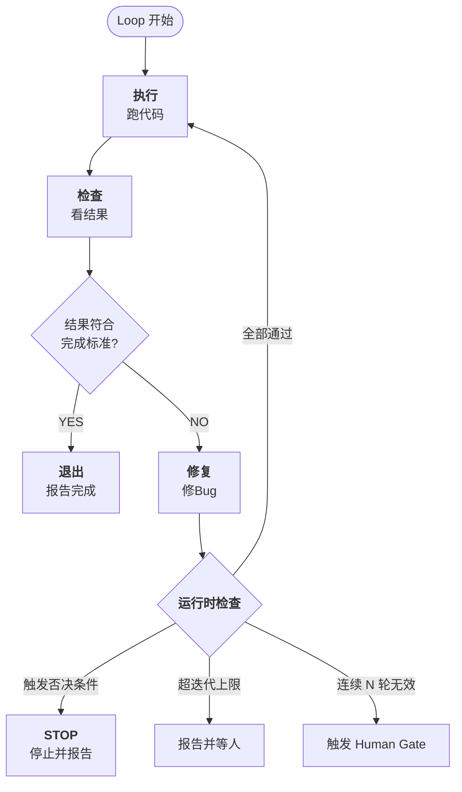
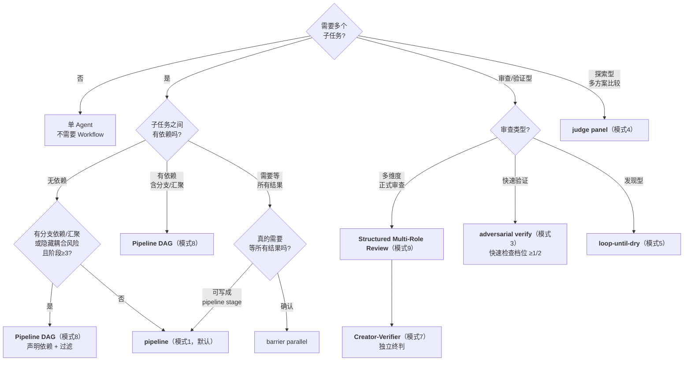

# AI协作项目全生命周期框架

> **版本**: v1.6.4（**v1.6.4：prompt-tdd A1 实验写回 §6.3.2——Flow-as-Node 嵌套工作流对照证据 [E-] ceiling-limited**）  
> **日期**: 2026-06-22  
> **生成模型**: DeepSeek-V4-Pro (via Claude Code CLI shell)  
> **发布前订正（2026-06-23，Claude Opus 4.8 via Claude Code CLI）**: 不升版本号的措辞订正与可理解性补充（过期时效声明更新 + 新增 §13.1.2 项目代号说明 + 面向公开读者的口吻中性化）。无机制/证据等级变更。详见 §14「v1.6.4 发布前订正批次」。
> **v1.6.4 新增（2026-06-22，DeepSeek-V4-Pro via Claude Code CLI）**: prompt-tdd A1 Flow-as-Node Tier 0 对照实验写回——新增 §6.3.2 Flow-as-Node 嵌套工作流对照证据 [E-] ceiling-limited（Tier 0 负证据；3/5 类别天花板，ΔF1=0.000）。经 7 轮双后端审查链（Codex GPT-5.5 ×4 + Qwen qwen3.7-max ×3），0 未闭合发现。同时更新 header 元数据新增 A1 写回声明。详见 §14。  
> **v1.6.2 新增（2026-06-21，DeepSeek-V4-Pro via Claude Code CLI）**: 基于用户记忆系统三次被动观测事件（`method_llm_review_coverage_single_run` / `methodology_review_prompt_mechanical_checks` / `todo_verify_glm5_identity`）的跨案例分析，新增 §7.7「被动观测：意外发现的发现机制」。概念经 Codex GPT-5.5 魔鬼代言人独立审查（2026-06-21，总体判断：有条件支持）——审查意见已系统性纳入：定义收紧（不声称"只能被动发现"）、模式降级为"当前已识别"（非完备分类）、补扩展分类框架（待实证）、补 Failure Space（10 种失效模式+硬约束）、深度版 Retrospect 模板增强（发现方式/复核状态/适用边界）。伴随更新：目录、§14 变更记录、§9 跨层交叉引用、附录 C 深度版 Retrospect 模板。详见 §14。  
> **v1.6 新增（2026-06-20，DeepSeek-V4-Pro via Claude Code CLI）**: 本次为 Minor 升级——7 项新增/增强。(P0) 来源为 A2+A3 深度复盘 + Codex v1.5.5 交叉验证：§9.6.1 证据等级二维表示 + §9.10 方法论片段三层模型 + §4.1.1.1 对照实验设计强制检查清单（6 项）。(P1) 来源为跨版本实践规范化 + 审查反馈推导：§2.6 框架维护流程 + §1.8 诚实声明 + §9.9 路径 D + 附录 H 反向交叉引用。详见 §14。**注意**：v1.6 初版由 DeepSeek-V4-Pro 单后端编辑，后经 Codex GPT-5.5 异后端交叉验证（初审→重审，2 MAJOR + 多项 MEDIUM 全部修正闭合，见 §14 及 `_reviews/codex_v16_crosscheck_*`）。
> **Protocol 3 试跑1回写（2026-06-16，Codex CLI 编辑）**: 首次真实试跑"方法论提取方法论"项目已闭合（M-tier，闭合时 14/20 loops；Phase 8 Kimi 核查后修正为闭合后 15/20，58 项发现，0 CRITICAL/MAJOR 遗留）。本次按试跑 Retrospect + Phase 7 系列审查 + `框架级成熟度评估表.md` §9，将 6 项 Protocol 3 改进写回主文档：C1/C5 测量方法、HG-0 Plan/Spec 双审查、审查频率适应性上调、HG 交互留存、C8 ≥2 轮异后端建议、S-tier 降级阈值备注。来源统一标注为"[Protocol 3 试跑1反馈，2026-06-16]"。  
> **Mermaid 可视化转换（2026-06-16，DeepSeek-v4-pro via Claude Code CLI）**: 将 6 处 ASCII/缩进文本图转为 ` ```mermaid ` 代码块（§1.2 生命周期总览 / §3.2 闸门流程图 / §3.7.4 规则退役状态图 / §3.7.6 策展决策树 / §5.2 Loop 循环图 / §6.3 模式选择决策树）。转换方案经 **ChatGPT-5.5 (Codex CLI, GPT-5.5)** 独立审阅确认——两后端在 4/5 优先图上共识、差异点（§3.2 vs §3.7.4 优先级）已通过"全做"调和。遵循选择性转换原则：流程/决策/状态迁移 → Mermaid；伪代码/表格/目录树 → 保留原样。属冻结期白名单内的"修确凿 bug"——ASCII 框线图在不同渲染环境易错位、难维护，Mermaid 不改任何机制内容，仅改展示格式。  
> **PocketFlow 方法论转化 A 类资产写回（2026-06-18，DeepSeek-v4-pro via Claude Code CLI）**: 基于 PocketFlow 三轮独立分析（DeepSeek-V4-Pro / ChatGPT-5.5 / GLM-5.2，2026-06-16~18）产出的 A 类资产（可直接写回框架的方法论改进，无需额外验证实验），本版（v1.5.3）共写回 3 项：(1) **B2 资产 → 新增 §9.9「阅读导航与难度分层」**——按 ☆☆☆/★☆☆/★★☆/★★★ 标注 15 个章节/条目难度，提供 3 条推荐阅读路径；(2) **B1 资产 → 新增 §1.7「框架自身的架构原则：最小核心 + 示例外挂」**——定义核心（主文档强制规则）vs 外挂（配套目录参考实现）的区分标准及 4 种反模式警示；(3) **PF-反模式资产组 → 新增「附录 H: 反模式清单」**——集中收纳 4 条经独立审查确认可迁移性的反模式，原 §6.5.1 文件系统作 IPC 条目迁移至此并新增 PocketFlow 来源 3 条。伴随更新：§1.4 末尾新增对 §9.9 和 §1.7 的交叉引用；§1.6 末尾新增对 §1.7 的交叉引用。所有新增内容标注来源为 "[PocketFlow方法论转化，2026-06-18]"。详见 §14。
> **prompt-tdd A2 实验写回（2026-06-19，DeepSeek-v4-pro via Claude Code CLI）**: prompt-tdd A2 Tier 1 对照实验完成——prep/exec/post 分段 vs 一体式编号列表 prompt，代码审查域、GPT-5.5 (temp=0)、n=24/臂。H1 不被支持（A_flat correctness_rate=0.954 ≥ B_structured=0.935，方向与假设相反）。PF-8 资产从留白 [Sp] 更新为 [E-]（单域实验不支持），诚实记录于 §4.1.1。详见 §14。
> **prompt-tdd A3 实验写回（2026-06-20，DeepSeek-V4-Pro via Claude Code CLI）**: prompt-tdd A3 Action Routing 对照实验完成（v1 + Pilot）——声明式 vs NL 路由描述，GPT-5.5 (temp=0)、中文路由任务、6-15 actions。两个实验均未检测到格式效应（Δ=0, discordant率=0%），经 10 轮审查链确认（含 Codex GPT-5.5 ×4, Qwen qwen3.7-max ×3, 合并/咨询/对齐各×1；非全为同质独立审查轮）。PF-9 资产记录为 [E-]（阴性结论；格式效应在上述条件下不可检测），诚实记录于 §6.3。详见 §14。
> **prompt-tdd A1 实验写回（2026-06-22，DeepSeek-V4-Pro via Claude Code CLI）**: prompt-tdd A1 Flow-as-Node Tier 0 对照实验完成——层级化工作流描述 vs 内容等价的扁平描述，编码 Agent 工作流理解域、GPT-5.5 (temp=0)、n=20/臂。H1 不被支持（Δ median F1 = 0.000, 3/5 类别天花板）。经 7 轮双后端审查链确认（Codex GPT-5.5 ×4 + Qwen qwen3.7-max ×3），0 未闭合发现。PF-A1-001 资产从留白 [Sp] 更新为 [E-] ceiling-limited（Tier 0 负证据；仅 C4/C5 有区分空间且每类 n=4），诚实记录于 §6.3.2。详见 §14。

> **冻结期编辑记录（2026-06-14/15，跨天编辑）**: 本文档 v1.5.1 冻结期内的结构性修订由 **GLM-5.2 (via ZCode CLI shell)** 执行（编辑始于 2026-06-14 23:14，免费额度刷新后于 2026-06-15 00:00 继续完成）。**重要 provenance 声明**：GLM-5.2 是框架审查链谱系之外的**第五个后端**（在 GLM-5.2 编辑者介入时，已有 DeepSeek-v4-pro / Opus 4.8 / ChatGPT-5.5 / Kimi-K2.7-Code / Qwen3.7-Max 五个后端，跨四个 CLI house：Claude / Codex / Kimi / Qwen）。GLM-5.2 在本次编辑中**仅承担编辑者角色，非独立审查者**——其修订基于框架自身已记录的证据（Codex 审查报告、§10.8 成熟度评估等）。**本次编辑引入了已标注的编辑者判断（F9 成熟度评估的逐行分级与分布估计、F10 协议 2 冷读 prompt 与判读规则），待独立复核**。所有修订项均为冻结期白名单内的"修确凿 bug / 补零试跑诚实性产物"，无新增 [Sp] 节。**逐条修订清单见 §14「v1.5.1 冻结期编辑记录（GLM-5.2）」**。按框架 §9.2 独立审查标准，本次编辑独立性级别为 **[SEMI-ED]**（编辑独立于内容创作，但 GLM-5.2 的修订指令由用户提供、修订对象由用户选定）。后续独立审查者复核本批次修订时，应：(a) 验证每条修订是否真属"修 bug"而非"加机制"；(b) 验证 GLM-5.2 是否引入了未声明的实质性判断。
> **冻结声明（2026-06-14 起，2026-06-16 已满足解除条件）**: v1.5.1 曾进入冻结期。在完成 ≥1 次真实试跑 + Retrospect 回写（产出《框架级成熟度评估表》初版）之前，**不接受新增 [Sp] / 机制节**。冻结期内只允许：(a) 修确凿 bug（版本漂移/引用失效/编辑错乱）、(b) 执行已设计未跑的协议（OPEN-4 试读、OPEN-1 verify）、(c) 补零试跑即可做的诚实性产物（框架级成熟度表）。**理由**：框架自身已记录"加复杂度比减复杂度容易"的倾向（v1.3.2 修正路线图"二次确认偏误"教训 + v1.5.1 同日 4 个 [Sp] 节连加），但尚未变成执行约束。冻结把教训文字变成纪律。冻结解除条件 = 试跑 1 Retrospect 完成；该条件已由 Protocol 3 试跑1满足，本版为试跑回写。详见 §14。
> **独立审查**: v1.4: ChatGPT-5.5 (5.37) + Kimi-K2.7-Code (5.00) / v1.5: ChatGPT-5.5 C+ (5.43/10) / v1.5.1草案: Codex ChatGPT-5.5 R3(4.3,驳回)→R4(7.2,修改后通过)  
> **状态**: **草案，两次真实试跑已回写（分析型+实验型），仍待多项目验证**（v1.6.4: prompt-tdd A1 实验写回 §6.3.2 [E-] ceiling-limited / v1.6.3: 维护流程补全+诚实声明扩展 / v1.6.2: 被动观测机制 / v1.6: 证据体系升级+维护性增强 / v1.5.5: prompt-tdd A3 实验写回 §6.3.1 [E-] / v1.5.4: prompt-tdd A2 实验写回 §4.1.1 [E-] / v1.5.2 写回 Protocol 3 试跑1反馈；v1.5.1 新增: §3.7.0 事件流健康度监测 [Sp] + §3.7.4.1 自适应权重淘汰 [Sp] + §9.7 经验注入上下文预算规则 [Sp] + §9.8 研究经验对象(REO) [Sp]。方法论来源=Evolver项目分析(arXiv:2604.15097, 综合评分4.1-4.2/10, 四轮独立审查跨三个后端)。完整规格见 `_research/框架v1.5.1_新增节草案.md`。v1.5 新增: §6.2 模式8/9 + §9.2 + §9.6。v1.4 新增: §3.7.2.6/§5.3.1/§6.2/§6.5.1/§9.1/§1.5/§9.4/附录H。v1.3 遗留 OPEN-1~4 状态不变（OPEN-5 已于 v1.5.1 冻结期关闭 → §8.8））  
> **v1.5 方法论来源**: GitNexus分析项目（42K星代码知识图谱工具全量分析+9-agent workflow+三轮独立审查+证据分类实战）。详见 §14 变更记录。  
> **v1.3 更新**: 新增 §3.7 漂移检测层——将 OPEN-1"离散审查测不出连续漂移"从候选草案升级为正式化的连续监测层（五类漂移信号 + 告警聚合 + 规则退役自动化 + 宪法审计 + 闭环策展 + 完整监测模板），设计受 headroom CacheAligner 的 detector-only 哲学启发（只检测不阻断），经 ChatGPT-5.5 独立裁决确认边界。同步更新 §1.6 OPEN-1 为"已操作化 → §3.7，待试跑验证"。详见 §14 变更记录。  
> **v1.2 更新**: 经三模型独立审查链（ChatGPT-5.5 审查 → DeepSeek-v4-pro 再审查 → ChatGPT-5.5 回应 → Opus 4.8 再再审查）校准。本版改动：(1) 状态从"已定稿"改为"草案冻结，等待试跑验证"；(2) 新增 §1.4 使用强度分档（最低强制版/默认版/完整版）；(3) 新增 §1.5 框架自身死亡判据；(4) 新增 §1.6 已知待决项登记 + §3.6 连续漂移与 Human Gate 频率-覆盖缺口（OPEN-1，审查链判定的最高杀伤发现）；(5) 修正 §13.1 外部对标"独特贡献"表述并补个人级/组织级对照表。详见 §14 变更记录。  
> **v1.1 更新**: 新增第 10 章"跨层产物：开发手册（Dev Log）"——基于 ETF 项目 V3.6 代码头部注释实践 + 网友经验，形式化为累积式变更日志 + FK 导航 + 独立于代码的持久化产物  
> **配套文件**: `AI协作项目全生命周期框架.json`、`_reviews/AI协作项目全生命周期框架_对ChatGPT-5.5回应的再再审查.md`（审查链最终意见）、`methodological-review-sop.md` + `.json`（独立审查SOP v1.0.3，框架 §9.2 的操作性落地）、`meta-audit-checklist.md` + `.json`（元审查合规清单 v1.0.3，依据框架 §9.2 派生的执行层工具）。**归档说明**：中文名 v1.0 旧版（`独立审查标准操作程序_SOP.{md,json}` + `元审查合规清单.{md,json}`）已被英文名 v1.0.3 取代，移至 `_archive/`；ChatGPT-5.5 headroom 对标三文档审查的 `.json` 配套已在 v1.5.1 冻结期补齐。

---

## 目录

1. [框架总览](#1-框架总览)
   - [1.7 框架自身的架构原则：最小核心 + 示例外挂](#17-框架自身的架构原则最小核心--示例外挂)
   - [1.8 已知局限与诚实声明](#18-已知局限与诚实声明)
2. [L0: Spec（项目宪法）](#2-l0-spec项目宪法)
   - [2.6 框架自身的维护流程](#26-框架自身的维护流程)
3. [L-H: Human Gate（人类闸门）](#3-l-h-human-gate人类闸门)
   - [3.6 已知缺口（OPEN-1）](#36-已知缺口待决--open-1连续漂移与-human-gate-频率-覆盖)
   - [3.7 漂移检测层（v1.3 新增）](#37-漂移检测层从离散闸门到连续观测v13-草案)
4. [L1: Prompt（任务规格）](#4-l1-prompt任务规格)
   - [4.1.1.1 对照实验设计强制检查清单](#4111-对照实验设计强制检查清单)
5. [L2: Loop（执行迭代）](#5-l2-loop执行迭代)
6. [L3: Workflow（多任务编排）](#6-l3-workflow多任务编排)
7. [L4: Retrospect（回顾沉淀）](#7-l4-retrospect回顾沉淀)
   - [7.7 被动观测：意外发现的发现机制](#77-被动观测意外发现的发现机制)
8. [L5: Closure（项目闭合）](#8-l5-closure项目闭合)
9. [跨层关切](#9-跨层关切)
   - [9.6.1 证据等级的二维表示](#961-证据等级的二维表示内部强度--跨模型推广性)
   - [9.9 阅读导航与难度分层](#99-阅读导航与难度分层)
   - [9.10 方法论片段模板：三层模型](#910-方法论片段模板三层模型)
   - [9.11 跨层可观测性设计](#911-跨层可观测性设计)
10. [跨层产物：开发手册（Dev Log）](#10-跨层产物开发手册dev-log)
11. [与现有系统集成](#11-与现有系统集成)
12. [附录：模板与检查清单](#12-附录模板与检查清单)
    - [附录 H: 反模式清单](#附录-h-反模式清单)
13. [外部参考与定位](#13-外部参考与定位)
14. [变更记录（v1.1 → v1.6.4）](#14-变更记录v11--v164)

---

## 1. 框架总览

### 1.1 核心理念

本框架描述**如何用 AI 协作跑完一个完整项目**——不是某个具体项目的说明书，而是项目方法的元层次规范。

四个核心信念：

1. **方向盘 > 发动机**：方向正确比算力大更重要。Prompt（方向）弱而 Loop/Workflow（算力）强 = 高效奔向错误方向。
2. **分层不互相替代**：Spec/Prompt/Loop/Workflow 各管各的问题，上层弱不能靠下层强来弥补。
3. **从失败中反向沉淀**：Spec 不是一次写对的——是从每次失败和惊喜中反向提炼的。
4. **AI 内部闭环 ≠ 人类审查**：框架覆盖 AI 能做的事，但关键节点必须有人的判断闸门。

### 1.2 完整生命周期视图



> **图1**：框架七层生命周期总览。实线箭头 = 数据/控制流；虚线箭头 = Spec 约束关系。L-H 在流程中出现两次：执行前（闸门）和产出后（审查）。

### 1.3 七层 + 四跨层关切速览

| 层 | 名称 | 管什么 | 粒度 | 变化频率 | 现有对应物 |
|----|------|--------|------|----------|-----------|
| L0 | Spec | 跨任务不变的东西 | 项目级 | 低频（发现新约束时修订） | CLAUDE.md + memory/ |
| L-H | Human Gate | AI不能替人做的决策 | 决策点 | 按里程碑触发 | `feedback_independent_review_reminder.md` |
| L1 | Prompt | 单次任务的规格 | 任务级 | 每轮不同 | 会话中的具体指令 |
| L2 | Loop | 执行中的试错收敛 | 轮次级 | 毫秒级 | 模型自主迭代（跑→错→修） |
| L3 | Workflow | 多任务的并行编排 | 编排级 | 按任务触发 | kill-test-first + Claude Code Workflow 工具 |
| L4 | Retrospect | 回顾 → 提炼 → 写回 | 里程碑级 | 每个里程碑/阶段结束 | 项目复盘归档报告.json |
| L5 | Closure | 项目何时结束、怎么结束 | 项目级 | 一次性 | `project_status.md` 标记 CLOSED |

| 跨层关切 | 管什么 | 现有对应物 |
|----------|--------|-----------|
| 可复现性 | 环境/依赖/数据/随机种子 | `reference_python_versions.md`（部分） |
| 评估度量 | 怎么判断做得好不好 | kill-test-first 否决条件 + 三层评估分工 |
| 会话交接 | 跨会话状态恢复 | memory/ 目录 + `/session-end` skill |
| 风险依赖 | 外部依赖和风险追踪 | 统一风险登记表（附录 F） |
| Dev Log | 累积式变更日志 + FK导航 + 时间轴 | 无——**本次新增产物**（基于 ETF 项目 V3.6 代码头部实践提炼） |

### 1.4 使用强度分档（最低强制版 / 默认版 / 完整版）

本框架是**模式库**，不是必做清单。同一份文档按使用强度分三档——先用最低强制版跑起来，达标后再升级，不要一上来就全量启用。升级须满足 §1.6 / §6.4 / §1.5 的复扩条件，不是默认就开。

| 档位 | 适用 | 强制启用 | 暂不启用（升级项） |
|------|------|---------|-------------------|
| **最低强制版** | 任何项目、首次试跑 | S1–S4（状态/路径/约定/红线）、HG-0/HG-1/HG-3、Workflow 三模式（pipeline / adversarial verify / discovery）、Dev Log 单时间轴（仅主文档） | — |
| **默认版** | 进入稳定迭代后 | + S5/S6（成功标准/评估计划）、HG-2 Spec 变更闸门、Retrospect 轻量版、风险登记 | — |
| **完整版** | 正式研究/交付级，且复扩条件达标 | 全量 | Dev Log 双视图+FK、Judge Panel、Loop-Until-Dry、Completeness Critic、HG-2 全量分级、深度 Closure 清单 |

**关键纪律**："30% 复杂度就能跑"——但必须说清是哪 30%，否则模式库会被误当成必做清单，沦为事实上的过度工程。本表就是那张说明。

> **与 §8.8 项目规模分档的区别**：本节 A/B/C 三档定义的是**框架本身用多少**（使用强度），§8.8 S/M/L 定义的是**项目闭合做多深**（闭合规模）。两者正交——C 档用户可以跑 S 档项目，A 档用户也可以跑 L 档项目。不要混淆。
>
> **与 §9.9 阅读导航的关系**：§9.9 提供按难度分层的章节对照表和推荐阅读路径——初次接触框架的读者可先查阅 §9.9 选择适配自身背景的入口章节，而非逐节通读。§1.4 回答"框架用多少"（使用强度分档），§9.9 回答"从哪开始读"（难度分层）。
>
> **与 §1.7 核心 vs 外挂的关系**：§1.4 管用多少、§1.7 管在哪找——强制规则看主文档（核心），参考实现看配套目录（外挂）。两者正交互补：§1.4 回答"30% 复杂度就能跑——是哪 30%"，§1.7 回答"那 30% 就在这份主文档里，其余 70% 在配套目录——需要时再取"。

### 1.5 框架自身的死亡判据

**对称性要求**：框架要求每个项目有死亡判据（S4）、每个 Prompt 有死亡判据（L1 第 4 要素），框架自己也必须有——否则框架的失败永远会被解释成"执行不到位"而非"框架无效"。满足**任一条**即触发对应动作（在下一个真实项目预登记基线后评估）：

| 判据 | 阈值 | 动作 |
|------|------|------|
| 无改善 | 连续 3 个真实项目，交接恢复时间/返工率/漏记率/Bug 追溯时间相对历史基线改善 < 20% | 大修 |
| 维护成本 | 框架维护+填表耗时 > 项目总工时 15% 且无可量化收益 | 降级为最低强制版 |
| 绕过率 | 连续 2 个项目，实际绕过 > 50% 的模板/闸门 | 重构（框架不适配真实工作） |
| Dev Log 失败 | 10 次真实变更漏记 > 2 次，或链接错误 > 10%，自动化无法降到 5% 以下 | 取消"双视图+FK"，退回单一时间轴 |
| HG 过载 | HG-2 变更确认 > 70% 被直接批准且无实质讨论 | 闸门分级 |
| 外部审查无增益 | 连续 3 次独立模型审查未发现有价值问题 | 降频或换审查方式 |

死亡判据的评估依赖下一个项目**预登记**的指标（交接恢复时间、Dev Log 漏记率、返工次数、HG 等待次数、审查发现率、框架维护耗时）。**没有预登记基线，死亡判据无法触发——见 §1.6 OPEN-2。**

### 1.6 已知待决项登记（Open Items）

> 单列、**不并入任何复扩表**——避免"严重性夷平"（把致命缺口和措辞小修放进同一张等高表格而抹平差异）。以下是框架**已知未解决**的问题，启用前须知情。

| ID | 待决项 | 严重性 | 状态 | 详见 |
|----|--------|--------|------|------|
| **OPEN-1** | **连续漂移 / Human Gate 频率-覆盖缺口**：人审离散（按里程碑）、AI 执行连续（每轮 Loop），离散审查测不出连续方向漂移；HG 抽查频率天然低于 AI 犯错频率。**处置轨迹**：v1.2提出→v1.3草案 Loop Drift Ledger（ChatGPT-5.5 独立裁决条件采纳：只观测不阻断）→v1.3正式化为 §3.7 漂移检测层（五类信号+告警聚合+规则退役+宪法审计+闭环策展+监测模板）。**现状：已操作化 → §3.7，待试跑验证**（ChatGPT-5.5 独立审查确认边界：只观测不阻断；§3.7 为未验证监测方案，完成 2-3 个真实项目试跑后再评估是否降级严重性）。 | **高（结构性）→ 中（已有操作化方案，ChatGPT-5.5 独立审查确认边界，待实证验证）** | **已操作化 → §3.7，待试跑验证**。漂移检测层与 §3.6 Loop Drift Ledger 互补：§3.6 定义账本记录什么，§3.7 定义用什么信号触发警觉、如何响应、如何度量。预登记6项验证指标+退出条件仍待真实项目试跑。 | §3.6 + §3.7 |
| **OPEN-1 处置方案** | （已执行）v1.3草案→v1.3正式化。Loop Drift Ledger(§3.6) + 漂移检测层(§3.7) 共同构成 OPEN-1 完整应对。ChatGPT-5.5独立裁决(2026-06-13)条件采纳，关键约束为"只覆盖留下可观察痕迹的漂移"+"不新增阻断，只新增观测"。DeepSeek-v4-pro(作者)与ChatGPT-5.5(独立)的方向性分歧已调和——交集="新增观测不新增阻断"。**v1.4 新增**：§3.7.2.6 难度分层监测明确列为 OPEN-1 的子待验证项（已预登记退出条件：连续 2 个 ML 项目无增益→降级或退役）。 | 中（有独立裁决后佐证增强，待人类裁决+真实项目试跑） | 已执行→待验证 | §3.6 + §3.7 + ChatGPT-5.5独立审查报告 |
| **OPEN-1 Action** | **下一步**：安排至少一位未参与框架设计的零卷入人类专家，对 drift detection 层的方向（"新增观测不新增阻断"是否足够、"闸门太多应减少"vs"覆盖不够应新增"的裁决）进行独立裁决。截止日期：[待人类确认]。此 Action 由 Kimi-K2.7-Code v1.4 独立审查（2026-06-13）提出并采纳。 | — | 待执行 | — |
| OPEN-2 | 框架级死亡判据缺预登记基线——判据已写入（§1.5）但无基线无法触发 | 中 | **部分验证（v1.5.2 试跑1回写 + v1.6.4 试跑2回写）**：预登记载体已建立=配套文件 `框架级成熟度评估表.{md,json}`；两条真实基线已记录（分析型项目+实验型项目），但死亡判据仍需连续项目数据才可触发 | §1.5 + 框架级成熟度评估表 |
| OPEN-3 | 框架对用户已有实践的"提炼准确度"未评估——把 80 分实践形式化成 60 分模板的风险（与"有无外部对标"是两个问题，审查链未接战） | 中 | 待评估 | — |
| OPEN-4 | 最低上手时间未测——目标用户是个人、无 onboarding 资源；需非设计者试读并计理解时间/误解点 | 中 | 待实测 | §1.4 |
| OPEN-5 | Closure 缺"项目规模"分档（半天探索 / 一周小项目 / 正式研究），现仅按项目类型分档 | 低-中 | **已覆盖 → §8.8**（v1.5.1 冻结期：新增 S/M/L 三档闭合要求对照表，含档位升级规则和与项目类型的正交说明） | §8.8 |

> **与 §1.7 核心 vs 外挂的关系**：§1.7 描述了框架材料自身的组织逻辑（核心 vs 外挂），其中配套目录 `_reviews/` 和 `_protocols-and-tools/` 的部分内容与 OPEN-4（最低上手时间未测）直接相关——试读者导航困惑的部分根因正是缺少显式的核心/外挂说明。

### 1.7 框架自身的架构原则：最小核心 + 示例外挂

> **方法论来源**: PocketFlow 三轮独立分析（DeepSeek-V4-Pro / ChatGPT-5.5 / GLM-5.2），2026-06-16。本条原则由 B1 资产"最小核心+示例外挂架构"直接转化——PocketFlow 的"100 行核心 + 分难度 cookbook 体系"结构是一种有效的知识传递模式：核心提供执行保证，cookbook 提供使用范式。该模式不依赖 PocketFlow 的具体实现（100 行并非目标数字，框架不应有"行数崇拜"），提取的是**结构分层的组织逻辑**。[PocketFlow方法论转化，2026-06-18]

**框架自身也遵循这一原则。** 本框架的完整材料不是只有这份主文档——它有若干配套文件（根目录含主文档及治理工具）和 4 个子目录（`_reviews/`、`_research/`、`_protocols-and-tools/`、`_archive/`），读者如果不知道"哪些是必须读的、哪些是按需查的"，会被文件数量淹没。本节说明框架自身的组织逻辑，防止两类根本性误用：把参考实现当强制规则，或把强制规则当可选附录跳过。

**核心 = 主文档（本文件）**：

核心文档是框架的 **canonical source of truth**（规范来源）——不等于每句话都强制。具体来说：

- **最低强制核心**（§1.4 明确列出 + 死亡判据 §1.5 + 闸门规则 §3.2-3.5 + 逃生口 §4.3 + 闭合条件 §8 + §6.3 模式选择决策树）：有合规牙齿，违反会被死亡判据或审查标准捕获
- **规范性参考**（`[Sp]` 推测机制如 §3.7.0/§9.7/§9.8、模板附录 A-G、变更记录 §14、候选 profile 如 §3.7.2.6）：在主文档中以便查阅，但标注了证据等级和启用条件，不等同于强制项
- **导航与元信息**（§9.9、§13、本文档元数据）：辅助读者高效使用框架，不产生合规义务

最低强制核心包括：
1. **七层 + 四跨层关切定义**（§1.3 速览表）：各层管什么、不重叠、不互相替代
2. **强制启用清单**（§1.4 使用强度分档的"最低强制版"列）：S1–S4、HG-0/HG-1/HG-3、Workflow 三模式、Dev Log 单时间轴。任何自称"使用本框架"的项目若未启用这些组件，视为未使用
3. **死亡判据**（§1.5）：框架自身有效性的可测量判定标准
4. **闸门触发条件与决策规则**（§3.2–§3.5）：HG 在什么节点触发、人做什么、AI 做什么
5. **逃生口规则**（§4.3 + 附录 B）：工具/数据不可用时停，不用替代数据
6. **闭合条件与分档**（§8 + §8.8）：项目何时结束、做多深
7. **可复现性/评估/会话交接的最低标准**（§9）：跨层不可降级的下限

核心的特征：**有合规牙齿**——违反它会被框架的死亡判据或审查标准捕获。核心不回答"可以怎么做"，只回答"必须怎么做"和"什么情况下可以豁免"。

**外挂 = 配套目录（场景化参考实现）**：

四个配套目录提供**场景化的应用模板、参考实现和治理记录**。它们不是强制规则，而是"这里有已验证的做法，你可以直接用、改、或参考后自己设计"：

| 目录 | 角色 | 类比（PocketFlow cookbook） | 使用方式 |
|------|------|---------------------------|---------|
| `_reviews/` | 独立审查报告与提示词存档 | 审查类 cookbook（如 `pocketflow-judge`） | 做独立审查时参考提示词结构和评分维度；不要求每个项目产出等量审查 |
| `_research/` | 对标分析、版本草案、方法论研究 | 设计文档类 cookbook（如各 cookbook 的 `docs/design.md`） | 需要理解某条原则的"为什么"时查阅；不要求每个项目做同等深度的对标研究 |
| `_protocols-and-tools/` | 协议包、执行手册、verify 工具 | 工具集成类 cookbook（如 `pocketflow-mcp`） | 执行特定协议时按手册操作；不要求每个项目跑全部协议 |
| `_archive/` | 旧版归档——被取代但保留供追溯 | N/A（框架治理特有） | 查历史版本或旧审查结论时翻阅；日常不读 |

外挂的特征：**无合规牙齿**——跳过它不会触发死亡判据或导致审查 FAIL。外挂的价值在于"别人踩过的坑你不用再踩"，而非"你必须这样踩"。

**核心 vs 外挂的区分标准**：

以下三条判定规则决定一项内容应进入核心文档（主文档）还是配套目录：

| 判定规则 | 进核心（主文档） | 进配套目录 |
|---------|----------------|-----------|
| **普遍性** | 任何项目类型（量化/学术/工程/探索）都适用 | 仅特定类型或特定阶段适用 |
| **强制性** | 不遵守会导致框架死亡判据触发或审查 FAIL | 参考实现，不遵守仅损失效率而非合规 |
| **稳定性** | 跨版本稳定，修改需走 HG-2（Spec 变更闸门） | 可按需增删，新增/删除走 Dev Log 记录即可 |

**边界案例处理原则**：当一项内容无法确定该进核心还是外挂时，**默认进外挂**。理由：从外挂升级到核心只需一次编辑（且有 HG-2 闸门把关），从核心移除到外挂则需要证明"之前的强制要求是错的"——成本不对称。这与 v1.3.2 修正路线图已记录的教训"加复杂度比减复杂度容易"一致。

**与 §1.4 使用强度分档的关系**：

§1.4 和本节描述的是**两个正交维度**，互补但不重叠：

| 维度 | §1.4 使用强度分档 | §1.7 核心 vs 外挂 |
|------|------------------|-------------------|
| 问题 | **用多少**——从最低强制到完整版，逐步激活 | **在哪找**——强制规则看主文档，参考实现看配套目录 |
| 粒度 | 主文档内部的功能激活开关（同文件内） | 框架全部材料（跨文件）的组织逻辑 |
| 正交性示例 | C 档（完整版）用户仍只读核心文档——但激活的核心功能更多 | A 档（最低强制版）用户也可能需要查阅 `_reviews/` 中的审查模板来完成首次 HG-1 审查 |

互补关系：§1.4 回答"30% 复杂度就能跑——是哪 30%"，§1.7 回答"那 30% 就在这份主文档里，其余 70% 在配套目录——需要时再取，不需要时不碰"。两条合在一起，用户不会把"只需 30% 复杂度"误解为"整个框架只有这份主文档"。

**反模式警示**：

以下四种误用模式是本框架最常见的"使用失败"来源——不是框架有 bug，是读者用错了材料层次：

| # | 反模式 | 表现 | 后果 | 纠正 |
|---|--------|------|------|------|
| **A1** | **把外挂当核心读** | 打开 `_reviews/` 中的某份审查报告，以为其中的评分维度是强制模板，逐条套用到自己的项目审查 | 过度审查——把参考实现当合规清单，审查耗时膨胀但无增量价值 | 审查维度以主文档 §9.2 为准；`_reviews/` 中的报告是"某次审查怎么做的"，不是"每次审查必须怎么做" |
| **A2** | **把核心当外挂跳过** | 只读 §1.4 的"30% 复杂度就能跑"，跳过 §1.5 死亡判据、§3.2 闸门触发条件、§4.3 逃生口规则 | 用了框架的"轻量"部分但没装刹车——项目跑偏时无退出机制 | 最低强制版不是"你挑着读"，而是明确的固定清单：S1–S4 + HG-0/1/3 + Workflow 三模式 + 逃生口 |
| **A3** | **把配套目录当可选装饰** | 从不查阅 `_reviews/` 或 `_protocols-and-tools/`，所有审查从零设计、所有协议从零起草 | 重复造轮子——框架已提供审查 SOP（`methodological-review-sop.md`）和验证包（`_protocols-and-tools/`），不用等于浪费已沉淀的方法论资产 | 遇到"怎么做独立审查"→ 先查 `_reviews/` 中的既往报告和 SOP；遇到"怎么验证框架合规"→ 先查 `_protocols-and-tools/` |
| **A4** | **外挂膨胀为核心** | 在配套目录中发现有用的参考实现后，要求把它写进主文档成为强制规则 | 核心膨胀——主文档从方法论原则退化为操作手册合集，失去"最小核心"的可维护性 | 好的参考实现应留在配套目录并做好索引（让需要的人能找到），而非升级为强制规则（让所有人都必须读） |

**A4 特别警示**：本条原则本身（§1.7）也在它自己的管辖范围内——描述"最小核心"原则的节不应膨胀为核心中最长的节。如果未来发现本节内容需要拆分（例如反模式表移到配套目录、仅保留区分标准），应同样适用"默认外挂"的边界判定规则。

**演示证据**：

本原则并非纯理论推导。框架两次协议执行的对照提供了初步证据（未核实原始数据，据用户报告）：

- 无显式"核心 vs 外挂"说明时：试读者不知从哪里开始读，2/4 项任务完成
- 有准索引（成熟度评估表作为间接导航）后：4/4 项任务完成

两次对照的方向一致——显式的组织说明降低了新读者的认知负担和导航成本。但此证据仅为 N=2 两次试读的对照，未达方法论意义的"已验证"，标注为 **[Sp]**（推测有效，待更多试读确认）。

> **与 §1 其他自指涉节的协调**：§1.4 定义用多少、§1.5 定义什么时候算失败、§1.6 定义已知不知道什么、§1.7 定义材料如何组织。四条合在一起构成框架的"自我描述层"——框架不仅描述项目怎么做，也描述自己怎么被使用和被评估。新读者建议按 §1.4 → §1.5 → §1.6 → §1.7 的递进顺序阅读：先知道用多少，再知道怎么判死，再知道有什么已知缺口，最后知道去哪里找东西。

> **与 §9.9 阅读导航的关系**：§9.9 提供按难度分层的章节导航，告诉读者从哪开始读；本节说明核心/外挂材料的组织逻辑，告诉读者哪些必须读、哪些按需查——两者互补：§1.7 管"在哪找"，§9.9 管"从哪开始读"。

---

<a id="18-已知局限与诚实声明"></a>
### 1.8 已知局限与诚实声明（v1.6 新增）

> **来源**：Codex v1.5.5 交叉验证 MAJOR #1——"三角验证"措辞过度声称——的精神延伸：框架的自我描述应包含其已知局限，而非仅记录优势和待办。具体局限条目来自复盘报告 §9 和 Codex/Qwen 多轮审查的累积反馈。

框架在 v1.5.5 完成时（2026-06-20），以下系统性局限已识别但尚未解决：

**1. 单模型证据主导**：框架中经过对照实验验证的方法论片段（§4.1.1 A2、§6.3.1 A3、§6.3.2 A1）基于 GPT-5.5 temp=0 单模型。**2026-06-20 更新**：A2 Qwen 跨模型复现已完成（qwen3.7-max, Δ=−0.014 方向一致），首次跨模型方向一致弱复现（非严格条件复现，见 §4.1.1 v1.6.1 更新段限制）。A1 和 A3 尚未经跨模型复现。三项实验覆盖了格式效应（A2/A3）和结构效应（A1），但跨任务方向一致观察仍限 GPT-5.5。以上结论严格限定于 temp=0/CLI 默认中文结构化判别任务内。

**2. 单团队实验者效应**：所有对照实验由同一团队设计、执行、审查。以下因素未被分离：方法论片段迁移（跨实验传递）vs 实验者经验增长（在实验间变得更擅长设计实验）vs 方法论选择性关注（团队本身就重视方法论提取）。

**3. 无独立人类专家校准**：所有对照实验的评分体系为 LLM-LLM（双后端盲评评分者是被试模型之外的 LLM）。无独立人类专家对代码审查的正确严重程度（A2）、路由决策的正确答案（A3）、方法论片段的"重要性"和"可迁移性"进行校准。LLM-LLM κ ≠ 评分正确性。

**4. 二维证据体系未试跑**：v1.6 新增的二维证据等级（内部强度 × 跨模型推广性，§9.6.1）和三层 MF 模板（§9.10）均基于 A2+A3 两个实验的问题驱动设计，行为有效性待框架后续版本验证。

**5. N=3 实验的统计基础**：框架的跨实验模式（PX-1 至 PX-10）基于 N=3 的实验（A1/A2/A3）。所有量化数字均来自 1-3 个数据点，不可作为参数估计推广。三项实验覆盖了两类效应（格式效应 A2/A3 + 结构效应 A1），但全部在同一模型（GPT-5.5）、同一温度（temp=0）、同一语言（中文）条件下执行。

**6. 探索性 vs 确认性框架的深层张力**：A2 和 A3 在探索性和确认性框架之间摇摆——实验实质上是探索性研究方法论的工具（此框架下方法论产出丰富是合理的），但被确认性假设检验框架所约束（此框架下阴性结论是"失败的"）。Tier 0（探索性）和 Tier 1（确认性）的边界在实践中模糊——本框架尚未解决这一张力。

**7. 测试集区分度未分析**：A2 和 A3 的"天花板效应"和"阴性结果"均基于名义样本量（n=20-24）。测试集项目的区分度（discrimination）未被分析——"有效样本量"（区分性项目数）可能远小于名义样本量。有多少测试用例是所有 prompt 变体都做对的零区分度项目——未知。

**8. 框架自身的审查链局限**：截至 v1.5.5，框架经 5 个后端 × 4 个 CLI house 的多轮审查（§14 审查链谱系）。但审查者池固定（同一团队+模型）、停止规则内生于主观判断、审查者学习效应未控制。

**9. 作者-读者同构假设**（v1.6.2 新增）：框架的设计者也是其当前唯一重度用户。七层结构的优先级、默认值、证据等级的直觉边界、哪些概念需要解释而哪些不需要——都反映了单一思维模式（金融工程专业学生，兴趣驱动+方法论探索主导）。本文档的定位是**半开放方法论**（个人方法论工具的开放发布），而非通用框架——读者应预期需要翻译成本才能适配自己的场景。框架提供的不是通用规则，是经过证据标注的个人实践模式。此局限的严重性取决于框架是否会被设计者以外的人采用——若始终为个人工具，此为低严重性；若公开发布后他人尝试直接套用，则升级为结构性风险。

**10. 外部依赖漂移风险**（v1.6.3 新增）：框架重度依赖 Claude Code CLI 的工具能力边界（worktree/MCP/agent 子进程/上下文窗口）。工具链是 AI 协作领域变化最快的部分——新原生能力的出现可能使手写 Workflow 模式冗余，功能废弃可能使依赖该功能的跨层关切失效。此外，模型退役（如 GPT-5.5、qwen3.7-max 等审查链中使用的模型）、上下文长度变化、平台政策调整、价格结构变化均可能影响框架的操作假设。配套文件 `外部依赖登记表` 提供当前依赖的快照，但框架没有系统化的"外部依赖变化→框架影响"自动追踪机制——依赖登记表依赖人工检查节奏（每次 Minor 升级前全量检查）。

> **v1.6.3 新增局限来源**：局限 #9 和 #10 均来自两路异后端独立审查——Codex GPT-5.5（魔鬼代言人视角）和 Qwen qwen3.7-max（完备性检查视角），2026-06-21。两后端在"外部依赖建模缺失""作者-读者同构作为结构性风险"上零分歧收敛。审查报告存档于 `_reviews/codex_review_audience_stability_20260621.txt` 和 `_reviews/qwen_review_audience_stability_20260621.txt`。

上述每条局限在相关章节有详细声明（见交叉引用）。此集中声明不代表这些局限已"解决"或"减轻"——它只是确保新读者在接触框架的声称之前，先了解这些声称的边界。

受限于作者的认知边界和时间投入，本文档不可避免地存在疏漏、不足甚至错误——后续版本将随新证据和审查发现持续修订。

---

## 2. L0: Spec（项目宪法）

### 2.1 定义

Spec 是项目的**跨任务不变项集合**。它不描述"这轮要做什么"，而是描述"不管哪轮，这些东西都不能变——除非你发现了新约束并且人同意了"。

### 2.2 Spec 内容清单

每个项目应有以下 Spec 组件（按优先级排列）：

| # | 组件 | 内容 | 必要性 | 现状 |
|----|------|------|--------|------|
| S1 | 项目状态 | 当前版本/阶段/基线，是否活跃 | 必须 | `project_status.md` ✅ |
| S2 | 关键文件路径 | 代码/数据/文档/产物的路径索引 | 必须 | `reference_files.md` ✅ |
| S3 | 技术约定 | 语言版本、关键依赖、风控规则、绩效基准 | 必须 | `key_technical_details.md` ✅ |
| S4 | 否决条件（红线） | 什么情况下项目应该停止或回退 | 必须 | kill-test-first 门1 ✅ |
| S5 | 成功标准 | 项目级成功度量（主指标+目标值+最低可接受值+辅指标） | 必须 | 须新建 |
| S6 | 评估计划 | 测什么、用什么指标、什么时候测、什么算好。三层分工：AI自评每轮 + 独立模型里程碑 + 人类关键决策 | 强烈建议 | 须新建（LIT教训） |
| S7 | 重启门槛 | 封存后什么条件可以重启 | 封存项目必须 | 形态匹配项目有 ✅ |
| S8 | 风险登记 | 外部依赖、潜在风险、Plan B。H影响+M及以上概率须触发HG | 建议 | 须统一模板 |
| S9 | 可复现性声明 | 学术/量化须 pip freeze+Python版本+随机种子+数据快照（标注获取日期和来源）；工程/探索最低记录Python版本。不要求Docker | 学术/量化项目必须 | `reference_python_versions.md`（部分）✅ |
| S10 | 命名与文件约定 | 版本号规则、文件命名规范、目录结构 | 多版本项目建议 | 各项目有习惯但未成文 |

注：形态匹配=已封存的金融形态识别个人项目，详见 §13.1.2 项目代号说明。

### 2.3 Spec 的维护机制

Spec 不是一次写完的。它的生命周期如下：

```
项目启动                执行中                    闭合时
   │                      │                         │
   ▼                      ▼                         ▼
┌──────────┐    ┌──────────────────┐    ┌──────────────────┐
│ 初始 Spec │    │ 反向沉淀到 Spec  │    │ 终期 Spec 归档    │
│ (最少 viable│──▶│ (Retrospect 触发)│──▶│ lessons learned  │
│  constitution)│    │ 每里程碑/出错后    │    │ → memory/       │
└──────────┘    └──────────────────┘    └──────────────────┘
```

**初始 Spec**：项目开始时只写**确定的东西**——技术栈、红线、成功标准的最粗略版本。不确定的留空，标注以待后续补充。

**反向沉淀**：每次 Retrospect（见 L4）后，把以下发现写回 Spec：
- 新增的约束（"我们发现 X 不能和 Y 一起用"）
- 修正的假设（"原来以为 A 有效，实际只有 B 有效"）
- 新发现的对标物（"原来 FMTI 做过类似的"）
- 新的失败模式

**Spec 变更规则**：所有 Spec 变更都走 Human Gate（HG-2）。不区分"小改 AI 可自决"——Spec 是宪法，改宪法必须人知道。AI 可以建议、但不能自己改。

**终期归档**：项目闭合时，提取跨项目可复用的方法论 → 写回全局 memory/（跨项目的教训）。项目级 memory 永久保留，仅更新时效性标注（"X天前"→"已归档"），不删除。超过 30 天未更新的 memory 条目在会话启动时自动提醒"需验证"。

### 2.4 与现有系统的映射

| Spec 组件 | 现有位置 | 覆盖度 | 操作 |
|-----------|---------|--------|------|
| 项目状态 | `memory/project_status.md` 等 | 80% | 保持，补 S5/S6/S8 |
| 文件路径 | `memory/reference_files.md` + `reference_project_paths.md` | 90% | 保持，补版本间迁移记录 |
| 技术约定 | `memory/key_technical_details.md` | 70% | 补环境冻结、随机种子 |
| 否决条件 | kill-test-first skill 门1 | 90% | 保持 |
| 成功标准 | 分散在项目文档中 | 30% | 须新建——设主指标+目标值+最低可接受值 |
| 评估计划 | 缺失 | 5% | 须新建——三层分工 |
| 风险登记 | 分散 | 20% | 须统一模板——H+M概率触发HG |
| 命名约定 | 各项目习惯 | 40% | 可选——按需成文 |

### 2.5 Spec 模板

见附录 A。

---

<a id="26-框架自身的维护流程"></a>
### 2.6 框架自身的维护流程（v1.6 新增）

> **来源**：编辑者从框架跨版本维护经验（v1.5.1 冻结期/Mermaid 转换/Protocol 3 试跑回写）中推导的维护性增强，经 Codex 及 Qwen 多轮审查反馈中反复出现的"框架组织/可维护性"关切确认需求。非单一审查报告的逐条对应——是跨版本实践的规范化。证据等级 `[D/N/A]`（编辑者判断，未经验证）。

**版本号规则**：

- **格式**：`v<major>.<minor>.<patch>`（语义化版本）
- **Major 升级**（v1→v2）：框架核心架构变更——层增删、核心信念修订、Protocol 重大重定义。须跨 ≥3 后端独立审查 + ≥1 次真实试跑。
- **Minor 升级**（v1.5→v1.6）：新增节/机制/方法论片段——不改变核心架构，但增加实质性内容。须跨 ≥2 后端独立审查。
- **Patch 升级**（v1.5.3→v1.5.4）：修正/重组/交叉引用——不新增机制，修 bug/改善组织/更新证据。可单后端审查。

**Changelog 规范**（§14）：

1. 每版必须记录：触发事件、新增/修改的节、来源、证据等级
2. 版本时间线表同步更新（日期/版本/关键事件/证据/置信度）
3. 保留每版独立快照（md 或 docx），不单信 changelog 文本
4. Major 和 Minor 升级须在版本头（文档前 15 行）添加标注段落

**写回审查门**（新增内容进入主文档前）：

| 变更类型 | 最低审查要求 | 示例 |
|---------|------------|------|
| 新 [Sp] 节 | ≥2 后端独立审查，冻结期至少等 1 次试跑 | §9.7 经验注入（Evolver→等待 Compact A/B 测试） |
| 新 [E-]/[E] 节 | ≥2 后端独立审查（含异模型家族），0 MAJOR 未闭合 | §4.1.1 A2 写回（6 轮审查通过） |
| 现有节修订 | ≥1 后端审查，覆盖修改 + 上下文节 | §6.3.1 A3 写回 |
| 重组/交叉引用 | ≥1 后端检查交叉引用有效性 | §6.5.1→附录H 迁移 |

**三件套同步协议**：

每次 Minor 及以上版本升级后必须：
1. `.md` 主文档 → 编辑完成后自检交叉引用 + 版本标注一致性
2. `.json` 配套 → 从 `.md` 重新生成（通过 `_workflows/` 下的逐版本同步脚本，半自动化，尚无统一 CLI/CI 集成）。JSON 须包含 `version_timeline` + 新节的 `execution_contract`
3. `.docx` 配套 → 从 `.md` 重新转换（通过 `_workflows/` 下的 `regenerate_docx.py` 等脚本，半自动化）。docx 页脚须包含版本号 + 日期
4. `VERSION` 纯文本文件 → 写入当前版本号（单行）。该文件作为免解析的快速版本标识，供脚本/CI 读取
5. 同步验证：至少 1 轮异后端审查检查三件套 + VERSION 文件版本一致性 + 内容忠实度

> **教训（v1.6.1 同步，2026-06-20）**：VERSION 文件自 v1.5.4 起未更新（跳了 v1.5.5/v1.6/v1.6.1 三个版本），因三件套同步协议未将其列为检查项。现已补入。

**冻结期规则**（继承 v1.5.1 教训）：

- 框架在以下条件之一满足前进入冻结期（不接受新 [Sp] 机制节）：(a) 上一批新增 [Sp] 节中 ≥50% 完成首次试跑验证；(b) 框架级成熟度评估表 §9 中 ≥3 项从 [Sp] 晋升
- 冻结期内仅允许：修确凿 bug、执行已设计未跑的协议、补诚实性产物（成熟度表/已知局限声明）
- 冻结解除条件：满足进入条件的互补条件

**过渡条款**：§2.6 规定的 Minor 升级审查门（≥2 后端独立审查）自 **v1.6 审查通过后的下一版起生效**。v1.6 自身由 DeepSeek-V4-Pro 单后端编辑，在 Codex 异后端交叉验证通过前标记为 "pre-release draft"——这是首次将维护流程成文，不可避免地存在"规则制定者尚未遵守自身规则"的过渡期。

**已知局限**：本维护流程本身未经独立审查——它是跨版本维护实践规范化 + v1.5.1 冻结期教训的首次成文。版本号规则中 Major/Minor/Patch 的边界判定（"核心架构变更"vs"实质性内容"vs"修正"）在实践中可能有灰色地带。

**规则退役判定**（v1.6.3 新增）：

框架目前只有"加入"机制（新反模式、新证据、新 Workflow 模式），缺少"毕业/退场"机制。以下三条退役触发条件满足任一即可标记候选，经 HG-2 确认后退役：

| # | 触发条件 | 判据 | 示例 |
|---|---------|------|------|
| T1 | **工具链原生覆盖** | 框架中手写的规则/检查被工具链原生能力替代，且替代后覆盖率不降 | Claude Code 新增内置 TDD 循环 → 框架中手写的 kill-test-first 工作流可降级为引用 |
| T2 | **持续无触发** | 连续 3 个项目某规则未被触发（无激活记录、无违规记录、无因该规则而改变决策的记录），且无证据表明"未被触发恰恰是因为规则有效抑制了问题" | 某条反模式连续 3 个项目从未在任何 Spec/Loop 审查中被标记 |
| T3 | **规则疲劳** | 用户已内化检查习惯，显式规则退化为噪音——即规则存在时和规则不存在时，实际行为无差异 | 已内化 Human Gate 触发习惯后，显式的闸门位置描述从"有用规范"退化为"已知道的信息" |

**退役流程**：
1. 标记候选 → 在 DEV_LOG 中记录触发条件、证据、日期
2. 观察期 → 至少 1 个项目的无规则表现（若 T1 则无观察期，直接进入 HG-2）
3. HG-2 确认 → 人确认退役，规则从主文档移除或降级为配套目录中的历史注记
4. 若退役后出现问题 → 规则恢复，但需附带"为什么退役过早"的分析

**与反模式 A4（外挂膨胀为核心）的关系**：退役是 A4 的结构性反向操作——A4 防止参考实现升级为强制规则，退役防止强制规则在失效后仍占据核心位置。两条机制互补：A4 管入口（什么不该进核心），退役管出口（什么该离开核心）。

**已知局限**：以上退役判定规则本身未经试跑验证——当前框架尚未有规则退役的实际案例。T2（持续无触发）和 T3（规则疲劳）的"连续 3 个项目"阈值是基于 §1.5 死亡判据中"连续 3 个项目"的对称设计，非实证校准。T3 的"规则疲劳"概念来自 Qwen qwen3.7-max 完备性审查（2026-06-21），在框架场景中的实际触发频率待观察。

---

## 3. L-H: Human Gate（人类闸门）

### 3.1 为什么需要这一层

AI 可以在 Spec 约束内自主执行 Loop + Workflow，但以下决策**不能也不应该由 AI 做**：

- "这个项目还要不要继续" —— 价值判断
- "这个 Spec 修改我同意吗" —— 决策所有权
- "这个产出够好到可以交付吗" —— 质量标准
- "这个风险我接受吗" —— 风险偏好

Human Gate 不是独立的一层，而是**插入在关键节点上的跨层闸门**。

### 3.2 闸门位置与触发条件



> **图2**：四个 Human Gate 在项目生命周期中的位置与决策流。HG-0→HG-3 按项目推进顺序排列。

**HG-0 双检查点（Protocol 3 试跑1反馈，2026-06-16）**：HG-0 不是只审已经写完的 Spec。它应包含两个检查点：
- **Plan 审查**：项目 plan 在 Phase 1 启动前须经异后端独立审查，确认目标、阶段拆分、风险和成功标准没有明显缺陷。
- **Spec 审查**：Spec 文档完成后再审查红线、成功标准、不做什么、评估计划和风险登记。

M 档及以上项目，Plan 审查为强制；S 档项目可将 Plan 审查和 Spec 审查合并为一次 HG-0。若 Plan 未审即启动，应作为已记录的方法论失误写入 `project_spec.md` §0，不在事后抹平。

### 3.3 触发频率细则

| 项目类型 | HG-1 触发频率 | 额外触发点 |
|----------|-------------|-----------|
| 量化策略 | 每轮回测后 | 重要 Bug 修复后 |
| 学术写作 | 每章完成后 | 收到外部审阅后 |
| 工程开发 | 每功能模块完成后 | 重大重构后 |

### 3.4 闸门类型

| 类型 | 描述 | 谁做 | AI 角色 |
|------|------|------|---------|
| **确认型** | AI 提出建议，人确认或驳回 | 人 | 准备选项 + 推荐 + 理由 |
| **决策型** | 多个可行方案，人选择方向 | 人 | 枚举方案 + 利弊分析 + 不做选择 |
| **审查型** | AI 产出交付物，人审查质量 | 人 | 交付 + 自评 + 标注不确定部分 |

### 3.5 AI 在闸门处的职责

1. 明确标注"这里是 Human Gate，需要你的判断"
2. 提供当前状态的简明摘要（不超过 5 个要点）
3. 如果涉及决策，枚举选项 + 利弊 + 推荐（标注理由和信心水平）
4. 标注不确定的部分（"以下我只有 X% 把握"）
5. 等人回复，不替人做决定

**闸门交互留存（Protocol 3 试跑1反馈，2026-06-16）**：每次 HG 触发时，DEV_LOG 必须记录三项证据：(a) 人工响应时间戳；(b) 人工响应内容摘要（至少 1-2 句话，例如"用户确认 OPEN-2→选项B，OPEN-3→选项B"）；(c) AI 是否如实传达了选项而非替人决定。缺少任一项时，Protocol 3 的 C4 自动判 **IMPROVE**。这不是额外重负——HG 触发频率低，单次记录成本极小。

### 3.6 已知缺口（待决 · OPEN-1）：连续漂移与 Human Gate 频率-覆盖

> **OPEN-1 单一事实源 = §1.6**（行 180-182 登记表）。本节（§3.6）是 OPEN-1 的**机制详述层**——缺口定义 + 候选机制（Loop Drift Ledger）。§3.7 是**操作化层**（检测/响应/度量）。§3.7.9 是**交叉引用表**。§14 治理声明是**审查独立性记录**。OPEN-1 的状态/严重性/处置轨迹以 §1.6 为准，本节及后续节只在首次出现时陈述定位，不重复状态字段——状态变更只需改 §1.6 一处。
>
> 本节定义的缺口**不是** HG-2 粒度问题（那是"单个闸门对大小变更一视同仁"），而是一个正交的**覆盖**问题。

**缺口**：当前 4 个闸门（HG-0/1/2/3）都是**离散事件触发**——里程碑、Spec 变更、闭合。但 AI 在 Loop 内的执行是**连续**的。存在一类关键决策完全没有被任何闸门覆盖：

```
第 1 轮 Loop：AI 稍微放宽一个筛选条件     ┐
第 2 轮 Loop：AI 换一个信号权重           ├─ 每轮都在 Prompt 约束内，都不触发 HG-2
第 3 轮 Loop：AI 改一个评估阈值           ┘   （因为没改 Spec）
───────────────────────────────────────────────
三轮后：项目方向已偏，但 HG-1 要到下个里程碑才触发
```

**机制根源**：人的审查频率（HG-1 按里程碑）天然低于 AI 的犯错/漂移频率（每轮 Loop）。**框架能解决"忘记登记"，但不能解决"AI 登记了但人不看"**——这是 Human Gate 频率设计的阿喀琉斯之踵，也是本框架"AI 内部闭环 ≠ 人类审查"信念在执行层最尖锐的落点。它与 §10.8 已登记的待实证项"人在 HG-1 抽查的频率是否够（抽查频率与 AI 漏记风险不匹配）"同构，但范围更广——不限于 Dev Log 漏记，而是任何 Loop 内的方向微调累积。

**最可能的失败模式不是大爆炸，是缓慢漂移**：

```
AI 漏记 Dev Log（~15% 漏记率）→ Retrospect 基于不完整记录 → Spec 被不完全更新
  → 下轮 Prompt 基于微偏的 Spec → Loop 在微偏方向继续迭代 → 偏差累积
  → 到 HG-1 才被发现（但已跑了好几个 Loop）→ 修正，但效率已损失
```

**候选机制（v1.3草案，待验证，不默认启用）：Loop Drift Ledger（循环漂移账本）**

基于 ChatGPT-5.5 独立审查（2026-06-13）对三份 headroom 对标分析文档的裁决，将候选机制从"方向一致性自我报告"升级为结构化漂移账本。核心原则：**新增观测，不新增阻断；新增 drift ledger，不新增常态人工审批。**

账本记录字段限定为**可验证的事实**（非 AI 主观判断）：
- 本轮新增/删除/放宽/收紧的约束（与上轮 Prompt/Spec 的逐字段 diff）
- 数据源、样本、阈值、评估口径的变更
- 输出 schema 或关键章节结构的变更
- 本轮做出的不可逆或难逆选择（如删除文件、覆盖数据、改变方向）

三层架构：
1. **事实层（Fact）**：确定性检测——Spec 锚点 hash + Prompt 参数 diff + 输出 schema hash。不依赖 AI 判断，纯计算，可 diff、可复核。
2. **解释层（Annotation）**：AI 对事实信号的语义标注——"本轮为什么动了这些参数"。必须与事实字段**分栏呈现**，标注为低信任。
3. **裁决层（Judgment）**：HG-1 时人类阅览 drift ledger，独立判断"这些变动在正确方向上吗？需要回退吗？"

**已知盲区（必须随账本一起报告）**：
- 未检测到结构变化 ≠ 未发生语义漂移
- 注意力偏移、证据标准下降、默认假设变化可能不留下结构化痕迹
- Drift ledger 覆盖的是"留下痕迹的漂移"，不是全部 OPEN-1

**与 ChatGPT-5.5 / DeepSeek-v4-pro 分歧点的调和**：
- DeepSeek-v4-pro 判定的"覆盖不足"：由事实层+解释层回应（新增观测信号）
- ChatGPT-5.5 判定的"闸门太多"：由裁决层回应（不新增阻断，人只在 HG-1 看汇总账本）
- 交集共识：新增观测，不新增阻断

**预登记验证指标**（与 §1.5 死亡判据共用基线）：
- 每个里程碑 drift ledger 捕获的实质变更数
- 人类判定为"有价值漂移信号"的比例
- 误报导致的审查耗时（警戒线：HG-1 审查耗时增加 >20%）
- 未被 ledger 捕获但事后发现的漂移案例
- AI 主观自评与客观变更账本的差异率
- 是否降低返工或方向回滚次数

若 2-3 个真实项目后 drift ledger 只产生噪音、未发现有价值问题，降级为可选。若多次提前发现方向偏移，升级为默认版机制。

**为什么单列而不并入复扩表**：复扩表（§6.4 / §1.5）管的是"已有高级组件何时开启"；本项是一个**应新增、而非应复扩**的能力。审查链中 ChatGPT-5.5 的回应把所有 Human Gate 意见都收敛到"HG-2 粒度过粗/分级"的旧维度，对这个新维度一字未接战。

**独立性提示（须随本节一起读）**：OPEN-1 由 DeepSeek-v4-pro（**= 框架作者本人**）在再审查中提出、由 Opus 4.8 在再再审查中背书——两者都在 Claude-CLI 谱系内。**唯一独立于框架创作的外部评审 ChatGPT-5.5 没有接战 OPEN-1，且其 HG 关切方向相反**（认为闸门太多、应减少摩擦，而非覆盖不够、应新增检查）。因此 ChatGPT"未接战"有两种读法：(a) 过程层面的回避（沉默省略仍是弱实践）；(b) 独立声音对"作者自识缺口"不予优先的判断信号。两种并存。OPEN-1 当前**未达独立交叉确认**——它最需要的不是再加一轮同谱系 AI 审查，而是**一个零卷入的人类来裁决方向之争**。

<a id="37-漂移检测层从离散闸门到连续观测v13-草案"></a>
### 3.7 漂移检测层：从"离散闸门"到"连续观测"（v1.3）

> 本节是 §3.6 OPEN-1 的**操作化落地**——将"离散审查测不出连续漂移"这一结构性缺口，转化为一个可部署、可观测、不新增阻断的连续监测层。它与 §3.6 的 Loop Drift Ledger（账本机制）是互补关系：§3.6 定义**账本记录什么**；§3.7 定义**用什么信号触发警觉、如何响应、如何度量**。两节共同构成 OPEN-1 的完整应对方案。本节设计受 headroom CacheAligner 的 detector-only 哲学启发（只检测不阻断），经 ChatGPT-5.5 独立裁决确认"新增观测不新增阻断"的边界。

#### 3.7.0 事件流健康度监测（v1.5.1 新增）

> **完整规格**：见 `_research/框架v1.5.1_新增节草案.md` §3.7.0。本节仅保留定位摘要和接口定义。

**定位**：§3.7 漂移检测层的**前置输入源**。观测事件流健康度（信号密度、修复频率、变更活性），输出到 §3.7.3 作为普通监测项。**不新增独立告警等级，不自动改变 Loop/Workflow 行为。** 与 §3.7.1 一致：只观测，不阻断。

**证据等级**：整体 `[Sp]`——思想源于 Evolver 项目（arXiv:2604.15097），行为有效性待试跑验证。

**三条监测规则**（均 dry-run，不自动干预）：
1. **重复信号频率监测**：同一信号在最近 8 周期中出现 ≥3 次 → 标记 `over_processed`，建议手动抑制
2. **修复循环监测**：连续 ≥3 次 `intent=repair` → 触发 `repair_loop_alert`，HG-1 建议（不自动注入 explore）
3. **空周期监测**：连续 ≥5 次 `blast_radius=0` → 触发 `steady_state_alert`（仅记录，不提交 HG）

**健康度指标**：`health = clamp(0,1, 0.3×freq_score + 0.5×repair_score + 0.2×empty_score)`，输入 §3.7.3 四级聚合。详见草案 §3.7.0。

**禁用开关**：`EVENT_HEALTH_ENABLED=0`。**只观测模式**（默认）：`EVENT_HEALTH_DRY_RUN=1`。

#### 3.7.1 设计原则

漂移检测层遵循四条硬约束，任何实现不得违反：

| # | 原则 | 含义 | 反例（禁止） |
|---|------|------|-------------|
| 1 | **只观测，不阻断** | 检测层产生信号和告警，但不在 Loop 内插入新闸门。所有信号汇总到 HG-1 由人一次性阅览。**唯一例外**：连续红级升级机制（§3.7.3）在满足明确触发条件时可强制 HG-1 提前——此为例外阻断，条件须写入 §3.2 触发表 | 在每轮 Loop 后弹出"是否确认方向正确？"对话框 |
| 2 | **事实优先，解释在后** | 检测层的第一层信号必须是可计算、可 diff、不依赖 AI 判断的事实量；AI 语义标注是附加层，清楚标记为低信任 | 让 AI 直接输出"本轮漂移风险：低"作为唯一信号 |
| 3 | **覆盖留下痕迹的漂移** | 检测层只承诺覆盖**在结构化记录中留下可观察痕迹**的漂移。语义漂移、注意力偏移、标准下降若不留痕迹，明确声明为盲区 | 声称"覆盖全部漂移风险" |
| 4 | **退化路径内置** | 每个检测机制都预登记"何时关闭/降级"的条件。避免检测层本身成为新的不可关闭的复杂度 | 检测产生噪音但无关闭开关 |

#### 3.7.2 漂移信号（五类核心 + 一个可选profile）

漂移不会以单一形态出现。本节定义五类核心可观测信号（3.7.2.1–3.7.2.5），每类对应一种漂移的表面痕迹，共同构成漂移检测的**传感面**。3.7.2.6 为 **ML 项目可选监测 profile**（v1.4 新增），仅在项目涉及模型训练/评估时激活——单类信号可能只是噪音，多类信号同时触发则构成强证据。

**信号 1：句法信号（Syntactic）**

检测对象：格式、结构、schema 的偏离。

| 监测项 | 检测方式 | 触发阈值 |
|--------|---------|---------|
| 输出 schema 变更 | 对每轮 Loop 输出做 schema hash，比较相邻两轮 | 任意 schema 结构变更（新增/删除/重命名字段） |
| Prompt 模板偏离 | 对每轮 Prompt 做模板指纹匹配——是否使用了规定的模板类型（探索型/执行型/审查型） | 未使用规定模板或模板要素缺失 >= 2 项 |
| 文件命名约定违反 | 检查新建文件是否匹配 Spec S10 命名约定 | 单轮新增文件 >= 1 个不匹配 |
| Dev Log 格式错误 | 检查 Dev Log 条目是否包含必填字段（日期/变更类型/FK/摘要） | 单条目缺失 >= 1 必填字段 |
| 引用完整性 | 检查文档内交叉引用（如"见 §X.Y"）目标是否存在 | 断链 >= 1 个 |

句法信号的优势是**极低主观性、可复核**（纯计算，不依赖 AI），劣势是**覆盖窄**——只检测形式偏离，不检测内容偏离。合法结构变更（如 Spec 模板升级导致的 schema 演化）可能产生误报：首次出现→标记为"预期变更"并更新基线；重复出现→作为真异常处理。

**信号 2：语义信号（Semantic）**

检测对象：内容层面的不一致、矛盾、provenance 缺失。

| 监测项 | 检测方式 | 触发阈值 |
|--------|---------|---------|
| 主张矛盾 | 对本轮产出中的关键主张与 Spec/上一轮 Retrospect 做语义一致性检查（AI 辅助） | 发现 >= 1 个矛盾 |
| 数据/provenance 缺口 | 检查关键数字、结论是否标注来源；引用是否可追溯 | 未标注来源的关键主张 >= 1 个 |
| 术语漂移 | 检查关键术语的定义是否与 Spec S1 术语表一致 | 术语使用与定义偏离 >= 1 处 |
| 范围蠕变 | 检查本轮产出是否超出了 Prompt 定义的范围 | 新增未授权探索方向 >= 1 个 |
| 逻辑跳跃 | 检查结论是否有未经论证的前提跳跃（AI 辅助，标注信心水平） | >= 1 个跳跃且 AI 标注信心 < 80% |

语义信号依赖 AI 判断，**必须标注为低信任**，并和句法信号分栏呈现（不得混排）。语义信号触发时，人的判断权重 100%。

**信号 3：程序信号（Procedural）**

检测对象：流程步骤的跳过、闸门的绕过、checklist 的遗漏。

| 监测项 | 检测方式 | 触发阈值 |
|--------|---------|---------|
| 步骤跳过 | 检查 Prompt 定义的必要步骤是否全部执行 | 缺失 >= 1 个必要步骤 |
| 闸门绕过 | 检查是否有 Spec 变更但未触发 HG-2 | 1 次绕过即触发 |
| Checklist 遗漏 | 检查 Retrospect/Closure 等模板 checklist 的完成率 | 完成率 < 80% |
| 审查跳过 | 检查是否有规定的外部审查/自我审查未执行 | 1 次跳过即触发 |
| kill-test 未跑 | 检查 kill-test-first skill 是否在指定节点被调用 | 规定节点未调用 |

程序信号的优势是**检测方式明确**（步骤执行与否是二值的），劣势是**只检测跳没跳过，不检测做了但做得好不好**。

**信号 4：对齐信号（Alignment）**

检测对象：产出与注册意图/规则的偏离。

| 监测项 | 检测方式 | 触发阈值 |
|--------|---------|---------|
| 成功标准偏离 | 检查本轮产出是否仍在 Spec S5 成功标准定义的范围内 | 触及或偏离成功标准边界 |
| 红线逼近 | 检查本轮行为是否接近或触及 Spec S4 红线 | 接近（距红线一步）或触及 |
| 不做什么违反 | 检查是否做了 Spec 中明确声明不做的（**可选 Spec 字段**——§2.2 当前 S1–S10 未含此组件；若项目 Spec 自定义了"明确不做什么"清单则启用此监测，否则降级为不检测） | 1 次违反即触发 |
| 优先级偏离 | 检查本轮投入时间的分配是否与 Spec 声明的优先级一致（**可选 Spec 字段**——§2.2 当前 S1–S10 未含此组件；若项目 Spec 自定义了"优先级声明"则启用，否则降级为不检测） | 优先级最低的任务占了 > 30% 耗时 |
| 交付物规格偏离 | 检查产出格式/内容是否符合 Spec 声明的交付物规格（**可选 Spec 字段**——§2.2 当前 S1–S10 未含此组件；若项目 Spec 自定义了"交付物规格"则启用，否则降级为不检测） | >= 1 项不符合 |

对齐信号的检测需要对比"实际行为"与"注册规则"，是核心信号中最接近"constitutional audit"（宪法审计）的——不问"这对不对"，只问"这符不符合注册规则"。

> **可选组件降级声明（v1.5.1 冻结期修订，修 H2 残留）**：上述"不做什么 / 优先级 / 交付物规格"三项监测依赖 Spec 中**当前未定义**的组件（§2.2 仅含 S1–S10）。早期版本写"须先在 Spec 模板中显式新增"——但这等同于向 Spec 注入 3 个新组件（S11/S12/S13），属于"加机制"，违反冻结期纪律；且未新增就让监测项悬空，造成 [I] 推断链断裂（监测依赖不存在的锚点）。冻结期改用**降级而非新增**：项目可按需在自身 Spec 自定义这三个字段（不强制进 §2.2 全局清单），未定义时该监测项降级为不检测而非报错。真正解决（是否把这三项升格为 S11/S12/S13 全局 Spec 组件）留待更多试跑数据决定。

**信号 5：绩效信号（Performance）**

检测对象：质量指标的趋势性下降。

| 监测项 | 检测方式 | 触发阈值 |
|--------|---------|---------|
| 审查通过率下降 | 统计最近 N 个 HG-1 的审查结果（通过/修改后通过/驳回） | 连续 2 个 HG-1 为"修改后通过"或 1 个为"驳回" |
| 返工率上升 | 统计最近 N 轮 Loop 中因方向错误而回退的比例 | 返工率 > 20% |
| 发现率衰减 | 统计最近 N 次 Retrospect 的"新发现"数量趋势 | 连续 2 次 Retrospect 发现数为 0 |
| AI 信心-准确性偏差 | 对比 AI 标注的高信心（>80%）判断与实际正确率 | 高信心判断的错误率 > 20% |
| 审查耗时趋势 | 统计人在 HG-1 的审查耗时 | 连续 2 次较基线增加 > 30%（可能意味着产出质量下降、人需更多时间纠错） |

绩效信号是**滞后指标**——它们反映的是已经发生的漂移造成的后果，而非漂移本身。但它们也是**最终裁判**：如果前四类信号都没有触发但绩效信号持续恶化，说明存在检测层未覆盖的盲区漂移。

##### 3.7.2.6 难度分层漂移（v1.4 新增 — ML 项目可选 profile，非独立第六类）

> **定位**：本监测项为 **ML 项目可选 profile**——仅在项目涉及模型训练/评估且存在按难度分层的测试数据时激活。它与 §3.7.2.5（绩效信号）存在概念重叠（per-tier 准确率本质上是分层绩效指标），但独立列出是因为难度分布偏移在平均绩效中可能被掩盖。**待试跑验证其噪音/价值比**——若在 2 个真实 ML 项目中未提供优于平均绩效监测的预警信号，应降级为绩效信号子项或退役。

**动机**：Small_Scale 论文（ICLR 2026）采用 Easy/Medium/Difficult 三分法过滤训练数据——方法仅在 Easy（全对）子集上训练。这意味着如果测试数据的难度分布发生偏移（Medium/Difficult 占比上升），方法可能系统性失效，即使平均分不变。此类"数据难度分布漂移"在现有五类核心信号中未被独立监测。

**检测目标**：数据在模型能力不同层次上的表现分布变化，而非仅看平均性能。

| 监测项 | 检测方式 | 触发阈值 |
|--------|---------|---------|
| 难度层样本占比漂移 | 统计各难度层（高/中/低 pass rate）样本在最近 N 次评估中的占比变化 | 任一层占比变化 > 20%（相对） |
| Per-tier 准确率下降 | 统计各难度层的准确率趋势 | 任一层准确率绝对下降 > 5% |
| 难度分布整体偏移 | 统计难度分数的均值/中位数/偏度的趋势 | 均值偏移 > 1σ 且持续 2 次评估 |
| 方法适用范围侵蚀 | 方法仅适用于特定难度层时，追踪适用层样本占比 | 适用层占比 < 50%（从 > 70% 下降） |

**告警条件**：难度层占比漂移 + per-tier 准确率下降同时触发 → 升级到黄级。若方法适用范围侵蚀触发 → 直接升级到橙级（因为方法的核心假设正在被侵蚀）。

**退役条件**：连续 3 次评估难度分布稳定（无监测项触发）。

**案例**：Small_Scale 的 LCPO 方法仅在 Easy（pass rate = 1）子集上训练——这是刻意的设计选择（行为塑造而非能力获取）。但如果部署环境中 Medium/Difficult 题目占比从 30% 升到 60%，LCPO 将系统性低效。此类漂移无法从平均准确率检测（可能被 Easy 题的高分掩盖），但难度分层监测可以捕获。

#### 3.7.3 信号聚合与告警规则

单类信号的单一监测项触发不构成告警——可能是噪音。多类信号、多个监测项同时触发才升级为需要人类关注的事件。

**告警等级**：

| 等级 | 条件 | 响应 |
|------|------|------|
| **绿（正常）** | 所有监测项未触发，或仅句法信号有 <= 1 个孤立触发 | 无需动作，信号记入 drift ledger 备查 |
| **黄（关注）** | 任意 2 类信号各触发 >= 1 个监测项，**或**单类信号触发 >= 3 个监测项 | 信号自动汇总到下一 HG-1 的 drift ledger 报告，标注为"需要人类扫读" |
| **橙（警觉）** | 任意 3 类信号各触发 >= 1 个监测项，**或**程序/对齐类信号触发 >= 2 个 | 在下一 HG-1 前提前通知人类（非阻断），建议审阅 drift ledger 摘要 |
| **红（干预）** | 4 类以上核心信号同时触发，**或**绩效信号触发 + 任意其他 1 类触发，**或**闸门绕过信号触发 | **异步通知**：向人类发送"建议 HG-1 提前"通知，不强制暂停 Loop。**升级条件**：若连续 2 个红级告警间隔 < 5 个 Loop，升级为**强制 HG-1 提前**——此为"观测不阻断"原则的明确例外，触发条件写入 §3.2 HG-1 触发表 |

**聚合原则**：
- 句法信号单类触发不足以升级到橙/红——它可能只是格式疏忽，不是方向漂移
- 程序信号中的"闸门绕过"是一个**特权信号**——单独触发即升级到红，因为绕过 Human Gate 本身就是对框架最核心信念的违反
- 绩效信号需要与至少一个其他信号类别组合才触发红——防止噪音（审查耗时可能因为产出更复杂而非更差而变长）

#### 3.7.4 规则退役自动化

本框架（含子节）中的所有显式约束和规则，在登记时即携带生命周期管理字段。目的是防止规则**只增不减**——每次事故/审查/复盘都会往框架里加规则，如果不配套退役机制，框架会随时间积累大量已过时但无人删除的规则，最终变成"狼来了"效应（大量规则从未触发使人麻木）。

**每条规则/约束的必填生命周期字段**：

| 字段 | 含义 | 示例 |
|------|------|------|
| `last_triggered` | 最近一次触发该规则的会话日期 | `2026-06-13` |
| `dormancy_threshold` | 多少个周期（项目/里程碑）未触发后进入"休眠审查" | `3` |
| `auto_sunset` | 多少个周期未触发后自动标记为"建议废弃" | `5` |
| `sunset_action` | 废弃时的动作：`删除` / `降级为可选` / `合并到父规则` | `降级为可选` |
| `owner_item` | 该规则关联的 OPEN-? 或 Spec 组件 | `OPEN-1` 或 `S4` |

**退役流程**：



> **图3**：规则退役的两阶段状态迁移。dormancy_threshold 触发休眠审查（非强制确认），auto_sunset 触发建议废弃（强制人类确认后执行）。
**与 §1.5 死亡判据的关系**：规则退役是**逐条规则的微观清理**，死亡判据是**整个框架的宏观生存力评估**。两者互补：退役机制防止规则腐化->死亡判据条件更可能触达真实问题而非虚假（被腐化规则掩盖）。

#### 3.7.4.1 自适应权重淘汰（v1.5.1 新增，§3.7.4 的补充替代）

> **完整规格**：见 `_research/框架v1.5.1_新增节草案.md` §3.7.4.1。本节仅保留定位摘要。

**定位**：对 §3.7.4（规则退役自动化）的补充替代机制。用基于累积性能的动态权重调整替代"超时未触发→退役"的静态逻辑。非强制替换——操作者可选择仅用静态退役、仅用自适应权重、或两者并行。

**证据等级**：整体 `[Sp]`——思想源于 Evolver 项目（arXiv:2604.15097），行为有效性待试跑验证。

**机制概要**：每个方法论资产维护 `weight` 分数。成功 `weight += +0.05`，失败 `weight += -0.15`（非对称，失败信息量>成功），无影响 `weight += 0.0`。淘汰条件（两条均为候选标记+HG确认，不自动移出活跃池）：(1) `weight ≤ -0.3` → `suppression_candidate`；(2) 连续 8 次无影响 → `inert_candidate`。Context-aware：同一资产在不同项目/市场环境下独立维护权重。所有数值 [可配置]，首次试跑需敏感性分析。

**与 §3.7.4 的关系**：补充替代——新项目先用静态退役，积累 ≥20 条事件后考虑启用自适应权重。

#### 3.7.5 宪法审计（Constitutional Audit）

宪法审计是一个**周期性、非阻断**的审查——不插入在 Hot Path（Loop 执行路径），而是挂在 HG-1 的议程上。核心问题是：

> **"最近 N 个会话的实际行为，偏离了框架/项目 Spec 中注册的规则吗？"**

注意这个问题与现有审查的区别：
- HG-1 审查产出（"产出够好吗？"）——**质量审查**
- HG-2 审查变更（"同意这个变更吗？"）——**变更审批**
- 宪法审计（"行为偏离规则吗？"）——**一致性审计**

三者管不同维度，不互相替代。

**审计内容（每次 HG-1 执行）**：

1. **规则违反统计**：从 drift ledger 中提取最近 N 个 Loop 的规则违反记录。标记：
   - **高频违反的规则** -> 可能过严或不切实际 -> 建议修订
   - **从未触发的规则** -> 可能是死规则（已无关联）或检测失效 -> 触发规则退役审查
   - **规则之间矛盾** -> 两条规则在同一场景下给出相反指令 -> 标记为需人类裁定

2. **行为-注册偏差**：随机抽查 2-3 轮 Loop，对比：
   - Prompt 中的约束 vs 实际执行
   - Spec 中的质量标准 vs 实际产出质量
   - 注册的检查清单 vs 实际完成的检查项
   偏差 > 20% 触发黄级告警。

3. **漂移累积度量**：计算从项目启动到当前 HG-1 的**累计方向变更次数**（从 drift ledger 事实层提取）。如果单里程碑内的方向变更 > 3 次，标记为"高漂移项目"-> 建议缩短 HG-1 间隔。

4. **新增模式登记**：审计不仅是找违规，也是发现新规律。如果某个**未被现有规则覆盖但反复出现的行为模式**被识别，登记为一个新的候选规则（经人类确认后写入 Spec 或框架）。

**审计输出**：一份简短的"宪法审计摘要"（不超过 1 页），包含：
- 本周期触发的规则违反 Top 3
- 建议修订/废弃的规则
- 新发现的候选模式
- 漂移累积趋势（向上 / -> / 向下）
- 上次审计建议的执行情况

#### 3.7.6 闭环策展（Closed-Loop Curation）

漂移检测的真正价值不在"发现漂移"，而在"把发现转译为框架/Spec 的改进"。没有闭环策展，漂移检测就只是报警器——人会逐渐忽略它（报警疲劳）。

**策展决策树**：



> **图4**：闭环策展决策树——将漂移检测信号转译为框架/Spec 改进的三分支决策逻辑。
**策展的节奏**：
- 轻量策展：每轮 HG-1 随宪法审计一起做，处理单条规则的触发/休眠
- 深度策展：每 3-5 个里程碑或项目闭合时做一次，审查整个规则集的结构性健康——是否有系统性冗余、矛盾、覆盖盲区

**策展记录**：每次规则的新增/修订/废弃都必须记录：
- 触发信号（是什么漂移/休眠触发了策展）
- 策展决策（改了什么、为什么这么改）
- 预期效果（改了之后预期什么信号会变）

这些记录是框架文档更高级版本更新时的**证据基础**——没有策展记录，框架的演进就不可追溯，重复 §1.5 死亡判据中"外部审查无增益"的风险。

#### 3.7.7 监测模板（Schema）

以下模板定义漂移检测层的结构化输出格式。人类实现时可按此 schema 生成每轮 HG-1 的 drift ledger 报告，也可自动化（如 AI 脚本按此格式生成 JSON）。

```
DriftDetectionReport {
  metadata: {
    report_id: str           // 唯一标识，如 "HG1-3-drift-2026-06-13"
    project: str             // 项目名称
    milestone: str           // 当前里程碑编号/名称
    hg1_date: date           // HG-1 日期
    period_covered: {        // 本报告覆盖的 Loop 范围
      from_loop: int
      to_loop: int
    }
    generated_by: str        // 生成者（人/AI/自动化脚本）
    model_provenance: str    // 如 AI 生成，记录后端模型
  }

  signal_summary: {          // 五类信号汇总
    syntactic: {
      triggers: [            // 触发的监测项列表
        {
          item: str,
          detail: str,
          first_seen_loop: int,
          evidence_ref: str,      // 引用源文件:行号或 diff hash
          human_decision: "sustained" | "overruled" | "deferred" | null,
          false_positive: bool,
          review_minutes: int | null,  // 人处理该条耗时
          calibration_notes: str | null
        }
      ]
      trigger_count: int
      level: "green" | "yellow"
    }
    semantic: { /* 同上结构 */ }
    procedural: { /* 同上结构 */ }
    alignment: { /* 同上结构 */ }
    performance: { /* 同上结构 */ }
  }

  calibration_summary: {     // 校准统计（用于退出条件验证）
    total_triggers: int
    sustained_count: int      // 人类确认为真实信号
    overruled_count: int      // 人类驳回
    false_positive_count: int // 标记为误报
    avg_review_minutes: float // 平均每条处理耗时
    adoption_rate: float      // sustained / total_triggers (%)
  }

  aggregated_alert: {
    level: "green" | "yellow" | "orange" | "red"
    rationale: str           // 为什么是这个等级（引用 §3.7.3 规则）
    recommended_action: str  // 建议人类采取的行动
  }

  rule_lifecycle: [          // 规则退役审查
    {
      rule_id: str           // 规则在框架中的位置，如 "§3.6-rule1"
      rule_desc: str         // 规则简述
      last_triggered: date | null
      cycles_dormant: int    // 连续未触发周期数
      recommendation: "retain" | "review" | "sunset"
      reason: str
    }
  ]

  constitutional_audit: {
    top_violations: [        // 本周期违规 Top 3
      { rule_id: str, count: int, example: str }
    ]
    never_triggered_rules: [str]  // 从未触发的规则 ID 列表
    contradictory_rules: [        // 发现矛盾的规则对
      { rule_a: str, rule_b: str, conflict_desc: str }
    ]
    new_pattern_candidates: [     // 新发现的候选模式
      { pattern_desc: str, suggested_action: str }
    ]
    drift_accumulation: {
      direction_changes_this_milestone: int
      trend: "increasing" | "stable" | "decreasing"
    }
  }

  curation_log: [            // 闭环策展记录
    {
      trigger_signal: str    // 触发策展的信号
      decision: "rule_added" | "rule_revised" | "rule_deprecated"
      target_rule: str       // 涉及规则 ID
      rationale: str
      expected_effect: str
    }
  ]

  known_blind_spots: [str]   // 本次检测已知未覆盖的漂移类型（固定 + 项目特定）
}
```

**使用说明**：
- `signal_summary` 是核心：五类核心信号 + 可选 profile 各一个子块，AI 或脚本按 §3.7.2 的监测项逐项检查后填入
- `aggregated_alert` 是决策辅助：人类扫读此块即可判断是否需要深入审查
- `rule_lifecycle` 是自维护：确保框架规则保持"被使用"的证据
- `constitutional_audit` 是元审查：不是审查产出，而是审查规则本身是否有效
- `curation_log` 是进化记录：框架的每次修改都应有信号来源
- `known_blind_spots` 是诚实声明：至少包含 §3.6 注明的三类固定盲区（注意力偏移/证据标准下降/默认假设变化）+ 本项目特有的检测覆盖缺口

#### 3.7.8 已知限制与退出条件

**已知限制**（与 §3.6 盲区呼应）：

1. **语义漂移不可完全检测**：注意力偏移、证据标准下降、默认假设变化可能在所有核心信号中都不触发，但项目方向已实质性偏离。检测层不承诺覆盖这些。
2. **信号噪音比未知**：五类信号的触发阈值（如">= 3 个监测项"）是基于先验设定的，未经验证。真实项目中噪音率可能很高，需要迭代调整。
3. **检测层自身的维护成本**：如果检测层本身每次 HG-1 需要额外 > 30 分钟的人类时间，它就成为它试图解决的问题的一部分。
4. **AI 辅助判断的偏差**：语义信号依赖 AI 判断（如"主张矛盾""逻辑跳跃"），AI 可能系统性地漏报或误报。人与 AI 的"矛盾/跳跃"判断标准可能不一致。
5. **聚合规则未经校准**：§3.7.3 的信号聚合与告警规则是基于理论构造的，未经实证。低估或高估多类信号的相关性是已知风险。

**退出/降级条件**（预登记到 §1.6）：

| 条件 | 阈值 | 动作 |
|------|------|------|
| 噪音过高 | 连续 3 个 HG-1，黄及以上告警的人类判定采纳率 < 30%（即 70% 是误报） | 调高各信号的触发阈值，或暂停语义信号（只保留句法+程序+对齐） |
| 审查耗时超标 | 连续 2 个 HG-1，人类在 drift ledger 上的审查耗时 > HG-1 总耗时的 25% | 降级为"仅红级上报"（黄/橙信号自动归档，不呈送人类） |
| 无增量价值 | 连续 5 个 HG-1，宪法审计未发现任何新规则建议且未触发任何规则退役 | 将宪法审计频率从"每次 HG-1"降级为"每 3 个 HG-1" |
| AI 语义信号质量差 | 语义信号与人类判断的一致率 < 60%（连续 3 次对比） | 禁用语义信号，检测层退回到只使用句法+程序+对齐信号 |

**这些退出条件的元记录**：退出条件本身也是规则，同样受 §3.7.4 规则退役自动化管理——如果退出条件本身在 N 个周期后证明不适用（如阈值设定太低导致过早退出），也需要策展修订。

#### 3.7.9 与框架其他部分的关系

| 关联点 | 关系 | 说明 |
|--------|------|------|
| §3.6 OPEN-1 | **父问题** | §3.7 是 OPEN-1 的操作化方案；§3.6 定义缺口和账本机制，§3.7 定义检测、响应、度量 |
| §1.6 OPEN-1 | **状态同步** | 当 §3.7 的退出条件触发或验证指标达标，须同步更新 §1.6 中 OPEN-1 的状态 |
| §1.5 死亡判据 | **共享基线** | §3.7 的绩效信号监测项与 §1.5 的死亡判据使用同一套预登记指标（返工率/审查耗时/发现率） |
| §3.2 HG-1 | **挂载点** | 漂移检测的所有人类接触点（告警/宪法审计/策展）都挂在 HG-1 议程上，不新增独立闸门 |
| §3.4 闸门类型 | **新增职责** | 在 HG-1 的"审查型"闸门基础上，新增"宪法审计"子议程；人不只是审查产出质量，也审计规则-行为一致性 |
| §10 Dev Log | **数据源** | Dev Log 的漏记率、格式完整性是句法信号和程序信号的输入 |
| §9.2 独立审查 | **审查方式** | 宪法审计中"AI 语义信号"的校准应定期由独立模型在隔离上下文中复审（避免检测层自身的漂移） |
| §14 v1.3 | **登记** | 本节变更应登记到 §14，与 Loop Drift Ledger、分级逃生口、headroom 引用并列 |

---

## 4. L1: Prompt（任务规格）

### 4.1 定义

Prompt 是**单次任务的规格层**：做什么、什么算完成、什么算失败、有什么特殊约束。

和 Spec 的关系：
- Spec 负责跨任务不变的 → Prompt 引用 Spec，不重复
- Prompt 负责本轮特异的 → 不要把 Prompt 里的临时约束写成 Spec
- 如果某个约束在多轮 Prompt 中反复出现 → 考虑反向沉淀到 Spec

### 4.1.1 执行合约：结构化prompt的对照证据 `[E-]`

> **来源**: prompt-tdd A2 Tier 1 对照实验（PocketFlow §8.1 A2 转化），2026-06-19  
> **代号说明**: prompt-tdd=作者的 prompt 工程对照实验个人项目（详见 §13.1.2 项目代号说明）  
> **证据等级**: `[B+ / M1*]`（二维标注，详见 §9.6.1）——第一维 [B+]：单实验强证据（n=24/臂，6轮异后端独立审查，0未闭合MAJOR）。第二维 [M1*]：`*` 表示阴性方向一致——GPT-5.5 与 Qwen 两模型家族均未检测到 prep/exec/post 优于 flat（Qwen 复现见下方 v1.6.1 更新段）。M1*（非 M2）反映阴性方向一致的信息增益低于阳性方向一致+Qwen 复现条件偏差，2026-06-24 经 Codex GPT-5.5 + Qwen qwen3.7-max 双后端独立审查后标注（审查报告见 `_reviews/m8m10_review_*_20260624.md`）

**实验问题**：prep/exec/post 三阶段分段 prompt 是否优于内容等价的一体式编号列表 prompt？

**实验设计**：代码审查域，GPT-5.5 (temp=0)，n=24/臂（12 train + 12 test，按 6 类别分层随机，seed=42；主分析为 12 个 test 配对 case），双 LLM 评分者盲评（DeepSeek Rater A + Codex Rater B），9 维评分量规（prep_file_purpose / prep_key_functions / prep_data_flow / exec_line_number / exec_type_label / exec_severity / post_fix_code / post_rationale / post_regression_check），预注册锁（`test_set.json.lock`，SHA256 哈希冻结）。INVENTORY 等价协议确保两臂 prompt 信息量一致（P/E/Q/G 四信息块逐项核对通过）。

**结果**：H1 不被支持。A_flat（一体式编号列表）correctness_rate=0.954，B_structured（prep/exec/post 分段）correctness_rate=0.935，方向与假设相反。4 道科学门全部 FAIL：(1) 方向——3/12 个 test 配对 case A>B vs 1/12 个 test 配对 case B>A（8/12 持平），不支持 B 优势；(2) 效应量——|Δ|=0.000 < 0.15 最低可检测效应；(3) sign test——n_nonzero=4 < 5 最小样本；(4) Cohen's κ——9/9 维退化（presence 天花板效应——GPT-5.5 对两种格式均几乎全覆盖量规步骤，评分方差趋零）。无泄漏门 PASS。

**框架含义**：
1. **更多结构 ≠ 更好效果**——在本实验的代码审查域/GPT-5.5 条件下，追加 prep/exec/post 阶段标注未提升 correctness_rate。具体效果取决于任务域、模型、评分维度
2. **天花板效应的警示**——presence_coverage 出现天花板效应（两臂均为 1.000），correctness_rate 仍有方差（0.778-1.000）但未显示 B 组优势。实验设计应先通过 Tier 0 验证基线变异度（见 PT-M1）
3. **反例价值**——本实验虽不支持原假设，但为框架提供了"结构增强无效"的具体场景，防止将 prep/exec/post 作为通用最佳实践写入 §4.1

**局限性**（诚实声明）：单域（仅代码审查，不声称跨域推广）/ 单模型（仅 GPT-5.5 temp=0）/ 单语言（中文）/ 单温度（temp=0）/ 双 LLM 评分者无人类 ground truth，κ 因天花板效应退化，仅能报告 correctness 一致性比率 / 样本量 n=24/臂，当前 n_nonzero=4 未达到 sign test 最小要求 / 残余混淆（A 组编号列表本身也是轻量结构化，实验测的是显式 prep/exec/post 标签 vs 编号列表）/ 阴性结果可能领域特异，不排除 prep/exec/post 在其他任务域中有显著优势

**实验报告**：`../prompt-tdd/tests/pocketflow_assets/a2_prep_exec_post/experiment_report_tier1.md` + `.json`

**v1.6.1 更新——Qwen 跨模型复现（2026-06-20）**：A2 实验经 Qwen Code CLI (qwen3.7-max, v0.18.3) 跨模型复现——48/48 收集成功，Codex GPT-5.5 单评分者盲评。结果：A_flat mean correctness=0.806, B_structured=0.792, Δ=−0.014，方向与 GPT-5.5 原实验一致（A ≥ B，H1 不被支持）。Presence 天花板效应复现（两臂均 1.000）。Discordance 37.5%（test-only 25.0%），评分工具有区分力但区分不偏向结构化格式。Qwen 结果与原实验方向一致——格式效应阴性从 GPT-5.5 单点扩展到 GPT-5.5 + qwen3.7-max 双模型点证据。但该"方向一致"为阴性方向一致（两模型均未检测到 prep/exec/post 优势），且 Qwen 复现存在条件偏差（见下方限制），不等同于阳性效应的跨模型验证。证据等级维持 [E-]，跨模型推广性维度从 M0→M1*（非 M2——阴性方向一致+条件偏差，经 Codex+Qwen 双后端独立审查后降级，§9.6.1 规则 #6）。复现报告：`../prompt-tdd/tests/pocketflow_assets/a2_prep_exec_post/qwen_replication_report.md` + `.json`。**限制**：Qwen CLI 温度为默认值未经外部验证（非严格 temp=0）；CLI agent 模式（44/48 禁工具 `--max-tool-calls 0`，4/48 因需文件读取而重采集）；Codex 单评分者（κ 不可估计）。以上偏差在原实验对比中已被诚实记录（见复现报告 §6）。上述三项限制与阴性结果的共同天花板风险（原实验 A_flat correctness_rate=0.954 接近天花板）共同构成从 M2→M1* 的降级依据。

**交叉引用**：本结论与 §6.3（模式选择决策树）的"不做过度工程化"原则一致——不应为所有场景默认套用三阶段分段格式。**v1.5.5 更新**：与 §6.3.1（路由声明格式对照证据 [E-]）的 A3 发现共同构成 GPT-5.5 temp=0 中文结构化判别任务内的方向一致阴性观察。**v1.6.1 更新**：A2 经 Qwen 跨模型方向一致的弱复现——非严格条件复现（§1.8 / §9.6.1），A3 尚未跨模型复现。**v1.6.4 发布前订正**：证据标注从 [B+/M2] 修正为 [B+/M1*]（Codex+Qwen 双后端独立审查裁决，2026-06-24）。方法论片段 PT-M1（天花板效应检测）、PT-M8（工程门/科学门分离）见 `../prompt-tdd/methodology_extraction/evidence_card_a2.md`。

<a id="4111-对照实验设计强制检查清单"></a>
#### 4.1.1.1 对照实验设计强制检查清单（v1.6 新增）

> **来源**：A2+A3 深度复盘报告 §7.1——两个对照实验均暴露了 6 个薄弱环节。单靠设计者直觉不够——需要一份在实验设计完成、开跑前逐项通过的强制检查清单。以下 6 项每项附 A2/A3 证据。清单证据等级：`[C+/M1]`（A2+A3 跨实验模式识别，同 GPT-5.5）。

**【CK1】效能分析 / 最小可检测效应量**

| 条件 | 要求 |
|------|------|
| 有先验效应量 | 事前效能分析，计算检测 Δ 所需最小 n |
| 无先验效应量 | 事后报告"最小可检测效应量"（给定实际 n 和 power=0.8，可检测的最小 Δ） |
| Tier 0（探索性） | 不适用确认性效能框架，但须报告探索性结论的置信区间 |
| Tier 1（确认性） | 必须有——未执行效能分析的科学门自动 FAIL |

> **A2 证据**：Δ=15pp 预期在事后被证实过于乐观。**A3 证据**：n=20 下 95% CI≈±10pp，完全不够检测细粒度格式效应。事后最小可检测效应量分析应成为标配。

**【CK2】GT 预定义完整性**

在收集数据前必须书面化并预注册的内容：

1. 边缘用例决策规则（如"部分正确的答案算对还是错？阈值是多少？"）
2. 多标签输出空间下"可接受答案集合"的显式定义
3. GT 争议升级仲裁流程：设计者初审 → 异后端审查者独立判定 → 仲裁（不可由设计者单方面决定）
4. GT 争议 vs 模型错误的分开记录——不可混入同一统计

> **A2 证据**：exec_severity 37.5% 不一致率（双评分者信度问题）。**A3 证据**：9/20 GT 争议被 Codex 审查者发现，hard_008 从"模型错误"重分类为"GT 争议"。

**【CK3】DV 类型 × 天花板解决方案的适用性矩阵**

| DV 类型 | 任务可供性 ≥2 维度 | 任务可供性 =1 维度 |
|---------|-------------------|-------------------|
| 连续 DV | 可切换替代连续 DV（须预检验替代 DV 方差） | 降级为描述性实验 |
| 二分类 DV | 可引入辅助连续指标（置信度/logit 距离等） | **禁止仅靠增加任务难度**——必须重新设计任务或降级 |

> **A2 证据**：成功（连续→连续 DV 切换，correctness_rate 替代 presence_coverage）。**A3 证据**：失败（任务可供性窄，Hard Mode 无效——增加难度在不增加区分度的任务上无效）。

**【CK4】测试集捷径审计 + 反编造测试**

在收集 LLM 输出前必须执行：

1. **捷径审计**：检测测试用例文本与 prompt 中任何关键词/规则/示例的重合度。若重合度 >阈值 → 标记为"构念效度受损"
2. **反编造测试**：测试集中 >10% 用例应无目标行为（如无 bug 的代码片段、正确的路由决策对），用于检测模型是否系统性编造
3. **异后端"模型视角"模拟审核**：让不同于被试模型的 LLM 以"如果我是被试模型，仅凭 prompt 文本我能猜到正确答案吗？"的角度审核测试集
4. **归因矩阵**：测试集构念效度（高/低）× 模型策略性行为（有/无）→ 4 种归因

> **A2 证据**：反编造测试揭露模型编造（测试集有效 + 模型编造）。**A3 证据**：关键词重合导致构念效度受损（测试集无效——模型不是"理解"了路由规则，而是匹配了 prompt 中的关键词）。

**【CK5】INVENTORY 等价性的异后端强制验证**

执行流程：

```
设计者自评（全部标记 ✓/✗）
    ↓
异后端非设计者独立审查（不知道设计者自评结果）
    ↓
差异逐项仲裁（设计者 + 审查者面对面核对每一项 ✗）
    ↓
等价声明中标注验证后端和审查者身份
```

> **A3 证据**：设计者自评全部标记 ✓ vs 异后端审查者（Codex GPT-5.5）发现 5 项措辞级不等价。单后端等价判断不可信——它是 A3 实验设计中最隐蔽的效度威胁。

**【CK6】修复-回归循环的变更复杂度审查门**

| 变更复杂度 | 定义 | 审查资源 | 审查必须询问 |
|-----------|------|---------|------------|
| 措辞级 | 改 prompt 措辞/示例 | 1 轮异后端审查 | "措辞改变是否改变了任务理解？" |
| 参数级 | 改评分权重/阈值/样本量 | 2 轮异后端审查 | "阈值改变对哪类案例冲击最大？" |
| 组件级 | 改评分脚本/DV 定义/测试集 | 3 轮 ≥2 后端审查 | "新组件引入的假设是什么？" |
| 架构级 | 改实验设计/研究问题/模型 | ≥4 轮 ≥3 后端审查 | "原设计解决的问题，新设计还能回答吗？" |

> **A2 证据**：rubric 3 次迭代才收敛（组件级变更）。**A3 证据**：v2 设计经 Codex+Qwen 双后端审查发现 37.5% 新缺陷（DV 退化 + 格式×数量混淆）。37.5% 来自单一未执行设计的审查预期——不作为参数估计推广，仅作为保守提醒。

**使用方式**：

本清单按证据强度分为两级——并非所有 6 项都是 Tier 1 硬门。

**Tier 1 硬门**（CK1-CK3，任一项 FAIL → 禁止进入 Tier 1 确认性阶段）：

| 检查项 | 理由 |
|--------|------|
| CK1 效能分析/最小可检测效应量 | 功效不足的实验连阴性结论都无法可靠报告——A2/A3 均事后发现 Δ 预期过度乐观 |
| CK2 GT 预定义完整性 | GT 争议是评分正确性的根基——A3 的 9/20 GT 争议直接动摇了结论基础 |
| CK3 DV×天花板解决方案适用性矩阵 | 天花板在单维度任务上致命——A3 的核心失败模式，必须在数据收集前解决 |

**条件触发/可豁免项**（CK4-CK6，FAIL 时记录豁免理由、风险声明和缓解措施后可进入 Tier 1）：

| 检查项 | 触发条件 | 豁免条件（示例） |
|--------|---------|----------------|
| CK4 捷径审计+反编造测试 | LLM 被试模型为强模型（GPT-5.5 级及以上）且测试用例涉及 prompt 文本匹配 | 若测试用例为纯数值/结构化数据，prompt 文本匹配风险低——记录此判断和理由后豁免 |
| CK5 INVENTORY 等价性异后端验证 | 对照实验涉及 ≥2 个 prompt 变体，且变体间包含语义等价的声明式/NL 映射 | 若等价性是机械的（如替换占位符、key→value 映射），可设计者单后端完成——但须记录等价协议 |
| CK6 修复-回归循环审查门 | 实验设计在 Tier 0 后经历了结构性变更（组件级或以上） | 若 Tier 0 后仅有措辞级修正，豁免组件级及以上审查——但须在方法学声明中列出所有 Tier 0→Tier 1 变更 |

**核对记录要求**：所有 6 项均须在预注册文件中记录核对结果（PASS/FAIL/EXEMPT+理由）。EXEMPT 项的理由将由异后端审查者在 Tier 1 启动前审核——审查者可升级 EXEMPT→FAIL。

**与现有协议的关系**：本清单是 §4.1.1 执行合约和 §9.2 独立审查标准的补充——执行合约定义了"实验应该有什么"，独立审查标准定义了"审查怎么做"，本清单定义了"设计完成前必须检查什么"。

### 4.2 Prompt 三种模板

Prompt 按任务性质分化为三种模板（共用 6 要素框架，各有侧重）：

| 模板类型 | 适用场景 | 完成标准 | 否决条件 | 核心特征 |
|----------|---------|---------|---------|---------|
| **探索型** | 方向不确定的调查/研究 | 宽松——允许"证明不可行"算完成 | 强制先验对标（防重复造轮子） | 重方向、轻效率 |
| **执行型** | 明确知道要什么 | 精确——可验证的具体产出 | 强制死亡判据（明确停止线） | 重效率、重可验证 |
| **审查型** | 验证/审核/找问题 | 覆盖度——至少覆盖 N 个维度 | 强制多视角 + 强制标注不确定 | 重覆盖、重诚实 |

### 4.3 最小可行 Prompt 六要素

所有三种模板都包含以下 6 个要素：

```
1. 目标（做什么）
   - 一句话描述输出物
   - 如果有多个输出物，列优先级

2. 输入（从哪里开始）
   - 数据/文件/上次产出的路径
   - 相关 Spec 的引用

3. 完成标准（什么算做完）
   - 可验证的完成条件
   - 反例：什么不算完成

4. 否决条件（什么算失败）
   - 来自 kill-test-first 门1 的红线
   - 本任务特有的停止条件

5. 约束（不能做什么）
   - 来自 Spec 的技术/风格约束
   - 本任务特有的边界

6. 逃生口（超出范围时怎么办）
   - 如果发现需要改 Spec → 触发 HG-2
   - 如果发现任务的前提假设不成立 → 停止并报告
   - 如果所需工具/数据不可用（bash 失效、读不到/建不了文件、数据缺失）→ 立即停止并报告，**绝不用替代/假设/记忆中的数据继续**（ETF R5 消融教训：工具失效时用了错数据 → "两版本一致"虚假结论）
```

**分级逃生口（v1.3草案，基于 CCR 案例研究 + ChatGPT-5.5 裁决）**

当前三条规则属于 Level 3（硬失效·停止报告）——这是 ETF R5 消融事故血的教训，不可削弱。以下新增 L1 和 L2 不替代 L3，而是处理不同层次的信息不完整性。

**Level 1：检索/验证恢复**
- 触发：信息可能不完整，但存在已知、可用、来源隔离、时效明确的检索或验证路径
- 动作：(a) 向执行者告知不完整的程度和检索路径 (b) 提供检索/验证界面 (c) 执行者自主判断是否需要更多信息
- 硬约束：检索返回的数据必须与被替代数据**同源**——不同源的数据直接触发 Level 3。检索轮次上限 3 轮。
- 适用实例：搜索结果被截断→提供完整查询参数；文件内容被轮次压缩→提供 headroom_retrieve hash；数据库采样返回→提供分页/导出端点

**Level 2：同源降级继续（限缩版）**
- 触发：信息质量下降但来自**同一数据源**——仅时效、精度或覆盖度下降，数据源未替换
- 动作：(a) 标注不确定性来源、程度和影响范围 (b) 仅继续执行**不依赖该缺失信息的可逆准备工作**（草稿、候选清单、待验证假设、下一步计划）(c) **不得**用于最终判断、外部提交、高风险结论
- 硬红线：凡关键结论依赖缺失信息，必须停止或升级到人类裁决。不同数据源替换（如用旧版回测结果替代当前缺失数据）= Level 3，绝不走此路径。
- 适用实例：实时数据源不可用→用最近缓存标注 staleness(同源)；API 返回部分字段失败→用可用字段标注缺失维度(同源)

**Level 3：停止报告（保留为最高硬安全层）**
- 保留当前三条规则不变
- 增加升级关系说明：Level 3 是最终兜底——L1 检索路径不可用 且 L2 降级不安全/不可标注/异源替换 时到达此层级

**分级逃生口升级规则**：
L1(检索恢复) → L2(同源降级) → L3(停止报告)
- 从低层向高层升级需要明确理由
- L3 触发的硬条件：检索路径不可用 | 数据源被替换(异源) | 不确定性不可标注 | 降级信息已导致错误 | 工具/数据完全不可用
- 条件恢复后允许高层降回低层继续执行

**Kill-test(ETF R5 事故复现)**: bash不可用+文件无法创建+回测数据缺失。L1检索路径不可用→升级。AI有上一轮缓存结果——但这是**异源数据**(不同版本的输入)，不是同源降级→L2不适用→直接L3停止报告。通过。

### 4.4 Prompt 质量自检

写完 Prompt 后，AI 应自问：

1. **方向对不对？** —— 如果目标本身就偏了，执行再好也没用
2. **完成标准可验证吗？** —— "做好"和"做完"不同，后者必须有可验证的终点
3. **否决条件触发时，AI 能自己停下来吗？** —— 还是需要人盯着？
4. **有没有 Spec 已经覆盖的约束被重复写了？** —— 如果是，该删就删
5. **有没有应该沉淀到 Spec 的新约束？** —— 如果是，标记为 Retrospect 候选
6. **Prompt 组装过程中有没有矛盾信号？** —— 来自 Spec 的约束注入、工具 schema 重叠、过期 memory 条目污染——这三路信息汇聚到 Prompt 时，是否产生过互相矛盾的指令？（若发现矛盾，HG-1 干预，记录到 Dev Log 作为漂移信号）**依据**：ETCLOVG 综述指出 Dynamic Prompt Assembly 是"最容易出错的环节"——规则注入冲突/工具 schema 重叠/过期上下文污染（Li et al., 2026）。

### 4.5 与 kill-test-first 的集成

kill-test-first 的门1（事前否决位）直接嵌入 Prompt 的"否决条件"栏：

```
否决条件（来自 kill-test-first 门1）：
- [ ] 独立性声明：本任务不依赖未验证的外部假设 ____
- [ ] 可证伪命题：如果 ____ 不成立，本任务结论无效
- [ ] 先验对标：已知 ____ 做过类似工作，本任务差异在于 ____
- [ ] 死亡判据：如果 ____（可测量阈值），停止并不再尝试
- [ ] 质量门槛：交付前必须通过 ____（最廉价的有效测试）
- [ ] 三态结果：GO（继续）/ STOP（停止）/ REDESIGN（最多 2 次）
```

---

## 5. L2: Loop（执行迭代）

### 5.1 定义

Loop 是**模型在 Prompt 约束内的自主试错收敛过程**。模型跑 → 看结果 → 发现错误 → 修 → 再跑，直到满足完成标准或触发否决条件。

### 5.2 Loop 的工作模式



> **图5**：单轮 Loop 的执行-检查-修复循环。三种退出路径（达标/否决/上限）从修复后的统一"运行时检查"节点并行分派——任一触发即退出，全部通过则继续迭代。原 ASCII 版列为 Loop 周期外的并行关注项，Mermaid 版以此结构消除"固定顺序检查"的误导。

**独立审查频率的适应性上调（Protocol 3 试跑1反馈，2026-06-16）**：固定触发节点不取消，但项目可基于特征上调审查频率。若满足任一条件，建议从"闭合前一次"升级为"每 Phase 后一次"：(a) 项目含 ≥3 个概念性判断 Phase；(b) 项目类型为方法论/概念归类；(c) 前期审查发现的 MAJOR 密度 >3 项/Phase。频率调整本身必须记录在 DEV_LOG 中，作为 Protocol 3 的过程证据。

### 5.3 收敛条件（按任务类型分档）

| 收敛类型 | 探索型 | 执行型 | 修复型 | 说明 |
|----------|--------|--------|--------|------|
| 达标退出 | 完成标准满足 或 "证明不可行" | 完成标准全部满足 | Bug 修复 + 回归通过 | — |
| 否决退出 | 触发否决条件 | 触发否决条件 | 触发否决条件 | kill-test-first 门1 |
| 迭代上限 | **8 轮** | **5 轮** | **3 轮** | 达到上限 → 报告并等人 |
| 无效循环 | **连续 3 轮**无改善 | **连续 2 轮**无改善 | **连续 2 轮**无改善 | → 触发 Human Gate |
| 人控退出 | 人看结果说"停" | 同 | 同 | HG-1 |

**设计理由**：探索型给更多空间（方向不确定），修复型快进快出（Bug 应精确打击），执行型居中。

**理论支撑**：Visual Para-Thinker（Xu et al., 2026, arXiv 2602.13310）从模型架构层面发现纯纵向推理（单链深挖）会遇到**探索高原**（plateau）——模型锁死在特定思维模式里，继续加推理长度也跳不出来。这为本框架的"连续 N 轮无改善 → 退出而非继续硬挖"提供了独立的理论验证：收敛条件不只是为了省 token，更是为了**防止模型陷入局部最优而不自知**。

#### 5.3.1 能力获取 vs 行为塑造（v1.4 新增，概念标签）

并非所有 AI 协作任务都是"从不会到会"。Small_Scale 项目（ICLR 2026）揭示了一种被忽视的任务类型：**模型已经具备正确完成任务的能力，训练/优化的目标只是改变输出行为偏好（如长度、风格、格式），而非提升准确率**。区分这两种目标对设定合理的收敛条件至关重要。

| 维度 | 能力获取 (Capability Acquisition) | 行为塑造 (Behavior Shaping) |
|------|----------------------------------|---------------------------|
| **目标** | 从不会/部分会 → 稳定会 | 从会但不优雅 → 会且优雅 |
| **训练/优化数据** | 需要覆盖不同难度和场景 | 可以在已掌握的简单样例上操作 |
| **核心评估指标** | 准确率/成功率提升 | 行为指标变化（长度/风格/格式合规率）+ 准确率不降 |
| **泛化验证需求** | 必须验证跨难度/跨域泛化 | 验证行为偏好迁移（1-2个代表域即可），不要求能力提升 |
| **典型场景** | 学习新技能、扩展到新领域 | 修剪冗余输出、调整写作风格、统一格式规范 |
| **收敛判据倾向** | 能力提升 + 泛化 | 行为变化达标 + 原能力不变 |

> **注意**：此为**概念标签**，非新增任务类型分档。上述区分用于帮助设定合理的评估指标和收敛预期——如果将行为塑造任务误标为能力获取，可能设定过高的泛化验证要求而浪费资源。现有三种任务类型（探索/执行/修复）的收敛条件不变。

**案例**：LCPO 在数学题 Easy 子集（模型已全对）上做偏好优化——训练前后 MATH-500 准确率不变（92%），但输出长度减少 57%。跨域（MMLU/GPQA）验证了行为偏好的迁移性，但准确率未提升——这恰好是行为塑造的预期结果。

### 5.4 Loop 日志记录

**仅记录关键转折点**，不每轮全量记录：

| 记录触发 | 记录内容 |
|----------|---------|
| 否决条件触发 | 哪个条件 + 当前状态 + 为什么触发 |
| 方向改变 | 原方向 → 新方向 + 改变原因 |
| 意外发现 | 发现内容 + 潜在影响 |

正常迭代（通过→继续→通过）不记，以省 token。详细信息在 Retrospect 中回溯。

### 5.5 Loop 与 Claude Code `/loop` 命令的关系

- `/loop` 是 Claude Code 提供的**定时循环原语**（每 N 分钟触发一次）
- 本框架的 Loop 层是**概念层**：不限于定时触发，可以是手动的、事件驱动的、条件触发的
- `/loop` 适合：轮询型任务（检查部署状态、等待外部事件）
- 概念 Loop 适合：迭代型任务（跑回测→看结果→修→再跑）

---

## 6. L3: Workflow（多任务编排）

### 6.1 定义

Workflow 是**多个子任务的编排层**：拆解、并行、交叉验证、合成。它解决单线程 Loop 覆盖不够广的问题。

### 6.2 编排模式库

#### 模式 1: Pipeline（流水线）—— **默认首选**

```
  Items ──▶ Stage 1 ──▶ Stage 2 ──▶ Stage 3 ──▶ Results
              (A,B,C       (A,B,C       (A,B,C
               并行)        并行)        并行)
  
  特点：无阶段间 barrier。A 在 Stage 3 时 B 可能还在 Stage 1。
  适用：绝大多数多阶段任务。
  反例：不要因为"想先看完所有 Stage 1 结果"就用 barrier——写成 Stage 2 的开头逻辑。
```

#### 模式 2: Barrier Parallel（屏障并行）—— **仅在需要全局信息时用**

```
  Items ──▶ [所有 Finder 并行] ──▶ barrier（等全部完成）──▶ 全局去重/排序 ──▶ [精选项并行处理]
  
  适用：需要跨所有结果做去重、排序、或判断"有没有结果"的场景。
  反例："我想先整理一下结果再继续"——这是 pipeline 中间的 transform stage。
```

#### 模式 3: Adversarial Verify（对抗验证）—— kill-test-first 魔鬼代言人的落地

```
  产出 ──▶ [验证者A: 正确性视角] ──┐
         ├─▶ [验证者B: 安全性视角] ──┼──▶ 投票 ──▶ 存活/淘汰
         └─▶ [验证者C: 可复现视角] ──┘
  
  适用：重要产出需要多视角独立审查。
  注意：验证者必须用不同的 prompt 角度（不是同一 prompt 跑 N 次）。
  
  存活阈值（按任务关键性）：
  - 常规审查：≥ 2/3 通过
  - 关键决策：≥ 3/5 通过
  - 快速检查：≥ 1/2 通过
  
  **路径隔离原则**：Visual Para-Thinker（Xu et al., 2026）在架构层通过 Pa-Attention 机制强制路径间不互相污染，证实了"隔离不够 → 路径间伪独立 → 假多样性"。映射到本模式的设计纪律：三个审查者的 prompt 必须有**实质不同的审视框架**（不只是措辞不同），审查上下文必须**不共享中间结果**（每个审查者独立接触原始产出，不看其他审查者的判断），否则产出的"多样性"可能是假的。
```

#### 模式 4: Judge Panel（评委团）—— 解法空间宽时用

```
  同一个问题 ──▶ [方案A: MVP优先] ──┐
              ├─▶ [方案B: 风险优先] ──┼──▶ 独立评分 ──▶ 选最优 + 嫁接其他优点
              └─▶ [方案C: 用户优先] ──┘
  
  适用：有多种合理解法，不确定哪个最好。
  成本高，仅在单次尝试大概率不够时使用。
```

#### 模式 5: Loop-Until-Dry（迭代至枯竭）—— 发现型任务

```
  seen = []
  dry_count = 0
  while dry_count < 2:   # K=2
      batch = parallel(FINDERS.map(f => agent(f)))
      fresh = batch.filter(item not in seen)
      if fresh.empty:
          dry_count++
      else:
          dry_count = 0
          seen.add_all(fresh)
          parallel(fresh.map(verify))
  
  适用：未知数量的发现型任务（找 Bug、找边缘情况）。
  K=2：连续两轮无新发现即停止。
```

#### 模式 6: Completeness Critic（完备性审查）—— 收尾时用

```
  产出 ──▶ Critic Agent: "什么缺失了？——哪些维度没覆盖？哪些来源没读？哪些假设没检验？"
         ──▶ 缺失项清单 ──▶ 如果非空 ──▶ 派发新一轮任务
```

#### 模式 7: Creator-Verifier（独立验证）—— **强制性默认包装**

```
  产出 ──▶ [Creator: 生成产出]
         ──▶ [Verifier: 独立后端模型 + 隔离上下文，从正确性/安全性/可复现性三视角审查]
         ──▶ 若 Verifier 驳回 → Creator 修订 → 重新验证（最多 3 轮）

  适用：任何正式交付物或关键决策产出。
  强制：Verifier 必须满足双轴独立性（后端模型不同 + 上下文隔离），否则降级为普通自评。
  不适用：快速探索原型（使用模式 3 Adversarial Verify 的快速检查档位 ≥1/2）。
  
  实证基础：Microsoft/GitHub/Factory.ai 数据——独立验证带来 +12-26% 正确性提升（来源：Agent Harness Engineering 综述, Li et al., 2026）。
  
  与模式 3 的关系：Creator-Verifier 是**跨层包装模式**（包裹任一其他模式做最终验证），
  Adversarial Verify 是**同层验证模式**（在 Workflow 层内做多视角验证）。
  两者可以叠加：Pipeline 产出 → Adversarial Verify（3视角）→ Creator-Verifier（独立模型做终判）。
```

#### 模式 8: Pipeline DAG（声明式管道执行）—— 多阶段项目默认编排

```
  阶段 A (scan) ────┐
  阶段 B (structure) ─┤ 依赖声明
  阶段 C (parse) ─────┤ deps: ['structure', 'scan']
  阶段 D (resolve) ───┤ deps: ['parse']
                      ▼
  Runner: Kahn 拓扑排序 → 检测循环/缺依赖/重复 → 顺序执行
         每阶段只收到其声明依赖的输出（过滤隐藏耦合）
         getOutput<T>(deps, 'name') → 类型化上游结果提取
```

**来源**: GitNexus 14 阶段摄入管道（runner.ts, types.ts）+ 本轮 GitNexus 分析 9-agent workflow 实战验证。

**适用**: 阶段数 ≥ 3、阶段间有明确依赖关系的多阶段项目。典型场景：并购重组 8 阶段流水线、ETF 多轮分析、框架生命周期执行。

**关键纪律**:
- 每阶段显式声明 `name` + `deps`（上游阶段名数组），Runner 自动推导执行顺序
- Runner 只传递**声明依赖**的输出给每阶段——防止阶段间通过未声明通道产生隐藏耦合
- 循环依赖在启动时即被 Kahn 算法检测（含具体循环路径 + 被阻塞依赖计数），非运行时才发现
- 类型参数 mismatches 为运行时错误（非编译时），须在阶段实现中做防御性校验

**与模式 1 (pipeline) 的关系**: Pipeline DAG 是模式 1 的**严格化升级**——模式 1 的 pipeline 隐式传递所有上游结果，Pipeline DAG 显式声明依赖并在 Runner 层强制过滤。触发条件：**有分支依赖/汇聚、中间输出复用、或隐藏耦合风险**——三阶段线性管道通常不需要 DAG 机制（直接 pipeline 即可）。

**Python 参考实现**: ~100 行——`Phase[T]` 协议（name/deps/execute）+ `runner`（Kahn 排序 + 顺序执行 + 错误包装）+ `PipelineResult` namedtuple。核心逻辑与语言无关，TypeScript/JavaScript 版本同等简洁。

**本轮实战验证**: GitNexus 分析项目的 9-agent workflow（6 并行维度 → 综合 → 报告）可建模为 Pipeline DAG——6 个维度 agent 的 deps 均为空（可并行），综合 agent 的 deps=['arch','code_quality','ai_integration','lang_coverage','product','security']，报告 agent 的 deps=['synthesis','methodology']。此结构暴露了当前设计的一个缺陷：综合阶段是"合并判决"而非"仲裁张力"——6 个并行维度的矛盾在综合时才发现，R2 审查建议增加中间"矛盾检测"阶段。

#### 模式 9: Structured Multi-Role Review（结构化多角色审查）—— 产出质量保障

```
  PR/产出 ──▶ [角色1: 事实历史学家] ──┐
           ├─▶ [角色2: 分支/过程卫生] ──┤ 依赖DAG
           ├─▶ [角色3: 风险架构师] ─────┤ (角色1,2完成
           ├─▶ [角色4: 测试/CI验证者] ──┤  后并行)
           ├─▶ [角色5: 安全边界审查] ───┤
           ├─▶ [角色6: 文档/DoD审查] ───┘
           └─▶ [角色7: 综合批评者] ──── 硬关卡: 非空禁止发出最终审查

  双模式:
  - Swarm: 并行子代理 (Claude Code Agent tool)
  - Solo:  单代理顺序执行所有角色 (Codex/Gemini/Cursor/Copilot)
  输出合同在两种模式下完全相同

**Solo 模式独立性声明**：Solo 模式提供**角色分离**（每角色从不同 prompt 框架出发），但不保证**上下文独立性**——单代理顺序执行时，后序角色在上下文内已暴露于前序角色的判断，存在锚定风险。对于关键决策，Solo 模式输出应再经独立的 Creator-Verifier（模式 7）做终判。
```

**来源**: GitNexus PR Swarm Review 系统（`pr-swarm-review/orchestration.md` + 7 个 personas/）。

**适用**: 任何正式交付物的多维度审查——代码 PR、分析报告、方法论资产、论文草稿。

**与 Creator-Verifier (模式 7) 的关系**: Creator-Verifier 是**单视角终判**（一个 Verifier 做正确性/安全性/可复现性三视角），Structured Multi-Role Review 是**多角色深度分工**（7 个独立角色各聚焦一个维度）。两者互补：先 Multi-Role Review 做广度覆盖 → 再 Creator-Verifier 做独立终判。Multi-Role Review 的 Solo 模式兼容非 Claude Code 的 CLI 工具——单一代理顺序执行所有角色但在上下文内保持每角色的独立性。

**硬关卡纪律**（模式核心价值）: Lane 7（综合批评者）是硬关卡——其"发布前必须修正"段非空时禁止发出最终审查。这是 Pipeline DAG 的"声明依赖"逻辑在审查领域的应用：综合批评的输出是后续步骤的阻塞依赖。

**本项目实战**: 三轮审查（R1/R2/R3）本质上是 Solo 模式的三次迭代——每轮聚焦不同维度组合（R1 事实+结构、R2 过程+认知、R3 决策+竞争+框架）。三轮互补设计优于单轮全维度审查，因为每轮的维度聚焦防止了审查者的认知过载。

### 6.3 模式选择决策树



> **图6**：Workflow 编排模式选择决策树。从"是否需要多子任务"出发，按任务性质（依赖/审查/探索）路由到对应的编排模式。
**模式 8/9 的适用边界**（v1.5 新增）:
- 模式 8 (Pipeline DAG) 触发条件从"阶段数≥3"修订为"**有分支依赖/汇聚、中间输出复用、或隐藏耦合风险**"——三阶段线性管道通常不需要 DAG 机制。
- 模式 9 (Multi-Role Review) 的角色集为代码 PR 优化，论文/方法论资产/分析报告需替换"分支卫生""CI"等角色为领域适应版本。Solo 模式提供**角色分离**但不保证**上下文独立性**——单代理顺序执行时各角色的判断可能被前序角色锚定。

#### 6.3.1 路由声明格式对照证据 `[E-]`

> **来源**: prompt-tdd A3 Action Routing 对照实验（PocketFlow §8.1 A3 转化），2026-06-20  
> **实验模型**: GPT-5.5 (via Codex CLI, temp=0)  
> **审查**: 10 轮审查链（Codex GPT-5.5 ×4, Qwen qwen3.7-max ×3, 合并×1, 双后端咨询×1, 尸检对齐×1；含合并/咨询/对齐等非同质独立审查轮），0 未闭合发现  
> **证据等级**: `[E-]` — 阴性结论；格式效应在 GPT-5.5 temp=0 中文路由任务上不可检测

**实验历程**：

| 实验 | 条件 | 结果 | 解读 |
|------|------|:----:|------|
| A3 v1 | 6 actions, 单标签, temp=0 | Δ=0, 天花板 | 任务过易——无法区分 |
| A3 Pilot | 15 actions, strict DV, 长度控, 关键词去耦, temp=0 | Δ=0, 0% discordant | 任务难度提升后仍无法区分 |

两个实验均未检测到声明式 vs NL 路由描述的格式效应。Pilot 的 0% discordant（n=15）给出 95% 置信上界约 18%（Rule of 3）。Codex+Qwen 双后端 GT/评分审查确认结论不受评分脚本 bug（acceptable_paths 双重使用 + meta action 结构性惩罚）影响。

**框架含义**：

1. **阴性结论的方法论价值**——声明式路由语法在代码层面的优势（可维护性、人类可读性）不必然转化为 LLM prompt 层面的准确率优势。这防止了框架错误地将代码层面的设计原则升级为 prompt 工程建议。
2. **决策树的一致性**——本结论与 §6.3 模式选择决策树的"不做过度工程化"原则一致：路由描述的格式选择不应被提升为方法论要求。
3. **两个任务域中的方向一致阴性观察**——A2（代码审查域，§4.1.1）和 A3（路由决策域，本节）在 GPT-5.5 temp=0 中文结构化判别任务内得出方向一致的阴性观察。此"一致"严格限定于同一模型-温度-语言组合内——非跨模型三角验证（复盘 PX-10 已被推翻：两个实验共享 GPT-5.5 temp=0 的深层特征，真正的三角验证需要跨模型/跨温度/跨语言设计）。

**重要限定**（诚实声明）：
1. 以上结论限 GPT-5.5 + temp=0 + 中文路由任务。温度>0、其他模型、其他语言、其他任务类型上的格式效应未被本实验检验，不应被视为"已证伪"
2. temp>0 下格式对路由稳定性的效应未被检验——温度可能是格式效应的调节变量
3. 声明式路由语法在代码层面的价值（可维护性、人类可读性）不受此实验影响
4. A3 v2 设计（15 actions, n=50, multi_label DV）经 Codex+Qwen 双后端审查发现 DV 退化+格式×数量混淆，未执行——其设计审查发现作为"修复-回归"循环的方法论教训被记录

**交叉引用**：本结论与 §4.1.1（执行合约 [E-]）的 A2 发现共同构成 GPT-5.5 temp=0 中文结构化判别任务内的方向一致阴性观察——prep/exec/post 分段（§4.1.1）和声明式路由描述（本节）在 GPT-5.5 条件下均未提升 LLM 输出质量。**v1.6.1 更新**：§4.1.1 A2 已经 Qwen qwen3.7-max 跨模型复现确认阴性方向一致（首次跨模型方向一致复现）；本节 A3 尚未经跨模型复现。方法论片段 A3-M1（格式效应低于检测阈值）/A3-M2（DV 选择陷阱）/A3-M3（修复-回归循环）见 `../prompt-tdd/tests/pocketflow_assets/a3_action_routing/a3_closure_report.md`。

#### 6.3.2 Flow-as-Node 嵌套工作流对照证据 `[E-]` ceiling-limited

> **来源**: prompt-tdd A1 Flow-as-Node 对照实验（PocketFlow §8.1 A1 转化），2026-06-22  
> **实验模型**: GPT-5.5 (via Codex CLI, temp=0)  
> **审查**: 7 轮双后端审查链（Codex GPT-5.5 ×4 + Qwen qwen3.7-max ×3），0 未闭合发现  
> **证据等级**: `[E-]` ceiling-limited — Tier 0 负证据；3/5 类别天花板，仅 C4/C5 有区分空间且每类 n=4

**实验历程**：

| 阶段 | 内容 | 结果 |
|------|------|:----:|
| Tier 0 | 20 条测试用例 × 2 臂, 5 类别（C1 节点归因/C2 执行路径追踪/C3 影响分析/C4 错误定位/C5 修改规划） | Δ median F1 = 0.000 |

H1（层级化工作流描述的 LLM 理解 F1 > 内容等价的扁平描述）不被支持。3/5 类别（C1-C3）为天花板（median F1 = 1.000），仅 C4（Δ=+0.029）和 C5（Δ=-0.062）有区分空间，每类 n=4。Discordant 率 30% 恰好处于 Gate #4 阈值。

**关键方法学发现**（7 轮审查驱动）：

1. **层级编号解析效应**（Codex Q1 + Qwen Q2）——B_nested 的层级编号导致 LLM 将父级子流标识（"2""2.3""4"）误认为独立执行节点。已在主 DV 中过滤（Option C：双模型共识），泄漏率作为次因变量追踪。
2. **CK4 捷径污染**（Codex R4 + Qwen R5，双模型收敛）——C1 的子流标签（"CodeAnalysis 子流"）直接泄题。捷径偏向 B_nested，但 B 在此优势下仍未产生可检测的正向效应。
3. **C5 评分系统性缺陷**（Codex R1）——初版全部返回 0.500。经 `normalize_added_nodes` 扩展 + `placement_reasonable` 字段修复后恢复。
4. **编号体系与嵌套结构混淆**（Qwen Q4）——IV 操作化同时引入层级结构和层级编号，当前设计不可分离。

**框架含义**：

1. **结构效应与格式效应并列阴性**——A1 测试的是比 A2/A3 更深层的操作化（组织结构 vs 格式标记），但在 GPT-5.5 temp=0 下同样未检测到效应。这扩展了 PX-10（"代码层面的架构优势不必然转化为 prompt 层面的 LLM 性能增益"）的覆盖范围——从格式效应（A2 分段、A3 声明式）延伸至结构效应（A1 嵌套）。
2. **低权重增量**——A1 的贡献受限于 3/5 天花板和 CK4 捷径污染。它在 A2+A3 两点基础上增加了一个结构操作化维度下的阴性观察点，但不应被理解为独立的强验证。
3. **捷径偏向下的保守阴性**——CK4 确认捷径偏向 B_nested（B 组拥有更多可直接匹配的文本线索），B 在此不公平优势下仍未表现更好。这降低了（但未排除）隐性阳性解释的可信度。

**重要限定**（诚实声明）：
1. 阴性结论不否定 Flow-as-Node 在代码层面的架构价值（可维护性/模块化/可复用性）——仅限 LLM prompt 层面
2. 结论限 GPT-5.5 + temp=0 + 编码 Agent 工作流理解任务。其他模型/温度/任务域/嵌套深度未被检验
3. 编号体系与嵌套结构在当前设计中不可分离——层级编号解析效应可能污染了测量
4. CK4 捷径审计发现 C1/C2/C5 存在实质性捷径偏向 B_nested
5. C3 的 acceptable_node_set 宽容度可能人为抬高了 F1
6. C5 自由文本评分仍有 rubric 残余不确定性，仅 Tier 0 描述性使用
7. 仅 C4/C5 提供实际区分空间，每类 n=4，非推断性结论

**交叉引用**：本结论与 §4.1.1（A2 [E-]）和 §6.3.1（A3 [E-]）共同构成三项 [E-] 级对照证据链——覆盖格式效应（A2 分段、A3 声明式）和结构效应（A1 嵌套 ceiling-limited），在 GPT-5.5 temp=0 条件下均未检测到 prompt 工程模式对 LLM 输出质量的提升。完整闭合报告见 `../prompt-tdd/tests/pocketflow_assets/a1_flow_as_node/a1_closure_report.md`。

### 6.4 Pipeline 升级触发条件

满足以下**任一条件**时从当前模式升级到更复杂模式：

1. **pipeline 产出连续 2 轮被 HG-1 驳回**——说明当前编排深度不够（升级到 Pipeline DAG 模式8）
2. **发现 pipeline 遗漏了关键维度**——说明覆盖不够广（加 adversarial verify 模式3 或 completeness critic 模式6）
3. **阶段间出现未声明的数据依赖导致 bug**——说明隐藏耦合风险（升级到 Pipeline DAG 模式8，利用声明依赖过滤）
4. **单次尝试失败，且根因可能是方案不够多样**——说明解法空间宽（升级到 judge panel 模式4）
5. **正式交付物需要多维度审查**——从单视角 adversarial verify 升级到 Structured Multi-Role Review 模式9

### 6.5 与 kill-test-first 魔鬼代言人的映射

kill-test-first 的"魔鬼代言人审查"是 Workflow 层的一个特化模式（adversarial verify）：

| kill-test-first 概念 | Workflow 实现 |
|----------------------|---------------|
| 魔鬼代言人审查 | 独立 Agent，用对立视角的 prompt，不共享原产出 Agent 的上下文 |
| 多视角交叉 | 至少 3 个不同审查角度（正确性/安全性/可复现性/信息论/实践性） |
| 审查结论 | 结构化输出（通过/不通过/有条件通过 + 理由 + 建议修改） |

#### 6.5.1 反模式清单（v1.5.3 重组）

> 反模式已集中收纳至 **[附录 H：反模式清单](#附录-h-反模式清单)**。原"文件系统作 IPC"条目已迁移为附录 H.1，另新增 PocketFlow 来源的 3 条反模式（极简主义隐性成本 / 继承层次膨胀 / 重试-状态耦合）。反模式检索和维护均以附录 H 为准，此处仅保留交叉引用。

---

## 7. L4: Retrospect（回顾沉淀）

### 7.1 定义

Retrospect 是**在每个里程碑/阶段/出错事件后，强制执行的回顾——提炼——写回循环**。

它回答三个问题：
1. **什么生效了？** → 该保留、该强化
2. **什么没生效？** → 该放弃、该修正
3. **什么该写回 Spec？** → 跨任务通用的约束/发现

### 7.2 为什么需要显式化

"从每次失败和惊喜中反向沉淀"如果不形式化，完全依赖人的主动性和记忆力。没有强制触发机制，沉淀就不稳定。

### 7.3 触发条件与模板选择

| 触发事件 | Retrospect 粒度 | 使用模板 | 聚焦 |
|----------|----------------|---------|------|
| 里程碑完成 | 中等 | **轻量版** | 本阶段的发现 |
| 外部审查后 | 轻量 | **轻量版** | 提取可泛化的教训 |
| 重大错误/Bug | 深度 | **深度版** | 根因分析 + 系统性影响评估 |
| 否决条件触发 | 深度 | **深度版** | 为什么触发 + 下次怎么避免 |
| 项目闭合前 | 全面 | **深度版**（S 档项目例外 → 默认轻量版，见 §8.8） | 跨项目方法论提炼 |

### 7.4 Retrospect 模板（轻量版 vs 深度版）

**轻量版**（常规里程碑、外部审查后）：
```
1. 生效清单（Keep doing）
2. 失效清单（Stop doing / Change）
3. 意外发现（Surprises）
4. Spec 更新候选
5. 下次改进（Action items）
```

**深度版**（重大错误、否决触发、闭合前）：
```
1. 生效清单（Keep doing）
2. 失效清单（Stop doing / Change）
3. 意外发现（Surprises）—— 每条可选标注：发现方式 / 复核状态 / 适用边界（详见 §7.7.5）
4. 根因分析（Root cause —— 为什么失效？系统性还是偶发？）
5. 系统性影响评估（这个发现对其他项目/模块的影响？）
6. Spec 更新候选（→ 提给 Human Gate HG-2）
7. 跨项目方法论候选（→ 写回 memory/）
8. Protocol 3 / 框架层反馈（如适用：C1-C8 裁决、证据缺口、HG/审查频率教训）
9. 下次改进（具体 action items）
```

> **已有部分覆盖，本次强化（Protocol 3 试跑1反馈，2026-06-16）**：原深度版已覆盖失效、意外和系统性影响；本次把 Protocol 3 指标裁决和证据缺口显式纳入闭合前 Retrospect，避免 C1/C4/C5 这类"没有失败但证据不足"的发现被漏写。

### 7.5 最小发现数要求（防走过场）

每次 Retrospect 必须产出：
- **至少 1 条失效**（stop doing 或 change）
- **至少 1 条意外**（正面惊喜或负面惊吓）

如果确实找不到，标注"本轮未发现失效/意外"并说明原因（是太顺利还是审查不够深）。不是强行制造假发现——是强制你认真找。

> **S 档例外（Protocol 3 试跑1反馈，2026-06-16）**：S 档轻量项目的 Protocol 3 最小要求可降为"至少 1 条失效 **或** 至少 1 条意外"。这是待实证的降级阈值，需通过一次 S 档试跑验证，不可直接外推到 M/L 档。

### 7.6 Retrospect 流程

```
1. AI 跑 Retrospect → 出草稿（按轻量/深度模板）
2. Human Gate：草稿给人过目，确认或修改
3. 人确认后 → AI 执行写回：
   ├── 项目级 Spec 更新 → 本项目 Spec 文件
   ├── 跨项目方法论 → memory/（全局 lessons learned）
   └── 本阶段记录 → 项目 Retrospect 日志（备查）
```

**AI 不能跳过人直接改 Spec。** Retrospect 本身也要走 Human Gate。

### 7.7 被动观测：意外发现的发现机制

> **来源**：用户记忆系统三次被动观测事件的跨案例分析 + Codex GPT-5.5 魔鬼代言人独立审查（2026-06-21）  
> **证据等级**：`[C+ / N/A]`（跨案例模式识别，非 LLM 来源；N=3 来自同一用户/工作流，样本多样性不足；分类框架经 Codex 异后端审查但未经独立项目验证）

#### 7.7.1 定义与概念边界

**被动观测**是指某项知识并非当前活动的直接检索目标，而是通过该活动产生的副信号、差异、摩擦、残留物或元数据被暴露。

它回答的不是"发现了什么"（内容维度，由 §7.4 的"意外发现"字段覆盖），而是"怎么被发现的"（机制维度）。

**关键洞察**：你无法直接计划发现一个完全未知的具体对象，但可以计划制造更高概率暴露未知对象的观测条件。被动观测不是消极等待——它需要主动设计观测面（如保留冗余调用、记录 telemetry、执行配套同步、跨后端对比元数据）。

**概念边界**——以下场景说明"被动观测"与相近概念的区分：

| 场景 | 内容维度 | 机制维度 | 是否属于被动观测 |
|------|---------|---------|----------------|
| 重复调用暴露覆盖率差异 | 意外 | 被动（冗余的副产品） | ✅ 被动观测 |
| 同步操作暴露版本漂移 | 意外 | 被动（一致性维护的副产品） | ✅ 被动观测 |
| 审查过程暴露 provenance 不匹配 | 意外 | 被动（审查的副产品） | ✅ 被动观测 |
| 主动调查 A 问题时发现 B 问题 | 意外 | **主动**（调查行为本身是目标导向的） | ❌ 意外但机制非被动 |
| 例行监控发现预设异常 | **不意外**（预设了检测条件） | 被动（流程的副产品） | ❌ 被动但不意外 |
| 专门设计的 fuzz testing 发现 bug | 未知但可预期 | **主动**（测试以发现 bug 为目标） | ❌ |

> **命名说明**："被动"指知识获取并非该活动被执行的直接目的——不是指"不设计"或"消极等待"。更接近英文的 *opportunistic observation* / *incidental discovery* / *byproduct evidence*。若后续发现更好的中文命名，本节标题保留修改权。

#### 7.7.2 经验种子：三次被动观测事件

以下三次事件均已闭合为 memory 条目。**注意**：样本全部来自同一用户、同一工作流、同一类 AI 协作项目（文档/审查/版本治理），分类基于 N=3 归纳，不声称完备：

| # | 机制 | 发现内容 | 触发活动 | 产物 |
|---|------|---------|---------|------|
| 1 | **冗余暴露** | 同后端同 prompt 两次运行 13/14 重合 1 独有；单次 LLM 审查覆盖率 < 100%，同后端重复跑也有增量 | Codex 两次独立调用的偶然重叠（非有意设计） | `method_llm_review_coverage_single_run` |
| 2 | **一致维护暴露** | 独立审查 prompt 须显式包含版本号 grep/交叉引用有效性/配套文件同步等零语义负担机械检查项 | v1.5.5 三件套（md/json/CLAUDE.md）同步操作时偶然发现 header-footer 版本漂移 | `methodology_review_prompt_mechanical_checks` |
| 3 | **审查附带暴露** | CLI telemetry（glm-5）≠ 模型自报（Qwen3-Max），provenance 身份不端 | Phase 7.5 多后端审查流程中，不同后端的元数据对比附带发现 | `todo_verify_glm5_identity` |

**三种机制的界定条件**：

1. **冗余暴露**：同一或等价任务的多次独立执行产生可对比输出，差异/重叠模式暴露单次操作的覆盖率边界或稳定性特征。**关键条件**：多次执行之间不存在共享上下文（否则差异被压缩），且产生可对比的结构化输出。
2. **一致维护暴露**：为维护多文件/多版本/多格式一致性而执行的同步操作，暴露静态检查难以发现的版本漂移、引用断裂或语义不一致。**关键条件**：维护操作本身有明确的"预期一致"基准（否则无法区分"异常差异"和"正常变体"）。
3. **审查附带暴露**：以验证/评估特定假设为目标的审查过程，附带发现与审查目标正交的洞察——特别是多后端审查产生可对比的元数据（如各后端自报身份、工具调用模式、错误处理策略）。**关键条件**：审查框架包含跨后端对比机制（否则附带信号不可见）。

#### 7.7.3 扩展框架：被动观测渠道分类（待实证）

以下分类来自 Codex GPT-5.5 魔鬼代言人审查的概念推导（2026-06-21），**尚未经实证验证**。用途是提示后续 Retrospect 中留意未覆盖的观测渠道——非检查清单（不应要求每次覆盖全部）：

| 渠道类型 | 定义 | 经验覆盖 | 示例 |
|---------|------|---------|------|
| **比较型** | 重复执行/多后端/交叉验证中的差异暴露 | ✅ 种子 1 | 同 prompt 多次运行对比、多后端输出 diff |
| **维护型** | 同步/迁移/重构/格式转换中的不一致暴露 | ✅ 种子 2 | md↔json 同步、版本升级迁移、格式转换 |
| **审查型** | review/audit/red team 中的附带发现 | ✅ 种子 3 | 多后端审查的元数据对比、审查目标外的问题 |
| **执行型** | 日志/telemetry/diff/trace/耗时/错误率中的异常模式 | ❌ 未覆盖 | token 消耗异常、工具调用频率突变、超时模式 |
| **失败型** | 报错/崩溃/格式破坏/test flake 暴露隐藏假设 | ❌ 未覆盖 | 特定条件下复现的崩溃、编码错误、路径假设 |
| **使用型** | 他人执行/交接/onboarding 中的卡顿点暴露文档隐性知识 | ❌ 未覆盖 | 新使用者无法复现流程、文档步骤被跳过 |
| **时漂型** | 间隔后重跑/复审/版本对比暴露依赖变化或概念腐化 | ❌ 未覆盖 | 三个月后重跑失败、API 变更、概念定义漂移 |
| **缺失型** | 本应出现的引用/测试/输出/证据缺失暴露未覆盖区域 | ❌ 未覆盖 | grep 预期存在的内容为空、测试覆盖盲区 |

> **使用方式**：当 Retrospect 的"意外发现"为空时，可逐渠道自问"这个渠道有没有可能遗漏的信号？"——作为穷尽性提示，非强制覆盖要求。

#### 7.7.4 Failure Space：失效模式与约束

被动观测容易被浪漫化——"意外发现"听起来像免费午餐。以下约束防止滥用。

**硬约束**：

> 被动观测只能生成**候选洞察**，不能直接生成结论。进入方法论资产（memory/框架写回）前必须经过：(a) **复核**——确认信号不是噪声/随机性/一次性事件；(b) **归因**——确认发现机制的解释合理（区分"信号来源"和"根因"）；(c) **适用边界标注**——明确该洞察在什么条件下可能不成立。

**已知失效模式**：

| 失效模式 | 描述 | 缓解措施 |
|---------|------|---------|
| **幸存者偏差** | 只记录被发现的 surprise，忽略大量未被观测到的问题 | 缺失型渠道（§7.7.3）可部分对冲；定期自问"有什么可能遗漏了？" |
| **伪模式化** | 一次偶然事件被过度抽象为方法论规则 | 要求 ≥2 次独立观测或异后端确认后才能写回框架级方法论 |
| **噪声误读** | 冗余运行差异可能来自随机性/温度/上下文差异，非真实覆盖率边界 | 复核时排除采样噪声（多次重复验证稳定性） |
| **观测污染** | 知道会被记录后，执行者或 agent 改变行为，副信号不再自然 | Retrospect 的记录行为本身不宜在执行前宣告 |
| **成本失控** | "冗余不是浪费"推过头 → 无节制重复审查 | 冗余须有明确的"可对比产出"前提，非盲目重复 |
| **错误归因** | 同步暴露版本漂移，可能说明版本治理薄弱而非同步是好的发现机制 | 区分"信号来源"（同步操作）和"根因"（版本治理流程缺陷） |
| **低可复现性** | 被动发现常不可重复，难以转化为稳定流程 | 转为主动检查项前须验证可复现性 |
| **确认偏误** | 只把符合现有框架叙事的偶然发现纳入案例 | 强制记录"本轮 Retrospect 中未产生方法论的意外发现" |
| **副产品崇拜** | 过度重视 incidental insight，削弱主动验证和系统性检查 | 被动观测不替代 §9.2 的主动验证计划 |
| **安全错觉** | 一次多后端审查没发现问题，不代表 provenance/coverage/consistency 已被验证 | "未发现异常" ≠ "已确认正常" |

#### 7.7.5 与 Retrospect 模板的集成

**轻量版模板**（§7.4）保持不变——"意外发现"字段维持现有格式，不强制要求标注发现方式（轻量版追求低摩擦，附加字段会降低执行率）。

**深度版模板**（§7.4，附录 C）的"意外发现"条目增强——每条意外发现可选附加以下子字段：

```
3. 意外发现（Surprises）
   对每条意外发现，可选补充：
   - 发现内容：[原有字段，必填]
   - 发现方式：[冗余暴露 / 一致维护暴露 / 审查附带暴露 / 比较型 / 维护型 / 
                审查型 / 执行型 / 失败型 / 使用型 / 时漂型 / 缺失型 / 其他]
   - 复核状态：[未复核 / 复核确认（附证据）/ 复核驳回（附原因）/ 待异后端确认]
   - 适用边界：[该洞察在什么条件下可能不成立；边界未知则标注"未确定"]
```

**新增字段的性质**：**可选而非强制**。当发现方式显而易见或对后续使用无影响时可以跳过；当一条意外发现后续可能被写回为方法论片段（§9.10）时，这四个字段提供必要的溯源信息——防止"知道有意外发现但忘了怎么发现的、是否验证过、适用边界在哪"。

---

## 8. L5: Closure（项目闭合）

### 8.1 定义

Closure 是**项目正式结束的标准化流程**：判定闭合条件 → 生成终期产物 → 归档 → 提取跨项目方法论 → 标记 CLOSED。

### 8.2 闭合条件判定

满足**任意一条**即可触发闭合：

| 条件类型 | 具体条件 | 示例 |
|----------|----------|------|
| 目标达成 | 项目级成功标准全部满足 | 论文提交、策略上线 |
| 红线触发 | kill-test-first 否决条件触发且 REDESIGN 次数用尽（≤2 次） | 连续 3 轮 Calmar < 0.30 |
| 预算耗尽 | 时间/精力/资金预算用完 | BDC2026 A 阶段截止 |
| 发现替代 | 另一条路径被证明更优（须满足三项证据门槛，见下） | FMTI 已做了更完善的工作 |
| 优先级变更 | 外部原因导致本项目不再优先 | 毕业论文方向调整 |
| 人决定 | 用户主动说不做了 | — |

### 8.3 "发现替代"的证据门槛

如以"发现更优替代"为由闭合，须**三项全满足**：

1. **可验证的公开记录**：替代方案的论文/代码/报告（非口头传闻）
2. **同等或更严格标准上表现更好**：在与本项目相同或更严格的评估标准上比较
3. **经独立模型审查确认**：至少 1 个其他模型审阅后同意"替代方案确实更优"

三项不全满足 → 不能以"发现替代"闭合，继续项目或走其他闭合条件。

### 8.4 闭合检查清单

> **清单使用规则**：以下为 **L 档（正式研究）完整清单**。S 档（探索）和 M 档（标准）按 §8.8 三档对照表执行，不一定需要全部完成。检查清单的执行深度应与项目规模匹配——不要用 L 档流程压死半天探索。

见附录 D。核心项：

```
□ 闭合条件确认（基于哪个条件 + 证据）
□ 终期总结报告（.md）
□ 终期总结报告（.docx）[学术项目必须]
□ 项目评估分析（.md + .json）
□ 可复用遗产提取（代码模块/方法论/失败模式/数据资产）
□ 跨项目方法论写回 memory/（至少 3 条）
□ Retrospect 终期回顾（深度版）
□ 归档（三级分层，见下）
□ 外部审阅（终期报告至少经 1 个独立模型审阅）
□ 项目状态更新（project_status.md 标记 CLOSED + 封存基线 + 重启门槛）
□ 交付物双件生成（md + json）
□ 人最终确认（HG-3 闭合闸门）
□ 临时文件清理 + 敏感信息检查
```

### 8.5 归档路径规范（三级分层）

```
../<项目名>/
├── archive/                    ← 终期报告 + 评估分析 + Retrospect
│   ├── 终期总结报告_v1.0.md
│   ├── 终期总结报告_v1.0.docx
│   ├── 项目评估分析.md
│   ├── 项目评估分析.json
│   └── Retrospect_终期回顾.md
├── code/                       ← 最终版代码
├── data/
│   └── raw/                    ← 原始数据快照（标注获取日期和来源）
├── docs/                       ← 设计文档、审查报告
└── project_spec.md             ← 项目 Spec（终版，随项目归档）
```

### 8.6 Memory 保留策略

- 项目级 memory **永久保留**，不删除
- 闭合时更新时效性标注："X天前"→"已归档"
- 超过 **30 天**未更新的条目在会话启动时自动提醒"需验证"
- 跨项目可复用的方法论提取到全局 memory/，项目特有细节留在项目 memory 中

### 8.7 终期产物清单

| 产物 | 必要性 | 参考模板 |
|------|--------|----------|
| 终期总结报告 (.md) | 必须 | 形态匹配终期总结报告 v1.1 |
| 终期总结报告 (.docx) | 学术项目必须 | 同上 |
| 项目评估分析 (.md + .json) | 建议 | 形态匹配 + 并购重组 已有 |
| 归档包（代码+数据+文档） | 必须 | 三级分层结构 |
| Retrospect 终期回顾（深度版） | 必须 | 附录 C 深度版 |
| 复用包更新（如适用） | 可选 | 并购重组复用包 v1.2 |

### 8.8 项目规模分档（v1.5.1 冻结期新增，补 OPEN-5）

> 当前 §8.2-8.7 对闭合流程的要求是"一刀切"的——半天探索和正式研究在检查清单、终期产物、归档要求上没有区分。本分档按**项目投入规模**将闭合流程分为三档，解决 §1.6 OPEN-5。

#### 分档定义

| 档位 | 规模 | 典型场景 | 投入 | 闭合触发条件 |
|------|------|---------|------|-------------|
| **S（探索）** | 半天探索 | 验证一个想法/工具/数据可行性；快速原型；"这个方向能不能做" | ≤4h，≤3 轮 Loop | 探索目标达成 或 预算耗尽（半天到） |
| **M（标准）** | 一周小项目 | 有明确交付物但范围受限；单维度分析；工具脚本开发 | ≤1 周，≤20 轮 Loop | 6 类闭合条件任一条 |
| **L（正式）** | 正式研究 | 学术论文、量化策略、分析方法论、多阶段项目 | ≥1 周，无上限 | 6 类闭合条件任一条（但"发现替代"须满足 §8.3 三项证据门槛） |

**分档由用户在项目启动时（Spec 初始化）声明**，不事后分类——事后分类会降低标准（"我们其实只是探索"）。HG-3（闭合闸门）确认闭合时复核分档是否与项目实际投入匹配。

#### 三档闭合要求对照

| 闭合要求 | S（探索） | M（标准） | L（正式） |
|---------|----------|----------|----------|
| **闭合条件确认** | ✅ 口头/一行记录 | ✅ 一页记录 | ✅ 正式记录+证据 |
| **终期总结 (.md)** | ⚠️ 一页笔记即可（含：做了什么、结论、为什么不继续/下一步） | ✅ 完整终期总结 | ✅ 完整终期总结 |
| **终期总结 (.docx)** | ❌ 不要求 | ❌（学术项目除外） | ✅ 学术项目必须 |
| **项目评估分析 (.md+.json)** | ❌ 不要求 | ⚠️ 建议（非强制） | ✅ 必须 |
| **Retrospect** | ⚠️ 轻量版（§7.4）：3 句话回顾 | ✅ 轻量版或深度版（按 §7.4 判定） | ✅ 深度版（§7.4） |
| **归档（三级分层）** | ❌ 不要求（项目目录留在原地即可） | ⚠️ 简化为单层归档（终期产物放项目根目录） | ✅ 完整三级分层（§8.5） |
| **外部审阅** | ❌ 不要求 | ⚠️ 至少 1 个独立模型审阅终期产物 | ✅ 至少 1 个独立模型审阅 + 建议多后端 |
| **跨项目方法论写回** | ❌ 不要求（除非意外发现重要教训） | ⚠️ 至少 1 条 | ✅ 至少 3 条（§8.6） |
| **项目状态更新** | ✅ 标记 CLOSED 或 ABANDONED | ✅ 标记 CLOSED + 封存基线 | ✅ 标记 CLOSED + 封存基线 + 重启门槛 |
| **HG-3 闭合闸门** | ⚠️ 简化版：人确认"探索结论合理" | ✅ 正式：人确认闭合条件+检查清单 | ✅ 正式：人确认闭合条件+检查清单+外部审阅 |
| **临时文件清理** | ✅ 基本清理 | ✅ 清理 + 敏感信息检查 | ✅ 清理 + 敏感信息检查 |

**档位升级规则**：项目启动时声明为 S 或 M，执行中发现实际投入超过该档位定义上限 → 在下次 HG-1 自动升级到 M 或 L，同步更新闭合要求。**升级的测量来源**：Dev Log 中的实际耗时记录 + Loop 轮次计数——HG-1 审查时对照分档上限判断是否触发升级。

**与 §4.2 Loop 收敛条件的关系**：§4.2 的 8/5/3 轮是**单次任务收敛上限**（"几轮内不出结果就退出"），本节的 ≤3/≤20/无上限是**项目级 Loop 总量上限**（"整个项目做了多少轮"）。两个上限同时生效、取更严格者。例如：S 档探索型项目——§4.2 单任务上限 8 轮 + §8.8 项目总量上限 3 轮 = 实际只做 3 轮（项目级更严）。

**与 §1.4 使用强度分档的关系**：§1.4 定义 A/B/C 三档（最低强制版/默认版/完整版）——那是**框架本身用多少**的分档。本节 S/M/L 是**项目闭合做多深**的分档。两者正交：一个 C 档（完整版框架）用户可以跑一个 S 档（半天探索）项目。不要混淆。

**与 §7.4 Retrospect 的关系**：§7.4 的默认规则是"项目闭合前 = 深度版"。本节 S 档覆盖此规则——S 档默认轻量版；若 S 档项目出现重要教训（如发现框架级 bug），升级为深度版。M/L 档仍走 §7.4 默认判定。

**Protocol 3 轻量项目适配备注（Protocol 3 试跑1反馈，2026-06-16）**：S 档项目的 C6 最低要求可降至"≥1 失效 **或** ≥1 意外"；C8 最低要求可降至"1 轮异后端审查且评分 ≥6.0/10"。这两个降级阈值本身尚未实证，需要一次 S 档试跑验证；M/L 档仍按完整 Protocol 3 要求执行。

**分档与项目类型的关系**：项目类型（§9.1 的学术/量化/工程/探索）和项目规模（本节的 S/M/L）是**正交的两个维度**。项目类型决定"可复现性的最低要求"，项目规模决定"闭合流程的完整程度"。例如：一个半天量化探索（S + 量化）不需要 pip freeze 和终期报告，但需要记录随机种子和结论。

---

## 9. 跨层关切

### 9.1 可复现性（Reproducibility）

**按项目类型分档要求**：

| 维度 | 学术/量化项目 | 工程/探索项目 |
|------|-------------|-------------|
| Python 版本 | 完整版本号 + 来源 | 最低记录主版本号 |
| 依赖包 | `pip freeze` 完整冻结 | `requirements.txt` |
| 数据 | 数据快照 + 溯源脚本，存 `data/raw/`，标注获取日期和来源 | 记录数据来源和获取日期 |
| 随机种子 | 所有随机函数显式设种子，种子写在配置文件 | 显式设种子 |
| 运行环境 | OS + 关键硬件 | OS |
| 代码版本 | Git tag 标记关键版本 | Git commit hash |

**不要求 Dockerfile**（Windows 兼容性差，量化项目依赖多）。Docker 仅在有跨平台协作需求时可选。

**训练-评估配置对齐**（v1.4 新增，适用于 ML 项目）：

> Small_Scale 案例：训练 `cutoff_len=2300`（截断 ~46% token）但评估 `max_tokens=32768`——训练和评估使用不同的数据预处理路径，学习到的分布与评估分布根本不同。

| 检查项 | 检查方法 | 不一致时的动作 |
|--------|---------|-------------|
| Tokenizer 一致性 | 训练和评估是否使用同一 tokenizer 实例（含特殊 token/split 等参数） | 不一致必须在实验报告中显式讨论影响 |
| 截断/长度限制 | 训练的 `max_length`/`cutoff_len` 与评估的 `max_tokens` 是否一致 | 不一致必须标注截断比例 + 讨论分布偏移方向 |
| Chat template / system prompt | 训练和评估是否使用同一模板（含 thinking 标记等特殊 token） | 不一致→评估结果不可直接归因于训练 |
| 采样参数 | 训练时的 temperature/top_p 与评估时是否可比（注意训练通常用温度 > 0，评估建议温度 = 0） | 温度不一致→标注评估方差来源 |
| 数据预处理管线 | tokenize/normalize/filter 是否是同一段代码（而非"同一逻辑的两段实现"） | 不同实现→存在隐蔽不一致风险 |

**Import 完整性自检**（v1.4 新增，v1.5.1 冻结期修订——原引用的自写脚本已被独立审查认定不可靠）：对于发布/归档前的代码仓库，建议运行静态导入分析，防止类似 Small_Scale 的 `utils/utils.py` 缺失导致评估流水线不可运行。**推荐使用成熟工具，而非自写脚本**：

| 工具 | 用途 | 命令示例 | 优势 |
|------|------|---------|------|
| `pyflakes` | 检测未定义名称、未使用 import | `pyflakes <pkg_dir>` | 用 Python 自身 AST 解析，不误报 builtins；最契合"缺导入"检测 |
| `pydeps` | 生成 import 依赖图 + 检测缺失 | `pydeps <pkg> --max-bacon=2 --show-missing` | 可视化依赖关系，适合复杂项目 |
| `ruff` | 综合 linter（含 pyflakes 规则集） | `ruff check <pkg_dir>` | 速度快，集成度高 |

**为什么不用自写 `ast.parse` 脚本**：早期版本曾提供 `_research/import_integrity_check.py` 作为配套工具，但经 Codex CLI（ChatGPT-5.5）独立审查（`_reviews/codex_review_import_checker.md`，裁决：不可用作发布门），该脚本存在高严重度正确性缺陷——手写文件探测无法模拟 Python import 机制，误报 `sys`/`builtins` 等内置模块、漏报 C 扩展（`.pyd`/`.so`）和 namespace 包（PEP 420）。**这违反框架 §9.6 证据纪律**：一边定义 [S]/[E]/[I]/[J]/[Sp] 体系要求声称校准，一边引用未通过自身独立审查的工具，是自我指涉的硬矛盾。冻结期决定换成熟工具（pyflakes 用 Python 标准 import 机制，不存在手写探测的根本缺陷）。原脚本保留在配套文件中作为历史记录，**不再作为推荐工具引用**。

**配置 schema 验证**（v1.4 新增，源 Small_Scale 12 个 `/path/to/` 占位符）：对于路径/参数/API 配置较复杂的项目，建议使用 Pydantic/Cerberus/JSON Schema 做启动时配置验证，而非运行时才暴露路径错误。不要求所有项目（简单脚本项目不必要），但 ML 实验/多服务项目中配置错误是最常见的"看起来能跑但实际不能"的失败模式。

**接口退化识别**（v1.4 新增，从 §6.2 模式7移入——Kimi-K2.7-Code 审查指出原位置抽象层级错位）：当统一接口无法容纳子类型的本质差异时，面临两种选择。
- **退化信号**：出现 `if type == 'X'` 分支 + 被分支的类型 ≥ 2 + 每个分支的返回处理逻辑不同
- **决策规则**：分支数 ≤ 3 且各分支语义本质不同 → 接受 early pragmatic fork（须在注释中标注退化理由和合并条件）；分支数 > 3 或分支间仅参数不同 → 投资抽象
- **案例**：Small_Scale 的 `CodeJudger.grade_answer()` 返回 `tuple` 而非 `bool`，导致 `autojudger.py` 出现 `if task == 'code'` 分支——可接受的 early fork 但退化点未被显式标注

### 9.2 评估与度量（Evaluation & Measurement）

#### 默认评估指标集（按项目类型）

| 项目类型 | 主指标集 | 辅指标 |
|----------|---------|--------|
| **量化策略** | 夏普比率、Calmar比率、ICIR、最大回撤 | 盈亏比、年化收益、Beta |
| **学术写作** | 创新性、严谨性、表达清晰度、文献覆盖度（ARS rubric） | 方法论适当性、可复现性 |
| **工程开发** | 功能完整性、性能、可维护性、测试覆盖率 | 安全性、文档质量 |

每个项目从默认集中选主指标 + 定目标值和最低可接受值。

#### 评估分工（三层互补）

| 层级 | 谁做 | 频率 | 作用 |
|------|------|------|------|
| **AI 自评** | 执行任务的 AI | 每轮 Loop 后 | 快速反馈，纠偏 |
| **独立模型审查** | 不同**后端模型** + 隔离上下文（见下"独立性定义"） | 每个里程碑 | 外部视角，防 AI 自欺 |
| **人类审查** | 用户 | 关键决策点（HG） | 最终拍板，价值判断 |

**设计理由**：AI 自评不可靠（LIT 教训：AI 四轮 self-review 后人类评估给 43/100），须有多层校验。

#### 什么才算"独立审查"（v1.2 新增）

"独立"不是看 CLI 牌子，而是看两个轴：

| 轴 | 要求 | 反例（伪独立） |
|----|------|---------------|
| **后端模型不同** | 审查者的**后端模型**与被审对象的作者**不同** | 同一后端换个壳/标签再审一遍（如 Claude Code CLI 接 DeepSeek 审查同样由 Claude Code CLI 接 DeepSeek 写的东西） |
| **上下文隔离** | 审查在**新会话/隔离上下文**进行，不共享作者的对话历史与会把作者结论灌进来的 memory | 审查者读了作者的 memory/CLAUDE.md 里的结论框架，被预先锚定 |

**强制记录（否则不可恢复）**：每次独立审查须**当场记**：后端模型 + CLI/壳 + 上下文是否隔离。**"Claude" 等 CLI 标签 ≠ 后端模型**——只记壳名，事后无法判断是否真独立（ETF 教训：V3.6 的 `Claude审阅` 文件未记后端，独立性现已不可考）。

**裸环境 checklist**：搭建真正隔离的审查环境，复用"多模型对照实验"项目的三套裸环境 checklist + 治理审计，不要重造。

**反向偏差提醒**：审查的提示词若由作者本人写，会引入引导性偏差（本框架自身的审查链就踩过——见 §14 治理声明）。

**操作性附件**：
- **独立审查 SOP**（`methodological-review-sop.md` + `.json`）：将本节定义的独立性标准操作化为完整的 14 章执行流程——包含触发条件（T1-T4/S1-S3）、两轴独立性判定、三角色分工、四步一核执行流、裸环境 9 项 checklist、六维评分框架（D1-D6）、对抗式挑战（A-E）、终判（KEEP/MINOR/MAJOR/DISCARD）、后置审计（A1-A8）、红旗条款（R1-R9）、常见失败模式。本框架定义"什么算独立"，SOP 定义"怎么做独立审查"。
- **元审查合规清单**（`meta-audit-checklist.md` + `.json`）：依据本节"清单审计"概念派生的 64 项执行层工具——用于审查框架自身是否遵守其规定的规范和最佳实践。分四维度：Provenance 完整性（20 项）、审查独立性（11 项）、记忆系统健康（15 项）、最佳实践实际使用（18 项）。含预判、评分标准和审计日志模板。框架作者不可自审，须由独立审查者执行。

#### 多轮多后端独立审查编排（v1.5 新增）

单轮审查有天然盲区——每轮只能聚焦有限维度。多轮审查可以互补覆盖，但需要编排规则以防止轮次浪费或假多样性。以下规范基于 GitNexus 分析项目三轮独立审查（R1 ChatGPT-5.5 / R2 ChatGPT-5.5 / R3 Kimi-K2.7-Code）的实战验证。

**快捷通道**：如果你已经习惯在多个模型之间切换做审查，以下触发条件表和判据矩阵可以跳过。你只需要三条规则——**(1) 每轮聚焦不同维度（不重叠）；(2) 先冷读对象再对照前轮报告（防锚定）；(3) 三轮 AI 审查后仍有未解决分歧→升级至人类审查。** 其他的编排细节是为第一次尝试多后端审查的人准备的——你已经在做了。

**何时需要多轮审查**：

| 条件 | 判断 | 理由 |
|------|------|------|
| 审查对象复杂度高（多维度、长文档） | 强烈建议多轮 | 单轮无法合理覆盖所有维度 |
| 第一轮发现 ≥ 3 个"需修正"项 | 必须第二轮 | 修正后需要验证，且修正可能引入新问题 |
| 前两轮为同一后端 | 强烈建议第三轮换后端 | 同一后端可能共享盲区——满足双轴独立性判据需要至少一个不同后端轮次 |
| 三轮后仍有"需修正"项 | 暂停，改由人类审查 | 三轮 AI 审查的边际收益递减——继续迭代可能是在拟合审查者的偏好而非产出真实质量改善 |

**审查频率适应性上调**：除里程碑/闭合前等固定触发点外，若项目满足 §5.2 的三类条件（概念判断 Phase ≥3、方法论/概念归类项目、前期 MAJOR 密度 >3/Phase），可将独立审查从"闭合前一次"上调为"每 Phase 后一次"。该调整须写入 DEV_LOG，作为 Protocol 3 的过程证据。（Protocol 3 试跑1反馈，2026-06-16）

**审查维度互补设计原则**：

1. **轮次间维度不重叠**：每轮聚焦不同维度组合——R1 事实准确+结构严谨、R2 过程质量+认知边界、R3 决策价值+竞争格局+meta 分析
2. **前轮发现进入后轮上下文**：每轮须**先对被审对象做冷读（blind-first assessment）**形成独立判断，再对照前轮报告——防止前轮结论锚定后轮判断。若资源不允许冷读，至少在两轮间显式记录"哪些判断受到前轮影响"
3. **维度轮换策略**：先做"硬"维度（事实、数据、一致性——可验证），再做"软"维度（决策价值、叙事框架、竞争定位——判断型），最后做"meta"维度（多轮综合）

**后端切换判据**：

| 轮次 | 后端策略 | 理由 |
|------|---------|------|
| R1 | 任一可用后端 | 初始化审查基线 |
| R2 | 可与 R1 相同 | 如果维度不重叠，同后端仍可互补 |
| R3 | **必须与 R1/R2 不同** | 前两轮同后端已达边际收益——换后端提供真正的独立视角 |
| R4+ | 不推荐 | 超过三轮的 AI 审查收益递减；改由人类审查或转向实证复制 |

**Protocol 3 的 C8 最低要求（Protocol 3 试跑1反馈，2026-06-16）**：对 M/L 档项目，"Codex CLI 交叉验证"的最低要求从"1 轮异后端"强化为**建议 ≥2 轮异后端，且尽量来自不同模型家族**。理由是首次试跑 Phase 5 的 Codex+Qwen 双轮审查零重叠：Codex 发现 17 项、Qwen 发现 16 项，合计 33 项完全不同发现；单轮遗漏率可能 >50%。若 M/L 档项目只能完成 1 轮异后端审查，C8 应判 **IMPROVE** 而非 PASS。S 档项目可豁免，1 轮异后端且评分 ≥6.0/10 即可。

**本框架的实战案例**（GitNexus 分析项目，2026-06-14）：

| 轮次 | 后端 | 维度 | 评分 | 关键贡献 |
|------|------|------|------|----------|
| R1 | ChatGPT-5.5 | 事实准确+分析严谨+独立性+方法论质量+完整性 | C+ (5.98) | 发现 5 个事实错误、基准未整合、类型安全声称有误 |
| R2 | ChatGPT-5.5 | 过程质量+领域深度+实用性+认知边界 | B- (6.2) | 发现 JSON 不一致、过程缺硬关卡、过度泛化模式 |
| R3 | **Kimi-K2.7-Code** | 决策价值+竞争格局+叙事框架+meta 分析 | B- (5.70) | 首次引入不同后端视角——发现 MCP 可能是分析者自身工作流投射、中国视角盲点、竞争趋同被低估 |

三轮共识（强信号）：分析详尽但未达决策级、Sense benchmark 为最重要外部证据、源码质量过度代表。三轮均未发现的新盲区：多后端独立验证本身也可能有群体思维——如果三个后端碰巧在特定领域有共同盲区。

**操作清单**（每次多轮审查前检查）：

- [ ] 每轮维度矩阵已设计（不重叠 + 从硬到软 + 末轮 meta）
- [ ] 后端切换计划已确定（满足：至少一个轮次与作者后端不同）
- [ ] 每轮审查者在前轮报告基础上独立判断（不被前轮结论锚定）
- [ ] 三轮后如仍有 ≥ 2 个未解决分歧 → 升级至人类审查

### 9.3 会话交接（Session Handoff）

#### 交接方式：做成 Skill 手动调用

不使用 Claude Code Stop hook 自动化（hook 会在每次会话结束时触发包括快速问答，过度工程）。写成一个 `/session-end` skill，手动调用执行交接检查清单。

#### Session Start 检查清单

- [ ] 读 CLAUDE.md（自动）
- [ ] 读 memory/MEMORY.md（自动）
- [ ] 逐条检查 memory 时效性：超过 **30 天**的条目提醒"需验证"
- [ ] 读本项目 project_status.md
- [ ] 检查未完成的 Next Steps
- [ ] 读上次 Retrospect（如果有）
- [ ] 确认当前环境：Python 版本、工作目录、数据可用性

#### Session End 检查清单

- [ ] 更新 project_status.md（当前版本/阶段 + 本轮完成 ≤5 条 + 发现的问题）
- [ ] 如有新发现 → 写 Retrospect 或标记"Retrospect 候选"
- [ ] 如有未完成任务 → 写 **标准化 Next Steps**：
  - 格式：`操作动词开头 + 具体文件/命令 + 优先级(P0/P1/P2) + 依赖（等什么完成后才能做）`
  - 例：`运行 ../.../test.py 验证result.csv模板 → P0 → 等数据更新后`
- [ ] 如新增/修改关键文件 → 更新 reference_files.md
- [ ] 如有跨任务通用教训 → 写 memory/
- [ ] 标注本会话的特殊约束/发现（防下一会话遗忘）

### 9.4 风险与依赖追踪（Risk & Dependency Register）

#### 触发 Human Gate 的阈值

**H 影响 + M 及以上概率** → 必须触发 Human Gate。即"很可能发生的高影响风险"需要人知情和决策。

其他风险在 Retrospect 时顺带审查，不单独触发 HG。

#### 风险登记表

每个项目在 Spec 中维护（见附录 F 模板）：

| 字段 | 说明 |
|------|------|
| 风险ID | R001, R002, ... |
| 风险描述 | 具体是什么风险 |
| 影响 | H（项目失败）/ M（严重延迟）/ L（可接受） |
| 概率 | H（>50%）/ M（10-50%）/ L（<10%） |
| 缓解措施 | 降低概率或影响的行动 |
| 触发信号 | 怎么知道风险正在发生 |
| Plan B | 触发后怎么办 |
| 状态 | 监控中 / 已触发 / 已缓解 |

反面案例：BDC2026 提交失败——result.csv 模板和 A 榜打分规则没有提前确认为风险项。

反面案例（v1.4 新增）：**嵌入式依赖维护陷阱**——Small_Scale 仓库将 LLaMA-Factory（~300 文件）完整嵌入作为子目录，但自定义修改仅占总代码 <5%。无 git submodule 声明、无上游版本 pin、无 fork 点记录 → 无法追踪上游安全补丁/兼容性修复/版本变更。**预防规则**：当外部依赖的自定义修改 <10% 总代码量时，应使用 pip 依赖 + 注册/注入模式而非 fork 嵌入，并记录 (a) 上游精确版本/commit (b) 修改 diff (c) 升级时需重新验证的功能点。

### 9.5 安全边界声明（Security Boundary）

本框架设计用于**个人单用户场景**，其安全模型依赖 Human Gate（人审）而非结构性隔离。在以下场景中当前安全边界**足够**：

- 数据和代码均存储在本地磁盘
- 外部通信限于可控 API 调用（模型推理、GitHub、数据源）
- 无可信域外 Agent（所有 Agent 在用户机器上运行）

**已知不覆盖的风险**（Simon Willison 的 Lethal Trifecta）：

> **私有数据 + 不可信内容 + 外部通信 = 数据外泄向量**

当前个人使用场景中三者交集极小，但当框架扩展到以下场景时，以下风险变为实质性：

| 扩展场景 | 新增风险 | 需要的升级 |
|---------|---------|-----------|
| 引用外部网页/API 内容 | 不可信内容进入 Agent 上下文 → prompt injection | 沙箱隔离 + 内容过滤 |
| 共享项目/团队协作 | 其他用户的 Agent 操作共享数据 | 基于身份的执行权限 + 操作审计 |
| Agent 自主推送到外部服务 | Agent 可直接写入 GitHub/发布到公开 URL | 预执行审批闸门（HG-2 升级为结构性阻断） |
| 使用不可信 MCP Server | 第三方 MCP Server 读取/修改文件系统 | MCP Server 权限白名单 + 文件系统范围限制 |

**升级触发条件**：当框架首次应用于团队项目或涉及外部 API 写入操作时，须将 §9.5 重新评估并补充对应结构性安全措施（沙箱/身份网关/预执行策略引擎）。在此之前，当前 Human Gate 模型足够。

---

### 9.6 证据分类与声称校准（v1.5 新增）

任何分析产出的可信度取决于其底层证据类型。未分类的声称容易在传播中被升级——推断变成断言、判断变成事实。本节定义五级证据分类体系，要求在正式交付物中标注关键声称的证据类型。

**五级分类**：

| 标签 | 含义 | 验证方式 | 可信度 | 适用场景 |
|------|------|----------|--------|---------|
| **[S]** | Source-verified（源码/文档/数据直接验证） | 直接读取源文件/数据确认 | 高（对静态事实） | 代码行数、配置项、文件存在性 |
| **[E]** | External-verified（外部独立数据源验证） | 对照独立外部数据源确认 | 高（取决于外部源质量） | Benchmark 结果、API 返回数据、已发表论文 |
| **[I]** | Inferred（从已验证证据推理） | 从 [S] 或 [E] 证据推理得出 | 中（依赖推理链强度） | 模式识别、趋势判断、因果推断 |
| **[J]** | Expert judgment（专家判断） | 基于领域经验，无直接证据锚定 | 中低（取决于判断者资质） | 定性评级、架构优雅度、代码可读性 |
| **[Sp]** | Speculative（推测） | 基于有限信息的猜想 | 低（需后续验证） | 市场预测、估值、概率估计 |

**使用规则**：

1. **关键声称必须标注**：执行摘要、评分、评级、对比结论中的所有实质性声称须至少标注一次证据类型
2. **[J] 和 [Sp] 只能由独立审查者验证**：作者的 [J] 判断可能被自身偏好扭曲——独立审查者（满足双轴独立性）的 [J] 判断比作者的 [J] 更可靠。多轮多后端审查的交叉一致 [J] 是最强可用形式
3. **[I] 推断链必须可追溯**：每个 [I] 声称须能从 [S] 或 [E] 前提重建推理路径
4. **未验证声称列入清单**：无法在当前条件下验证的声称须列入"未验证清单"并标注建议验证方式——防止其被默认接受
5. **[Sp] 不得进入执行摘要的结论句**：推测可出现在分析正文但须显式标注——执行摘要的结论句不应以推测为基础

**典型分布（健康分析报告）**：

| 证据类型 | 目标占比 | 过高风险 | 过低风险 |
|----------|---------|---------|---------|
| [S] | 50-70% | 过于固守可验证但琐碎的细节 | 缺乏实证基础 |
| [E] | 10-20% | 外部数据过重→自身分析不足 | 缺乏独立验证 |
| [I] | 10-20% | 推理链过长→可信度衰减 | 不愿从数据得出结论 |
| [J] | 5-10% | 判断伪装成事实 | 回避必要的定性评估 |
| [Sp] | 0-5% | 推测被当作分析结论 | 完全回避不确定性 |

**来源**: 本轮 GitNexus 分析项目实战——R2 审查（ChatGPT-5.5）指出分析缺少显式证据分类，导致 [J] 和 [Sp] 类声称（评分、收购概率、估值）被以同等权威呈现为 [S] 类声称。随后在 §8.5-8.7 实施的五级分类体系经 R3 审查（Kimi-K2.7-Code）验证有效——R3 评价"证据分类是真正的认识论纪律，对单会话分析来说不寻常的好"。

**与独立审查的协同**：证据分类标注使独立审查者能快速识别最需要验证的声称类型（[J] 和 [Sp]），而非在所有声称上平均分配审查精力。这也是多轮审查维度互补设计的基础——R1 验证 [S] 和 [E]、R2 检验 [I] 推理链、R3 挑战 [J] 和 [Sp]。

<a id="961-证据等级的二维表示内部强度--跨模型推广性"></a>
#### 9.6.1 证据等级的二维表示：内部强度 × 跨模型推广性（v1.6 新增）

> **来源**：Codex GPT-5.5 v1.5.5 交叉验证 MAJOR #3——"MF 证据等级不应是一维的——同一实验在 GPT-5.5 内部证据强度可能很高，但跨模型推广性是另一维度"。A2+A3 复盘 PX-10 反例确证了此问题：两个实验方向一致的阴性观察曾被声称"三角验证"，经对抗验证发现两个实验共享 GPT-5.5 temp=0 深层特征——在 GPT-5.5 内部证据强度很高（B+），但跨模型推广性为零（仅单模型）。

**问题**：当前五级证据分类（[S]/[E]/[I]/[J]/[Sp]）是一维的——它描述的是"声称与其证据之间的关系"，但不区分"证据来自单一模型还是多模型交叉验证"。在 AI 协作框架的场景中，大量方法论片段（MF）来源于 LLM 对照实验——单模型实验的内部效度可以很高（严格设计+多轮审查），但跨模型推广性天然为零。

**解决方案**：对来源于 LLM 实验的方法论声称，采用二维证据表示：

```
[证据等级] = [内部证据强度] × [跨模型推广性]
```

**第一维：内部证据强度**（继承原五级分类，精细化）

| 等级 | 含义 | 典型来源 |
|------|------|---------|
| **A** | 多源交叉验证——≥2 个独立实验/项目/方法得出方向一致的结论，且实验间无共享深层特征混淆 | ≥2 个独立对照实验，不同任务域/模型/团队 |
| **B+** | 单实验强证据——单实验设计严谨（预注册+INVENTORY等价+多轮独立审查+GT校准），结论可信但限单域/单模型 | 单对照实验，≥6 轮异后端独立审查，0 未闭合 MAJOR |
| **B** | 单实验中等证据——单实验设计基本合理，但存在已知局限（小样本/单模型/特定评分偏见） | 单实验，≥4 轮审查，少量 CAVEAT 未闭合 |
| **C+** | 多项目模式识别——跨 ≥2 个项目观察到的模式，但未经过对照实验检验 | 跨项目 Retrospect 综合，≥2 后端独立审查 |
| **C** | 单项目观察——单个项目中发现的现象，未经跨项目验证 | 单项目 Retrospect / 案例分析 |
| **D** | 专家判断/推测——基于领域经验但无系统证据 | 设计者判断、文献类推 |

**第二维：跨模型推广性**（仅适用于 LLM 实验类 MF，非 LLM 来源标 `N/A`）

| 等级 | 含义 | 条件 |
|------|------|------|
| **M3** | 跨 ≥3 个模型家族验证——≥3 个不同模型家族的独立实验中方向一致 | ≥3 模型家族 × ≥2 实验/项目 |
| **M2** | 跨 2 个模型家族验证——2 个不同模型家族的实验中方向一致 | 2 模型家族 × ≥1 实验各 |
| **M1** | 两实验单模型家族——≥2 个独立实验/项目在同一模型家族内验证，方向一致 | 1 模型家族 × ≥2 实验/项目（如 A2+A3 同用 GPT-5.5） |
| **M0** | 单实验单模型——仅在单一实验中、单一模型家族上验证，跨实验/跨模型推广性均未检验 | 1 模型家族 × 1 实验（如 A2 单独，或 A3 单独） |

**模型家族定义**（用于 M 等级判定）：
- 同一家族内的不同版本（如 GPT-5.5 与 GPT-5）视为同一家族——它们共享训练数据分布和架构谱系
- 不同家族指：GPT 系列 / Claude 系列 / Gemini 系列 / DeepSeek 系列 / Qwen 系列 / GLM 系列 / Llama 系列等——由不同组织独立训练、架构和数据分布差异显著

**组合标注格式**：

```
[内部强度 / 跨模型推广性]  例如: [B+ / M0]  [C+ / M2]  [A / N/A]  [D / N/A]
```

**框架中现有 MF 的二维化示例**：

| MF 片段 | 旧标注 | 新标注 | 说明 |
|---------|--------|--------|------|
| A2 prep/exec/post（§4.1.1） | [E-] | [B+ / M1*] | 单实验强证据 + Qwen 跨模型阴性方向一致（2026-06-20, qwen3.7-max, Δ=−0.014）。M1*：阴性方向一致+条件偏差→M2→M1*降级，经 Codex+Qwen 双后端独立审查（2026-06-24，§9.6.1 规则 #6） |
| A3 路由格式（§6.3.1） | [E-] | [B+ / M0] | 单实验强证据（v1+Pilot，10 轮审查链），GPT-5.5 单模型 |
| PT-M1 天花板检测 | [Sp] | [C+ / M1] | A2+A3 跨实验模式（同 GPT-5.5），经对抗验证修订 |
| PT-M5 双评分者盲评协议 | [Sp] | [B+ / M0] | A2 实验的评分方法论，同 GPT-5.5 |
| §9.7 经验注入 | [Sp] | [D / N/A] | 文献类推，非自有实验证据 |
| §9.8 REO | [Sp] | [D / N/A] | 设计规格，行为有效性待试跑 |

**使用规则**：

1. **仅 LLM 实验类 MF 强制标注第二维**：来源于代码/文档直接分析（[S]/[E] 类）的声称不涉及模型推广性，第二维标注 `N/A`
2. **M0 不是缺陷**：单模型实验标注 M0 是诚实声明而非质量扣分——它表明"跨模型推广性未经检验"，而非"跨模型推广性不存在"
3. **M0→M1→M2→M3 升级路径**：M0→M1 需要同模型家族内 ≥2 个独立实验/项目（如 A2 单独→A2+A3 联合）；M1→M2 需要 ≥1 个异模型家族的独立复现；M2→M3 需要 ≥3 个模型家族的方向一致证据。升级不需要重做原实验，需要的是新增独立实验/复现
4. **降级条件**：若异模型复现与原实验方向相反 → 触发重评，原 MF 可能降级或拆分（"在模型 X 上成立，在模型 Y 上不成立"）
5. **组合标注不替代诚实声明**：二维标注是速查标签——MF 片段的完整局限性声明仍保留在正文中
6. **阴性/零效应结果的 M 等级降级**（v1.6.4 发布前订正，2026-06-24）：当跨模型验证的结果为阴性（H1 不被支持）或零效应（Δ≈0），M 等级仅表示"结论方向跨模型一致（均未检测到假设效应）"，不表示目标干预的有效性被跨模型验证。阴性方向一致的信息增益低于阳性方向一致——共同天花板/地板效应可使漏检概率不独立（如两模型均因任务区分度不足而得出 null，而非独立确认了 null）。此类条目应降一级标注（如 M2→M1*），`*` 注明"阴性方向一致"。本条经 Codex GPT-5.5 + Qwen qwen3.7-max 双后端独立审查后新增（审查报告见 `_reviews/m8m10_review_*_20260624.md`）

**与 §9.2 独立审查标准的关系**：M 等级的提升需要异后端审查——但异后端审查 ≠ 异模型复现。异后端审查验证的是实验设计/执行的正确性（内部效度），异模型复现验证的是结论跨模型的推广性（外部效度）。两者是互补的验证路径。

**已知局限**：二维系统本身是 `[C+ / N/A]`——基于 A2+A3 两个实验的问题驱动设计（Codex v1.5.5 MAJOR #3 + 复盘 PX-10 反例），但二维标注体系的行为有效性尚未在框架后续版本中系统试跑。M 等级的"模型家族"分类学可能遗漏重要维度（如模型规模、训练数据重叠度）。

---

### 9.7 经验注入上下文预算规则（v1.5.1 新增）

> **完整规格**：见 `_research/框架v1.5.1_新增节草案.md` §9.7。本节仅保留定位摘要。

**定位**：跨层关切——约束向 AI 上下文注入的经验摘要的格式和长度。**只约束注入层（compact_view ≤500 字符），不约束存储层（完整 REO 存档、事件日志、审查报告）。**

**三条子规则**（操作规则；第 4 条为升级验证规则，见草案 §9.7）：
1. **注入长度上限**：单条经验摘要 ≤500 字符 [可配置：`MAX_EXPERIENCE_INJECTION_CHARS`]。超限须生成 compact_view，不得直接截断
2. **结构化编码优先**：默认 JSON 格式（`{"signal":"X","confidence":0.85,"context":"Y","source":"Z"}`），非自然语言
3. **历史压缩**：注入层仅保留最近 N 次事件 compact_view（N 默认 20）+ 统计摘要；存储层保留全量

**来源证据等级**：`[Sp]`（推测）。思想源于 Evolver 项目（arXiv:2604.15097，综合评分 4.1-4.2/10），但受限于 retained analyses 非 RCT、无统计推断、单模型家族、单任务域、核心代码混淆。升级到 `[J]` 需完成子规则4（升级验证规则）的量化场景 A/B 测试（30 因子 ×3 重复 × 双臂，配对 Wilcoxon + bootstrap CI + hold-out + 量化风控指标）。详见草案 §9.7。

### 9.8 研究经验对象（REO）（v1.5.1 新增）

> **完整规格**：见 `_research/框架v1.5.1_新增节草案.md` §9.8。本节仅保留定位摘要和接口定义。

**定位**：跨层关切——结构化的经验存储和检索机制，替代非结构化的"每次对话后写 memory summary"模式。REO 分存储层（完整 JSON 存档）和注入层（compact_view ≤500 字符）。

**三类对象**：

| 类型 | 用途 | 存储 |
|------|------|------|
| 验证规则（Validation Rule） | 可跨项目复用的方法论规则 | `reo/rules/rule_*.json` |
| 成功快照（Success Snapshot） | 具体研究步骤的快照 | `reo/snapshots/snap_*.json` |
| 审计记录（Audit Record） | 每次实验的完整记录 | `reo/events.jsonl`（append-only） |

**关键机制**：
- 正式 JSON Schema（`$schema`/required/enum/pattern，P4 已落地）
- 晋升闭环：Audit→Snapshot→Rule（含 hypothesis 身份匹配、跨项目引用计数、冲突检测）
- 与 kill-test-first 协作：审计记录通过 `pre_registration_id` 引用预注册，预注册中的 `kill_condition` 是 outcome 判断的唯一 source of truth
- 所有晋升需操作者手动确认；冲突裁决 HG-2 人工处理
- 实施阶段：Phase 0（事件 schema）→ Phase 1（最小可用+validator）→ Phase 2（半自动）→ Phase 3（按需推荐）

**证据等级**：整体 `[Sp]`——结构设计已完成（经 Codex 7.2/10 审查），但量化场景的行为有效性待试跑验证。详见草案 §9.8。

### 9.9 阅读导航与难度分层

> **来源**：[PocketFlow方法论转化，2026-06-18]。PocketFlow 用 ☆☆☆→★★★ 标注 cookbook 难度，让用户知道从哪开始。本框架全文约 3000 行，对无 AI 协作经验的新读者 intimidating——本节提供同类分层导航。

**定位**：跨层关切——降低框架入门门槛，帮助不同背景的读者按难度梯度选择入口路径，而非被迫逐节通读。难度标注为 `[Sp]`（推测级），基于框架设计者的单一视角，待读者反馈校准。

**三级难度定义**：

| 标注 | 含义 | 典型读者画像 |
|------|------|-------------|
| ☆☆☆ 入门 | 概念定义/清单类，可独立阅读，无前置依赖 | 无需 AI 协作经验 |
| ★☆☆ 基础 | 操作流程类，需理解 AI 协作基本流程 | 至少用 AI 辅助写过代码或文档 |
| ★★☆ 进阶 | 机制设计类，需实际项目经验支撑理解 | 至少完整跑过 1 个 AI 协作项目 |
| ★★★ 高级 | 方法论/元层次类，需方法论背景 | 理解框架自身的证据分类体系（§9.6）或等效训练 |

**章节难度对照表**：

| 章节 | 难度 | 类型 | 建议阅读时机 |
|------|------|------|-------------|
| §1 框架总览 | ☆☆☆ 入门 | 概念定义 | 所有人最先读 |
| §2 L0 Spec | ☆☆☆ 入门 | 清单/模板 | 紧随 §1，可直接套用 |
| §3 L-H Human Gate | ★☆☆ 基础 | 操作流程 | 开始第一个项目前 |
| §4 L1 Prompt | ★☆☆ 基础 | 操作流程 | 开始第一个项目前 |
| §10 Dev Log | ★☆☆ 基础 | 操作流程 | 可独立使用，随时查阅 |
| §5 L2 Loop | ★★☆ 进阶 | 机制设计 | 跑完首个项目后精读 |
| §6 L3 Workflow | ★★☆ 进阶 | 机制设计 | 需要多 Agent 编排时 |
| §7 L4 Retrospect | ★★☆ 进阶 | 机制设计 | 项目至少完成一个里程碑后 |
| §8 L5 Closure | ★★☆ 进阶 | 机制设计 | 项目收尾阶段 |
| §9.1-9.5 操作性跨层关切 | ★★☆ 进阶 | 操作规范（复现/评估/交接/风险/安全） | 跑完首个项目后精读 |
| §9.6-9.10 方法论跨层关切 | ★★★ 高级 | 方法论/元层次（证据分类/二维等级/MF三层模板/经验注入/REO） | 理解基础工作流后精读 |
| §9.9 阅读导航 | ☆☆☆ 入门 | 导航工具 | 任何人首次阅读框架前 |
| §9.10 MF 三层模板 | ★★★ 高级 | 方法论/模板设计 | 理解 §9.6 后精读 |
| §11 与现有系统集成 | ★☆☆ 基础 | 概念对照 | 按需查阅 |
| §12 附录 A-G（模板/清单） | ☆☆☆ 入门 | 模板/清单 | 首次使用框架时直接套用 |
| §12 附录 H（反模式清单）+ §13-14 | ★★☆ 进阶 | 反模式/对标/变更 | 按需查阅 |

**三条推荐阅读路径**：

| 路径 | 适用人群 | 阅读顺序 | 预计时间 |
|------|---------|---------|---------|
| **A: 最小启动** | 首次接触框架、想立刻开跑 | §1 → §2 → 按需跳至目标章节 | 15–20 min |
| **B: 标准实践** | 已有 AI 协作经验、想系统化 | §1 → §2 → §3 → §4 → §10 → §5（轻量版）→ §8.8（闭合分档） | 45–60 min |
| **C: 完整方法论** | 方法论研究者、框架贡献者 | 逐章通读 §1–§14，重点覆盖 §9 全系列（9.1–9.10） | 2–3 h |
| **D: 方法论迁移者** 🆕 | 已有完整方法论体系、想提取可迁移片段到本框架 | §9.6.1（二维证据等级）→ §9.10（三层MF模板）→ §9.6（证据分类）→ §9.2（独立审查标准）→ 按需查阅附录H（反模式）| 30–45 min |

**使用说明**：

1. **☆章节可速览**：入门级章节以概念和清单为主——已熟悉 AI 协作概念的读者可速览 §1 后直接套用 §2 模板
2. **★☆章节建议实操后回读**：基础操作流程的"真值"在跑过一个项目后才显现——首次阅读理解架构即可，完成后回读精进
3. **★★章节按需激活**：进阶章节不必一口气读完——遇到对应场景时精读（多 Agent 编排→§6、项目收尾→§8、方法论沉淀→§7）
4. **★★★章节是框架的"为什么"**：跨层关切回答的不是"怎么做"而是"为什么这样设计"——不影响操作，但影响判断质量
5. **标注本身是 [Sp]**：难度分级基于框架设计者的单一视角——不同背景读者的感知可能差异显著。升级到 `[J]` 需收集 ≥3 位不同背景读者的难度感知反馈

**与 §1.4 使用强度分档的关系**：§1.4 A/B/C 三档定义**框架本身用多少**（使用强度），本节三条路径定义**从哪开始读**（阅读顺序）。两者正交——C 档用户可从路径 A 开始阅读，A 档用户也可走路径 C 以理解设计理由。不要混淆。

**与 §1.7 核心 vs 外挂的关系**：§1.7 说明框架材料分布在主文档（核心，必须读）和 4 个配套目录（外挂，按需查），本节则在此结构上叠加难度分层导航——§1.7 管"在哪找"，§9.9 管"从哪开始读"。

**证据等级**：`[Sp]`（推测）。难度分层核心思想源于 PocketFlow cookbook 的实践惯例（来源可追溯、可验证），但应用于本框架的适用性未经读者验证。升级到 `[J]` 需：(a) 收集 ≥3 位不同背景读者的反馈；(b) 将感知难度与标注对照；(c) 若 ≥2 位读者对同一章节的感知偏差 ≥2 级，启动重标。

---

<a id="910-方法论片段模板三层模型"></a>
### 9.10 方法论片段模板：三层模型（v1.6 新增）

> **来源**：A2+A3 深度复盘报告 §6.1 组合洞察——PT-M1（天花板效应预警）在 A2→A3 的跨实验传递中发生了静默失效：设计者识别了天花板风险但选用了无效缓解方案（Hard Mode），因为 PT-M1 仅描述了"何时应该警惕天花板效应"，未独立描述"什么解决方案在什么前提下可用"和"这个方案在什么情况下会失效"。

**问题**：当前的方法论片段（MF）模板主要是一层的——核心字段围绕"问题识别条件"（何时警惕 X）。解决方案描述嵌入在正文中，但未系统性地将"解决方案适用条件"和"已知反例/失效模式"独立为字段。PT-M1 的 A2→A3 迁移断裂表明：描述"警惕什么"的知识与描述"怎么做"和"什么情况下不可行"的知识具有不同的逻辑模态，需要独立维护。

**解决方案**：方法论片段模板从一层升级为三层：

```
[Fragment ID] — [名称] — [分类]

第一层：问题识别（Problem Space）
├── 核心问题描述
├── 问题识别条件：何时应警惕此问题
└── 检测方法：如何确认问题确实存在（而非类似但不同的问题）

第二层：解决方案（Solution Space）
├── 推荐解决方案
├── 解决方案适用条件（关键新增）：方案在什么前提下可用
├── 替代方案（当首选方案不适用时）
└── 方案选择决策树（可选）

第三层：已知反例与失效模式（Failure Space）（关键新增）
├── 已知反例：方案在什么情况下被观察到失效
├── 失效模式：方案为什么会失效（机制层面）
├── 静默失效信号：如何检测方案正在失效但未报告错误
└── 与其他 MF 的冲突/交互（可选）
```

**三层独立维护规则**：

1. **三层回答不同的问题**：第一层回答"警惕什么"（信号），第二层回答"怎么做"（行动的前提），第三层回答"什么时候不该这么做"（已知的陷阱）。三者不可互相替代。
2. **第三层是第二层的"测试覆盖"**：每个解决方案的适用条件必须有对应的已知反例覆盖——如果适用条件声称"前提 X 满足时可用"，必须至少有一个反例说明"前提 X 不满足时失效"或"前提 X 满足但前提 Y 冲突时可能失效"。
3. **静默失效信号是强制字段**：对于有自动化检测潜力的失效模式，必须在第三层指定可操作的检测信号（如"A2→A3 迁移时，若目标 DV 为二分类且任务可供性=1，则 PT-M1 的标准方案不可用"）。
4. **三层可独立更新**：某层的证据增强不要求其他层同步更新——例如跨模型复现确认了第二层的适用条件（跨模型推广性提升），不需要第一层的问题描述也随之改变。

**示例：PT-M1 的三层表示**：

```
[PT-M1] — 天花板效应预警与解决方案 — [设计审查]

第一层：问题识别
- 核心问题：对照实验中的天花板效应——所有实验条件表现一致接近满分，没有方差可供区分条件
- 识别条件：(a) 任一条件的准确率/得分接近满分（>95%）；(b) 或条件间方差趋零
- 检测方法：Tier 0 试点测试（n≥8/条件），计算每个条件的得分均值和方差，若 >95% 天花板 → 正式实验前必须调整

第二层：解决方案
- 推荐方案：切换替代因变量（DV）——找到有足够方差且与原始DV正相关的替代测量维度
- 适用条件：(a) 任务存在 ≥2 个正交评估维度；(b) 替代维度在实验条件下有足够的期望方差（需在 Tier 0 中预检验）；(c) 替代维度的测量误差可接受
- 替代方案：(a) 增加任务难度（仅当任务可供性 >1 个维度时有效）；(b) 降级为描述性实验（当任务可供性=1 且无替代DV时）
- 方案选择决策树：连续DV + 多维度 → 切换替代DV / 二分类DV + 多维度 → 引入辅助连续指标 / 任何DV + 单维度 → 禁止仅靠增加难度

第三层：已知反例与失效模式
- 已知反例（A3 静默失效）：A3 的路由任务是二分类单维度任务——PT-M1 的标准方案（切换替代DV）不可用，但设计者未收到警告 → 选用了无效缓解方案（Hard Mode）
- 失效机制：不是 PT-M1 "错误"——是它的知识表示不完整。当任务可供性=1 时，"切换DV"的前提不成立，但模板未独立声明这一前提
- 静默失效信号：若任务可供性=1（单一评估维度），设计者仍选择"增加任务难度/Hard Mode"作为天花板缓解方案（而非降级为描述性实验）→ 触发静默失效告警。A3 的问题不是"选了非标准方案"——是选了形式上像替代方案（增加难度）、前提条件上不适用的方案（单维度任务上增加难度不增加区分度）
- 跨模型推广性：PT-M1 的失效机制（任务可供性=1）是任务结构层面的约束，不依赖特定模型——预期跨模型可推广（待验证）
```

**现有 MF 片段的回溯适用**：

本三层模型是**描述框架的升级**——它改变了 MF 片段的表示格式，但不改变 MF 片段本身的证据强度。现有 MF 片段（PT-M1 至 PT-M11、A3-M1 至 A3-M3、MF-1 至 MF-7）不需要立即按三层模板重写——重写是机械转换，不产生新知识。新产生或重大修订的 MF 片段应使用三层模板。

**已知局限**：

三层模型本身是 `[C+ / N/A]`（单项目跨实验模式识别，非 LLM 来源）——基于 A2+A3 的 PT-M1 单一断裂案例。三层字段的边界（第一层的"检测方法"vs 第三层的"静默失效信号"是否可能重叠、第二层的"替代方案"是否需要独立的适用条件字段）可能需要更多断裂案例来校准。

<a id="911-跨层可观测性设计"></a>
### 9.11 跨层可观测性设计（v1.6.2 新增，关联 §7.7）

> **来源**：Codex GPT-5.5 魔鬼代言人审查对 §7.7 放置位置的建议——被动观测不只发生在 Retrospect 阶段，而是跨 L1-L5 全流程发生；§7.7 负责"如何在回顾中记录和归纳"，本节负责"如何在全流程中设计可观测性"。

被动观测（§7.7）的经验表明：知识获取的渠道本身是一个值得设计的变量。不是所有洞察都能作为任务目标被计划——但可以提高副信号的可见性，让意外发现更容易被捕获。

**各层的可观测性设计要点**：

| 层 | 可观测性关切 | 示例 |
|----|------------|------|
| **L0 Spec** | CLAUDE.md / memory / 配置文件是否包含版本号和最后修改时间戳？配套文件是否可机械比对？ | 版本号嵌入 header + footer，确保 grep 可发现漂移 |
| **L1 Prompt** | Prompt 是否要求 agent 记录副信号（版本号、证据路径、异常项、自报身份）？ | 审查 prompt 显式要求记录调用的后端名和版本 |
| **L2 Loop** | 迭代日志是否捕获否决条件触发、方向改变和意外发现（§5.4）？是否保留了足够的元数据供事后对比？ | 保留原始输出而非仅保留摘要，以便事后交叉对比 |
| **L3 Workflow** | 多 agent/后端编排是否产生可对比的结构化输出？冗余调用是否被记录而非静默丢弃？ | 多后端审查同时记录各后端的自报身份和 telemetry |
| **L4 Retrospect** | 意外发现是否标注了发现方式、复核状态和适用边界（§7.7.5）？ | 深度版模板的三个可选子字段 |
| **L5 Closure** | 闭合前 Retrospect 是否覆盖了扩展分类框架中的未覆盖渠道（§7.7.3）？ | 逐渠道自问"这个渠道有没有可能遗漏的信号？" |
| **跨层** | 配套文件（md/json/VERSION）的同步是否为可观测事件（而非纯维护负担）？ | 三件套同步脚本输出 diff 摘要，供事后审查 |

**原则**：

1. **不增加摩擦**：可观测性设计应嵌入现有流程，而非新增独立步骤。上述示例多为现有字段的增强或现有操作的副输出记录。
2. **不替代主动验证**：可观测性是被动观测的使能器，不替代 §9.2 的主动验证计划。两者的关系是互补——主动验证覆盖已知风险，可观测性覆盖未知未知。
3. **不做过度工程**：不是所有层的所有操作都需要可观测性设计。触发条件：涉及跨文件/跨版本/跨后端一致性的操作 ≥ 每月一次，或操作的错误成本 ≥ 需要重做 2 小时以上工作。

> **证据等级**：`[Sp]`（推测）。本节内容为 Codex 审查反馈的概念推导，非经验实证。升级到 `[J]` 需：≥1 次项目中实测可观测性设计（例如在 L1 prompt 中显式要求记录副信号后，观察到 ≥1 条原本不会被捕获的意外发现）。

---


## 10. 跨层产物：开发手册（Dev Log）

### 10.1 定义

开发手册是项目的**累积式变更日志**——以时间为主轴、以 FK 导航为横向链接、以独立 md 文件为载体的跨层产物。它不是 Spec（管静态宪法）、不是 Retrospect（管里程碑回顾）、不是会话交接（管跨会话状态）。它是**"项目经历了什么"的完整记录**。

### 10.2 为什么需要——和现有产物的区别

作者在某 ETF 量化项目(V3.6)的代码头部曾做过一份 80 行的结构化变更日志（Bug ID / 严重级别 / 问题 / 根因 / 修复 / 影响 / 关联审阅），内容质量很高。开发手册和它的区别不是"做没做"，而是五个维度：

| 维度 | 代码头部注释（现有做法） | 开发手册（Dev Log） |
|------|------------------------|-------------------|
| **存放位置** | `.py` 文件头部（代码注释） | 独立的 `.md` 文件（`DEV_LOG.md`） |
| **AI 会不会弄丢** | **会**——AI 重构代码时可能删除/截断注释 | **不会**——代码和日志是独立文件 |
| **导航结构** | 按版本号线性堆叠 | **主文档**（时间轴 + 文件树 + FK）→ **分支文档**（单次变更详情） |
| **覆盖范围** | 仅当前 `.py` 文件的变更 | **全项目所有文件**（代码 + 设计文档 + 配置 + 提示词） |
| **组织轴** | 版本轴（V2.8→V2.9→V3.0→...） | **时间轴**为主（2026-05-16 → 05-17 → ...），版本为辅助标签 |

代码头部注释可以继续保留（作为快速参考），但**开发手册是权威记录**——代码注释可以被覆盖，DEV_LOG 只追加不删除。

### 10.3 和框架各层的关系

| 层/关切 | 开发手册的角色 |
|---------|-------------|
| L0 Spec | Spec 管"项目是什么"，Dev Log 管"项目经历了什么" |
| L2 Loop | Loop 日志（关键转折点）**自动灌入** Dev Log |
| L4 Retrospect | Retrospect 从 Dev Log 中提取模式（不用翻聊天记录） |
| L5 Closure | Dev Log 本身成为终期归档的一部分 |
| 会话交接 | Session End 时把本会话的改动**追加到** Dev Log |
| 评估度量 | Bug 统计（频率/类型/根因分布）可从 Dev Log 中自动提取 |

### 10.4 结构设计

#### 文件布局

```
项目根/
├── DEV_LOG.md              ← 主脉络索引（只记"什么时间改了哪，导航到哪"）
├── dev-logs/
│   ├── 2026-06-10_添加余弦预筛选.md
│   ├── 2026-06-09_修复波动率过滤单位Bug.md
│   ├── 2026-06-08_V3.6架构重构.md
│   └── ...
└── project_spec.md
```

#### 主文档 DEV_LOG.md（保持精简，只做索引和导航）

两个视图共用一个文档：

**视图一：文件树地图（横向——"改了哪些文件"）**

以项目文件树为骨架，每个文件下面列出影响过它的变更（链接到分支文档）：

```markdown
# 开发手册：[项目名称]

## 项目文件树地图

形态匹配ETF策略/
├── strategy.py          ← [6/9 Bug修复] [6/8 重构] [5/17 BUGFIX-001]
├── backtest.py          ← [6/9 波动率单位修复] [5/18 BUGFIX-004]
├── signals.py           ← [6/10 余弦预筛选]
├── config.py            ← [6/10 参数调整] [6/8 参数调整]
├── timing.py            ← [6/8 新增文件]
├── 设计文档_V2.9.md      ← [5/16 V2.8修改意见]
└── 编码方案_V2.9.md      ← [5/16 编码方案修改]
```

**视图二：时间轴（纵向——"什么时候发生了什么"）**

按日期倒序，每条记录包含：日期、涉及文件、原因一句话、关联变更的 FK 链接、关联审阅的 FK 链接：

```markdown
## 变更时间轴

### 2026-06-10 14:23 — 添加余弦预筛选
- **文件**: signals.py (+120行), config.py (+3行)
- **原因**: 全量DTW计算太慢（1.5h → 优化到20min）
- **详情**: → [dev-logs/2026-06-10_添加余弦预筛选.md]
- **关联变更**: 依赖 2026-06-08_V3.6架构重构 中的解耦设计
- **关联审阅**: —

### 2026-06-09 22:15 — 修复 VOL_ABSOLUTE_CAP 单位Bug
- **文件**: backtest.py (L234-L245), strategy.py (L89)
- **症状**: 波动率过滤100%触发，仓位被永久压制≤70%
- **根因**: 年化波动率(0.15~0.40)与日度CAP(0.022)单位不匹配
- **修复**: 删除年化(×√252)，恢复日度标准差单位
- **详情**: → [dev-logs/2026-06-09_修复波动率过滤单位Bug.md]
- **关联变更**: 无前置依赖
- **关联审阅**: GLM审阅结论_V3.6第1轮 预警#2 / Claude审阅意见_V3.6第1轮 第1节

### 2026-06-08 18:00 — V3.6 三层解耦架构
- **文件**: strategy.py (重构), signals.py (新增), timing.py (新增)
- **原因**: 将形态RF/显式择时/乘法融合三层解耦
- **详情**: → [dev-logs/2026-06-08_V3.6架构重构.md]
- **关联变更**: 依赖 V3.3 基线
- **关联审阅**: DeepSeek/GLM三方审阅共识
```

#### 分支文档 dev-logs/（单次变更的完整记录）

每条变更一个文件。**格式直接基于该 ETF 项目 V3.6 代码头部的 Bug 记录格式**——它已经被实践验证过：

```markdown
# [日期] — [变更标题]

## 基本信息
- **日期时间**: ____
- **涉及文件**: ____
- **变更类型**: [Bug修复 / 功能新增 / 架构重构 / 参数调整 / 设计修订]
- **严重级别**: [P0/P1/P2]（仅 Bug 修复）
- **关联版本**: ____
- **关联变更**: [FK链接到前置/后置变更]
- **关联审阅**: [FK链接到审阅报告]

## 症状（仅 Bug）
- 什么现象？

## 根因（仅 Bug）
- 为什么发生？
- 为什么之前没发现？

## 变更内容
- 具体改了什么（文件:行号 → 改前 → 改后）

## 影响分析
- 对绩效/功能的影响（量化）
- 对其他模块的影响

## 教训
- 这次变更的教训（将成为 Retrospect 的输入）
- 是否需要更新 Spec？（→ HG-2）
```

### 10.5 操作规范

**谁来写**：AI 在每次代码/设计/配置变更后，自动追加到 Dev Log。

**什么时候写**：
- Bug 修复后 → 立即写分支文档 + 追加主文档条目
- 功能新增/架构重构后 → 在当次会话结束前写
- 参数调整后 → 轻量记录（可以只写主文档一行，不一定要分支文档）
- 对框架自身文档（如 `CLAUDE.md`、`project_spec.md`、`spec/`、框架主文档）的修改 → 记录"框架操作耗时"估计，Phase 结束时汇总（Protocol 3 试跑1反馈，2026-06-16）

**AI 怎么写**：
1. 变更完成后，AI 在 `dev-logs/` 创建分支文档（按 `YYYY-MM-DD_简短描述.md` 命名）
2. AI 在主文档 `DEV_LOG.md` 的**文件树地图**中更新相关文件条目
3. AI 在主文档 `DEV_LOG.md` 的**时间轴**顶部追加新条目
4. 如果有 FK 关联（依赖的前置变更、关联的审阅报告），在两端都加链接

**人不做什么**：Dev Log 是 AI 自动维护的产物。人只需在 HG-1（里程碑闸门）时抽查 Dev Log 是否在正常更新。如果发现 AI 漏记了，在 Retrospect 时补。

**代码头部注释的定位**：继续保留代码头部的简要变更记录（作为快速参考），但它不再是权威记录。代码头部可以简化为：

```python
# 变更历史详见: DEV_LOG.md
# 关键变更: [6/9 BUGFIX-001 波动率单位] [6/8 V3.6解耦重构]
```

### 10.6 和网友描述的对应关系

| 网友说的 | Dev Log 如何实现 |
|---------|-----------------|
| "像数据库 FK 一样有映射关系" | 主文档到分支文档的链接 + 文件树地图到变更记录的链接 + Bug 到关联审阅的链接 |
| "一个主脉络，分直线到局部小文档" | `DEV_LOG.md`（主脉络）→ `dev-logs/`（局部小文档） |
| "纵向看是个开发时间轴" | 主文档的"变更时间轴"视图 |
| "横向看是项目树地图" | 主文档的"文件树地图"视图 |
| "几月几号几点改了什么" | 每条变更的日期时间戳 + 一句话描述 |
| "出现 bug 了，再小的问题也要记录" | 分支文档的完整 Bug 记录（症状/根因/修复/影响） |
| "AI 自己改别擅自动" | Dev Log 让所有改动可追溯——AI 改了什么、为什么改，全在日志里 |
| "光靠注释不够，AI 一糊涂删代码注释就没了" | Dev Log 是独立文件，改代码不影响日志 |

### 10.7 和 Git 的关系

Git log 记录的是"谁改了哪一行"，Dev Log 记录的是"为什么改、症状是什么、根因是什么、影响了什么"。两者互补，不是替代：

| | Git | Dev Log |
|---|---|---|
| 记录什么 | 代码差异（what changed） | 变更意图和上下文（why changed） |
| 粒度 | 每次 commit | 每个有意义的变更（多个 commit 可能是一条 Dev Log 条目） |
| Bug 追溯 | 通过 commit message（如果写得好） | 通过症状/根因/影响的结构化记录 |
| 跨文件关联 | 仅限同一 commit 内的文件 | 显式的 FK 链接到任意文件/文档/审阅 |
| AI 可读性 | 需要理解代码差异 | 自然语言，AI 可直接搜索和追溯 |

### 10.8 成熟度评估

**总体判断：地基扎实的概念，还不是成熟体系。** 核心前提成立、基础格式已验证，但关键假设（AI 自动维护的可靠性、多项目泛化能力、实际追溯效果）尚未经过实证检验。

#### 组件级评估

| 组件 | 成熟度 | 证据/理由 |
|------|--------|----------|
| **Bug 记录格式**（ID/级别/症状/根因/修复/影响/关联审阅） | **已验证** | ETF 项目 V3.6 代码头部 80 行——17 个版本迭代中靠这套格式追溯了至少 5 个 P0 Bug（BUGFIX-001~005），格式本身被实战验证有效 |
| **"代码注释不可靠"前提** | **已验证** | 两条独立证据：(1) 网友独立经验——"AI 一糊涂删代码注释就没了"；(2) ETF 项目自身——V3.6 代码头部注释依赖 AI 不截断/不覆盖它，存在单点故障风险 |
| **"独立于代码的持久化"方向** | **已验证** | 软件工程基本原则——变更日志和代码分开存储（Git log 是独立文件体系，不是嵌在代码里的），方向确定 |
| **AI 自动追加可靠性** | **待实证** | 零数据——AI 是否会在每次变更后自动追加？会不会漏记？会不会在跨会话时忘记更新主文档？这些从未被测试过 |
| **双视图结构**（文件树地图 + 时间轴） | **待实证** | 零数据——两个视图会不会互相矛盾？AI 维护两份索引的一致性如何保证？未跑过 |
| **FK 导航健壮性** | **待实证** | 零数据——`dev-logs/2026-06-09_xxx.md` 这种文件名-based 链接，在文件重命名、跨会话迁移后会不会断？依赖 AI 或人的纪律性，无自动化校验 |
| **轻量记录 vs 分支文档的分界判断** | **待实证** | 零数据——"参数调整只写主文档一行"vs"架构重构写完整分支文档"的边界由 AI 自己判断，AI 的判断准确率未知 |
| **人在 HG-1 抽查的频率是否够** | **待实证** | 如果人三周没触发 HG-1（比如项目在快速迭代期），Dev Log 可能已累积大量遗漏而无人发现。抽查频率与 AI 漏记风险不匹配 |
| **跨项目类型泛化** | **待实证** | 零数据——Bug 记录格式来自量化策略项目。学术写作的"变更"（段落重写、论点调整）和工程开发的"变更"（接口变更、重构）是否适用同一套格式？仅有一个项目类型的样本 |
| **AI 追溯效果** | **零数据** | 核心价值假设——"AI 查 Bug 时能自己从 Dev Log 追溯到根因"——从未被测试过。Dev Log 建好后，AI 是否真的能利用它高效追溯？还是仍需要翻聊天记录？ |

#### 成熟度分布

```
已验证 (3)          待实证 (6)           零数据 (1)
   │                  │                    │
   ├── Bug记录格式    ├── AI自动追加       └── AI追溯效果
   ├── 注释不可靠前提 ├── 双视图结构
   └── 独立持久化方向 ├── FK导航健壮性
                       ├── 轻量vs分支分界
                       ├── HG-1抽查频率
                       └── 跨类型泛化
```

3/10 已验证（基础），7/10 待实证或零数据（上层建筑）。**地基扎实，上层建筑还需要真实项目跑一遍。**

#### 推进成熟度的下一步

不在继续设计，而在**拿一个真实项目试跑**：

1. 选一个活跃项目（BDC2026 后续工作、下一个新项目、或现有活跃项目）
2. 建 `DEV_LOG.md` + `dev-logs/`，按本章模板初始化
3. 让 AI 在实际变更中自动维护，不额外干预
4. 跑 3-5 次 Bug 修复后，对照这份评估表逐项检验：
   - AI 漏记了多少次？漏记的原因是什么？
   - 主文档和分支文档有没有矛盾？
   - FK 链接有没有断？断的原因是什么？
   - 人在 HG-1 抽查时发现了什么问题？
   - AI 在追溯 Bug 时是否真的用了 Dev Log 而非聊天记录？
5. 跑完后做一次深度 Retrospect，把发现写回本节的成熟度评估，更新各组件的成熟度级别

**到那时候，成熟度分布从 3/10 → 接近 10/10，"地基扎实的概念"才能升级成"成熟体系"。**

> **全框架成熟度（v1.5.1 冻结期新增）**：本节的成熟度评估方法已推广到整个框架——见配套文件 `框架级成熟度评估表.{md,json}`。该表对 L0–L5 全部层 + 跨层关切 + §3.7 漂移检测层 + 配套工具逐一标注"已验证/部分验证/待实证/零数据"，初版分布约 30% 部分验证 / 40% 待实证 / 30% 零数据。**该表同时是 §1.6 OPEN-2（死亡判据缺预登记基线）的预登记载体**——首次试跑前各行为基线，试跑后更新。本节（§10.8）是单一产物（Dev Log）的成熟度评估，该表是全框架的；两者方法一致，范围不同。

#### Protocol 3 预登记指标（C1-C8，试跑1后强化）

> **来源**：首次 Protocol 3 试跑（方法论提取方法论项目）Retrospect + Phase 7 系列审查反馈，2026-06-16。原始冻结表来自试跑项目 `spec/success_criteria.md`；本节把试跑后确认的测量口径写回父框架主文档。

| # | 指标 | 目标值 | 失败阈值 | 测量方式 | 框架对应 |
|---|------|--------|---------|---------|---------|
| **C1** | L1 Prompt 写作时间 | 中位数 ≤20 分钟/条 | >30 分钟 | 每个 loop 开始前在 DEV_LOG 记录当前时间戳（`HH:MM`），loop 结束后计算耗时；复杂 prompt 可标注"整合在 X 任务中，估计约 YY min" | §4.2 模板分化效率 |
| **C2** | L2 实际迭代轮数 | ≤8 轮/任务 | >8 轮不收敛 | DEV_LOG 逐 loop 记录；"任务"粒度按 phase 级定义 | §5.3 探索收敛上限 |
| **C3a** | Dev Log 核心决策遗漏率 | <10% | ≥10% | 事后审计：HG 闸门决策 + phase 级方向决策是否全部记录 | §10 Dev Log 可靠性 |
| **C3b** | Dev Log 一般过程遗漏率 | <25% | ≥25% | 事后审计：loop 条目覆盖率 | §10 Dev Log 可靠性 |
| **C4** | HG 人工审查 | 必须人工过目并留证 | AI 自代（橡皮图章） | 每次 HG 记录人工响应时间戳、内容摘要、AI 是否如实传达选项；缺任一项自动判 IMPROVE | §3.5 HG 交互留存 |
| **C5** | 框架维护耗时占比 | 观测指标（非硬条件） | — | DEV_LOG 维护"框架操作耗时"计数器；每次修改框架自身文档记录耗时估计，Phase 结束时汇总。首次试跑未完整计时属于预期内：目标是建立基线，非达标 | §1.5 死亡判据 |
| **C6** | Retrospect 产出 | M/L：≥1 失效 + ≥1 意外；S：≥1 失效或 ≥1 意外 | 零真实发现 | Retrospect 报告逐项核实；S 档降级阈值待实证 | §7.5 最小发现数要求 |
| **C7** | 总 loops | M：≤20（目标）/ ≤25（硬上限） | >25 | DEV_LOG loop 计数器；>20 触发 HG-1 预警，>25 触发重规划 | §8.8 M-tier loop 预算 |
| **C8** | 独立审查完成 | M/L：建议 ≥2 轮异后端（不同模型家族）+ 关键阻断项已处理或明确豁免；S：1 轮异后端 ≥6.0/10 | 跳过/伪独立/阻断项未处理 | 审查报告 + 回应文档；M/L 仅 1 轮异后端时判 IMPROVE 而非 PASS | §9.2 独立审查要求 |

---

## 11. 与现有系统集成

### 11.1 集成总览

```
本框架层         现有系统                         集成方式
──────────────────────────────────────────────────────────
L0: Spec        CLAUDE.md + memory/              已是 Spec 载体，补 S5/S6/S8
                kill-test-first 门1              Spec 的否决条件组件
                
L-H: Human Gate feedback_independent_           框架化——显式闸门 + 触发条件
                 review_reminder.md
                 
L1: Prompt      kill-test-first 门1              嵌入 Prompt 模板的"否决条件"栏
                每次会话的具体指令                按三种模板（探索/执行/审查）结构化
                
L2: Loop        模型自主迭代                      按任务类型分档收敛条件
                /loop 命令（定时）                /loop 是 Loop 定时特化
                
L3: Workflow    Claude Code Workflow 工具         直接对应，模式库指导编排选择
                kill-test-first 魔鬼代言人        对抗验证模式的 prompt 模板
                
L4: Retrospect  项目复盘归档报告.json             标准化模板 + 触发条件
                （并购重组项目已有雏形）            AI草稿→人确认→写回
                
L5: Closure     project_status.md CLOSED 标记    标准化检查清单 + 三级分层归档
                形态匹配终期总结报告 v1.1          终期报告参考模板
                并购重组复用包 v1.2              跨项目方法论提取的参考
                
跨层: 可复现性  reference_python_versions.md      按项目类型分档要求
跨层: 评估度量  kill-test-first 否决条件          三层分工 + 默认指标集
跨层: 会话交接  memory/ 目录 + /session-end skill  标准化 Next Steps + 30天时效提醒
跨层: 风险依赖  分散在各文档                       统一模板 + H+M概率触发HG
产物: Dev Log    ETF项目V3.6代码头部注释雏形           独立DEV_LOG.md + dev-logs/分支文档
                                                 AI自动维护，人HG-1时抽查
```

### 11.2 kill-test-first 完整映射

| kill-test-first 环节 | 框架层 | 触发时机 | 输出 |
|---------------------|--------|---------|------|
| 事前否决位 | L0 Spec (S4) + L1 Prompt（否决条件栏） | 项目启动 + 每轮任务 | GO/STOP/REDESIGN 判定 |
| 预登记 | L0 Spec（冻结：测什么、什么指标、多少样本） | 项目启动后、执行前 | 预登记记录 |
| 先验对标 | L1 Prompt（"已知 X 做过类似，你的差异化贡献 >10%"） | 每轮任务前 | 对标检查结果 |
| 魔鬼代言人审查 | L3 Workflow（adversarial verify 模式） | 关键产出后 | 多视角审查报告 |
| 模型自主执行 | L2 Loop（在约束框内自由迭代） | 任务执行中 | 迭代产物 |

### 11.3 ARS 学术技能插件集成

ARS 插件覆盖学术写作的特定环节，在本框架中位于 Workflow 层：

| ARS 命令 | 框架映射 | 使用场景 |
|----------|---------|---------|
| `/ars-plan` | L1 Prompt 准备 | 学术项目的章节规划 |
| `/ars-outline` | L1 Prompt 准备 | 详细大纲 + 证据地图 |
| `/ars-full` | L3 Workflow | 完整学术写作流水线（research→write→review→revise→finalize） |
| `/ars-reviewer` | L3 Workflow（adversarial verify 特化） | 模拟同行评议 |
| `/ars-revision-coach` | L3 Workflow | 审稿意见 → 修改路线图 |
| `/ars-citation-check` | L3 Workflow（审查型） | 引用错误检查 |

### 11.4 Claude Code 原语映射

| Claude Code 功能 | 本框架对应 |
|-----------------|-----------|
| CLAUDE.md | L0 Spec 的入口文件（项目级） |
| memory/ | L0 Spec 的跨项目存储（用户级） |
| `/loop` | L2 Loop 的定时特化实现 |
| Workflow 工具 | L3 Workflow 的执行引擎 |
| Skill 工具 | L1 Prompt 的特化模板（skill = 预设 Prompt + 领域知识） |
| `/session-end` skill | 会话交接的标准化执行器 |
| `/effort` | 控制 L2/L3 的资源投入深度 |

---

## 12. 附录：模板与检查清单

### 附录 A: Spec 模板

```markdown
# [项目名称] — 项目 Spec

> 版本: v__  
> 创建日期: ____  
> 最后更新: ____  
> 状态: [活跃 / 封存 / 闭合]

## S1: 项目状态
- 当前阶段: ____
- 当前版本: ____
- 封存基线: ____
- 最近完成: ____
- 下一步: ____

## S2: 关键文件路径
- 项目根目录: ____
- 代码: ____
- 数据: ____
- 文档: ____
- 产出: ____

## S3: 技术约定
- 语言/版本: ____
- 关键依赖: ____
- 核心约束: ____
- 绩效基准: ____

## S4: 否决条件（红线）
- [ ] ____  (如果触发 → STOP)
- [ ] ____  (如果触发 → REDESIGN，最多 2 次)
- [ ] ____  (如果触发 → 回到上一基线)

## S5: 成功标准
- 主指标: ____  目标: ____  最低可接受: ____
- 辅指标: ____  目标: ____
- 反例（什么不算成功）: ____

## S6: 评估计划
- 三层分工：AI自评每轮 + 独立模型里程碑 + 人类关键决策
- 默认指标集：[量化: 夏普+Calmar+ICIR+回撤+盈亏比 / 学术: 创新性+严谨性+表达+文献覆盖 / 工程: 功能+性能+可维护性+测试覆盖]
- 评估点1 (____): 指标____  通过阈值____
- 评估点2 (____): 指标____  通过阈值____
- 最终评估: ____

## S7: 重启门槛（封存项目）
- 门槛0: ____
- 门槛1: ____

## S8: 风险登记
见风险登记表（附录 F）。H影响+M及以上概率 → 触发 Human Gate。

## S9: 可复现性声明
- [学术/量化] Python完整版本+来源: ____
- [学术/量化] pip freeze: ____
- [学术/量化] 数据快照: data/raw/ (获取日期: ____, 来源: ____)
- 随机种子: ____
- [工程/探索最低] Python主版本: ____

## S10: 命名与文件约定
- 版本号规则: ____
- 文件命名: ____
- 目录结构: ____
```

### 附录 B: Prompt 模板

**共用框架（所有类型）**：

```markdown
## 任务: [一句话描述]

### 1. 目标
- 输出物: ____
- 优先级: [P0必须 / P1尽量 / P2锦上添花]

### 2. 输入
- 数据/文件: ____
- 相关 Spec: ____
- 参考上下文: ____

### 3. 完成标准
- [ ] ____ (可验证)
- [ ] ____ (可验证)
- 反例: ____ 不算完成

### 4. 否决条件（来自 kill-test-first 门1）
- 独立性声明: ____
- 可证伪命题: 如果 ____ 不成立，结论无效
- 先验对标: 已知 ____ 做过类似，本任务差异 ____
- 死亡判据: 如果 ____ → STOP
- 质量门槛: 交付前通过 ____
- 三态: GO / STOP / REDESIGN（最多 2 次）

### 5. 约束
- 来自 Spec: ____
- 本轮特有: ____

### 6. 逃生口
- 发现需改 Spec → 触发 HG-2
- 前提假设不成立 → 停止并报告
- 所需工具/数据不可用（bash失效/读不到文件/数据缺失）→ 停止并报告，绝不用替代数据继续
- 超出 scope → 记录但不执行，下轮讨论
```

**三种模板的差异化侧重**：

| 要素 | 探索型 | 执行型 | 审查型 |
|------|--------|--------|--------|
| 完成标准 | 宽松——"证明不可行"算完成 | 精确——可验证的具体产出 | 覆盖度——至少覆盖 N 个维度 |
| 否决条件 | 强制先验对标（防重复造轮子） | 强制死亡判据（明确停止线） | 强制多视角 + 标注不确定 |
| 迭代上限 | 8 轮 / 连续 3 轮 | 5 轮 / 连续 2 轮 | 3 轮 / 连续 2 轮 |

### 附录 C: Retrospect 模板

#### 轻量版（常规里程碑、外部审查后）

```markdown
## Retrospect: [事件/里程碑名称]

> 日期: ____  
> 触发事件: [里程碑完成 / 外部审查]  
> 关联项目版本: ____

### 1. 生效清单（Keep doing）
- ____

### 2. 失效清单（Stop doing / Change）
- ____ （至少 1 条；找不到标注原因）

### 3. 意外发现（Surprises）
- ____ （至少 1 条；找不到标注原因）

### 4. Spec 更新候选
- [ ] ____ → 提给 Human Gate HG-2

### 5. 下次改进
- [ ] ____
```

#### 深度版（重大错误、否决触发、闭合前）

```markdown
## Retrospect: [事件/里程碑名称]

> 日期: ____  
> 触发事件: [重大错误 / 否决触发 / 闭合前]  
> 关联项目版本: ____

### 1. 生效清单（Keep doing）
- ____

### 2. 失效清单（Stop doing / Change）
- ____ （至少 1 条）

### 3. 意外发现（Surprises）
- 正面意外: ____
- 负面意外: ____ （至少 1 条）
  对每条意外发现，可选补充：
  - 发现方式: [冗余暴露 / 一致维护暴露 / 审查附带暴露 / 比较型 / 维护型 / 审查型 / 执行型 / 失败型 / 使用型 / 时漂型 / 缺失型 / 其他]
  - 复核状态: [未复核 / 复核确认(附证据) / 复核驳回(附原因) / 待异后端确认]
  - 适用边界: [该洞察在什么条件下可能不成立；若未知则标注"未确定"]
  （新增字段为可选——§7.7.5；当发现方式显而易见时可跳过）

### 4. 根因分析
- 失效的根源是什么？（系统性还是偶发？）
- 为什么之前没发现？

### 5. 系统性影响评估
- 这个发现对项目其他部分的影响？
- 是否影响其他项目或方法论假设？

### 6. Spec 更新候选
- [ ] ____ → 提给 Human Gate HG-2

### 7. 跨项目方法论候选
- [ ] ____ → 写回 memory/

### 8. 下次改进
- [ ] ____
```

### 附录 D: Closure 检查清单

```markdown
## Closure 检查清单: [项目名称]

> 闭合日期: ____  
> 闭合条件: [目标达成 / 红线触发 / 预算耗尽 / 发现替代 / 优先级变更 / 人决定]
> 如是"发现替代"——三项证据门槛确认: □可验证记录 □同等标准更优 □独立模型确认

### 终期产物
- [ ] 终期总结报告 (.md)
- [ ] 终期总结报告 (.docx) [学术项目必须]
- [ ] 项目评估分析 (.md + .json)
- [ ] 代码归档 (Git tag + 最后 commit hash: ____)
- [ ] 数据归档 (快照路径: data/raw/)

### 知识提取
- [ ] 可复用代码模块提取 (路径: ____)
- [ ] 失败模式清单更新
- [ ] 跨项目方法论写回 memory/（至少 3 条）
- [ ] 复用包更新（如适用）

### 审查
- [ ] 终期报告经至少 1 个独立模型审阅
- [ ] 人最终确认（HG-3 闭合闸门）

### 标记与归档
- [ ] project_status.md 标记 CLOSED
- [ ] 封存基线声明
- [ ] 重启门槛声明（至少 3 个可验证门槛）
- [ ] 归档到 archive/（三级分层结构）
- [ ] Memory 时效性标注更新（"X天前"→"已归档"）

### 清理
- [ ] 临时文件清理（中间回测结果、调试脚本等）
- [ ] 敏感信息检查（API key、个人路径等）
```

### 附录 E: 会话交接检查清单

```markdown
## Session Start

- [ ] 读 CLAUDE.md（自动）
- [ ] 读 memory/MEMORY.md（自动）
- [ ] 逐条检查 memory 时效性：超过 30 天的条目提醒"需验证"
- [ ] 读本项目 project_status.md
- [ ] 检查未完成的 Next Steps
- [ ] 读上次 Retrospect（如果有）
- [ ] 确认当前环境：Python 版本、工作目录、数据可用性

## Session End

- [ ] 更新 project_status.md:
  - 当前版本/阶段
  - 本轮完成的事（≤5 条）
  - 本轮发现的 Bug/问题
- [ ] 如果有新发现 → 写 Retrospect 或标记 "Retrospect 候选"
- [ ] 如果有未完成任务 → 写标准化 Next Steps
  格式: `操作动词开头 + 具体文件/命令 + 优先级(P0/P1/P2) + 依赖`
  例: `运行 ../.../test.py 验证模板 → P0 → 等数据更新后`
- [ ] 如果新增/修改关键文件 → 更新 reference_files.md
- [ ] 如果有跨任务通用教训 → 写 memory/
- [ ] 标注本会话的特殊约束/发现（防止下一会话遗忘）
```

### 附录 F: 风险登记模板

```markdown
## 风险登记: [项目名称]

| ID | 风险描述 | 影响(H/M/L) | 概率(H/M/L) | 缓解措施 | 触发信号 | Plan B | 状态 |
|----|---------|------------|------------|---------|---------|--------|------|
| R001 | ____ | ____ | ____ | ____ | ____ | ____ | 监控中 |
| R002 | ____ | ____ | ____ | ____ | ____ | ____ | 已触发 |
| R003 | ____ | ____ | ____ | ____ | ____ | ____ | 已缓解 |

**HG触发规则**: 影响=H 且 概率≥M → 必须触发 Human Gate
**更新频率**: 每次 Retrospect 时顺带检查
```

### 附录 G: 开发手册模板

#### 主文档模板（DEV_LOG.md）

```markdown
# 开发手册：[项目名称]

> 最后更新: ____
> 维护方式: AI 自动追加，人在 HG-1 时抽查

---

## 项目文件树地图

[项目名称]/
├── strategy.py          ← [日期 变更简述] [日期 变更简述]
├── backtest.py          ← [日期 变更简述]
├── signals.py           ← [日期 变更简述]
├── config.py            ← [日期 变更简述]
├── 设计文档.md           ← [日期 变更简述]
└── ...

---

## 变更时间轴

### YYYY-MM-DD HH:MM — [变更标题]

- **文件**: ____
- **原因/症状**: ____
- **详情**: → [dev-logs/YYYY-MM-DD_简短描述.md]
- **关联变更**: ____
- **关联审阅**: ____

### YYYY-MM-DD HH:MM — [变更标题]

- **文件**: ____
- **原因/症状**: ____
- **详情**: → [dev-logs/YYYY-MM-DD_简短描述.md]
- **关联变更**: ____
- **关联审阅**: ____
```

#### 分支文档模板（dev-logs/YYYY-MM-DD_简短描述.md）

```markdown
# [YYYY-MM-DD] — [变更标题]

## 基本信息
- **日期时间**: ____
- **涉及文件**: ____
- **变更类型**: [Bug修复 / 功能新增 / 架构重构 / 参数调整 / 设计修订]
- **严重级别**: [P0/P1/P2]（仅 Bug 修复）
- **关联版本**: ____
- **关联变更**: [FK: 前置变更的 dev-logs/ 文件名]
- **关联审阅**: [FK: 审阅报告的路径]

## 症状（仅 Bug）
- ____

## 根因（仅 Bug）
- ____
- 为什么之前没发现？____

## 变更内容
| 文件 | 位置 | 改前 | 改后 | 原因 |
|------|------|------|------|------|
| ____ | L____ | ____ | ____ | ____ |

## 影响分析
- 对绩效/功能的影响（量化）：____
- 对其他模块的影响：____

## 教训
- [ ] 是否需要更新 Spec？（→ HG-2）
- [ ] 是否有机性影响？（→ 检查其他项目）
```

### 附录 H: 反模式清单（v1.5.3 新增）

> **编号说明**：本附录复用已取消的 H 编号。v1.4 曾将附录 H 用作"候选模式库"，经 Kimi-K2.7-Code 审查否决后取消——原内容已迁移至 §14 注记，未恢复。本版 H 是新主题（反模式清单），与旧 H 无关。

> **定位**：反模式是经独立审查确认可迁移性的"不要这样做"的教训——案例事实和可迁移性经 ≥2 个独立后端审查确认，但在本框架中的触发频率和治理收益仍为 `[Sp]`，待试跑验证。每条反模式包含：具体案例、可观测后果、正向替代规则、来源追溯。本附录集中收纳所有反模式，替代此前散落在 §6.5.1 的零散记录。§6.5.1 原"文件系统作 IPC"条目已迁移至此（H.1），另新增 PocketFlow 来源的 3 条反模式（H.2-H.4）。

> **使用方式**：在 Spec 设计（L0）、实现（L2）、编排（L3）等阶段，对照本清单做一次快速自检——"我是否正在重蹈其中某条反模式？"如匹配，按对应规则修正。

> **收录标准**：一条经验要进入本清单，须满足：(1) 有具体项目案例（非假设）；(2) 经 ≥2 个独立后端审查确认可迁移性；(3) 有可操作的正向替代规则（不止于"不要这样"）。新增条目需经独立审查后入库。

---

#### H.1 文件系统作 IPC

- **名称**: 文件系统作进程间通信（IPC）
- **案例**: Small_Scale 仓库使用 `gen_id.txt` 文件作为推理脚本 → 评估脚本的进程间通信通道——推理脚本将输出 parquet 路径写入文件，评估脚本读取。
- **后果**:
  1. **竞态**: 两个推理运行同时写 → 只有一个路径被保留，另一个静默丢失
  2. **原子性**: 部分写入 = 损坏路径，读取方拿到残缺数据
  3. **一致性**: 5 个推理脚本中仅 3 个实际写入此协议，其余 2 个不参与——协议未被统一遵守
- **规则**: 即使是"只传递一个路径"，也应该用 CLI 参数、stdout 或 pipe，而非文件系统。如果必须用文件（简单 handoff），至少需要：原子写入（write-then-rename）+ 唯一文件名（含 timestamp/pid）+ 读取方校验文件完整性。
- **来源**: [Small_Scale分析，2026-06-13]
- **适用层**: L2 (Loop), L3 (Workflow)
- **严重性**: 中——单线程场景可能不暴露，并发时静默出错，调试困难
- **→ 相关正文**: §6.5.1（工作流反模式）、§4.1.1.1 CK5（INVENTORY等价性验证——等价协议应走CLI参数而非文件）

#### H.2 极简主义的隐性成本

- **名称**: 极简主义的隐性成本（不为"极简"牺牲正确性和可用性）
- **案例**: PocketFlow 以"零依赖"为设计目标，拒绝提供 LLM wrapper、embedding 工具、search 接口等参考实现。结果每个用户在各自项目中重复实现这些基础组件——产生了大量功能等价但质量参差的重复代码。安全实践（API key 管理、重试策略、错误处理）因人而异，缺乏统一契约使组件互换困难。
- **后果**:
  1. **重复劳动**: N 个用户 = N 套 LLM wrapper，每套独立调试相同的连接/重试/超时问题
  2. **标准化缺失**: 无统一接口契约 → 组件互换困难 → 生态碎片化，用户无法共享改进
  3. **安全不统一**: API key 管理、错误重试、超时处理等最佳实践靠个体自觉，缺乏基线保障
  4. **隐性成本转移**: "零依赖"把集成成本从库作者转移给了每个用户——总成本（N × 个人成本）远高于作者提供一次参考实现的成本
- **规则**: 提供参考实现的同时允许替换，比完全不留实现更好。不为"极简"牺牲正确性和可用性。参考实现应满足三条：(a) 标注为"可替换"而非"必须使用"，降低锁定感；(b) 暴露清晰接口契约，使替换有据可依——知道要实现哪些方法、遵守什么语义；(c) 至少覆盖 80% 用户的常见路径，大幅降低入门成本。
- **来源**: [PocketFlow方法论转化，2026-06-18]
- **适用层**: L0 (Spec/设计哲学), L1 (Prompt/设计约束)
- **严重性**: 中——不阻断功能，但系统性推高生态总成本，长期抑制社区贡献
- **→ 相关正文**: §1.7 反模式 A1（把外挂当核心读）——极简主义若使核心功能依赖外部补充却未提供参考实现，用户被迫将社区零散实现当核心依赖；§9.10 第二层（解决方案适用条件）——"至少覆盖 80% 用户的常见路径"是可操作的解决方案前提

#### H.3 继承层次膨胀

- **名称**: 继承层次膨胀（正交维度用组合而非继承）
- **案例**: PocketFlow 用 12 个类实现 sync/async × batch/parallel × node/flow 的笛卡尔积——`Node`, `Flow`, `BatchNode`, `BatchFlow`, `ParallelNode`, `ParallelFlow`, `AsyncNode`, `AsyncFlow`, `AsyncBatchNode`, `AsyncBatchFlow`, `AsyncParallelNode`, `AsyncParallelFlow`。每新增一个正交维度（如 streaming、distributed），类数量将翻倍——3 个维度 = 24 个类，4 个维度 = 48 个类。
- **后果**:
  1. **类爆炸**: N 个正交维度 → 2^N 个类，维护成本指数增长
  2. **代码重复**: 每个组合类重复实现相似的协调逻辑（如 AsyncParallelBatchNode 和 AsyncParallelBatchFlow 的并发编排代码高度重叠）
  3. **扩展阻力**: 新增一个维度需触碰所有已有组合——修改面大，容易遗漏
  4. **测试负担**: 每个组合类需要独立测试，但测试场景高度重叠，投入产出比低
- **规则**: 正交维度优先用**组合（composition）**而非继承（inheritance）。参考 Python `asyncio` 的设计——用 `asyncio.gather()` 组合任意协程，而非为每种并发模式建新类。判断标准：如果一个类的命名包含 ≥2 个独立维度的形容词（如 `Async` + `Parallel` + `Batch`），应拆分为可组合的独立组件——async/sync 是一个 mixin 或 wrapper，batch/parallel 是另一个独立的执行策略对象，两者通过组合而非继承协作。
- **来源**: [PocketFlow方法论转化，2026-06-18]
- **适用层**: L0 (Spec/架构约定), L2 (Loop/实现)
- **严重性**: 高——随维度增长持续恶化，修复成本随已有代码量累积，且新增维度的边际成本递增
- **→ 相关正文**: §1.7 反模式 A4（外挂膨胀为核心）——笛卡尔积继承是"外挂膨胀为核心"的代码级表现：每个新维度使类数翻倍，最终要求把实现细节写进主文档；§4.1.1.1 CK6（修复-回归循环）——新增维度的边际成本递增意味着架构级变更需最高审查门

#### H.4 重试逻辑与并发状态耦合

- **名称**: 重试逻辑与并发状态耦合（执行状态不放实例字段）
- **案例**: PocketFlow 的 `AsyncParallelBatchNode` 将重试计数器 `self.cur_retry` 存为实例字段，被多个并发协程（通过 `asyncio.gather`）共享读写。每个协程进入 `for self.cur_retry in range(...)` 循环时会覆盖该字段；`await` 返回后的异常处理、fallback 判断或用户代码读取到的 `cur_retry` 值可能已被其他协程改写——导致重试逻辑的语义在并发下不可证。
- **后果**:
  1. **竞态条件**: 并发访问共享可变状态 → 重试计数错乱，某些任务被错误地多重重试，另一些任务的重试被跳过
  2. **正确性失效**: "最多重试 N 次"的保证在并发下不可证——单线程测试全部通过，生产并发才暴露
  3. **调试困难**: 竞态非确定性 → 问题难以复现（可能 100 次才出现 1 次），定位根因成本极高
  4. **隐蔽性**: 不正确的行为（重试被跳过或超额重试）不产生 error/log，静默破坏语义
- **规则**: 执行状态（重试计数、中间结果、进度标记、临时缓存）应为**局部变量或栈变量**，不存实例字段。实例字段仅存配置（初始化参数、阈值、开关、连接池）。判断标准：如果一个字段的值在单次执行过程中会变化，且多个执行单元可能并发访问同一实例——它就是执行状态，必须局部化。并发场景下，每个执行单元持有自己独立的状态副本（通过参数传递或闭包捕获）。
- **来源**: [PocketFlow方法论转化，2026-06-18]
- **适用层**: L2 (Loop/并发实现)
- **严重性**: 高——并发下静默破坏正确性保证，单线程测试不可检测，属最难排查的缺陷类别
- **→ 相关正文**: §4.1.1.1 CK2（GT预定义完整性）——执行状态的局部化原则与 GT 争议升级流程共享"单线程测试不可检测→必须独立审查"的逻辑；§9.10 第三层（静默失效信号）——重试-状态耦合是"静默失效"的典型：不产生 error/log 但语义被破坏

---

> **扩展预留**: 本清单当前收录 4 条反模式。已知候选（待 ≥2 个项目验证共性后入库）：§3.7.4.1 自适应权重淘汰中的"静态规则腐化"反模式思想（规则超时退役的静态阈值无法适应不同规则的触发频率差异——来自 Evolver 项目，证据等级 [Sp]，待试跑验证）。未来项目分析产出的新反模式按上方收录标准评审后追加。

---

## 13. 外部参考与定位

### 13.1 本框架的定位（裁剪 + 集成，非原创）

> **v1.2 修正**：原 v1.1 把 Retrospect/Closure/Dev Log 标为"公开资料未找到形式化对应物 / 本框架独特贡献"——这个强断言**不成立**（ChatGPT-5.5 审查与 DeepSeek-v4-pro 再审查一致指出）。Scrum Retrospective、SRE postmortem、ADR、Keep a Changelog、PMI/PRINCE2 Closure 都是真实存在的形式化实践。本框架的价值**不在原创性，在于把这些散件裁剪并集成到个人 AI 协作场景**——个人化、轻量化、跨层集成、AI 可执行化。更诚实的表述是："未找到完全同构于本框架的个人 AI 协作轻量组合"。

通过搜索 2025-2026 年 AI 代理/LLM 项目管理的公开资料，以下是本框架与外部工作的对照：

| 概念 | 外部对应物 | 本框架的位置 |
|------|-----------|-------------|
| 项目宪法 | SDD 的 Constitution / CLAUDE.md（行业共识） | L0 Spec——与行业一致，但扩展了 10 组件清单 |
| 人机闸门 | AWS HITL（pre/during/post inference）、SDD 的 Human Gates | L-H Human Gate——与行业一致，细化到 4 个闸门 + 3 种类型 |
| 结构化 Prompt | Conversation Routines（CR）、constraint decoupling | L1 Prompt——三种模板分化（探索/执行/审查），行业资料未做此分化 |
| 迭代执行 | Agentic loop / ReAct pattern | L2 Loop——行业通用，本框架加了按任务类型分档的收敛条件 |
| 多 Agent 编排 | AWS 五模式（chain/route/parallelize/orchestrate/evaluate）、VIDE（Architect→Builder→Inspector） | L3 Workflow——6 种模式 + 模式选择决策树 + 升级触发条件 |
| 变更日志 | Git log / ADR / Keep a Changelog / decision log | Dev Log——**裁剪+集成**：把代码注释中的变更记录挪到独立 md（防 AI 删丢），加 FK 导航+时间轴主索引+全项目覆盖（基于 ETF V3.6 实践 + 网友经验） |
| 回顾沉淀 | Scrum Sprint Retrospective（团队会议）、SRE blameless postmortem（事故复盘） | L4 Retrospect——**裁剪**：把团队会议形式改造为个人+AI 的模板化回顾，增加 Spec 写回机制 |
| 项目闭合 | PMI/PRINCE2 项目关闭流程（组织级：验收签字/预算结算/资源释放） | L5 Closure——**裁剪**：把组织级关闭流程裁剪为个人项目的轻量检查清单 + 归档规范 |
| 评估度量 | Golden set / LLM-as-judge / constraint compliance scoring | 跨层关切——三层分工（AI+独立模型+人类），行业侧重自动评估 |
| 会话交接 | Durable execution（Conductor/Orchestrator 层）、checkpoint/resume | 跨层关切——`/session-end` skill + 标准化 Next Steps |

#### 13.1.1 个人级 vs 组织级：为什么"有对应实践"不等于"同构"

外部对应物多为**组织级**实践（多团队、正式利益相关方、预算/阶段关卡）。本框架是**个人/小团队**场景。"存在对应实践"成立，"完全同构"不成立——差异恰恰是本框架的裁剪价值所在：

| 维度 | 组织级（PRINCE2 Closure / Scrum Retro 等） | 本框架（个人 AI 协作） |
|------|------------------------------------------|----------------------|
| 适用规模 | 组织级项目（多团队、正式利益相关方） | 个人/小团队项目 |
| 触发者 | 项目经理 + 项目委员会 / Scrum Master | 人 或 AI 建议 + Human Gate |
| 核心关切 | 验收签字、预算结算、资源释放 | 防止无疾而终、知识提取、可重启性、防 AI 漂移 |
| 执行者 | 团队会议 | 人 + AI（模板化） |
| 产出 | 关闭报告/会议纪要/移交文档 | 终期总结 + 评估分析 + Retrospect + memory 写回 + Dev Log |

说"Scrum 已有 Retrospective，所以个人回顾没价值"，类似于说"因为存在小组讨论，个人日记就没价值"——两者解决的是**不同的问题**。

#### 13.1.2 项目代号说明

这些代号是框架方法论的证据来源，个人项目的案例库不随本框架公开发布，此处仅作可理解性锚点。

| 代号 | 一句话定性 | 案例库是否公开 |
|------|-----------|---------------|
| prompt-tdd | 作者的 prompt 工程对照实验个人项目 | 否（仅写回结论） |
| 形态匹配 | 已封存的金融形态识别个人项目 | 否 |
| BDC2026 | 某数据竞赛项目 | 否 |
| 并购重组 | 并购重组案例研究个人项目（8 阶段流水线） | 否 |
| ETF 项目 V3.6 | 某 ETF 量化项目的结构化变更日志实践来源 | 否 |
| PocketFlow | 外部开源项目（100 行核心 + 分难度 cookbook） | 是（外部） |
| GitNexus | 外部开源项目（代码知识图谱工具） | 是（外部） |
| Evolver | 外部论文项目（arXiv:2604.15097） | 是（外部） |
| Small_Scale | 外部论文项目（ICLR 2026） | 是（外部） |

### 13.2 值得关注的外部工作

| 来源 | 核心贡献 | 本框架可借鉴的 |
|------|---------|-------------|
| **Spec-Driven Development** (DeepLearning.AI, 2025) | 三件套（Constitution/Feature Spec/Steering），spec 和代码一起版本化，human gate between phases | 已内化——L0 Spec 结构与之高度一致 |
| **AWS Generative AI Atlas** (2025.10) | 三类别（workflow/autonomous/hybrid），S5 种编排模式，HITL 三阶段 | 已内化——L3 模式库 + L-H 闸门 |
| **Conversation Routines** (Robino, arXiv 2025) | 结构化 system prompt 嵌入业务逻辑，IF/THEN 控制流，用户确认协议 | 可深化——Prompt 模板中的条件逻辑和确认协议 |
| **Constraint Decoupling** (Capital One, 2026.01) | 任务描述和约束分离为 checklist 提升合规 82%→91.5%；88% 成功编辑是重新措辞 | 已采纳——本框架的 Prompt 模板已将"否决条件"独立为一栏 |
| **VIDE Framework** (Politecnico di Milano, 2025) | Architect→Builder→Inspector 三 Agent，SUS 84.4/100 | L3 adversarial verify 模式与之类似，VIDE 更侧重代码生成 |
| **AI Project Spec Pattern** (danielrosehill, GitHub) | 模块化 spec 元素（PURPOSE/FEATURES/STACK/UI/INFRA/CONSTRAINTS 等），原子化避免巨型文档 | 与本框架的 S1-S10 组件清单思路一致 |
| **Production Agent Architecture** (n8n/Dataciders, 2026.04) | 四层 guardrail（Input→Tool→Output→Process），≤15 tools per agent | Guardrail 层本框架尚未显式覆盖——可作为未来跨层关切 |
| **Visual Para-Thinker** (Xu et al., arXiv 2026.02) | 首个 MLLM 并行推理框架，Pa-Attention 路径隔离 + LPRoPE，证实纯纵向推理遇探索高原 + 路径隔离不足致伪多样性 | **已内化**——为 L2 Loop 无效循环退出和 L3 adversarial verify 路径隔离提供了独立的理论验证 |
| **headroom 三组件 (CacheAligner / SmartCrusher / CCR)** | (1) detector-only 哲学(检测与处置解耦, §3.6 Loop Drift Ledger 的架构原则来源) (2) 多信号优先级排序(约束>锚点>相关性, Workflow 模式选择的参照) (3) 可逆压缩与分级恢复(§4.3 分级逃生口的方法论启发) | 本框架可借鉴的是**架构原则**而非具体机制——headroom 操作在确定性字节层(错误=关键词匹配, 检测=hash比较)，本框架操作在语义治理层。三项方法论启发均标注为"可借鉴的架构原则"，未经跨域验证，不等同于"已验证的通用方法论"。详见配套文档《CacheAligner与AI框架OPEN-1对标分析》《SmartCrusher方法论提取》《CCR作为逃生口案例研究》及《ChatGPT-5.5独立审查_headroom对标三文档》。 |

### 13.3 后续迭代方向

以下外部实践在当前框架中**尚未覆盖**，留待以后项目经验积累后决定是否引入：

| 方向 | 来源 | 描述 |
|------|------|------|
| Guardrail 层 | n8n/Dataciders | 四层防护（输入→工具→输出→流程）作为显式的安全/质量层 |
| 权限分级（Never/Always/Ask） | SDD community | 除了 Human Gate 的决策权外，AI 的工具使用权限也可以三级管理 |
| Durable execution | Conductor/xpander.ai | 跨会话的执行状态持久化和断点续跑——超越当前"会话交接"的深度 |
| Agent 版本管理 | AWS Atlas | Agent 本身的 versioning/canary/rollback——目前本框架只版本化管理代码和 Spec |
| Golden set 回归测试 | n8n/Dataciders | 策展测试用例集用于非确定性系统的回归测试——学术/量化产出目前靠人审查 |

---

## 14. 变更记录（v1.1 → v1.6.4）

> 本节即框架"自食其果"——用自己的 Dev Log 实践记录自身的演进。

### 版本时间线（经独立文件证据核实）

> 以下时间线基于独立文件证据（旧版 docx/md 快照的版本头与 footer）交叉核实。未核实条目标注置信度和证据来源，不单信 §14 changelog（v1.5.1 冻结期由 GLM-5.2 整理，已知将 v1.1→v1.2 日期 06-11 错标为 06-13）。

| 日期 | 版本 | 关键事件 | 证据 | 置信度 |
|------|------|---------|------|--------|
| 2026-06-10 | v1.0 → v1.1 | 21 个决策点拍板，七层框架从 `13.txt`（已删除）讨论凝结为文档；v1.1 新增第 10 章 Dev Log | v1.2 docx footer 回溯："21 个决策点已于 2026-06-10 拍板" | ✅ 确认 |
| 2026-06-11 | v1.2 | 三模型审查链（ChatGPT-5.5 → DeepSeek → ChatGPT-5.5 → Opus 4.8）校准；状态从"已定稿"改为"草案冻结"；新增 §1.4 强度分档/§1.5 死亡判据/§1.6 待决项(含 OPEN-1) | v1.2 docx 版本头 `日期: 2026-06-11` + footer（历史快照，已归档） | ✅ 确认 |
| 2026-06-13 | v1.3 → v1.4 | v1.3 新增 §3.7 漂移检测层（五类信号+监管聚合+规则退役+宪法审计）；v1.4 新增 §3.7.2.6/§5.3.1/§6.5.1/§9.1 等，经 ChatGPT-5.5(5.50+5.37)+Kimi(5.00) 三轮审查 | 仅 §14 changelog（GLM-5.2 事后整理；已知同日整理的 v1.1→v1.2 日期有误）；无旧版文件快照 | ⚠️ 存疑 |
| 2026-06-14 | v1.5 → v1.5.1 | v1.5 新增 §6.2 模式8(Pipeline DAG)+模式9(Multi-Role Review)+§9.2 多轮多后端审查+§9.6 五级证据分类；v1.5.1 新增四个 [Sp] 节（§3.7.0/§3.7.4.1/§9.7/§9.8），进入冻结期 | v1.5.1 md 版本头 `日期: 2026-06-14` + 文件时间戳 `Jun 14 18:47`（v1.5 同日无独立快照；历史快照已归档） | ✅ 确认 |
| 2026-06-16 | v1.5.2 | Protocol 3 首次真实试跑完成（方法论提取方法论，M-tier），冻结解除；6 项改进写回（C1/C5 测量/HG-0 双检查/审查频率/C8 异后端/S-tier 阈值） | 版本头操作记录（活动期自记，非事后归档） | 🟡 较可信 |
| 2026-06-18 | v1.5.3 | PocketFlow A 类资产写回——§1.7 最小核心+示例外挂、§9.9 阅读导航、附录 H 反模式清单 | 版本头操作记录（活动期自记） | 🟡 较可信 |
| 2026-06-19 | v1.5.4 | prompt-tdd A2 Tier 1 实验写回——§4.1.1 执行合约 [E-]（prep/exec/post 未证实优于一体式） | 当日操作；三件套全量同步 + Codex 交叉验证通过 | ✅ 确认 |
| 2026-06-20 | v1.5.5 | prompt-tdd A3 Action Routing 实验写回——§6.3.1 路由声明格式对照证据 [E-]（声明式未证实优于 NL） | 当日操作；A3 闭合报告写回（活动期自记） | 🟡 较可信 |
| 2026-06-20 | v1.6 | Minor 升级：P0 证据体系升级（§9.6.1/§9.10/§4.1.1.1）+ P1 维护性增强（§2.6/§1.8/§9.9路径D/附录H反向引用） | 当日操作；经 Codex GPT-5.5 初审(FAIL_WITH_MAJOR)→修正→重审(FAIL_WITH_CAVEATS)→修正闭合；三件套同步 | 🟡 较可信（当日操作，.md+JSON 经 Codex 审查闭合，.docx 待目视确认） |
| 2026-06-20 | v1.6.1 | Patch 升级：A2 Qwen qwen3.7-max 跨模型复现写回——§4.1.1 新增复现段落 + §1.8 局限声明更新 + §6.3.1 交叉引用更新 + §9.6.1 A2 证据二维 M0→M2；伴随改进：§2.6 三件套同步协议新增 VERSION 文件检查（教训：VERSION 自 v1.5.4 起未更新）+ JSON root changelog 清理（→ metadata.changelog_legacy） | 当日操作；Qwen 复现全流程数据可复现（raw_outputs_qwen/ + scores_qwen/ + qwen_replication_report.md/.json）；Codex GPT-5.5 交叉验证报告通过 | 🟡 较可信（当日操作，复现数据完整，报告经 Codex 审查修正） |
| 2026-06-21 | v1.6.2 | Patch 升级：新增 §7.7「被动观测：意外发现的发现机制」——基于用户记忆系统三次被动观测事件跨案例分析 + Codex GPT-5.5 魔鬼代言人独立审查（总体判断：有条件支持）。新增内容包括：定义与概念边界（§7.7.1）、三次经验种子（§7.7.2）、扩展分类框架待实证（§7.7.3）、Failure Space 10 种失效模式+硬约束（§7.7.4）、深度版 Retrospect 模板增强（§7.7.5）。伴随更新：目录、metadata header、§9 跨层交叉引用、附录 C 深度版模板。 | 当日操作；概念经 Codex GPT-5.5 异后端魔鬼代言人审查；审查意见已系统性纳入（定义收紧/模式降级/补Failure Space/模板增强） | 🟡 较可信（当日操作，Codex 审查报告完整，跨后端验证通过） |
| 2026-06-21 | v1.6.3 | Patch 升级（维护流程补全+诚实声明扩展）：经两路异后端独立审查（Codex GPT-5.5 魔鬼代言人 + Qwen qwen3.7-max 完备性检查）后执行——(1) §1.8 新增局限 #9（作者-读者同构）和 #10（外部依赖漂移）；(2) §2.6 新增"规则退役判定"子节；(3) 配套新增外部依赖登记表（.md+.json）+可调参数索引（.md）；(4) OPEN-4 试读计时协议修订。 | 当日操作（同日第二条 Patch）；两后端在"外部依赖缺失""基本不变层过度声称""不需要通俗化是最弱结论"上零分歧收敛 | 🟡 较可信（当日操作，两路审查报告完整，跨后端验证通过） |
| 2026-06-22 | v1.6.4 | Minor 升级：prompt-tdd A1 Flow-as-Node Tier 0 实验写回——新增 §6.3.2 Flow-as-Node 嵌套工作流对照证据 [E-] ceiling-limited（Tier 0 负证据；3/5 类别天花板，ΔF1=0.000，7 轮双后端审查链，0 未闭合发现）。Header 元数据新增 A1 写回声明。 | 当日操作；§6.3.2 内容经 Codex V2 终态验证(4M+2m 全修正)+Qwen 轻量框架文本检查(一致确认)；VERSION 同步更新 | 🟡 较可信（当日操作，写回内容经双后端终态验证） |

> **教训**：v1.5.1 冻结期 GLM-5.2 整理 changelog 时将 v1.1→v1.2 实际日期 06-11 错标为 06-13。没有旧文件快照的话该错误无法发现。框架未来的版本应保留每版独立快照（md 或 docx），而非仅依赖 changelog 文本记录。

### v1.6.4 发布前订正批次（2026-06-23，Claude Opus 4.8 via Claude Code CLI）

**性质**：不升版本号的发布前措辞订正与可理解性补充（无机制变更、无证据等级改动），统一挂在 v1.6.4 名下。触发自 GitHub 公开发布准备——经 4 角度文档审查（口吻一致性/代号可理解性/证据标注诚实性/时效与占位符，Claude Opus 4.8 主导，Codex GPT-5.5 独立清点交叉验证发布包结构）。

**修改项**：
1. **过期时效订正**：(a) header v1.6 "待 Codex 异后端交叉验证 / pre-release draft" → 更新为"已经 Codex GPT-5.5 初审→重审→修正闭合"（与 §14 v1.6 交叉验证记录一致）；(b) §2.6 三件套同步协议 ".json/.docx 当前手动待自动化/待脚本化" → 更新为"通过 `_workflows/` 下同步脚本生成（半自动化）"，反映已有同步脚本实际；(c) §14 版本时间线表 7 处"今日操作/本日操作"相对时间词 → "当日操作"。
2. **个人项目代号可理解性**：新增 §13.1.2「项目代号说明」一览表（9 个代号 + 一句话定性 + 案例库是否公开）；§2.2 形态匹配首次出现处、§4.1.1 prompt-tdd 首个来源块补代号定性。
3. **面向公开读者的口吻**：(a) §10.2 "你们在 ETF 项目 V3.6……" 私人称呼 → 中性第三人称"作者在某 ETF 量化项目"；(b) §13.2 外部对标表第一人称复数"我们的……"→"本框架……"，"已验证"（实为采纳关系）→"已采纳"。

**已处理（2026-06-24，DeepSeek-V4-Pro via Claude Code CLI）**：A2 §4.1.1 证据标注 [B+/M2]→[B+/M1*]；§4.1.1 Qwen 复现描述从"跨模型复现通过"→"跨模型方向一致的弱复现"，新增三句桥接将限制段落与 M 等级降级关联；§9.6.1 新增规则 #6（阴性/零效应结果的 M 等级降级）+ 示例表 A2 行更新。上述修改经 Codex GPT-5.5 + Qwen qwen3.7-max 双后端独立审查裁决（审查提示词及报告见 `_reviews/m8m10_*_20260624.md`）——两后端一致认为裸 [B+/M2] 不够诚实、需降级修饰；分歧仅在于 M1* 还是 M2*，采纳更保守的 M1*（Qwen 方案）

**配套同步状态**：本批次仅改 `.md`；`.json`/`.docx` 三件套同步待主文档全部发布前改动定稿后一次性执行。

### v1.6.3 维护流程补全 + 诚实声明扩展（2026-06-21）

**触发**：对框架受众定位和内容稳定性分析的两路异后端独立审查——Codex GPT-5.5（魔鬼代言人视角）和 Qwen qwen3.7-max（完备性检查视角），2026-06-21。两后端在以下核心判断上零分歧收敛："不需要通俗化"是最弱结论、⚪层"基本不变"过度声称、外部依赖建模缺失、OPEN-4 归因过于单一。详细审查报告存档于 `_reviews/codex_review_audience_stability_20260621.txt` 和 `_reviews/qwen_review_audience_stability_20260621.txt`。方向选择注记（为什么不选"通用框架"方向）存档于 `_research/通用框架可行性讨论_20260621.md`。

**新增/修改**：

| # | 章节 | 变更 | 类型 |
|---|------|------|------|
| 1 | §1.8 | 新增局限 #9「作者-读者同构假设」——明确框架定位为"半开放方法论"（个人方法论工具的开放发布），读者应预期需要翻译成本；新增局限 #10「外部依赖漂移风险」——工具链能力变化/模型退役/平台政策/价格结构等外部依赖的系统性风险声明；新增交叉引用段标注双后端审查来源 | 新增 |
| 2 | §2.6 | 新增"规则退役判定"子节——三条退役触发条件（工具链原生覆盖/持续无触发/规则疲劳）+ 退役流程（标记→观察→HG-2确认）+ 与反模式 A4 的关系 + 已知局限 | 新增 |
| 3 | §14 | 版本时间线新增 v1.6.3 行 + 本变更节 | 伴随 |
| 4 | metadata header | 版本 v1.6.2→v1.6.3，新增 v1.6.3 描述段 | 伴随 |
| 5 | 配套文件 | 新增 `_protocols-and-tools/外部依赖登记表.{md,json}`（双件）+ `_protocols-and-tools/可调参数索引.md` | 新增 |
| 6 | OPEN-4 协议 | 修订 `_protocols-and-tools/AI协作项目全生命周期框架_OPEN4试读计时协议.md`——测试对象条件扩展为三档（含无前置经验新手）+ 新增"经验前置声明"字段 + 判据追加推广限定 | 修订 |
| 7 | 文档 footer | 版本号 + 状态行更新至 v1.6.3 | 伴随 |

**证据等级**：局限 #9 和 #10 均为 `[J]`（编辑者判断，经两路异后端独立审查确认方向但未经实证验证）。规则退役判定为 `[Sp]`——触发条件来自审查反馈推导和 §1.5 死亡判据的对称设计，阈值（"连续 3 个项目"）非实证校准，"规则疲劳"概念在框架场景中的实际触发频率待观察。

**审查独立性**：两路审查的后端独立（GPT-5.5 ≠ qwen3.7-max ≠ DeepSeek-V4-Pro），上下文隔离（Codex CLI ≠ Qwen CLI ≠ Claude Code CLI），但审查提示词由作者（DeepSeek-V4-Pro）设计——按框架 SOP 标准，独立性级别为 **[SEMI]**。两路审查从不同角度出发（魔鬼代言人 vs 完备性检查），在核心判断上收敛而非矛盾——但审查角度（非零卷入人类专家）本身由作者设定，这限制了发现的独立广度。

**三件套同步状态**：本次为主文档 `.md` 修改 + 配套文件新增。`.json` 与 `.docx` 待同步（本次改动量小——~2 新增小节 + ~1 局限条目，`.json` 需增量更新，`.docx` 可增量同步而非全量重生成）。

### v1.6.2 被动观测机制写入（2026-06-21）

**触发**：用户记忆系统三次被动观测事件（`method_llm_review_coverage_single_run` / `methodology_review_prompt_mechanical_checks` / `todo_verify_glm5_identity`）均已闭合为 memory 条目且互相关联——三者共享"知识获取不作为活动直接目标"的底层模式。用户要求将此方法论发现写回框架。写入前经 Codex GPT-5.5 魔鬼代言人独立审查（2026-06-21），审查意见已系统性纳入。

**来源文件**：
- 用户记忆系统三次被动观测事件（跨案例分析）
- Codex GPT-5.5 魔鬼代言人审查（本次对话，总体判断：有条件支持）

**新增/修改**：

| # | 章节 | 变更 | 类型 |
|---|------|------|------|
| 1 | §7.7 | 新增完整子节「被动观测：意外发现的发现机制」——定义与概念边界 + 三次经验种子 + 扩展分类框架（待实证）+ Failure Space（10 种失效模式 + 硬约束）+ 深度版模板增强 | 新增 |
| 2 | 目录 | 新增 §7.7 条目 | 伴随 |
| 3 | metadata header | 版本 v1.6.1 → v1.6.2，日期 → 2026-06-21，新增 v1.6.2 描述段 | 伴随 |
| 4 | §14 | 版本时间线新增 v1.6.2 行 + 本变更节 | 伴随 |
| 5 | §9 | 新增交叉引用段落（→ §7.7） | 伴随 |
| 6 | 附录 C | 深度版 Retrospect 模板的"意外发现"增强——新增三个可选子字段（发现方式/复核状态/适用边界） | 修改 |
| 7 | 配套 .json | 同步更新 metadata / L4_retrospect / cross_layer_observability / 附录 C 对应条目 | 伴随 |
| 8 | VERSION + README + CLAUDE.md | 版本号 + 统计数字 + 项目状态/核心资产/版本脉络/转化路径图同步至 v1.6.2 | 伴随 |
| 9 | `.docx` | **首次使用泛化管道全量重生成**（`docx_pipeline` Phase 2, pandoc 后端 + Mermaid 渲染器）。v1.6.1 仅元数据修补，v1.6.2 为 v1.6 以来首次完整重生成——md ~297KB → docx 799KB，7 个 Mermaid 图全部渲染，§7.7 + §9.11 完整渲染 | 重生成 |

**Codex 审查关键反馈及处理**：

| 审查意见 | 处理方式 |
|---------|---------|
| 定义过强（"某些知识只能被动发现"） | 改为"无法直接目标化，只能通过制造观测条件间接暴露" |
| 三种模式不完备，不应声称分类已封闭 | 改为"当前已识别的三类常见模式"，补 8 渠道扩展分类框架（标注"待实证"） |
| 缺少 Failure Space | 新增 §7.7.4：10 种失效模式 + 硬约束（候选洞察≠结论） |
| 放置位置：仅 §7 不够，涉及跨层可观测性设计 | 主节放 §7.7，§9 加交叉引用 |
| 深度版 Retrospect 模板应增加溯源字段 | 附录 C 深度版新增"发现方式/复核状态/适用边界"三个可选字段 |
| 概念命名："被动"可能被误解为消极等待 | 保留"被动观测"命名但加注命名说明，明确不是"不设计" |
| N=3 样本局限 | 明确标注来源局限（同一用户/工作流），扩展分类框架标注"待实证" |

**硬约束（写死进框架）**：
> 被动观测只能生成候选洞察，不能直接生成结论。进入方法论资产前必须经过复核、归因和适用边界标注。

**DOCX 全量重生成（首次泛化管道生产运行）**：

v1.6.1 时 DOCX 仅通过 `sync_v161_docx.py` 做元数据修补（版本号 + 状态 footer 替换），内容仍是旧版。v1.6.2 使用 `docx_pipeline` Phase 2 泛化工具（`../_tools/docx_pipeline/`）全量重生成：
- **后端**：pandoc 3.10 + Mermaid 渲染器（mmdc）
- **配置**：`project.yaml`（report 模板，微软雅黑，A4）
- **产出**：799KB（vs 旧版元数据修补版 844KB），939 段落，100 表格，7 个 Mermaid 图全部渲染
- **状态**：一键跑通，无报错。这是泛化管道的**首次真实项目生产运行**（此前仅在 Phase 2 测试中验证）。三件套自此全部为 v1.6.2 完整内容（非仅元数据对齐）。

> **教训**：v1.6.1 的元数据修补是一种技术债务——docx 版本号说 v1.6.1 但内容缺失 A2 Qwen 复现段落。Pipeline 泛化完成后，后续版本升级应优先使用全量重生成。
>
> **被动观测 — `keep_with_next` 大图反效果**（2026-06-21）：Word 段落属性 `keep_with_next`（标题与下文同页）是标准排版实践，但在 Mermaid 大图场景中产生反效果——标题落在页底时，标题+大图超过剩余页高，Word 把两者一起推到下一页，结果前一页只剩一行标题+整页空白，比"标题留在页底、图独占下页"更差。机制：`keep_with_next` 是局部约束，只保证"当前段和下一段不分离"，不感知下一段高度。修复：在 `_apply_paragraph_styles()` 中实现选择性 `keep_with_next`——标题后 1-3 段内检测到 `<w:drawing>` 则取消约束（实测 6 个标题取消、161 个保留，空白页消除）。适用边界：后接短内容（正文段落、小表格）→ `keep_with_next` 有益；后接超大对象（高>半页的图片/表格）→ 应取消该标题的同页约束。来源：[[reference_docx_keep_with_next_backfire]]（被动观测，收尾自检发现）。

### v1.6 证据体系升级 + 维护性增强（2026-06-20）

**触发**：A2+A3 深度复盘报告 §7 框架写回建议（7 条）+ Codex v1.5.5 交叉验证 MAJOR #1/#3 + 跨版本维护实践规范化（P1 维护性增强来自 Codex/Qwen 审查中反复出现的组织/导航/可维护性关切，非单一审查报告的逐条对应）。7 项新增/增强写回，分 P0（证据体系升级）和 P1（维护性/导航增强）两层。

**来源文件**：
- `../prompt-tdd/methodology_extraction/retrospect_a2_a3_combined.md` §7（框架写回建议——P0 三项来源）
- `./_reviews/codex_v155_crosscheck_20260620.txt`（Codex v1.5.5 MAJOR #1/#3——P0 拆轴 + P1 诚实声明精神来源）
- P1 维护性增强（§2.6/路径D/附录H反向引用）非单一审查报告的逐条对应——是编辑者从框架跨版本维护实践和 Codex/Qwen 多轮审查中反复出现的组织/导航/可维护性关切中推导，证据等级 [D/N/A]

**P0——证据体系升级（3 项）**：

| ID | 改动 | 来源 | 类型 | 涉及位置 |
|---|------|------|------|---------|
| v1.6-1 | 新增 **§9.6.1 证据等级的二维表示**——将一维五级证据分类拆为二维（内部证据强度 A/B+/B/C+/C/D × 跨模型推广性 M3/M2/M1/M0/N/A）。含两维锚点定义、组合标注格式（`[内部 / 跨模型]`）、现有 MF 的二维化示例表（6 个）、使用规则 5 条、与 §9.2 独立审查的关系 | Codex v1.5.5 MAJOR #3 + 复盘 R5 | 新增 | §9.6.1 |
| v1.6-2 | 新增 **§9.10 方法论片段模板：三层模型**——MF 模板从一层（问题识别条件）升级为三层（问题识别 + 解决方案适用条件 + 已知反例/失效模式）。含模板 schema、三层独立维护规则 4 条、PT-M1 完整三层表示示例、静默失效信号强制字段要求 | 复盘 §6.1（PT-M1 迁移断裂）+ 复盘 R2 | 新增 | §9.10 |
| v1.6-3 | 新增 **§4.1.1.1 对照实验设计强制检查清单**——6 项子检查（CK1 效能分析 / CK2 GT 完整性 / CK3 DV×天花板矩阵 / CK4 捷径审计+反编造 / CK5 INVENTORY 异后端验证 / CK6 修复-回归审查门），每项附 A2/A3 证据和使用方式 | 复盘 R1 | 新增 | §4.1.1.1 |

**P1——维护性/导航增强（4 项）**：

| ID | 改动 | 来源 | 类型 | 涉及位置 |
|---|------|------|------|---------|
| v1.6-4 | 新增 **§2.6 框架自身的维护流程**——版本号规则（语义化版本+升级审查门）、Changelog 规范、写回审查门（按变更类型分档）、三件套同步协议、冻结期规则 | 跨版本维护实践规范化 + Codex/Qwen 审查中反复出现的可维护性关切 | 新增 | §2.6 |
| v1.6-5 | 新增 **§1.8 已知局限与诚实声明**——集中声明 8 条系统性局限（单模型证据/单团队效应/无人类校准/二维体系未试跑/N=2统计基础/探索vs确认张力/测试集区分度/审查链局限），每条指向相关章节 | Codex v1.5.5 MAJOR #1 精神 + 复盘 §9 已知局限（PM-1~PM-6 + §9.3/§9.4） | 新增 | §1.8 |
| v1.6-6 | **§9.9 新增路径 D（方法论迁移者）**——第 4 条推荐阅读路径，面向已有方法论体系、想提取可迁移片段的读者：§9.6.1→§9.10→§9.6→§9.2→附录H，预计 30-45min | 编辑者从跨项目方法论迁移实践（PocketFlow→框架/PilotDeck→框架/Evolver→框架）中推导的导航需求 | 扩展 | §9.9 |
| v1.6-7 | **附录 H 反向交叉引用**——4 条反模式各自添加"→ 相关正文"行（H.1→§6.5.1/§4.1.1.1 CK5 / H.2→§1.7 反模式 A1/§9.10 / H.3→§1.7 反模式 A4/§4.1.1.1 CK6 / H.4→§4.1.1.1 CK2/§9.10） | 编辑者导航增强（审查反馈中反复出现的"附录孤岛"问题） | 扩展 | 附录 H |

**伴随更新**：版本头 v1.6→v1.6.1、§1.8 局限声明更新、§4.1.1 新增 Qwen 复现段落、§6.3.1 交叉引用更新、§9.6.1 A2 行证据二维 M0→M2、§14 标题与版本时间线更新。

**证据等级**：本次新增内容整体 `[C+/N/A]`（跨项目模式识别，非 LLM 实验来源）——基于 A2+A3 两个实验的问题驱动设计（复盘）和两轮异后端交叉验证的建议（Codex+Qwen），但二维体系、三层模板、检查清单的行为有效性待框架后续版本的实际使用验证。

**三件套同步状态**：本次仅修改主文档 `.md`。`AI协作项目全生命周期框架.json` 与 `.docx` 尚未同步至 v1.6，后续需执行三件套同步 + 异后端交叉验证。

**未采纳/降级清单**（复盘 §7 建议共 7 条，v1.6 采纳 P0 3 条 + P1 1 条，降级 4 条）：

| 复盘建议 | 复盘优先级 | v1.6 处置 | 理由 |
|---------|----------|----------|------|
| §7.1 对照实验设计强制检查清单（CK1-CK6）| 拆分 P0/P1/P2 | ✅ 写回 §4.1.1.1（P0 项硬门 / P1/P2 项条件触发） | 复盘明确 split priority——v1.6 遵循了 P0 硬门/P1条件触发的分档 |
| §7.2 MF 模板升级为三层模型 | P0 | ✅ 写回 §9.10 | PT-M1 静默失效 = 直接证据 |
| §7.7 全局标注 GPT-5.5 temp=0 特殊性 | P2 | ✅ 部分吸收至 §1.8 局限声明 + §4.1.1/§6.3.1 诚实限定 | 用集中式 §1.8 替代逐节标注，降低维护成本和遗漏风险 |
| 跨模型推广性独立维度 | —（Codex MAJOR #3 + 复盘通用主题） | ✅ 写回 §9.6.1 | 非复盘单条建议——是 Codex v1.5.5 MAJOR #3 和复盘跨实验综合的合并推导 |
| §7.3 多轮异后端审查的收益管理 | P1 | ⏸️ 降级 → v1.7+ | 收益递减的饱和点基于 N=2 实验——需 ≥3 个项目数据验证"连续 2 轮无 MAJOR→暂停"的泛化性 |
| §7.4 阴性实验价值评估与归档标准 | P1 | ⏸️ 降级 → v1.7+ | 四维评估框架（结论/基础设施/失败模式知识/教育）体量大，独立成章更合适 |
| §7.5 实验间方法论传递审计 | P2 | ⏸️ 降级 → v1.7+ | PT-M1 单一断裂案例不足以定义通用审计协议——需 ≥2 个传递断裂案例 |
| §7.6 Tier 0/Tier 1 升级标准 | P2 | ⏸️ 降级 → v1.7+ | 当前 Tier 0→Tier 1 的升级规则已在 §4.1.1.1 CK1 中部分吸收（效能分析）；完整升级标准需独立实验线 |

**Codex v1.6 交叉验证修正（2026-06-20，同日后修订）**：v1.6 初版经 Codex GPT-5.5 异后端交叉验证（`_reviews/codex_v16_crosscheck_20260620.txt`），判词 FAIL_WITH_MAJOR_ISSUES——2 MAJOR + 7 MEDIUM + 2 OBSERVATION。修正：(1) Qwen P1 来源归因修正——P1 维护性增强实际来源为跨版本实践规范化+审查反馈推导；(2) §4.1.1.1 CK1-CK6 从一票否决改为分级制（CK1-CK3 Tier 1 硬门 / CK4-CK6 条件触发可豁免）；(3) M0/M1 定义与示例统一；(4) PT-M1 静默失效信号修正；(5) §1.8 补遗漏（探索vs确认张力/测试集区分度）；(6) 附录H反向引用错号修正（H.2 A2→A1, H.3 A3→A4）；(7) §2.6 新增过渡条款；(8) §14 补未采纳/降级清单。修正后经 Codex GPT-5.5 重审（`_reviews/codex_v16_crosscheck_rereview_20260620.txt`），判词 FAIL_WITH_CAVEATS——2 MAJOR 已闭合，5 MEDIUM（残留Qwen归因措辞/局限计数6→8/M0→M1升级规则/降级清单节号错配/TOC锚点）全部修正。重审后追加修正：(a) §14 触发行 Qwen 归因去残留；(b) §1.8 局限数 6→8 同步；(c) §9.6.1 M0→M1 升级路径分步化；(d) 降级清单按复盘原节号重写；(e) TOC 显式锚点。JSON 配套经 Codex GPT-5.5 审查（`_reviews/codex_v16_json_crosscheck_20260620.txt`），判词 FAIL_WITH_CAVEATS——3 MEDIUM + 1 MINOR 全部修正。

### v1.5.2 Protocol 3 试跑1回写（2026-06-16）

**触发**：首次真实试跑"方法论提取方法论"项目闭合。项目规模 M-tier，闭合时 14/20 loops；Phase 8 Kimi 事实核查后修正为闭合后 15/20，累计 58 项发现，0 CRITICAL/MAJOR 遗留。试跑 Retrospect 与 Phase 7 系列审查提出 6 项 Protocol 3 改进，本版按增量方式写回父框架主文档。

**来源文件**：
- `../方法论提取方法论/archive/phase8_retrospect_report.md` §6
- `../方法论提取方法论/spec/success_criteria.md` C1-C8 预登记表
- `./框架级成熟度评估表.md` §9

| # | 改动 | 来源 | 类型 | 涉及位置 |
|---|------|------|------|---------|
| P3-0 | 版本头与文档状态更新为 v1.5.2 "Protocol 3 试跑1回写"，并记录本次回写范围 | Protocol 3 试跑1反馈（2026-06-16） | 状态更新 | `AI协作项目全生命周期框架.md:3`, `AI协作项目全生命周期框架.md:6`, `AI协作项目全生命周期框架.md:2461`, `AI协作项目全生命周期框架.md:2465`, `AI协作项目全生命周期框架.md:2733` |
| P3-1 | C1/C5 增加可操作测量方法：C1 以 DEV_LOG `HH:MM` 时间戳计 loop 耗时；C5 维护"框架操作耗时"计数器；首次试跑未完整计时标注为预期内基线问题 | Protocol 3 试跑1反馈（2026-06-16） | 修正 | `AI协作项目全生命周期框架.md:1869`, `AI协作项目全生命周期框架.md:1964`, `AI协作项目全生命周期框架.md:1970`, `AI协作项目全生命周期框架.md:1975` |
| P3-2 | HG-0 明确拆成 Plan 审查 + Spec 审查；M 档及以上强制 Plan 先审后执行，S 档可合并；未审即启动须写入 `project_spec.md` §0 | 同上 | 修正 | `AI协作项目全生命周期框架.md:294` |
| P3-3 | 独立审查触发增加适应性上调规则：概念判断 Phase ≥3、方法论/概念归类项目、或 MAJOR 密度 >3/Phase 时，从闭合前一次上调为每 Phase 后一次，并记录在 DEV_LOG | 同上 | 强化 | `AI协作项目全生命周期框架.md:949`, `AI协作项目全生命周期框架.md:1536` |
| P3-4 | HG 交互记录留存强制化：人工响应时间戳、内容摘要、AI 是否如实传达选项；缺任一项时 C4 自动判 IMPROVE | 同上 | 修正 | `AI协作项目全生命周期框架.md:324`, `AI协作项目全生命周期框架.md:1974` |
| P3-5 | C8 最低异后端审查建议从 1 轮强化为 M/L 档建议 ≥2 轮不同模型家族；仅 1 轮时 C8 判 IMPROVE；S 档可 1 轮 ≥6.0/10 | 同上 | 强化 | `AI协作项目全生命周期框架.md:1553`, `AI协作项目全生命周期框架.md:1978` |
| P3-6 | S 档 Protocol 3 适配备注：C6 降为"≥1 失效或 ≥1 意外"，C8 降为"1 轮异后端审查 ≥6.0/10"，并标注为待 S 档试跑验证 | 同上 | 备注 | `AI协作项目全生命周期框架.md:1287`, `AI协作项目全生命周期框架.md:1428`, `AI协作项目全生命周期框架.md:1976`, `AI协作项目全生命周期框架.md:1978` |
| P3-7 | 深度版 Retrospect 模板新增"Protocol 3 / 框架层反馈"项，用于显式记录 C1-C8 裁决、证据缺口、HG/审查频率教训 | 同上 | 强化 | `AI协作项目全生命周期框架.md:1273` |

**三件套同步状态**：本次仅修改主文档 `.md`。`AI协作项目全生命周期框架.json` 与 `.docx` 尚未同步，后续若发布 v1.5.2 包，需要再执行三件套同步。

### v1.5.3 PocketFlow 方法论转化 A 类资产写回（2026-06-18）

**触发**：PocketFlow 三轮独立分析（DeepSeek-V4-Pro R1 + ChatGPT-5.5 R2 + GLM-5.2 R3，2026-06-16~18）产出的 A 类资产——可直接写回框架的方法论改进，无需额外验证实验。共 3 项 A 类资产（B2、B1、C1-C3），经三个并行 agent 独立规划后统一执行写回。

**来源文件**：
- `../PocketFlow-analysis/Methodology_Asset_Conversion.md` §8.5 汇总表
- PocketFlow 三轮独立审查报告（R1 DeepSeek / R2 ChatGPT-5.5 / R3 GLM-5.2）

| # | 改动 | 来源资产 | 类型 | 涉及位置 |
|---|------|---------|------|---------|
| PF-1 | 新增 **§9.9 阅读导航与难度分层** [Sp]——按 ☆☆☆/★☆☆/★★☆/★★★ 标注 15 个章节/条目难度 + 3 条推荐阅读路径（A:最小启动 15-20min / B:标准实践 45-60min / C:完整方法论 2-3h）。含使用说明 5 条 + 与 §1.4/§1.7 的交叉引用 + 证据等级声明 | B2（渐进式难度分层） | 新增 | §9.9 + §1.4 末尾交叉引用 |
| PF-2 | 新增 **§1.7 框架自身的架构原则：最小核心 + 示例外挂** [Sp]——定义核心（主文档 7 类强制规则，有合规牙齿）vs 外挂（4 配套目录，无合规牙齿）的区分标准（普遍性/强制性/稳定性 3 条判定规则）+ 边界案例默认外挂原则 + 4 种反模式警示（A1 外挂当核心/A2 核心当外挂/A3 配套目录当装饰/A4 外挂膨胀为核心）+ N=2 演示证据 | B1（最小核心+示例外挂） | 新增 | §1.7 + §1.4/§1.6/§9.9 末尾交叉引用 |
| PF-3 | 新增 **附录 H: 反模式清单**——集中收纳 4 条反模式（H.1 文件系统作 IPC / H.2 极简主义隐性成本 / H.3 继承层次膨胀 / H.4 重试-状态耦合），含案例、后果、规则、来源、适用层、严重性。收录标准：具体案例 + ≥2 独立后端审查 + 可操作替代规则。扩展预留 1 条候选（静态规则腐化） | PF-反模式资产组（极简隐性成本/继承层次膨胀/重试-状态耦合；注：此处为资产编号，非 PocketFlow 源审查中的 C1-C4 缺陷编号） | 新增+重组 | 附录 H + §6.5.1 重组为简短交叉引用段 |
| PF-4 | **§6.5.1 重组**：原"文件系统作 IPC"条目完整迁移至附录 H.1，§6.5.1 替换为简短交叉引用段指向附录 H | PF-反模式资产组 | 重组 | §6.5.1 |
| PF-5 | **§1.4 末尾交叉引用更新**：在现有"与 §8.8 项目规模分档的区别"之后，新增两条引用块——"与 §9.9 阅读导航的关系"（B2）+ "与 §1.7 核心 vs 外挂的关系"（B1） | B2 + B1 | 交叉引用 | §1.4 末尾 |
| PF-6 | **§1.6 末尾交叉引用更新**：新增引用块标注 OPEN-4 与缺少核心/外挂导航之间的关联 | B1 | 交叉引用 | §1.6 末尾 |
| PF-7 | 版本头更新：v1.5.2→v1.5.3；日期→2026-06-18；新增「PocketFlow 方法论转化 A 类资产写回」标注段落 | ALL | 版本 | 版本头 |

**证据等级**：所有新增节均为 `[Sp]`（推测级）——方法论来源可追溯（PocketFlow 三轮独立分析），但应用于本框架的有效性待试跑验证。B1 §1.7 的 N=2 证据仅为方向性指示；B2 §9.9 的难度分级基于框架设计者单一视角；C1-C3 附录 H 的 4 条反模式满足收录标准（≥2 独立后端审查确认可迁移性），但在本框架场景中的实际触发频率待观察。

**三件套同步状态**：2026-06-18 已全量同步至 v1.5.3。`.json` 与 `.docx` 均已与 `.md` 版本一致。

### v1.5.5 B 类资产写回——A3 Action Routing 实验验证 (2026-06-20)

**触发**：prompt-tdd A3 Action Routing 对照实验完成（DeepSeek-V4-Pro via Claude Code CLI）。实验在路由决策域、GPT-5.5 (temp=0)、中文、6-15 actions 条件下，测试声明式路由描述是否优于 NL 紧凑路由描述。

**结果**：v1（n=20）Δ=0 且天花板；Pilot（n=15）Δ=0、discordant率=0%。经 Codex+Qwen 双后端 GT/评分审查确认结论不受评分脚本 bug（acceptable_paths 双重使用 + meta action 结构性惩罚）影响。Pilot 的 0% discordant 给出 95% 置信上界约 18%（Rule of 3）。

**实验方法学质量**：经 10 轮审查链（Codex GPT-5.5 ×4, Qwen qwen3.7-max ×3, 合并×1, 双后端咨询×1, 尸检对齐×1；含合并/咨询/对齐等非同质独立审查轮），0 未闭合发现。Pilot 含长度控制（NL 紧凑化）和关键词去耦；评分脚本经双后端审查修正。

| ID | 变更 | 来源资产 | 操作 | 落点 |
|---|---|---|---|---|
| PF-9 | A3 资产状态更新——**声明式路由描述，在 GPT-5.5 temp=0 中文路由任务上未检测到优于 NL 紧凑描述的格式效应**。在框架中诚实记录为 `[E-]`（阴性结论；格式效应在上述条件下不可检测） | A3（Action Routing） | 实证记录 | §6.3.1 |

**证据等级**：`[E-]`（阴性结论；格式效应在 GPT-5.5 temp=0 中文路由任务上不可检测）——两个实验（v1 + Pilot）完成，10 轮审查链通过（含合并、咨询、尸检对齐等非同质轮次），但结果为阴性且限于单模型/单温度/单语言/单任务域。

**局限性**（诚实声明）：
1. 单模型（GPT-5.5 temp=0）——temp>0、其他模型上格式效应可能存在
2. 单语言（中文）——非中文语言的路由任务未测试
3. 单任务域（路由/分类）——非路由/分类类任务上格式效应可能存在
4. 温度可能为调节变量——temp>0 下格式对路由稳定性的效应未被检验
5. 样本量有限（Pilot n=15 给出 95% 置信上界约 18% via Rule of 3；v1 n=20 因天花板不宜简单合并）

**A3 闭合报告**：`../prompt-tdd/tests/pocketflow_assets/a3_action_routing/a3_closure_report.md`

**A2+A3 方向一致的阴性观察（限 GPT-5.5 temp=0 中文结构化判别任务内）**：A2（代码审查域，§4.1.1）和 A3（路由决策域，§6.3.1）在 GPT-5.5 temp=0 中文结构化判别任务内得出方向一致的阴性观察——声明式/结构化 prompt 格式在代码层面的优势不必然转化为 LLM prompt 层面的准确率优势。注意此"一致"严格限定于同一模型-温度-语言组合内，非跨模型三角验证（复盘 PX-10 已被推翻——两个实验共享 GPT-5.5 temp=0 的深层特征）。

### v1.5.4 B 类资产写回——A2 prep/exec/post 实验验证 (2026-06-19)

**触发**：prompt-tdd A2 Tier 1 对照实验完成（DeepSeek-V4-Pro via Claude Code CLI）。实验在代码审查域、GPT-5.5 (temp=0)、n=24/臂条件下，测试 prep/exec/post 分段 prompt 是否优于内容等价的一体式编号列表 prompt。

**结果**：H1 不被支持。A_flat（一体式编号列表）correctness_rate=0.954，B_structured（prep/exec/post 分段）correctness_rate=0.935，方向与假设相反。科学门全部 FAIL（方向 1 vs 3、|Δ|=0.000<0.15、sign test n_nonzero=4<5、κ 退化）。

**实验方法学质量**：经 6 轮异后端独立审查（R1 Codex+ZCode / R2 Codex / R3 Qwen / R4 Codex / R5 Codex / R6 Qwen），0 未闭合发现。测试集 24 条（6 类别×4 条），train/test 分层随机分割（seed=42），预注册锁冻结。expected_severity exact match 矩阵经两轮审查校准。

| ID | 变更 | 来源资产 | 操作 | 落点 |
|---|---|---|---|---|
| PF-8 | A2 资产状态更新——**prep/exec/post 三阶段分段 prompt，在代码审查域、GPT-5.5 条件下未被证实优于一体式编号列表**。在框架中诚实记录为 `[E-]`（单域实验不支持），替代此前留白的 `[Sp]` | A2（prep/exec/post 三阶段分段） | 实证记录 | §4.1 执行合约（建议交叉引用） |

**证据等级**：`[E-]`（单域实验不支持）——对照实验完成（n=24 配对，6 轮独立审查通过），但结果为阴性且限于单域/单模型。

**局限性**（诚实声明）：
1. 单域（代码审查）——不同领域的 prompt 结构敏感度可能不同
2. 单模型（GPT-5.5 temp=0）——其他模型可能对分段 prompt 有不同响应
3. 双 LLM 评分者——无人类 ground truth；κ 因 presence 天花板效应退化
4. 样本量仅满足 sign test 最小功效
5. 残余混淆：A 组编号列表本身是轻量结构化（非"完全无结构"）

**实验报告**：`../prompt-tdd/tests/pocketflow_assets/a2_prep_exec_post/experiment_report_tier1.md` + `.json`

### v1.5.1 冻结期声明（2026-06-14 起）

**状态**：v1.5.1 进入**冻结期**。在完成 ≥1 次真实试跑 + Retrospect 回写之前，不接受新增 [Sp] 节或新机制。

**冻结的元理由**：
- 框架自身已记录"加复杂度远比减复杂度容易"的倾向——`_research/框架v1.3.2_修正路线图.md` 自记"二次确认偏误"教训；v1.5.1 同日一次性新增 4 个 [Sp] 节（§3.7.0 / §3.7.4.1 / §9.7 / §9.8）。
- 截至 v1.5.1，**框架 5 个版本（v1.1→v1.5.1）、0 次真实端到端试跑**。§10.8 对 Dev Log 单一产物诚实标注了成熟度（3/10 已验证），但全框架层面没有等价物。
- 继续加机制 = 继续往"待实证/零数据"的地基上加盖。冻结把"教训文字"变成"执行约束"。

**冻结期内允许的改动**（白名单）：

| 类型 | 允许 | 示例 |
|------|------|------|
| 修确凿 bug | ✅ | 版本漂移、引用失效、§14 结构错乱、Spec 组件引用缺失 |
| 执行已设计未跑的协议 | ✅ | OPEN-4 试读计时、OPEN-1 verify（降级替代） |
| 补零试跑即可做的诚实性产物 | ✅ | 《框架级成熟度评估表》（§10.8 模式的全框架推广） |
| 新增 [Sp] / 机制节 | ❌ | — |
| 新增 OPEN-? | ⚠️ 仅当试跑中发现真问题 | — |

**冻结解除条件**（三选一）：
1. 首次真实试跑（A 类半天 或 B 类一周）完成 + Retrospect 回写至《框架级成熟度评估表》
2. 试跑数据触发 §1.5 死亡判据中的任一条（此时不是解冻，而是降级/大修）
3. 明确放弃试跑（此时框架状态从"草案冻结"降级为"草案搁置"，不再期待实证验证）

**冻结解除后的下一个版本**：标题应为 **v1.5.2 = "试跑 1 回写"**，不是"加新机制"。试跑数据决定哪些节晋升、哪些降级/退役。

### v1.5.1 冻结期编辑记录（GLM-5.2，2026-06-15）

> **编辑者**：GLM-5.2 (via ZCode CLI shell) —— 框架审查链谱系外第五个后端（在 GLM-5.2 介入时已有 DeepSeek-v4-pro / Opus 4.8 / ChatGPT-5.5 / Kimi-K2.7-Code / Qwen3.7-Max 五个后端跨四个 CLI house：Claude / Codex / Kimi / Qwen；详见版本头 provenance 声明）。
> **编辑独立性**：**[SEMI-ED]**（编辑独立于内容创作，但修订指令由用户提供、修订对象由用户选定）。GLM-5.2 非独立审查者。**本次编辑引入了已标注的编辑者判断（F9 成熟度评估的逐行分级与分布估计、F10 协议 2 冷读 prompt 与判读规则），待独立复核**。
> **修订范围**：仅冻结期白名单项（修确凿 bug + 补零试跑诚实性产物），无新增 [Sp] / 机制节。
> **后续审查者复核要点**：验证每条修订是否真属"修 bug"而非"加机制"；验证 GLM-5.2 是否引入未声明的实质判断。

| # | 修订项 | 类型 | 理由 | 涉及位置 | 模型 |
|---|--------|------|------|---------|------|
| F1 | 版本头加冻结期声明 + 编辑者 provenance | 修 bug | "加复杂度倾向"已自记但未成纪律；按 §9.2 provenance 要求记后端 | 版本头 | GLM-5.2 |
| F2 | 文件去重：E2 中文名 v1.0 旧版（`独立审查标准操作程序_SOP.{md,json}` + `元审查合规清单.{md,json}`）归档至 `_archive/`；删 `__pycache__/`；补 `_research/ChatGPT-5.5独立审查_headroom对标三文档.json` | 修 bug | 71 文件中 ≥5 个冗余/产物；md+json 配对约定被一处破坏 | 目录 | GLM-5.2 |
| F3 | §14 治理声明审查覆盖度描述修正：原"两 house"遗漏 Kimi house；初次修正"两 house→三 house"仍遗漏 Kimi；经 ChatGPT-5.5 复核后修正为五后端跨四 CLI house | 修 bug | 文档低估自身审查覆盖度；初次修正（GLM-5.2）信息仍不完整，经独立审查指正 | §14 治理声明 | GLM-5.2（初次修正）/ DeepSeek-v4-pro（复核修正） |
| F4 | §14 结构错乱修复：v1.5 节下混入的 v1.2 触发段+两张 v1.2 表剥离，新建独立 `### v1.1 → v1.2` 节 | 修 bug | §14 自称是"框架自食其果的 Dev Log"，Dev Log 本身错乱损害可信度 | §14 v1.5 节 / 新建 v1.1→v1.2 节 | GLM-5.2 |
| F5 | 主 json 加 `freeze_status` 字段（R4 指出的版本漂移在 v1.5.1 已修复，此为冻结期元数据记录） | 修 bug | 三件套一致性；json 版本漂移已修复但缺冻结期状态标记 | `AI协作项目全生命周期框架.json` metadata | GLM-5.2 |
| F6 | §9.1 import 工具从自写 `_research/import_integrity_check.py` 换成 pyflakes/pydeps/ruff；§14 记录换工具 | 修 bug | 自写脚本被自家 Codex 审查（`_reviews/codex_review_import_checker.md`）认定不可靠（误报 builtins、漏报 C 扩展/namespace 包），违反 §9.6 证据纪律的自我应用 | §9.1 / §14 v1.4 节 | GLM-5.2 |
| F7 | §3.7.2.4 对齐信号"不做什么/优先级/交付物规格"从"须先在 Spec 模板新增组件"改为"可选 Spec 字段，未定义时降级为不检测" | 修 bug | 原措辞要求新增 S11/S12/S13 Spec 组件=加机制（违反冻结期）；未新增则监测悬空，造成 §9.6 [I] 推断链断裂 | §3.7.2.4 | GLM-5.2 |
| F8 | §3.6 头注确立 OPEN-1 单一事实源 = §1.6，其余处只陈述定位 | 修 bug | OPEN-1 故事在 5 处重复，状态变更需同步多处易漏改 | §3.6 头注 | GLM-5.2 |
| F9 | 新增配套文件 `框架级成熟度评估表.{md,json}`——§10.8 模式的全框架推广，初版分布 ~30% 部分验证 / 40% 待实证 / 30% 零数据 | 诚实性产物 | §9.6 证据纪律的自我应用缺口：框架对 Dev Log 应用了成熟度评估，对自己没有；该表同时是 §1.6 OPEN-2 死亡判据的预登记基线载体 | 新文件 + §10.8 交叉引用 + §1.6 OPEN-2 状态更新 | GLM-5.2 |
| F10 | 新增 `_protocols-and-tools/v1.5.1冻结期_待执行协议清单.md`——整合 OPEN-4 试读 / OPEN-1 verify 降级替代 / 首次试跑三协议执行指令 | 诚实性产物 | 三协议设计已完成但未跑；整合执行指令便于外部触发 | 新文件（后移入 _protocols-and-tools/） | GLM-5.2 |
| F11 | 本条编辑记录 + 版本头/§14 治理声明的 provenance 补全 | 修 bug | 按 §9.2 "独立审查须当场记后端 provenance" 要求，补全 GLM-5.2 编辑者身份 | §14 本节 | GLM-5.2 |
| F12 | 6 处 ASCII/缩进文本图转为 Mermaid（§1.2/§3.2/§3.7.4/§3.7.6/§5.2/§6.3）；经 ChatGPT-5.5 (Codex CLI) 产物级复核（mermaid-cli 实际渲染 6 图 + 忠实性抽查 + 结构完整性检查），修复 1 处语法错误（图4 英文双引号）和 1 处表达问题（图5 guard 串行→并行分派） | 修 bug | ASCII 框线图在不同渲染环境易错位、难维护；Mermaid 不改任何机制内容仅改展示格式 | 版本头 + §1.2/§3.2/§3.7.4/§3.7.6/§5.2/§6.3 + §14 F12 | DeepSeek-v4-pro |

**GLM-5.2 编辑者利益披露**：GLM-5.2 由 ZCode CLI 调用，**不共享**框架作者的 Claude-CLI memory/CLAUDE.md，**不共享** Codex/Qwen/Kimi house 的任何上下文。但修订指令和修订对象清单由**用户**（人类，方向把控者）提供——GLM-5.2 没有自主选择修订哪些项。这是其独立性为 [SEMI-ED] 而非 [IND] 的原因。**本次编辑引入了已标注的编辑者判断**：F1-F8 基于框架自身已记录的证据（Codex 审查报告、§10.8 评估、§14 错乱事实）；F9（框架级成熟度评估表）的逐行成熟度分级与 ~30/40/30 分布估计是 GLM-5.2 的编辑者评估；F10 协议 2 的 Qwen 冷读 prompt 与命中判读规则是 GLM-5.2 新写的协议组件。F9 文件内部已自标 [J] 与"编辑者评估"，F10 已自标"唯一实质判断"。上述判断均待独立复核。

**ChatGPT-5.5 独立复核后修正（2026-06-15，DeepSeek-v4-pro 执行）**：经 ChatGPT-5.5 (Codex CLI, GPT-5, 341K token) 对 GLM-5.2 编辑全件的独立复核（审查报告：`_reviews/codex_review_glm52_edits_report.md`），执行以下修正：(1) F3 provenance 补 Kimi house，治理声明从"三 house"修正为四 CLI house + ZCode 编辑者介入；(2) 版本头/§14 编辑记录头/利益披露/JSON 五处"未做新实质审查判断"→"引入了已标注的编辑者判断，待独立复核"；(3) F3 表行描述更新为反映初次修正不完整；(4) F4 删除行 2490 重复粘贴的 provenance 注意段；(5) F9/F10 日期修正：原 F9 版本历史写"2026-06-14"、文件头写"2026-06-15"——GLM-5.2 编辑跨天（2026-06-14 23:14 起，额度刷新后 2026-06-15 00:00 续），两日期各有对应时段。修正为"2026-06-14/15（跨天编辑）"统一标注；"作者自评"→"GLM-5.2 编辑者评估"；(6) F10 协议 2 加"待独立复核草案"安全锁标注。**本次修正仅涉及 provenance 准确性、披露完整性、编辑质量——未引入新的框架机制，符合冻结期白名单。**

**OPEN-5 关闭（2026-06-15，DeepSeek-v4-pro 执行）**：新增 §8.8「项目规模分档」——将闭合流程按项目投入规模分为 S（半天探索）/ M（一周小项目）/ L（正式研究）三档，含分档定义、闭合要求对照表、档位升级规则、与项目类型的正交说明。同步更新 §8.4 检查清单头注（标注其为 L 档完整清单）和 §1.6 OPEN-5 状态（"待补"→"已覆盖 → §8.8"）。此项属于冻结期白名单内的"补零试跑即可做的诚实性产物"——§8 现有内容是 L 档一刀切，补分档不增加新机制，只区分已有机制的适用深度。

### v1.5.1 (2026-06-14) — 方法论源头: Evolver 项目分析

**触发**: Evolver 项目全量分析（arXiv:2604.15097，综合评分 4.1-4.2/10，四轮独立审查跨三个后端：DeepSeek R1 + Qwen R2 + Codex ChatGPT-5.5 R3→R4）。DeepSeek+Qwen 两轮审查在 7/7 核心事实上完全收敛（0 证伪），证明多后端独立审查可作为混淆阻挡时的补偿验证手段。Codex R3 驳回（4.3）——P0-P9 全量修正 → R4 通过（7.2，Δ+2.9）。

**新增**:

1. **§3.7.0 事件流健康度监测 [Sp]** — 漂移检测层前置输入源。三条监测规则（重复信号频率/修复循环/空周期），仅 dry-run 不自动干预。健康度公式 `health = clamp(0,1, 0.3×freq + 0.5×repair + 0.2×empty)`，输出到 §3.7.3。默认 `EVENT_HEALTH_ENABLED=0`。

2. **§3.7.4.1 自适应权重淘汰 [Sp]** — 对 §3.7.4 静态退役的补充替代。动态权重（成功 +0.05 / 失败 -0.15 / 无影响 0.0），非对称。淘汰条件：`weight ≤ -0.3` → suppression_candidate；连续 8 次无影响 → inert_candidate（均为候选标记+HG 确认）。Context-aware（不同项目/市场独立维护权重）。

3. **§9.7 经验注入上下文预算规则 [Sp]** — 3 条子规则：(1) 注入长度 ≤500 字符（超限生成 compact_view，不直接截断）；(2) JSON 格式优先；(3) 注入层仅保留最近 N=20 次 compact_view+统计摘要，存储层全量。只约束注入层，不约束存储层。

4. **§9.8 研究经验对象（REO）[Sp]** — 3 类对象（Validation Rule / Success Snapshot / Audit Record），分存储层（完整 JSON）+注入层（compact_view ≤500）。晋升管道 Audit→Snapshot→Rule（含 hypothesis 身份匹配 + 跨项目引用计数 + 冲突检测）。实施分四阶段（Phase 0 事件 schema → Phase 3 按需推荐）。

**证据等级**: 四个新增节均为 [Sp]（推测级）——思想源于 Evolver 但受限于：retained analyses 非 RCT、无统计推断、单模型家族（Gemini 3.1）、单任务域（科学代码求解）、核心代码混淆。升级到 [J] 需完成试跑验证。§9.7 升级需完成量化场景 A/B 测试（30 因子 ×3 重复 × 双臂）。

**配套文件**:
- `_research/框架v1.5.1_新增节草案.md` — 四节的完整规格（经 Codex R4 7.2/10 审查）
- `_research/框架v1.5.1_新增节草案.json`
- `_reviews/框架v1.5.1_Codex审查报告.md` — Codex R3→R4 审查全记录

**审查链**: DeepSeek R1（作者侧）→ Qwen R2（跨后端，Δ0.1 高度收敛）→ Codex ChatGPT-5.5 R3（驳回，4.3）→ P0-P9 全量修正 → Codex ChatGPT-5.5 R4（修改后通过，7.2）

**v1.5.1 后仍待验证**: 四个 [Sp] 节的行为有效性待试跑验证；§9.7 子规则4 A/B 测试待执行；REO Phase 0-3 实施待启动；OPEN-1~5 状态不变。

---

### v1.5 (2026-06-14) — 方法论源头: GitNexus 分析项目

**新增**:

1. **§6.2 模式 8: Pipeline DAG（声明式管道执行）** — 多阶段项目的默认编排模式。每阶段显式声明 `name`/`deps`/`execute`，Runner 用 Kahn 算法做拓扑排序+循环检测+声明依赖过滤。来源于 GitNexus 14 阶段摄入管道的 runner.ts/types.ts 设计 + 本轮 9-agent workflow 实战验证。包含 Python 参考实现路径和与模式 1 (pipeline) 的关系说明。

2. **§6.2 模式 9: Structured Multi-Role Review（结构化多角色审查）** — 7 个审查角色（事实历史→分支卫生→风险架构→测试CI→安全边界→文档DoD→综合批评）带依赖 DAG + Swarm/Solo 双模式 + Lane 7 硬关卡。来源于 GitNexus PR Swarm Review 系统（`pr-swarm-review/orchestration.md`+7 personas）。与模式 7 (Creator-Verifier) 互补——先 Multi-Role 广度覆盖→再 Creator-Verifier 独立终判。

3. **§9.2 多轮多后端独立审查编排** — 多轮审查的触发条件、维度互补设计原则、后端切换判据（R1/R2 同后端可，R3 必须不同后端）、操作清单。基于本轮三轮独立审查实战（R1 ChatGPT-5.5 / R2 ChatGPT-5.5 / R3 Kimi-K2.7-Code）验证。

4. **§9.6 证据分类与声称校准** — [S]/[E]/[I]/[J]/[Sp] 五级分类体系，含使用规则、目标分布、与独立审查的协同。来源于 R2 审查建议 + 本轮 §8.5-8.7 实施，经 R3 审查验证有效。

**修改**:

5. 版本头从 v1.4 更新至 v1.5，补 Kimi-K2.7-Code R3 审查记录，标注方法论来源
6. 目录更新以反映新增章节

> **§14 结构修复说明（v1.5.1 冻结期）**：原 v1.5 节下方曾混入 v1.2 的审查链触发段和两张 v1.2 改动表（历史编辑错乱，约 2026-06-13 重组时残留）。冻结期已将这部分内容剥离至独立的 `### v1.1 → v1.2` 节（见本节下方）。**provenance 注意（v1.2 审查链，从原位置迁出）**：框架 v1.1 三件、给 ChatGPT 的审查提示词、以及再审查（②）**均由 Claude CLI 接 DeepSeek-v4-pro 生成**——同一模型身兼框架作者、提示词作者、"再审查者"三职，全在作者一侧。故再审查②实为**作者自辩，非独立审查**；真正独立于框架创作的只有 ChatGPT-5.5（①③）与 Opus 4.8（④）。
### v1.2 → v1.3（2026-06-13，基于 v1.3 草案正式化）

**触发**：ChatGPT-5.5 对 headroom 对标三文档的独立裁决（Codex CLI, 710K token, 2026-06-13）+ OPEN-1 从"候选草案"到"操作化方案"的演进。v1.3 草案中的 Loop Drift Ledger（§3.6 三层架构）和分级逃生口（§4.3 L1/L2/L3）已于此前写入，本版正式化新增 §3.7 漂移检测层——将"只观测不阻断"的连续监测方案完整落地。

**v1.3 改动清单**：

| # | 改动 | 来源 | 类型 |
|---|------|------|------|
| 8 | 新增 **§3.7 漂移检测层**（v1.3 草案→正式化）。从"离散闸门"到"连续观测"的操作化落地：五类漂移信号（句法/语义/程序/对齐/绩效）+ 四级告警聚合（绿/黄/橙/红）+ 规则退役自动化（生命周期字段+退役流程）+ 宪法审计（HG-1 议程子项）+ 闭环策展（决策树+策展节奏）+ 完整监测模板（DriftDetectionReport schema）+ 已知限制与退出条件 + 跨框架关联表。设计受 headroom CacheAligner 的 detector-only 哲学启发（只检测不阻断），经 ChatGPT-5.5 独立裁决确认边界。§3.7 与 §3.6 Loop Drift Ledger 互补：§3.6 定义账本记录什么，§3.7 定义用什么信号触发警觉、如何响应、如何度量——两节共同构成 OPEN-1 完整应对。 | headroom CacheAligner 对标分析 + ChatGPT-5.5 条件采纳裁决 + DeepSeek/ChatGPT 分歧调和（交集="新增观测不新增阻断"，§3.7 在设计上严格遵循此约束） | 新增 |
| 9 | **§1.6 OPEN-1 状态更新**：从"待决——候选机制已起草"→"已覆盖 → §3.7"。保留完整处置轨迹（v1.2提出→v1.3草案 Loop Drift Ledger→v1.3正式化 §3.7）。严重性从"高（结构性）"→"中（已有操作化方案，待实证验证）"。同步更新 OPEN-1 处置方案行标注"已执行→待验证"。 | §3.7 正式化（本版核心改动） | 修正 |
| 10 | **§14 结构更新**：标题从"v1.1→v1.2"→"v1.1→v1.3"；v1.3 草案条目重组为正式 v1.2→v1.3 条目；原草案激活条件/配套文件/治理声明保留以供追溯 | 本版交付 | 结构 |
| 11 | **版本号升级**：v1.2 → v1.3（md header + 状态行 + 配套 JSON） | 本版交付 | 版本 |
| 12 | **跨引用更新**：§3 目录新增 §3.6 + §3.7 子项；§1.6 OPEN-1 ref 新增 §3.7；各地 §14 引用更新为 v1.3 | 本版交付 | 维护 |

**本版继承 v1.3 草案已写入内容（非本版新增，但随 v1.3 一并正式化）**：

| 先行改动 | 位置 | 写入于 | 状态 |
|----------|------|--------|------|
| Loop Drift Ledger 三层架构（事实层/解释层/裁决层）+ 预登记 6 项验证指标 + 盲区声明 | §3.6 | v1.3 草案（2026-06-13 早前） | 正式化 |
| 分级逃生口 L1/L2/L3 + 升级规则 + ETF R5 kill-test | §4.3 | v1.3 草案（2026-06-13 早前） | 正式化 |
| headroom 三组件条目（标注为"可借鉴的架构原则"） | §13.2 | v1.3 草案（2026-06-13 早前） | 正式化 |
| §1.6 OPEN-1 处置方案·ChatGPT-5.5 独立裁决记录 + 分歧调和 | §1.6 | v1.3 草案（2026-06-13 早前） | 正式化 |

**v1.3 正式化后仍待验证**（登记在 §1.6 + §3.7.8 退出条件）：

- OPEN-1 操作化方案（§3.6 + §3.7）的整体有效性——6 项预登记指标 + 退出条件是否在真实项目中触发/生效/误报
- OPEN-2（死亡判据缺预登记基线）、OPEN-3（提炼准确度未评估）、OPEN-4（最低上手时间未测）、OPEN-5（Closure 缺规模分档）

### v1.3 修订（2026-06-13，按 ChatGPT-5.5 独立审查）

**触发**：ChatGPT-5.5（Codex/GPT-5, 独立后端+隔离上下文）对框架 v1.3 + methodological-review-sop + meta-audit-checklist 的六维独立审查（加权总分 6.1/10，裁决：修改后通过）。

**修订改动清单**：

| # | 改动 | 来源审查发现 | 类型 |
|---|------|------------|------|
| 13 | **§1.6 OPEN-1 状态**："已覆盖"→"已操作化，待试跑验证"。严重性补充 ChatGPT-5.5 独立审查确认边界。 | H1（High）："已覆盖"过早，§3.7 是未验证监测方案 | 修正 |
| 14 | **§3.7.2 对齐信号 Spec 编号**：S3→S5（成功标准）；S5/S6/S7 "不做什么/优先级/交付物规格"标注为"若 Spec 未定义此字段须先显式新增"。 | H2（High）：Spec 组件编号与 §2.2 定义不一致 | 修正 |
| 15 | **§3.7.3 红级告警**：从"例外升级→触发额外审查点"改为"异步通知→连续2红且间隔<5 Loop→强制HG-1提前"。§3.7.1 原则注释唯一例外。 | H3（High）：红级与"只观测不阻断"边界不清 | 修正 |
| 16 | **§3.7.2 句法信号**："零误判"→"极低主观性、可复核"。补充合法结构变更的误报处理规则。 | M4（Moderate） | 修正 |
| 17 | **§3.7.7 schema**：每个 trigger 新增 evidence_ref/human_decision/false_positive/review_minutes/calibration_notes 字段。新增 calibration_summary 块（adoption_rate 等）。 | M5（Moderate）：schema 缺校准字段 | 新增 |
| 18 | **§3.7 标题 + §3.7.9**："v1.3 草案"→"v1.3"，消除草案/正式化矛盾。 | C5.5 一致性发现 | 修正 |

**SOP 修订（同一审查触发）**：

| # | 改动 | 来源 | 类型 |
|---|------|------|------|
| 19 | **SOP §1.2**：T2/T3 豁免从静默跳过改为"须记录风险接受人/原因/时间戳"。 | M6（Moderate） | 修正 |
| 20 | **SOP 评估规则**：D2（事实准确性）从"评推理不评结论"约束中排除——先验证事实与结论。 | M7（Moderate） | 修正 |
| 21 | **SOP C8**："Ruby纯净"→"rubric 纯净"（笔误）。 | L10（Low） | 修正 |

**元审查清单修订（同一审查触发）**：

| # | 改动 | 来源 | 类型 |
|---|------|------|------|
| 22 | **清单**：拆分 [个人项目] 标注项与通用项；新增"使用说明"指引外部审查者跳过个人项。 | M8（Moderate） | 结构 |
| 23 | **清单**：执行项预判 PASS/FAIL 移至"附录：作者预判记录"；正文替换为"[待独立审查]"；评分 rubric 排除预判。 | M9（Moderate） | 结构 |

**v1.3 配套文件**（`./`）：
- `CacheAligner与AI框架OPEN-1对标分析.{md,json}` — P0+P1 修正完成
- `SmartCrusher方法论提取.{md,json}` — P0+P1 修正完成
- `CCR作为逃生口案例研究.{md,json}` — P0+P1 修正完成
- `_research/ChatGPT-5.5独立审查_headroom对标三文档.md` — 独立裁决（Codex CLI, 710K token）
- `独立审查_ChatGPT-5.5_审查报告.{md,json}` — ChatGPT-5.5 对框架 v1.3 + SOP + 元审查清单的六维独立审查（加权 6.1/10，修改后通过；本版修订按此意见执行）
- `headroom对标分析_封存说明.{md,json}` — 封存基线 + 激活条件

**治理声明（独立性更正，v1.2 写入，v1.3 保留，v1.5.1 冻结期补 R5 事实）**：整条审查链至今**全为 AI** + 用户（人类，方向把控者）——**框架至今未经任何零卷入人类专家审查**（OPEN-1 Action 待执行）。但审查的**后端覆盖度**已被 v1.5.1 冻结期前的 R5 审查扩充。按 CLI 栈分为四个 house：**Claude Code CLI house**（共享同一套 memory/ 与 CLAUDE.md）= DeepSeek-v4-pro（框架作者 + 提示词作者 + 再审查②）+ Opus 4.8（再再审查④）；**Codex CLI house**（独立栈，不共享 memory）= ChatGPT-5.5（审查① + 回应③ + v1.3/v1.4/v1.5/v1.5.1 多轮审查）；**Kimi Code CLI house**（独立栈）= Kimi-K2.7-Code（v1.4 独立审查，5.00/10）；**Qwen CLI house**（第四后端，v1.5 R5 新增）= Qwen3.7-Max（v1.5 R5 审查，验证 R4 修正）。**v1.5.1 冻结期内，ZCode CLI house（第五个 CLI，GLM-5.2）作为编辑者介入——属编辑者角色，非审查者**。故**框架作者 = 审查提示词作者 = 再审查者，都是 DeepSeek-v4-pro**——真正独立于框架创作的是 Codex house（ChatGPT-5.5）、Kimi house（Kimi-K2.7-Code）与 Qwen house（Qwen3.7-Max）。注意 Opus 4.8（再再审查④）与框架作者同在 Claude house、共享 memory，故对 OPEN-1 的背书带 house 内偏置。**这使 OPEN-1 的佐证状态偏弱**：缓慢漂移是作者的自我批评（与作者写下的 §10.8 同源），有效但**未经零卷入人类独立佐证**——唯一独立外部评审 ChatGPT 没接战它，且 ChatGPT 的 HG 关切方向相反（"闸门太多应减少" vs 作者"覆盖不够应新增"）；R5（Qwen3.7-Max，第四后端）作为补充独立声音，但其审查提示词仍由作者提供，独立性级别为 [SEMI] 而非 [IND]。**因此本框架最需要的下一步是零卷入的人类专家 verify**——由人裁决"闸门太多"还是"漂移没被覆盖"，而非再加一轮同谱系 AI 审查。**资源约束下的降级替代**（v1.5.1 冻结期决定执行）：将已就绪的 `人类专家verify包.md` 喂给一个不读作者 memory、不看作者审查 prompt 的独立后端冷读，只问"找出结构性缺口"，不提 OPEN-1 这个词——若审查者独立命中 OPEN-1，即真证据；若没命中，OPEN-1 的"高杀伤"定性需降级。本框架"AI 内部闭环 ≠ 人类审查"的信念，恰好被审查链自身的局限（作者多次自审 + 独立声音不交叉验证 OPEN-1）所印证。

> **冻结期编辑者变更（v1.5.1，2026-06-15，GLM-5.2 补记，经 ChatGPT-5.5 复核修正）**：上述治理声明描述的是 v1.2/v1.3 历史上下文（当时本版编辑者 = Opus 4.8）。v1.5.1 冻结期内的结构性修订（见 §14「v1.5.1 冻结期编辑记录」）由 **GLM-5.2 (via ZCode CLI)** 执行——这是审查链谱系之外的**第五个后端、第五个 CLI house**。GLM-5.2 是**编辑者而非审查者**：其修订基于框架自身已记录证据（Codex 审查报告、§10.8 评估、§14 错乱事实）。**本次编辑引入了已标注的编辑者判断（F9 成熟度评估、F10 协议 2 prompt/判读规则），待独立复核**。本次编辑未改变治理声明的核心结论（"框架未经零卷入人类专家审查"），但**新增了一个后端的编辑介入**——后续独立审查者复核时，GLM-5.2 的编辑独立性为 [SEMI-ED]（编辑独立于内容创作，但修订指令由用户提供）。

### v1.3 → v1.4 (2026-06-13)

**触发**：Small_Scale 项目（ICLR 2026 论文 "Pruning Long Chain-of-Thought"）的论文+代码全量审查。审查流程：DeepSeek-V4-Pro 通过 5-agent ultracode workflow 完成 22 findings（3C + 14M + 5m），从中提取 15 条方法论转化建议 → ChatGPT-5.5（Codex CLI，独立后端+隔离上下文）独立审查全件（加权 5.50/10，修改后通过）→ v1.1 修订（严重度重校准/M5重写/证据等级体系/可复现性三层区分）→ 本版落地。

**v1.4 改动清单**：

| # | 改动 | 来源 | 类型 |
|---|------|------|------|
| 1 | §3.7.2.6 新增第 6 类漂移信号"难度分层漂移"（4 监测项 + LCPO Easy-only 案例） | T2 | 新增 |
| 2 | §4.3 L2 案例补充：LLM 训练-评估截断不一致作为同源降级案例 | Small_Scale cutoff_len | 新增 |
| 3 | §5.3.1 新增"能力获取 vs 行为塑造"概念区分表（6 维度 + LCPO 案例），标注为概念标签非强制规则 | T3 | 新增 |
| 4 | §9.1 新增"接口退化识别"小节（退化信号/决策规则/管控机制 + CodeJudger 案例；原放 §6.2 模式7，Kimi 审查指出抽象层级错位后移入） | T4 | 新增→移位 |
| 5 | §6.5.1 新增反面模式"文件系统作 IPC"（gen_id.txt 三缺陷 + 正确做法） | T13 | 新增 |
| 6 | §9.1 可复现性新增 2 项：训练-评估配置对齐检查表（5 子项）+ Import 完整性自检引用 | T6, T7 | 新增 |
| 7 | §9.1 新增"配置 schema 验证"建议（从 §1.5 死亡判据移入——原位置错位，Codex v1.4 审查指出后修正） | T12 | 新增→移动 |
| 8 | §9.4 追加反面案例"嵌入式依赖维护陷阱"（LLaMA-Factory 案例 + 预防规则） | T11 | 新增 |
| 9 | "优化目标分解"模式入库（原为附录 H，Kimi 审查指出过早→取消正式编号，内容移至 §14 作为候选模式注记；H.2 与 §9.1 合并） | T1, T7 | 新增→降级 |
| 10 | §14 变更记录（本条） | — | 新增 |

**有意未落地的转化条目**（T14/T15，P3 常识级跨项目联结）：
- T14 "廉价过滤前置"：已在并购重组项目 playbook 中独立存在，不重复纳入框架核心
- T15 "实验条件一致性"：已被 §9.1 训练-评估配置对齐覆盖，不单独列条目
- 处置：deferred — 作为跨项目模式留在 Small_Scale 转化分析中，待更多项目验证共性后再决定是否纳入

**配套文件同步更新**（v1.4）：
- `kill-test-first/SKILL.md`：门 1 新增步骤 6.5"可复现性预检关"（4 项检查 + 版本绑定子项）（T5, T9）
- `meta-audit-checklist.md`：v1.0.1→v1.0.2，64→67 items，新增 I-012 版本绑定 + B-019 正则验证 + B-020 evidence_level 标注（T8, T9, T10）
- `methodological-review-sop.md`：v1.0.1→v1.0.2，§5 新增 C10 版本绑定 + §10 新增 A9 版本绑定审计 + §11.2 JSON schema 新增 version_binding 和 evidence_level 字段（T9, T10）

**v1.4 后修订**（2026-06-13，按 ChatGPT-5.5 v1.4 独立审查执行）：
- §3.7.2.6 从"第六类信号"改为"ML 项目可选 profile"，标注噪音/价值退出条件
- 统一全文"五类"→"五类核心 + 一可选 profile"
- 从 §4.3 L2 删除 cutoff_len 案例（Codex 指出：训练-评估不一致是实验归因问题，非逃生口）
- §1.5 配置判据移至 §9.1（Codex 指出：死亡判据错位）
- 附录 H 改为"候选模式库"（待 ≥5 条目后升级）
- T14/T15 处置状态标注为 deferred

**v1.4 二次后修订**（2026-06-14，按 Kimi-K2.7-Code v1.4 独立审查执行）：
- 全量元数据/JSON 同步（§14标题 v1.3→v1.4，meta-audit scope v1.3→v1.4，SOP A1-A8→A1-A9）
- 审查独立性降级：[IND]→[SEMI]——ChatGPT-5.5审查提示词/维度由作者撰写，按框架SOP C8 rubric不纯净
- OPEN-1 新增 Action：安排零卷入人类专家 verify，截止日期[待人类确认]
- 附录 H 正式取消——H.1"优化目标分解"模式移入本节约 25 行注记；H.2 与 §9.1 Import 完整性自检合并
- 接口退化识别从 §6.2 模式7 移至 §9.1（原位置抽象层级错位）
- Import 完整性自检：v1.4 曾交付自写脚本 `_research/import_integrity_check.py`，**v1.5.1 冻结期改用成熟工具（pyflakes/pydeps/ruff）**——原脚本经 Codex 独立审查认定不可靠（误报 builtins、漏报 C 扩展/namespace 包），原脚本保留作历史记录，不再作推荐工具（详见 §9.1）

**"优化目标分解 / 干扰项剥离"模式**（原附录 H.1 迁移至此）：
> 来源：Small_Scale 论文 LCPO 损失函数设计。当损失函数中两个信号混杂，不通过调参缓解，而是回归数学推导识别并移除干扰项。适用条件：(1)两个目标方向不完全一致 (2)可形式化推导梯度 (3)移除干扰项后剩余信号足够。识别信号：调参反复失败/损失曲线非单调/reward差异不随步数增长。此为**候选跨层模式**——目前仅 LCPO 单案例支撑，待 ≥2 个独立验证案例后升级为正式附录条目。

**方法论来源**：Small_Scale 项目全量分析（`../small-scale-analysis/`），含 5-agent workflow 审查报告 v1.1 + 方法论转化分析 v1.1。经三轮独立审查：ChatGPT-5.5 审查转化建议（5.50）→ ChatGPT-5.5 审查 v1.4 产物（5.37）→ Kimi-K2.7-Code 审查 v1.4 产物（5.00，三角色审查）。

**本次迭代的独立性状态**：框架 v1.4 的修改由 DeepSeek-V4-Pro（Claude Code CLI house）执行。ChatGPT-5.5 两轮审查的后端独立（GPT-5 ≠ DeepSeek）且上下文隔离（Codex CLI ≠ Claude Code CLI），但**审查提示词和维度由作者（DeepSeek-V4-Pro）设计**——按框架自身 SOP §2.1/§3.2 及 meta-audit I-004 标准，rubric 不纯净，独立性级别为 **[SEMI]**（半独立）。Kimi-K2.7-Code 审查同样 rubric 由作者提供，亦为 [SEMI]。两轮审查的方向一致（修改后通过），互不矛盾——但均非 [IND] 完全独立。OPEN-1（零卷入人类专家 verify）和 OPEN-2（预登记基线）状态不变。

### v1.1 → v1.2（2026-06-13，从 v1.5 节剥离迁回）

> 本节内容由 v1.5 节剥离迁回——原编辑错乱导致 v1.2 改动寄生在 v1.5 节下。详见 v1.5 节的"§14 结构修复说明（v1.5.1 冻结期）"。

**触发**：四步审查链——ChatGPT-5.5 审查（8/10）→ DeepSeek-v4-pro 再审查 → ChatGPT-5.5 对再审查的回应 → Opus 4.8 再再审查。

**v1.2 改动清单**：

| # | 改动 | 来源审查意见 | 类型 |
|---|------|------------|------|
| 1 | 状态"已定稿"→"草案冻结，等待试跑验证" | ChatGPT-5.5 内部矛盾#1 + 再审查发现1（三方共识） | 修正 |
| 2 | 新增 §1.4 使用强度分档（最低强制版/默认版/完整版） | 再审查 P0 + ChatGPT-5.5 回应 Top1（"强制/可选信号不清"） | 新增 |
| 3 | 新增 §1.5 框架自身死亡判据 | ChatGPT-5.5 判断7 + 再审查发现2（对称性缺口，三方共识） | 新增 |
| 4 | 新增 §1.6 待决项登记 + §3.6 连续漂移/频率-覆盖缺口（OPEN-1） | 再审查盲点3+问题1（**ChatGPT-5.5 回应系统性回避**；Opus 4.8 判定为最高杀伤发现，故单列防稀释） | 新增 |
| 5 | 修正 §13.1 外部对标"独特贡献"表述 + 补 §13.1.1 个人级/组织级对照表 | ChatGPT-5.5 判断5 + 再审查异议1（类别错配，三方共识） | 修正 |

**v1.2 追加（同日，由 ETF 项目 provenance / 消融事故复盘驱动）**：

| # | 改动 | 来源教训 | 类型 |
|---|------|---------|------|
| 6 | §9.2 新增"什么才算独立审查"定义（后端模型不同 × 上下文隔离，**非看 CLI 牌子**）+ 强制当场记后端 provenance + cross-link 裸环境 checklist | "Claude"=CLI 壳非后端；过去多模型审阅独立性不可考（ETF V3.6 `Claude审阅` 文件未记后端） | 新增 |
| 7 | §4.3 + 附录B 逃生口新增"所需工具/数据不可用 → 停止并报告，绝不用替代数据继续" | ETF R5 消融事故：工具失效时用了错数据 → "两版本一致"虚假结论（2026-05-18 作废重写） | 新增 |

---

> **本文档状态**: v1.6.4，v1.6.4 prompt-tdd A1 实验写回 §6.3.2 Flow-as-Node 嵌套工作流对照证据 [E-] ceiling-limited（经7轮双后端审查链：Codex GPT-5.5 ×4 + Qwen qwen3.7-max ×3，0未闭合发现），仍待多项目验证。v1.6.3 维护流程补全+诚实声明扩展（经Codex GPT-5.5 + Qwen qwen3.7-max 双后端独立审查写入）——新增 §1.8 局限#9/#10 + §2.6 规则退役判定 + 配套外部依赖登记表+可调参数索引。v1.6.2 新增 §7.7 被动观测+§9.11 跨层可观测性设计。v1.6.1 A2 Qwen 跨模型复现写回（首次跨模型方向一致复现，证据二维 M0→M2；v1.6.4 发布前订正 M2→M1*，经 Codex+Qwen 双后端独立审查）。v1.6 新增 §9.6.1（二维证据等级）+ §9.10（三层MF模板）+ §4.1.1.1（对照实验设计强制检查清单）+ §2.6（维护流程）+ §1.8（诚实声明）+ §9.9 路径D（方法论迁移者）+ 附录H反向交叉引用。v1.5.5 新增 §6.3.1 路由声明格式对照证据 [E-]（A3: 声明式 vs NL 路由描述对照实验，阴性结论，GPT-5.5 temp=0 中文路由任务）。v1.5.4 新增 §4.1.1 执行合约 [E-]（A2: prep/exec/post vs 一体式编号列表对照实验，H1 不被支持）。v1.5.3 新增 §1.7（最小核心+示例外挂）+ §9.9（阅读导航与难度分层）+ 附录 H（反模式清单）。v1.5.2 写回 Protocol 3 试跑1的 6 项改进。v1.5→v1.5.1 变更新增 §3.7.0/§3.7.4.1/§9.7/§9.8（四个[Sp]节）。方法论来源：prompt-tdd A1+A2+A3 三实验链(7+6+10轮独立审查) + PocketFlow 三轮独立分析 + Protocol 3 试跑1 + 被动观测三事件跨案例分析 + Evolver项目分析(arXiv:2604.15097, 综合评分4.1-4.2/10)。v1.5.1草案经Codex ChatGPT-5.5 R3→R4审查(R3驳回4.3→R4修改后通过7.2)。v1.5新增§6.2模式8/9+§9.2+§9.6，经ChatGPT-5.5审查C+(5.43/10)。审查独立性：[SEMI]——后端不同但提示词由作者撰写。**仍待验证**：v1.6 新增节的行为有效性（二维体系/三层模板/检查清单待试跑）；四个[Sp]节的行为有效性；§9.7 A/B测试(30因子×3重复×双臂)；REO Phase 0-3实施；S-tier Protocol 3 降级阈值；A3 跨模型复现 + 更多任务域验证。
