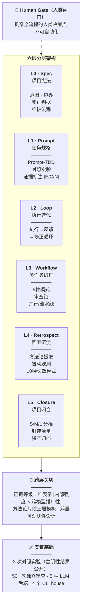

# AI 协作项目全生命周期框架

[](https://creativecommons.org/licenses/by/4.0/)

这套框架帮助独立创作者把零散的 AI 对话转化为可执行、可验证、可复盘、可封存的完整项目流程。

**适用对象 / For**：个人独立使用 AI 工具推进项目的创作者（solo creators）。  
**你将获得 / Get**：六层生命周期方法、Prompt-TDD 实验规范、独立审查流程与项目闭合清单。  
**最快入口 / Start**：打开 [`AI协作项目全生命周期框架.md`](AI协作项目全生命周期框架.md)，先读 §1.4–§1.7。

**版本 / Version**：v1.6.4（2026-06-22）· **状态 / Status**：Working Paper（持续更新；引用请注明版本）· **许可 / License**：CC BY 4.0 · **编码 / Encoding**：UTF-8  
**语言 / Languages**：简体中文为准 · [正體中文](zh-Hant/README.md) · [English](en/README.md) · **AI 生成 / AI-assisted**：本仓库大部分内容由人机协作生成，详见 [PUBLISHING.md](PUBLISHING.md)

[]()
[](./en/README.md)
[](./zh-Hant/README.md)

> **English Abstract**: A comprehensive methodology framework for **full-lifecycle human-AI collaboration** — from project initiation, execution, and independent review through to archival. ~68,000 Chinese characters; empirically tested through **3 controlled prompt engineering experiments** (Prompt-TDD) and **50+ rounds of multi-model independent review** across 5 LLM backends. Covers: specification-driven development (Spec Coding), prompt experiment design with evidence grading, multi-agent workflow orchestration, passive observation mechanisms for serendipitous discovery, and project closure protocols. Full **[English translation](en/)** available. The independent review methodology has been extracted as a standalone toolkit: **[Independent Review Toolkit](https://github.com/redamancy231-create/independent-review-toolkit)** — SOP + prompt templates + adversarial challenge framework + real examples. Licensed **CC BY 4.0**.

> 📖 ~16.8万字符 | 六层架构 | 3次对照实验 | 50+轮多后端独立审查 | Spec Coding · Prompt-TDD · 项目闭合



一套描述"如何用 AI 协作跑完一个完整项目"的元层次操作规范——从启动、执行、审查到封存的全生命周期流程框架。核心信念：方向盘 > 发动机、分层不互相替代、从失败反向沉淀、AI 闭环 ≠ 人类审查。

> **定位声明**：这是一个**半开放的个人方法论工具**——它不追求成为独立于作者的"通用框架"（一个人不可能拥有覆盖所有项目类型、工具链、验证独立性的经验谱系）。它提供的是经过多后端审查和对照实验证据标注的个人实践模式。欢迎参考、改编、和贡献反例；但读者应预期需要翻译成本才能适配自己的场景。详见 §1.8 局限 #9 和 `_research/通用框架可行性讨论_20260621.md`。

### 项目性质

**这是一份小型技术文档，不是软件项目。** 本仓库不包含可运行的应用程序、库或 Web 服务。这里的"代码"是文档生成脚本（MD → JSON/DOCX 转换），"数据"是审查报告和案例研究，核心交付物是一份约 16.8 万字符（含 ~6.8 万中文字）的 Markdown 文档。

如果你在找：下载安装指南、API 文档、Demo 页面 —— 这些这里都没有。  
如果你在找：一套经过实证检验的 AI 协作方法论框架 —— [`AI协作项目全生命周期框架.md`](AI协作项目全生命周期框架.md) 是入口。

---

## 主文档规模

主文档 `AI协作项目全生命周期框架.md` 是一份约 16.8 万字符（约 320 KB）的 Markdown 文档，以中文为主（~6.8 万汉字），含若干代码块、表格和 Mermaid 图表。精确的字符级统计随版本变动，不在此维护；如需当前数值可运行 `_workflows/count_chars_v164.py`。

---

## 目录结构

```
AI协作项目全生命周期框架/
│
├── AI协作项目全生命周期框架.md        ← 📖 主文档（入口）
├── AI协作项目全生命周期框架.json       ← 机器可读版
├── AI协作项目全生命周期框架.docx       ← Word 版（pandoc 生成）
├── README.md                           ← 本文件（结构导航）
├── CLAUDE.md                           ← AI 助手项目指令
├── PUBLISHING.md                       ← 发布边界与 AI 生成声明
├── LICENSE                             ← CC BY 4.0 许可证
├── VERSION                             ← 版本号（1.6.4）
├── project_status.md                   ← 项目状态追踪
├── reference_files.md                  ← 关键文件索引
├── project.yaml                        ← DOCX 管道项目配置
├── inventory.csv                       ← 文件清单（与发布包内容一致）
├── verify_version_consistency.py       ← 版本一致性校验脚本
├── .gitignore                          ← 发布包边界定义
│
├── _archive/                           ← 🗄 历史封存
│   ├── 元审查合规清单.{md,json}          — 框架自身合规审查
│   ├── 独立审查标准操作程序_SOP.{md,json} — 审查 SOP v1.0
│   ├── provenance_erratum_20260617.md   — 模型 provenance 勘误
│   ├── v1.5.1冻结期_待执行协议清单.md     — 冻结期协议清单（已归档）
│   └── docx_legacy_scripts/             — DOCX 旧版生成脚本归档（含 README 说明取代关系）
│
├── _mermaid_png/                       ← 🎨 图表源码 + 矢量图
│   └── *.mmd（源）/ *.emf（矢量）        — Mermaid 源码 + EMF 矢量图
│                                          （PNG/SVG/PDF 渲染缓存不入库，见 .gitignore）
│
├── _protocols-and-tools/               ← 📋 协议 + 工具 + 配套文档
│   ├── meta-audit-checklist.{md,json}   — 元审查合规清单 v1.0.4+（75 项）
│   ├── methodological-review-sop.{md,json} — 独立审查 SOP v1.0.4
│   ├── 框架级成熟度评估表.{md,json}       — 框架自身成熟度评估 v0.4
│   ├── 外部依赖登记表.{md,json}          — 工具链/模型/平台依赖追踪
│   ├── 可调参数索引.md                   — 魔法数字集中索引
│   ├── import_integrity_check.py        — Python 导入检查工具（已弃用，见主文档 §9.1）
│   ├── AI协作项目全生命周期框架_OPEN4试读计时协议.{md,json}
│   └── AI协作项目全生命周期框架_人类专家verify包.{md,json}
│
├── _research/                          ← 🔬 案例研究材料
│   ├── CCR作为逃生口案例研究.{md,json}
│   ├── CacheAligner与AI框架OPEN-1对标分析.{md,json}
│   ├── ChatGPT-5.5独立审查_headroom对标三文档.{md,json}
│   ├── SmartCrusher方法论提取.{md,json}
│   ├── headroom对标分析_封存说明.{md,json}
│   ├── 通用框架可行性讨论_20260621.md
│   ├── 两次试跑对比_2026-06-22.md
│   └── drafts/                         — 废弃草案（v1.3.2 / v1.5.1）
│
├── _reviews/                           ← 🔍 多后端独立审查报告
│   ├── (各版本审查报告 + 交叉验证记录 .md/.json/.txt)
│   ├── prompts/                        — 审查提示词
│   ├── last_messages/                  — CLI 输出片段
│   └── retrospects/                    — 复盘记录
│
├── _workflows/                         ← ⚙ 构建 + 同步 + 翻译脚本
│   ├── regenerate_docx.py               — DOCX 全量重生成（Mermaid + pandoc + 样式）
│   ├── regenerate_inventory.py          — 重生成 inventory.csv
│   ├── count_chars_v164.py              — 字符级统计
│   ├── sync_v16{1,2,3,4}_docx.py        — 各版本 DOCX 同步（历史）
│   ├── i18n/                            — 翻译管道（术语表 + 翻译/检查脚本 + 审查报告）
│   └── *.js                            — Workflow 定义脚本
│
├── en/                                  ← 🌐 English translation
│   ├── README.md
│   ├── AI协作项目全生命周期框架.md
│   └── reference_files.md
│
└── zh-Hant/                            ← 🌏 正體中文翻譯
    ├── README.md
    ├── AI协作项目全生命周期框架.md
    └── reference_files.md
```

---

## 快速导航

| 你想…… | 从这里开始 |
|---------|-----------|
| 了解框架内容 | [`AI协作项目全生命周期框架.md`](AI协作项目全生命周期框架.md) |
| 机器处理/交叉分析 | [`AI协作项目全生命周期框架.json`](AI协作项目全生命周期框架.json) |
| 了解项目当前状态和待办 | [`project_status.md`](project_status.md) |
| 查找特定文件 | [`reference_files.md`](reference_files.md) |
| 查看独立审查记录 | [`_reviews/`](_reviews/) |
| 查看审查 SOP | [`_protocols-and-tools/methodological-review-sop.md`](_protocols-and-tools/methodological-review-sop.md) |
| 了解框架成熟度 | [`_protocols-and-tools/框架级成熟度评估表.md`](_protocols-and-tools/框架级成熟度评估表.md) |

---

## 时间限阅读路径 | Time-Boxed Reading Paths

> **难度 / Difficulty**：沿用主文档 §9.9 的 ☆☆☆ 入门、★☆☆ 基础、★★☆ 进阶、★★★ 高级。

### 🕐 5 分钟 | 5 minutes — 判断是否适合我 / Is this for me?
- **阅读 / Read**：本 README + §1.1「核心理念」+ §1.8「已知局限与诚实声明」（§1：☆☆☆ 入门）
- **目标 / Goal**：判断这套框架是否适合你的需求 / Decide if this framework fits your needs.

### 🕐 30 分钟 | 30 minutes — 理解核心机制 / Understand the core mechanisms
- **阅读 / Read**：§1「框架总览」→ §2「L0: Spec（项目宪法）」→ §3「L-H: Human Gate（人类闸门）」+ §9.9「阅读导航与难度分层」（§1–§2：☆☆☆ 入门；§3：★☆☆ 基础；§9.9：☆☆☆ 入门）
- **目标 / Goal**：理解最重要的两个层级，以及如何导航其余内容 / Understand the two most important layers and how to navigate the rest.

### 🕐 2 小时 | 2 hours — 跑通一个实验 / Run one experiment
- **阅读 / Read**：§4「L1: Prompt（任务规格）」+ §4.1.1.1「对照实验设计强制检查清单」+ §6「L3: Workflow（多任务编排）」（§4：★☆☆ 基础；§6：★★☆ 进阶）
- **目标 / Goal**：设计并执行你的第一个受控 Prompt 实验 / Design and execute your first controlled prompt experiment.

### 🕐 完整采纳 | Full Adoption — 端到端掌握 / End-to-end mastery
- **阅读 / Read**：按顺序通读 §1–§14，再阅读 `_protocols-and-tools/` 补充材料（覆盖 §9.9 的 ☆☆☆→★★★ 全部难度层级）
- **目标 / Goal**：将完整框架应用于一个真实项目，从启动一直推进到闭合 / Apply the full framework to a real project from start to closure.

<!-- GPT-5.6-Sol (via Codex CLI), 2026-07-17 -->

---

## 子目录命名约定

| 前缀 | 含义 |
|------|------|
| `_` | AI 工作中间产物（不被人类直接消费） |
| 无前缀 | 人类直接消费的核心文件 |

`_archive` / `_mermaid_png` / `_reviews` / `_workflows` 均为 AI 工作目录。  
`_protocols-and-tools` / `_research` 人类可读，但非主文档。

---

## 三件套约定

主文档同时维护三种格式：

| 格式 | 用途 | 消费者 |
|------|------|--------|
| `.md` | 权威版本 | 人类 + AI |
| `.json` | 结构化配套 | 机器（脚本消费、交叉验证） |
| `.docx` | 传统分发 | 人类（Word 阅读/打印） |

`.json` 和 `.docx` 均由 `.md` 派生，修改以 `.md` 为准。

---

## 审查链

本框架经 **5 种后端 × 5 个 CLI** 的多轮独立审查，审查谱系记录于主文档 § 审查链。所有审查报告归档于 [`_reviews/`](_reviews/)。

---

## 相关项目 | Related Projects

本仓库是方法论上游，以下 6 个仓库均为其派生或实证项目：

```
ai-collaboration-framework  ← 方法论上游（本仓库）
├── independent-review-toolkit   ← §9.2 审查 SOP 提取
├── prompt-tdd-methodology       ← §4.1.1 实验方法论提取
├── claude-skills               ← §9.2–§9.3 Claude Code 技能提取
├── docx-pipeline               ← DOCX 生成管道提取
├── ma-case-study-pipeline      ← 六层框架实证案例
└── etf-pattern-match-pybind11  ← 采用审查/观测/闭合协议
```

| 项目 | 关系 |
|------|------|
| [**Independent Review Toolkit**](https://github.com/redamancy231-create/independent-review-toolkit) | **上游提取**：从本文档 §9.2 + 50+ 轮实战审查提炼的审查 SOP。**复制 prompt 即可用**。 |
| [**Prompt-TDD Methodology**](https://github.com/redamancy231-create/prompt-tdd-methodology) | **上游提取**：Prompt 对照实验方法论案例手册——SOP + 两个真实实验（含阴性结果）。本文档 §4.1.1.1 的 CK1-CK6 提取自此项目。 |
| [**Claude Skills**](https://github.com/redamancy231-create/claude-skills) | **上游提取**：3 个 Claude Code Skill——会话交接 · CLAUDE.md 编写 · 事前否决。从本文档 §9.2–§9.3 + 50+ 轮跨模型审查提炼。 |
| [**DOCX Pipeline**](https://github.com/redamancy231-create/docx-pipeline) | **上游提取**：Markdown → 中文 DOCX 泛化管道——双后端 + Mermaid + 4 模板。从本文档的 DOCX 生成管道提炼。 |
| [**M&A Case Study Pipeline**](https://github.com/redamancy231-create/ma-case-study-pipeline) | **下游实证**：框架六层理念在并购重组案例中的八阶段端到端实证（含交叉双盲审 + 对照实验 + 可复用 playbook）。 |
| [**ETF Pattern Match — pybind11**](https://github.com/redamancy231-create/etf-pattern-match-pybind11) | **下游采用**：pybind11/C++20 加速实践——采用本框架的多后端审查、被动观测、项目闭合协议。DTW 34× / pattern match 53×。 |

---

*生成模型：DeepSeek-V4-Pro (via Claude Code CLI) · 2026-07-01*  
*目录结构与文件计数校正：Claude Opus 4.8 (via Claude Code CLI) · 2026-06-23 — 移除已迁出的构建产物/缓存条目，对齐发布包真实结构（经 Codex GPT-5.5 独立清点交叉验证）*