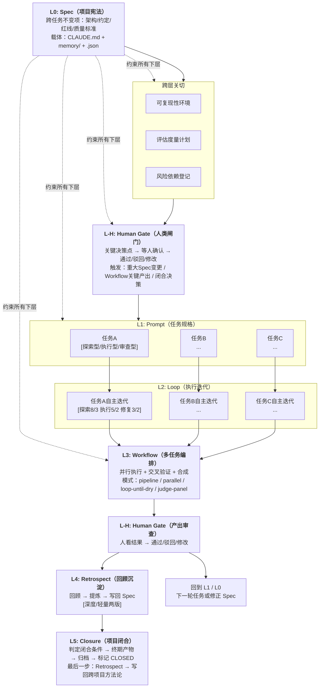
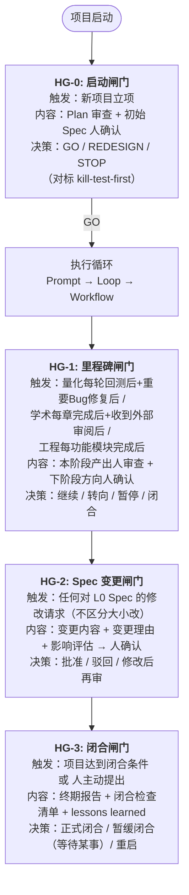
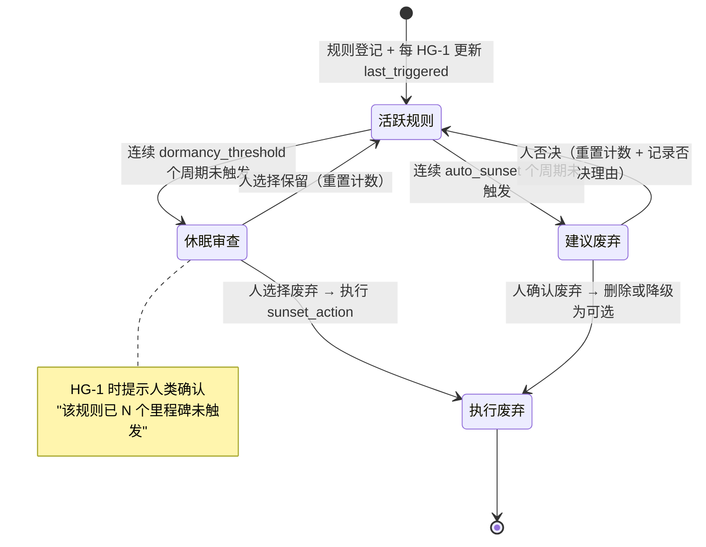
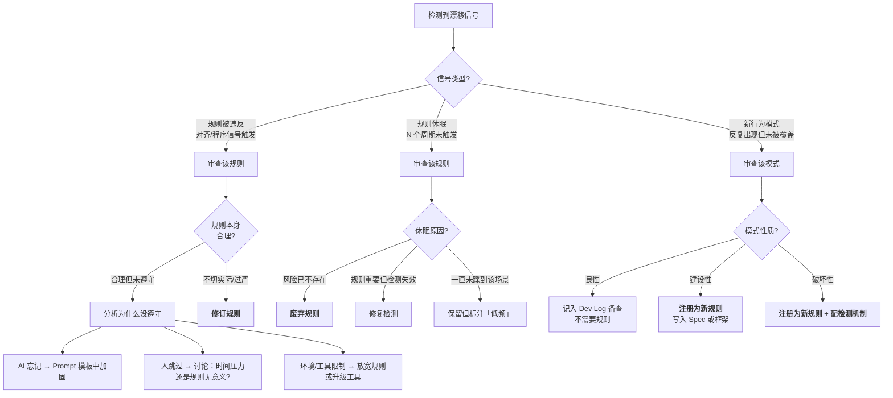
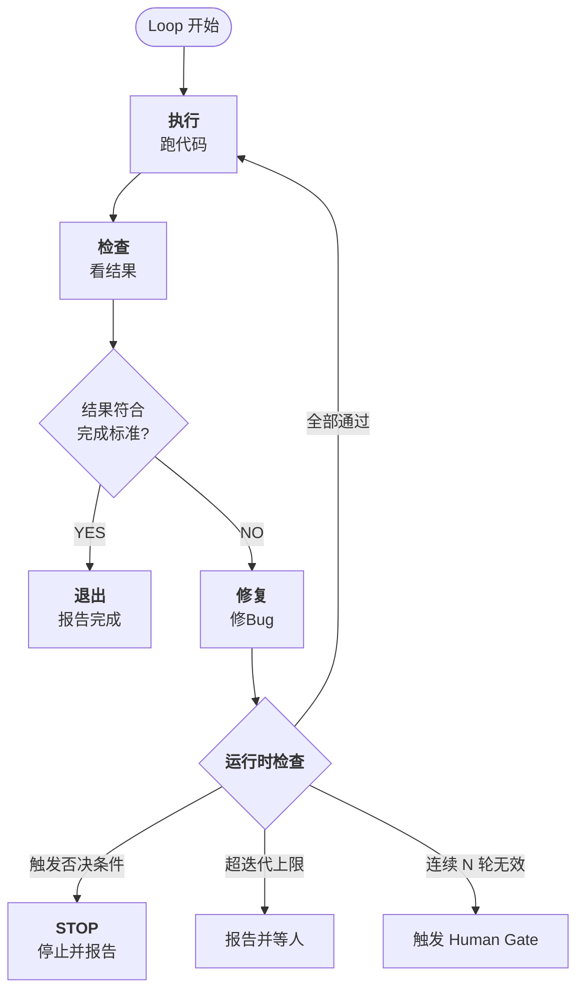
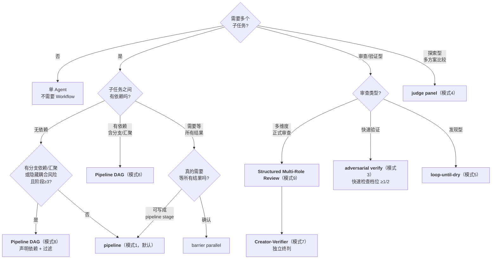

# AI Collaboration Project Full-Lifecycle Framework

> **Version**: v1.6.4 (**v1.6.4: prompt-tdd A1 experiment Write-Back §6.3.2 - Flow-as-Node Nested Workflow controlled evidence [E-] ceiling-limited**)  
> **Date**: 2026-06-22  
> **Generated model**: DeepSeek-V4-Pro (via Claude Code CLI shell)  
> **Translation**: GPT-5.5 (via Codex CLI), 2026-06-24 — initial translation  
> **Adversarial review**: Qwen3.7-Max (via Qwen Code CLI), 2026-06-24 — accuracy & consistency (report: `_reviews/qwen_en_translation_review_20260624.md`)  
> **Readability review**: Kimi-K2.6 (via Kimi Code CLI), 2026-06-24 — native fluency & academic publishability (report: `_reviews/kimi_en_translation_review_20260624.md`)  
> **Code block fixes**: DeepSeek-V4-Pro (via Claude Code CLI), 2026-06-24 — ~131 template/checklist labels; Codex GPT-5.5 (via Codex CLI), 2026-06-24 — 155 residual lines (report: `_reviews/codex_block_fix_report_20260624.md`)  
> **Pre-release correction (2026-06-23, Claude Opus 4.8 via Claude Code CLI)**: Wording corrections and intelligibility supplements without a version bump (stale timeliness statement update + new §13.1.2 project codename explanation + tone neutralization for public readers). No mechanism or Evidence Level changes. See §14, "v1.6.4 Pre-Release Correction Batch."
> **v1.6.4 additions (2026-06-22, DeepSeek-V4-Pro via Claude Code CLI)**: prompt-tdd A1 Flow-as-Node Tier 0 controlled experiment Write-Back - added §6.3.2 Flow-as-Node Nested Workflow controlled evidence [E-] ceiling-limited (Tier 0 negative evidence; 3/5 categories at ceiling, ΔF1=0.000). Confirmed through a 7-round dual-backend Review Chain (Codex GPT-5.5 ×4 + Qwen qwen3.7-max ×3), with 0 unclosed findings. Header metadata also updated with the A1 Write-Back statement. See §14.  
> **v1.6.2 additions (2026-06-21, DeepSeek-V4-Pro via Claude Code CLI)**: Cross-case analysis based on three Opportunistic Observation events in the user memory system (`method_llm_review_coverage_single_run` / `methodology_review_prompt_mechanical_checks` / `todo_verify_glm5_identity`), adding §7.7, "Opportunistic Observation: A Discovery Mechanism for Accidental Findings." The concept underwent Codex GPT-5.5 Adversarial Independent Review (2026-06-21, overall judgment: conditionally supported). The review feedback has been systematically incorporated: definition tightened (does not claim "can only be discovered opportunistically"), patterns downgraded to "currently identified" (not a complete classification), expanded classification framework added (pending empirical validation), Failure Space added (10 failure modes + hard constraints), and the deep Retrospect template strengthened (discovery mode / verification status / applicability boundary). Accompanying updates: table of contents, §14 changelog, §9 cross-layer cross-references, and Appendix C deep Retrospect template. See §14.  
> **v1.6 additions (2026-06-20, DeepSeek-V4-Pro via Claude Code CLI)**: This is a Minor upgrade with 7 additions/enhancements. (P0) Source: A2+A3 deep Retrospect + Codex v1.5.5 Cross-Verification: §9.6.1 two-dimensional representation of Evidence Level + §9.10 Methodology Fragment Three-Layer Model + §4.1.1.1 Mandatory Checklist for Controlled Experiment Design (6 items). (P1) Source: cross-version practice normalization + derivation from review feedback: §2.6 framework maintenance process + §1.8 Honesty Statement + §9.9 Path D + reverse cross-references in Appendix H. See §14. **Note**: The initial v1.6 draft was edited by a single backend, DeepSeek-V4-Pro, then underwent Codex GPT-5.5 Cross-Backend Cross-Verification (initial review -> re-review; 2 MAJOR + multiple MEDIUM items all fixed and closed; see §14 and `_reviews/codex_v16_crosscheck_*`).
> **Protocol 3 Trial Run 1 Write-Back (2026-06-16, edited via Codex CLI)**: The first real trial run of the "methodology for extracting methodology" project has closed (M-tier; 14/20 loops at closure; after Phase 8 Kimi verification, corrected to 15/20 after closure, 58 findings, 0 CRITICAL/MAJOR residual items). Based on the trial-run Retrospect, the Phase 7 review series, and `框架级成熟度评估表.md` §9, this release writes 6 Protocol 3 improvements back into the main document: C1/C5 measurement methods, HG-0 Plan/Spec dual review, adaptive review frequency increase, HG interaction retention, C8 recommendation for >=2 Cross-Backend rounds, and S-tier downgrade-threshold note. Sources are uniformly marked as "[Protocol 3 Trial Run 1 Feedback, 2026-06-16]."  
> **Mermaid visualization conversion (2026-06-16, DeepSeek-v4-pro via Claude Code CLI)**: Converted 6 ASCII/indented text diagrams into ` ```mermaid ` code blocks (§1.2 lifecycle overview / §3.2 gate flowchart / §3.7.4 Rule Sunset state diagram / §3.7.6 curation decision tree / §5.2 Loop cycle diagram / §6.3 pattern-selection decision tree). The conversion plan was independently reviewed and confirmed by **ChatGPT-5.5 (Codex CLI, GPT-5.5)**. The two backends agreed on 4/5 priority diagrams; the difference (§3.2 vs §3.7.4 priority) was reconciled by "doing all." Selective conversion principle followed: process/decision/state transition -> Mermaid; pseudocode/tables/directory trees -> kept as-is. This falls under the Freeze Period whitelist item "fix confirmed bugs": ASCII box diagrams are prone to misalignment and hard to maintain across rendering environments. Mermaid changes no mechanism content, only presentation format.  
> **PocketFlow methodology transformation A-class asset Write-Back (2026-06-18, DeepSeek-v4-pro via Claude Code CLI)**: Based on A-class assets produced by three rounds of independent PocketFlow analysis (DeepSeek-V4-Pro / ChatGPT-5.5 / GLM-5.2, 2026-06-16 to 2026-06-18), meaning methodology improvements that can be written directly back into the framework without additional validation experiments, this version (v1.5.3) writes back 3 items: (1) **B2 asset -> new §9.9, "Reading Navigation and Difficulty Stratification"** - marks 15 sections/items by difficulty ☆☆☆/★☆☆/★★☆/★★★ and provides 3 recommended reading paths; (2) **B1 asset -> new §1.7, "The Framework's Own Architecture Principle: Minimum Core + Example Companion"** - defines distinction criteria between core (mandatory rules in the main document) and companion (reference implementations in companion directories), plus warnings for 4 anti-patterns; (3) **PF anti-pattern asset group -> new "Appendix H: Anti-Pattern Catalog"** - centralizes 4 independently reviewed anti-patterns with confirmed transferability. The original §6.5.1 "File System as IPC" entry is moved here, and 3 PocketFlow-derived entries are added. Accompanying updates: cross-references to §9.9 and §1.7 added at the end of §1.4; cross-reference to §1.7 added at the end of §1.6. All new content is marked with source "[PocketFlow Methodology Transformation, 2026-06-18]." See §14.
> **prompt-tdd A2 experiment Write-Back (2026-06-19, DeepSeek-v4-pro via Claude Code CLI)**: prompt-tdd A2 Tier 1 controlled experiment completed - prep/exec/post segmented prompt vs integrated numbered-list prompt, code-review domain, GPT-5.5 (temp=0), n=24/arm. H1 was not supported (A_flat correctness_rate=0.954 >= B_structured=0.935, direction opposite to the hypothesis). PF-8 asset updated from blank [Sp] to [E-] (not supported in a single-domain experiment), honestly recorded in §4.1.1. See §14.
> **prompt-tdd A3 experiment Write-Back (2026-06-20, DeepSeek-V4-Pro via Claude Code CLI)**: prompt-tdd A3 Action Routing controlled experiment completed (v1 + Pilot) - declarative vs NL routing description, GPT-5.5 (temp=0), Chinese routing tasks, 6-15 actions. Neither experiment detected a Format Effect (Δ=0, discordant rate=0%), confirmed through a 10-round Review Chain (including Codex GPT-5.5 ×4, Qwen qwen3.7-max ×3, merge/consultation/alignment ×1 each; not all were homogeneous Independent Review rounds). PF-9 asset recorded as [E-] (Negative Conclusion; Format Effect not detectable under the above conditions), honestly recorded in §6.3. See §14.
> **prompt-tdd A1 experiment Write-Back (2026-06-22, DeepSeek-V4-Pro via Claude Code CLI)**: prompt-tdd A1 Flow-as-Node Tier 0 controlled experiment completed - hierarchical workflow description vs content-equivalent flat description, coding-agent workflow-understanding domain, GPT-5.5 (temp=0), n=20/arm. H1 was not supported (Δ median F1 = 0.000, 3/5 categories at ceiling). Confirmed through a 7-round dual-backend Review Chain (Codex GPT-5.5 ×4 + Qwen qwen3.7-max ×3), with 0 unclosed findings. PF-A1-001 asset updated from blank [Sp] to [E-] ceiling-limited (Tier 0 negative evidence; only C4/C5 had discriminative space, each with n=4), honestly recorded in §6.3.2. See §14.

> **Freeze Period editing record (2026-06-14/15, cross-day edit)**: Structural revisions to this document during the v1.5.1 Freeze Period were performed by **GLM-5.2 (via ZCode CLI shell)** (editing began at 2026-06-14 23:14 and continued after the free quota refreshed at 2026-06-15 00:00). **Important provenance statement**: GLM-5.2 is the **fifth backend** outside the framework Review Chain lineage (when the GLM-5.2 editor became involved, there were already five backends: DeepSeek-v4-pro / Opus 4.8 / ChatGPT-5.5 / Kimi-K2.7-Code / Qwen3.7-Max, across four CLI houses: Claude / Codex / Kimi / Qwen). In this edit, GLM-5.2 **served only as editor, not as Independent Reviewer**; its revisions were based on evidence already recorded by the framework itself (Codex review reports, §10.8 maturity assessment, etc.). **This edit introduced explicitly marked editorial judgments (line-by-line grading and distribution estimates in F9 maturity assessment; Protocol 2 Cold Read prompt and interpretation rules in F10), pending independent recheck**. All revisions were within the Freeze Period whitelist: "fix confirmed bugs / add honesty artifacts that a zero-trial-run state can support"; no new [Sp] sections were added. **For the itemized revision list, see §14, "v1.5.1 Freeze Period Editing Record (GLM-5.2)."** Under the Independent Review standard in framework §9.2, this edit's independence level is **[SEMI-ED]** (editorially independent from content creation, but GLM-5.2's revision instructions were provided by the user and the revision target was selected by the user). When later Independent Reviewers recheck this revision batch, they should: (a) verify whether each revision truly counts as "fixing a bug" rather than "adding a mechanism"; (b) verify whether GLM-5.2 introduced any undeclared substantive judgments.
> **Freeze statement (from 2026-06-14; release conditions satisfied on 2026-06-16)**: v1.5.1 once entered a Freeze Period. Before completing >=1 real trial run + Retrospect Write-Back (producing the initial Framework-Level Maturity Assessment Table), **no new [Sp] / mechanism sections are accepted**. During the Freeze Period, only the following are allowed: (a) fixing confirmed bugs (version drift / broken references / editorial disorder), (b) executing protocols already designed but not yet run (OPEN-4 trial read, OPEN-1 verify), and (c) adding honesty artifacts that a zero-trial-run state can support (framework-level maturity table). **Reason**: the framework itself has recorded the tendency that "Adding Complexity Is Easier Than Removing It" (the v1.3.2 correction-roadmap lesson on "Second-Order Confirmation Bias" + four [Sp] sections added on the same day in v1.5.1), but this had not yet become an execution constraint. The freeze turns the lesson text into discipline. Freeze release condition = completion of Trial Run 1 Retrospect; this condition was satisfied by Protocol 3 Trial Run 1, and this version is the trial-run Write-Back. See §14.
> **Independent Review**: v1.4: ChatGPT-5.5 (5.37) + Kimi-K2.7-Code (5.00) / v1.5: ChatGPT-5.5 C+ (5.43/10) / v1.5.1 draft: Codex ChatGPT-5.5 R3 (4.3, rejected) -> R4 (7.2, passed after revision)  
> **Status**: **Draft, with two real trial runs written back (analytical + experimental), still pending multi-project validation** (v1.6.4: prompt-tdd A1 experiment Write-Back §6.3.2 [E-] ceiling-limited / v1.6.3: maintenance process completion + Honesty Statement expansion / v1.6.2: Opportunistic Observation mechanism / v1.6: evidence system upgrade + maintainability enhancement / v1.5.5: prompt-tdd A3 experiment Write-Back §6.3.1 [E-] / v1.5.4: prompt-tdd A2 experiment Write-Back §4.1.1 [E-] / v1.5.2: Protocol 3 Trial Run 1 feedback Write-Back; v1.5.1 additions: §3.7.0 Event Stream Health Monitoring [Sp] + §3.7.4.1 Adaptive Weight Pruning [Sp] + §9.7 Experience Injection Context Budget Rule [Sp] + §9.8 Research Experience Object (REO) [Sp]. Methodology source = Evolver project analysis (arXiv:2604.15097, overall score 4.1-4.2/10, four rounds of Independent Review across three backends). Full specification in `_research/框架v1.5.1_新增节草案.md`. v1.5 additions: §6.2 Pattern 8/9 + §9.2 + §9.6. v1.4 additions: §3.7.2.6/§5.3.1/§6.2/§6.5.1/§9.1/§1.5/§9.4/Appendix H. v1.3 residual OPEN-1~4 status unchanged (OPEN-5 closed during the v1.5.1 Freeze Period -> §8.8))  
> **v1.5 methodology source**: GitNexus analysis project (full analysis of a 42K-star code knowledge graph tool + 9-agent workflow + three rounds of Independent Review + evidence classification practice). See §14 changelog.  
> **v1.3 update**: Added §3.7 Drift Detection Layer, upgrading OPEN-1 "Discrete Reviews Cannot Detect Continuous Drift" from a candidate draft into a formal continuous monitoring layer (Five Categories of Drift Signals + alert aggregation + Rule Sunset automation + Constitutional Audit + Closed-Loop Curation + complete monitoring template). The design is inspired by headroom CacheAligner's detector-only philosophy (detect only, do not block), with boundaries confirmed by ChatGPT-5.5 independent adjudication. §1.6 OPEN-1 was simultaneously updated to "operationalized -> §3.7, pending trial-run validation." See §14 changelog.  
> **v1.2 update**: Calibrated through a three-model Independent Review Chain (ChatGPT-5.5 review -> DeepSeek-v4-pro re-review -> ChatGPT-5.5 response -> Opus 4.8 second re-review). Changes in this version: (1) status changed from "finalized" to "draft frozen, awaiting trial-run validation"; (2) added §1.4 Usage Intensity Tier (Minimum Mandatory / Default / Full Edition); (3) added §1.5 the framework's own Kill Criteria; (4) added §1.6 OPEN Items Registry + §3.6 continuous drift and Human Gate frequency-coverage gap (OPEN-1, the highest-impact finding identified by the Review Chain); (5) corrected §13.1 external benchmarking statement of "unique contribution" and added personal-level / organization-level comparison table. See §14 changelog.  
> **v1.1 update**: Added Chapter 10, "Cross-Layer Artifact: Dev Log (Development Log)" - formalized from ETF project V3.6 code header comment practice + peer experience into a cumulative changelog + FK navigation + persistent artifact independent of code  
> **Companion files**: `AI协作项目全生命周期框架.json`, `_reviews/AI协作项目全生命周期框架_对ChatGPT-5.5回应的再再审查.md` (final opinion of the Review Chain), `methodological-review-sop.md` + `.json` (Independent Review SOP v1.0.3, operational implementation of framework §9.2), `meta-audit-checklist.md` + `.json` (meta-review compliance checklist v1.0.3, execution-layer tool derived from framework §9.2). **Archival note**: the old v1.0 Chinese-name files (`独立审查标准操作程序_SOP.{md,json}` + `元审查合规清单.{md,json}`) have been replaced by English-name v1.0.3 files and moved to `_archive/`; the `.json` companions for ChatGPT-5.5's three-document headroom benchmark review were completed during the v1.5.1 Freeze Period.

---

## Table of Contents

1. [Framework Overview](#1-framework-overview)
   - [1.7 The Framework's Own Architecture Principle: Minimum Core + Example Companion](#17-the-frameworks-own-architecture-principle-minimum-core--example-companion)
   - [1.8 Known Limitations and Honesty Statement](#18-known-limitations-and-honesty-statement)
2. [L0: Spec (Project Constitution)](#2-l0-spec-project-constitution)
   - [2.6 Framework Maintenance Process](#26-framework-maintenance-process)
3. [L-H: Human Gate](#3-l-h-human-gate)
   - [3.6 Known Gap (OPEN-1)](#36-known-gap-pending--open-1-continuous-drift-and-human-gate-frequency-coverage)
   - [3.7 Drift Detection Layer (v1.3 addition)](#37-drift-detection-layer-from-discrete-gates-to-continuous-observation-v13)
4. [L1: Prompt (Task Specification)](#4-l1-prompt-task-specification)
   - [4.1.1.1 Mandatory Checklist for Controlled Experiment Design](#4111-mandatory-checklist-for-controlled-experiment-design)
5. [L2: Loop (Execution Iteration)](#5-l2-loop-execution-iteration)
6. [L3: Workflow (Multi-Task Orchestration)](#6-l3-workflow-multi-task-orchestration)
7. [L4: Retrospect (Post-Mortem Analysis)](#7-l4-retrospect-post-mortem-analysis)
   - [7.7 Opportunistic Observation: A Discovery Mechanism for Accidental Findings](#77-opportunistic-observation-a-discovery-mechanism-for-accidental-findings)
8. [L5: Closure (Project Closure)](#8-l5-closure-project-closure)
9. [Cross-Layer Concerns](#9-cross-layer-concerns)
   - [9.6.1 Two-Dimensional Representation of Evidence Level](#961-two-dimensional-representation-of-evidence-level-internal-strength--cross-model-generalizability)
   - [9.9 Reading Navigation and Difficulty Stratification](#99-reading-navigation-and-difficulty-stratification)
   - [9.10 Methodology Fragment Template: Three-Layer Model](#910-methodology-fragment-template-three-layer-model)
   - [9.11 Cross-Layer Observability Design](#911-cross-layer-observability-design)
10. [Cross-Layer Artifact: Dev Log](#10-cross-layer-artifact-dev-log)
11. [Integration with Existing Systems](#11-integration-with-existing-systems)
12. [Appendix: Templates and Checklists](#12-appendix-templates-and-checklists)
    - [Appendix H: Anti-Pattern Catalog](#appendix-h-anti-pattern-catalog)
13. [External References and Positioning](#13-external-references-and-positioning)
14. [Changelog (v1.1 -> v1.6.4)](#14-changelog-v11--v164)

---


## 1. Framework Overview

### 1.1 Core Ideas

This framework describes **how to complete an entire project through AI collaboration**. It is not a manual for a specific project, but a meta-level specification for project methodology.

Four core beliefs:

1. **Steering Wheel > Engine**: getting the direction right matters more than having more compute. Weak Prompt (direction) + strong Loop/Workflow (compute) = efficiently rushing in the wrong direction.
2. **Layers Are Not Interchangeable**: Spec/Prompt/Loop/Workflow each governs a different problem. A weak upper layer cannot be compensated for by a strong lower layer.
3. **Reverse Precipitation from Failures**: Spec is not written correctly in one pass. It is distilled backward from every failure and surprise.
4. **AI Internal Closed Loop ≠ Human Review**: the framework covers what AI can do, but critical nodes must have Human Gate judgment.

### 1.2 Complete Lifecycle View



> **Figure 1**: Overview of the framework's seven-layer lifecycle. Solid arrows = data/control flow; dashed arrows = Spec constraint relationships. L-H appears twice in the process: before execution (gate) and after output (review).

### 1.3 Seven Layers + Four Cross-Layer Concerns at a Glance

| Layer | Name | Governs | Granularity | Change Frequency | Existing Counterpart |
|----|------|--------|------|----------|-----------|
| L0 | Spec | Cross-task invariants | Project-level | Low frequency (revised when new constraints are discovered) | CLAUDE.md + memory/ |
| L-H | Human Gate | Decisions AI cannot make on behalf of humans | Decision point | Triggered by milestone | `feedback_independent_review_reminder.md` |
| L1 | Prompt | Specification for a single task | Task-level | Different each round | Concrete instructions in the session |
| L2 | Loop | Trial-and-error convergence during execution | Iteration-level | Millisecond-level | Model autonomous iteration (run -> error -> fix) |
| L3 | Workflow | Parallel orchestration of multiple tasks | Orchestration-level | Triggered by task | kill-test-first + Claude Code Workflow tools |
| L4 | Retrospect | Review -> extract -> Write-Back | Milestone-level | End of each milestone/stage | Project Retrospect archive report `.json` |
| L5 | Closure | When and how a project ends | Project-level | One-time | `project_status.md` marked CLOSED |

| Cross-Layer Concern | Governs | Existing Counterpart |
|----------|--------|-----------|
| Reproducibility | Environment / dependencies / data / random seeds | `reference_python_versions.md` (partial) |
| Evaluation Metrics | How to judge whether the work is good | kill-test-first Kill Conditions + three-layer evaluation division of labor |
| Session Handoff | Cross-session state recovery | memory/ directory + `/session-end` skill |
| Risk Dependencies | External dependency and risk tracking | Unified risk register (Appendix F) |
| Dev Log | Cumulative changelog + FK navigation + timeline | None - **new artifact in this version** (extracted from ETF project V3.6 code-header practice) |

### 1.4 Usage Intensity Tier (Minimum Mandatory / Default / Full Edition)

This framework is a **pattern library**, not a mandatory checklist. The same document is divided into three tiers by Usage Intensity. First get it running with the Minimum Mandatory Edition, then upgrade after it meets criteria. Do not enable everything at once. Upgrading must satisfy the re-expansion conditions in §1.6 / §6.4 / §1.5; it is not enabled by default.

| Tier | Applies To | Mandatory Activation | Not Enabled for Now (Upgrade Items) |
|------|------|---------|-------------------|
| **Minimum Mandatory Edition** | Any project, first trial run | S1-S4 (status / paths / conventions / red lines), HG-0/HG-1/HG-3, three Workflow modes (pipeline / adversarial verify / discovery), Dev Log single timeline (main document only) | - |
| **Default Edition** | After stable iteration begins | + S5/S6 (success criteria / evaluation plan), HG-2 Spec change gate, lightweight Retrospect, risk register | - |
| **Full Edition** | Formal research / delivery-grade work, with re-expansion criteria met | Full set | Dev Log dual view + FK, Judge Panel, Loop-Until-Dry, Completeness Critic, full HG-2 grading, deep Closure checklist |

**Key discipline**: "Runs at 30% Complexity" - but it must say clearly which 30%, otherwise the pattern library will be mistaken for a mandatory checklist and become de facto Overengineering. This table is that explanation.

> **Difference from §8.8 Project Scale Tier**: the A/B/C tiers in this section define **how much of the framework itself is used** (Usage Intensity), while the S/M/L tiers in §8.8 define **how deep Closure should be** (closure scale). The two are orthogonal. A C-tier user can run an S-tier project, and an A-tier user can also run an L-tier project. Do not confuse them.
>
> **Relationship with §9.9 Reading Navigation**: §9.9 provides a difficulty-stratified section crosswalk and recommended reading paths. Readers encountering the framework for the first time can consult §9.9 first to choose an entry section suited to their background, rather than reading every section linearly. §1.4 answers "how much of the framework to use" (Usage Intensity Tier); §9.9 answers "where to start reading" (difficulty stratification).
>
> **Relationship with §1.7 Core vs Companion**: §1.4 governs how much to use, while §1.7 governs where to find it. Mandatory rules live in the main document (core); reference implementations live in companion directories (companion). The two are orthogonal and complementary: §1.4 answers "Runs at 30% Complexity - which 30%," and §1.7 answers "that 30% is in this main document; the remaining 70% is in companion directories and should be pulled only when needed."

### 1.5 The Framework's Own Kill Criteria

**Symmetry requirement**: the framework requires every project to have Kill Criteria (S4), and every Prompt to have Kill Criteria (the 4th element of L1). The framework itself must also have them. Otherwise, framework failure will always be explained as "poor execution" rather than "the framework is invalid." Trigger the corresponding action if **any one** condition is met (evaluated after a pre-registered baseline in the next real project):

| Criterion | Threshold | Action |
|------|------|------|
| No improvement | Across 3 consecutive real projects, handoff recovery time / rework rate / omission rate / bug traceability time improve by < 20% relative to historical baseline | Major revision |
| Maintenance cost | Framework maintenance + form-filling time > 15% of total project hours, with no quantifiable benefit | Downgrade to Minimum Mandatory Edition |
| Bypass rate | Across 2 consecutive projects, > 50% of templates/gates are actually bypassed | Restructure (framework does not fit real work) |
| Dev Log failure | In 10 real changes, > 2 omissions, or link error rate > 10%, and automation cannot reduce it below 5% | Remove "dual view + FK"; return to single timeline |
| HG overload | > 70% of HG-2 change confirmations are directly approved without substantive discussion | Gate grading |
| No incremental value from external review | 3 consecutive Independent Model Reviews find no valuable issues | Reduce frequency or change review method |

The evaluation of Kill Criteria depends on metrics **pre-registered** in the next project (handoff recovery time, Dev Log omission rate, rework count, HG wait count, review discovery rate, framework maintenance time). **Without a pre-registered baseline, Kill Criteria cannot trigger - see §1.6 OPEN-2.**

### 1.6 OPEN Items Registry

> Single-column and **not merged into any re-expansion table**, to avoid "severity flattening" (putting fatal gaps and small wording fixes into the same equal-height table and erasing the difference). The following are the framework's **known unresolved** issues; users must be aware of them before activation.

| ID | OPEN Item | Severity | Status | Details |
|----|--------|--------|------|------|
| **OPEN-1** | **Continuous drift / Human Gate frequency-coverage gap**: human review is discrete (by milestone), while AI execution is continuous (every Loop); Discrete Reviews Cannot Detect Continuous Drift; HG spot-check frequency is naturally lower than AI error frequency. **Handling trajectory**: v1.2 proposed -> v1.3 draft Loop Drift Ledger (ChatGPT-5.5 independent adjudication conditionally adopted: observe only, do not block) -> v1.3 formalized as §3.7 Drift Detection Layer (Five Categories of Drift Signals + alert aggregation + Rule Sunset + Constitutional Audit + Closed-Loop Curation + monitoring template). **Current status: operationalized -> §3.7, pending trial-run validation** (ChatGPT-5.5 Independent Review confirmed the boundary: observe only, do not block; §3.7 is an unvalidated monitoring plan. After 2-3 real project trial runs, re-evaluate whether severity can be downgraded). | **High (structural) -> Medium (operationalized plan exists, boundary confirmed by ChatGPT-5.5 Independent Review, pending empirical validation)** | **Operationalized -> §3.7, pending trial-run validation**. The Drift Detection Layer and §3.6 Loop Drift Ledger are complementary: §3.6 defines what the ledger records; §3.7 defines which signals trigger alertness, how to respond, and how to measure it. Six pre-registered validation metrics + exit conditions still await real project trial runs. | §3.6 + §3.7 |
| **OPEN-1 Handling Plan** | (Executed) v1.3 draft -> v1.3 formalization. Loop Drift Ledger (§3.6) + Drift Detection Layer (§3.7) together form the complete OPEN-1 response. ChatGPT-5.5 independent adjudication (2026-06-13) was conditionally adopted, with key constraints: "only cover drift that leaves observable traces" + "Add Observability, Not Blocking." The directional disagreement between DeepSeek-v4-pro (author) and ChatGPT-5.5 (independent) has been reconciled: intersection = "Add Observability, Not Blocking." **v1.4 addition**: §3.7.2.6 Difficulty-Stratified Monitoring is explicitly listed as an OPEN-1 sub-item pending validation (exit condition pre-registered: no incremental value in 2 consecutive ML projects -> downgrade or sunset). | Medium (stronger support after independent adjudication, pending human adjudication + real project trial runs) | Executed -> pending validation | §3.6 + §3.7 + ChatGPT-5.5 Independent Review report |
| **OPEN-1 Action** | **Next step**: arrange at least one zero-involvement human expert who did not participate in framework design to independently adjudicate the direction of the drift detection layer (whether "Add Observability, Not Blocking" is sufficient, and the dispute between "too many gates, reduce them" vs "insufficient coverage, add checks"). Deadline: [pending human confirmation]. This Action was proposed and adopted by Kimi-K2.7-Code v1.4 Independent Review (2026-06-13). | - | Pending execution | - |
| OPEN-2 | Framework-level Kill Criteria lack a pre-registered baseline. The criteria are written (§1.5), but without a baseline they cannot trigger. | Medium | **Partially validated (v1.5.2 Trial Run 1 Write-Back + v1.6.4 Trial Run 2 Write-Back)**: pre-registration carrier established = companion files `框架级成熟度评估表.{md,json}`; two real baselines have been recorded (analytical project + experimental project), but Kill Criteria still require consecutive project data before they can trigger | §1.5 + Framework-Level Maturity Assessment Table |
| OPEN-3 | The framework's "extraction accuracy" for the user's existing practice has not been evaluated. Risk: formalizing an 80-point practice into a 60-point template. This is a different issue from "whether there is external benchmarking," and the Review Chain did not engage it. | Medium | Pending evaluation | - |
| OPEN-4 | Minimum onboarding time has not been measured. The target user is an individual without onboarding resources; needs a trial read by a non-designer, measuring comprehension time and misunderstanding points. | Medium | Pending empirical measurement | §1.4 |
| OPEN-5 | Closure lacks Project Scale Tiering (half-day exploration / one-week small project / formal research); currently tiered only by project type. | Low-medium | **Covered -> §8.8** (v1.5.1 Freeze Period: added S/M/L three-tier closure requirements crosswalk, with tier-upgrade rules and orthogonality explanation relative to project type) | §8.8 |

> **Relationship with §1.7 Core vs Companion**: §1.7 describes the organizational logic of the framework materials themselves (core vs companion). Some content in companion directories `_reviews/` and `_protocols-and-tools/` is directly related to OPEN-4 (minimum onboarding time not measured). A root cause of trial-reader navigation confusion is precisely the lack of an explicit core/companion explanation.

### 1.7 The Framework's Own Architecture Principle: Minimum Core + Example Companion

> **Methodology source**: Three rounds of independent PocketFlow analysis (DeepSeek-V4-Pro / ChatGPT-5.5 / GLM-5.2), 2026-06-16. This principle is directly transformed from the B1 asset "minimum core + example companion architecture." PocketFlow's structure of "100-line core + difficulty-tiered cookbook system" is an effective knowledge-transfer pattern: the core provides execution guarantees, while the cookbook provides usage paradigms. This pattern does not depend on PocketFlow's specific implementation (100 lines is not a target number; the framework should not have "line-count worship"). What is extracted is the **organizational logic of structural layering**. [PocketFlow Methodology Transformation, 2026-06-18]

**The framework itself also follows this principle.** The full framework material is not only this main document. It has several companion files (the root directory contains the main document and governance tools) and 4 subdirectories (`_reviews/`, `_research/`, `_protocols-and-tools/`, `_archive/`). If readers do not know "which files are mandatory and which are looked up as needed," they will be buried by file count. This section explains the framework's own organizational logic and prevents two fundamental misuses: treating reference implementations as mandatory rules, or treating mandatory rules as optional appendices to skip.

**Core = main document (this file)**:

The core document is the framework's **canonical source of truth**. That does not mean every sentence is mandatory. More specifically:

- **Minimum Mandatory Core** (explicitly listed in §1.4 + Kill Criteria §1.5 + gate rules §3.2-3.5 + Escape Hatch §4.3 + closure conditions §8 + §6.3 pattern-selection decision tree): has Compliance Teeth; violations will be caught by Kill Criteria or review standards
- **Normative reference** (`[Sp]` speculative mechanisms such as §3.7.0/§9.7/§9.8, template Appendices A-G, changelog §14, candidate profiles such as §3.7.2.6): included in the main document for reference, but marked with Evidence Level and activation conditions; not equivalent to mandatory items
- **Navigation and metadata** (§9.9, §13, this document's metadata): helps readers use the framework efficiently; creates no compliance obligation

The Minimum Mandatory Core includes:
1. **Definitions of the seven layers + four cross-layer concerns** (§1.3 overview table): what each layer governs, non-overlap, and non-interchangeability
2. **Mandatory Activation Checklist** (the "Minimum Mandatory Edition" column in §1.4 Usage Intensity Tier): S1-S4, HG-0/HG-1/HG-3, three Workflow modes, and Dev Log single timeline. Any project that claims to "use this framework" but does not enable these components is deemed not to be using it
3. **Kill Criteria** (§1.5): measurable criteria for determining the framework's own validity
4. **Gate trigger conditions and decision rules** (§3.2-§3.5): when HG triggers, what humans do, and what AI does
5. **Escape Hatch rules** (§4.3 + Appendix B): stop when tools/data are unavailable; do not use substitute data
6. **Closure conditions and tiers** (§8 + §8.8): when a project ends and how deep closure should be
7. **Minimum standards for reproducibility/evaluation/session handoff** (§9): non-downgradable lower bounds across layers

The core's defining property: **it has Compliance Teeth**. Violating it will be caught by the framework's Kill Criteria or review standards. The core does not answer "what could be done"; it only answers "what must be done" and "under what conditions exemptions are allowed."

**Companion = companion directories (contextual reference implementations)**:

Four companion directories provide **contextual application templates, reference implementations, and governance records**. They are not mandatory rules. They mean "validated ways exist here; you can use them directly, adapt them, or design your own after reference":

| Directory | Role | Analogy (PocketFlow cookbook) | How to Use |
|------|------|---------------------------|---------|
| `_reviews/` | Archive of Independent Review reports and prompts | Review cookbook (e.g., `pocketflow-judge`) | Reference prompt structure and scoring dimensions when conducting Independent Review; not required to produce the same amount of review in every project |
| `_research/` | Benchmarking analysis, version drafts, methodology research | Design-document cookbook (e.g., each cookbook's `docs/design.md`) | Consult when you need to understand the "why" behind a principle; not required to conduct benchmarking research of the same depth in every project |
| `_protocols-and-tools/` | Protocol packages, execution manuals, verify tools | Tool-integration cookbook (e.g., `pocketflow-mcp`) | Follow the manual when executing a specific protocol; not required to run all protocols in every project |
| `_archive/` | Old-version archive, superseded but retained for traceability | N/A (specific to framework governance) | Consult when checking historical versions or old review conclusions; not used in daily work |

The companion's defining property: **no Compliance Teeth**. Skipping it will not trigger Kill Criteria or cause review FAIL. Its value is "you do not need to step into holes someone else already stepped into," not "you must step this way."

**Criteria for distinguishing Core vs Companion**:

The following three rules determine whether a piece of content should enter the core document (main document) or a companion directory:

| Decision Rule | Goes into Core (Main Document) | Goes into Companion Directory |
|---------|----------------|-----------|
| **Universality** | Applies to any project type (quant / academic / engineering / exploration) | Applies only to a specific type or specific stage |
| **Mandatoriness** | Non-compliance would trigger framework Kill Criteria or review FAIL | Reference implementation; non-compliance loses efficiency, not compliance |
| **Stability** | Stable across versions; changes must go through HG-2 (Spec change gate) | Can be added/deleted as needed; additions/deletions only need Dev Log records |

**Boundary-case handling principle**: when it is unclear whether a piece of content belongs in core or companion, **default to companion**. Reason: promoting from companion to core requires only one edit (with HG-2 gatekeeping), while removing something from core into companion requires proving "the previous mandatory requirement was wrong"; costs are asymmetric. This is consistent with the lesson already recorded in the v1.3.2 correction roadmap: "Adding Complexity Is Easier Than Removing It."

**Relationship with §1.4 Usage Intensity Tier**:

§1.4 and this section describe **two orthogonal dimensions**, complementary but non-overlapping:

| Dimension | §1.4 Usage Intensity Tier | §1.7 Core vs Companion |
|------|------------------|-------------------|
| Question | **How much to use** - progressively activate from Minimum Mandatory to Full Edition | **Where to find it** - mandatory rules in the main document, reference implementations in companion directories |
| Granularity | Feature activation switches inside the main document (within the same file) | Organizational logic of all framework materials (across files) |
| Orthogonality example | A C-tier (Full Edition) user may still only read the core document, but activates more core functions | An A-tier (Minimum Mandatory Edition) user may still need to consult review templates in `_reviews/` to complete the first HG-1 review |

Complementary relationship: §1.4 answers "Runs at 30% Complexity - which 30%"; §1.7 answers "that 30% is in this main document, and the remaining 70% is in companion directories - take it when needed, leave it alone when not needed." Together, the two prevent users from misreading "only 30% complexity is needed" as "the entire framework is only this main document."

**Anti-pattern warnings**:

The following four misuse patterns are the most common sources of "usage failure" in this framework. They are not framework bugs; they are readers using the wrong material layer:

| # | Anti-Pattern | Manifestation | Consequence | Correction |
|---|--------|------|------|------|
| **A1** | **Reading companion as core** | Opens a review report in `_reviews/`, assumes its scoring dimensions are a mandatory template, and applies them item by item to their own project review | Over-review: turns a reference implementation into a compliance checklist; review time inflates with no incremental value | Review dimensions are governed by main document §9.2; reports in `_reviews/` show "how one review was done," not "how every review must be done" |
| **A2** | **Skipping core as if it were companion** | Reads only "Runs at 30% Complexity" in §1.4, skips §1.5 Kill Criteria, §3.2 gate trigger conditions, and §4.3 Escape Hatch rules | Uses the "lightweight" part of the framework without brakes; no exit mechanism when the project drifts | Minimum Mandatory Edition is not "pick what you read." It is an explicit fixed checklist: S1-S4 + HG-0/1/3 + three Workflow modes + Escape Hatch |
| **A3** | **Treating companion directories as optional decoration** | Never consults `_reviews/` or `_protocols-and-tools/`; designs every review from scratch and drafts every protocol from scratch | Reinventing the wheel: the framework already provides review SOP (`methodological-review-sop.md`) and verification packages (`_protocols-and-tools/`); not using them wastes accumulated methodology assets | When asking "how to conduct Independent Review" -> first check previous reports and SOP in `_reviews/`; when asking "how to verify framework compliance" -> first check `_protocols-and-tools/` |
| **A4** | **Companion bloats into core** | After finding a useful reference implementation in a companion directory, demands that it be written into the main document as a mandatory rule | Core bloat: the main document degrades from methodology principles into an operations-manual collection and loses the maintainability of a "minimum core" | Good reference implementations should stay in companion directories with good indexes (so those who need them can find them), rather than be promoted to mandatory rules (forcing everyone to read them) |

**Special warning on A4**: this principle itself (§1.7) also falls under its own jurisdiction. A section describing the "minimum core" principle should not bloat into the longest section of the core. If this section later needs to be split (for example, moving the anti-pattern table to a companion directory and retaining only distinction criteria), the same "default to companion" boundary rule should apply.

**Demonstration evidence**:

This principle is not pure theoretical derivation. A comparison between two protocol executions provides preliminary evidence (raw data not verified; based on user report):

- Without an explicit "Core vs Companion" explanation: trial readers did not know where to start; 2/4 tasks completed
- With a quasi-index (maturity assessment table as indirect navigation): 4/4 tasks completed

The direction is consistent across the two comparisons: explicit organizational explanation reduces cognitive load and navigation cost for new readers. But this evidence is only an N=2 comparison from two trial reads and has not reached methodological "validated" status. It is marked **[Sp]** (speculatively valid, pending confirmation by more trial reads).

> **Coordination with other self-referential sections in §1**: §1.4 defines how much to use, §1.5 defines when it counts as failure, §1.6 defines what is known not to be known, and §1.7 defines how the materials are organized. Together, these four sections form the framework's "self-description layer": the framework describes not only how projects should be run, but also how the framework itself should be used and evaluated. New readers are advised to read in the progressive order §1.4 -> §1.5 -> §1.6 -> §1.7: first know how much to use, then know how to determine death, then know the known gaps, and finally know where to find things.

> **Relationship with §9.9 Reading Navigation**: §9.9 provides difficulty-stratified section navigation and tells readers where to start reading. This section explains the organizational logic of core/companion materials and tells readers which materials are mandatory and which are looked up as needed. They are complementary: §1.7 governs "where to find it," while §9.9 governs "where to start reading."

---

<a id="18-known-limitations-and-honesty-statement"></a>
### 1.8 Known Limitations and Honesty Statement (v1.6 addition)

> **Source**: Extension of the spirit of Codex v1.5.5 Cross-Verification MAJOR #1, where the wording "triangulation verification" overclaimed. The framework's self-description should include its known limitations, not only its strengths and TODOs. Specific limitation items come from Retrospect report §9 and accumulated feedback from multiple Codex/Qwen review rounds.

When the framework reached v1.5.5 (2026-06-20), the following systemic limitations had been identified but not yet resolved:

**1. Single-Model Evidence Dominance**: Methodology Fragments in the framework that have been validated by controlled experiments (§4.1.1 A2, §6.3.1 A3, §6.3.2 A1) are based on a single model, GPT-5.5 temp=0. **2026-06-20 update**: A2 Qwen Cross-Model Replication has been completed (qwen3.7-max, Δ=-0.014, direction consistent), giving the first weak cross-model directional replication (not strict condition replication; see limitations in the §4.1.1 v1.6.1 update paragraph). A1 and A3 have not yet undergone Cross-Model Replication. The three experiments cover Format Effect (A2/A3) and Structure Effect (A1), but observations of cross-task directional consistency remain limited to GPT-5.5. The above conclusions are strictly limited to temp=0/CLI default Chinese structured judgment tasks.

**2. Single-team experimenter effect**: All controlled experiments were designed, executed, and reviewed by the same team. The following factors have not been separated: Methodology Fragment transfer (carryover across experiments) vs experimenter experience growth (becoming better at experimental design between experiments) vs methodological selective attention (the team itself values methodology extraction).

**3. No independent human-expert calibration**: The scoring systems for all controlled experiments are LLM-LLM (dual-backend blinded raters are LLMs other than the subject model). No independent human expert calibrated the correct severity of code review findings (A2), correct answers for routing decisions (A3), or the "importance" and "transferability" of Methodology Fragments. LLM-LLM κ ≠ scoring correctness.

**4. Two-dimensional evidence system not trial-run**: The two-dimensional Evidence Level added in v1.6 (Internal Strength × Cross-Model Generalizability, §9.6.1) and the Three-Layer MF template (§9.10) are both problem-driven designs based on the A2+A3 experiments; behavioral effectiveness awaits validation in later framework versions.

**5. Statistical basis of N=3 experiments**: The framework's cross-experiment patterns (PX-1 through PX-10) are based on N=3 experiments (A1/A2/A3). All quantitative numbers come from 1-3 data points and cannot be generalized as parameter estimates. The three experiments cover two effect types (Format Effect A2/A3 + Structure Effect A1), but all were conducted under the same model (GPT-5.5), same temperature (temp=0), and same language (Chinese).

**6. Deep tension between Exploratory vs Confirmatory Framework**: A2 and A3 oscillate between exploratory and confirmatory frameworks. Substantively, the experiments are tools for exploratory methodology research (under this framework, rich methodology output is reasonable), but they are constrained by confirmatory hypothesis-testing framing (under this framework, Negative Conclusions are "failures"). The boundary between Tier 0 (exploratory) and Tier 1 (confirmatory) is blurry in practice; this framework has not yet resolved that tension.

**7. Test-set discrimination not analyzed**: The "Ceiling Effect" and "Negative Result" in A2 and A3 are both based on nominal sample size (n=20-24). The discrimination of test-set items has not been analyzed. The "effective sample size" (number of discriminative items) may be far smaller than nominal sample size. How many test cases are zero-discrimination items that all prompt variants answer correctly is unknown.

**8. Limitations of the framework's own Review Chain**: As of v1.5.5, the framework has undergone multiple review rounds across 5 backends × 4 CLI houses (§14 Review Provenance). But the reviewer pool is fixed (same team + models), stopping rules are endogenous to subjective judgment, and reviewer learning effects are uncontrolled.

**9. Author-Reader Structural Isomorphism Assumption** (v1.6.2 addition): The framework's designer is also its only current heavy user. The priority of the seven-layer structure, default values, intuitive boundaries of Evidence Levels, and which concepts need explanation versus which do not all reflect a single thought pattern (a financial engineering student, interest-driven and methodology-exploration-oriented). This document is positioned as a **Semi-Open Methodology** (open publication of a personal methodology tool), not as a general-purpose framework. Readers should expect translation cost when adapting it to their own contexts. The framework provides evidence-labeled personal practice patterns, not universal rules. The severity of this limitation depends on whether the framework is adopted by people other than its designer. If it remains a personal tool, severity is low; if others try to apply it directly after public release, it becomes a structural risk.

**10. External Dependency Drift Risk** (v1.6.3 addition): The framework heavily depends on Claude Code CLI's tool-capability boundaries (worktree/MCP/agent subprocesses/context window). Toolchains are the fastest-changing part of AI collaboration. New native capabilities may make handwritten Workflow patterns redundant, while feature deprecations may invalidate cross-layer concerns that depend on those features. In addition, model retirement (for example GPT-5.5, qwen3.7-max, and other models used in the Review Chain), context-length changes, platform policy adjustments, and price-structure changes can all affect the framework's operational assumptions. The companion file `外部依赖登记表` provides a snapshot of current dependencies, but the framework has no systematic automatic tracking mechanism for "external dependency change -> framework impact"; the dependency register depends on a manual inspection cadence (full check before each Minor upgrade).

> **Source of v1.6.3 added limitations**: limitations #9 and #10 both come from two Cross-Backend Independent Reviews: Codex GPT-5.5 (Adversarial Review perspective) and Qwen qwen3.7-max (Completeness Critic perspective), 2026-06-21. The two backends converged with zero disagreement on "missing external dependency modeling" and "author-reader isomorphism as a structural risk." Review reports are archived at `_reviews/codex_review_audience_stability_20260621.txt` and `_reviews/qwen_review_audience_stability_20260621.txt`.

Each limitation above is declared in detail in the relevant section (see cross-references). This centralized statement does not mean these limitations have been "resolved" or "mitigated." It only ensures that new readers understand the boundaries of the framework's claims before encountering those claims.

Given the author's cognitive boundaries and time investment, this document inevitably contains omissions, deficiencies, and even errors. Later versions will continue to revise it as new evidence and review findings emerge.

---

## 2. L0: Spec (Project Constitution)

### 2.1 Definition

Spec is the project's **set of cross-task invariants**. It does not describe "what to do this round"; it describes "regardless of the round, these things must not change, unless you discover a new constraint and a human agrees."

### 2.2 Spec Content Checklist

Each project should have the following Spec components (ordered by priority):

| # | Component | Content | Necessity | Current Status |
|----|------|------|--------|------|
| S1 | Project status | Current version/stage/baseline; whether active | Required | `project_status.md` ✅ |
| S2 | Key file paths | Path index for code/data/documents/artifacts | Required | `reference_files.md` ✅ |
| S3 | Technical conventions | Language version, key dependencies, risk-control rules, performance benchmarks | Required | `key_technical_details.md` ✅ |
| S4 | Kill Conditions (red lines) | Conditions under which the project should stop or roll back | Required | kill-test-first Gate 1 ✅ |
| S5 | Success criteria | Project-level success metrics (primary metric + target value + minimum acceptable value + secondary metrics) | Required | Needs creation |
| S6 | Evaluation plan | What to measure, which metrics to use, when to measure, and what counts as good. Three-layer division of labor: AI self-evaluation every round + independent model at milestones + human critical decisions | Strongly recommended | Needs creation (LIT lesson) |
| S7 | Restart threshold | Conditions under which an archived project can restart | Required for archived projects | Morphology Matching project has it ✅ |
| S8 | Risk register | External dependencies, potential risks, Plan B. H impact + M-or-higher probability must trigger HG | Recommended | Needs unified template |
| S9 | Reproducibility Statement | Academic/quant projects require pip freeze + Python version + random seeds + data snapshot (annotated with acquisition date and source); engineering/exploration minimum records Python version. Docker not required | Required for academic/quant projects | `reference_python_versions.md` (partial) ✅ |
| S10 | Naming and file conventions | Versioning Rules, file naming conventions, directory structure | Recommended for multi-version projects | Each project has habits, but they are not written down |

Note: Morphology Matching = an archived personal financial-pattern-recognition project. See §13.1.2 project codename explanation.

### 2.3 Spec Maintenance Mechanism

Spec is not written once and done. Its lifecycle is as follows:

```
Project start          During execution             At closure
   │                      │                            │
   ▼                      ▼                            ▼
┌──────────────┐  ┌──────────────────────┐  ┌──────────────────────┐
│ Initial Spec │  │ Reverse Precipitation│  │ Final Spec Archive   │
│ (minimum     │─▶│ into Spec            │─▶│ lessons learned      │
│ viable       │  │ (Retrospect trigger) │  │ -> memory/           │
│ constitution)│  │ each milestone/error │  └──────────────────────┘
└──────────────┘  └──────────────────────┘
```

**Initial Spec**: at project start, write only the **certain things**: technical stack, red lines, and the roughest version of success criteria. Leave uncertain items blank and mark them for later completion.

**Reverse Precipitation**: after each Retrospect (see L4), write the following findings back into Spec:
- New constraints ("we discovered X cannot be used together with Y")
- Corrected assumptions ("we originally thought A worked; in reality only B works")
- Newly discovered benchmarks ("FMTI had already done something similar")
- New failure modes

**Spec change rule**: all Spec changes go through Human Gate (HG-2). There is no distinction where "small changes can be decided by AI." Spec is the constitution. To change the constitution, a human must know. AI can suggest changes, but cannot change it by itself.

**Final archive**: at project closure, extract cross-project reusable methodology -> write it back into global memory/ (cross-project lessons). Project-level memory is retained permanently; only timeliness labels are updated ("X days ago" -> "archived"), not deleted. memory entries not updated for more than 30 days automatically remind at session start: "needs verification."

### 2.4 Mapping to Existing Systems

| Spec Component | Existing Location | Coverage | Action |
|-----------|---------|--------|------|
| Project status | `memory/project_status.md`, etc. | 80% | Keep, add S5/S6/S8 |
| File paths | `memory/reference_files.md` + `reference_project_paths.md` | 90% | Keep, add cross-version migration records |
| Technical conventions | `memory/key_technical_details.md` | 70% | Add environment freeze and random seeds |
| Kill Conditions | kill-test-first skill Gate 1 | 90% | Keep |
| Success criteria | Scattered in project documents | 30% | Must create - set primary metric + target value + minimum acceptable value |
| Evaluation plan | Missing | 5% | Must create - three-layer division of labor |
| Risk register | Scattered | 20% | Must unify template - H+M probability triggers HG |
| Naming conventions | Project-specific habits | 40% | Optional - write down as needed |

### 2.5 Spec Template

See Appendix A.

---

<a id="26-framework-maintenance-process"></a>
### 2.6 Framework Maintenance Process (v1.6 addition)

> **Source**: Maintainability enhancement derived by the editor from the framework's cross-version maintenance experience (v1.5.1 Freeze Period / Mermaid conversion / Protocol 3 trial-run Write-Back), with the need confirmed by repeated "framework organization/maintainability" concerns in multi-round Codex and Qwen review feedback. This is not a line-by-line correspondence to a single review report; it is the normalization of cross-version practice. Evidence Level `[D/N/A]` (editorial judgment, unvalidated).

**Versioning Rules**:

- **Format**: `v<major>.<minor>.<patch>` (Semantic Versioning)
- **Major upgrade** (v1 -> v2): core architecture change - adding/removing layers, revising core beliefs, or major Protocol redefinition. Requires Independent Review across >=3 backends + >=1 real trial run.
- **Minor upgrade** (v1.5 -> v1.6): adds sections/mechanisms/Methodology Fragments. Does not change core architecture, but adds substantive content. Requires Independent Review across >=2 backends.
- **Patch upgrade** (v1.5.3 -> v1.5.4): correction/reorganization/cross-reference updates. Adds no mechanisms; fixes bugs, improves organization, or updates evidence. Single-backend review allowed.

**Changelog standard** (§14):

1. Every version must record: trigger event, added/modified sections, source, and Evidence Level
2. Version Timeline table must be updated in sync (date/version/key event/evidence/confidence)
3. Keep an independent snapshot for each version (md or docx); do not trust changelog text alone
4. Major and Minor upgrades must add an annotation paragraph in the version header (first 15 lines of the document)

**Write-Back Review Gate** (before new content enters the main document):

| Change Type | Minimum Review Requirement | Example |
|---------|------------|------|
| New [Sp] section | >=2 backends Independent Review; during Freeze Period, wait for at least 1 trial run | §9.7 Experience Injection (Evolver -> awaiting Compact A/B test) |
| New [E-]/[E] section | >=2 backends Independent Review (including cross-model-family), 0 MAJOR unclosed | §4.1.1 A2 Write-Back (passed 6 review rounds) |
| Existing section revision | >=1 backend review, covering both the modification and the surrounding context section | §6.3.1 A3 Write-Back |
| Reorganization/cross-reference | >=1 backend check of cross-reference validity | §6.5.1 -> Appendix H migration |

**Three-Piece Suite Synchronization Protocol**:

After every Minor or higher version upgrade, the following must happen:
1. `.md` main document -> after editing, self-check cross-references + version annotation consistency
2. `.json` companion -> regenerate from `.md` (through version-by-version synchronization scripts under `_workflows/`; semi-automated, not yet integrated into a unified CLI/CI). JSON must include `version_timeline` + the `execution_contract` of new sections
3. `.docx` companion -> reconvert from `.md` (through scripts such as `regenerate_docx.py` under `_workflows/`; semi-automated). docx footer must include version number + date
4. `VERSION` plain text file -> write the current version number (single line). This file is a parse-free quick version identifier for scripts/CI
5. Synchronization verification: at least 1 round of Cross-Backend Review checks version consistency and content fidelity across the Three-Piece Suite + VERSION file

> **Lesson (v1.6.1 synchronization, 2026-06-20)**: the VERSION file had not been updated since v1.5.4 (skipping v1.5.5/v1.6/v1.6.1), because the Three-Piece Suite Synchronization Protocol did not list it as a check item. It has now been added.

**Freeze Period rules** (inherited from v1.5.1 lessons):

- The framework enters a Freeze Period (no new [Sp] mechanism sections accepted) until either condition is met: (a) >=50% of the last batch of newly added [Sp] sections complete their first trial-run validation; (b) >=3 items in Framework-Level Maturity Assessment Table §9 advance from [Sp]
- During the Freeze Period, only the following are allowed: fixing confirmed bugs, executing protocols already designed but not yet run, adding honesty artifacts (maturity table / known limitation statement)
- Freeze release condition: satisfy the complement of the entry condition

**Transitional clause**: the Minor-upgrade Review Gate defined by §2.6 (>=2 backends Independent Review) takes effect starting from the version after v1.6 review passes. v1.6 itself was edited by a single backend, DeepSeek-V4-Pro, and was marked "pre-release draft" before Codex Cross-Backend Cross-Verification passed. This is the first time the maintenance process is written down, so a transitional period where "the rule-maker has not yet complied with its own rule" is unavoidable.

**Known limitation**: this maintenance process itself has not undergone Independent Review. It is the first formalization of cross-version maintenance practice + lessons from the v1.5.1 Freeze Period. The boundaries in the Versioning Rules between Major/Minor/Patch ("core architecture change" vs "substantive content" vs "correction") may have gray areas in practice.

**Sunset Determination** (v1.6.3 addition):

The framework currently has only an "add" mechanism (new anti-patterns, new evidence, new Workflow modes), and lacks a "graduation/exit" mechanism. If any of the following three sunset triggers is met, the rule can be marked as a candidate and sunset after HG-2 confirmation:

| # | Trigger Condition | Criterion | Example |
|---|---------|------|------|
| T1 | **Toolchain native coverage** | A handwritten rule/check in the framework has been replaced by a native toolchain capability, and coverage does not decrease after replacement | Claude Code adds a built-in TDD loop -> handwritten kill-test-first workflow in the framework can be downgraded to a reference |
| T2 | **Sustained non-triggering** | Across 3 consecutive projects, a rule is never triggered (no activation record, no violation record, and no decision changed because of the rule), and there is no evidence that "it was not triggered precisely because the rule effectively suppressed the problem" | An anti-pattern is never flagged in any Spec/Loop review across 3 consecutive projects |
| T3 | **Rule Fatigue** | The user has internalized the checking habit, and the explicit rule has degraded into noise: actual behavior is no different with or without the rule | After Human Gate trigger habits are internalized, explicit descriptions of gate positions degrade from "useful specification" into "already-known information" |

**Sunset process**:
1. Mark candidate -> record trigger condition, evidence, and date in DEV_LOG
2. Observation period -> at least 1 project operating without the rule (if T1, no observation period; enter HG-2 directly)
3. HG-2 confirmation -> human confirms sunset; rule is removed from the main document or downgraded to a historical note in a companion directory
4. If problems appear after sunset -> restore the rule, but attach an analysis of "why sunset was premature"

**Relationship with anti-pattern A4 (companion bloats into core)**: sunset is A4's structural reverse operation. A4 prevents reference implementations from being promoted into mandatory rules; sunset prevents mandatory rules from remaining in the core after they become invalid. The two mechanisms are complementary: A4 governs the entry point (what should not enter core), while sunset governs the exit point (what should leave core).

**Known limitation**: the sunset determination rules above have not been trial-run. The current framework has no actual Rule Sunset case. The "3 consecutive projects" thresholds in T2 (sustained non-triggering) and T3 (Rule Fatigue) are symmetry designs based on "3 consecutive projects" in §1.5 Kill Criteria, not empirical calibration. The concept of "Rule Fatigue" in T3 comes from Qwen qwen3.7-max Completeness Review (2026-06-21); its actual trigger frequency in framework contexts remains to be observed.

---

## 3. L-H: Human Gate

### 3.1 Why This Layer Is Needed

AI can autonomously execute Loop + Workflow within Spec constraints, but the following decisions **cannot and should not be made by AI**:

- "Should this project continue?" - value judgment
- "Do I agree with this Spec change?" - decision ownership
- "Is this output good enough to deliver?" - quality standard
- "Do I accept this risk?" - risk preference

Human Gate is not an independent layer; it is a **cross-layer gate inserted at critical nodes**.

### 3.2 Gate Positions and Trigger Conditions



> **Figure 2**: Positions and decision flow of the four Human Gates in the project lifecycle. HG-0 -> HG-3 are arranged in project progression order.

**HG-0 dual checkpoints (Protocol 3 Trial Run 1 Feedback, 2026-06-16)**: HG-0 does not only review an already written Spec. It should include two checkpoints:
- **Plan review**: before Phase 1 starts, the project plan must undergo Cross-Backend Independent Review to confirm that objectives, phase breakdown, risks, and success criteria have no obvious defects.
- **Spec review**: after the Spec document is complete, review red lines, success criteria, what not to do, evaluation plan, and risk register.

For M-tier and above projects, Plan review is mandatory. S-tier projects may merge Plan review and Spec review into a single HG-0. If execution starts without Plan review, this should be written into `project_spec.md` §0 as a recorded methodological mistake, not smoothed over after the fact.

### 3.3 Trigger Frequency Details

| Project Type | HG-1 Trigger Frequency | Additional Trigger Points |
|----------|-------------|-----------|
| Quant strategy | After each backtest round | After important bug fixes |
| Academic writing | After each chapter is completed | After receiving external review |
| Engineering development | After each feature module is completed | After major refactors |

### 3.4 Gate Types

| Type | Description | Who Does It | AI Role |
|------|------|------|---------|
| **Confirmation** | AI makes a recommendation; human confirms or rejects | Human | Prepare options + recommendation + rationale |
| **Decision** | Multiple feasible options; human chooses direction | Human | Enumerate options + pros/cons + do not choose |
| **Review** | AI produces deliverable; human reviews quality | Human | Deliver + self-evaluate + mark uncertain parts |

### 3.5 AI Responsibilities at Gates

1. Explicitly mark "this is a Human Gate and needs your judgment"
2. Provide a concise summary of current status (no more than 5 points)
3. If a decision is involved, enumerate options + pros/cons + recommendation (with rationale and confidence level)
4. Mark uncertain parts ("I only have X% confidence in the following")
5. Wait for the human response; do not make the decision on the human's behalf

**Gate interaction retention (Protocol 3 Trial Run 1 Feedback, 2026-06-16)**: every time an HG triggers, DEV_LOG must record three pieces of evidence: (a) timestamp of human response; (b) summary of human response content (at least 1-2 sentences, e.g., "user confirmed OPEN-2 -> option B, OPEN-3 -> option B"); (c) whether AI truthfully conveyed the options instead of deciding for the human. If any one is missing, Protocol 3 C4 is automatically judged **IMPROVE**. This is not an extra heavy burden: HG trigger frequency is low, and each record costs very little.

### 3.6 Known Gap (Pending · OPEN-1): Continuous Drift and Human Gate Frequency-Coverage

> **Single source of truth for OPEN-1 = §1.6** (registry table around lines 180-182). This section (§3.6) is the **mechanism-detail layer** for OPEN-1: gap definition + candidate mechanism (Loop Drift Ledger). §3.7 is the **operationalization layer** (detection/response/measurement). §3.7.9 is the **cross-reference table**. The §14 governance statement is the **review-independence record**. OPEN-1 status/severity/handling trajectory is governed by §1.6. This section and later sections state positioning only at first occurrence and do not repeat status fields. Status changes only need to update §1.6 once.
>
> The gap defined in this section is **not** an HG-2 granularity problem (that is "one gate treats large and small changes the same"), but an orthogonal **coverage** problem.

**Gap**: the current 4 gates (HG-0/1/2/3) are all **discrete event-triggered**: milestones, Spec changes, closure. But AI execution inside Loop is **continuous**. There exists a class of critical decisions not covered by any gate:

```
Loop 1: AI slightly relaxes a filter condition      ┐
Loop 2: AI changes a signal weight                  ├─ Each round remains within Prompt constraints and triggers no HG-2
Loop 3: AI changes an evaluation threshold          ┘   (because Spec was not changed)
───────────────────────────────────────────────
After three rounds: the project direction has drifted, but HG-1 will not trigger until the next milestone
```

**Mechanistic root**: human review frequency (HG-1 by milestone) is naturally lower than AI's error/drift frequency (every Loop). **The framework can solve "forgot to record," but cannot solve "AI recorded it and humans do not read it."** This is the Achilles' heel of Human Gate frequency design, and the sharpest execution-layer expression of the framework belief "AI Internal Closed Loop ≠ Human Review." It is structurally isomorphic to the item already registered in §10.8 pending empirical validation: "whether human spot-check frequency at HG-1 is sufficient (spot-check frequency does not match AI omission risk)." But its scope is broader: it is not limited to Dev Log omissions, but covers accumulated directional micro-adjustments inside any Loop.

**The most likely failure mode is not a big explosion, but slow drift**:

```
AI omits Dev Log (~15% omission rate) -> Retrospect based on incomplete records -> Spec incompletely updated
  -> next Prompt based on a slightly biased Spec -> Loop keeps iterating in the slightly biased direction -> bias accumulates
  -> discovered only at HG-1 (after several Loops already ran) -> corrected, but efficiency is already lost
```

**Candidate mechanism (v1.3 draft, pending validation, not enabled by default): Loop Drift Ledger**

Based on ChatGPT-5.5's independent review (2026-06-13) adjudication of three headroom benchmark analysis documents, the candidate mechanism was upgraded from "direction consistency self-report" to a structured drift ledger. Core principle: **Add Observability, Not Blocking; add a drift ledger, not routine human approval.**

Ledger record fields are limited to **verifiable facts** (not AI subjective judgment):
- Constraints added/deleted/relaxed/tightened in this round (field-by-field diff against previous Prompt/Spec)
- Changes to data source, sample, threshold, and evaluation definition
- Changes to output schema or key section structure
- Irreversible or hard-to-reverse choices made this round (such as deleting files, overwriting data, changing direction)

Three-layer architecture:
1. **Fact layer**: deterministic detection - Spec anchor hash + Prompt parameter diff + output schema hash. Does not rely on AI judgment; purely computational; diffable and reviewable.
2. **Annotation layer**: AI semantic annotation of factual signals - "why these parameters were moved this round." Must be presented in separate columns from fact fields and marked low-trust.
3. **Judgment layer**: at HG-1, humans read the drift ledger and independently judge "are these changes in the right direction? should they be rolled back?"

**Known blind spots (must be reported together with the ledger)**:
- No detected structural change ≠ no semantic drift occurred
- Attention shift, evidence standard decline, and default assumption changes may leave no structured trace
- The drift ledger covers "drift that leaves traces," not all of OPEN-1

**Reconciliation of disagreement between ChatGPT-5.5 / DeepSeek-v4-pro**:
- "Insufficient coverage" identified by DeepSeek-v4-pro: addressed by fact layer + annotation layer (additional observable signals)
- "Too many gates" identified by ChatGPT-5.5: addressed by judgment layer (no new blocking; humans only read an aggregated ledger at HG-1)
- Shared intersection: Add Observability, Not Blocking

**Pre-registered validation metrics** (shared baseline with §1.5 Kill Criteria):
- Number of substantive changes captured by the drift ledger per milestone
- Proportion judged by humans as "valuable drift signals"
- Review time caused by false positives (warning line: HG-1 review time increases >20%)
- Drift cases discovered after the fact but not captured by the ledger
- Divergence rate between AI subjective self-evaluation and the objective change ledger
- Whether rework or direction rollbacks decrease

If, after 2-3 real projects, the drift ledger produces only noise and finds no valuable issues, downgrade it to optional. If it repeatedly detects directional shifts early, upgrade it to a Default Edition mechanism.

**Why it is listed separately rather than merged into the re-expansion table**: re-expansion tables (§6.4 / §1.5) govern "when existing advanced components should be enabled"; this item is a capability that **should be added, not re-expanded**. In the Review Chain, ChatGPT-5.5's response collapsed all Human Gate comments into the old dimension of "HG-2 granularity too coarse / grading," and did not engage this new dimension at all.

**Independence note (must be read together with this section)**: OPEN-1 was proposed in re-review by DeepSeek-v4-pro (**= the framework author**) and endorsed by Opus 4.8 in the second re-review; both are in the Claude-CLI lineage. **The only external reviewer independent of framework creation, ChatGPT-5.5, did not engage OPEN-1, and its HG concern pointed in the opposite direction** (it thought there were too many gates and friction should be reduced, rather than insufficient coverage requiring more checks). Therefore ChatGPT's "non-engagement" has two readings: (a) process-level avoidance (Silent Omission Is Still Weak Practice); (b) an independent signal that "the author's self-identified gap" is not a priority. Both coexist. OPEN-1 currently **has not reached independent cross-confirmation**. What it most needs is not another AI review in the same lineage, but **a zero-involvement human to adjudicate the directional dispute**.

<a id="37-drift-detection-layer-from-discrete-gates-to-continuous-observation-v13"></a>
### 3.7 Drift Detection Layer: From "Discrete Gates" to "Continuous Observation" (v1.3)

> This section is the **operational implementation** of §3.6 OPEN-1. It turns the structural gap "Discrete Reviews Cannot Detect Continuous Drift" into a deployable, observable, non-blocking continuous monitoring layer. It is complementary to the Loop Drift Ledger (ledger mechanism) in §3.6: §3.6 defines **what the ledger records**; §3.7 defines **which signals trigger alertness, how to respond, and how to measure it**. Together, the two sections form the complete response to OPEN-1. This section's design is inspired by headroom CacheAligner's detector-only philosophy (detect only, do not block), with the boundary "Add Observability, Not Blocking" confirmed by ChatGPT-5.5 independent adjudication.

#### 3.7.0 Event Stream Health Monitoring (v1.5.1 addition)

> **Full specification**: see `_research/框架v1.5.1_新增节草案.md` §3.7.0. This section retains only the positioning summary and interface definition.

**Positioning**: **pre-input source** for §3.7 Drift Detection Layer. It observes event stream health (signal density, repair frequency, change activity) and outputs to §3.7.3 as ordinary monitoring items. **It adds no independent alert level and does not automatically change Loop/Workflow behavior.** Consistent with §3.7.1: observe only, do not block.

**Evidence Level**: overall `[Sp]` - idea derived from the Evolver project (arXiv:2604.15097); behavioral effectiveness pending trial-run validation.

**Three monitoring rules** (all dry-run, no automatic intervention):
1. **Repeated signal frequency monitoring**: same signal appears >=3 times in the most recent 8 cycles -> mark `over_processed`, recommend manual suppression
2. **Repair loop monitoring**: >=3 consecutive `intent=repair` -> trigger `repair_loop_alert`, HG-1 recommendation (do not automatically inject explore)
3. **Empty cycle monitoring**: >=5 consecutive `blast_radius=0` -> trigger `steady_state_alert` (record only, do not submit to HG)

**Health metric**: `health = clamp(0,1, 0.3×freq_score + 0.5×repair_score + 0.2×empty_score)`, input into §3.7.3 four-level aggregation. See draft §3.7.0 for details.

**Disable switch**: `EVENT_HEALTH_ENABLED=0`. **Observe-only mode** (default): `EVENT_HEALTH_DRY_RUN=1`.

#### 3.7.1 Design Principles

The Drift Detection Layer follows four hard constraints. No implementation may violate them:

| # | Principle | Meaning | Counterexample (Forbidden) |
|---|------|------|-------------|
| 1 | **Observe only, do not block** | The detection layer produces signals and alerts, but does not insert a new gate inside Loop. All signals are summarized to HG-1 for one-time human reading. **Only exception**: the consecutive-red escalation mechanism (§3.7.3) can force an early HG-1 when explicit trigger conditions are met. This is exceptional blocking, and the condition must be written into the §3.2 HG-1 trigger table | Pop up a "confirm direction is correct?" dialog after every Loop |
| 2 | **Facts first, explanations second** | The first-layer signal of the detection layer must be a computable, diffable, AI-judgment-independent fact value. AI semantic annotation is an additional layer and clearly marked low-trust | Let AI directly output "drift risk this round: low" as the only signal |
| 3 | **Cover drift that leaves traces** | The detection layer only promises to cover drift that **leaves observable traces in structured records**. Semantic drift, attention shifts, and standard decline are explicitly declared as blind spots if they leave no trace | Claim "covers all drift risks" |
| 4 | **Degradation path built in** | Every detection mechanism pre-registers conditions for when to disable/downgrade it, preventing the detection layer itself from becoming new complexity that cannot be shut down | Detection produces noise but has no shutdown switch |

#### 3.7.2 Drift Signals (Five Core Categories + One Optional Profile)

Drift does not appear in a single form. This section defines five core categories of observable signals (3.7.2.1-3.7.2.5), each corresponding to one surface trace of drift; together they form the **sensor surface** for drift detection. 3.7.2.6 is an **optional monitoring profile for ML projects** (v1.4 addition), activated only when the project involves model training/evaluation. A single category of signal may be noise; multiple categories triggering together constitute strong evidence.

**Signal 1: Syntactic Signal**

Detection target: deviation in format, structure, and schema.

| Monitoring Item | Detection Method | Trigger Threshold |
|--------|---------|---------|
| Output schema change | Compute schema hash for each Loop output and compare adjacent rounds | Any schema structural change (field added/deleted/renamed) |
| Prompt template deviation | Template fingerprint match for each Prompt: whether the specified template type was used (exploratory/execution/review) | Required template not used, or >= 2 template elements missing |
| File naming convention violation | Check whether newly created files match Spec S10 naming conventions | >= 1 newly created file in a single round does not match |
| Dev Log format error | Check whether Dev Log entries include required fields (date / change type / FK / summary) | A single entry misses >= 1 required field |
| Reference integrity | Check whether internal cross-references in documents (e.g., "see §X.Y") have targets | >= 1 broken link |

The advantage of syntactic signals is **extremely low subjectivity and reviewability** (pure computation, no reliance on AI); the disadvantage is **narrow coverage**: they detect only formal deviation, not content deviation. Legitimate structural changes (such as schema evolution caused by Spec template upgrade) may produce false positives: first occurrence -> mark as "expected change" and update baseline; repeated occurrence -> treat as true anomaly.

**Signal 2: Semantic Signal**

Detection target: content-level inconsistency, contradiction, and missing provenance.

| Monitoring Item | Detection Method | Trigger Threshold |
|--------|---------|---------|
| Claim contradiction | Check semantic consistency between key claims in this round's output and the Spec/previous Retrospect (AI-assisted) | >= 1 contradiction found |
| Data/provenance gap | Check whether key numbers and conclusions cite sources, and whether citations are traceable | >= 1 key claim without source annotation |
| Term drift | Check whether key term definitions are consistent with the Spec S1 glossary | >= 1 term usage deviates from definition |
| Scope creep | Check whether this round's output exceeds the scope defined by the Prompt | >= 1 unauthorized exploration direction added |
| Logical leap | Check whether conclusions contain unsupported premise jumps (AI-assisted, confidence annotated) | >= 1 leap and AI-annotated confidence < 80% |

Semantic signals rely on AI judgment, **must be marked low-trust**, and must be presented in separate columns from syntactic signals (no mixed presentation). When semantic signals trigger, human judgment has 100% weight.

**Signal 3: Procedural Signal**

Detection target: skipped process steps, bypassed gates, omitted checklists.

| Monitoring Item | Detection Method | Trigger Threshold |
|--------|---------|---------|
| Step skipped | Check whether all necessary steps defined by the Prompt were executed | >= 1 necessary step missing |
| Gate bypass | Check whether a Spec change occurred without triggering HG-2 | 1 bypass triggers |
| Checklist omission | Check completion rate for Retrospect/Closure template checklists | Completion rate < 80% |
| Review skipped | Check whether required external review/self-review was not executed | 1 skip triggers |
| kill-test not run | Check whether kill-test-first skill was called at specified nodes | Not called at required node |

The advantage of procedural signals is **clear detection method** (whether a step was executed is binary); the disadvantage is that they **only detect whether something was skipped, not whether something was done well after being done**.

**Signal 4: Alignment Signal**

Detection target: deviation between output and registered intent/rules.

| Monitoring Item | Detection Method | Trigger Threshold |
|--------|---------|---------|
| Success criteria deviation | Check whether this round's output remains within the scope defined by Spec S5 success criteria | Touches or deviates from the success-criteria boundary |
| Red-line approach | Check whether this round's behavior approaches or touches Spec S4 red lines | Approaches (one step away from red line) or touches |
| "What not to do" violation | Check whether something explicitly stated as not to do in Spec was done (**optional Spec field** - current §2.2 S1-S10 do not include this component; activate this monitoring item if the project Spec custom-defines an explicit "what not to do" checklist; otherwise downgrade to no detection) | 1 violation triggers |
| Priority deviation | Check whether time allocation this round matches priorities declared in Spec (**optional Spec field** - current §2.2 S1-S10 do not include this component; activate if the project Spec custom-defines a "priority statement"; otherwise downgrade to no detection) | Lowest-priority task takes > 30% of time |
| Deliverable specification deviation | Check whether output format/content complies with deliverable specifications stated in Spec (**optional Spec field** - current §2.2 S1-S10 do not include this component; activate if the project Spec custom-defines "deliverable specifications"; otherwise downgrade to no detection) | >= 1 non-compliant item |

Alignment signal detection requires comparing "actual behavior" against "registered rules." Among the core signals, it is closest to a Constitutional Audit: it does not ask "is this right"; it asks "does this comply with registered rules."

> **Optional component downgrade statement (v1.5.1 Freeze Period revision, fixing H2 residue)**: The three monitoring items above, "what not to do / priority / deliverable specification," depend on components **not currently defined** in Spec (§2.2 only contains S1-S10). An earlier version said "must first explicitly add them to the Spec template," but that is equivalent to injecting 3 new components into Spec (S11/S12/S13), an "added mechanism" that violates Freeze Period discipline. It also leaves monitoring items dangling if the components are not added, causing an [I] inference-chain break (monitoring depends on nonexistent anchors). The Freeze Period revision uses **downgrade instead of addition**: projects may custom-define these three fields in their own Spec as needed (not forced into the global §2.2 checklist). If undefined, the monitoring item downgrades to no detection rather than erroring. The real solution (whether to promote these three items to global Spec components S11/S12/S13) is left to more trial-run data.

**Signal 5: Performance Signal**

Detection target: trending decline in quality metrics.

| Monitoring Item | Detection Method | Trigger Threshold |
|--------|---------|---------|
| Review pass rate decline | Count review outcomes in the most recent N HG-1s (pass / pass after modification / reject) | 2 consecutive HG-1s are "pass after modification," or 1 is "reject" |
| Rework rate increase | Count proportion of recent N Loops rolled back due to wrong direction | Rework rate > 20% |
| Discovery rate decay | Count trend in number of "new findings" in recent N Retrospects | 2 consecutive Retrospects have 0 findings |
| AI confidence-accuracy deviation | Compare AI high-confidence (>80%) judgments against actual correctness | Error rate of high-confidence judgments > 20% |
| Review time trend | Count human review time at HG-1 | 2 consecutive increases > 30% over baseline (may imply output quality declined and humans need more time to correct errors) |

Performance signals are **lagging indicators**: they reflect consequences already caused by drift, not drift itself. But they are also the **final judge**: if none of the first four signal categories triggers but performance signals keep worsening, then blind-spot drift exists outside detection-layer coverage.

##### 3.7.2.6 Difficulty-Stratified Drift (v1.4 addition - optional ML project profile, not an independent sixth category)

> **Positioning**: this monitoring item is an **optional ML project profile**, activated only when the project involves model training/evaluation and has test data stratified by difficulty. It conceptually overlaps with §3.7.2.5 (Performance Signal), because per-tier accuracy is essentially a stratified performance metric, but it is listed separately because difficulty-distribution shifts can be hidden in average performance. **Pending trial-run validation of noise/value ratio**: if it does not provide warning signals better than average-performance monitoring in 2 real ML projects, it should be downgraded to a Performance Signal sub-item or sunset.

**Motivation**: the Small_Scale paper (ICLR 2026) uses an Easy/Medium/Difficult ternary split to filter training data; the method trains only on the Easy (all-correct) subset. This means that if the difficulty distribution of test data shifts (Medium/Difficult share rises), the method may systematically fail even when average score does not change. This kind of "data difficulty distribution drift" is not independently monitored in the existing five core signal categories.

**Detection target**: changes in data performance distribution across different levels of model capability, not just average performance.

| Monitoring Item | Detection Method | Trigger Threshold |
|--------|---------|---------|
| Difficulty-tier sample-share drift | Count changes in the share of samples in each difficulty tier (high/medium/low pass rate) across recent N evaluations | Any tier share changes > 20% (relative) |
| Per-tier accuracy decline | Count accuracy trends across difficulty tiers | Absolute accuracy decline > 5% in any tier |
| Overall difficulty-distribution shift | Count trends in mean/median/skewness of difficulty scores | Mean shift > 1σ and persists for 2 evaluations |
| Method applicability erosion | When a method applies only to a specific difficulty tier, track the share of samples in the applicable tier | Applicable-tier share < 50% (down from > 70%) |

**Alert condition**: difficulty-tier sample-share drift + per-tier accuracy decline trigger together -> escalate to yellow. If method applicability erosion triggers -> directly escalate to orange (because the method's core assumption is being eroded).

**Sunset condition**: difficulty distribution remains stable for 3 consecutive evaluations (no monitoring item triggers).

**Case**: Small_Scale's LCPO method trains only on the Easy (pass rate = 1) subset. This is a deliberate design choice (behavior shaping rather than capability acquisition). But if the deployment environment's Medium/Difficult share rises from 30% to 60%, LCPO will become systematically inefficient. This drift cannot be detected from average accuracy (it may be masked by high scores on Easy questions), but Difficulty-Stratified Monitoring can catch it.

#### 3.7.3 Signal Aggregation & Alert Rules

A single monitoring item in one signal category does not constitute an alert; it may be noise. Escalation to a human-attention event requires multiple signal categories and multiple monitoring items to trigger simultaneously.

**Alert levels**:

| Level | Condition | Response |
|------|------|------|
| **Green (normal)** | No monitoring item triggers, or only syntactic signals have <= 1 isolated trigger | No action needed; record signal in drift ledger for future reference |
| **Yellow (attention)** | Any 2 signal categories each trigger >= 1 monitoring item, **or** a single signal category triggers >= 3 monitoring items | Signals are automatically summarized into the next HG-1 drift ledger report and marked "needs human skim" |
| **Orange (alert)** | Any 3 signal categories each trigger >= 1 monitoring item, **or** procedural/alignment signals trigger >= 2 items | Notify the human before the next HG-1 (non-blocking); recommend reviewing the drift ledger summary |
| **Red (intervention)** | 4 or more core signal categories trigger simultaneously, **or** Performance Signal triggers + any other 1 category triggers, **or** gate-bypass signal triggers | **Async notification**: send the human a "recommend early HG-1" notice, without forcing Loop to pause. **Escalation condition**: if 2 consecutive red alerts occur < 5 Loops apart, escalate to **mandatory early HG-1**. This is an explicit exception to the "observe, do not block" principle, and the trigger condition is written into the §3.2 HG-1 trigger table |

**Aggregation principles**:
- Syntactic signal triggers alone are not enough to escalate to orange/red; they may be format mistakes, not directional drift
- "Gate bypass" in procedural signals is a **privileged signal**: it escalates to red by itself, because bypassing Human Gate itself violates the framework's most central belief
- Performance Signal needs to combine with at least one other signal category to trigger red, to prevent noise (review time may lengthen because outputs are more complex, not worse)

#### 3.7.4 Rule Sunset Automation

All explicit constraints and rules in this framework (including subsections) carry lifecycle management fields at registration. The purpose is to prevent **Rules Only Increase, Never Decrease**. Every incident/review/Retrospect adds rules to the framework. Without a matching sunset mechanism, the framework accumulates many outdated but undeleted rules over time and eventually becomes a "cry wolf" effect (many rules never trigger, causing people to become numb).

**Required lifecycle fields for every rule/constraint**:

| Field | Meaning | Example |
|------|------|------|
| `last_triggered` | Date of the most recent session where the rule triggered | `2026-06-13` |
| `dormancy_threshold` | Number of cycles (projects/milestones) without triggering before entering "Dormancy Review" | `3` |
| `auto_sunset` | Number of cycles without triggering before automatically marking "sunset recommended" | `5` |
| `sunset_action` | Action at sunset: `删除` / `降级为可选` / `合并到父规则` | `降级为可选` |
| `owner_item` | OPEN-? or Spec component associated with the rule | `OPEN-1` or `S4` |

**Sunset process**:



> **Figure 3**: Two-stage state transition for Rule Sunset. `dormancy_threshold` triggers Dormancy Review (non-mandatory confirmation), while `auto_sunset` triggers sunset recommendation (executed after mandatory human confirmation).
**Relationship with §1.5 Kill Criteria**: Rule Sunset is **micro-level cleanup of individual rules**; Kill Criteria are **macro-level viability assessment for the whole framework**. The two are complementary: sunset prevents rule corruption -> Kill Criteria are more likely to reach real problems rather than false ones (masked by corrupted rules).

#### 3.7.4.1 Adaptive Weight Pruning (v1.5.1 addition, supplementary alternative to §3.7.4)

> **Full specification**: see `_research/框架v1.5.1_新增节草案.md` §3.7.4.1. This section retains only the positioning summary.

**Positioning**: a supplementary alternative to §3.7.4 (Rule Sunset automation). It replaces the static logic of "timed out without triggering -> sunset" with dynamic weight adjustment based on cumulative performance. It is not a mandatory replacement: operators may choose static sunset only, Adaptive Weight Pruning only, or both in parallel.

**Evidence Level**: overall `[Sp]` - idea derived from the Evolver project (arXiv:2604.15097); behavioral effectiveness pending trial-run validation.

**Mechanism summary**: each methodology asset maintains a `weight` score. Success: `weight += +0.05`; failure: `weight += -0.15` (asymmetric, because failure has more information than success); no impact: `weight += 0.0`. Pruning conditions (both are candidate marking + HG confirmation, not automatic removal from the active pool): (1) `weight ≤ -0.3` -> `suppression_candidate`; (2) 8 consecutive no-impact events -> `inert_candidate`. Context-aware: the same asset maintains independent weights across different projects/market environments. All numeric values are [configurable]; first trial run requires sensitivity analysis.

**Relationship with §3.7.4**: supplementary alternative. New projects should start with static sunset and consider enabling Adaptive Weight Pruning after accumulating >=20 events.

#### 3.7.5 Constitutional Audit

Constitutional Audit is a **periodic, non-blocking** review. It is not inserted into the Hot Path (Loop execution path), but attached to the HG-1 agenda. The core question is:

> **"Have the actual behaviors of the most recent N sessions deviated from the rules registered in the framework/project Spec?"**

Note how this question differs from existing reviews:
- HG-1 reviews output ("is the output good enough?") - **quality review**
- HG-2 reviews changes ("do I agree with this change?") - **change approval**
- Constitutional Audit ("does behavior deviate from rules?") - **consistency audit**

The three govern different dimensions and are not interchangeable.

**Audit content (executed at each HG-1)**:

1. **Rule violation statistics**: extract rule violation records for the most recent N Loops from the drift ledger. Mark:
   - **Frequently violated rules** -> may be too strict or unrealistic -> recommend revision
   - **Never-triggered rules** -> may be dead rules (no longer relevant) or detection failure -> trigger Rule Sunset review
   - **Contradictions between rules** -> two rules give opposite instructions in the same scenario -> mark for human adjudication

2. **Behavior-registration deviation**: randomly sample 2-3 Loops and compare:
   - Constraints in Prompt vs actual execution
   - Quality standards in Spec vs actual output quality
   - Registered checklist vs actually completed checklist items
   Deviation > 20% triggers yellow alert.

3. **Drift accumulation metric**: calculate the **cumulative number of direction changes** from project start to the current HG-1 (extracted from the fact layer of the drift ledger). If direction changes within a single milestone > 3, mark as "high-drift project" -> recommend shortening HG-1 interval.

4. **New pattern registration**: audit is not only for finding violations; it is also for discovering new regularities. If a **repeated behavior pattern not covered by existing rules** is identified, register it as a new candidate rule (written into Spec or the framework after human confirmation).

**Audit output**: a short "Constitutional Audit Summary" (no more than 1 page), containing:
- Top 3 rule violations triggered in this cycle
- Rules recommended for revision/sunset
- Newly discovered candidate patterns
- Drift accumulation trend (up / -> / down)
- Implementation status of the previous audit's recommendations

#### 3.7.6 Closed-Loop Curation

The real value of drift detection is not "finding drift," but "translating findings into framework/Spec improvements." Without Closed-Loop Curation, drift detection is only an alarm, and humans gradually ignore it (alert fatigue).

**Curation decision tree**:



> **Figure 4**: Closed-Loop Curation decision tree - a three-branch decision logic for translating drift detection signals into framework/Spec improvements.
**Curation cadence**:
- Lightweight curation: done together with Constitutional Audit at every HG-1, handling individual rule triggers/dormancy
- Deep curation: done every 3-5 milestones or at project closure, reviewing the structural health of the entire rule set - whether there is systemic redundancy, contradiction, or coverage blind spots

**Curation record**: every rule addition/revision/sunset must record:
- Trigger signal (what drift/dormancy triggered curation)
- Curation decision (what changed and why)
- Expected effect (what signal is expected to change after the modification)

These records are the **evidence base** for higher-version framework document updates. Without curation records, framework evolution becomes untraceable and repeats the risk in §1.5 Kill Criteria: "No incremental value from external review."

#### 3.7.7 Monitoring Template (Schema)

The following template defines the structured output format of the Drift Detection Layer. In human implementation, each HG-1 drift ledger report can be generated according to this schema; it can also be automated (for example, an AI script generating JSON in this format).

```
DriftDetectionReport {
  metadata: {
    report_id: str           // Unique identifier, e.g., "HG1-3-drift-2026-06-13"
    project: str             // Project name
    milestone: str           // Current milestone ID/name
    hg1_date: date           // HG-1 date
    period_covered: {        // Loop range covered by this report
      from_loop: int
      to_loop: int
    }
    generated_by: str        // Generator (human/AI/automation script)
    model_provenance: str    // If AI-generated, record backend model
  }

  signal_summary: {          // Summary of the five signal categories
    syntactic: {
      triggers: [            // List of triggered monitoring items
        {
          item: str,
          detail: str,
          first_seen_loop: int,
          evidence_ref: str,      // Source file:line number or diff hash
          human_decision: "sustained" | "overruled" | "deferred" | null,
          false_positive: bool,
          review_minutes: int | null,  // Time spent by human handling this item
          calibration_notes: str | null
        }
      ]
      trigger_count: int
      level: "green" | "yellow"
    }
    semantic: { /* Same structure as above */ }
    procedural: { /* Same structure as above */ }
    alignment: { /* Same structure as above */ }
    performance: { /* Same structure as above */ }
  }

  calibration_summary: {     // Calibration statistics (for exit-condition verification)
    total_triggers: int
    sustained_count: int      // Confirmed by humans as true signals
    overruled_count: int      // Overruled by humans
    false_positive_count: int // Marked as false positives
    avg_review_minutes: float // Average processing time per item
    adoption_rate: float      // sustained / total_triggers (%)
  }

  aggregated_alert: {
    level: "green" | "yellow" | "orange" | "red"
    rationale: str           // Why this level was assigned (cite §3.7.3 rules)
    recommended_action: str  // Recommended human action
  }

  rule_lifecycle: [          // Rule Sunset review
    {
      rule_id: str           // Rule location in the framework, e.g., "§3.6-rule1"
      rule_desc: str         // Brief rule description
      last_triggered: date | null
      cycles_dormant: int    // Consecutive dormant cycles
      recommendation: "retain" | "review" | "sunset"
      reason: str
    }
  ]

  constitutional_audit: {
    top_violations: [        // Top 3 violations in this cycle
      { rule_id: str, count: int, example: str }
    ]
    never_triggered_rules: [str]  // List of rule IDs that never triggered
    contradictory_rules: [        // Contradictory rule pairs found
      { rule_a: str, rule_b: str, conflict_desc: str }
    ]
    new_pattern_candidates: [     // Newly discovered candidate patterns
      { pattern_desc: str, suggested_action: str }
    ]
    drift_accumulation: {
      direction_changes_this_milestone: int
      trend: "increasing" | "stable" | "decreasing"
    }
  }

  curation_log: [            // Closed-Loop Curation records
    {
      trigger_signal: str    // Signal that triggered curation
      decision: "rule_added" | "rule_revised" | "rule_deprecated"
      target_rule: str       // Involved rule ID
      rationale: str
      expected_effect: str
    }
  ]

  known_blind_spots: [str]   // Known drift types not covered by this detection (fixed + project-specific)
}
```

**Usage notes**:
- `signal_summary` is the core: one sub-block for each of the Five Categories of Drift Signals + optional profile, filled after AI or scripts check each §3.7.2 monitoring item
- `aggregated_alert` is decision support: humans can skim this block to judge whether deeper review is needed
- `rule_lifecycle` is self-maintenance: ensures framework rules retain evidence of "being used"
- `constitutional_audit` is meta-review: it reviews not the output, but whether the rules themselves are valid
- `curation_log` is evolution record: every framework change should have a signal source
- `known_blind_spots` is the Honesty Statement: it should contain at least the three fixed blind spots noted in §3.6 (attention shift / evidence standard decline / default assumption change) + project-specific detection coverage gaps

#### 3.7.8 Known Limitations and Exit Conditions

**Known limitations** (echoing §3.6 blind spots):

1. **Semantic drift cannot be fully detected**: attention shift, evidence standard decline, and default assumption changes may not trigger any core signal, even though project direction has substantively deviated. The detection layer does not promise to cover them.
2. **Signal noise ratio unknown**: trigger thresholds for the five signal categories (e.g., ">= 3 monitoring items") are prior settings and unvalidated. Noise rate may be high in real projects and requires iterative adjustment.
3. **Maintenance cost of the detection layer itself**: if the detection layer itself requires > 30 minutes of additional human time at every HG-1, it becomes part of the problem it is trying to solve.
4. **Bias in AI-assisted judgment**: semantic signals rely on AI judgment (e.g., "claim contradiction," "logical leap"), and AI may systematically underreport or overreport. Human and AI criteria for "contradiction/leap" may not match.
5. **Aggregation rules uncalibrated**: the Signal Aggregation & Alert Rules in §3.7.3 are theoretically constructed and not empirically validated. Underestimating or overestimating correlations among multiple signal categories is a known risk.

**Exit/downgrade conditions** (pre-registered into §1.6):

| Condition | Threshold | Action |
|------|------|------|
| Excessive noise | Across 3 consecutive HG-1s, human adoption rate of yellow-or-above alerts < 30% (i.e., 70% are false positives) | Raise trigger thresholds for each signal, or suspend semantic signals (keep only syntactic + procedural + alignment) |
| Review time exceeds limit | Across 2 consecutive HG-1s, human review time on drift ledger > 25% of total HG-1 time | Downgrade to "red-only reporting" (yellow/orange signals are automatically archived and not shown to humans) |
| No incremental value | Across 5 consecutive HG-1s, Constitutional Audit finds no new rule suggestions and triggers no Rule Sunset | Downgrade Constitutional Audit frequency from "every HG-1" to "every 3 HG-1s" |
| Poor AI semantic signal quality | Agreement rate between semantic signals and human judgment < 60% (3 consecutive comparisons) | Disable semantic signals; detection layer falls back to syntactic + procedural + alignment signals only |

**Meta-record of these exit conditions**: exit conditions themselves are also rules and are likewise governed by §3.7.4 Rule Sunset automation. If an exit condition itself proves inapplicable after N cycles (for example, the threshold was too low and caused premature exit), it also needs curation and revision.

#### 3.7.9 Relationship with Other Parts of the Framework

| Related Point | Relationship | Explanation |
|--------|------|------|
| §3.6 OPEN-1 | **Parent problem** | §3.7 is the operationalization plan for OPEN-1; §3.6 defines the gap and ledger mechanism, while §3.7 defines detection, response, and measurement |
| §1.6 OPEN-1 | **Status synchronization** | When §3.7 exit conditions trigger or validation metrics are met, the OPEN-1 status in §1.6 must be updated in sync |
| §1.5 Kill Criteria | **Shared baseline** | §3.7 Performance Signal monitoring items use the same pre-registered metrics as §1.5 Kill Criteria (rework rate / review time / discovery rate) |
| §3.2 HG-1 | **Mount point** | All human touchpoints for drift detection (alerts / Constitutional Audit / curation) are mounted on the HG-1 agenda; no independent gate is added |
| §3.4 Gate Types | **New responsibility** | Adds a "Constitutional Audit" sub-agenda to the "review-type" HG-1 gate; humans review not only output quality, but also rule-behavior consistency |
| §10 Dev Log | **Data source** | Dev Log omission rate and format completeness are inputs to syntactic and procedural signals |
| §9.2 Independent Review | **Review method** | Calibration of "AI semantic signals" in Constitutional Audit should be periodically re-reviewed by an independent model in isolated context (to avoid drift in the detection layer itself) |
| §14 v1.3 | **Registry** | Changes in this section should be registered in §14 alongside Loop Drift Ledger, Tiered Escape Hatch, and headroom reference |

---

## 4. L1: Prompt (Task Specification)

### 4.1 Definition

Prompt is the **specification layer for a single task**: what to do, what counts as complete, what counts as failure, and what special constraints apply.

Its relationship to Spec:
- Spec handles what is invariant across tasks → Prompt references Spec and does not repeat it
- Prompt handles what is specific to this round → do not turn temporary constraints in the Prompt into Spec
- If a constraint repeatedly appears across multiple Prompts → consider Reverse Precipitation into Spec

### 4.1.1 Execution Contract: Controlled Evidence on Structured prompts `[E-]`

> **Source**: prompt-tdd A2 Tier 1 controlled experiment (PocketFlow §8.1 A2 transformation), 2026-06-19  
> **Code-name note**: prompt-tdd = the author's personal prompt-engineering controlled-experiment project (see §13.1.2 project code-name explanation)  
> **Evidence Level**: `[B+ / M1*]` (two-dimensional annotation; see §9.6.1) — first dimension [B+]: strong single-experiment evidence (n=24/arm, 6 rounds of Cross-Backend independent review, 0 unresolved MAJOR findings). Second dimension [M1*]: `*` indicates directionally consistent negative evidence — neither the GPT-5.5 nor Qwen model family detected prep/exec/post outperforming flat (for Qwen replication, see the v1.6.1 update paragraph below). M1* (not M2) reflects that the information gain from directionally consistent negative evidence is lower than directionally consistent positive evidence + Qwen replication condition drift. This annotation was assigned after dual-backend independent review by Codex GPT-5.5 + Qwen qwen3.7-max on 2026-06-24 (review reports: `_reviews/m8m10_review_*_20260624.md`)

**Experimental question**: Is a prep/exec/post three-stage segmented prompt better than a content-equivalent integrated numbered-list prompt?

**Experimental design**: Code review domain, GPT-5.5 (temp=0), n=24/arm (12 train + 12 test, stratified randomization by 6 categories, seed=42; primary analysis uses 12 paired test cases), dual LLM rater blinded scoring (DeepSeek Rater A + Codex Rater B), 9-dimensional scoring rubric (prep_file_purpose / prep_key_functions / prep_data_flow / exec_line_number / exec_type_label / exec_severity / post_fix_code / post_rationale / post_regression_check), Pre-Registration lock (`test_set.json.lock`, SHA256 hash frozen). The INVENTORY equivalence protocol ensures equal information quantity across the two prompt arms (P/E/Q/G four information blocks checked item by item and passed).

**Results**: H1 is not supported. A_flat (integrated numbered list) correctness_rate=0.954, B_structured (prep/exec/post segmentation) correctness_rate=0.935; the direction is opposite the hypothesis. All 4 Science Gates FAIL: (1) direction — 3/12 paired test cases A>B vs 1/12 paired test case B>A (8/12 tied), not supporting B's advantage; (2) effect size — |Δ|=0.000 < 0.15 minimum detectable effect; (3) sign test — n_nonzero=4 < 5 minimum sample; (4) Cohen's κ — 9/9 dimensions degenerate (presence ceiling effect: GPT-5.5 almost fully covered the rubric steps under both formats, driving scoring variance toward zero). No leakage gate PASS.

**Framework implications**:
1. **More structure ≠ better effect** — under the code review domain/GPT-5.5 conditions of this experiment, adding prep/exec/post stage labels did not improve correctness_rate. The specific effect depends on task domain, model, and scoring dimension
2. **Warning from the ceiling effect** — presence_coverage showed a ceiling effect (both arms 1.000). correctness_rate still had variance (0.778-1.000), but did not show a B-arm advantage. Experiment design should first validate baseline variance through Tier 0 (see PT-M1)
3. **Value of counterexamples** — although this experiment does not support the original hypothesis, it gives the framework a concrete scenario where "structure enhancement is ineffective," preventing prep/exec/post from being written into §4.1 as a universal best practice

**Limitations** (Honesty Statement): single domain (code review only; no claim of cross-domain generalization) / single model (GPT-5.5 temp=0 only) / single language (Chinese) / single temperature (temp=0) / dual LLM raters with no human ground truth; κ degenerates due to the ceiling effect, so only correctness consistency ratios can be reported / sample size n=24/arm, current n_nonzero=4 does not meet the minimum sign test requirement / residual confounding (the A-arm numbered list is itself lightly structured, so the experiment tests explicit prep/exec/post labels vs numbered list) / the Negative Result may be domain-specific and does not rule out significant prep/exec/post advantages in other task domains

**Experimental report**: `../prompt-tdd/tests/pocketflow_assets/a2_prep_exec_post/experiment_report_tier1.md` + `.json`

**v1.6.1 update — Qwen Cross-Model Replication (2026-06-20)**: The A2 experiment was replicated cross-model through Qwen Code CLI (qwen3.7-max, v0.18.3) — 48/48 collections succeeded, with Codex GPT-5.5 single-rater blinded scoring. Results: A_flat mean correctness=0.806, B_structured=0.792, Δ=−0.014; the direction is consistent with the original GPT-5.5 experiment (A ≥ B, H1 not supported). The presence ceiling effect replicated (both arms 1.000). Discordance was 37.5% (test-only 25.0%), showing the scoring tool had discriminating power but did not discriminate in favor of the structured format. The Qwen result is directionally consistent with the original experiment — the negative Format Effect evidence expands from a GPT-5.5 single point to GPT-5.5 + qwen3.7-max dual-model point evidence. However, this "directional consistency" is negative directional consistency (neither model detected a prep/exec/post advantage), and the Qwen replication has condition drift (see limitations below), so it is not equivalent to cross-model verification of a positive effect. Evidence Level remains [E-], and the Cross-Model Generalizability dimension moves from M0→M1* (not M2 — negative directional consistency + condition drift, downgraded after Codex+Qwen dual-backend independent review under §9.6.1 rule #6). Replication report: `../prompt-tdd/tests/pocketflow_assets/a2_prep_exec_post/qwen_replication_report.md` + `.json`. **Limitations**: Qwen CLI temperature was the default value and not externally verified (not strict temp=0); CLI agent mode (44/48 with tools disabled via `--max-tool-calls 0`, 4/48 recollected because file reads were needed); Codex single rater (κ cannot be estimated). These condition drifts were honestly recorded in comparison to the original experiment (see replication report §6). These three limitations, together with the shared ceiling risk of the negative result (original experiment A_flat correctness_rate=0.954, near ceiling), jointly constitute the basis for downgrading from M2→M1*.

**Cross-reference**: This conclusion is consistent with §6.3's "no over-engineering" principle in the pattern-selection decision tree — the three-stage segmented format should not be applied by default to all scenarios. **v1.5.5 update**: Together with the A3 finding in §6.3.1 (Routing Declaration Format Controlled Evidence [E-]), this forms a directionally consistent negative observation within GPT-5.5 temp=0 Chinese structured-discrimination tasks. **v1.6.1 update**: A2 has weak, directionally consistent Cross-Model Replication through Qwen — non-strict condition replication (§1.8 / §9.6.1); A3 has not yet been replicated cross-model. **v1.6.4 pre-release correction**: Evidence label corrected from [B+/M2] to [B+/M1*] (Codex+Qwen dual-backend Independent Review adjudication, 2026-06-24). Methodology fragments PT-M1 (ceiling-effect detection) and PT-M8 (separation of engineering gates and Science Gates) are in `../prompt-tdd/methodology_extraction/evidence_card_a2.md`.

<a id="4111-mandatory-checklist-for-controlled-experiment-design"></a>
#### 4.1.1.1 Controlled Experiment Design Mandatory Checklist (added in v1.6)

> **Source**: A2+A3 deep post-mortem report §7.1 — both controlled experiments exposed 6 weak points. Designer intuition alone is insufficient; a mandatory checklist is needed, to be passed item by item after experiment design is complete and before execution begins. Each of the following 6 items includes A2/A3 evidence. Checklist Evidence Level: `[C+/M1]` (cross-experiment pattern identification from A2+A3, same GPT-5.5).

**[CK1] Power analysis / minimum detectable effect size**

| Condition | Requirement |
|------|------|
| Prior effect size available | Ex ante power analysis; compute the minimum n needed to detect Δ |
| No prior effect size | Ex post report of "minimum detectable effect size" (given actual n and power=0.8, the smallest detectable Δ) |
| Tier 0 (exploratory) | Confirmatory power framework does not apply, but confidence intervals for exploratory conclusions must be reported |
| Tier 1 (confirmatory) | Mandatory — if power analysis was not performed, the Science Gate automatically FAILs |

> **A2 evidence**: The expected Δ=15pp was confirmed ex post to be overly optimistic. **A3 evidence**: With n=20, the 95% CI≈±10pp, completely insufficient for detecting fine-grained Format Effects. Ex post minimum detectable effect analysis should become standard.

**[CK2] GT predefinition completeness**

The following must be written down and pre-registered before data collection:

1. Edge-case decision rules (for example, "Does a partially correct answer count as correct or wrong? What is the threshold?")
2. Explicit definition of the "acceptable answer set" under multi-label output spaces
3. GT dispute escalation and arbitration process: designer initial review → Cross-Backend reviewer independent judgment → arbitration (cannot be decided unilaterally by the designer)
4. Separate recording of GT disputes vs model errors — they must not be mixed into the same statistic

> **A2 evidence**: exec_severity 37.5% inconsistency rate (dual-rater reliability issue). **A3 evidence**: 9/20 GT disputes were found by the Codex reviewer; hard_008 was reclassified from "model error" to "GT dispute."

**[CK3] Applicability matrix for DV type × ceiling solution**

| DV type | Task affordance ≥2 dimensions | Task affordance =1 dimension |
|---------|-------------------|-------------------|
| Continuous DV | Switchable alternative continuous DV (variance of the alternative DV must be pre-tested) | Downgrade to descriptive experiment |
| Binary DV | Introduce an auxiliary continuous metric (confidence/logit distance, etc.) | **Do not rely only on increasing task difficulty** — the task must be redesigned or downgraded |

> **A2 evidence**: Success (continuous→continuous DV switch, correctness_rate replacing presence_coverage). **A3 evidence**: Failure (narrow task affordance, Hard Mode ineffective — increasing difficulty does not work on tasks whose discriminability does not increase).

**[CK4] Test-set shortcut audit + anti-fabrication test**

Before collecting LLM outputs, the following must be performed:

1. **Shortcut audit**: detect overlap between test-case text and any keywords/rules/examples in the prompt. If overlap >threshold → mark "construct validity impaired"
2. **Anti-fabrication test**: >10% of test-set cases should have no target behavior (for example, code snippets with no bugs, correct routing decision pairs), to detect whether the model systematically fabricates
3. **Cross-Backend "model-perspective" simulated audit**: have an LLM different from the tested model audit the test set from the perspective "If I were the tested model, could I guess the correct answer based only on the prompt text?"
4. **Attribution matrix**: test-set construct validity (high/low) × model strategic behavior (present/absent) → 4 attribution types

> **A2 evidence**: Anti-fabrication testing exposed model fabrication (valid test set + model fabrication). **A3 evidence**: Keyword overlap impaired construct validity (invalid test set — the model was not "understanding" routing rules, but matching keywords in the prompt).

**[CK5] Mandatory Cross-Backend verification of INVENTORY equivalence**

Execution flow:

```
Designer self-assessment (mark all ✓/✗)
    ↓
Cross-backend non-designer Independent Review (blinded to designer self-assessment)
    ↓
Discrepancy arbitration item by item (designer + reviewer compare each ✗ face-to-face)
    ↓
Equivalence declaration records verification backend and reviewer identity
```

> **A3 evidence**: Designer self-evaluation marked all items ✓, while the Cross-Backend reviewer (Codex GPT-5.5) found 5 wording-level non-equivalences. Single-backend equivalence judgment is not trustworthy — it was the most hidden validity threat in the A3 experiment design.

**[CK6] Change-complexity Review Gate for the fix-regression loop**

| Change complexity | Definition | Review resources | Review must ask |
|-----------|------|---------|------------|
| Wording-level | Change prompt wording/examples | 1 round of Cross-Backend review | "Did the wording change alter task understanding?" |
| Parameter-level | Change scoring weights/thresholds/sample size | 2 rounds of Cross-Backend review | "Which case types are most affected by the threshold change?" |
| Component-level | Change scoring script/DV definition/test set | 3 rounds with ≥2 backend reviews | "What assumptions does the new component introduce?" |
| Architecture-level | Change experimental design/research question/model | ≥4 rounds with ≥3 backend reviews | "Can the new design still answer the problem the original design addressed?" |

> **A2 evidence**: The rubric converged only after 3 iterations (component-level change). **A3 evidence**: Codex+Qwen dual-backend review of the v2 design found 37.5% new defects (DV degeneration + format×quantity confounding). The 37.5% comes from review expectations for a single unexecuted design — it is not generalized as a parameter estimate, only used as a conservative warning.

**How to use this checklist**:

This checklist is divided into two levels by evidence strength — not all 6 items are Tier 1 hard gates.

**Tier 1 hard gates** (CK1-CK3; any FAIL → prohibited from entering the Tier 1 confirmatory stage):

| Check item | Reason |
|--------|------|
| CK1 power analysis/minimum detectable effect size | Underpowered experiments cannot even reliably report negative conclusions — A2/A3 both found ex post that Δ expectations were overly optimistic |
| CK2 GT predefinition completeness | GT disputes are the foundation of scoring correctness — A3's 9/20 GT disputes directly shook the basis of the conclusion |
| CK3 DV×ceiling-solution applicability matrix | Ceilings are fatal for one-dimensional tasks — A3's core failure mode, which must be solved before data collection |

**Conditionally triggered / exemptible items** (CK4-CK6; if FAIL, the experiment may enter Tier 1 only after recording the exemption rationale, risk statement, and mitigation measures):

| Check item | Trigger condition | Exemption condition (example) |
|--------|---------|----------------|
| CK4 shortcut audit + anti-fabrication test | The tested LLM is a strong model (GPT-5.5 level or above), and test cases involve prompt-text matching | If test cases are pure numeric/structured data, prompt-text matching risk is low — record this judgment and rationale, then exempt |
| CK5 INVENTORY equivalence Cross-Backend verification | The controlled experiment involves ≥2 prompt variants, and variants contain semantically equivalent declarative/NL mappings | If equivalence is mechanical (for example, placeholder substitution, key→value mapping), the designer may complete it with a single backend — but the equivalence protocol must be recorded |
| CK6 fix-regression loop Review Gate | The experiment design has undergone structural changes (component-level or higher) after Tier 0 | If only wording-level revisions occurred after Tier 0, component-level-and-above review may be exempted — but all Tier 0→Tier 1 changes must be listed in the methodology statement |

**Checklist record requirement**: All 6 items must record check results in the Pre-Registration file (PASS/FAIL/EXEMPT+rationale). EXEMPT rationales will be reviewed by a Cross-Backend reviewer before Tier 1 starts — the reviewer may escalate EXEMPT→FAIL.

**Relationship to existing protocols**: This checklist supplements the §4.1.1 Execution Contract and the §9.2 independent review standard — the Execution Contract defines "what an experiment should have," the independent review standard defines "how review is done," and this checklist defines "what must be checked before design completion."

### 4.2 Three Prompt Templates

Prompts differentiate into three templates by task nature (sharing the Six Elements framework, with different emphases):

| Template type | Applicable scenario | Completion criteria | Kill Conditions | Core feature |
|----------|---------|---------|---------|---------|
| **Exploratory** | Investigation/research with uncertain direction | Loose — "proving infeasibility" can count as completion | Mandatory Prior Benchmarking (avoid reinventing the wheel) | Direction-heavy, efficiency-light |
| **Execution** | The target is clearly known | Precise — concrete, verifiable deliverables | Mandatory Kill Criteria (clear stop line) | Efficiency-heavy, verifiability-heavy |
| **Review** | Verification/audit/problem-finding | Coverage — at least N dimensions covered | Mandatory multi-perspective + mandatory uncertainty annotation | Coverage-heavy, honesty-heavy |

### 4.3 Six Elements of a Minimum Viable Prompt

All three templates contain the following 6 elements:

```
1. Objective (what to do)
   - One-line description of deliverable
   - If multiple deliverables, list priority

2. Input (where to start)
   - Paths to data/files/previous output
   - References to relevant Spec

3. Completion Criteria (what counts as done)
   - Verifiable completion conditions
   - Counter-example: what does NOT count as completion

4. Kill Conditions (what counts as failure)
   - Red lines from kill-test-first gate 1
   - Task-specific stop conditions

5. Constraints (what not to do)
   - Technical/style constraints from the Spec
   - Task-specific boundaries

6. Escape Hatch (what to do when scope is exceeded)
   - If a required Spec change is discovered -> trigger HG-2
   - If the task's prerequisite assumptions do not hold -> stop and report
   - If required tools/data are unavailable (bash fails, files cannot be read/created, data is missing) -> stop and report immediately; **never continue with substitute/assumed/remembered data** (ETF R5 ablation lesson: using wrong data after tool failure -> false conclusion that "the two versions match")
```

**Tiered Escape Hatch (v1.3 draft, based on the CCR case study + ChatGPT-5.5 adjudication)**

The current three rules belong to Level 3 (hard failure · stop and report) — this is the hard-earned lesson from the ETF R5 ablation incident and must not be weakened. The following added L1 and L2 do not replace L3; they handle different levels of information incompleteness.

**Level 1: retrieval/verification recovery**
- Trigger: information may be incomplete, but there is a known, available, source-isolated, time-bounded retrieval or verification path
- Action: (a) inform the executor of the degree of incompleteness and the retrieval path (b) provide the retrieval/verification interface (c) let the executor independently decide whether more information is needed
- Hard constraint: retrieved data must be **same-source** as the data being replaced — data from a different source directly triggers Level 3. Retrieval rounds are capped at 3.
- Applicable examples: search results truncated → provide full query parameters; file content compressed by round → provide headroom_retrieve hash; database sampling returned → provide pagination/export endpoint

**Level 2: same-source degraded continuation (restricted version)**
- Trigger: information quality declines but comes from **the same data source** — only timeliness, precision, or coverage declines; the data source is not replaced
- Action: (a) annotate the uncertainty source, degree, and impact scope (b) continue only with **reversible preparatory work that does not depend on the missing information** (drafts, candidate lists, hypotheses to verify, next-step plans) (c) **must not** be used for final judgments, external submissions, or high-risk conclusions
- Hard red line: whenever a key conclusion depends on missing information, stop or escalate to human adjudication. Replacing data from a different source (for example, using old backtest results to substitute for currently missing data) = Level 3 and must never take this path.
- Applicable examples: real-time data source unavailable → use most recent cache with staleness annotated (same-source); API returns partial-field failure → use available fields with missing dimensions annotated (same-source)

**Level 3: stop and report (retained as the highest hard safety layer)**
- Keep the current three rules unchanged
- Add escalation relationship explanation: Level 3 is the final backstop — reached when the L1 retrieval path is unavailable and L2 degradation is unsafe / cannot be annotated / involves cross-source substitution

**Tiered Escape Hatch escalation rules**:
L1(retrieval recovery) → L2(same-source degradation) → L3(stop and report)
- Escalating from a lower level to a higher level requires a clear reason
- Hard conditions that trigger L3: retrieval path unavailable | data source replaced (cross-source) | uncertainty cannot be annotated | degraded information has already caused an error | tool/data completely unavailable
- After conditions recover, a higher level may downgrade to a lower level and continue execution

**Kill-test (ETF R5 incident reproduction)**: bash unavailable + file cannot be created + backtest data missing. L1 retrieval path unavailable → escalate. AI has cached results from the previous round — but this is **cross-source data** (a different version of the input), not same-source degradation → L2 does not apply → go directly to L3 stop and report. Pass.

### 4.4 Prompt Quality Self-Check

After writing a Prompt, the AI should ask itself:

1. **Is the direction right?** — if the goal itself is off, good execution is useless
2. **Are the completion criteria verifiable?** — "doing it well" and "being done" are different; the latter must have a verifiable endpoint
3. **When Kill Conditions trigger, can the AI stop itself?** — or does a human have to watch it?
4. **Are any constraints already covered by Spec being repeated?** — if yes, delete what should be deleted
5. **Are there new constraints that should be precipitated into Spec?** — if yes, mark them as Retrospect candidates
6. **Are there conflicting signals during Prompt assembly?** — constraint injection from Spec, tool schema overlap, and stale memory-entry contamination: when these three information paths converge into the Prompt, do they produce mutually contradictory instructions? (If a conflict is found, HG-1 intervenes and records it in Dev Log as a Drift Signal.) **Basis**: The ETCLOVG survey identifies Dynamic Prompt Assembly as "the most error-prone step" — rule-injection conflicts / tool schema overlap / stale context contamination (Li et al., 2026).

### 4.5 Integration with kill-test-first

kill-test-first Gate 1 (ex ante kill position) is embedded directly into the Prompt's "Kill Conditions" field:

```
Kill Conditions (from kill-test-first gate 1):
- [ ] Independence declaration: this task does not depend on unverified external assumptions: ____
- [ ] Falsifiable proposition: if ____ does not hold, this task's conclusion is invalid
- [ ] Prior benchmark: ____ has done similar work; this task differs in ____
- [ ] Kill Criteria: if ____ (measurable threshold), stop and do not retry
- [ ] Quality bar: must pass ____ before delivery (the cheapest effective test)
- [ ] Three-state outcome: GO (continue) / STOP (stop) / REDESIGN (up to 2 times)
```

---

## 5. L2: Loop (Execution Iteration)

### 5.1 Definition

Loop is **the model's autonomous trial-and-error convergence process within Prompt constraints**. The model runs → inspects results → finds errors → fixes → runs again, until it satisfies the completion criteria or triggers Kill Conditions.

### 5.2 How Loop Works



> **Figure 5**: Execution-check-fix cycle for a single Loop. The three exit paths (met criteria / veto / limit) dispatch in parallel from the unified post-fix "runtime check" node — any trigger exits, and passing all checks continues iteration. The original ASCII version listed them as parallel concerns outside the Loop cycle; the Mermaid version uses this structure to remove the misleading implication of a fixed check order.

**Adaptive increase in independent review frequency (Protocol 3 Trial Run 1 feedback, 2026-06-16)**: Fixed trigger nodes are not canceled, but projects may increase review frequency based on their features. If any of the following conditions is met, it is recommended to upgrade from "once before closure" to "once after each Phase": (a) the project contains ≥3 conceptual-judgment Phases; (b) the project type is methodology/concept classification; (c) early reviews find MAJOR density >3 items/Phase. The frequency adjustment itself must be recorded in DEV_LOG as process evidence for Protocol 3.

### 5.3 Convergence Conditions (tiered by task type)

| Convergence type | Exploratory | Execution | Fix | Explanation |
|----------|--------|--------|--------|------|
| Exit by meeting criteria | Completion criteria met, or "proving infeasibility" | All completion criteria met | Bug fixed + regression passed | — |
| Exit by veto | Kill Conditions triggered | Kill Conditions triggered | Kill Conditions triggered | kill-test-first Gate 1 |
| Iteration limit | **8 rounds** | **5 rounds** | **3 rounds** | Reaching limit → report and wait for human |
| Ineffective loop | **3 consecutive rounds** with no improvement | **2 consecutive rounds** with no improvement | **2 consecutive rounds** with no improvement | → trigger Human Gate |
| Human-controlled exit | Human reviews result and says "stop" | Same | Same | HG-1 |

**Design rationale**: Exploratory tasks get more room (direction uncertain), fix tasks enter and exit quickly (bugs should be precisely targeted), and execution tasks sit in the middle.

**Theoretical support**: Visual Para-Thinker (Xu et al., 2026, arXiv 2602.13310) found at the model-architecture level that purely vertical reasoning (digging deeper along a single chain) can hit an **exploration plateau** — the model locks into a specific thinking pattern and cannot escape even if reasoning length is increased. This provides independent theoretical validation for this framework's rule "N consecutive rounds with no improvement → exit rather than keep digging": convergence conditions are not only about saving tokens; they are also about **preventing the model from becoming trapped in a local optimum without knowing it**.

#### 5.3.1 Capability Acquisition vs Behavior Shaping (added in v1.4, concept label)

Not all AI collaboration tasks are "from unable to able." The Small_Scale project (ICLR 2026) exposed an overlooked task type: **the model already has the capability to complete the task correctly, and the goal of training/optimization is only to change output behavior preferences (such as length, style, or format), not to improve accuracy**. Distinguishing these two goals is critical for setting reasonable convergence conditions.

| Dimension | Capability Acquisition | Behavior Shaping |
|------|----------------------------------|---------------------------|
| **Goal** | From unable/partially able → stably able | From able but inelegant → able and elegant |
| **Training/optimization data** | Must cover different difficulties and scenarios | Can operate on already-mastered simple examples |
| **Core evaluation metric** | Accuracy/success-rate improvement | Behavior metric change (length/style/format compliance rate) + no accuracy regression |
| **Generalization verification need** | Must verify cross-difficulty/cross-domain generalization | Verify behavior-preference transfer (1-2 representative domains suffice); capability improvement not required |
| **Typical scenario** | Learning a new skill, expanding to a new domain | Trimming redundant output, adjusting writing style, unifying format conventions |
| **Convergence-criterion tendency** | Capability improvement + generalization | Behavior change meets target + original capability unchanged |

> **Note**: This is a **concept label**, not a new task-type tier. The distinction above is used to help set reasonable evaluation metrics and convergence expectations — if a Behavior Shaping task is mislabeled as Capability Acquisition, it may impose overly high generalization-verification requirements and waste resources. The existing convergence conditions for the three task types (exploratory/execution/fix) remain unchanged.

**Case**: LCPO performs preference optimization on the Easy subset of math problems (where the model already answers all correctly) — MATH-500 accuracy remains unchanged before and after training (92%), but output length drops by 57%. Cross-domain (MMLU/GPQA) validation confirms transfer of behavior preference, but accuracy does not improve — this is exactly the expected result of Behavior Shaping.

### 5.4 Loop Logging

**Record only key turning points**, not the full content of every round:

| Logging trigger | Recorded content |
|----------|---------|
| Kill Condition triggered | Which condition + current state + why it triggered |
| Direction changed | Original direction → new direction + reason for change |
| Accidental finding | Finding content + potential impact |

Normal iteration (pass→continue→pass) is not recorded, to save tokens. Details are reconstructed in Retrospect.

### 5.5 Relationship Between Loop and the Claude Code `/loop` Command

- `/loop` is a **timed loop primitive** provided by Claude Code (triggered every N minutes)
- The framework's Loop layer is a **conceptual layer**: it is not limited to timed triggers; it may be manual, event-driven, or condition-triggered
- `/loop` is suitable for: polling tasks (checking deployment status, waiting for external events)
- Conceptual Loop is suitable for: iterative tasks (run backtest→inspect result→fix→run again)

---

## 6. L3: Workflow (Multi-Task Orchestration)

### 6.1 Definition

Workflow is **the orchestration layer for multiple subtasks**: decomposition, parallelization, Cross-Verification, and synthesis. It solves the problem that a single-threaded Loop does not provide broad enough coverage.

### 6.2 Orchestration Pattern Library

#### Pattern 1: Pipeline — **default first choice**

```
  Items ──▶ Stage 1 ──▶ Stage 2 ──▶ Stage 3 ──▶ Results
              (A,B,C       (A,B,C       (A,B,C
               parallel)     parallel)     parallel)
  
  Characteristics: no inter-stage barrier. A may be at Stage 3 while B is still at Stage 1.
  Use when: the vast majority of multi-stage tasks.
  Counterexample: do not use a barrier just because you "want to inspect all Stage 1 results first"; make that the opening logic of Stage 2.
```

#### Pattern 2: Barrier Parallel — **use only when global information is needed**

```
  Items ──▶ [All Finders in parallel] ──▶ barrier (wait for all to finish) ──▶ global dedup/sort ──▶ [Selected items in parallel]
  
  Use when: scenarios that require deduping, sorting, or determining "whether any results exist" across all results.
  Counterexample: "I want to organize the results before continuing"; this is a transform stage in the middle of a pipeline.
```

#### Pattern 3: Adversarial Verify — implementing the kill-test-first devil's advocate

```
  Output ──▶ [Verifier A: correctness perspective] ──┐
         ├─▶ [Verifier B: security perspective] ──┼──▶ voting ──▶ survive/eliminate
         └─▶ [Verifier C: reproducibility perspective] ──┘
  
  Use when: important outputs require multi-perspective independent review.
  Note: verifiers must use different prompt angles (not run the same prompt N times).
  
  Survival thresholds (by task criticality):
  - Routine review: >= 2/3 pass
  - Critical decision: >= 3/5 pass
  - Quick check: >= 1/2 pass
  
  **Path Isolation Principle**: Visual Para-Thinker (Xu et al., 2026) enforces non-contamination between paths at the architecture layer through the Pa-Attention mechanism, confirming that "insufficient isolation -> pseudo-independence between paths -> false diversity". Mapped to this pattern's design discipline: the three reviewers' prompts must have **substantively different review frames** (not merely different wording), and review contexts must **not share intermediate results** (each reviewer independently sees the original output and does not see other reviewers' judgments), or the resulting "diversity" may be fake.
```

#### Pattern 4: Judge Panel — use when the solution space is broad

```
  Same problem ──▶ [Option A: MVP first] ──┐
              ├─▶ [Option B: risk first] ──┼──▶ independent scoring ──▶ select the best + graft in other strengths
              └─▶ [Option C: user first] ──┘
  
  Use when: there are multiple reasonable solutions and it is unclear which is best.
  High cost; use only when a single attempt is likely insufficient.
```

#### Pattern 5: Loop-Until-Dry — discovery tasks

```
  seen = []
  dry_count = 0
  while dry_count < 2:   # K=2
      batch = parallel(FINDERS.map(f => agent(f)))
      fresh = batch.filter(item not in seen)
      if fresh.empty:
          dry_count++
      else:
          dry_count = 0
          seen.add_all(fresh)
          parallel(fresh.map(verify))
  
  Use when: discovery tasks with an unknown number of findings (finding bugs, finding edge cases).
  K=2: stop after two consecutive rounds with no new findings.
```

#### Pattern 6: Completeness Critic — use at closeout

```
  Output ──▶ Critic Agent: "What is missing? -- Which dimensions are not covered? Which sources were not read? Which assumptions were not tested?"
         ──▶ Missing-items list ──▶ if non-empty ──▶ dispatch a new round of tasks
```

#### Pattern 7: Creator-Verifier — **mandatory default wrapper**

```
  Output ──▶ [Creator: generate output]
         ──▶ [Verifier: independent backend model + isolated context; review from correctness/security/reproducibility perspectives]
         ──▶ If Verifier rejects -> Creator revises -> re-verify (up to 3 rounds)

  Use when: any formal deliverable or key decision output.
  Mandatory: Verifier must satisfy Dual-Axis Independence (different backend model + context isolation), otherwise downgrade to ordinary self-evaluation.
  Not applicable: quick exploratory prototypes (use Pattern 3 Adversarial Verify's quick-check tier >=1/2).
  
  Empirical basis: Microsoft/GitHub/Factory.ai data -- independent verification brings +12-26% correctness improvement (source: Agent Harness Engineering survey, Li et al., 2026).
  
  Relationship to Pattern 3: Creator-Verifier is a **cross-layer wrapper pattern** (wraps any other pattern for final verification),
  Adversarial Verify is a **same-layer verification pattern** (multi-perspective verification inside the Workflow layer).
  The two can be stacked: Pipeline output -> Adversarial Verify (3 perspectives) -> Creator-Verifier (independent model makes final judgment).
```

#### Pattern 8: Pipeline DAG (Declarative Pipeline Execution) — default orchestration for multi-stage projects

```
  Stage A (scan) ────┐
  Stage B (structure) ─┤ dependency declaration
  Stage C (parse) ─────┤ deps: ['structure', 'scan']
  Stage D (resolve) ───┤ deps: ['parse']
                      ▼
  Runner: Kahn topological sort -> detect cycles/missing dependencies/duplicates -> sequential execution
         Each stage receives only the outputs of its declared dependencies (filters hidden coupling)
         getOutput<T>(deps, 'name') -> typed upstream result extraction
```

**Source**: GitNexus 14-stage ingestion pipeline (`runner.ts`, `types.ts`) + practical validation in this round's GitNexus analysis 9-agent workflow.

**Applicable**: Multi-stage projects with stage count ≥ 3 and clear dependencies among stages. Typical scenarios: M&A/restructuring 8-stage pipeline, ETF multi-round analysis, framework lifecycle execution.

**Key disciplines**:
- Each stage explicitly declares `name` + `deps` (array of upstream stage names); Runner automatically derives execution order
- Runner passes only the outputs of **declared dependencies** to each stage — preventing hidden coupling between stages through undeclared channels
- Cyclic dependencies are detected by Kahn's algorithm at startup (including specific cycle path + blocked dependency count), rather than discovered only at runtime
- Type parameter mismatches are runtime errors (not compile-time errors), so defensive validation must be done in stage implementations

**Relationship to Pattern 1 (pipeline)**: Pipeline DAG is a **strict upgrade** of Pattern 1 — Pattern 1's pipeline implicitly passes all upstream results, while Pipeline DAG explicitly declares dependencies and enforces filtering at the Runner layer. Trigger condition: **branch dependencies/convergence, intermediate output reuse, or hidden-coupling risk** — a three-stage linear pipeline usually does not need DAG machinery (plain pipeline is enough).

**Python reference implementation**: ~100 lines — `Phase[T]` protocol (name/deps/execute) + `runner` (Kahn sort + sequential execution + error wrapping) + `PipelineResult` namedtuple. The core logic is language-independent, and TypeScript/JavaScript versions are equally concise.

**Practical validation in this round**: The GitNexus analysis project's 9-agent workflow (6 parallel dimensions → synthesis → report) can be modeled as a Pipeline DAG — the 6 dimension agents all have empty deps (parallelizable), the synthesis agent has deps=['arch','code_quality','ai_integration','lang_coverage','product','security'], and the report agent has deps=['synthesis','methodology']. This structure exposed one defect in the current design: the synthesis stage is "merging judgments" rather than "adjudicating tensions" — contradictions among the 6 parallel dimensions are discovered only during synthesis, and the R2 review recommends adding an intermediate "contradiction detection" stage.

#### Pattern 9: Structured Multi-Role Review — output quality assurance

```
  PR/output ──▶ [Role 1: factual historian] ──┐
           ├─▶ [Role 2: branch/process hygiene] ──┤ dependency DAG
           ├─▶ [Role 3: risk architect] ─────┤ (Roles 1 and 2 complete,
           ├─▶ [Role 4: test/CI verifier] ──┤  then parallel)
           ├─▶ [Role 5: security boundary review] ───┤
           ├─▶ [Role 6: docs/DoD review] ───┘
           └─▶ [Role 7: synthesis critic] ──── hard gate: non-empty findings prohibit issuing final review

  Dual mode:
  - Swarm: parallel subagents (Claude Code Agent tool)
  - Solo:  single agent sequentially executes all roles (Codex/Gemini/Cursor/Copilot)
  Output contract is identical in both modes

**Solo mode independence statement**: Solo mode provides **role separation** (each role starts from a different prompt frame), but does not guarantee **context independence**: when a single agent executes sequentially, later roles have already been exposed in context to earlier roles' judgments, creating anchoring risk. For key decisions, Solo mode output should undergo an independent Creator-Verifier (Pattern 7) final judgment.
```

**Source**: GitNexus PR Swarm Review system (`pr-swarm-review/orchestration.md` + 7 personas/).

**Applicable**: Multi-dimensional review of any formal deliverable — code PR, analysis report, methodology asset, or paper draft.

**Relationship to Creator-Verifier (Pattern 7)**: Creator-Verifier is a **single-perspective final adjudication** (one Verifier reviews correctness/security/reproducibility from three perspectives). Structured Multi-Role Review is **deep multi-role division of labor** (7 independent roles, each focused on one dimension). They are complementary: first use Multi-Role Review for breadth coverage → then use Creator-Verifier for independent final adjudication. Multi-Role Review's Solo mode is compatible with CLI tools other than Claude Code — a single agent executes all roles sequentially while preserving each role's independence within context.

**Hard Gate discipline** (core value of the pattern): Lane 7 (synthesis critic) is a Hard Gate — if its "must fix before release" section is non-empty, final review must not be issued. This is the application of Pipeline DAG's "declared dependency" logic in the review domain: the synthesis critic's output is a blocking dependency for subsequent steps.

**Practical use in this project**: The three review rounds (R1/R2/R3) are essentially three Solo-mode iterations — each round focuses on a different combination of dimensions (R1 facts+structure, R2 process+cognition, R3 decision+competition+framework). The complementary three-round design is better than a single all-dimensional review because each round's dimensional focus prevents reviewer cognitive overload.

### 6.3 Pattern-Selection Decision Tree



> **Figure 6**: Workflow orchestration pattern-selection decision tree. Starting from "Are multiple subtasks needed?", it routes by task nature (dependency/review/exploration) to the corresponding orchestration pattern.
**Applicability boundaries for Patterns 8/9** (added in v1.5):
- Pattern 8 (Pipeline DAG) trigger condition was revised from "stage count ≥3" to "**branch dependencies/convergence, intermediate output reuse, or hidden-coupling risk**" — a three-stage linear pipeline usually does not need DAG machinery.
- Pattern 9 (Multi-Role Review)'s role set is optimized for code PRs; papers/methodology assets/analysis reports need to replace roles such as "branch hygiene" and "CI" with domain-adapted versions. Solo mode provides **role separation** but does not guarantee **context independence** — when a single agent executes roles sequentially, each role's judgment may be anchored by prior roles.

#### 6.3.1 Routing Declaration Format Controlled Evidence `[E-]`

> **Source**: prompt-tdd A3 Action Routing controlled experiment (PocketFlow §8.1 A3 transformation), 2026-06-20  
> **Experimental model**: GPT-5.5 (via Codex CLI, temp=0)  
> **Review**: 10-round Review Chain (Codex GPT-5.5 ×4, Qwen qwen3.7-max ×3, merge×1, dual-backend consultation×1, postmortem alignment×1; includes non-homogeneous independent review rounds such as merge/consultation/alignment), 0 unresolved findings  
> **Evidence Level**: `[E-]` — Negative Conclusion; Format Effect is undetectable on GPT-5.5 temp=0 Chinese routing tasks

**Experimental history**:

| Experiment | Conditions | Result | Interpretation |
|------|------|:----:|------|
| A3 v1 | 6 actions, single-label, temp=0 | Δ=0, ceiling | Task too easy — cannot discriminate |
| A3 Pilot | 15 actions, strict DV, length control, keyword decoupling, temp=0 | Δ=0, 0% discordant | Still cannot discriminate after task difficulty increases |

Neither experiment detected a Format Effect between declarative vs NL routing descriptions. Pilot's 0% discordant (n=15) gives an approximate 95% confidence upper bound of 18% (Rule of 3). Codex+Qwen dual-backend GT/scoring review confirmed that the conclusion is not affected by scoring-script bugs (double use of acceptable_paths + structural penalty on meta action).

**Framework implications**:

1. **Methodological value of a Negative Conclusion** — the code-level advantages of declarative routing syntax (maintainability, human readability) do not necessarily translate into an accuracy advantage at the LLM prompt layer. This prevents the framework from wrongly upgrading a code-level design principle into a prompt-engineering recommendation.
2. **Consistency with the decision tree** — this conclusion is consistent with the "no over-engineering" principle in the §6.3 pattern-selection decision tree: the format choice for routing descriptions should not be promoted to a methodology requirement.
3. **Directionally consistent negative observations across two task domains** — A2 (code review domain, §4.1.1) and A3 (routing decision domain, this section) produce directionally consistent negative observations within GPT-5.5 temp=0 Chinese structured-discrimination tasks. This "consistency" is strictly limited to the same model-temperature-language combination — it is not cross-model triangulation (post-mortem PX-10 has been overturned: the two experiments share deep GPT-5.5 temp=0 characteristics; real triangulation requires cross-model/cross-temperature/cross-language design).

**Important limitations** (Honesty Statement):
1. The conclusions above are limited to GPT-5.5 + temp=0 + Chinese routing tasks. Format Effects under temperature >0, other models, other languages, and other task types were not tested by this experiment and should not be treated as "falsified"
2. The effect of format on routing stability under temp>0 was not tested — temperature may be a moderator of the Format Effect
3. The code-level value of declarative routing syntax (maintainability, human readability) is unaffected by this experiment
4. The A3 v2 design (15 actions, n=50, multi_label DV) was not executed after Codex+Qwen dual-backend review found DV degeneration + format×quantity confounding — those design-review findings are recorded as a methodological lesson in the "fix-regression" loop

**Cross-reference**: This conclusion and the A2 finding in §4.1.1 (Execution Contract [E-]) jointly form a directionally consistent negative observation within GPT-5.5 temp=0 Chinese structured-discrimination tasks — prep/exec/post segmentation (§4.1.1) and declarative routing descriptions (this section) both failed to improve LLM output quality under GPT-5.5 conditions. **v1.6.1 update**: §4.1.1 A2 has already undergone Qwen qwen3.7-max Cross-Model Replication confirming negative directional consistency (first cross-model directionally consistent replication); this section's A3 has not yet been replicated cross-model. Methodology fragments A3-M1 (Format Effect below detection threshold) / A3-M2 (DV selection trap) / A3-M3 (fix-regression loop) are in `../prompt-tdd/tests/pocketflow_assets/a3_action_routing/a3_closure_report.md`.

#### 6.3.2 Flow-as-Node Nested Workflow Controlled Evidence `[E-]` ceiling-limited

> **Source**: prompt-tdd A1 Flow-as-Node controlled experiment (PocketFlow §8.1 A1 transformation), 2026-06-22  
> **Experimental model**: GPT-5.5 (via Codex CLI, temp=0)  
> **Review**: 7-round dual-backend Review Chain (Codex GPT-5.5 ×4 + Qwen qwen3.7-max ×3), 0 unresolved findings  
> **Evidence Level**: `[E-]` ceiling-limited — Tier 0 negative evidence; 3/5 category ceiling, only C4/C5 had discriminating room, each category n=4

**Experimental history**:

| Stage | Content | Result |
|------|------|:----:|
| Tier 0 | 20 test cases × 2 arms, 5 categories (C1 node attribution/C2 execution-path tracing/C3 impact analysis/C4 error localization/C5 modification planning) | Δ median F1 = 0.000 |

H1 (LLM comprehension F1 for hierarchical workflow descriptions > content-equivalent flat descriptions) is not supported. 3/5 categories (C1-C3) were at ceiling (median F1 = 1.000); only C4 (Δ=+0.029) and C5 (Δ=-0.062) had discriminating room, each category n=4. Discordant rate was 30%, exactly at the Gate #4 threshold.

**Key methodological findings** (driven by 7 review rounds):

1. **Hierarchical numbering parse effect** (Codex Q1 + Qwen Q2) — B_nested's hierarchical numbering caused the LLM to mistake parent subflow identifiers ("2""2.3""4") for independent execution nodes. This was filtered in the primary DV (Option C: dual-model consensus), and leakage rate was tracked as a secondary dependent variable.
2. **CK4 shortcut contamination** (Codex R4 + Qwen R5, dual-model convergence) — C1's subflow label ("CodeAnalysis subflow") directly leaked the answer. The shortcut favored B_nested, but B still did not produce a detectable positive effect under this advantage.
3. **Systematic flaw in C5 scoring** (Codex R1) — the initial version returned 0.500 for all cases. It recovered after expanding `normalize_added_nodes` and fixing the `placement_reasonable` field.
4. **Confounding between numbering system and nested structure** (Qwen Q4) — IV operationalization introduced hierarchical structure and hierarchical numbering at the same time; the current design cannot separate them.

**Framework implications**:

1. **Structure Effect and Format Effect are both negative** — A1 tests a deeper operationalization than A2/A3 (organizational structure vs format markers), but still detects no effect under GPT-5.5 temp=0. This extends PX-10 ("code-level architectural advantages do not necessarily translate into prompt-layer LLM performance gains") from Format Effects (A2 segmentation, A3 declarative) to Structure Effects (A1 nesting).
2. **Low-weight increment** — A1's contribution is limited by the 3/5 ceiling and CK4 shortcut contamination. It adds one negative observation point under structural operationalization on top of A2+A3, but should not be understood as a strong independent validation.
3. **Conservative negative under shortcut bias** — CK4 confirms that shortcuts biased toward B_nested (the B arm had more directly matchable textual cues), yet B still did not perform better under this unfair advantage. This lowers, but does not eliminate, the credibility of a hidden-positive explanation.

**Important limitations** (Honesty Statement):
1. The Negative Conclusion does not deny Flow-as-Node's code-level architectural value (maintainability/modularity/reusability) — it is limited to the LLM prompt layer
2. The conclusion is limited to GPT-5.5 + temp=0 + coding Agent workflow-comprehension tasks. Other models/temperatures/task domains/nesting depths have not been tested
3. The numbering system and nested structure cannot be separated in the current design — the hierarchical numbering parse effect may have contaminated measurement
4. The CK4 shortcut audit found substantive shortcut bias toward B_nested in C1/C2/C5
5. C3's acceptable_node_set tolerance may have artificially raised F1
6. C5 free-text scoring still has residual rubric uncertainty and is used only descriptively at Tier 0
7. Only C4/C5 provide actual discriminating room, each category n=4; conclusions are non-inferential

**Cross-reference**: This conclusion, together with §4.1.1 (A2 [E-]) and §6.3.1 (A3 [E-]), forms a three-item [E-]-level controlled evidence chain — covering Format Effects (A2 segmentation, A3 declarative) and Structure Effects (A1 nesting ceiling-limited), and detecting no improvement from prompt-engineering patterns to LLM output quality under GPT-5.5 temp=0 conditions. Full closure report: `../prompt-tdd/tests/pocketflow_assets/a1_flow_as_node/a1_closure_report.md`.

### 6.4 Pipeline Upgrade Trigger Conditions

Upgrade from the current pattern to a more complex pattern when **any one** of the following conditions is met:

1. **pipeline output is rejected by HG-1 for 2 consecutive rounds** — current orchestration depth is insufficient (upgrade to Pipeline DAG Pattern 8)
2. **pipeline is found to have missed a key dimension** — coverage is insufficient (add adversarial verify Pattern 3 or completeness critic Pattern 6)
3. **an undeclared data dependency between stages causes a bug** — hidden-coupling risk exists (upgrade to Pipeline DAG Pattern 8 and use declared-dependency filtering)
4. **a single attempt fails, and the root cause may be insufficient solution diversity** — the solution space is broad (upgrade to judge panel Pattern 4)
5. **formal deliverables require multi-dimensional review** — upgrade from single-perspective adversarial verify to Structured Multi-Role Review Pattern 9

### 6.5 Mapping to the kill-test-first Devil's Advocate

kill-test-first's "Adversarial Review" is a specialized pattern at the Workflow layer (adversarial verify):

| kill-test-first concept | Workflow implementation |
|----------------------|---------------|
| Adversarial Review | Independent Agent, using an opposing-perspective prompt, not sharing the original output Agent's context |
| Multi-perspective crossing | At least 3 different review angles (correctness/security/reproducibility/information theory/practicality) |
| Review conclusion | Structured output (pass/fail/conditional pass + reasons + suggested revisions) |

#### 6.5.1 Anti-Pattern Catalog (reorganized in v1.5.3)

> Anti-patterns have been centrally stored in **[Appendix H: Anti-Pattern Catalog](#appendix-h-anti-pattern-catalog)**. The original "using the file system as IPC" item has been migrated to Appendix H.1, and 3 PocketFlow-derived anti-patterns were added (hidden cost of minimalism / inheritance hierarchy inflation / retry-state coupling). Anti-pattern retrieval and maintenance should use Appendix H as the source of truth; this section retains only the cross-reference.

---


## 7. L4: Retrospect (Post-Mortem Analysis)

### 7.1 Definition

Retrospect is the **mandatory review - distillation - write-back cycle executed after every milestone / phase / error event**.

It answers three questions:
1. **What worked?** -> preserve it and strengthen it
2. **What did not work?** -> abandon it or correct it
3. **What should be written back to the Spec?** -> constraints/findings that generalize across tasks

### 7.2 Why It Must Be Made Explicit

"Reverse Precipitation from every failure and surprise" depends entirely on human initiative and memory if it is not formalized. Without a mandatory trigger mechanism, precipitation is unstable.

### 7.3 Trigger Conditions and Template Selection

| Trigger Event | Retrospect Granularity | Template Used | Focus |
|----------|----------------|---------|------|
| Milestone completed | Medium | **Lightweight version** | Findings from this phase |
| After external review | Lightweight | **Lightweight version** | Extract generalizable lessons |
| Major error/Bug | Deep | **Deep version** | Root cause analysis + systemic impact assessment |
| Kill Condition triggered | Deep | **Deep version** | Why it triggered + how to avoid it next time |
| Before project closure | Comprehensive | **Deep version** (S-tier project exception -> default lightweight version; see §8.8) | Cross-project methodology distillation |

### 7.4 Retrospect Templates (Lightweight vs Deep)

**Lightweight version** (routine milestones, after external review):
```
1. What Worked (Keep doing)
2. What Didn't Work (Stop doing / Change)
3. Surprises
4. Spec Update Candidates
5. Action Items
```

**Deep version** (major error, kill trigger, before closure):
```
1. What Worked (Keep doing)
2. What Didn't Work (Stop doing / Change)
3. Surprises — each may optionally note: discovery method / verification status / applicability boundary (see §7.7.5)
4. Root Cause Analysis (Why did it fail? Systematic or incidental?)
5. Systemic Impact Assessment (Impact of this finding on other projects/modules?)
6. Spec Update Candidates (→ submit to Human Gate HG-2)
7. Cross-Project Methodology Candidates (→ write back to memory/)
8. Protocol 3 / Framework-Level Feedback (if applicable: C1-C8 verdicts, evidence gaps, HG/review frequency lessons)
9. Next Improvements (concrete action items)
```

> **Partially covered before; strengthened here (Protocol 3 Trial Run 1 Feedback, 2026-06-16)**: The original deep version already covered failures, surprises, and systemic impact. This update explicitly incorporates Protocol 3 metric adjudication and evidence gaps into the pre-closure Retrospect, avoiding missed write-backs for findings such as C1/C4/C5 where "there was no failure, but the evidence was insufficient."

### 7.5 Minimum Finding Count Requirement (Preventing Box-Checking)

Every Retrospect must produce:
- **At least 1 failure** (stop doing or change)
- **At least 1 surprise** (positive surprise or negative shock)

If none can truly be found, mark "no failure/surprise found in this round" and explain why (was the process too smooth, or was the review not deep enough?). The goal is not to manufacture fake findings - it is to force you to look seriously.

> **S-tier exception (Protocol 3 Trial Run 1 Feedback, 2026-06-16)**: For S-tier lightweight projects, the Protocol 3 minimum requirement may be downgraded to "at least 1 failure **or** at least 1 surprise." This downgrade threshold is pending empirical validation and must be verified through one S-tier trial run; it must not be directly extrapolated to M/L tiers.

### 7.6 Retrospect Process

```
1. AI runs Retrospect → produces draft (using lightweight or full template)
2. Human Gate: human reviews draft, confirms or modifies
3. After human confirmation → AI executes Write-Back:
   ├── Project-level Spec update → this project's Spec file
   ├── Cross-project methodology → memory/ (global lessons learned)
   └── This-phase record → project Retrospect log (for reference)
```

**AI must not skip the human and directly modify the Spec.** Retrospect itself must also pass through Human Gate.

### 7.7 Opportunistic Observation: The Discovery Mechanism for Unexpected Findings

> **Source**: Cross-case analysis of three Opportunistic Observation events from the user memory system + Codex GPT-5.5 Adversarial Review (2026-06-21)  
> **Evidence Level**: `[C+ / N/A]` (cross-case pattern recognition, not LLM-sourced; N=3 from the same user/workflow, insufficient sample diversity; the classification framework underwent Codex Cross-Backend Review but has not been validated in independent projects)

#### 7.7.1 Definition and Conceptual Boundary

**Opportunistic Observation** means that a piece of knowledge is not the direct retrieval target of the current activity, but is exposed through side signals, differences, friction, residue, or metadata produced by that activity.

It does not answer "what was discovered" (the content dimension, covered by the "Surprises" field in §7.4); it answers "how it was discovered" (the mechanism dimension).

**Key insight**: You cannot directly plan to discover a completely unknown specific object, but you can plan observational conditions that make unknown objects more likely to be exposed. Opportunistic Observation is not passive waiting - it requires actively designing observation surfaces (for example, retaining redundant calls, logging telemetry, executing companion synchronization, and comparing metadata across backends).

**Conceptual boundary** - the following scenarios distinguish "Opportunistic Observation" from neighboring concepts:

| Scenario | Content Dimension | Mechanism Dimension | Does It Count as Opportunistic Observation? |
|------|---------|---------|----------------|
| Repeated calls expose coverage differences | Surprise | Passive (byproduct of redundancy) | ✅ Opportunistic Observation |
| Synchronization exposes version drift | Surprise | Passive (byproduct of consistency maintenance) | ✅ Opportunistic Observation |
| Review process exposes provenance mismatch | Surprise | Passive (byproduct of review) | ✅ Opportunistic Observation |
| While actively investigating problem A, problem B is found | Surprise | **Active** (the investigative behavior itself is goal-directed) | ❌ Surprise, but the mechanism is not passive |
| Routine monitoring discovers a predefined anomaly | **Not surprising** (detection condition was predefined) | Passive (byproduct of the process) | ❌ Passive but not surprising |
| Specially designed fuzz testing finds a bug | Unknown but expected | **Active** (the test is intended to find bugs) | ❌ |

> **Naming note**: "Passive" means the acquisition of knowledge was not the direct purpose for which the activity was executed - it does not mean "not designed" or "passive waiting." It is closer to the English terms *opportunistic observation* / *incidental discovery* / *byproduct evidence*. If a better Chinese name is later found, this section title reserves the right to be revised.

#### 7.7.2 Empirical Seeds: Three Opportunistic Observation Events

All three events below have been closed as memory entries. **Note**: All samples come from the same user, the same workflow, and the same category of AI collaboration project (documentation/review/version governance). The classification is an induction based on N=3 and does not claim completeness:

| # | Mechanism | Finding | Triggering Activity | Artifact |
|---|------|---------|---------|------|
| 1 | **Redundancy exposure** | Two runs of the same backend with the same prompt had 13/14 overlap and 1 unique finding; single-run LLM review coverage < 100%, and even repeated runs on the same backend can add increments | Accidental overlap between two independent Codex calls (not intentionally designed) | `method_llm_review_coverage_single_run` |
| 2 | **Consistency-maintenance exposure** | Independent review prompts must explicitly include zero-semantic-burden mechanical checks such as version-number grep, cross-reference validity, and companion-file synchronization | Accidental discovery of header-footer version drift during v1.5.5 Three-Piece Suite (md/json/CLAUDE.md) synchronization | `methodology_review_prompt_mechanical_checks` |
| 3 | **Review-byproduct exposure** | CLI telemetry (`glm-5`) ≠ model self-report (`Qwen3-Max`), making provenance identity unreliable | Incidental finding from metadata comparison across backends during the Phase 7.5 multi-backend review process | `todo_verify_glm5_identity` |

**Boundary conditions for the three mechanisms**:

1. **Redundancy exposure**: Multiple independent executions of the same or equivalent task produce comparable outputs; their difference/overlap pattern exposes coverage boundaries or stability characteristics of a single operation. **Key condition**: no shared context between executions (otherwise differences are compressed), and comparable structured outputs are produced.
2. **Consistency-maintenance exposure**: Synchronization operations performed to maintain consistency across multiple files/versions/formats expose version drift, broken references, or semantic inconsistency that static checks struggle to discover. **Key condition**: the maintenance operation itself has a clear "expected consistency" baseline (otherwise it is impossible to distinguish "abnormal difference" from "normal variant").
3. **Review-byproduct exposure**: A review process aimed at verifying/evaluating a specific hypothesis incidentally discovers insights orthogonal to the review target - especially when multi-backend review produces comparable metadata (such as self-reported identity, tool-call patterns, and error-handling strategies for each backend). **Key condition**: the review framework includes a cross-backend comparison mechanism (otherwise byproduct signals are invisible).

#### 7.7.3 Extended Framework: Opportunistic Observation Channel Taxonomy (Pending Empirical Validation)

The following taxonomy comes from conceptual derivation in Codex GPT-5.5 Adversarial Review (2026-06-21) and **has not yet been empirically validated**. Its purpose is to prompt attention to uncovered observation channels in later Retrospects - it is not a checklist (each Retrospect should not be required to cover all channels):

| Channel Type | Definition | Empirical Coverage | Example |
|---------|------|---------|------|
| **Comparative** | Difference exposure in repeated execution / multi-backend / Cross-Verification | ✅ Seed 1 | Comparing multiple runs of the same prompt; multi-backend output diff |
| **Maintenance** | Inconsistency exposure during synchronization / migration / refactoring / format conversion | ✅ Seed 2 | md↔json synchronization, version-upgrade migration, format conversion |
| **Review** | Incidental findings during review/audit/red team | ✅ Seed 3 | Metadata comparison in multi-backend review; issues outside the review target |
| **Execution** | Anomalous patterns in logs/telemetry/diff/trace/latency/error rate | ❌ Not covered | Abnormal token consumption, sudden change in tool-call frequency, timeout pattern |
| **Failure** | Errors/crashes/format breakage/test flakes expose hidden assumptions | ❌ Not covered | Crash reproducible under specific conditions, encoding errors, path assumptions |
| **Usage** | Friction during another person's execution/handoff/onboarding exposes tacit documentation knowledge | ❌ Not covered | New user cannot reproduce the process; documentation steps are skipped |
| **Temporal Drift** | Reruns/re-reviews/version comparisons after an interval expose dependency changes or conceptual corrosion | ❌ Not covered | Failure when rerun after three months, API change, drift in concept definition |
| **Absence** | Missing references/tests/outputs/evidence that should have appeared expose uncovered areas | ❌ Not covered | Expected grep result is empty, test-coverage blind spot |

> **How to use it**: When the "Surprises" field in Retrospect is empty, ask channel by channel, "Could this channel contain a missed signal?" - as an exhaustiveness prompt, not as a mandatory coverage requirement.

#### 7.7.4 Failure Space: Failure Modes and Constraints

Opportunistic Observation is easy to romanticize - "unexpected findings" sound like a free lunch. The following constraints prevent misuse.

**Hard constraint**:

> Opportunistic Observation can only generate **candidate insights**, not conclusions directly. Before entering methodology assets (memory/framework write-back), it must undergo: (a) **verification** - confirm that the signal is not noise/randomness/a one-off event; (b) **attribution** - confirm that the explanation of the discovery mechanism is reasonable (distinguish "signal source" from "root cause"); (c) **applicability-boundary annotation** - state explicitly under what conditions the insight may not hold.

**Known failure modes**:

| Failure Mode | Description | Mitigation |
|---------|------|---------|
| **Survivorship bias** | Only recorded surprises are tracked, while many unobserved problems are ignored | The absence channel (§7.7.3) can partially hedge against this; periodically ask, "What might we have missed?" |
| **Pseudo-patterning** | A single accidental event is over-abstracted into a methodological rule | Require ≥2 independent observations or cross-backend confirmation before writing back to framework-level methodology |
| **Noise misreading** | Differences in redundant runs may come from randomness/temperature/context differences rather than true coverage boundaries | Exclude sampling noise during verification (repeat multiple times to verify stability) |
| **Observation contamination** | Once participants know something will be recorded, the executor or agent changes behavior and the side signal is no longer natural | Retrospect recording itself should not be announced before execution |
| **Cost runaway** | "Redundancy is not waste" is overextended -> uncontrolled repeated review | Redundancy must have a clear "comparable outputs" premise; it must not be blind repetition |
| **Misattribution** | Synchronization exposes version drift, which may indicate weak version governance rather than synchronization being a good discovery mechanism | Distinguish "signal source" (synchronization operation) from "root cause" (version-governance process defect) |
| **Low reproducibility** | Passive discoveries are often not repeatable and are hard to turn into stable processes | Verify reproducibility before turning them into active checklist items |
| **Confirmation bias** | Only accidental findings that fit the existing framework narrative are included as cases | Force recording of "unexpected findings in this Retrospect that did not produce methodology" |
| **Byproduct worship** | Incidental insight is overvalued, weakening active validation and systematic checking | Opportunistic Observation does not replace the active validation plan in §9.2 |
| **Illusion of safety** | One multi-backend review finding no issues does not mean provenance/coverage/consistency has been verified | "No anomaly found" ≠ "confirmed normal" |

#### 7.7.5 Integration with Retrospect Templates

The **lightweight template** (§7.4) remains unchanged - the "Surprises" field keeps its existing format and does not require discovery-method annotation (the lightweight version prioritizes low friction; extra fields would reduce execution rate).

The **deep template** (§7.4, Appendix C) is enhanced for each "Surprises" entry - each unexpected finding may optionally add the following subfields:

```
3. Surprises
   For each surprise, optionally supplement:
   - Finding: [existing field, required]
   - Discovery method: [Redundancy-Driven / Consistency-Maintenance / Review-Incidental / Comparative / Maintenance / 
                 Review / Execution / Failure / Usage / Temporal-Drift / Absence / Other]
   - Verification status: [Unverified / Confirmed (with evidence) / Rejected (with reason) / Pending cross-backend confirmation]
   - Applicability boundary: [Under what conditions might this insight not hold; mark "undetermined" if unknown]
```

**Nature of the new fields**: **optional, not mandatory**. They can be skipped when the discovery method is obvious or has no impact on later use. When an unexpected finding may later be written back as a Methodology Fragment (§9.10), these four fields provide the necessary traceability information - preventing "we know there was a surprise, but forgot how it was found, whether it was verified, and where its applicability boundaries are."

---

## 8. L5: Closure (Archival & Sunset Determination)

### 8.1 Definition

Closure is the **standardized process for formally ending a project**: determine closure conditions -> generate final artifacts -> archive -> extract cross-project methodology -> mark CLOSED.

### 8.2 Closure Condition Determination

Satisfying **any one** of the following can trigger closure:

| Condition Type | Specific Condition | Example |
|----------|----------|------|
| Goal achieved | All project-level success criteria are met | Paper submitted, strategy launched |
| Red line triggered | kill-test-first Kill Conditions triggered and REDESIGN attempts exhausted (≤2 times) | Calmar < 0.30 for 3 consecutive rounds |
| Budget exhausted | Time/energy/funding budget used up | BDC2026 Phase A deadline |
| Alternative found | Another path is proven better (must satisfy three evidence thresholds; see below) | FMTI has already done more complete work |
| Priority changed | External reasons make this project no longer a priority | Graduation-thesis direction changed |
| Human decision | The user actively says to stop | — |

### 8.3 Evidence Thresholds for "Alternative Found"

If closure is based on "found a better alternative," **all three** must be satisfied:

1. **Verifiable public record**: paper/code/report for the alternative (not oral rumor)
2. **Better performance under equal or stricter standards**: comparison under evaluation standards equal to or stricter than this project
3. **Confirmed through independent model review**: at least 1 other model reviews and agrees that "the alternative is indeed better"

If all three are not satisfied -> closure cannot be based on "Alternative Found"; continue the project or use another closure condition.

### 8.4 Closure Checklist

> **Checklist usage rule**: The following is the **Full checklist for L-tier (formal research)**. S-tier (exploration) and M-tier (standard) follow the three-tier comparison table in §8.8 and do not necessarily need to complete every item. The depth of checklist execution should match project scale - do not crush a half-day exploration with an L-tier process.

See Appendix D. Core items:

```
□ Closure condition confirmed (which condition + evidence)
□ Final summary report (.md)
□ Final summary report (.docx) [mandatory for academic projects]
□ Project evaluation analysis (.md + .json)
□ Reusable legacy extraction (code modules / methodology / failure patterns / data assets)
□ Cross-project methodology write-back to memory/ (at least 3 items)
□ Retrospect final review (full template)
□ Archive (three-tier structure, see below)
□ External review (final report reviewed by at least 1 independent model)
□ Project status update (mark CLOSED in project_status.md + archive baseline + restart threshold)
□ Dual-format artifact generation (md + json)
□ Final human confirmation (HG-3 closure gate)
□ Temporary file cleanup + sensitive information check
```

### 8.5 Archive Path Specification (Three-Tier Structure)

```
../<ProjectName>/
├── archive/                    ← Final report + evaluation analysis + Retrospect
│   ├── final_report_v1.0.md
│   ├── final_report_v1.0.docx
│   ├── project_evaluation.md
│   ├── project_evaluation.json
│   └── Retrospect_final_review.md
├── code/                       ← Final version of code
├── data/
│   └── raw/                    ← Raw data snapshot (annotate acquisition date and source)
├── docs/                       ← Design documents, review reports
└── project_spec.md             ← Project Spec (final version, archived with project)
```

### 8.6 Memory Retention Strategy

- Project-level memory is **retained permanently** and not deleted
- At closure, update timeliness labels: "X days ago" -> "archived"
- Entries not updated for more than **30 days** automatically remind "verification needed" at session start
- Cross-project reusable methodology is extracted to global memory/; project-specific details remain in project memory

### 8.7 Final Artifact List

| Artifact | Necessity | Reference Template |
|------|--------|----------|
| Final summary report (.md) | Required | Morphology-matched final summary report v1.1 |
| Final summary report (.docx) | Required for academic projects | Same as above |
| Project evaluation analysis (.md + .json) | Recommended | Existing morphology matching + merger restructuring |
| Archive package (code + data + docs) | Required | Three-tier structure |
| Retrospect final review (deep version) | Required | Appendix C deep version |
| Reuse-package update (if applicable) | Optional | Merger restructuring reuse package v1.2 |

### 8.8 Project Scale Tier (Added During v1.5.1 Freeze Period; Completes OPEN-5)

> The current §8.2-8.7 requirements for the closure process are "one-size-fits-all" - half-day explorations and formal research are not distinguished in checklist, final artifacts, or archival requirements. This tiering divides the closure process into three tiers by **project investment scale**, resolving §1.6 OPEN-5.

#### Tier Definitions

| Tier | Scale | Typical Scenario | Investment | Closure Trigger |
|------|------|---------|------|-------------|
| **S (exploration)** | Half-day exploration | Validate feasibility of an idea/tool/data; quick prototype; "can this direction work?" | ≤4h, ≤3 Loop rounds | Exploration goal achieved or budget exhausted (half-day reached) |
| **M (standard)** | One-week small project | Clear deliverable but limited scope; single-dimension analysis; tool script development | ≤1 week, ≤20 Loop rounds | Any of the 6 closure condition types |
| **L (formal)** | Formal research | Academic paper, quantitative strategy, analytical methodology, multi-phase project | ≥1 week, no upper limit | Any of the 6 closure condition types (but "Alternative Found" must satisfy the three evidence thresholds in §8.3) |

**The tier is declared by the user at project start (Spec initialization)**, not classified after the fact - post hoc classification lowers standards ("we were really just exploring"). When HG-3 (closure gate) confirms closure, it rechecks whether the declared tier matches actual project investment.

#### Three-Tier Closure Requirements Comparison

| Closure Requirement | S (exploration) | M (standard) | L (formal) |
|---------|----------|----------|----------|
| **Closure condition confirmation** | ✅ Verbal/one-line record | ✅ One-page record | ✅ Formal record + evidence |
| **Final summary (.md)** | ⚠️ One-page note is enough (including: what was done, conclusion, why not continue / next step) | ✅ Full final summary | ✅ Full final summary |
| **Final summary (.docx)** | ❌ Not required | ❌ (except academic projects) | ✅ Required for academic projects |
| **Project evaluation analysis (.md+.json)** | ❌ Not required | ⚠️ Recommended (not mandatory) | ✅ Required |
| **Retrospect** | ⚠️ Lightweight version (§7.4): three-sentence review | ✅ Lightweight or deep version (determined by §7.4) | ✅ Deep version (§7.4) |
| **Archival (three-tier structure)** | ❌ Not required (project directory can stay in place) | ⚠️ Simplify to single-layer archive (final artifacts placed in project root) | ✅ Complete three-tier structure (§8.5) |
| **External review** | ❌ Not required | ⚠️ At least 1 independent model reviews final artifacts | ✅ At least 1 independent model review + multi-backend recommended |
| **Cross-project methodology write-back** | ❌ Not required (unless an unexpected finding contains an important lesson) | ⚠️ At least 1 item | ✅ At least 3 items (§8.6) |
| **Project status update** | ✅ Mark CLOSED or ABANDONED | ✅ Mark CLOSED + archival baseline | ✅ Mark CLOSED + archival baseline + restart threshold |
| **HG-3 closure gate** | ⚠️ Simplified version: human confirms "exploration conclusion is reasonable" | ✅ Formal: human confirms closure condition + checklist | ✅ Formal: human confirms closure condition + checklist + external review |
| **Temporary file cleanup** | ✅ Basic cleanup | ✅ Cleanup + sensitive information check | ✅ Cleanup + sensitive information check |

**Tier upgrade rule**: If a project is declared S or M at startup and execution later exceeds the upper bound of that tier's definition, it is automatically upgraded to M or L at the next HG-1, and closure requirements are updated accordingly. **Measurement sources for upgrade**: actual time records in Dev Log + Loop round count - during HG-1 review, compare them against the tier upper bounds to determine whether upgrade is triggered.

**Relationship to §4.2 Loop convergence conditions**: The 8/5/3 rounds in §4.2 are **single-task convergence upper bounds** ("exit if there is no result within several rounds"); the ≤3/≤20/no-limit rules here are **project-level total Loop upper bounds** ("how many rounds the whole project has run"). Both upper bounds apply simultaneously, and the stricter one wins. Example: an S-tier exploratory project - §4.2 single-task upper bound 8 rounds + §8.8 project total upper bound 3 rounds = actually only 3 rounds (project-level is stricter).

**Relationship to §1.4 Usage Intensity Tier**: §1.4 defines A/B/C tiers (Minimum Mandatory / Default / Full Edition) - that is a tiering of **how much of the framework itself is used**. This section's S/M/L is a tiering of **how deep project closure should go**. They are orthogonal: a C-tier (Full Edition framework) user can run an S-tier (half-day exploration) project. Do not confuse them.

**Relationship to §7.4 Retrospect**: The default rule in §7.4 is "before project closure = deep version." This section overrides that rule for S-tier - S-tier defaults to the lightweight version; if an S-tier project produces an important lesson (such as discovering a framework-level bug), upgrade to the deep version. M/L tiers still follow the default determination in §7.4.

**Protocol 3 lightweight-project adaptation note (Protocol 3 Trial Run 1 Feedback, 2026-06-16)**: For S-tier projects, the C6 minimum requirement may be downgraded to "≥1 failure **or** ≥1 surprise"; the C8 minimum requirement may be downgraded to "1 round of cross-backend review with score ≥6.0/10." These two downgrade thresholds themselves have not yet been empirically validated and require one S-tier trial run for verification; M/L tiers still execute the full Protocol 3 requirements.

**Relationship between tier and project type**: Project type (§9.1 academic/quantitative/engineering/exploration) and project scale (S/M/L in this section) are **two orthogonal dimensions**. Project type determines "minimum reproducibility requirements"; project scale determines "completeness of the closure process." For example, a half-day quantitative exploration (S + quantitative) does not need pip freeze or a final report, but it does need to record random seed and conclusion.

---

## 9. Cross-Layer Concerns

### 9.1 Reproducibility

**Tiered requirements by project type**:

| Dimension | Academic/Quantitative Projects | Engineering/Exploration Projects |
|------|-------------|-------------|
| Python version | Full version number + source | Record at least the major version |
| Dependencies | Full `pip freeze` lock | `requirements.txt` |
| Data | Data snapshot + provenance script, stored in `data/raw/`, with acquisition date and source annotated | Record data source and acquisition date |
| Random seed | Explicitly set seed for all random functions; write the seed in the configuration file | Explicitly set seed |
| Runtime environment | OS + key hardware | OS |
| Code version | Git tag for key versions | Git commit hash |

**Dockerfile is not required** (poor Windows compatibility and many dependencies in quantitative projects). Docker is optional only when cross-platform collaboration is needed.

**Training-evaluation configuration alignment** (added in v1.4, applies to ML projects):

> Small_Scale case: training used `cutoff_len=2300` (truncating ~46% of tokens), while evaluation used `max_tokens=32768` - training and evaluation used different data preprocessing paths, so the learned distribution and evaluation distribution were fundamentally different.

| Check Item | Check Method | Action If Inconsistent |
|--------|---------|-------------|
| Tokenizer consistency | Do training and evaluation use the same tokenizer instance (including special token/split and other parameters)? | If inconsistent, the impact must be explicitly discussed in the experiment report |
| Truncation/length limit | Are training `max_length`/`cutoff_len` and evaluation `max_tokens` consistent? | If inconsistent, annotate truncation ratio + discuss direction of distribution shift |
| Chat template / system prompt | Do training and evaluation use the same template (including thinking markers and other special tokens)? | If inconsistent -> evaluation results cannot be directly attributed to training |
| Sampling parameters | Are training-time temperature/top_p comparable to evaluation-time values (note that training usually uses temperature > 0, while evaluation should use temperature = 0)? | Temperature inconsistency -> annotate evaluation variance source |
| Data preprocessing pipeline | Are tokenize/normalize/filter implemented by the same code path (rather than "two implementations of the same logic")? | Different implementations -> hidden inconsistency risk |

**Import completeness self-check** (added in v1.4; revised during v1.5.1 freeze period - the formerly referenced self-written script was judged unreliable by Independent Review): For code repositories before release/archive, running static import analysis is recommended to prevent evaluation pipelines from being unrunnable due to missing files such as Small_Scale's `utils/utils.py`. **Use mature tools rather than self-written scripts**:

| Tool | Purpose | Example Command | Advantage |
|------|------|---------|------|
| `pyflakes` | Detect undefined names and unused imports | `pyflakes <pkg_dir>` | Parses with Python's own AST, does not falsely flag builtins; best fit for "missing import" detection |
| `pydeps` | Generate import dependency graph + detect missing imports | `pydeps <pkg> --max-bacon=2 --show-missing` | Visualizes dependencies, suitable for complex projects |
| `ruff` | Comprehensive linter (including pyflakes rule set) | `ruff check <pkg_dir>` | Fast and highly integrated |

**Why not use a self-written `ast.parse` script**: Earlier versions provided `_research/import_integrity_check.py` as a companion tool. But after Independent Review by Codex CLI (ChatGPT-5.5) (`_reviews/codex_review_import_checker.md`, adjudication: unusable as a release gate), that script was found to have high-severity correctness defects - hand-written file probing cannot simulate Python's import mechanism, falsely flags built-in modules such as `sys`/`builtins`, and misses C extensions (`.pyd`/`.so`) and namespace packages (PEP 420). **This violates the framework's §9.6 evidence discipline**: defining a [S]/[E]/[I]/[J]/[Sp] system requiring Claim Calibration while citing a tool that failed the framework's own Independent Review is a hard self-referential contradiction. The freeze-period decision replaced it with mature tools (pyflakes uses Python-standard import mechanisms and does not have the fundamental defects of hand-written probing). The original script remains in the companion files as historical record, but **is no longer referenced as a recommended tool**.

**Configuration schema validation** (added in v1.4, sourced from 12 `/path/to/` placeholders in Small_Scale): For projects with complex paths/parameters/API configuration, use Pydantic/Cerberus/JSON Schema for startup configuration validation rather than exposing path errors only at runtime. This is not required for all projects (simple scripting projects do not need it), but in ML experiments / multi-service projects, configuration errors are the most common failure mode that "looks runnable but actually is not."

**Interface degradation identification** (added in v1.4, moved from §6.2 mode 7 - Kimi-K2.7-Code review pointed out that the original location used the wrong abstraction level): When a unified interface cannot accommodate essential differences among subtypes, there are two choices.
- **Degradation signal**: `if type == 'X'` branch appears + branched types ≥ 2 + return-handling logic differs for each branch
- **Decision rule**: If branch count ≤ 3 and branches are semantically different in essence -> accept an early pragmatic fork (must annotate degradation reason and merge conditions in comments); if branch count > 3 or branches differ only by parameters -> invest in abstraction
- **Case**: Small_Scale's `CodeJudger.grade_answer()` returned a `tuple` rather than a `bool`, causing `autojudger.py` to contain an `if task == 'code'` branch - an acceptable early fork, but the degradation point was not explicitly annotated

### 9.2 Evaluation & Measurement

#### Default Evaluation Metric Sets (by Project Type)

| Project Type | Primary Metric Set | Secondary Metrics |
|----------|---------|--------|
| **Quantitative strategy** | Sharpe ratio, Calmar ratio, ICIR, maximum drawdown | Profit/loss ratio, annualized return, Beta |
| **Academic writing** | Novelty, rigor, clarity of expression, literature coverage (ARS rubric) | Methodological appropriateness, reproducibility |
| **Engineering development** | Functional completeness, performance, maintainability, test coverage | Security, documentation quality |

Each project selects primary metrics from the default set + defines target values and minimum acceptable values.

#### Evaluation Division of Labor (Three Complementary Layers)

| Layer | Who Does It | Frequency | Role |
|------|------|------|------|
| **AI self-evaluation** | The AI executing the task | After each Loop round | Fast feedback and course correction |
| **Independent model review** | Different **backend model** + isolated context (see "definition of independence" below) | Each milestone | External perspective; prevents AI self-deception |
| **Human review** | User | Key decision points (HG) | Final decision; value judgment |

**Design rationale**: AI self-evaluation is unreliable (LIT lesson: after four rounds of AI self-review, human evaluation gave 43/100), so multi-layer verification is required.

#### What Counts as "Independent Review" (Added in v1.2)

"Independent" is not determined by the CLI brand. It is determined by two axes:

| Axis | Requirement | Counterexample (Pseudo-Independence) |
|----|------|---------------|
| **Different backend model** | The reviewer's **backend model** differs from the author of the reviewed object | Re-reviewing the same material through a different shell/label on the same backend (for example, Claude Code CLI connected to DeepSeek reviewing something written by Claude Code CLI connected to DeepSeek) |
| **Context isolation** | The review is performed in a **new session/isolated context** that does not share the author's dialogue history or memory that injects the author's conclusions | The reviewer reads the conclusion framework in the author's memory/CLAUDE.md and is anchored in advance |

**Mandatory record (otherwise unrecoverable)**: Every Independent Review must record **on the spot**: backend model + CLI/shell + whether context was isolated. **CLI labels such as "Claude" ≠ backend model** - if only the shell name is recorded, real independence cannot be determined later (ETF lesson: V3.6's `Claude审阅` file did not record backend, and its independence is now unknowable).

**Bare-environment checklist**: To set up a truly isolated review environment, reuse the three bare-environment checklists + governance audit from the "multi-model controlled experiment" project. Do not reinvent them.

**Reverse-bias reminder**: If the review prompt is written by the author, it introduces guiding bias (this framework's own Review Chain encountered this - see §14 governance statement).

**Operational attachments**:
- **Independent Review SOP** (`methodological-review-sop.md` + `.json`): Operationalizes the independence standard defined in this section into a complete 14-chapter execution process - including trigger conditions (T1-T4/S1-S3), dual-axis independence determination, three-role division of labor, four-step-one-check execution flow, 9-item bare-environment checklist, six-dimensional scoring framework (D1-D6), adversarial challenges (A-E), final judgment (KEEP/MINOR/MAJOR/DISCARD), post-audit (A1-A8), red-flag clauses (R1-R9), and common failure modes. This framework defines "what counts as independent"; the SOP defines "how to perform Independent Review."
- **Meta-review compliance checklist** (`meta-audit-checklist.md` + `.json`): A 64-item execution-layer tool derived from the "checklist audit" concept in this section - used to review whether the framework itself follows its stated norms and best practices. It covers four dimensions: provenance completeness (20 items), review independence (11 items), memory-system health (15 items), and actual use of best practices (18 items). It includes pre-judgment, scoring criteria, and audit-log template. The framework author must not self-review; it must be executed by an independent reviewer.

#### Multi-Round Multi-Backend Independent Review Orchestration (Added in v1.5)

Single-round review has natural blind spots - each round can only focus on limited dimensions. Multi-round review can provide complementary coverage, but it needs orchestration rules to prevent wasted rounds or false diversity. The following specification is based on practical validation in the GitNexus analysis project's three rounds of Independent Review (R1 ChatGPT-5.5 / R2 ChatGPT-5.5 / R3 Kimi-K2.7-Code).

**Fast path**: If you are already used to switching between multiple models for review, you can skip the trigger table and adjudication matrix below. You only need three rules - **(1) each round focuses on different dimensions (non-overlapping); (2) cold-read the object first, then compare with prior-round reports (to prevent anchoring); (3) if unresolved disagreements remain after three AI review rounds -> escalate to human review.** The rest of the orchestration detail is for people trying multi-backend review for the first time - you are already doing it.

**When multi-round review is needed**:

| Condition | Judgment | Rationale |
|------|------|------|
| The review object is highly complex (multi-dimensional, long document) | Strongly recommend multiple rounds | A single round cannot reasonably cover all dimensions |
| The first round finds ≥ 3 "needs correction" items | Second round required | Corrections need verification, and corrections may introduce new issues |
| First two rounds use the same backend | Strongly recommend a third round with a different backend | The same backend may share blind spots - satisfying the dual-axis independence criteria requires at least one different-backend round |
| "Needs correction" items remain after three rounds | Pause and switch to human review | Marginal returns of three AI review rounds decline - further iteration may be fitting reviewer preferences rather than producing real quality improvement |

**Adaptive upward adjustment of review frequency**: In addition to fixed trigger points such as milestones and pre-closure, if a project satisfies the three condition types in §5.2 (conceptual judgment Phase ≥3, methodology/concept-classification project, early MAJOR density >3/Phase), Independent Review may be raised from "once before closure" to "once after every Phase." This adjustment must be written into DEV_LOG as Protocol 3 process evidence. (Protocol 3 Trial Run 1 Feedback, 2026-06-16)

**Complementary Review-Dimension Design Principles**:

1. **Non-overlap between rounds**: Each round focuses on a different combination of dimensions - R1 factual accuracy + structural rigor, R2 process quality + cognitive boundaries, R3 decision value + competitive landscape + meta-analysis
2. **Prior-round findings enter later-round context**: Each round must **first cold-read the reviewed object (blind-first assessment)** to form an independent judgment, then compare against prior-round reports - preventing prior conclusions from anchoring later judgments. If resources do not allow a cold read, at least explicitly record "which judgments were influenced by the previous round"
3. **Dimension rotation strategy**: Start with "hard" dimensions (facts, data, consistency - verifiable), then "soft" dimensions (decision value, narrative framework, competitive positioning - judgment-based), and finally "meta" dimensions (multi-round synthesis)

**Backend switching criteria**:

| Round | Backend Strategy | Rationale |
|------|---------|------|
| R1 | Any available backend | Initialize review baseline |
| R2 | May be the same as R1 | If dimensions do not overlap, the same backend can still be complementary |
| R3 | **Must differ from R1/R2** | The first two rounds on the same backend have reached marginal returns - switching backends provides a genuinely independent perspective |
| R4+ | Not recommended | AI review beyond three rounds has diminishing returns; switch to human review or empirical replication |

**Protocol 3 C8 minimum requirement (Protocol 3 Trial Run 1 Feedback, 2026-06-16)**: For M/L-tier projects, the minimum requirement for "Codex CLI Cross-Verification" is strengthened from "1 cross-backend round" to **recommend ≥2 cross-backend rounds, and preferably from different model families**. The reason is that Codex+Qwen dual-round review in the first trial run's Phase 5 had zero overlap: Codex found 17 items, Qwen found 16, for a total of 33 completely different findings; single-round omission rate may exceed 50%. If an M/L-tier project can only complete 1 cross-backend review round, C8 should be judged **IMPROVE**, not PASS. S-tier projects may be exempted: 1 cross-backend round with score ≥6.0/10 is enough.

**Practice case for this framework** (GitNexus analysis project, 2026-06-14):

| Round | Backend | Dimensions | Score | Key Contribution |
|------|------|------|------|----------|
| R1 | ChatGPT-5.5 | Factual accuracy + analytical rigor + independence + methodology quality + completeness | C+ (5.98) | Found 5 factual errors, missing benchmark integration, and incorrect type-safety claim |
| R2 | ChatGPT-5.5 | Process quality + domain depth + practical utility + cognitive boundaries | B- (6.2) | Found JSON inconsistency, missing hard gates in the process, and overgeneralized patterns |
| R3 | **Kimi-K2.7-Code** | Decision value + competitive landscape + narrative framework + meta-analysis | B- (5.70) | First introduced a different-backend perspective - found that MCP might be the analyst's own workflow projection, China-perspective blind spots, and underestimated competitive convergence |

Three-round consensus (strong signal): the analysis was detailed but not decision-grade; the Sense benchmark was the most important external evidence; source-code quality was overrepresentative. New blind spot not found by any of the three rounds: multi-backend independent validation itself may still involve groupthink if all three backends happen to share a blind spot in a particular domain.

**Operational checklist** (check before every multi-round review):

- [ ] The dimension matrix for each round has been designed (non-overlap + hard-to-soft + final-round meta)
- [ ] The backend switching plan has been determined (satisfies: at least one round uses a backend different from the author's backend)
- [ ] Each-round reviewer judges independently based on prior-round reports (not anchored by prior-round conclusions)
- [ ] If ≥ 2 unresolved disagreements remain after three rounds -> escalate to human review

### 9.3 Session Handoff

#### Handoff Method: Package It as a Manually Invoked Skill

Do not use Claude Code Stop hook automation (the hook triggers at the end of every session, including quick Q&A, which is overengineering). Write a `/session-end` skill and manually invoke it to execute the handoff checklist.

#### Session Start Checklist

- [ ] Read CLAUDE.md (automatic)
- [ ] Read memory/MEMORY.md (automatic)
- [ ] Check memory timeliness item by item: entries older than **30 days** remind "verification needed"
- [ ] Read this project's project_status.md
- [ ] Check unfinished Next Steps
- [ ] Read the previous Retrospect (if any)
- [ ] Confirm current environment: Python version, working directory, data availability

#### Session End Checklist

- [ ] Update project_status.md (current version/phase + ≤5 items completed this round + issues found)
- [ ] If there are new findings -> write Retrospect or mark as "Retrospect candidate"
- [ ] If there are unfinished tasks -> write **standardized Next Steps**:
  - Format: `操作动词开头 + 具体文件/命令 + 优先级(P0/P1/P2) + 依赖（等什么完成后才能做）`
  - Example: `运行 ../.../test.py 验证result.csv模板 → P0 → 等数据更新后`
- [ ] If key files were added/modified -> update reference_files.md
- [ ] If there are cross-task general lessons -> write to memory/
- [ ] Annotate special constraints/findings from this session (to prevent the next session from forgetting)

### 9.4 Risk & Dependency Register

#### Threshold for Triggering Human Gate

**H impact + M or higher probability** -> must trigger Human Gate. In other words, "high-impact risks that are reasonably likely to happen" require human awareness and decision.

Other risks are reviewed incidentally during Retrospect and do not independently trigger HG.

#### Risk Register Table

Each project maintains this in the Spec (see Appendix F template):

| Field | Description |
|------|------|
| Risk ID | R001, R002, ... |
| Risk description | What the specific risk is |
| Impact | H (project failure) / M (serious delay) / L (acceptable) |
| Probability | H (>50%) / M (10-50%) / L (<10%) |
| Mitigation | Actions to reduce probability or impact |
| Trigger signal | How to know the risk is occurring |
| Plan B | What to do after triggering |
| Status | Monitoring / Triggered / Mitigated |

Negative case: BDC2026 submission failure - the result.csv template and A-list scoring rules were not confirmed in advance as risk items.

Negative case (added in v1.4): **embedded dependency maintenance trap** - the Small_Scale repository embedded LLaMA-Factory (~300 files) completely as a subdirectory, while custom modifications accounted for <5% of total code. No git submodule declaration, no upstream version pin, no fork-point record -> upstream security patches/compatibility fixes/version changes cannot be tracked. **Prevention rule**: When custom modifications to an external dependency are <10% of total code volume, use pip dependency + registration/injection pattern rather than fork embedding, and record (a) exact upstream version/commit, (b) modification diff, and (c) functions that must be re-verified during upgrades.

### 9.5 Security Boundary

This framework is designed for a **single-user personal scenario**. Its security model depends on Human Gate (human review) rather than structural isolation. Under the following scenarios, the current security boundary is **sufficient**:

- Data and code are stored on local disk
- External communication is limited to controlled API calls (model inference, GitHub, data sources)
- No agents outside the trusted domain (all agents run on the user's machine)

**Known uncovered risk** (Simon Willison's Lethal Trifecta):

> **Private data + untrusted content + external communication = data exfiltration vector**

In the current personal-use scenario, the intersection of the three is very small. But when the framework expands to the following scenarios, these risks become substantive:

| Expansion Scenario | New Risk | Required Upgrade |
|---------|---------|-----------|
| Referencing external webpage/API content | Untrusted content enters agent context -> prompt injection | Sandbox isolation + content filtering |
| Shared project/team collaboration | Other users' agent operations access shared data | Identity-based execution permissions + operation audit |
| Agent autonomously pushes to external services | Agent can directly write to GitHub/publish to a public URL | Pre-execution approval gate (HG-2 upgraded to structural blocking) |
| Using untrusted MCP Server | Third-party MCP Server reads/modifies filesystem | MCP Server permission whitelist + filesystem scope restriction |

**Upgrade trigger condition**: When the framework is first applied to a team project or involves external API write operations, §9.5 must be re-evaluated and corresponding structural security measures must be added (sandbox / identity gateway / pre-execution policy engine). Until then, the current Human Gate model is sufficient.

---

### 9.6 Evidence Classification and Claim Calibration (Added in v1.5)

The credibility of any analytical output depends on its underlying evidence type. Unclassified claims are easily upgraded in circulation - inference becomes assertion, judgment becomes fact. This section defines a five-level evidence classification system and requires key claims in formal deliverables to be annotated with evidence type.

**Five-level classification**:

| Label | Meaning | Verification Method | Credibility | Applicable Scenario |
|------|------|----------|--------|---------|
| **[S]** | Source-verified (directly verified from source code/docs/data) | Directly read source files/data to confirm | High (for static facts) | Lines of code, configuration items, file existence |
| **[E]** | External-verified (verified by independent external data source) | Confirm against independent external data source | High (depends on external source quality) | Benchmark results, API return data, published papers |
| **[I]** | Inferred | Inferred from [S] or [E] evidence | Medium (depends on strength of reasoning chain) | Pattern recognition, trend judgment, causal inference |
| **[J]** | Expert judgment | Based on domain experience, without direct evidentiary anchor | Medium-low (depends on evaluator qualifications) | Qualitative rating, architectural elegance, code readability |
| **[Sp]** | Speculative | Conjecture based on limited information | Low (requires later verification) | Market prediction, valuation, probability estimate |

**Usage rules**:

1. **Key claims must be annotated**: All substantive claims in executive summaries, scores, ratings, and comparative conclusions must be annotated with evidence type at least once
2. **[J] and [Sp] can only be verified by independent reviewers**: The author's [J] judgments may be distorted by their own preferences - a [J] judgment by an independent reviewer (satisfying dual-axis independence) is more reliable than the author's [J]. Cross-consistent [J] across multi-round multi-backend reviews is the strongest available form
3. **[I] inference chains must be traceable**: Every [I] claim must allow its reasoning path to be reconstructed from [S] or [E] premises
4. **Unverified claims go into a list**: Claims that cannot be verified under current conditions must be placed in an "unverified list" and annotated with a suggested verification method - preventing them from being accepted by default
5. **[Sp] must not enter conclusion sentences in executive summaries**: Speculation may appear in the analysis body but must be explicitly annotated - conclusion sentences in executive summaries should not be based on speculation

**Typical distribution (healthy analysis report)**:

| Evidence Type | Target Share | Risk If Too High | Risk If Too Low |
|----------|---------|---------|---------|
| [S] | 50-70% | Too anchored to verifiable but trivial details | Lacks empirical foundation |
| [E] | 10-20% | External data overweighted -> insufficient original analysis | Lacks independent validation |
| [I] | 10-20% | Reasoning chain too long -> credibility decays | Refuses to draw conclusions from data |
| [J] | 5-10% | Judgment disguised as fact | Avoids necessary qualitative evaluation |
| [Sp] | 0-5% | Speculation treated as analytical conclusion | Avoids uncertainty entirely |

**Source**: Practice in the current GitNexus analysis project - R2 review (ChatGPT-5.5) pointed out that the analysis lacked explicit evidence classification, causing [J] and [Sp] claims (scores, acquisition probability, valuation) to be presented with the same authority as [S] claims. The five-level classification system subsequently implemented in §8.5-8.7 was validated as effective by R3 review (Kimi-K2.7-Code) - R3 called it "evidence classification is real epistemic discipline, unusually good for single-session analysis."

**Coordination with Independent Review**: Evidence classification annotations allow independent reviewers to quickly identify claim types that most need verification ([J] and [Sp]), rather than distributing review effort evenly across all claims. This is also the foundation of Complementary Review-Dimension Design in multi-round review - R1 verifies [S] and [E], R2 tests [I] reasoning chains, and R3 challenges [J] and [Sp].

<a id="961-two-dimensional-representation-of-evidence-level-internal-strength--cross-model-generalizability"></a>
#### 9.6.1 Two-Dimensional Representation of Evidence Level: Internal Strength × Cross-Model Generalizability (Added in v1.6)

> **Source**: Codex GPT-5.5 v1.5.5 Cross-Verification MAJOR #3 - "MF Evidence Level should not be one-dimensional - the same experiment may have high internal evidence strength within GPT-5.5, but Cross-Model Generalizability is another dimension." The A2+A3 post-mortem PX-10 counterexample confirmed this problem: two experiments with directionally consistent negative observations were once claimed to provide "triangulation"; Adversarial Verification found that both experiments shared the deep feature of GPT-5.5 temp=0 - internal evidence strength within GPT-5.5 was high (B+), but Cross-Model Generalizability was zero (single model only).

**Problem**: The current five-level evidence classification ([S]/[E]/[I]/[J]/[Sp]) is one-dimensional - it describes "the relationship between a claim and its evidence," but does not distinguish "evidence comes from a single model" from "evidence comes from multi-model Cross-Verification." In the context of an AI collaboration framework, many Methodology Fragments (MFs) come from LLM controlled experiments - a single-model experiment can have high internal validity (strict design + multi-round review), but its Cross-Model Generalizability is naturally zero.

**Solution**: For methodology claims sourced from LLM experiments, use a two-dimensional evidence representation:

```
[Evidence Level] = [Internal Strength] × [Cross-Model Generalizability]
```

**First dimension: internal evidence strength** (inherits and refines the original five-level classification)

| Level | Meaning | Typical Source |
|------|------|---------|
| **A** | Multi-source Cross-Verification - ≥2 independent experiments/projects/methods produce directionally consistent conclusions, with no shared deep-feature confound across experiments | ≥2 independent controlled experiments, different task domains/models/teams |
| **B+** | Strong single-experiment evidence - one experiment is rigorously designed (Pre-Registration + INVENTORY equivalence + multi-round Independent Review + GT calibration), and the conclusion is credible but limited to a single domain/model | Single controlled experiment, ≥6 rounds of cross-backend Independent Review, 0 unclosed MAJOR |
| **B** | Medium single-experiment evidence - one experiment is basically reasonable but has known limitations (small sample / single model / specific scoring bias) | Single experiment, ≥4 review rounds, a few unclosed CAVEATs |
| **C+** | Multi-project pattern recognition - pattern observed across ≥2 projects, but not tested through controlled experiment | Cross-project Retrospect synthesis, ≥2-backend Independent Review |
| **C** | Single-project observation - phenomenon found in a single project, without cross-project validation | Single-project Retrospect / case analysis |
| **D** | Expert judgment/speculation - based on domain experience but without systematic evidence | Designer judgment, literature analogy |

**Second dimension: Cross-Model Generalizability** (applies only to LLM experiment MFs; non-LLM sources are marked `N/A`)

| Level | Meaning | Condition |
|------|------|------|
| **M3** | Verified across ≥3 model families - directionally consistent in independent experiments across ≥3 different model families | ≥3 model families × ≥2 experiments/projects |
| **M2** | Verified across 2 model families - directionally consistent in experiments from 2 different model families | 2 model families × ≥1 experiment each |
| **M1** | Two experiments within one model family - verified across ≥2 independent experiments/projects within the same model family, directionally consistent | 1 model family × ≥2 experiments/projects (e.g., A2+A3 both use GPT-5.5) |
| **M0** | Single experiment, single model - verified only in one experiment on one model family; cross-experiment/cross-model generalizability untested | 1 model family × 1 experiment (e.g., A2 alone, or A3 alone) |

**Model family definition** (for determining M level):
- Different versions within the same family (such as GPT-5.5 and GPT-5) are treated as the same family - they share training-data distributions and architectural lineage
- Different families refer to: GPT series / Claude series / Gemini series / DeepSeek series / Qwen series / GLM series / Llama series, etc. - independently trained by different organizations, with significant architectural and data-distribution differences

**Combined annotation format**:

```
[Internal Strength / Cross-Model Generalizability]  e.g.: [B+ / M0]  [C+ / M2]  [A / N/A]  [D / N/A]
```

**Examples of two-dimensionalizing existing MFs in the framework**:

| MF Fragment | Old Annotation | New Annotation | Explanation |
|---------|--------|--------|------|
| A2 prep/exec/post (§4.1.1) | [E-] | [B+ / M1*] | Strong single-experiment evidence + Qwen cross-model negative directional consistency (2026-06-20, qwen3.7-max, Δ=−0.014). M1*: negative directional consistency + condition bias -> downgraded M2→M1*, after Codex+Qwen dual-backend Independent Review (2026-06-24, §9.6.1 rule #6) |
| A3 routing format (§6.3.1) | [E-] | [B+ / M0] | Strong single-experiment evidence (v1+Pilot, 10-round Review Chain), GPT-5.5 single model |
| PT-M1 ceiling detection | [Sp] | [C+ / M1] | A2+A3 cross-experiment pattern (same GPT-5.5), revised through Adversarial Verification |
| PT-M5 Dual-Rater Blinded Scoring Protocol | [Sp] | [B+ / M0] | Scoring methodology from the A2 experiment, same GPT-5.5 |
| §9.7 experience injection | [Sp] | [D / N/A] | Literature analogy, not own experimental evidence |
| §9.8 REO | [Sp] | [D / N/A] | Design specification; behavioral effectiveness pending trial-run validation |

**Usage rules**:

1. **Only LLM experiment MFs must annotate the second dimension**: Claims sourced from direct code/document analysis ([S]/[E] types) do not involve model generalizability; mark the second dimension `N/A`
2. **M0 is not a defect**: Marking a single-model experiment as M0 is an Honesty Statement, not a quality penalty - it means "Cross-Model Generalizability has not been tested," not "Cross-Model Generalizability does not exist"
3. **M0→M1→M2→M3 upgrade path**: M0→M1 requires ≥2 independent experiments/projects within the same model family (for example, A2 alone -> A2+A3 combined); M1→M2 requires ≥1 independent replication in a different model family; M2→M3 requires directionally consistent evidence from ≥3 model families. Upgrade does not require rerunning the original experiment; it requires new independent experiments/replications
4. **Downgrade condition**: If cross-model replication points in the opposite direction from the original experiment -> trigger re-evaluation; the original MF may be downgraded or split ("holds on model X, does not hold on model Y")
5. **Combined annotation does not replace the Honesty Statement**: Two-dimensional annotation is a quick-reference label - the full limitation statement for the MF fragment remains in the body text
6. **M-level downgrade for negative/zero-effect results** (v1.6.4 pre-release correction, 2026-06-24): When cross-model validation results are negative (H1 not supported) or zero-effect (Δ≈0), the M level only means "the conclusion direction is consistent across models (none detected the hypothesized effect)"; it does not mean the effectiveness of the target intervention has been cross-model validated. The information gain from negative directional consistency is lower than that from positive directional consistency - shared ceiling/floor effects can make the probability of missed detection non-independent (for example, both models may produce null because the task has insufficient discriminability, not because they independently confirmed null). Such entries should be downgraded by one level (e.g., M2→M1*), where `*` indicates "negative directional consistency." This rule was added after Codex GPT-5.5 + Qwen qwen3.7-max dual-backend Independent Review (review reports at `_reviews/m8m10_review_*_20260624.md`)

**Relationship to the §9.2 Independent Review standard**: Raising the M level requires cross-backend review - but cross-backend review ≠ cross-model replication. Cross-backend review verifies the correctness of experiment design/execution (internal validity); cross-model replication verifies the generalizability of conclusions across models (external validity). The two are complementary validation paths.

**Known limitations**: The two-dimensional system itself is `[C+ / N/A]` - it is a problem-driven design based on the A2+A3 experiments (Codex v1.5.5 MAJOR #3 + post-mortem PX-10 counterexample), but the behavioral effectiveness of the two-dimensional annotation system has not yet been systematically trial-run in later framework versions. The "model family" taxonomy for M levels may omit important dimensions (such as model scale and training-data overlap).

---

### 9.7 Experience-Injection Context Budget Rule (Added in v1.5.1)

> **Full specification**: See `_research/框架v1.5.1_新增节草案.md` §9.7. This section keeps only the positioning summary.

**Positioning**: Cross-layer concern - constrains the format and length of experience summaries injected into AI context. **Only constrains the injection layer (compact_view ≤500 characters), not the storage layer (complete REO archive, event logs, review reports).**

**Three sub-rules** (operational rules; rule 4 is the upgrade-validation rule; see draft §9.7):
1. **Injection length upper bound**: Single experience summary ≤500 characters [configurable: `MAX_EXPERIENCE_INJECTION_CHARS`]. If exceeded, a compact_view must be generated; direct truncation is not allowed
2. **Structured encoding first**: Default JSON format (`{"signal":"X","confidence":0.85,"context":"Y","source":"Z"}`), not natural language
3. **History compression**: The injection layer keeps only the compact_view of the most recent N events (N default 20) + statistical summary; the storage layer retains the full volume

**Source Evidence Level**: `[Sp]` (speculative). The idea comes from the Evolver project (arXiv:2604.15097, overall score 4.1-4.2/10), but is limited by retained analyses that are not RCTs, have no statistical inference, use a single model family, a single task domain, and obfuscated core code. Upgrading to `[J]` requires completing the quantitative-scenario A/B test in sub-rule 4 (upgrade-validation rule): 30 factors ×3 repetitions × two arms, paired Wilcoxon + bootstrap CI + hold-out + quantitative risk-control metrics. See draft §9.7.

### 9.8 Research Experience Object (REO) (Added in v1.5.1)

> **Full specification**: See `_research/框架v1.5.1_新增节草案.md` §9.8. This section keeps only the positioning summary and interface definition.

**Positioning**: Cross-layer concern - structured experience storage and retrieval mechanism, replacing the unstructured pattern of "write memory summary after every conversation." REO is divided into a storage layer (complete JSON archive) and an injection layer (compact_view ≤500 characters).

**Three object types**:

| Type | Purpose | Storage |
|------|------|------|
| Validation Rule | Methodological rule reusable across projects | `reo/rules/rule_*.json` |
| Success Snapshot | Snapshot of a concrete research step | `reo/snapshots/snap_*.json` |
| Audit Record | Complete record of each experiment | `reo/events.jsonl` (append-only) |

**Key mechanisms**:
- Formal JSON Schema (`$schema`/required/enum/pattern, P4 already implemented)
- Promotion loop: Audit→Snapshot→Rule (including hypothesis identity matching, cross-project reference count, and conflict detection)
- Cooperation with kill-test-first: audit records reference Pre-Registration through `pre_registration_id`; the `kill_condition` in Pre-Registration is the sole source of truth for outcome judgment
- All promotion requires manual operator confirmation; conflict adjudication is handled manually by HG-2
- Implementation stages: Phase 0 (event schema) → Phase 1 (minimum viable + validator) → Phase 2 (semi-automated) → Phase 3 (on-demand recommendation)

**Evidence Level**: Overall `[Sp]` - the structural design is complete (reviewed by Codex at 7.2/10), but behavioral effectiveness in quantitative scenarios awaits trial-run validation. See draft §9.8.

### 9.9 Reading Navigation and Difficulty Stratification

> **Source**: [PocketFlow Methodology Transformation, 2026-06-18]. PocketFlow marks cookbook difficulty with ☆☆☆→★★★ so users know where to start. The full text of this framework is about 3000 lines and can be intimidating to new readers without AI collaboration experience - this section provides similar stratified navigation.

**Positioning**: Cross-layer concern - lowers the barrier to framework adoption and helps readers from different backgrounds select entry paths along a difficulty gradient, rather than being forced to read section by section. Difficulty labels are `[Sp]` (speculative level), based on the single perspective of the framework designer, pending calibration from reader feedback.

**Four difficulty levels**:

| Label | Meaning | Typical Reader Profile |
|------|------|-------------|
| ☆☆☆ Entry | Concept definition / checklist type; can be read independently with no prerequisites | No AI collaboration experience required |
| ★☆☆ Basic | Operational process type; requires understanding of basic AI collaboration workflow | Has at least used AI to assist with code or documents |
| ★★☆ Advanced | Mechanism design type; requires real project experience to support understanding | Has completed at least 1 AI collaboration project |
| ★★★ Expert | Methodology / meta-level type; requires methodology background | Understands the framework's own evidence classification system (§9.6) or equivalent training |

**Section difficulty comparison table**:

| Section | Difficulty | Type | Recommended Reading Time |
|------|------|------|-------------|
| §1 Framework overview | ☆☆☆ Entry | Concept definition | Everyone reads this first |
| §2 L0 Spec | ☆☆☆ Entry | Checklist/template | Immediately after §1; can be directly applied |
| §3 L-H Human Gate | ★☆☆ Basic | Operational process | Before starting the first project |
| §4 L1 Prompt | ★☆☆ Basic | Operational process | Before starting the first project |
| §10 Dev Log | ★☆☆ Basic | Operational process | Can be used independently; refer anytime |
| §5 L2 Loop | ★★☆ Advanced | Mechanism design | Read closely after completing the first project |
| §6 L3 Workflow | ★★☆ Advanced | Mechanism design | When multi-agent orchestration is needed |
| §7 L4 Retrospect | ★★☆ Advanced | Mechanism design | After the project has completed at least one milestone |
| §8 L5 Closure | ★★☆ Advanced | Mechanism design | Project wrap-up stage |
| §9.1-9.5 operational cross-layer concerns | ★★☆ Advanced | Operational specifications (reproduction/evaluation/handoff/risk/security) | Read closely after completing the first project |
| §9.6-9.10 methodological cross-layer concerns | ★★★ Expert | Methodology/meta-level (evidence classification/two-dimensional levels/MF three-layer template/experience injection/REO) | Read closely after understanding the basic workflow |
| §9.9 Reading navigation | ☆☆☆ Entry | Navigation tool | Before anyone reads the framework for the first time |
| §9.10 MF three-layer template | ★★★ Expert | Methodology/template design | Read closely after understanding §9.6 |
| §11 Integration with existing systems | ★☆☆ Basic | Conceptual comparison | Consult as needed |
| §12 Appendices A-G (templates/checklists) | ☆☆☆ Entry | Templates/checklists | Apply directly when using the framework for the first time |
| §12 Appendix H (Anti-Pattern Catalog) + §13-14 | ★★☆ Advanced | Anti-patterns/benchmarking/changes | Consult as needed |

**Three recommended reading paths**:

| Path | Target Audience | Reading Order | Estimated Time |
|------|---------|---------|---------|
| **A: Minimum startup** | First exposure to the framework; wants to start immediately | §1 → §2 → jump to target sections as needed | 15–20 min |
| **B: Standard practice** | Has AI collaboration experience and wants systematization | §1 → §2 → §3 → §4 → §10 → §5 (lightweight version) → §8.8 (closure tiering) | 45–60 min |
| **C: Complete methodology** | Methodology researchers, framework contributors | Read §1–§14 chapter by chapter, with emphasis on the full §9 series (9.1–9.10) | 2–3 h |
| **D: Methodology transferor** 🆕 | Already has a complete methodology system and wants to extract transferable fragments into this framework | §9.6.1 (two-dimensional Evidence Level) → §9.10 (three-layer MF template) → §9.6 (evidence classification) → §9.2 (Independent Review standard) → consult Appendix H (anti-patterns) as needed | 30–45 min |

**Usage notes**:

1. **☆ sections can be skimmed**: Entry-level sections are mainly concepts and checklists - readers already familiar with AI collaboration concepts can skim §1 and directly apply the §2 template
2. **★☆ sections are best reread after practice**: The "truth value" of basic operational processes only becomes visible after running a project - on first read, understanding the architecture is enough; reread after completion to improve
3. **★★ sections are activated as needed**: Advanced sections need not be read in one sitting - read them closely when the corresponding scenario appears (multi-agent orchestration -> §6, project wrap-up -> §8, methodology precipitation -> §7)
4. **★★★ sections are the framework's "why"**: Cross-layer concerns answer not "how to do it" but "why it is designed this way" - they do not affect operation, but they affect judgment quality
5. **The labels themselves are [Sp]**: Difficulty stratification is based on the single perspective of the framework designer - readers from different backgrounds may perceive difficulty very differently. Upgrading to `[J]` requires collecting difficulty-perception feedback from ≥3 readers with different backgrounds

**Relationship to §1.4 Usage Intensity Tier**: §1.4's A/B/C tiers define **how much of the framework itself to use** (usage intensity), while this section's four paths define **where to start reading** (reading order). They are orthogonal - C-tier users can start with path A, and A-tier users can also take path C to understand design rationale. Do not confuse them.

**Relationship to §1.7 core vs companion**: §1.7 explains how framework materials are distributed between the main document (core, must read) and 4 companion directories (companions, consult as needed). This section overlays difficulty-stratified navigation on top of that structure - §1.7 governs "where to find it," while §9.9 governs "where to start reading."

**Evidence Level**: `[Sp]` (speculative). The core idea of difficulty stratification comes from PocketFlow cookbook practice (traceable and verifiable source), but its applicability to this framework has not been validated by readers. Upgrading to `[J]` requires: (a) collecting feedback from ≥3 readers with different backgrounds; (b) comparing perceived difficulty against the labels; (c) if ≥2 readers perceive the same section with a deviation of ≥2 levels, trigger relabeling.

---

<a id="910-methodology-fragment-template-three-layer-model"></a>
### 9.10 Methodology Fragment Template: Three-Layer Model (Added in v1.6)

> **Source**: A2+A3 deep post-mortem report §6.1 combined insight - PT-M1 (Ceiling Effect warning) silently failed during cross-experiment transfer from A2→A3: the designer identified ceiling risk but selected an ineffective mitigation (Hard Mode), because PT-M1 only described "when to be alert for Ceiling Effect," and did not separately describe "which solution is usable under which premises" or "under what conditions this solution fails."

**Problem**: The current Methodology Fragment (MF) template is mainly one-layered - core fields center on "problem identification conditions" (when to be alert for X). Solution descriptions are embedded in the body text, but "solution applicability conditions" and "Known Counterexamples / failure modes" are not systematically separated into fields. The A2→A3 transfer break in PT-M1 shows that knowledge describing "what to watch for" and knowledge describing "what to do" and "when it is not feasible" have different logical modalities and need independent maintenance.

**Solution**: Upgrade the Methodology Fragment template from one layer to three layers:

```
[Fragment ID] — [Name] — [Category]

Layer 1: Problem Identification (Problem Space)
├── Core problem description
├── Problem identification conditions: when to watch for this problem
└── Detection method: how to confirm the problem genuinely exists (not a similar but different problem)

Layer 2: Solution (Solution Space)
├── Recommended solution
├── Solution applicability conditions (key addition): under what preconditions the solution is usable
├── Alternatives (when the recommended solution is not applicable)
└── Solution selection decision tree (optional)

Layer 3: Known Counterexamples and Failure Modes (Failure Space) (key addition)
├── Known counterexamples: under what circumstances the solution has been observed to fail
├── Failure modes: why the solution fails (mechanism level)
├── Silent failure signals: how to detect the solution is failing without an error being reported
└── Conflicts/interactions with other MFs (optional)
```

**Independent maintenance rules for the three layers**:

1. **The three layers answer different questions**: Layer 1 answers "what to watch for" (signal); Layer 2 answers "what to do" (premises for action); Layer 3 answers "when not to do this" (known traps). They are not interchangeable.
2. **Layer 3 is Layer 2's "test coverage"**: Each solution's applicability conditions must have corresponding Known Counterexample coverage - if the applicability condition claims "usable when premise X is satisfied," there must be at least one counterexample showing "fails when premise X is not satisfied" or "may fail when premise X is satisfied but premise Y conflicts."
3. **Silent Failure Signal is a mandatory field**: For failure modes with automation-detection potential, Layer 3 must specify actionable detection signals (for example, "during A2→A3 transfer, if the target DV is binary and task affordance=1, PT-M1's standard solution is unusable").
4. **The three layers can be updated independently**: Evidence strengthening in one layer does not require synchronized updates to other layers - for example, if cross-model replication confirms Layer 2 applicability conditions (improved Cross-Model Generalizability), Layer 1's problem description does not need to change with it.

**Example: PT-M1 three-layer representation**:

```
[PT-M1] — Ceiling Effect Warning and Mitigation — [Design Review]

Layer 1: Problem Identification
- Core problem: Ceiling Effect in controlled experiments — all conditions perform near-perfect, leaving no variance to discriminate between conditions
- Identification conditions: (a) any condition's accuracy/score is near-ceiling (>95%); (b) or between-condition variance approaches zero
- Detection method: Tier 0 pilot test (n≥8/condition), compute mean and variance of scores per condition; if >95% ceiling → must adjust before formal experiment

Layer 2: Solution
- Recommended solution: switch to an alternative dependent variable (DV) — find an alternative measurement dimension with sufficient variance that is positively correlated with the original DV
- Applicability conditions: (a) the task has ≥2 orthogonal evaluation dimensions; (b) the alternative dimension has sufficient expected variance under experimental conditions (must be pre-tested in Tier 0); (c) measurement error of the alternative dimension is acceptable
- Alternatives: (a) increase task difficulty (only effective when task affordance >1 dimension); (b) downgrade to descriptive experiment (when task affordance=1 and no alternative DV exists)
- Solution selection decision tree: Continuous DV + multiple dimensions → switch to alternative DV / Binary DV + multiple dimensions → introduce auxiliary continuous metric / Any DV + single dimension → increasing difficulty alone is prohibited

Layer 3: Known Counterexamples and Failure Modes
- Known counterexample (A3 Silent Failure): A3's routing task was a binary single-dimension task — PT-M1's standard solution (switch alternative DV) was not applicable, but the designer received no warning → chose an ineffective mitigation (Hard Mode)
- Failure mechanism: not a PT-M1 "error" — rather, its knowledge representation was incomplete. When task affordance=1, the precondition for "switch DV" does not hold, but the template did not independently declare this precondition
- Silent failure signal: If task affordance=1 (single evaluation dimension) and the designer still chooses "increase task difficulty / Hard Mode" as the ceiling mitigation (rather than downgrading to a descriptive experiment) → trigger silent failure alert. A3's problem was not "choosing a non-standard solution" — it was choosing a solution that formally resembled an alternative (increase difficulty) but failed its preconditions (increasing difficulty on a single-dimension task does not increase discriminability)
- Cross-model generalizability: PT-M1's failure mechanism (task affordance=1) is a task-structure-level constraint independent of specific models — expected to be cross-model generalizable (pending verification)
```

**Retroactive applicability to existing MF fragments**:

This three-layer model is an **upgrade to the descriptive framework** - it changes the representation format of MF fragments, but does not change the evidence strength of the MF fragments themselves. Existing MF fragments (PT-M1 through PT-M11, A3-M1 through A3-M3, MF-1 through MF-7) do not need to be immediately rewritten in the three-layer template - rewriting is a mechanical conversion and produces no new knowledge. Newly produced or substantially revised MF fragments should use the three-layer template.

**Known limitations**:

The three-layer model itself is `[C+ / N/A]` (single-project cross-experiment pattern recognition, not LLM-sourced) - based on the single PT-M1 break case in A2+A3. The boundaries of the three-layer fields (whether Layer 1 "detection method" may overlap with Layer 3 "Silent Failure Signal"; whether Layer 2 "alternative solutions" need separate applicability-condition fields) may require more break cases to calibrate.

<a id="911-cross-layer-observability-design"></a>
### 9.11 Cross-Layer Observability Design (Added in v1.6.2, related to §7.7)

> **Source**: Codex GPT-5.5 Adversarial Review's recommendation about §7.7 placement - Opportunistic Observation does not happen only during Retrospect; it occurs across the full L1-L5 process. §7.7 is responsible for "how to record and generalize it in review," while this section is responsible for "how to design observability throughout the whole process."

The experience of Opportunistic Observation (§7.7) shows that the channel of knowledge acquisition itself is a variable worth designing. Not every insight can be planned as a task goal - but visibility of side signals can be improved, making unexpected findings easier to capture.

**Observability design points by layer**:

| Layer | Observability Concern | Example |
|----|------------|------|
| **L0 Spec** | Do CLAUDE.md / memory / configuration files contain version numbers and last-modified timestamps? Can companion files be mechanically compared? | Embed version number in header + footer so grep can discover drift |
| **L1 Prompt** | Does the Prompt require the agent to record side signals (version number, evidence path, anomaly items, self-reported identity)? | Review prompt explicitly requires recording the invoked backend name and version |
| **L2 Loop** | Does the iteration log capture Kill Condition triggers, direction changes, and unexpected findings (§5.4)? Does it retain enough metadata for later comparison? | Retain raw outputs rather than only summaries, enabling later cross-comparison |
| **L3 Workflow** | Does multi-agent/backend orchestration produce comparable structured outputs? Are redundant calls recorded rather than silently discarded? | Multi-backend review simultaneously records each backend's self-reported identity and telemetry |
| **L4 Retrospect** | Are unexpected findings annotated with discovery method, verification status, and applicability boundaries (§7.7.5)? | The three optional subfields in the deep template |
| **L5 Closure** | Does the pre-closure Retrospect cover uncovered channels in the extended classification framework (§7.7.3)? | Ask channel by channel, "Could this channel contain a missed signal?" |
| **Cross-layer** | Is synchronization of companion files (md/json/VERSION) an observable event (rather than a pure maintenance burden)? | Three-Piece Suite synchronization script outputs a diff summary for later review |

**Principles**:

1. **Do not add friction**: Observability design should be embedded into existing processes, not added as independent steps. Most examples above are enhancements to existing fields or side-output records from existing operations.
2. **Do not replace active validation**: Observability is an enabler of Opportunistic Observation; it does not replace the active validation plan in §9.2. Their relationship is complementary - active validation covers known risks, while observability covers unknown unknowns.
3. **Do not overengineer**: Not every operation in every layer needs observability design. Trigger conditions: operations involving cross-file/cross-version/cross-backend consistency occur ≥ once per month, or the error cost of the operation is ≥ more than 2 hours of rework.

> **Evidence Level**: `[Sp]` (speculative). This section is a conceptual derivation from Codex review feedback, not empirical evidence. Upgrading to `[J]` requires: ≥1 project with measured observability design in practice (for example, after explicitly requiring side-signal logging in an L1 prompt, observing ≥1 unexpected finding that otherwise would not have been captured).

---

## 10. Cross-Layer Artifact: Development Manual (Dev Log)

### 10.1 Definition

The Development Manual is the project's **cumulative change log**: a cross-layer artifact organized around time, linked horizontally through FK navigation, and stored as independent `.md` files. It is not the Spec (which governs the static constitution), not a Retrospect (which governs milestone post-mortems), and not a Session Handoff (which governs cross-session state). It is the complete record of **"what the project went through."**

### 10.2 Why It Is Needed — and How It Differs from Existing Artifacts

In one ETF quant project (V3.6), the author once kept an 80-line structured change log in the code header (Bug ID / severity / issue / root cause / fix / impact / related review), and the content quality was high. The difference between that practice and the Dev Log is not "whether it exists," but five dimensions:

| Dimension | Code-header comments (existing practice) | Development Manual (Dev Log) |
|------|------------------------|-------------------|
| **Storage location** | Header of a `.py` file (code comments) | Independent `.md` file (`DEV_LOG.md`) |
| **Will AI lose it?** | **Yes** — AI may delete or truncate comments during code refactoring | **No** — code and log are independent files |
| **Navigation structure** | Linear stack by version number | **Main document** (timeline + file tree + FK) → **branch documents** (single-change details) |
| **Coverage** | Only changes to the current `.py` file | **All project files** (code + design documents + configuration + prompts) |
| **Organization axis** | Version axis (V2.8→V2.9→V3.0→...) | Mainly the **time axis** (2026-05-16 → 05-17 → ...), with version as a secondary label |

Code-header comments can continue to exist as quick references, but **the Development Manual is the authoritative record**: code comments can be overwritten; DEV_LOG is append-only.

### 10.3 Relationship to Framework Layers

| Layer / concern | Role of the Development Manual |
|---------|-------------|
| L0 Spec | Spec governs "what the project is"; Dev Log governs "what the project went through" |
| L2 Loop | Loop logs (key turning points) are **automatically poured into** the Dev Log |
| L4 Retrospect | Retrospect extracts patterns from the Dev Log (without digging through chat history) |
| L5 Closure | Dev Log itself becomes part of final archival |
| Session Handoff | At Session End, the session's changes are **appended to** the Dev Log |
| Evaluation metrics | Bug statistics (frequency / type / root-cause distribution) can be automatically extracted from the Dev Log |

### 10.4 Structural Design

#### File Layout

```
project-root/
├── DEV_LOG.md              ← Main-thread index ("when, what changed, navigate to where")
├── dev-logs/
│   ├── 2026-06-10_added-cosine-pre-filter.md
│   ├── 2026-06-09_fixed-volatility-filter-unit-bug.md
│   ├── 2026-06-08_V3.6-architecture-refactor.md
│   └── ...
└── project_spec.md
```

#### Main Document DEV_LOG.md (Keep It Concise; Use It Only for Indexing and Navigation)

The same document contains two views:

**View 1: File Tree Map (horizontal — "which files changed")**

Use the project file tree as the backbone, and list the changes that affected each file under that file (linking to branch documents):

```markdown
# Development Manual: [Project Name]

## Project File Tree Map

morphology-matching-ETF-strategy/
├── strategy.py          ← [6/9 Bugfix] [6/8 Refactor] [5/17 BUGFIX-001]
├── backtest.py          ← [6/9 Volatility unit fix] [5/18 BUGFIX-004]
├── signals.py           ← [6/10 Cosine pre-filter]
├── config.py            ← [6/10 Parameter tuning] [6/8 Parameter tuning]
├── timing.py            ← [6/8 New file]
├── design-doc_V2.9.md   ← [5/16 V2.8 revision notes]
└── encoding-scheme_V2.9.md ← [5/16 Encoding scheme revision]
```

**View 2: Timeline (vertical — "what happened when")**

List entries in reverse chronological order. Each entry contains: date, affected files, one-sentence reason, FK link to related change, and FK link to related review:

```markdown
## Change Timeline

### 2026-06-10 14:23 — Added cosine pre-filter
- **Files**: signals.py (+120 lines), config.py (+3 lines)
- **Reason**: full DTW computation was too slow (1.5h → optimized to 20min)
- **Details**: → [dev-logs/2026-06-10_added-cosine-pre-filter.md]
- **Related changes**: depends on decoupling design from 2026-06-08_V3.6-architecture-refactor
- **Related review**: —

### 2026-06-09 22:15 — Fixed VOL_ABSOLUTE_CAP unit bug
- **Files**: backtest.py (L234-L245), strategy.py (L89)
- **Symptom**: volatility filter triggered 100%; positions permanently capped ≤70%
- **Root cause**: annualized volatility (0.15~0.40) and daily CAP (0.022) had mismatched units
- **Fix**: removed annualization (×√252), restored daily standard deviation unit
- **Details**: → [dev-logs/2026-06-09_fixed-volatility-filter-unit-bug.md]
- **Related changes**: no upstream dependency
- **Related review**: GLM Review Conclusion_V3.6 Round 1 Alert #2 / Claude Review Comments_V3.6 Round 1 Section 1

### 2026-06-08 18:00 — V3.6 Three-Layer Decoupled Architecture
- **Files**: strategy.py (refactored), signals.py (added), timing.py (added)
- **Reason**: decoupled pattern RF / explicit timing / multiplicative fusion into three layers
- **Details**: → [dev-logs/2026-06-08_V3.6-architecture-refactor.md]
- **Related changes**: depends on V3.3 baseline
- **Related review**: DeepSeek/GLM three-party review consensus
```

#### Branch Documents in dev-logs/ (Complete Record of a Single Change)

Each change gets one file. **The format is directly based on the Bug-record format in the ETF project V3.6 code header** — it has already been validated in practice:

```markdown
# [YYYY-MM-DD] — [Change Title]

## Basic Information
- **Date/time**: ____
- **Files involved**: ____
- **Change type**: [Bugfix / Feature / Architecture refactor / Parameter tuning / Design revision]
- **Severity**: [P0/P1/P2] (Bugfix only)
- **Associated version**: ____
- **Related changes**: [FK link to upstream/downstream changes]
- **Related review**: [FK link to review report]

## Symptoms (Bug only)
- What was observed?

## Root Cause (Bug only)
- Why did it happen?
- Why was it not found earlier?

## Changes Made
- What exactly changed (file:line number -> before -> after)

## Impact Analysis
- Impact on performance/functionality (quantified)
- Impact on other modules

## Lessons Learned
- Lessons Learned from this change (will become input to Retrospect)
- Does the Spec need to be updated? (-> HG-2)
```

### 10.5 Operating Rules

**Who writes it**: After each code / design / configuration change, AI automatically appends to the Dev Log.

**When to write it**:
- After a Bug fix → immediately write the branch document + append the main-document entry
- After feature addition / architectural refactoring → write it before the current session ends
- After parameter adjustment → write a lightweight record (it can be a single line in the main document; a branch document is not always required)
- For modifications to the framework's own documents (such as `CLAUDE.md`, `project_spec.md`, `spec/`, or the framework main document) → record the estimated "framework operation time" and summarize it at Phase end (Protocol 3 Trial Run 1 feedback, 2026-06-16)

**How AI writes it**:
1. After completing a change, AI creates a branch document in `dev-logs/` (named `YYYY-MM-DD_简短描述.md`)
2. AI updates the relevant file entries in the **file tree map** of the main document `DEV_LOG.md`
3. AI appends a new entry to the top of the **timeline** in the main document `DEV_LOG.md`
4. If there is an FK relationship (dependent prior change, related review report), add links at both ends

**What humans do not do**: The Dev Log is an AI-maintained artifact. Humans only spot-check whether the Dev Log is being updated properly at HG-1 (milestone gate). If AI misses an entry, fill it in during Retrospect.

**Positioning of code-header comments**: Keep a brief change record in the code header as a quick reference, but it is no longer the authoritative record. The code header can be simplified to:

```python
# See change history: DEV_LOG.md
# Key changes: [6/9 BUGFIX-001 volatility units] [6/8 V3.6 decoupling refactor]
```

### 10.6 Mapping to the Community Description

| What the community member said | How the Dev Log implements it |
|---------|-----------------|
| "There are mappings like database FKs" | Links from the main document to branch documents + links from the file tree map to change records + links from Bugs to related reviews |
| "One main thread, with straight branches into local small documents" | `DEV_LOG.md` (main thread) → `dev-logs/` (local small documents) |
| "Viewed vertically, it is a development timeline" | The "change timeline" view in the main document |
| "Viewed horizontally, it is a project tree map" | The "file tree map" view in the main document |
| "What changed at what time on what date" | Date-time stamp + one-sentence description for each change |
| "If a bug appears, record even the smallest issue" | Complete Bug record in the branch document (symptom / root cause / fix / impact) |
| "When AI changes things itself, do not let it act arbitrarily" | Dev Log makes every change traceable — what AI changed and why are all in the log |
| "Comments alone are not enough; once AI gets confused, code comments are gone" | Dev Log is an independent file; code changes do not affect the log |

### 10.7 Relationship to Git

Git log records "who changed which line"; Dev Log records "why it changed, what the symptoms were, what the root cause was, and what it affected." They complement each other; one does not replace the other:

| | Git | Dev Log |
|---|---|---|
| What it records | Code diff (what changed) | Change intent and context (why changed) |
| Granularity | Each commit | Each meaningful change (multiple commits may be one Dev Log entry) |
| Bug tracing | Through commit messages (if well written) | Through structured records of symptom / root cause / impact |
| Cross-file linkage | Limited to files in the same commit | Explicit FK links to any file / document / review |
| AI readability | Requires understanding code diffs | Natural language; AI can search and trace it directly |

### 10.8 Maturity Assessment

**Overall judgment: a concept with a solid foundation, but not yet a mature system.** The core premise holds and the basic format has been validated, but the key assumptions (reliability of AI automatic maintenance, generalization across projects, and actual tracing effectiveness) have not yet been empirically tested.

#### Component-Level Assessment

| Component | Maturity | Evidence / rationale |
|------|--------|----------|
| **Bug record format** (ID / severity / symptom / root cause / fix / impact / related review) | **Validated** | ETF project V3.6 code header, 80 lines — across 17 version iterations, this format traced at least 5 P0 Bugs (BUGFIX-001~005); the format itself was validated in practice |
| **Premise that "code comments are unreliable"** | **Validated** | Two independent pieces of evidence: (1) community member's independent experience — "once AI gets confused, code comments are gone"; (2) ETF project itself — the V3.6 code-header comments depend on AI not truncating or overwriting them, creating single-point-of-failure risk |
| **Direction of "persistence independent of code"** | **Validated** | Basic software-engineering principle — change logs and code are stored separately (Git log is an independent file system, not embedded in code); the direction is fixed |
| **Reliability of AI automatic append** | **Pending empirical validation** | Zero data — will AI append automatically after every change? Will it miss entries? Will it forget to update the main document across sessions? None of this has been tested |
| **Dual-view structure** (file tree map + timeline) | **Pending empirical validation** | Zero data — will the two views contradict each other? How can AI guarantee consistency while maintaining two indexes? Not yet run |
| **Robustness of FK navigation** | **Pending empirical validation** | Zero data — will filename-based links such as `dev-logs/2026-06-09_xxx.md` break after file renames or cross-session migration? This depends on AI or human discipline and has no automated validation |
| **Boundary judgment between lightweight record and branch document** | **Pending empirical validation** | Zero data — the boundary between "parameter adjustment only needs one line in the main document" and "architectural refactoring needs a complete branch document" is left to AI; the accuracy of AI's judgment is unknown |
| **Whether HG-1 human spot-check frequency is sufficient** | **Pending empirical validation** | If humans do not trigger HG-1 for three weeks (for example, during rapid project iteration), the Dev Log may accumulate many omissions without detection. Spot-check frequency does not match AI omission risk |
| **Generalization across project types** | **Pending empirical validation** | Zero data — the Bug record format comes from a quant strategy project. Whether "changes" in academic writing (paragraph rewrites, argument adjustments) and "changes" in engineering development (interface changes, refactoring) can use the same format has only a one-project-type sample |
| **AI tracing effectiveness** | **Zero data** | Core value hypothesis — "when debugging, AI can trace back to the root cause from the Dev Log by itself" — has never been tested. After the Dev Log is built, can AI really use it to trace efficiently, or will it still need chat history? |

#### Maturity Distribution

```
Verified (3)          Needs evidence (6)    No data (1)
   │                  │                    │
   ├── Bug record format  ├── AI auto-append       └── AI traceability effect
   ├── Comment-unreliable premise ├── Dual-view structure
   └── Independent persistence direction ├── FK navigation robustness
                       ├── Lightweight vs branch boundary
                       ├── HG-1 spot-check frequency
                       └── Cross-type generalization
```

3/10 validated (foundation), 7/10 pending empirical validation or zero data (superstructure). **The foundation is solid; the superstructure still needs one real project trial run.**

#### Next Step for Improving Maturity

The next step is not more design, but **running it on a real project**:

1. Select an active project (follow-up work for BDC2026, the next new project, or an existing active project)
2. Create `DEV_LOG.md` + `dev-logs/`, initialized according to this chapter's template
3. Let AI automatically maintain it during actual changes, without extra intervention
4. After 3-5 Bug fixes, test each item against this assessment table:
   - How many times did AI omit entries? What caused the omissions?
   - Did the main document and branch documents contradict each other?
   - Did any FK links break? What caused the breaks?
   - What problems did humans find during HG-1 spot-checks?
   - During Bug tracing, did AI actually use the Dev Log rather than chat history?
5. After the run, perform one deep Retrospect, write the findings back into this maturity assessment, and update the maturity level of each component

**Only then can the maturity distribution move from 3/10 toward 10/10, and only then can a "concept with a solid foundation" become a "mature system."**

> **Full-framework maturity (added during the v1.5.1 Freeze Period)**: The maturity assessment method in this section has been generalized to the entire framework — see the companion file `框架级成熟度评估表.{md,json}`. That table labels every L0–L5 layer + cross-layer concern + §3.7 Drift Detection Layer + companion tool as "validated / partially validated / pending empirical validation / zero data"; the initial distribution is about 30% partially validated / 40% pending empirical validation / 30% zero data. **The table is also the pre-registration carrier for §1.6 OPEN-2 (Kill Criteria missing a pre-registered baseline)** — each row is a baseline before the first trial run and is updated after the trial run. This section (§10.8) is the maturity assessment for a single artifact (Dev Log); that table is for the whole framework. The method is the same; the scope differs.

#### Protocol 3 Pre-Registered Metrics (C1-C8, Strengthened After Trial Run 1)

> **Source**: Retrospect from the first Protocol 3 trial run ("methodology extraction methodology" project) + Phase 7 review-series feedback, 2026-06-16. The original freeze table came from the trial project's `spec/success_criteria.md`; this section writes the post-trial confirmed measurement definitions back into the parent framework main document.

| # | Metric | Target value | Failure threshold | Measurement method | Framework correspondence |
|---|------|--------|---------|---------|---------|
| **C1** | L1 Prompt writing time | Median ≤20 minutes/item | >30 minutes | Before each loop starts, record the current timestamp (`HH:MM`) in DEV_LOG; compute duration after the loop ends. Complex prompts may be marked as "integrated into task X, estimated about YY min" | §4.2 template differentiation efficiency |
| **C2** | Actual L2 iteration count | ≤8 loops/task | >8 loops without convergence | Record each loop in DEV_LOG; "task" granularity is defined at the phase level | §5.3 exploration convergence limit |
| **C3a** | Dev Log omission rate for core decisions | <10% | ≥10% | Ex post audit: whether HG gate decisions + phase-level direction decisions were all recorded | §10 Dev Log reliability |
| **C3b** | Dev Log omission rate for general process | <25% | ≥25% | Ex post audit: loop-entry coverage | §10 Dev Log reliability |
| **C4** | HG human review | Must be seen by a human and leave evidence | AI substitution (rubber stamp) | Each HG records human response timestamp, content summary, and whether AI truthfully conveyed options; absence of any one item automatically yields IMPROVE | §3.5 HG interaction retention |
| **C5** | Framework-maintenance time share | Observation metric (not a hard condition) | — | DEV_LOG maintains a "framework operation time" counter; each modification to the framework's own documents records an estimated duration and summarizes at Phase end. Incomplete timing in the first trial run is expected: the goal is to establish a baseline, not to pass a target | §1.5 Kill Criteria |
| **C6** | Retrospect output | M/L: ≥1 failure + ≥1 surprise; S: ≥1 failure or ≥1 surprise | Zero real findings | Verify Retrospect report item by item; S-tier downgrade threshold pending empirical validation | §7.5 minimum finding-count requirement |
| **C7** | Total loops | M: ≤20 (target) / ≤25 (hard cap) | >25 | DEV_LOG loop counter; >20 triggers HG-1 warning, >25 triggers replanning | §8.8 M-tier loop budget |
| **C8** | Independent review completion | M/L: recommend ≥2 rounds of Cross-Backend review (different model families) + key blockers handled or explicitly waived; S: 1 round of Cross-Backend ≥6.0/10 | Skipped / pseudo-independent / blockers unhandled | Review report + response document; when M/L has only 1 round of Cross-Backend review, mark IMPROVE rather than PASS | §9.2 independent review requirement |

---

## 11. Integration with Existing Systems

### 11.1 Integration Overview

```
Framework Layer   Existing System                    Integration Method
──────────────────────────────────────────────────────────
L0: Spec         CLAUDE.md + memory/               Already Spec carriers; add S5/S6/S8
                 kill-test-first gate 1            Kill Conditions component of Spec
                
L-H: Human Gate  feedback_independent_           Formalized — explicit gate + Trigger condition
                 review_reminder.md
                 
L1: Prompt       kill-test-first gate 1            Embedded in Prompt template "Kill Conditions" field
                Per-session concrete instructions     Structured by three templates (exploration/execution/review)
                
L2: Loop        Model autonomous iteration             Convergence conditions tiered by task type
                /loop command (timed)                 /loop is the timed specialization of Loop
                
L3: Workflow    Claude Code Workflow tool              Direct mapping; pattern library guides orchestration choices
                kill-test-first Devil's Advocate     prompt template for Adversarial Verify pattern
                
L4: Retrospect  project_retrospect_archive_report.json Standardized template + Trigger condition
                (M&A restructuring project already has a prototype) AI draft -> human confirmation -> write-back
                
L5: Closure     project_status.md CLOSED marker        Standardized checklist + three-tier archival structure
                Pattern-matching final summary report v1.1 Final report reference template
                M&A restructuring reuse package v1.2  Reference for cross-project methodology extraction
                
Cross: Reproducibility  reference_python_versions.md    Tiered by project type
Cross: Evaluation Metrics kill-test-first Kill Conditions Three-layer division of labor + default metric set
Cross: Session Handoff memory/ directory + /session-end skill Standardized Next Steps + 30-day timeliness reminder
Cross: Risk Dependencies scattered across documents    Unified template + H+M probability triggers HG
Artifact: Dev Log ETF project V3.6 code header comment prototype Standalone DEV_LOG.md + dev-logs/ branch documents
                                                 AI auto-maintains; human spot-checks at HG-1
```

### 11.2 Full Mapping to kill-test-first

| kill-test-first step | Framework layer | Trigger timing | Output |
|---------------------|--------|---------|------|
| Ex ante veto position | L0 Spec (S4) + L1 Prompt (Kill Conditions field) | Project start + each task round | GO/STOP/REDESIGN decision |
| Pre-Registration | L0 Spec (frozen: what to measure, which metric, how many samples) | After project start, before execution | Pre-Registration record |
| Prior benchmarking | L1 Prompt ("Known X has done something similar; your differentiated contribution >10%") | Before each task round | Benchmarking check result |
| Adversarial Review | L3 Workflow (adversarial verify pattern) | After key outputs | Multi-perspective review report |
| Model autonomous execution | L2 Loop (free iteration inside the constraint box) | During task execution | Iteration artifacts |

### 11.3 ARS Academic Skill Plugin Integration

The ARS plugin covers specific parts of academic writing and sits at the Workflow layer in this framework:

| ARS command | Framework mapping | Use case |
|----------|---------|---------|
| `/ars-plan` | L1 Prompt preparation | Section planning for academic projects |
| `/ars-outline` | L1 Prompt preparation | Detailed outline + evidence map |
| `/ars-full` | L3 Workflow | Full academic-writing pipeline (research→write→review→revise→finalize) |
| `/ars-reviewer` | L3 Workflow (adversarial verify specialization) | Simulated peer review |
| `/ars-revision-coach` | L3 Workflow | Review comments → revision roadmap |
| `/ars-citation-check` | L3 Workflow (review type) | Citation-error checking |

### 11.4 Claude Code Primitive Mapping

| Claude Code feature | Correspondence in this framework |
|-----------------|-----------|
| CLAUDE.md | Entry file for L0 Spec (project level) |
| memory/ | Cross-project storage for L0 Spec (user level) |
| `/loop` | Timed specialized implementation of L2 Loop |
| Workflow tool | Execution engine for L3 Workflow |
| Skill tool | Specialized template for L1 Prompt (skill = preset Prompt + domain knowledge) |
| `/session-end` skill | Standardized executor for Session Handoff |
| `/effort` | Controls resource-investment depth for L2/L3 |

---

## 12. Appendix: Templates and Checklists

### Appendix A: Spec Template

```markdown
# [Project Name] — Project Spec

> Version: v__  
> Created: ____  
> Last updated: ____  
> Status: [Active / Archived / Closed]

## S1: Project Status
- Current phase: ____
- Current version: ____
- Archive baseline: ____
- Recently completed: ____
- Next step: ____

## S2: Key File Paths
- Project root: ____
- Code: ____
- Data: ____
- Documents: ____
- Output: ____

## S3: Technical Conventions
- Language/version: ____
- Key dependencies: ____
- Core constraints: ____
- Performance baseline: ____

## S4: Kill Conditions (Red Lines)
- [ ] ____  (If triggered → STOP)
- [ ] ____  (If triggered → REDESIGN, max 2 attempts)
- [ ] ____  (If triggered → revert to previous baseline)

## S5: Success Criteria
- Primary metric: ____  Target: ____  Minimum acceptable: ____
- Secondary metric: ____  Target: ____
- Counter-example (what does NOT count as success): ____

## S6: Evaluation Plan
- Three-layer division: AI self-assessment each round + independent model milestone + human key decisions
- Default metric sets: [Quant: Sharpe+Calmar+ICIR+drawdown+profit-loss ratio / Academic: novelty+rigor+expression+literature coverage / Engineering: functionality+performance+maintainability+test coverage]
- Evaluation point 1 (____): Metric____  Pass threshold____
- Evaluation point 2 (____): Metric____  Pass threshold____
- Final evaluation: ____

## S7: Restart Threshold (Archived Projects)
- Threshold 0: ____
- Threshold 1: ____

## S8: Risk Register
See Risk Register (Appendix F). H-impact + M-or-higher probability → triggers Human Gate.

## S9: Reproducibility Statement
- [Academic/Quant] Complete Python version + source: ____
- [Academic/Quant] pip freeze: ____
- [Academic/Quant] Data snapshot: data/raw/ (Date acquired: ____, Source: ____)
- Random seed: ____
- [Engineering/Exploration minimum] Python major version: ____

## S10: Naming & File Conventions
- Versioning rules: ____
- File naming: ____
- Directory structure: ____
```

### Appendix B: Prompt Template

**Shared framework (all types)**:

```markdown
## Task: [one-line description]

### 1. Objective
- Deliverable: ____
- Priority: [P0 Must / P1 Should / P2 Nice-to-have]

### 2. Input
- Data/files: ____
- Relevant Spec: ____
- Reference context: ____

### 3. Completion Criteria
- [ ] ____ (verifiable)
- [ ] ____ (verifiable)
- Counter-example: ____ does NOT count as completion

### 4. Kill Conditions (from kill-test-first gate 1)
- Independence declaration: ____
- Falsifiable proposition: If ____ does not hold, the conclusion is invalid
- Prior benchmark: ____ has done similar work; this task differs in ____
- Kill Criteria: If ____ → STOP
- Quality bar: Must pass ____ before delivery
- Three states: GO / STOP / REDESIGN (max 2 attempts)

### 5. Constraints
- From Spec: ____
- This-round specific: ____

### 6. Escape Hatch
- Discovery that Spec needs changing → trigger HG-2
- Precondition assumption fails → stop and report
- Required tools/data unavailable (bash broken / can't read files / data missing) → stop and report; never continue with substitute data
- Out of scope → record but do not execute; discuss next round
```

**Differentiated emphasis of the three template types**:

| Element | Exploratory | Execution | Review |
|------|--------|--------|--------|
| Completion criteria | Loose — "proving infeasibility" counts as completion | Precise — specific, verifiable output | Coverage — covers at least N dimensions |
| Kill Conditions | Mandatory prior benchmarking (avoid reinventing the wheel) | Mandatory Kill Criteria (explicit stop line) | Mandatory multiple perspectives + uncertainty annotation |
| Iteration limit | 8 loops / 3 consecutive loops | 5 loops / 2 consecutive loops | 3 loops / 2 consecutive loops |

### Appendix C: Retrospect Template

#### Lightweight Edition (after routine milestones or external review)

```markdown
## Retrospect: [event/milestone name]

> Date: ____  
> Trigger event: [Milestone completed / External review]  
> Associated project version: ____

### 1. What Worked (Keep doing)
- ____

### 2. What Didn't Work (Stop doing / Change)
- ____ (at least 1; if none found, note the reason)

### 3. Surprises
- ____ (at least 1; if none found, note the reason)

### 4. Spec Update Candidates
- [ ] ____ -> submit to Human Gate HG-2

### 5. Improvements for Next Time
- [ ] ____
```

#### Full Edition (major error, kill trigger, or before closure)

```markdown
## Retrospect: [event/milestone name]

> Date: ____  
> Trigger event: [Major error / Kill Condition triggered / Pre-closure]  
> Associated project version: ____

### 1. What Worked (Keep doing)
- ____

### 2. What Didn't Work (Stop doing / Change)
- ____ (at least 1)

### 3. Surprises
- Positive surprise: ____
- Negative surprise: ____ (at least 1)
  For each surprise, optional additions:
  - Discovery mode: [Redundancy exposure / Consistency-maintenance exposure / Review-byproduct exposure / Comparative / Maintenance / Review / Execution / Failure / Usage / Temporal-drift / Missing / Other]
  - Verification status: [Not verified / Confirmed by verification (with evidence) / Rejected by verification (with reason) / Pending cross-backend confirmation]
  - Applicability boundary: [conditions under which this insight may not hold; if unknown, mark "undetermined"]
  (New fields are optional -- §7.7.5; skip them when the discovery mode is obvious)

### 4. Root Cause Analysis
- What is the root of the failure? (systemic or incidental?)
- Why was it not found earlier?

### 5. Systemic Impact Assessment
- What impact does this finding have on other parts of the project?
- Does it affect other projects or methodology assumptions?

### 6. Spec Update Candidates
- [ ] ____ -> submit to Human Gate HG-2

### 7. Cross-Project Methodology Candidates
- [ ] ____ -> write back to memory/

### 8. Improvements for Next Time
- [ ] ____
```

### Appendix D: Closure Checklist

```markdown
## Closure Checklist: [Project Name]

> Closure Date: ____  
> Closure condition: [Goal achieved / Red line triggered / Budget exhausted / Alternative found / Priority changed / Human decision]
> If "Alternative found" — three evidence thresholds confirmed: □ Verifiable record □ Better under equal or stricter standards □ Independent model confirmation

### Final Deliverables
- [ ] Final summary report (.md)
- [ ] Final summary report (.docx) [Mandatory for academic projects]
- [ ] Project evaluation analysis (.md + .json)
- [ ] Code archived (Git tag + last commit hash: ____)
- [ ] Data archived (snapshot path: data/raw/)

### Knowledge Extraction
- [ ] Reusable code module extraction (path: ____)
- [ ] Failure mode catalog updated
- [ ] Cross-project methodology write-back to memory/ (at least 3 items)
- [ ] Reuse package updated (if applicable)

### Review
- [ ] Final report reviewed by at least 1 independent model
- [ ] Final human confirmation (HG-3 closure gate)

### Marking and Archival
- [ ] project_status.md marked CLOSED
- [ ] Archival baseline statement
- [ ] Restart threshold statement (at least 3 verifiable thresholds)
- [ ] Archived to archive/ (three-tier structure)
- [ ] Memory timeliness annotations updated ("X days ago" -> "archived")

### Cleanup
- [ ] Temporary file cleanup (intermediate backtest results, debugging scripts, etc.)
- [ ] Sensitive information check (API keys, personal paths, etc.)
```

### Appendix E: Session Handoff Checklist

```markdown
## Session Start

- [ ] Read CLAUDE.md (automatic)
- [ ] Read memory/MEMORY.md (automatic)
- [ ] Check memory timeliness item by item: entries older than 30 days prompt "verification needed"
- [ ] Read this project's project_status.md
- [ ] Check unfinished Next Steps
- [ ] Read previous Retrospect (if exists)
- [ ] Confirm current environment: Python version, working directory, data availability

## Session End

- [ ] Update project_status.md:
  - Current version/phase
  - Work completed in this round (<=5 items)
  - Bugs/issues found in this round
- [ ] If there are new findings -> write Retrospect or mark "Retrospect candidate"
- [ ] If there are unfinished tasks -> write standardized Next Steps
  Format: `imperative verb first + specific file/command + priority (P0/P1/P2) + dependency`
  Example: `run ../.../test.py to verify the template -> P0 -> after data updates`
- [ ] If key files were added/modified -> update reference_files.md
- [ ] If there are cross-task general Lessons Learned -> write to memory/
- [ ] Mark this session's special constraints/findings (to prevent the next session from forgetting them)
```

### Appendix F: Risk Register Template

```markdown
## Risk Register: [Project Name]

| ID | Risk description | Impact (H/M/L) | Probability (H/M/L) | Mitigation | Trigger signal | Plan B | Status |
|----|---------|------------|------------|---------|---------|--------|------|
| R001 | ____ | ____ | ____ | ____ | ____ | ____ | Monitoring |
| R002 | ____ | ____ | ____ | ____ | ____ | ____ | Triggered |
| R003 | ____ | ____ | ____ | ____ | ____ | ____ | Mitigated |

**HG trigger rule**: Impact=H AND Probability≥M → MUST trigger Human Gate
**Update frequency**: check during each Retrospect
```

### Appendix G: Development Manual Template

#### Main Document Template (DEV_LOG.md)

```markdown
# Development Manual: [Project Name]

> Last updated: ____
> Maintenance method: AI auto-appends; human spot-checks at HG-1

---

## Project File Tree Map

[Project-Name]/
├── strategy.py          ← [date Change summary] [date Change summary]
├── backtest.py          ← [date Change summary]
├── signals.py           ← [date Change summary]
├── config.py            ← [date Change summary]
├── design_doc.md        ← [date Change summary]
└── ...

---

## Change Timeline

### YYYY-MM-DD HH:MM — [Change title]

- **Files**: ____
- **Reason/Symptom**: ____
- **Details**: → [dev-logs/YYYY-MM-DD_short-description.md]
- **Related changes**: ____
- **Related review**: ____

### YYYY-MM-DD HH:MM — [Change title]

- **Files**: ____
- **Reason/Symptom**: ____
- **Details**: → [dev-logs/YYYY-MM-DD_short-description.md]
- **Related changes**: ____
- **Related review**: ____
```

#### Branch Document Template (`dev-logs/YYYY-MM-DD_简短描述.md`)

```markdown
# [YYYY-MM-DD] — [Change title]

## Basic Information
- **Date/time**: ____
- **Files involved**: ____
- **Change type**: [Bugfix / Feature / Architecture refactor / Parameter tuning / Design revision]
- **Severity**: [P0/P1/P2] (Bugfix only)
- **Associated version**: ____
- **Related changes**: [FK: dev-logs/ filename of upstream change]
- **Related review**: [FK: path to review report]

## Symptoms (Bug only)
- ____

## Root Cause (Bug only)
- ____
- Why was it not found earlier? ____

## Changes Made
| File | Location | Before | After | Reason |
|------|------|------|------|------|
| ____ | L____ | ____ | ____ | ____ |

## Impact Analysis
- Impact on performance/functionality (quantified): ____
- Impact on other modules: ____

## Lessons Learned
- [ ] Does the Spec need to be updated? (-> HG-2)
- [ ] Does it have systemic impact? (-> check other projects)
```

### Appendix H: Anti-Pattern Catalog (added in v1.5.3)

> **Numbering note**: This appendix reuses the canceled H number. v1.4 once used Appendix H as a "candidate pattern library," which was canceled after Kimi-K2.7-Code review rejected it. The original content was migrated to §14 notes and has not been restored. In this version, H is a new topic (Anti-Pattern Catalog) and is unrelated to the old H.

> **Positioning**: Anti-patterns are "do not do this" lessons whose transferability has been confirmed by independent review. The case facts and transferability have been confirmed by ≥2 independent backend reviews, but their trigger frequency and governance benefit inside this framework remain `[Sp]`, pending trial-run validation. Each anti-pattern contains: specific case, observable consequences, positive replacement rule, and source trace. This appendix centrally stores all anti-patterns, replacing the scattered records previously in §6.5.1. The original §6.5.1 item "using the file system as IPC" has been migrated here (H.1), and 3 additional PocketFlow-derived anti-patterns have been added (H.2-H.4).

> **How to use it**: During Spec design (L0), implementation (L2), orchestration (L3), and related phases, perform a quick self-check against this catalog: "Am I repeating one of these anti-patterns?" If there is a match, correct it according to the corresponding rule.

> **Inclusion criteria**: For a lesson to enter this catalog, it must satisfy: (1) it has a specific project case (not a hypothesis); (2) transferability has been confirmed by ≥2 independent backend reviews; (3) it has an actionable positive replacement rule (not merely "do not do this"). New entries must undergo independent review before being added.

---

#### H.1 Using the File System as IPC

- **Name**: Using the file system as inter-process communication (IPC)
- **Case**: The Small_Scale repository used the `gen_id.txt` file as the inter-process communication channel from inference script → evaluation script: the inference script wrote the output parquet path into the file, and the evaluation script read it.
- **Consequences**:
  1. **Race condition**: Two inference runs write simultaneously → only one path is retained, and the other is silently lost
  2. **Atomicity**: Partial write = corrupted path; the reader receives incomplete data
  3. **Consistency**: Of 5 inference scripts, only 3 actually wrote to this protocol, while the other 2 did not participate — the protocol was not uniformly followed
- **Rule**: Even if it is "only passing one path," use CLI arguments, stdout, or a pipe rather than the file system. If a file must be used (simple handoff), at minimum require atomic write (write-then-rename) + a unique filename (including timestamp/pid) + reader-side validation of file integrity.
- **Source**: [Small_Scale analysis, 2026-06-13]
- **Applicable layers**: L2 (Loop), L3 (Workflow)
- **Severity**: Medium — may not surface in single-threaded scenarios; silently fails under concurrency and is hard to debug
- **→ Related main text**: §6.5.1 (workflow anti-pattern), §4.1.1.1 CK5 (INVENTORY equivalence validation — equivalence protocols should use CLI arguments rather than files)

#### H.2 Hidden Cost of Minimalism

- **Name**: Hidden cost of minimalism (do not sacrifice correctness and usability for "minimalism")
- **Case**: PocketFlow used "zero dependencies" as a design goal and refused to provide reference implementations such as an LLM wrapper, embedding tool, or search interface. As a result, every user repeatedly implemented these basic components in their own projects, producing a large volume of functionally equivalent but uneven-quality duplicate code. Security practices (API key management, retry strategies, error handling) varied by person, and the lack of a unified contract made component interchange difficult.
- **Consequences**:
  1. **Duplicated labor**: N users = N LLM wrappers, each independently debugging the same connection / retry / timeout problems
  2. **Lack of standardization**: No unified interface contract → difficult component interchange → ecosystem fragmentation, with users unable to share improvements
  3. **Inconsistent security**: Best practices such as API key management, error retry, and timeout handling depend on individual discipline, with no baseline guarantee
  4. **Hidden cost transfer**: "Zero dependencies" transfers integration cost from the library author to every user — total cost (N × individual cost) is far higher than the cost of the author providing one reference implementation
- **Rule**: Providing a replaceable reference implementation is better than providing no implementation at all. Do not sacrifice correctness and usability for "minimalism." A reference implementation should satisfy three conditions: (a) mark it as "replaceable," not "mandatory," to reduce lock-in; (b) expose a clear interface contract so replacement has a basis — users know which methods to implement and what semantics to preserve; (c) cover at least 80% of users' common paths, substantially lowering the onboarding cost.
- **Source**: [PocketFlow methodology transformation, 2026-06-18]
- **Applicable layers**: L0 (Spec / design philosophy), L1 (Prompt / design constraints)
- **Severity**: Medium — does not block functionality, but systematically raises total ecosystem cost and suppresses community contribution over the long term
- **→ Related main text**: §1.7 anti-pattern A1 (reading a companion as core) — if minimalism makes core functionality depend on external supplements without providing a reference implementation, users are forced to treat scattered community implementations as core dependencies; §9.10 second layer (solution applicability conditions) — "cover at least 80% of users' common paths" is an actionable premise for a solution

#### H.3 Inheritance-Hierarchy Bloat

- **Name**: Inheritance-hierarchy bloat (use composition, not inheritance, for orthogonal dimensions)
- **Case**: PocketFlow used 12 classes to implement the Cartesian product of sync/async × batch/parallel × node/flow: `Node`, `Flow`, `BatchNode`, `BatchFlow`, `ParallelNode`, `ParallelFlow`, `AsyncNode`, `AsyncFlow`, `AsyncBatchNode`, `AsyncBatchFlow`, `AsyncParallelNode`, `AsyncParallelFlow`. Each additional orthogonal dimension (such as streaming or distributed) doubles the class count: 3 dimensions = 24 classes; 4 dimensions = 48 classes.
- **Consequences**:
  1. **Class explosion**: N orthogonal dimensions → 2^N classes; maintenance cost grows exponentially
  2. **Code duplication**: Each combination class reimplements similar coordination logic (for example, concurrency orchestration code in AsyncParallelBatchNode and AsyncParallelBatchFlow is highly duplicated)
  3. **Extension resistance**: Adding one dimension requires touching all existing combinations — a large change surface that is easy to miss
  4. **Testing burden**: Each combination class needs independent tests, but the test scenarios are highly repetitive, yielding a low return on effort
- **Rule**: Orthogonal dimensions should preferentially use **composition** rather than inheritance. Refer to the design of Python `asyncio`: use `asyncio.gather()` to combine arbitrary coroutines rather than creating a new class for each concurrency pattern. Judgment criterion: if a class name contains ≥2 adjectives from independent dimensions (such as `Async` + `Parallel` + `Batch`), split it into composable independent components — async/sync is a mixin or wrapper, batch/parallel is another independent execution-strategy object, and the two cooperate through composition rather than inheritance.
- **Source**: [PocketFlow methodology transformation, 2026-06-18]
- **Applicable layers**: L0 (Spec / architecture convention), L2 (Loop / implementation)
- **Severity**: High — worsens continuously as dimensions grow; repair cost accumulates with existing code volume, and the marginal cost of adding new dimensions increases
- **→ Related main text**: §1.7 anti-pattern A4 (companion bloat becomes core) — Cartesian-product inheritance is the code-level manifestation of "companion bloat becomes core": every new dimension doubles the class count and eventually forces implementation details into the main document; §4.1.1.1 CK6 (fix-regression loop) — the increasing marginal cost of adding dimensions means architecture-level changes require the highest Review Gate

#### H.4 Coupling Retry Logic with Concurrent State

- **Name**: Coupling retry logic with concurrent state (do not put execution state in instance fields)
- **Case**: PocketFlow's `AsyncParallelBatchNode` stores the retry counter `self.cur_retry` as an instance field, shared for reads and writes by multiple concurrent coroutines (through `asyncio.gather`). When each coroutine enters the `for self.cur_retry in range(...)` loop, it overwrites that field; after `await` returns, exception handling, fallback judgment, or user code may read a `cur_retry` value already modified by another coroutine — making the semantics of retry logic unverifiable under concurrency.
- **Consequences**:
  1. **Race condition**: Concurrent access to shared mutable state → retry counts become corrupted; some tasks are incorrectly retried multiple times, while others have retries skipped
  2. **Correctness failure**: The guarantee "retry at most N times" becomes unverifiable under concurrency — all single-threaded tests pass, and the issue only appears in production concurrency
  3. **Debugging difficulty**: Race conditions are nondeterministic → the issue is hard to reproduce (possibly appearing once in 100 runs), and root-cause localization is extremely costly
  4. **Hiddenness**: Incorrect behavior (skipped retries or excessive retries) does not produce an error/log and silently breaks semantics
- **Rule**: Execution state (retry counters, intermediate results, progress markers, temporary caches) should be **local variables or stack variables**, not instance fields. Instance fields should store only configuration (initialization parameters, thresholds, switches, connection pools). Judgment criterion: if a field's value changes during a single execution and multiple execution units may concurrently access the same instance, it is execution state and must be localized. In concurrent scenarios, each execution unit must hold its own independent copy of state (passed through parameters or captured in a closure).
- **Source**: [PocketFlow methodology transformation, 2026-06-18]
- **Applicable layers**: L2 (Loop / concurrent implementation)
- **Severity**: High — silently breaks correctness guarantees under concurrency; single-threaded tests cannot detect it; this is among the hardest defect categories to diagnose
- **→ Related main text**: §4.1.1.1 CK2 (GT predefinition completeness) — the localization principle for execution state shares the same logic as the GT dispute escalation process: "single-threaded tests cannot detect it → independent review is mandatory"; §9.10 third layer (Silent Failure Signal) — retry-state coupling is a typical "Silent Failure": it produces no error/log, but semantics are broken

---

> **Reserved for expansion**: This catalog currently includes 4 anti-patterns. Known candidate (to be added after commonality is verified across ≥2 projects): the "static rule decay" anti-pattern idea in §3.7.4.1 Adaptive Weight Pruning (static thresholds for rule timeout retirement cannot adapt to differences in trigger frequency across rules — from the Evolver project, Evidence Level [Sp], pending trial-run validation). New anti-patterns produced by future project analyses should be appended after evaluation under the inclusion criteria above.

---

## 13. External References and Positioning

### 13.1 This Framework's Positioning (Tailoring + Integration, Not Originality)

> **v1.2 correction**: The original v1.1 labeled Retrospect/Closure/Dev Log as "no formalized counterpart found in public materials / unique contribution of this framework" — this strong assertion **does not hold** (both ChatGPT-5.5 review and DeepSeek-v4-pro re-review pointed this out consistently). Scrum Retrospective, SRE postmortem, ADR, Keep a Changelog, and PMI/PRINCE2 Closure are all real formalized practices. The value of this framework **is not originality, but tailoring and integrating these pieces into a personal AI collaboration scenario** — personalization, lightweight operation, cross-layer integration, and AI executability. A more honest phrasing is: "No lightweight personal-AI-collaboration combination fully isomorphic to this framework has been found."

Based on searches of public materials on AI agent / LLM project management from 2025-2026, the following compares this framework against external work:

| Concept | External counterpart | Position in this framework |
|------|-----------|-------------|
| Project Constitution | Constitution in SDD / CLAUDE.md (industry consensus) | L0 Spec — aligned with the industry, but extended into a 10-component checklist |
| Human-machine gate | AWS HITL (pre/during/post inference), Human Gates in SDD | L-H Human Gate — aligned with the industry, detailed into 4 gates + 3 types |
| Structured Prompt | Conversation Routines (CR), constraint decoupling | L1 Prompt — three-template differentiation (exploration / execution / review), a differentiation not present in industry materials |
| Iterative execution | Agentic loop / ReAct pattern | L2 Loop — common in the industry; this framework adds convergence conditions tiered by task type |
| Multi-Agent orchestration | AWS five patterns (chain / route / parallelize / orchestrate / evaluate), VIDE (Architect→Builder→Inspector) | L3 Workflow — 6 patterns + pattern-selection decision tree + escalation triggers |
| Change log | Git log / ADR / Keep a Changelog / decision log | Dev Log — **tailoring + integration**: moves change records from code comments into an independent md file (to prevent AI deletion/loss), adds FK navigation + timeline main index + whole-project coverage (based on ETF V3.6 practice + community experience) |
| Post-mortem precipitation | Scrum Sprint Retrospective (team meeting), SRE blameless postmortem (incident post-mortem) | L4 Retrospect — **tailoring**: transforms the team-meeting format into a templated personal + AI post-mortem, adding a Spec Write-Back mechanism |
| Project closure | PMI/PRINCE2 project closure process (organizational: acceptance sign-off / budget settlement / resource release) | L5 Closure — **tailoring**: trims organizational closure into a lightweight checklist + archival standard for personal projects |
| Evaluation metrics | Golden set / LLM-as-judge / constraint compliance scoring | Cross-layer concern — three-layer division of labor (AI + independent model + human); industry practice emphasizes automatic evaluation |
| Session handoff | Durable execution (Conductor/Orchestrator layer), checkpoint/resume | Cross-layer concern — `/session-end` skill + standardized Next Steps |

#### 13.1.1 Personal Level vs Organizational Level: Why "a Corresponding Practice Exists" Does Not Mean "Isomorphic"

Most external counterparts are **organizational-level** practices (multiple teams, formal stakeholders, budget/stage gates). This framework targets **personal / small-team** scenarios. "A corresponding practice exists" is true; "it is fully isomorphic" is not. The difference is precisely the tailoring value of this framework:

| Dimension | Organizational level (PRINCE2 Closure / Scrum Retro, etc.) | This framework (personal AI collaboration) |
|------|------------------------------------------|----------------------|
| Applicable scale | Organizational projects (multiple teams, formal stakeholders) | Personal / small-team projects |
| Trigger | Project manager + project board / Scrum Master | Human or AI recommendation + Human Gate |
| Core concern | Acceptance sign-off, budget settlement, resource release | Preventing projects from dying without closure, knowledge extraction, restartability, preventing AI drift |
| Executor | Team meeting | Human + AI (templated) |
| Output | Closure report / meeting minutes / handoff document | Final summary + evaluation analysis + Retrospect + memory Write-Back + Dev Log |

Saying "Scrum already has Retrospective, so personal retrospection has no value" is like saying "because group discussion exists, personal journaling has no value." The two solve **different problems**.

#### 13.1.2 Project Code-Name Explanation

These code names are evidence sources for the framework methodology. The case library of personal projects is not publicly released with this framework; here they are included only as comprehensibility anchors.

| Code name | One-sentence characterization | Is the case library public? |
|------|-----------|---------------|
| prompt-tdd | The author's personal controlled-experiment project for prompt engineering | No (conclusions only written back) |
| 形态匹配 | An archived personal project on financial pattern recognition | No |
| BDC2026 | A data competition project | No |
| 并购重组 | A personal project on M&A/restructuring case studies (8-stage Pipeline) | No |
| ETF 项目 V3.6 | Source of the structured change-log practice in an ETF quantitative project | No |
| PocketFlow | External open-source project (100-line core + difficulty-tiered cookbook) | Yes (external) |
| GitNexus | External open-source project (code knowledge graph tool) | Yes (external) |
| Evolver | External paper project (arXiv:2604.15097) | Yes (external) |
| Small_Scale | External paper project (ICLR 2026) | Yes (external) |

### 13.2 External Work Worth Tracking

| Source | Core contribution | What this framework can borrow |
|------|---------|-------------|
| **Spec-Driven Development** (DeepLearning.AI, 2025) | Three-Piece Suite (Constitution / Feature Spec / Steering), versioning spec and code together, human gate between phases | Already internalized — L0 Spec structure is highly aligned |
| **AWS Generative AI Atlas** (2025.10) | Three categories (workflow / autonomous / hybrid), five orchestration patterns, three HITL stages | Already internalized — L3 pattern library + L-H gates |
| **Conversation Routines** (Robino, arXiv 2025) | Structured system prompt embedding business logic, IF/THEN control flow, user-confirmation protocol | Can be deepened — conditional logic and confirmation protocols in Prompt templates |
| **Constraint Decoupling** (Capital One, 2026.01) | Separates task descriptions and constraints into checklist form, improving compliance from 82% to 91.5%; 88% of successful edits are rephrasings | Adopted — this framework's Prompt template already separates "Kill Conditions" into an independent field |
| **VIDE Framework** (Politecnico di Milano, 2025) | Architect→Builder→Inspector three-Agent flow, SUS 84.4/100 | Similar to the L3 adversarial verify pattern, though VIDE focuses more on code generation |
| **AI Project Spec Pattern** (danielrosehill, GitHub) | Modular spec elements (PURPOSE / FEATURES / STACK / UI / INFRA / CONSTRAINTS, etc.), atomicized to avoid giant documents | Consistent with this framework's S1-S10 component checklist |
| **Production Agent Architecture** (n8n/Dataciders, 2026.04) | Four-layer guardrails (Input→Tool→Output→Process), ≤15 tools per agent | This framework does not yet explicitly cover a Guardrail layer — possible future cross-layer concern |
| **Visual Para-Thinker** (Xu et al., arXiv 2026.02) | First MLLM parallel reasoning framework, with Pa-Attention path isolation + LPRoPE; shows pure vertical reasoning hits an exploration plateau and insufficient path isolation causes pseudo-diversity | **Internalized** — provides independent theoretical validation for invalid-loop exits in L2 Loop and path isolation in L3 adversarial verify |
| **headroom three components (CacheAligner / SmartCrusher / CCR)** | (1) detector-only philosophy (decoupling detection from handling; architectural-principle source for §3.6 Loop Drift Ledger) (2) multi-signal priority ordering (constraints > anchors > relevance; reference for Workflow pattern selection) (3) reversible compression and tiered recovery (methodological inspiration for §4.3 Tiered Escape Hatch) | What this framework can borrow is **architectural principle**, not concrete mechanism — headroom operates at the deterministic byte layer (error = keyword match, detection = hash comparison), while this framework operates at the semantic-governance layer. All three methodological inspirations are labeled "borrowable architectural principles"; they have not undergone cross-domain validation and are not equivalent to "validated general methodology." See the companion documents "CacheAligner与AI框架OPEN-1对标分析," "SmartCrusher方法论提取," "CCR作为逃生口案例研究," and "ChatGPT-5.5独立审查_headroom对标三文档." |

### 13.3 Directions for Later Iteration

The following external practices are **not yet covered** in the current framework and are left for later decision after more project experience accumulates:

| Direction | Source | Description |
|------|------|------|
| Guardrail layer | n8n/Dataciders | Four-layer protection (input→tool→output→process) as an explicit safety/quality layer |
| Permission tiers (Never/Always/Ask) | SDD community | In addition to Human Gate decision rights, AI tool-use permissions can also be managed in three tiers |
| Durable execution | Conductor/xpander.ai | Cross-session execution-state persistence and checkpoint resume — deeper than the current "session handoff" |
| Agent version management | AWS Atlas | versioning/canary/rollback for the Agent itself — currently this framework only manages code and Spec versions |
| Golden set regression testing | n8n/Dataciders | Curated test-case sets for regression testing nondeterministic systems — academic/quant outputs currently rely on human review |

---

## 14. Change Log (v1.1 → v1.6.4)

> This section is the framework "eating its own dog food" — using its own Dev Log practice to record its own evolution.

### Version Timeline (Verified Against Independent File Evidence)

> The following timeline is cross-verified against independent file evidence (version headers and footers in old docx/md snapshots). Unverified entries are marked with confidence and evidence source, rather than relying solely on the §14 changelog (which was organized by GLM-5.2 during the v1.5.1 Freeze Period and is known to have mislabeled the v1.1→v1.2 date as 06-13 instead of 06-11).

| Date | Version | Key event | Evidence | Confidence |
|------|------|---------|------|--------|
| 2026-06-10 | v1.0 → v1.1 | 21 decision points were finalized; the seven-layer framework condensed from the `13.txt` (deleted) discussion into a document; v1.1 added Chapter 10, Dev Log | v1.2 docx footer retrospection: "21 decision points finalized on 2026-06-10" | ✅ Confirmed |
| 2026-06-11 | v1.2 | Three-model Review Chain (ChatGPT-5.5 → DeepSeek → ChatGPT-5.5 → Opus 4.8) calibration; status changed from "finalized" to "draft frozen"; added §1.4 intensity tiers / §1.5 Kill Criteria / §1.6 OPEN items (including OPEN-1) | v1.2 docx version header `Date: 2026-06-11` + footer (historical snapshot, archived) | ✅ Confirmed |
| 2026-06-13 | v1.3 → v1.4 | v1.3 added §3.7 Drift Detection Layer (five signal categories + alert aggregation + Rule Sunset + constitutional audit); v1.4 added §3.7.2.6/§5.3.1/§6.5.1/§9.1, etc.; underwent three rounds of review by ChatGPT-5.5 (5.50 + 5.37) + Kimi (5.00) | Only §14 changelog (post-hoc organization by GLM-5.2; the same-day organized v1.1→v1.2 date is known to be wrong); no old file snapshot | ⚠️ Uncertain |
| 2026-06-14 | v1.5 → v1.5.1 | v1.5 added §6.2 Pattern 8 (Pipeline DAG) + Pattern 9 (Multi-Role Review) + §9.2 multi-round multi-backend review + §9.6 five-level evidence classification; v1.5.1 added four [Sp] sections (§3.7.0/§3.7.4.1/§9.7/§9.8) and entered the Freeze Period | v1.5.1 md version header `Date: 2026-06-14` + file timestamp `Jun 14 18:47` (no independent v1.5 snapshot from the same day; historical snapshot archived) | ✅ Confirmed |
| 2026-06-16 | v1.5.2 | Protocol 3 first real trial run completed ("methodology extraction methodology," M-tier), Freeze Period released; 6 improvements written back (C1/C5 measurement / HG-0 dual check / review frequency / C8 Cross-Backend / S-tier threshold) | Version-header operation record (self-recorded during active period, not post-hoc archive) | 🟡 Relatively credible |
| 2026-06-18 | v1.5.3 | PocketFlow Class A assets written back — §1.7 minimal core + example companions, §9.9 reading navigation, Appendix H Anti-Pattern Catalog | Version-header operation record (self-recorded during active period) | 🟡 Relatively credible |
| 2026-06-19 | v1.5.4 | prompt-tdd A2 Tier 1 experiment Write-Back — §4.1.1 Execution Contract [E-] (prep/exec/post not proven better than integrated list) | Same-day operation; full Three-Piece Suite synchronization + Codex Cross-Verification passed | ✅ Confirmed |
| 2026-06-20 | v1.5.5 | prompt-tdd A3 Action Routing experiment Write-Back — §6.3.1 Routing Declaration format controlled evidence [E-] (declarative not proven better than NL) | Same-day operation; A3 closure report written back (self-recorded during active period) | 🟡 Relatively credible |
| 2026-06-20 | v1.6 | Minor upgrade: P0 evidence-system upgrade (§9.6.1/§9.10/§4.1.1.1) + P1 maintainability enhancements (§2.6/§1.8/§9.9 Path D / Appendix H reverse references) | Same-day operation; Codex GPT-5.5 initial review (FAIL_WITH_MAJOR) → correction → re-review (FAIL_WITH_CAVEATS) → corrected and closed; Three-Piece Suite synchronized | 🟡 Relatively credible (same-day operation; .md + JSON closed through Codex review; .docx awaiting visual confirmation) |
| 2026-06-20 | v1.6.1 | Patch upgrade: A2 Qwen qwen3.7-max Cross-Model Replication Write-Back — §4.1.1 added replication paragraph + §1.8 limitation statement updated + §6.3.1 cross-reference updated + §9.6.1 A2 evidence two-dimensional M0→M2; accompanying improvements: §2.6 Three-Piece Suite Synchronization Protocol added VERSION file check (lesson: VERSION had not been updated since v1.5.4) + JSON root changelog cleanup (→ metadata.changelog_legacy) | Same-day operation; Qwen replication full-process data reproducible (raw_outputs_qwen/ + scores_qwen/ + qwen_replication_report.md/.json); Codex GPT-5.5 Cross-Verification report passed | 🟡 Relatively credible (same-day operation, complete replication data, report corrected after Codex review) |
| 2026-06-21 | v1.6.2 | Patch upgrade: added §7.7 "Opportunistic Observation: A Discovery Mechanism for Accidental Findings" — based on cross-case analysis of three Opportunistic Observation events in the user memory system + Codex GPT-5.5 independent Adversarial Review (overall judgment: conditionally supported). New content includes: definition and conceptual boundary (§7.7.1), three experiential seeds (§7.7.2), expanded classification framework pending empirical validation (§7.7.3), Failure Space with 10 failure modes + hard constraints (§7.7.4), and Full Edition Retrospect template enhancement (§7.7.5). Companion updates: table of contents, metadata header, §9 cross-layer cross-references, Appendix C Full Edition template. | Same-day operation; concept underwent Codex GPT-5.5 Cross-Backend Adversarial Review; review feedback systematically incorporated (tightened definition / downgraded pattern / added Failure Space / enhanced template) | 🟡 Relatively credible (same-day operation, complete Codex review report, cross-backend verification passed) |
| 2026-06-21 | v1.6.3 | Patch upgrade (maintenance process completion + Honesty Statement expansion): executed after two independent Cross-Backend reviews (Codex GPT-5.5 Adversarial Review + Qwen qwen3.7-max Completeness Critic) — (1) §1.8 added limitation #9 (Author-Reader Structural Isomorphism) and #10 (External Dependency Drift); (2) §2.6 added "Rule Sunset Determination" subsection; (3) companion external dependency registry (.md+.json) + configurable-parameter index (.md) added; (4) OPEN-4 trial-reading timing protocol revised. | Same-day operation (second Patch that day); the two backends converged with zero disagreement on "missing external dependencies," "overclaiming basically-unchanged layers," and "'no need for popularization' is the weakest conclusion" | 🟡 Relatively credible (same-day operation, complete two-track review reports, cross-backend verification passed) |
| 2026-06-22 | v1.6.4 | Minor upgrade: prompt-tdd A1 Flow-as-Node Tier 0 experiment Write-Back — added §6.3.2 Flow-as-Node Nested Workflow Controlled Evidence [E-] ceiling-limited (Tier 0 negative evidence; 3/5 category ceiling, ΔF1=0.000, 7-round dual-backend Review Chain, 0 unresolved findings). Header metadata added A1 Write-Back statement. | Same-day operation; §6.3.2 content underwent Codex V2 final-state validation (4M+2m all corrected) + Qwen lightweight framework-text check (consistent confirmation); VERSION synchronized | 🟡 Relatively credible (same-day operation, write-back content final-state validated by dual backend) |

> **Lesson**: During v1.5.1 Freeze Period changelog organization, GLM-5.2 mislabeled the actual v1.1→v1.2 date, 06-11, as 06-13. Without old file snapshots, this error could not have been found. Future framework versions should retain an independent snapshot for every version (md or docx), rather than relying only on changelog text.

### v1.6.4 Pre-Release Correction Batch (2026-06-23, Claude Opus 4.8 via Claude Code CLI)

**Nature**: Pre-release wording corrections and comprehensibility additions without a version bump (no mechanism changes, no evidence-level changes), all attached under v1.6.4. Triggered by preparation for public release on GitHub — after a four-angle documentation review (tone consistency / code-name comprehensibility / honesty of evidence labels / timeliness and placeholders, led by Claude Opus 4.8, with Codex GPT-5.5 independently inventorying and cross-checking the release package structure).

**Modification items**:
1. **Stale timeliness corrections**: (a) header v1.6 "pending Codex Cross-Backend Cross-Verification / pre-release draft" → updated to "already went through Codex GPT-5.5 initial review → re-review → corrected and closed" (consistent with the §14 v1.6 Cross-Verification record); (b) §2.6 Three-Piece Suite Synchronization Protocol ".json/.docx currently manual pending automation / pending scripting" → updated to "generated through synchronization scripts under `_workflows/` (semi-automated)," reflecting the actual existing synchronization scripts; (c) 7 relative-time phrases "today's operation / same-day operation" in the §14 version timeline table → "same-day operation."
2. **Personal project code-name comprehensibility**: added §13.1.2, "Project Code-Name Explanation," with an overview table (9 code names + one-sentence characterization + whether the case library is public); added code-name characterizations at the first occurrence of 形态匹配 in §2.2 and at the first source block for prompt-tdd in §4.1.1.
3. **Tone for public readers**: (a) §10.2 "you in ETF project V3.6..." private address → neutral third person, "the author in an ETF quantitative project"; (b) in the §13.2 external benchmarking table, first-person plural "our..." → "this framework...," and "validated" (actually an adoption relationship) → "adopted."

**Handled (2026-06-24, DeepSeek-V4-Pro via Claude Code CLI)**: A2 §4.1.1 evidence label [B+/M2]→[B+/M1*]; §4.1.1 Qwen replication description changed from "Cross-Model Replication passed" to "weak replication with cross-model direction consistency"; added three bridge sentences linking the limitation paragraph to the M-level downgrade; §9.6.1 added rule #6 (M-level downgrade for negative / zero-effect results) + example table A2 row updated. These modifications were adjudicated by Codex GPT-5.5 + Qwen qwen3.7-max dual-backend independent review (review prompts and reports at `_reviews/m8m10_*_20260624.md`) — both backends agreed that bare [B+/M2] was not honest enough and required downgrade/qualification; the only disagreement was M1* vs M2*, and the more conservative M1* (Qwen's proposal) was adopted.

**Companion synchronization status**: This batch only changed `.md`; `.json` / `.docx` Three-Piece Suite synchronization is pending one-time execution after all pre-release changes to the main document are finalized.

### v1.6.3 Maintenance Process Completion + Honesty Statement Expansion (2026-06-21)

**Trigger**: Two independent Cross-Backend reviews of the framework's audience positioning and content stability analysis — Codex GPT-5.5 (Adversarial Review angle) and Qwen qwen3.7-max (Completeness Critic angle), 2026-06-21. The two backends converged with zero disagreement on the following core judgments: "no need for popularization" is the weakest conclusion, ⚪ layers overclaim "basically unchanged," external dependency modeling is missing, and OPEN-4 attribution is too single-cause. Detailed review reports are archived at `_reviews/codex_review_audience_stability_20260621.txt` and `_reviews/qwen_review_audience_stability_20260621.txt`. Direction-choice notes (why the "general-purpose framework" direction was not chosen) are archived at `_research/通用框架可行性讨论_20260621.md`.

**Added / modified**:

| # | Section | Change | Type |
|---|------|------|------|
| 1 | §1.8 | Added limitation #9, "Author-Reader Structural Isomorphism Assumption" — explicitly positions the framework as a "semi-open methodology" (open publication of a personal methodology tool), and states that readers should expect translation cost; added limitation #10, "External Dependency Drift Risk" — a systematic risk statement about external dependencies such as toolchain capability changes, model retirement, platform policy, and pricing structure; added a cross-reference paragraph annotating the dual-backend review source | Added |
| 2 | §2.6 | Added "Rule Sunset Determination" subsection — three sunset triggers (native toolchain coverage / sustained non-triggering / rule fatigue) + sunset process (mark → observe → HG-2 confirmation) + relationship to anti-pattern A4 + known limitations | Added |
| 3 | §14 | Added v1.6.3 row to the version timeline + this change section | Companion |
| 4 | metadata header | Version v1.6.2→v1.6.3, added v1.6.3 description paragraph | Companion |
| 5 | Companion files | Added `_protocols-and-tools/外部依赖登记表.{md,json}` (pair) + `_protocols-and-tools/可调参数索引.md` | Added |
| 6 | OPEN-4 protocol | Revised `_protocols-and-tools/AI协作项目全生命周期框架_OPEN4试读计时协议.md` — expanded test-subject conditions into three tiers (including novices with no prerequisite experience) + added "prior experience statement" field + appended generalization limits to criteria | Revised |
| 7 | Document footer | Version number + status line updated to v1.6.3 | Companion |

**Evidence Level**: Limitations #9 and #10 are both `[J]` (editor judgment, with direction confirmed by two Cross-Backend independent reviews but without empirical validation). Rule Sunset Determination is `[Sp]` — triggers derive from review feedback and symmetric design against §1.5 Kill Criteria; the threshold ("3 consecutive projects") is not empirically calibrated, and the actual trigger frequency of "rule fatigue" in framework scenarios remains to be observed.

**Review independence**: The two review tracks are backend-independent (GPT-5.5 ≠ qwen3.7-max ≠ DeepSeek-V4-Pro) and context-isolated (Codex CLI ≠ Qwen CLI ≠ Claude Code CLI), but the review prompts were designed by the author (DeepSeek-V4-Pro). Under the framework SOP standard, independence level is **[SEMI]**. The two review tracks started from different angles (Adversarial Review vs Completeness Critic) and converged on core judgments rather than contradicting each other — but the review angles themselves (not zero-involvement human experts) were set by the author, which limits the independent breadth of discovery.

**Three-Piece Suite synchronization status**: This change modified the main `.md` document and added companion files. `.json` and `.docx` are pending synchronization (the change size is small — about two new subsections + one limitation item; `.json` needs incremental update, and `.docx` can be incrementally synchronized rather than fully regenerated).

### v1.6.2 Opportunistic Observation Mechanism Write-In (2026-06-21)

**Trigger**: Three Opportunistic Observation events in the user memory system (`method_llm_review_coverage_single_run` / `methodology_review_prompt_mechanical_checks` / `todo_verify_glm5_identity`) had all been closed as memory entries and linked to one another — all three share the underlying pattern "knowledge acquisition is not the direct goal of the activity." The user requested that this methodological finding be written back into the framework. Before write-in, it underwent Codex GPT-5.5 independent Adversarial Review (2026-06-21), and the review feedback was systematically incorporated.

**Source files**:
- Three Opportunistic Observation events in the user memory system (cross-case analysis)
- Codex GPT-5.5 Adversarial Review (this conversation; overall judgment: conditionally supported)

**Added / modified**:

| # | Section | Change | Type |
|---|------|------|------|
| 1 | §7.7 | Added full subsection "Opportunistic Observation: A Discovery Mechanism for Accidental Findings" — definition and conceptual boundary + three experiential seeds + expanded classification framework (pending empirical validation) + Failure Space (10 failure modes + hard constraints) + Full Edition template enhancement | Added |
| 2 | Table of Contents | Added §7.7 entry | Companion |
| 3 | metadata header | Version v1.6.1 → v1.6.2, date → 2026-06-21, added v1.6.2 description paragraph | Companion |
| 4 | §14 | Added v1.6.2 row to version timeline + this change section | Companion |
| 5 | §9 | Added cross-reference paragraph (→ §7.7) | Companion |
| 6 | Appendix C | Enhanced "accidental finding" in Full Edition Retrospect template — added three optional subfields (discovery method / verification status / applicability boundary) | Modified |
| 7 | Companion .json | Synchronized updates to metadata / L4_retrospect / cross_layer_observability / corresponding Appendix C entries | Companion |
| 8 | VERSION + README + CLAUDE.md | Version number + statistics + project status / core assets / version lineage / transformation roadmap synchronized to v1.6.2 | Companion |
| 9 | `.docx` | **First full regeneration using the generalized pipeline** (`docx_pipeline` Phase 2, pandoc backend + Mermaid renderer). v1.6.1 only patched metadata, while v1.6.2 was the first complete regeneration since v1.6 — md ~297KB → docx 799KB, all 7 Mermaid diagrams rendered, §7.7 + §9.11 fully rendered | Regenerated |

**Key Codex review feedback and handling**:

| Review feedback | Handling |
|---------|---------|
| Definition too strong ("some knowledge can only be discovered passively") | Changed to "cannot be directly goal-targeted; can only be indirectly exposed by creating observation conditions" |
| The three patterns are not exhaustive and should not claim a closed taxonomy | Changed to "three currently identified common patterns"; added 8-channel expanded classification framework (marked "pending empirical validation") |
| Missing Failure Space | Added §7.7.4: 10 failure modes + hard constraints (candidate insight ≠ conclusion) |
| Placement: §7 alone is insufficient; this involves cross-layer observability design | Main section placed at §7.7, with cross-reference added in §9 |
| Full Edition Retrospect template should add provenance fields | Added three optional fields to Appendix C Full Edition: "discovery method / verification status / applicability boundary" |
| Concept naming: "passive" may be misunderstood as passive waiting | Kept the name "Opportunistic Observation" but added a naming note clarifying that it does not mean "no design" |
| N=3 sample limitation | Explicitly marked source limitations (same user / workflow); expanded classification framework marked "pending empirical validation" |

**Hard constraint (written permanently into the framework)**:
> Opportunistic Observation can only generate candidate insights, not conclusions directly. Before entering methodology assets, it must undergo verification, attribution, and applicability-boundary annotation.

**Full DOCX regeneration (first production run of the generalized pipeline)**:

At v1.6.1, the DOCX was only metadata-patched through `sync_v161_docx.py` (version number + status footer replacement), while content remained old. v1.6.2 used the `docx_pipeline` Phase 2 generalized tool (`../_tools/docx_pipeline/`) for full regeneration:
- **Backend**: pandoc 3.10 + Mermaid renderer (mmdc)
- **Configuration**: `project.yaml` (report template, Microsoft YaHei, A4)
- **Output**: 799KB (vs old metadata-patched version 844KB), 939 paragraphs, 100 tables, all 7 Mermaid diagrams rendered
- **Status**: one-command success, no errors. This is the generalized pipeline's **first real project production run** (previously validated only in Phase 2 testing). From here, the Three-Piece Suite is fully v1.6.2 content, not merely metadata-aligned.

> **Lesson**: The metadata patch in v1.6.1 was technical debt — the docx version number said v1.6.1, but the content lacked the A2 Qwen replication paragraph. After pipeline generalization, subsequent version upgrades should prioritize full regeneration.
>
> **Opportunistic Observation — `keep_with_next` backfire on large diagrams** (2026-06-21): Word paragraph property `keep_with_next` (keeping a heading on the same page as following content) is a standard typography practice, but it backfires with large Mermaid diagrams — when a heading lands at the bottom of a page and heading + large diagram exceeds the remaining page height, Word pushes both to the next page, leaving only one heading line plus a full blank page before it, which is worse than "heading at page bottom, diagram alone on next page." Mechanism: `keep_with_next` is a local constraint that only guarantees "current paragraph and next paragraph are not separated"; it does not know the next paragraph's height. Fix: implemented selective `keep_with_next` in `_apply_paragraph_styles()` — if `<w:drawing>` is detected within 1-3 paragraphs after a heading, cancel the constraint (empirically canceled 6 headings, kept 161, blank pages eliminated). Applicability boundary: followed by short content (body paragraph, small table) → `keep_with_next` is beneficial; followed by oversized objects (image/table taller than half a page) → the heading's same-page constraint should be canceled. Source: [[reference_docx_keep_with_next_backfire]] (Opportunistic Observation, found during final self-check).

### v1.6 Evidence System Upgrade + Maintainability Enhancements (2026-06-20)

**Trigger**: A2+A3 deep post-mortem report §7 framework Write-Back recommendations (7 items) + Codex v1.5.5 Cross-Verification MAJOR #1/#3 + cross-version maintenance practice normalization (P1 maintainability enhancements derive from repeatedly appearing organization/navigation/maintainability concerns in Codex/Qwen reviews, not from a one-to-one mapping to a single review report). Seven additions/enhancements were written back, split into P0 (evidence system upgrade) and P1 (maintainability/navigation enhancement).

**Source files**:
- `../prompt-tdd/methodology_extraction/retrospect_a2_a3_combined.md` §7 (framework Write-Back recommendations — source of P0 three items)
- `./_reviews/codex_v155_crosscheck_20260620.txt` (Codex v1.5.5 MAJOR #1/#3 — source for P0 axis split + P1 Honesty Statement spirit)
- P1 maintainability enhancements (§2.6 / Path D / Appendix H reverse references) are not one-to-one correspondences to a single review report — they are editor derivations from repeated organization/navigation/maintainability concerns in cross-version framework maintenance practice and Codex/Qwen multi-round reviews, Evidence Level [D/N/A]

**P0 — evidence system upgrade (3 items)**:

| ID | Change | Source | Type | Affected location |
|---|------|------|------|---------|
| v1.6-1 | Added **§9.6.1 Two-Dimensional Representation of Evidence Levels** — split the one-dimensional five-level evidence classification into two dimensions (internal evidence strength A/B+/B/C+/C/D × cross-model generalizability M3/M2/M1/M0/N/A). Includes anchor definitions for both dimensions, combined label format (`[internal / cross-model]`), a two-dimensional example table for existing MFs (6 items), 5 usage rules, and relationship to §9.2 Independent Review | Codex v1.5.5 MAJOR #3 + post-mortem R5 | Added | §9.6.1 |
| v1.6-2 | Added **§9.10 Methodology Fragment Template: Three-Layer Model** — upgraded the MF template from one layer (problem recognition conditions) to three layers (problem recognition + solution applicability conditions + known counterexamples / failure modes). Includes template schema, 4 independent maintenance rules for the three layers, complete three-layer representation example for PT-M1, and mandatory fields for Silent Failure Signal | Post-mortem §6.1 (PT-M1 migration rupture) + post-mortem R2 | Added | §9.10 |
| v1.6-3 | Added **§4.1.1.1 Controlled Experiment Design Mandatory Checklist** — 6 subchecks (CK1 power analysis / CK2 GT completeness / CK3 DV×ceiling matrix / CK4 shortcut audit + anti-fabrication / CK5 INVENTORY Cross-Backend verification / CK6 fix-regression Review Gate), each with A2/A3 evidence and usage method | Post-mortem R1 | Added | §4.1.1.1 |

**P1 — maintainability/navigation enhancements (4 items)**:

| ID | Change | Source | Type | Affected location |
|---|------|------|------|---------|
| v1.6-4 | Added **§2.6 The Framework's Own Maintenance Process** — Versioning Rules (Semantic Versioning + upgrade Review Gate), Changelog rules, Write-Back Review Gate (tiered by change type), Three-Piece Suite Synchronization Protocol, Freeze Period rules | Cross-version maintenance practice normalization + maintainability concerns repeatedly appearing in Codex/Qwen reviews | Added | §2.6 |
| v1.6-5 | Added **§1.8 Known Limitations and Honesty Statement** — centralized statement of 8 systemic limitations (single-model evidence / single-team effect / no human calibration / two-dimensional system untried / N=2 statistical basis / exploration-vs-confirmation tension / test-set discriminability / Review Chain limitations), each pointing to relevant sections | Spirit of Codex v1.5.5 MAJOR #1 + post-mortem §9 known limitations (PM-1~PM-6 + §9.3/§9.4) | Added | §1.8 |
| v1.6-6 | **§9.9 added Path D (methodology migrator)** — 4th recommended reading path, for readers with an existing methodology system who want to extract transferable fragments: §9.6.1→§9.10→§9.6→§9.2→Appendix H, estimated 30-45 min | Navigation need derived by the editor from cross-project methodology migration practice (PocketFlow→framework / PilotDeck→framework / Evolver→framework) | Expanded | §9.9 |
| v1.6-7 | **Appendix H reverse cross-references** — each of the 4 anti-patterns adds a "→ Related main text" line (H.1→§6.5.1/§4.1.1.1 CK5 / H.2→§1.7 anti-pattern A1/§9.10 / H.3→§1.7 anti-pattern A4/§4.1.1.1 CK6 / H.4→§4.1.1.1 CK2/§9.10) | Editor navigation enhancement (the "appendix island" problem repeatedly raised in review feedback) | Expanded | Appendix H |

**Companion updates**: Version header v1.6→v1.6.1, §1.8 limitation statement update, §4.1.1 added Qwen replication paragraph, §6.3.1 cross-reference update, §9.6.1 A2 row evidence two-dimensional M0→M2, §14 title and version timeline update.

**Evidence Level**: New content as a whole is `[C+/N/A]` (cross-project pattern recognition, not from LLM experiment) — based on problem-driven designs from two A2+A3 experiments (post-mortem) and recommendations from two rounds of Cross-Backend Cross-Verification (Codex+Qwen), but the behavioral effectiveness of the two-dimensional system, three-layer template, and checklist remains to be validated through actual use in later framework versions.

**Three-Piece Suite synchronization status**: This change only modified the main `.md` document. `AI协作项目全生命周期框架.json` and `.docx` have not yet been synchronized to v1.6; the next step should execute Three-Piece Suite synchronization + Cross-Backend Cross-Verification.

**Not adopted / downgraded list** (7 recommendations total in post-mortem §7; v1.6 adopted 3 P0 items + 1 P1 item and downgraded 4 items):

| Post-mortem recommendation | Post-mortem priority | v1.6 disposition | Reason |
|---------|----------|----------|------|
| §7.1 Controlled Experiment Design Mandatory Checklist (CK1-CK6) | Split P0/P1/P2 | ✅ Written back to §4.1.1.1 (P0 items as hard gates / P1/P2 items condition-triggered) | The post-mortem explicitly split priority — v1.6 follows the P0 hard-gate / P1 condition-trigger tiering |
| §7.2 Upgrade MF template to three-layer model | P0 | ✅ Written back to §9.10 | PT-M1 Silent Failure = direct evidence |
| §7.7 Globally annotate GPT-5.5 temp=0 specificity | P2 | ✅ Partially absorbed into §1.8 limitation statement + honest qualification in §4.1.1/§6.3.1 | Centralized §1.8 replaces per-section annotation, lowering maintenance cost and omission risk |
| Cross-model generalizability as an independent dimension | — (Codex MAJOR #3 + general post-mortem theme) | ✅ Written back to §9.6.1 | Not a single post-mortem recommendation — it is a merged derivation from Codex v1.5.5 MAJOR #3 and cross-experiment synthesis in the post-mortem |
| §7.3 Benefit management for multi-round Cross-Backend review | P1 | ⏸️ Downgraded → v1.7+ | The saturation point for diminishing returns is based on N=2 experiments — needs ≥3 project datasets to validate generalizability of "pause after 2 consecutive rounds with no MAJOR" |
| §7.4 Evaluation and archival standard for negative experiments | P1 | ⏸️ Downgraded → v1.7+ | Four-dimensional evaluation framework (conclusion / infrastructure / failure-mode knowledge / education) is large enough to deserve an independent chapter |
| §7.5 Inter-experiment methodology transfer audit | P2 | ⏸️ Downgraded → v1.7+ | A single PT-M1 rupture case is insufficient to define a general audit protocol — needs ≥2 transfer-rupture cases |
| §7.6 Tier 0/Tier 1 upgrade standard | P2 | ⏸️ Downgraded → v1.7+ | Current Tier 0→Tier 1 upgrade rules are partially absorbed in §4.1.1.1 CK1 (power analysis); a complete upgrade standard needs an independent experimental line |

**Codex v1.6 Cross-Verification corrections (2026-06-20, same-day post-revision)**: The initial v1.6 draft underwent Codex GPT-5.5 Cross-Backend Cross-Verification (`_reviews/codex_v16_crosscheck_20260620.txt`), with verdict FAIL_WITH_MAJOR_ISSUES — 2 MAJOR + 7 MEDIUM + 2 OBSERVATION. Corrections: (1) corrected Qwen P1 source attribution — actual source of P1 maintainability enhancements is cross-version practice normalization + derivation from review feedback; (2) changed §4.1.1.1 CK1-CK6 from one-vote veto to a tiered system (CK1-CK3 Tier 1 hard gates / CK4-CK6 condition-triggered and exemptible); (3) unified M0/M1 definitions and examples; (4) corrected PT-M1 Silent Failure Signal; (5) added missing items to §1.8 (exploration-vs-confirmation tension / test-set discriminability); (6) corrected wrong Appendix H reverse-reference numbers (H.2 A2→A1, H.3 A3→A4); (7) added transition clauses to §2.6; (8) added not-adopted/downgraded list to §14. After correction, Codex GPT-5.5 re-review (`_reviews/codex_v16_crosscheck_rereview_20260620.txt`) returned verdict FAIL_WITH_CAVEATS — 2 MAJOR closed, and 5 MEDIUM (residual Qwen attribution wording / limitation count 6→8 / M0→M1 upgrade rule / downgraded-list section-number mismatch / TOC anchors) all corrected. Additional corrections after re-review: (a) removed residual Qwen attribution in §14 trigger line; (b) synchronized §1.8 limitation count 6→8; (c) stepwise M0→M1 upgrade path in §9.6.1; (d) rewrote downgraded list according to the original post-mortem section numbers; (e) explicit TOC anchors. JSON companion underwent Codex GPT-5.5 review (`_reviews/codex_v16_json_crosscheck_20260620.txt`), verdict FAIL_WITH_CAVEATS — 3 MEDIUM + 1 MINOR all corrected.

### v1.5.2 Protocol 3 Trial Run 1 Write-Back (2026-06-16)

**Trigger**: The first real trial run, the "methodology extraction methodology" project, was closed. Project scale was M-tier; 14/20 loops at closure; revised after Phase 8 Kimi fact check to 15/20 loops after closure, with 58 findings accumulated and 0 CRITICAL/MAJOR remaining. The trial-run Retrospect and Phase 7 review series proposed 6 Protocol 3 improvements. This version writes them back incrementally into the parent framework main document.

**Source files**:
- `../方法论提取方法论/archive/phase8_retrospect_report.md` §6
- `../方法论提取方法论/spec/success_criteria.md` C1-C8 Pre-Registration table
- `./框架级成熟度评估表.md` §9

| # | Change | Source | Type | Affected location |
|---|------|------|------|---------|
| P3-0 | Version header and document status updated to v1.5.2 "Protocol 3 Trial Run 1 Write-Back," and this Write-Back scope recorded | Protocol 3 Trial Run 1 feedback (2026-06-16) | Status update | `AI协作项目全生命周期框架.md:3`, `AI协作项目全生命周期框架.md:6`, `AI协作项目全生命周期框架.md:2461`, `AI协作项目全生命周期框架.md:2465`, `AI协作项目全生命周期框架.md:2733` |
| P3-1 | C1/C5 added actionable measurement methods: C1 counts loop duration using DEV_LOG `HH:MM` timestamps; C5 maintains a "framework operation time" counter; the first trial run did not fully time this and is marked as an expected baseline problem | Protocol 3 Trial Run 1 feedback (2026-06-16) | Correction | `AI协作项目全生命周期框架.md:1869`, `AI协作项目全生命周期框架.md:1964`, `AI协作项目全生命周期框架.md:1970`, `AI协作项目全生命周期框架.md:1975` |
| P3-2 | HG-0 explicitly split into Plan review + Spec review; M-tier and above must review Plan before execution, S-tier may merge them; starting without review must be written into `project_spec.md` §0 | Same as above | Correction | `AI协作项目全生命周期框架.md:294` |
| P3-3 | Added adaptive increase rule to Independent Review triggers: when concept-judgment Phase ≥3, when the project is methodological/concept-classification, or when MAJOR density >3/Phase, increase from once before closure to once after each Phase, and record in DEV_LOG | Same as above | Strengthening | `AI协作项目全生命周期框架.md:949`, `AI协作项目全生命周期框架.md:1536` |
| P3-4 | Mandatory retention of HG interaction records: human response timestamp, content summary, whether AI faithfully conveyed options; if any item is missing, C4 automatically judged IMPROVE | Same as above | Correction | `AI协作项目全生命周期框架.md:324`, `AI协作项目全生命周期框架.md:1974` |
| P3-5 | C8 minimum Cross-Backend review recommendation strengthened from 1 round to M/L tiers recommending ≥2 rounds across different model families; if only 1 round, C8 judged IMPROVE; S-tier may use 1 round ≥6.0/10 | Same as above | Strengthening | `AI协作项目全生命周期框架.md:1553`, `AI协作项目全生命周期框架.md:1978` |
| P3-6 | S-tier Protocol 3 adaptation note: C6 downgraded to "≥1 failure or ≥1 surprise"; C8 downgraded to "1 round Cross-Backend review ≥6.0/10"; marked pending S-tier trial-run validation | Same as above | Note | `AI协作项目全生命周期框架.md:1287`, `AI协作项目全生命周期框架.md:1428`, `AI协作项目全生命周期框架.md:1976`, `AI协作项目全生命周期框架.md:1978` |
| P3-7 | Full Edition Retrospect template added "Protocol 3 / framework-level feedback" item to explicitly record C1-C8 decisions, evidence gaps, and HG/review-frequency lessons | Same as above | Strengthening | `AI协作项目全生命周期框架.md:1273` |

**Three-Piece Suite synchronization status**: This change only modified the main `.md` document. `AI协作项目全生命周期框架.json` and `.docx` have not yet been synchronized. If a v1.5.2 package is later released, Three-Piece Suite synchronization must still be executed.

### v1.5.3 PocketFlow Methodology Transformation Class A Asset Write-Back (2026-06-18)

**Trigger**: Class A assets produced from three rounds of independent PocketFlow analysis (DeepSeek-V4-Pro R1 + ChatGPT-5.5 R2 + GLM-5.2 R3, 2026-06-16 to 18) — methodology improvements that can be directly written back into the framework without additional validation experiments. A total of 3 Class A assets (B2, B1, C1-C3) were written back after unified execution planning by three parallel agents.

**Source files**:
- `../PocketFlow-analysis/Methodology_Asset_Conversion.md` §8.5 summary table
- Three rounds of independent PocketFlow review reports (R1 DeepSeek / R2 ChatGPT-5.5 / R3 GLM-5.2)

| # | Change | Source asset | Type | Affected location |
|---|------|---------|------|---------|
| PF-1 | Added **§9.9 Reading Navigation and Difficulty Stratification** [Sp] — marks difficulty for 15 sections/items with ☆☆☆/★☆☆/★★☆/★★★ + 3 recommended reading paths (A: minimum start 15-20 min / B: standard practice 45-60 min / C: full methodology 2-3 h). Includes 5 usage instructions + cross-references to §1.4/§1.7 + Evidence Level statement | B2 (progressive difficulty stratification) | Added | §9.9 + cross-reference at the end of §1.4 |
| PF-2 | Added **§1.7 The Framework's Own Architectural Principle: Minimal Core + Example Companions** [Sp] — defines core (7 categories of mandatory rules in the main document, with Compliance Teeth) vs companion (4 companion directories, without Compliance Teeth), distinction criteria (universality / mandatory status / stability, 3 rules), default companion principle for boundary cases, 4 anti-pattern warnings (A1 companion treated as core / A2 core treated as companion / A3 companion directory treated as decoration / A4 companion bloat becomes core), and N=2 demonstrative evidence | B1 (minimal core + example companions) | Added | §1.7 + cross-references at the ends of §1.4/§1.6/§9.9 |
| PF-3 | Added **Appendix H: Anti-Pattern Catalog** — centrally stores 4 anti-patterns (H.1 using the file system as IPC / H.2 hidden cost of minimalism / H.3 inheritance-hierarchy bloat / H.4 retry-state coupling), including case, consequence, rule, source, applicable layer, and severity. Inclusion standard: concrete case + ≥2 independent backend reviews + operational alternative rule. Reserves 1 candidate for expansion (static rule decay) | PF anti-pattern asset group (hidden cost of minimalism / inheritance-hierarchy bloat / retry-state coupling; note: these are asset IDs, not C1-C4 defect IDs from the PocketFlow source review) | Added + reorganized | Appendix H + §6.5.1 reorganized as a short cross-reference paragraph |
| PF-4 | **§6.5.1 reorganized**: the original "using the file system as IPC" item was fully migrated to Appendix H.1; §6.5.1 replaced with a short cross-reference paragraph pointing to Appendix H | PF anti-pattern asset group | Reorganized | §6.5.1 |
| PF-5 | **§1.4 end cross-reference update**: after the existing "relationship to §8.8 Project Scale Tier," added two reference blocks — "relationship to §9.9 Reading Navigation" (B2) + "relationship to §1.7 core vs companion" (B1) | B2 + B1 | Cross-reference | End of §1.4 |
| PF-6 | **§1.6 end cross-reference update**: added reference block noting the relationship between OPEN-4 and missing core/companion navigation | B1 | Cross-reference | End of §1.6 |
| PF-7 | Version header update: v1.5.2→v1.5.3; date→2026-06-18; added "PocketFlow methodology transformation Class A asset Write-Back" annotation paragraph | ALL | Version | Version header |

**Evidence Level**: All new sections are `[Sp]` (speculative) — methodological source is traceable (three rounds of independent PocketFlow analysis), but effectiveness after application to this framework awaits trial-run validation. The N=2 evidence for B1 §1.7 is directional only; the difficulty tiering in B2 §9.9 is based on the framework designer's single perspective; the 4 anti-patterns in C1-C3 Appendix H satisfy inclusion criteria (≥2 independent backend reviews confirming transferability), but their actual trigger frequency in this framework scenario remains to be observed.

**Three-Piece Suite synchronization status**: Fully synchronized to v1.5.3 on 2026-06-18. Both `.json` and `.docx` are consistent with the `.md` version.

### v1.5.5 Class B Asset Write-Back — A3 Action Routing Experimental Validation (2026-06-20)

**Trigger**: prompt-tdd A3 Action Routing controlled experiment completed (DeepSeek-V4-Pro via Claude Code CLI). In the routing-decision domain, under GPT-5.5 (temp=0), Chinese, and 6-15 action conditions, the experiment tested whether declarative routing descriptions are better than compact NL routing descriptions.

**Result**: v1 (n=20) Δ=0 with ceiling; Pilot (n=15) Δ=0, discordant rate=0%. Codex+Qwen dual-backend GT/scoring review confirmed the conclusion is not affected by scoring-script bugs (double use of acceptable_paths + structural penalty for meta action). Pilot's 0% discordant gives a 95% confidence upper bound of about 18% (Rule of 3).

**Experimental methodology quality**: Confirmed through a 10-round Review Chain (Codex GPT-5.5 ×4, Qwen qwen3.7-max ×3, merge ×1, dual-backend consultation ×1, post-mortem alignment ×1; includes non-homogeneous independent review rounds such as merge/consultation/alignment), with 0 unresolved findings. Pilot includes length control (NL compaction) and keyword decoupling; scoring script corrected after dual-backend review.

| ID | Change | Source asset | Operation | Landing point |
|---|---|---|---|---|
| PF-9 | A3 asset status update — **declarative routing descriptions did not show a Format Effect better than compact NL descriptions on GPT-5.5 temp=0 Chinese routing tasks**. Honestly recorded in the framework as `[E-]` (Negative Conclusion; Format Effect undetectable under the above conditions) | A3 (Action Routing) | Empirical record | §6.3.1 |

**Evidence Level**: `[E-]` (Negative Conclusion; Format Effect undetectable on GPT-5.5 temp=0 Chinese routing tasks) — two experiments (v1 + Pilot) completed and passed a 10-round Review Chain (including non-homogeneous rounds such as merge, consultation, and post-mortem alignment), but the result is negative and limited to a single model / single temperature / single language / single task domain.

**Limitations** (Honesty Statement):
1. Single model (GPT-5.5 temp=0) — Format Effect may exist at temp>0 or on other models
2. Single language (Chinese) — routing tasks in non-Chinese languages were not tested
3. Single task domain (routing/classification) — Format Effect may exist on non-routing/classification tasks
4. Temperature may be a moderator — the effect of format on routing stability at temp>0 has not been tested
5. Limited sample size (Pilot n=15 gives 95% confidence upper bound of about 18% via Rule of 3; v1 n=20 is ceiling-limited and should not simply be merged)

**A3 closure report**: `../prompt-tdd/tests/pocketflow_assets/a3_action_routing/a3_closure_report.md`

**A2+A3 directionally consistent negative observation (limited to GPT-5.5 temp=0 Chinese structured judgment tasks)**: A2 (code review domain, §4.1.1) and A3 (routing-decision domain, §6.3.1) produce directionally consistent negative observations under GPT-5.5 temp=0 Chinese structured judgment tasks — the advantages of declarative/structured prompt format at the code level do not necessarily translate into accuracy advantages at the LLM prompt level. Note that this "consistency" is strictly limited to the same model-temperature-language combination and is not cross-model triangulation (post-mortem PX-10 has been overturned — both experiments share the deep feature of GPT-5.5 temp=0).

### v1.5.4 Class B Asset Write-Back — A2 prep/exec/post Experimental Validation (2026-06-19)

**Trigger**: prompt-tdd A2 Tier 1 controlled experiment completed (DeepSeek-V4-Pro via Claude Code CLI). In the code-review domain, under GPT-5.5 (temp=0), n=24/arm conditions, the experiment tested whether prep/exec/post segmented prompts are better than content-equivalent integrated numbered-list prompts.

**Result**: H1 is not supported. A_flat (integrated numbered list) correctness_rate=0.954, B_structured (prep/exec/post segmentation) correctness_rate=0.935, with direction opposite the hypothesis. All Science Gates FAIL (direction 1 vs 3, |Δ|=0.000<0.15, sign test n_nonzero=4<5, κ degeneracy).

**Experimental methodology quality**: Confirmed through 6 rounds of Cross-Backend independent review (R1 Codex+ZCode / R2 Codex / R3 Qwen / R4 Codex / R5 Codex / R6 Qwen), with 0 unresolved findings. Test set of 24 items (6 categories × 4 items), stratified random train/test split (seed=42), Pre-Registration lock frozen. expected_severity exact-match matrix calibrated through two rounds of review.

| ID | Change | Source asset | Operation | Landing point |
|---|---|---|---|---|
| PF-8 | A2 asset status update — **prep/exec/post three-stage segmented prompts were not proven better than integrated numbered lists in the code-review domain under GPT-5.5 conditions**. Honestly recorded in the framework as `[E-]` (single-domain experiment does not support it), replacing the previous blank `[Sp]` | A2 (prep/exec/post three-stage segmentation) | Empirical record | §4.1 Execution Contract (recommended cross-reference) |

**Evidence Level**: `[E-]` (single-domain experiment does not support it) — controlled experiment completed (n=24 paired, 6 rounds of independent review passed), but result is negative and limited to one domain / one model.

**Limitations** (Honesty Statement):
1. Single domain (code review) — prompt-structure sensitivity may differ by domain
2. Single model (GPT-5.5 temp=0) — other models may respond differently to segmented prompts
3. Dual LLM raters — no human ground truth; κ degenerates because of presence ceiling effect
4. Sample size only satisfies minimum sign-test power
5. Residual confound: group A's numbered list is itself lightly structured (not "fully unstructured")

**Experiment report**: `../prompt-tdd/tests/pocketflow_assets/a2_prep_exec_post/experiment_report_tier1.md` + `.json`

### v1.5.1 Freeze Period Statement (from 2026-06-14)

**Status**: v1.5.1 entered the **Freeze Period**. Before completion of ≥1 real trial run + Retrospect Write-Back, no new [Sp] section or new mechanism is accepted.

**Meta-reason for the freeze**:
- The framework itself had already recorded the tendency that "Adding Complexity Is Far Easier Than Removing It" — `_research/框架v1.3.2_修正路线图.md` self-recorded the lesson of "double-confirmation bias"; v1.5.1 added 4 [Sp] sections in one same-day batch (§3.7.0 / §3.7.4.1 / §9.7 / §9.8).
- As of v1.5.1, **5 framework versions (v1.1→v1.5.1), 0 real end-to-end trial runs**. §10.8 honestly labels maturity for the single Dev Log artifact (3/10 validated), but there is no equivalent at whole-framework level.
- Continuing to add mechanisms = continuing to build on a foundation of "pending empirical validation / zero data." The Freeze Period turns the "lesson text" into an "execution constraint."

**Allowed changes during the Freeze Period** (whitelist):

| Type | Allowed | Example |
|------|------|------|
| Fix confirmed bugs | ✅ | Version drift, broken references, §14 structural corruption, missing Spec component references |
| Execute designed but unrun protocols | ✅ | OPEN-4 trial-reading timing, OPEN-1 verify (downgraded substitute) |
| Fill in honesty artifacts available from a zero trial run | ✅ | Framework-Level Maturity Assessment Table (whole-framework extension of §10.8 pattern) |
| Add [Sp] / mechanism sections | ❌ | — |
| Add OPEN-? | ⚠️ Only if a real problem is found during a trial run | — |

**Freeze release condition** (one of three):
1. First real trial run (Class A half-day or Class B one-week) completed + Retrospect written back into the Framework-Level Maturity Assessment Table
2. Trial-run data triggers any §1.5 Kill Criteria item (then this is not unfreezing, but downgrade/major revision)
3. Explicitly abandon the trial run (then framework status is downgraded from "draft frozen" to "draft shelved," with no expectation of empirical validation)

**Next version after freeze release**: Title should be **v1.5.2 = "Trial Run 1 Write-Back"**, not "add new mechanism." Trial-run data decides which sections are promoted and which are downgraded/retired.

### v1.5.1 Freeze Period Edit Record (GLM-5.2, 2026-06-15)

> **Editor**: GLM-5.2 (via ZCode CLI shell) — the fifth backend outside the framework Review Chain lineage (at the time GLM-5.2 intervened, the process already included DeepSeek-v4-pro / Opus 4.8 / ChatGPT-5.5 / Kimi-K2.7-Code / Qwen3.7-Max across four CLI houses: Claude / Codex / Kimi / Qwen; see version-header provenance statement).
> **Editorial independence**: **[SEMI-ED]** (the editor is independent of content creation, but revision instructions were provided by the user and revision targets were selected by the user). GLM-5.2 is not an independent reviewer. **This edit introduced marked editor judgments (line-by-line grading and distribution estimates for F9 maturity assessment, F10 Protocol 2 cold-read prompt and interpretation rules), pending independent recheck**.
> **Revision scope**: Only Freeze Period whitelist items (fix confirmed bugs + fill in zero-trial-run honesty artifacts), with no new [Sp] / mechanism sections.
> **Recheck points for later reviewers**: Verify whether each revision is truly a "bug fix" rather than "adding a mechanism"; verify whether GLM-5.2 introduced undeclared substantive judgments.

| # | Revision item | Type | Reason | Affected location | Model |
|---|--------|------|------|---------|------|
| F1 | Add Freeze Period statement + editor provenance to version header | Fix bug | The "complexity-adding tendency" had been self-recorded but not turned into discipline; backend recorded per §9.2 provenance requirement | Version header | GLM-5.2 |
| F2 | File deduplication: archive E2 old Chinese-name v1.0 files (`独立审查标准操作程序_SOP.{md,json}` + `元审查合规清单.{md,json}`) to `_archive/`; delete `__pycache__/`; add `_research/ChatGPT-5.5独立审查_headroom对标三文档.json` | Fix bug | Among 71 files, ≥5 were redundant/artifacts; md+json pairing convention was broken in one place | Directory | GLM-5.2 |
| F3 | Correct §14 governance statement review-coverage description: original "two houses" omitted Kimi house; first correction "two houses→three houses" still omitted Kimi; after ChatGPT-5.5 recheck, corrected to five backends across four CLI houses | Fix bug | Document understated its own review coverage; first correction (GLM-5.2) still incomplete and was flagged by independent review | §14 governance statement | GLM-5.2 (initial correction) / DeepSeek-v4-pro (recheck correction) |
| F4 | Fix §14 structural corruption: extracted the v1.2 trigger paragraph + two v1.2 tables mixed into the v1.5 section, creating a separate `### v1.1 → v1.2` section | Fix bug | §14 claims to be the framework's own Dev Log; corruption in the Dev Log itself damages credibility | §14 v1.5 section / newly created v1.1→v1.2 section | GLM-5.2 |
| F5 | Add `freeze_status` field to main json (the version drift flagged by R4 had already been fixed in v1.5.1; this is Freeze Period metadata recording) | Fix bug | Three-Piece Suite consistency; json version drift fixed but Freeze Period status tag missing | `AI协作项目全生命周期框架.json` metadata | GLM-5.2 |
| F6 | Replace §9.1 import tool from self-written `_research/import_integrity_check.py` to pyflakes/pydeps/ruff; record tool replacement in §14 | Fix bug | Self-written script was judged unreliable by the framework's own Codex review (`_reviews/codex_review_import_checker.md`) (false positives on builtins, false negatives on C extensions / namespace packages), violating self-application of §9.6 evidence discipline | §9.1 / §14 v1.4 section | GLM-5.2 |
| F7 | Change §3.7.2.4 alignment-signal fields "what not to do / priority / deliverable specification" from "must first add components to the Spec template" to "optional Spec fields; if undefined, downgrade to not detected" | Fix bug | Original wording required adding S11/S12/S13 Spec components = adding a mechanism (violating Freeze Period); if not added, monitoring floated unattached, causing §9.6 [I] inference-chain break | §3.7.2.4 | GLM-5.2 |
| F8 | §3.6 header note establishes OPEN-1 single source of truth = §1.6; other locations state only positioning | Fix bug | OPEN-1 story repeated in 5 places; state changes would require synchronizing many locations and are easy to miss | §3.6 header note | GLM-5.2 |
| F9 | Add companion file `框架级成熟度评估表.{md,json}` — whole-framework extension of §10.8 pattern, initial distribution ~30% partially validated / 40% pending empirical validation / 30% zero data | Honesty artifact | Self-application gap in §9.6 evidence discipline: the framework applied maturity assessment to Dev Log but not to itself; the table is also the Pre-Registration baseline carrier for §1.6 OPEN-2 Kill Criteria | New file + §10.8 cross-reference + §1.6 OPEN-2 status update | GLM-5.2 |
| F10 | Add `_protocols-and-tools/v1.5.1冻结期_待执行协议清单.md` — integrates execution instructions for OPEN-4 trial reading / OPEN-1 verify downgraded substitute / first trial run three protocols | Honesty artifact | Three protocols designed but unrun; integrated execution instructions make external triggering easier | New file (later moved into _protocols-and-tools/) | GLM-5.2 |
| F11 | This edit record + provenance completion in version header / §14 governance statement | Fix bug | Per §9.2 requirement "independent review must record backend provenance on the spot," complete GLM-5.2 editor identity | This section in §14 | GLM-5.2 |
| F12 | Converted 6 ASCII/indented text diagrams to Mermaid (§1.2/§3.2/§3.7.4/§3.7.6/§5.2/§6.3); product-level recheck by ChatGPT-5.5 (Codex CLI) (actual rendering of 6 diagrams with mermaid-cli + fidelity spot checks + structural integrity checks), fixing 1 syntax error (English double quotes in diagram 4) and 1 expression issue (diagram 5 guard serial → parallel dispatch) | Fix bug | ASCII box diagrams misalign easily across rendering environments and are hard to maintain; Mermaid changes no mechanism content, only presentation format | Version header + §1.2/§3.2/§3.7.4/§3.7.6/§5.2/§6.3 + §14 F12 | DeepSeek-v4-pro |

**GLM-5.2 editor interest disclosure**: GLM-5.2 was invoked through ZCode CLI and **does not share** the framework author's Claude-CLI memory/CLAUDE.md; it also **does not share** any context from Codex/Qwen/Kimi houses. But revision instructions and the revision-target list were provided by the **user** (human, direction controller) — GLM-5.2 did not autonomously choose which items to revise. This is why its independence is [SEMI-ED] rather than [IND]. **This edit introduced marked editor judgments**: F1-F8 are based on evidence already recorded by the framework itself (Codex review reports, §10.8 assessment, §14 corruption facts); F9 (Framework-Level Maturity Assessment Table) line-by-line maturity grading and ~30/40/30 distribution estimates are GLM-5.2 editor assessments; the Qwen cold-read prompt and hit-interpretation rules in F10 Protocol 2 are protocol components newly written by GLM-5.2. The F9 file self-labels [J] and "editor assessment"; F10 self-labels "only substantive judgment." These judgments all await independent recheck.

**Corrections after ChatGPT-5.5 independent recheck (2026-06-15, executed by DeepSeek-v4-pro)**: After ChatGPT-5.5 (Codex CLI, GPT-5, 341K tokens) independently rechecked the full GLM-5.2 edit set (review report: `_reviews/codex_review_glm52_edits_report.md`), the following corrections were executed: (1) F3 provenance supplemented with Kimi house; governance statement corrected from "three houses" to four CLI houses + ZCode editor intervention; (2) five occurrences in version header / §14 edit-record header / interest disclosure / JSON changed from "made no new substantive review judgment" to "introduced marked editor judgments, pending independent recheck"; (3) F3 table-row description updated to reflect that the initial correction was incomplete; (4) deleted a duplicated provenance note pasted at line 2490 in F4; (5) F9/F10 dates corrected: original F9 version history wrote "2026-06-14," while file header wrote "2026-06-15" — GLM-5.2 editing crossed midnight (started 2026-06-14 23:14, resumed after quota refresh at 2026-06-15 00:00), so both dates correspond to real intervals. Unified as "2026-06-14/15 (cross-day edit)"; "author self-assessment" → "GLM-5.2 editor assessment"; (6) F10 Protocol 2 added "draft pending independent recheck" safety-lock label. **This correction only concerns provenance accuracy, disclosure completeness, and editorial quality — it introduced no new framework mechanism and conforms to the Freeze Period whitelist.**

**OPEN-5 closed (2026-06-15, executed by DeepSeek-v4-pro)**: Added §8.8 "Project Scale Tier" — divides closure process by project investment scale into S (half-day exploration) / M (one-week small project) / L (formal research), including tier definitions, closure-requirement comparison table, tier-upgrade rules, and orthogonality to project type. Synchronized §8.4 checklist header note (marking it as the L-tier full checklist) and §1.6 OPEN-5 status ("to be added"→"covered → §8.8"). This item is a Freeze Period whitelist "honesty artifact obtainable from a zero trial run" — existing §8 content was L-tier one-size-fits-all; adding scale tiers does not add a new mechanism, but distinguishes the applicable depth of existing mechanisms.

### v1.5.1 (2026-06-14) — Methodological Source: Evolver Project Analysis

**Trigger**: Full Evolver project analysis (arXiv:2604.15097, overall score 4.1-4.2/10, four rounds of independent review across three backends: DeepSeek R1 + Qwen R2 + Codex ChatGPT-5.5 R3→R4). DeepSeek+Qwen two rounds of review fully converged on 7/7 core facts (0 falsifications), demonstrating that multi-backend Independent Review can serve as a compensatory validation method when confounding cannot be blocked. Codex R3 rejected (4.3) — P0-P9 full corrections → R4 passed (7.2, Δ+2.9).

**Added**:

1. **§3.7.0 Event Stream Health Monitoring [Sp]** — front-loaded input source for the Drift Detection Layer. Three monitoring rules (duplicate signal frequency / repair loop / empty cycle), dry-run only with no automatic intervention. Health formula `health = clamp(0,1, 0.3×freq + 0.5×repair + 0.2×empty)`, output to §3.7.3. Default `EVENT_HEALTH_ENABLED=0`.

2. **§3.7.4.1 Adaptive Weight Pruning [Sp]** — supplement/alternative to §3.7.4 static retirement. Dynamic weights (success +0.05 / failure -0.15 / no impact 0.0), asymmetric. Pruning conditions: `weight ≤ -0.3` → suppression_candidate; 8 consecutive no-impact events → inert_candidate (both are candidate markers + HG confirmation). Context-aware (weights maintained independently across projects/markets).

3. **§9.7 Experience-Injection Context Budget Rule [Sp]** — 3 subrules: (1) injected length ≤500 characters (generate compact_view if over limit; do not truncate directly); (2) JSON format preferred; (3) injection layer keeps only the latest N=20 compact_view entries + statistical summary, while storage layer remains full. Constrains only the injection layer, not the storage layer.

4. **§9.8 Research Experience Object (REO) [Sp]** — 3 object types (Validation Rule / Success Snapshot / Audit Record), split into storage layer (complete JSON) + injection layer (compact_view ≤500). Promotion pipeline Audit→Snapshot→Rule (including hypothesis identity matching + cross-project reference count + conflict detection). Implementation in four phases (Phase 0 event schema → Phase 3 on-demand recommendation).

**Evidence Level**: All four new sections are [Sp] (speculative) — ideas derive from Evolver but are limited by: retained analyses are not RCTs, no statistical inference, single model family (Gemini 3.1), single task domain (scientific code solving), and core code confounding. Promotion to [J] requires trial-run validation. §9.7 promotion requires completing quantitative-scenario A/B testing (30 factors ×3 repeats × two arms).

**Companion files**:
- `_research/框架v1.5.1_新增节草案.md` — complete specifications for the four sections (reviewed by Codex R4 at 7.2/10)
- `_research/框架v1.5.1_新增节草案.json`
- `_reviews/框架v1.5.1_Codex审查报告.md` — full Codex R3→R4 review record

**Review Chain**: DeepSeek R1 (author side) → Qwen R2 (cross-backend, highly convergent with Δ0.1) → Codex ChatGPT-5.5 R3 (rejected, 4.3) → P0-P9 full corrections → Codex ChatGPT-5.5 R4 (passed after revision, 7.2)

**Still pending verification after v1.5.1**: Behavioral effectiveness of the four [Sp] sections pending trial-run validation; §9.7 subrule 4 A/B test pending; REO Phase 0-3 implementation pending start; OPEN-1~5 statuses unchanged.

---

### v1.5 (2026-06-14) — Methodological Source: GitNexus Analysis Project

**Added**:

1. **§6.2 Pattern 8: Pipeline DAG (Declarative Pipeline Execution)** — default orchestration mode for multi-stage projects. Each stage explicitly declares `name`/`deps`/`execute`; Runner uses Kahn's algorithm for topological sorting + cycle detection + declarative dependency filtering. Sourced from the runner.ts/types.ts design of the GitNexus 14-stage ingestion pipeline + validation in this 9-agent workflow practice. Includes Python reference implementation path and relationship to Pattern 1 (pipeline).

2. **§6.2 Pattern 9: Structured Multi-Role Review** — 7 review roles (factual history → branch hygiene → risk architecture → test CI → security boundary → documentation DoD → synthetic critic) with dependency DAG + Swarm/Solo dual mode + Lane 7 Hard Gate. Sourced from the GitNexus PR Swarm Review system (`pr-swarm-review/orchestration.md` + 7 personas). Complementary to Pattern 7 (Creator-Verifier) — first Multi-Role breadth coverage → then Creator-Verifier independent final judgment.

3. **§9.2 Multi-Round Multi-Backend Independent Review Orchestration** — trigger conditions for multi-round review, Complementary Review-Dimension Design principle, backend-switching criterion (R1/R2 same backend acceptable, R3 must be a different backend), and operational checklist. Validated through this three-round Independent Review practice (R1 ChatGPT-5.5 / R2 ChatGPT-5.5 / R3 Kimi-K2.7-Code).

4. **§9.6 Evidence Classification and Claim Calibration** — five-level classification system [S]/[E]/[I]/[J]/[Sp], including usage rules, target distribution, and coordination with Independent Review. Sourced from R2 review recommendation + this round's §8.5-8.7 implementation, validated by R3 review.

**Modified**:

5. Version header updated from v1.4 to v1.5, adding Kimi-K2.7-Code R3 review record and methodology source annotation
6. Table of contents updated to reflect added sections

> **§14 structure repair note (v1.5.1 Freeze Period)**: The original v1.5 section once had the v1.2 review-chain trigger paragraph and two v1.2 change tables mixed beneath it (historical editorial corruption, likely residue from reorganization around 2026-06-13). During the Freeze Period, that content was extracted into a separate `### v1.1 → v1.2` section (see below). **provenance note (v1.2 Review Chain, migrated from original location)**: The framework v1.1 Three-Piece Suite, the review prompt given to ChatGPT, and the re-review (②) were **all generated by Claude CLI connected to DeepSeek-v4-pro** — the same model simultaneously served as framework author, prompt author, and "re-reviewer," all on the author side. Therefore re-review ② is effectively **author self-defense, not independent review**; the only reviewers truly independent of framework creation are ChatGPT-5.5 (①③) and Opus 4.8 (④).
### v1.2 → v1.3 (2026-06-13, Formalized Based on v1.3 Draft)

**Trigger**: ChatGPT-5.5 independent adjudication of the three headroom benchmarking documents (Codex CLI, 710K tokens, 2026-06-13) + OPEN-1 evolution from "candidate draft" to "operationalized plan." The Loop Drift Ledger (§3.6 three-layer architecture) and Tiered Escape Hatch (§4.3 L1/L2/L3) in the v1.3 draft had already been written in earlier; this version formally added §3.7 Drift Detection Layer — fully landing the continuous-monitoring plan of "observe only, do not block."

**v1.3 change list**:

| # | Change | Source | Type |
|---|------|------|------|
| 8 | Added **§3.7 Drift Detection Layer** (v1.3 draft→formalization). Operationalizes the move from "discrete gates" to "continuous observation": Five Categories of Drift Signals (syntactic / semantic / procedural / alignment / performance) + Four-Level Alerting aggregation (green / yellow / orange / red) + Rule Sunset automation (lifecycle fields + sunset process) + constitutional audit (HG-1 agenda subitem) + Closed-Loop Curation (decision tree + curation cadence) + complete monitoring template (DriftDetectionReport schema) + known limitations and exit conditions + cross-framework association table. Design inspired by headroom CacheAligner's detector-only philosophy (detect only, do not block), with boundaries confirmed by ChatGPT-5.5 independent adjudication. §3.7 complements §3.6 Loop Drift Ledger: §3.6 defines what the ledger records; §3.7 defines which signals trigger alertness, how to respond, and how to measure — together they form the complete OPEN-1 response. | headroom CacheAligner benchmarking analysis + ChatGPT-5.5 conditional adoption adjudication + DeepSeek/ChatGPT disagreement reconciliation (intersection = "add observability, not blocking"; §3.7 strictly follows this constraint by design) | Added |
| 9 | **§1.6 OPEN-1 status update**: from "pending — candidate mechanism drafted" → "covered → §3.7." Retains the full disposition path (raised in v1.2 → v1.3 draft Loop Drift Ledger → v1.3 formalized §3.7). Severity changed from "high (structural)" → "medium (operationalized plan exists, pending empirical validation)." Synchronously updated OPEN-1 disposition-plan row to "executed → pending validation." | §3.7 formalization (core change in this version) | Correction |
| 10 | **§14 structural update**: title changed from "v1.1→v1.2" to "v1.1→v1.3"; v1.3 draft items reorganized into a formal v1.2→v1.3 entry; original draft activation conditions / companion files / governance statement retained for traceability | This delivery | Structure |
| 11 | **Version upgrade**: v1.2 → v1.3 (md header + status line + companion JSON) | This delivery | Version |
| 12 | **Cross-reference updates**: §3 table of contents added §3.6 + §3.7 subitems; §1.6 OPEN-1 ref added §3.7; §14 references updated to v1.3 throughout | This delivery | Maintenance |

**This version inherits content already written into the v1.3 draft (not newly added in this version, but formalized together with v1.3)**:

| Prior change | Location | Written in | Status |
|----------|------|--------|------|
| Loop Drift Ledger three-layer architecture (fact layer / interpretation layer / adjudication layer) + 6 Pre-Registration validation metrics + blind-spot statement | §3.6 | v1.3 draft (earlier on 2026-06-13) | Formalized |
| Tiered Escape Hatch L1/L2/L3 + escalation rules + ETF R5 kill-test | §4.3 | v1.3 draft (earlier on 2026-06-13) | Formalized |
| headroom three-component entries (labeled as "borrowable architectural principles") | §13.2 | v1.3 draft (earlier on 2026-06-13) | Formalized |
| §1.6 OPEN-1 disposition plan: ChatGPT-5.5 independent adjudication record + disagreement reconciliation | §1.6 | v1.3 draft (earlier on 2026-06-13) | Formalized |

**Still pending validation after v1.3 formalization** (registered in §1.6 + §3.7.8 exit conditions):

- Overall effectiveness of the OPEN-1 operationalized plan (§3.6 + §3.7) — whether 6 Pre-Registration metrics + exit conditions trigger / work / false-alarm in real projects
- OPEN-2 (Kill Criteria lack Pre-Registration baseline), OPEN-3 (extraction accuracy not evaluated), OPEN-4 (minimum onboarding time unmeasured), OPEN-5 (Closure lacks scale tiering)

### v1.3 Revision (2026-06-13, Based on ChatGPT-5.5 Independent Review)

**Trigger**: ChatGPT-5.5 (Codex/GPT-5, independent backend + isolated context) performed a six-dimensional Independent Review of framework v1.3 + methodological-review-sop + meta-audit-checklist (weighted total score 6.1/10, decision: pass after modification).

**Revision change list**:

| # | Change | Source review finding | Type |
|---|------|------------|------|
| 13 | **§1.6 OPEN-1 status**: "covered"→"operationalized, pending trial-run validation." Severity supplemented with boundary confirmation from ChatGPT-5.5 independent review. | H1 (High): "covered" is premature; §3.7 is an unvalidated monitoring plan | Correction |
| 14 | **§3.7.2 alignment-signal Spec numbers**: S3→S5 (success criteria); S5/S6/S7 "what not to do / priority / deliverable specification" marked as "if Spec does not define this field, it must first be explicitly added." | H2 (High): Spec component numbering inconsistent with §2.2 definition | Correction |
| 15 | **§3.7.3 red-level alert**: changed from "exception escalation → trigger additional review point" to "asynchronous notification → 2 consecutive red alerts with interval <5 Loops → mandatory early HG-1." §3.7.1 principle note gives the only exception. | H3 (High): red level has unclear boundary with "observe only, do not block" | Correction |
| 16 | **§3.7.2 syntactic signal**: "zero false positives"→"extremely low subjectivity, recheckable." Added false-positive handling rule for legitimate structural changes. | M4 (Moderate) | Correction |
| 17 | **§3.7.7 schema**: each trigger added evidence_ref/human_decision/false_positive/review_minutes/calibration_notes fields. Added calibration_summary block (adoption_rate, etc.). | M5 (Moderate): schema lacks calibration fields | Added |
| 18 | **§3.7 title + §3.7.9**: "v1.3 draft"→"v1.3," eliminating draft/formalization contradiction. | C5.5 consistency finding | Correction |

**SOP revisions (triggered by the same review)**:

| # | Change | Source | Type |
|---|------|------|------|
| 19 | **SOP §1.2**: T2/T3 exemption changed from silent skip to "must record risk acceptor / reason / timestamp." | M6 (Moderate) | Correction |
| 20 | **SOP evaluation rule**: D2 (factual accuracy) excluded from the "evaluate reasoning, not conclusion" constraint — facts and conclusions must be verified first. | M7 (Moderate) | Correction |
| 21 | **SOP C8**: "Ruby purity"→"rubric purity" (typo). | L10 (Low) | Correction |

**Meta-audit checklist revisions (triggered by the same review)**:

| # | Change | Source | Type |
|---|------|------|------|
| 22 | **Checklist**: split [personal project] labeled items from general items; added "usage instructions" directing external reviewers to skip personal items. | M8 (Moderate) | Structure |
| 23 | **Checklist**: moved execution-item predicted PASS/FAIL to "Appendix: Author Prediction Record"; body replaced with "[pending independent review]"; scoring rubric excludes predictions. | M9 (Moderate) | Structure |

**v1.3 companion files** (`./`):
- `CacheAligner与AI框架OPEN-1对标分析.{md,json}` — P0+P1 corrections completed
- `SmartCrusher方法论提取.{md,json}` — P0+P1 corrections completed
- `CCR作为逃生口案例研究.{md,json}` — P0+P1 corrections completed
- `_research/ChatGPT-5.5独立审查_headroom对标三文档.md` — independent adjudication (Codex CLI, 710K tokens)
- `独立审查_ChatGPT-5.5_审查报告.{md,json}` — ChatGPT-5.5 six-dimensional Independent Review of framework v1.3 + SOP + meta-audit checklist (weighted 6.1/10, pass after modification; this version's revisions follow that feedback)
- `headroom对标分析_封存说明.{md,json}` — archived baseline + activation conditions

**Governance statement (independence correction, written in v1.2, retained in v1.3, with R5 facts added during v1.5.1 Freeze Period)**: The entire Review Chain so far is **all AI** + user (human, direction controller) — **the framework has not yet undergone review by any zero-involvement human expert** (OPEN-1 Action pending execution). But the **backend coverage** of review was expanded by R5 review before the v1.5.1 Freeze Period. By CLI stack, there are four houses: **Claude Code CLI house** (sharing the same memory/ and CLAUDE.md) = DeepSeek-v4-pro (framework author + prompt author + re-review ②) + Opus 4.8 (re-re-review ④); **Codex CLI house** (independent stack, no shared memory) = ChatGPT-5.5 (review ① + response ③ + v1.3/v1.4/v1.5/v1.5.1 multi-round reviews); **Kimi Code CLI house** (independent stack) = Kimi-K2.7-Code (v1.4 independent review, 5.00/10); **Qwen CLI house** (fourth backend, added in v1.5 R5) = Qwen3.7-Max (v1.5 R5 review, verified R4 corrections). **During the v1.5.1 Freeze Period, ZCode CLI house (fifth CLI, GLM-5.2) intervened as editor — editor role, not reviewer**. Therefore **framework author = review-prompt author = re-reviewer, all DeepSeek-v4-pro** — those truly independent of framework creation are Codex house (ChatGPT-5.5), Kimi house (Kimi-K2.7-Code), and Qwen house (Qwen3.7-Max). Note that Opus 4.8 (re-re-review ④) is in the same Claude house as the framework author and shares memory, so its endorsement of OPEN-1 carries within-house bias. **This leaves OPEN-1's corroboration state weak**: slow drift is the author's self-critique (same source as §10.8 written by the author), valid but **not independently corroborated by a zero-involvement human** — the only independent external reviewer, ChatGPT, did not engage it, and ChatGPT's HG concern pointed in the opposite direction ("too many gates should be reduced" vs author: "coverage is insufficient, add more"). R5 (Qwen3.7-Max, fourth backend) serves as a supplementary independent voice, but its review prompt was still provided by the author, so independence is [SEMI] rather than [IND]. **Therefore the most needed next step for this framework is zero-involvement human expert verify** — a human should adjudicate whether "there are too many gates" or "drift is not covered," rather than adding another round of same-lineage AI review. **Downgraded substitute under resource constraints** (decided during v1.5.1 Freeze Period): feed the ready `人类专家verify包.md` to an independent backend that does not read the author's memory and does not see the author's review prompt, ask only "find structural gaps," and do not mention the term OPEN-1 — if the reviewer independently hits OPEN-1, that is real evidence; if not, OPEN-1's "high-impact" characterization must be downgraded. The framework's belief that "AI Internal Closed Loop ≠ Human Review" is exactly confirmed by the Review Chain's own limitations (multiple author self-reviews + independent voices not cross-validating OPEN-1).

> **Freeze Period editor change (v1.5.1, 2026-06-15, GLM-5.2 note, corrected after ChatGPT-5.5 recheck)**: The governance statement above describes the v1.2/v1.3 historical context (at that time, this version's editor = Opus 4.8). Structural revisions during the v1.5.1 Freeze Period (see §14, "v1.5.1 Freeze Period Edit Record") were executed by **GLM-5.2 (via ZCode CLI)** — this is the **fifth backend and fifth CLI house** outside the Review Chain lineage. GLM-5.2 is an **editor, not a reviewer**: its revisions are based on evidence already recorded by the framework itself (Codex review reports, §10.8 assessment, §14 corruption facts). **This edit introduced marked editor judgments (F9 maturity assessment, F10 Protocol 2 prompt / interpretation rules), pending independent recheck**. This edit did not change the governance statement's core conclusion ("the framework has not undergone zero-involvement human expert review"), but it **added the editorial intervention of one backend** — when later independent reviewers recheck it, GLM-5.2's editorial independence is [SEMI-ED] (editor independent of content creation, but revision instructions provided by the user).

### v1.3 → v1.4 (2026-06-13)

**Trigger**: Full paper + code review of the Small_Scale project (ICLR 2026 paper "Pruning Long Chain-of-Thought"). Review process: DeepSeek-V4-Pro used a 5-agent ultracode workflow to complete 22 findings (3C + 14M + 5m), extracted 15 methodology transformation recommendations from them → ChatGPT-5.5 (Codex CLI, independent backend + isolated context) independently reviewed the full set (weighted 5.50/10, pass after modification) → v1.1 revisions (severity recalibration / M5 rewrite / Evidence Level system / three-layer reproducibility distinction) → landed in this version.

**v1.4 change list**:

| # | Change | Source | Type |
|---|------|------|------|
| 1 | §3.7.2.6 added 6th drift signal type "Difficulty-Stratified Drift" (4 monitoring items + LCPO Easy-only case) | T2 | Added |
| 2 | §4.3 L2 case supplement: LLM training-evaluation truncation mismatch as same-source downgrade case | Small_Scale cutoff_len | Added |
| 3 | §5.3.1 added "capability acquisition vs behavior shaping" conceptual distinction table (6 dimensions + LCPO case), labeled as concept tag rather than mandatory rule | T3 | Added |
| 4 | §9.1 added "interface degradation identification" subsection (degradation signals / decision rules / control mechanisms + CodeJudger case; originally in §6.2 Pattern 7, moved here after Kimi review flagged abstraction-level mismatch) | T4 | Added→moved |
| 5 | §6.5.1 added negative pattern "using the file system as IPC" (three gen_id.txt defects + correct practice) | T13 | Added |
| 6 | §9.1 reproducibility added 2 items: training-evaluation configuration alignment checklist (5 subitems) + Import integrity self-check reference | T6, T7 | Added |
| 7 | §9.1 added "configuration schema validation" recommendation (moved from §1.5 Kill Criteria — original position was wrong; corrected after Codex v1.4 review pointed it out) | T12 | Added→moved |
| 8 | §9.4 appended negative case "embedded dependency maintenance trap" (LLaMA-Factory case + prevention rule) | T11 | Added |
| 9 | "optimization objective decomposition" pattern entered library (originally Appendix H; Kimi review said it was premature → formal numbering canceled, content moved to §14 as candidate-pattern note; H.2 merged with §9.1) | T1, T7 | Added→downgraded |
| 10 | §14 Change Log (this entry) | — | Added |

**Intentionally not landed transformation items** (T14/T15, P3 common-sense cross-project links):
- T14 "cheap filtering first": already exists independently in the M&A/restructuring project playbook; not incorporated again into the framework core
- T15 "experimental condition consistency": already covered by §9.1 training-evaluation configuration alignment; not listed as a separate item
- Disposition: deferred — retained as cross-project patterns in the Small_Scale transformation analysis, pending more projects to verify commonality before deciding whether to incorporate

**Companion file synchronization updates** (v1.4):
- `kill-test-first/SKILL.md`: Gate 1 added step 6.5, "reproducibility precheck gate" (4 checks + version-binding subitem) (T5, T9)
- `meta-audit-checklist.md`: v1.0.1→v1.0.2, 64→67 items, added I-012 version binding + B-019 regex validation + B-020 evidence_level annotation (T8, T9, T10)
- `methodological-review-sop.md`: v1.0.1→v1.0.2, §5 added C10 version binding + §10 added A9 version-binding audit + §11.2 JSON schema added version_binding and evidence_level fields (T9, T10)

**v1.4 post-revision** (2026-06-13, executed according to ChatGPT-5.5 v1.4 Independent Review):
- §3.7.2.6 changed from "sixth signal type" to "optional profile for ML projects," with noise/value exit conditions annotated
- Unified full text "five categories" → "five core categories + one optional profile"
- Removed cutoff_len case from §4.3 L2 (Codex pointed out: training-evaluation mismatch is an experimental attribution problem, not an Escape Hatch)
- Moved §1.5 configuration criterion to §9.1 (Codex pointed out: misplaced Kill Criteria)
- Changed Appendix H to "candidate pattern library" (pending upgrade after ≥5 items)
- T14/T15 disposition status marked deferred

**v1.4 second post-revision** (2026-06-14, executed according to Kimi-K2.7-Code v1.4 Independent Review):
- Full metadata/JSON synchronization (§14 title v1.3→v1.4, meta-audit scope v1.3→v1.4, SOP A1-A8→A1-A9)
- Review independence downgraded: [IND]→[SEMI] — ChatGPT-5.5 review prompt/dimensions were authored by the author, so under framework SOP C8 rubric is not pure
- OPEN-1 added Action: arrange zero-involvement human expert verify, deadline [pending human confirmation]
- Appendix H formally canceled — H.1 "optimization objective decomposition" pattern moved into this section as about 25 lines of note; H.2 merged with §9.1 Import integrity self-check
- Interface degradation identification moved from §6.2 Pattern 7 to §9.1 (original location had abstraction-level mismatch)
- Import integrity self-check: v1.4 once delivered self-written script `_research/import_integrity_check.py`; **during v1.5.1 Freeze Period, switched to mature tools (pyflakes/pydeps/ruff)** — the original script was judged unreliable by Codex Independent Review (false positives on builtins, missed C extensions / namespace packages), retained only as a historical record and no longer recommended (see §9.1)

**"Optimization Objective Decomposition / Interference-Term Removal" pattern** (migrated here from original Appendix H.1):
> Source: Small_Scale paper LCPO loss-function design. When two signals in a loss function are entangled, do not mitigate through hyperparameter tuning; instead, return to mathematical derivation to identify and remove the interference term. Applicability conditions: (1) the two target directions are not fully aligned; (2) the gradient can be formally derived; (3) after removing the interference term, the remaining signal is sufficient. Recognition signals: repeated hyperparameter-tuning failures / non-monotonic loss curve / reward differences not increasing with steps. This is a **candidate cross-layer pattern** — currently supported only by the single LCPO case; upgrade to formal appendix entry after ≥2 independent validation cases.

**Methodological source**: Full Small_Scale project analysis (`../small-scale-analysis/`), including 5-agent workflow review report v1.1 + methodology transformation analysis v1.1. Three rounds of Independent Review: ChatGPT-5.5 reviewed transformation recommendations (5.50) → ChatGPT-5.5 reviewed v1.4 artifacts (5.37) → Kimi-K2.7-Code reviewed v1.4 artifacts (5.00, three-role review).

**Independence status of this iteration**: Framework v1.4 modifications were executed by DeepSeek-V4-Pro (Claude Code CLI house). The two rounds of ChatGPT-5.5 review were backend-independent (GPT-5 ≠ DeepSeek) and context-isolated (Codex CLI ≠ Claude Code CLI), but **the review prompt and dimensions were designed by the author (DeepSeek-V4-Pro)** — under the framework's own SOP §2.1/§3.2 and meta-audit I-004 standards, the rubric is not pure, and independence level is **[SEMI]** (semi-independent). Kimi-K2.7-Code review also used an author-provided rubric and is likewise [SEMI]. The two review rounds agreed in direction (pass after modification) and did not contradict each other — but neither is fully independent [IND]. OPEN-1 (zero-involvement human expert verify) and OPEN-2 (Pre-Registration baseline) statuses are unchanged.

### v1.1 → v1.2 (2026-06-13, Extracted from v1.5 Section and Moved Back)

> This section was extracted from the v1.5 section and moved back — original editorial corruption caused v1.2 changes to parasitize the v1.5 section. See the "§14 Structure Repair Note (v1.5.1 Freeze Period)" in the v1.5 section.

**Trigger**: Four-step Review Chain — ChatGPT-5.5 review (8/10) → DeepSeek-v4-pro re-review → ChatGPT-5.5 response to the re-review → Opus 4.8 re-re-review.

**v1.2 change list**:

| # | Change | Source review opinion | Type |
|---|------|------------|------|
| 1 | Status "finalized"→"draft frozen, awaiting trial-run validation" | ChatGPT-5.5 internal contradiction #1 + re-review finding 1 (three-party consensus) | Correction |
| 2 | Added §1.4 Usage Intensity Tier (Minimum Mandatory / Default / Full Edition) | Re-review P0 + ChatGPT-5.5 response Top1 ("mandatory/optional signals unclear") | Added |
| 3 | Added §1.5 the framework's own Kill Criteria | ChatGPT-5.5 judgment 7 + re-review finding 2 (symmetry gap, three-party consensus) | Added |
| 4 | Added §1.6 OPEN Items Registry + §3.6 continuous drift / frequency-coverage gap (OPEN-1) | Re-review blind spot 3 + question 1 (**ChatGPT-5.5 response systematically evaded it**; Opus 4.8 judged it the highest-impact kill finding, so it was singled out to prevent dilution) | Added |
| 5 | Corrected §13.1 external benchmarking "unique contribution" phrasing + added §13.1.1 personal-level / organizational-level comparison table | ChatGPT-5.5 judgment 5 + re-review objection 1 (category mismatch, three-party consensus) | Correction |

**v1.2 additions (same day, driven by ETF project provenance / ablation-incident Retrospect)**:

| # | Change | Source lesson | Type |
|---|------|---------|------|
| 6 | §9.2 added definition of "what counts as Independent Review" (different backend model × context isolation, **not the CLI brand**) + mandatory on-the-spot backend provenance recording + cross-link bare-environment checklist | "Claude" = CLI shell, not backend; independence of past multi-model reviews cannot be audited (ETF V3.6 `Claude审阅` file did not record backend) | Added |
| 7 | §4.3 + Appendix B Escape Hatch added "required tool/data unavailable → stop and report; never continue with substitute data" | ETF R5 ablation incident: wrong data used after tool failure → false conclusion "two versions consistent" (invalidated and rewritten on 2026-05-18) | Added |

---

> **Document status**: v1.6.4, v1.6.4 prompt-tdd A1 experiment Write-Back §6.3.2 Flow-as-Node Nested Workflow Controlled Evidence [E-] ceiling-limited (after a 7-round dual-backend Review Chain: Codex GPT-5.5 ×4 + Qwen qwen3.7-max ×3, 0 unresolved findings), still pending multi-project validation. v1.6.3 maintenance process completion + Honesty Statement expansion (written in after Codex GPT-5.5 + Qwen qwen3.7-max dual-backend independent review) — added §1.8 limitations #9/#10 + §2.6 Rule Sunset Determination + companion external dependency registry + configurable-parameter index. v1.6.2 added §7.7 Opportunistic Observation + §9.11 Cross-Layer Observability Design. v1.6.1 A2 Qwen Cross-Model Replication Write-Back (first cross-model directionally consistent replication, evidence two-dimensional M0→M2; v1.6.4 pre-release correction M2→M1*, after Codex+Qwen dual-backend independent review). v1.6 added §9.6.1 (two-dimensional Evidence Level) + §9.10 (three-layer MF template) + §4.1.1.1 (Controlled Experiment Design Mandatory Checklist) + §2.6 (maintenance process) + §1.8 (Honesty Statement) + §9.9 Path D (methodology migrator) + Appendix H reverse cross-references. v1.5.5 added §6.3.1 Routing Declaration format controlled evidence [E-] (A3: declarative vs NL routing-description controlled experiment, Negative Conclusion, GPT-5.5 temp=0 Chinese routing tasks). v1.5.4 added §4.1.1 Execution Contract [E-] (A2: prep/exec/post vs integrated numbered-list controlled experiment, H1 not supported). v1.5.3 added §1.7 (minimal core + example companions) + §9.9 (reading navigation and difficulty stratification) + Appendix H (Anti-Pattern Catalog). v1.5.2 wrote back 6 improvements from Protocol 3 Trial Run 1. v1.5→v1.5.1 changes added §3.7.0/§3.7.4.1/§9.7/§9.8 (four [Sp] sections). Methodology sources: prompt-tdd A1+A2+A3 three-experiment chain (7+6+10 rounds of independent review) + PocketFlow three-round independent analysis + Protocol 3 Trial Run 1 + Opportunistic Observation three-event cross-case analysis + Evolver project analysis (arXiv:2604.15097, overall score 4.1-4.2/10). v1.5.1 draft underwent Codex ChatGPT-5.5 R3→R4 review (R3 rejected 4.3→R4 passed after revision 7.2). v1.5 added §6.2 Patterns 8/9+§9.2+§9.6, reviewed by ChatGPT-5.5 as C+ (5.43/10). Review independence: [SEMI] — backend differs, but prompts were written by the author. **Still pending validation**: behavioral effectiveness of v1.6 new sections (two-dimensional system / three-layer template / checklist pending trial run); behavioral effectiveness of the four [Sp] sections; §9.7 A/B test (30 factors ×3 repeats × two arms); REO Phase 0-3 implementation; S-tier Protocol 3 downgrade threshold; A3 Cross-Model Replication + validation across more task domains.
