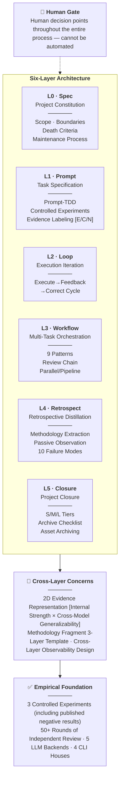

# AI Collaboration Project Full-Lifecycle Framework

[](https://creativecommons.org/licenses/by/4.0/)

**Version**: v1.6.4 (2026-06-22)  
**Status**: Working Paper (continuously updated; cite the version number when referencing)  
**License**: CC BY 4.0  
**Language**: Simplified Chinese (if translations in other languages appear in the future, the Simplified Chinese original is authoritative)  
**Encoding**: UTF-8 (all text files)  
**Translations**: [Simplified Chinese](../README.md) · [Traditional Chinese](../zh-Hant/README.md)  
**AI Generation Statement**: Most content in this repository was produced through human-AI collaboration (see [PUBLISHING.md](../PUBLISHING.md))

[](../README.md)
[]()
[](../zh-Hant/README.md)

> 📖 ~168,000 characters | 6-layer architecture | 3 controlled experiments | 50+ rounds of multi-backend independent review | Spec Coding · Prompt-TDD · Project Closure



A meta-level operational specification for "how to run a complete project with AI collaboration": a full-lifecycle process framework from initiation, execution, and review through archival. Core beliefs: Steering Wheel > Engine, Layers Are Not Interchangeable, Reverse Precipitation from Failures, and AI Internal Closed Loop ≠ Human Review.

> **Positioning Statement**: This is a **semi-open personal methodology tool**. It does not aim to become a "universal framework" independent of the author; one person cannot possess an experience spectrum that covers every project type, toolchain, and form of validation independence. What it provides is a set of personal practice patterns annotated with multi-backend review and controlled-experiment evidence. Reference, adaptation, and contributed counterexamples are welcome; readers should expect translation cost before adapting it to their own settings. See §1.8 limitation #9 and `../_research/通用框架可行性讨论_20260621.md`.

### Project Nature

**This is a small technical document, not a software project.** This repository contains no runnable application, library, or web service. The "code" here consists of document-generation scripts (MD → JSON/DOCX conversion), the "data" consists of review reports and case studies, and the core deliverable is an approximately 160,000-character Markdown document.

If you are looking for installation instructions, API documentation, or a demo page, none of those are here.  
If you are looking for an empirically examined AI collaboration methodology framework, [`AI协作项目全生命周期框架.md`](AI协作项目全生命周期框架.md) is the entry point.

---

## Main Document Size

The main document, `AI协作项目全生命周期框架.md`, is an approximately 160,000-character (about 310 KB) Markdown document, primarily in Chinese, with several code blocks, tables, and Mermaid diagrams. Exact character-level statistics vary by version and are not maintained here; run `../_workflows/count_chars_v164.py` if current values are needed.

---

## Directory Structure

```
AI协作项目全生命周期框架/
│
├── AI协作项目全生命周期框架.md        ← 📖 Main document (entry point)
├── AI协作项目全生命周期框架.json       ← Machine-readable edition
├── AI协作项目全生命周期框架.docx       ← Word edition (generated by pandoc)
├── README.md                           ← This file (structure navigation)
├── CLAUDE.md                           ← AI assistant project instructions
├── PUBLISHING.md                       ← Publication boundary and AI generation statement
├── LICENSE                             ← CC BY 4.0 license
├── VERSION                             ← Version number (1.6.4)
├── project_status.md                   ← Project status tracking
├── reference_files.md                  ← Key file index
├── project.yaml                        ← DOCX pipeline project configuration
├── inventory.csv                       ← File inventory (aligned with release package contents)
├── verify_version_consistency.py       ← Version consistency verification script
├── .gitignore                          ← Release package boundary definition
│
├── _archive/                           ← 🗄 Historical archive
│   ├── 元审查合规清单.{md,json}          — Framework self-compliance review
│   ├── 独立审查标准操作程序_SOP.{md,json} — Review SOP v1.0
│   ├── provenance_erratum_20260617.md   — Model provenance erratum
│   ├── v1.5.1冻结期_待执行协议清单.md     — Freeze Period protocol list (archived)
│   └── docx_legacy_scripts/             — DOCX legacy generation script archive (README explains replacement relationship)
│
├── _mermaid_png/                       ← 🎨 Diagram source + vector graphics
│   └── *.mmd (source) / *.emf (vector)  — Mermaid source + EMF vector graphics
│                                          (PNG/SVG/PDF render caches are not committed; see .gitignore)
│
├── _protocols-and-tools/               ← 📋 Protocols + tools + companion documents
│   ├── meta-audit-checklist.{md,json}   — Meta-audit compliance checklist v1.0.4+ (75 items)
│   ├── methodological-review-sop.{md,json} — Independent Review SOP v1.0.4
│   ├── 框架级成熟度评估表.{md,json}       — Framework self-maturity assessment v0.4
│   ├── 外部依赖登记表.{md,json}          — Toolchain/model/platform dependency tracking
│   ├── 可调参数索引.md                   — Centralized index of magic numbers
│   ├── import_integrity_check.py        — Python import checking tool (deprecated; see main document §9.1)
│   ├── AI协作项目全生命周期框架_OPEN4试读计时协议.{md,json}
│   └── AI协作项目全生命周期框架_人类专家verify包.{md,json}
│
├── _research/                          ← 🔬 Case-study materials
│   ├── CCR作为逃生口案例研究.{md,json}
│   ├── CacheAligner与AI框架OPEN-1对标分析.{md,json}
│   ├── ChatGPT-5.5独立审查_headroom对标三文档.{md,json}
│   ├── SmartCrusher方法论提取.{md,json}
│   ├── headroom对标分析_封存说明.{md,json}
│   ├── 通用框架可行性讨论_20260621.md
│   ├── 两次试跑对比_2026-06-22.md
│   └── drafts/                         — Discarded drafts (v1.3.2 / v1.5.1)
│
├── _reviews/                           ← 🔍 Multi-backend Independent Review reports
│   ├── (review reports for each version + Cross-Verification records .md/.json/.txt)
│   ├── prompts/                        — Review prompts
│   ├── last_messages/                  — CLI output fragments
│   └── retrospects/                    — Retrospect records
│
├── _workflows/                         ← ⚙ Build + synchronization + translation scripts
│   ├── regenerate_docx.py               — Full DOCX regeneration (Mermaid + pandoc + styles)
│   ├── regenerate_inventory.py          — Regenerate inventory.csv
│   ├── count_chars_v164.py              — Character-level statistics
│   ├── sync_v16{1,2,3,4}_docx.py        — DOCX synchronization by version (historical)
│   ├── i18n/                            — Translation pipeline (glossary + translation/check scripts + review reports)
│   └── *.js                            — Workflow definition scripts
│
└── zh-Hant/                            ← 🌏 Traditional Chinese translation
    ├── README.md
    ├── AI协作项目全生命周期框架.md
    └── reference_files.md
```

---

## Quick Navigation

| You want to... | Start here |
|---------|-----------|
| Understand the framework content | [`AI协作项目全生命周期框架.md`](AI协作项目全生命周期框架.md) |
| Perform machine processing / cross-analysis | [`AI协作项目全生命周期框架.json`](../AI协作项目全生命周期框架.json) |
| Understand current project status and pending work | [`project_status.md`](../project_status.md) |
| Find a specific file | [`reference_files.md`](reference_files.md) |
| View Independent Review records | [`_reviews/`](../_reviews/) |
| View the review SOP | [`_protocols-and-tools/methodological-review-sop.md`](../_protocols-and-tools/methodological-review-sop.md) |
| Understand framework maturity | [`_protocols-and-tools/框架级成熟度评估表.md`](../_protocols-and-tools/框架级成熟度评估表.md) |

---

## Subdirectory Naming Convention

| Prefix | Meaning |
|------|------|
| `_` | AI work intermediate artifacts (not directly consumed by humans) |
| No prefix | Core files directly consumed by humans |

`_archive` / `_mermaid_png` / `_reviews` / `_workflows` are all AI work directories.  
`_protocols-and-tools` / `_research` are human-readable but are not the main document.

---

## Three-Piece Suite Convention
The main document is maintained in three formats:

| Format | Purpose | Consumer |
|------|------|--------|
| `.md` | Authoritative version | Humans + AI |
| `.json` | Structured companion | Machines (script consumption, Cross-Verification) |
| `.docx` | Traditional distribution | Humans (Word reading/printing) |

Both `.json` and `.docx` are derived from `.md`; modifications are governed by `.md`.

---

## Review Chain

This framework has undergone multi-round Independent Review across **5 backends × 5 CLIs**. Review provenance is recorded in the main document's § Review Chain. All review reports are archived under [`_reviews/`](../_reviews/).

---

## Related Projects

This repository is the methodology upstream. The following 6 repos are derivatives or empirical validations:

```
ai-collaboration-framework  ← methodology upstream (this repo)
├── independent-review-toolkit   ← §9.2 review SOP extraction
├── prompt-tdd-methodology       ← §4.1.1 experiment methodology extraction
├── claude-skills               ← §9.2–§9.3 Claude Code skill extraction
├── docx-pipeline               ← DOCX generation pipeline extraction
├── ma-case-study-pipeline      ← six-layer framework empirical case study
└── etf-pattern-match-pybind11  ← adopted review/observation/closure protocols
```

| Project | Relationship |
|---------|-------------|
| [**Independent Review Toolkit**](https://github.com/redamancy231-create/independent-review-toolkit) | **Upstream extraction**: Review SOP distilled from §9.2 + 50+ rounds of practical review. **Copy the prompts and use immediately**. |
| [**Prompt-TDD Methodology**](https://github.com/redamancy231-create/prompt-tdd-methodology) | **Upstream extraction**: Prompt controlled experiment methodology casebook — SOP + two real experiments (including negative results). |
| [**Claude Skills**](https://github.com/redamancy231-create/claude-skills) | **Upstream extraction**: 3 battle-tested Claude Code Skills — session handoff, CLAUDE.md authoring, pre-emptive veto. Extracted from §9.2–§9.3. |
| [**DOCX Pipeline**](https://github.com/redamancy231-create/docx-pipeline) | **Upstream extraction**: Markdown → Chinese DOCX pipeline — dual-backend + Mermaid + 4 templates. Extracted from this document's DOCX generation pipeline. |
| [**M&A Case Study Pipeline**](https://github.com/redamancy231-create/ma-case-study-pipeline) | **Downstream empirical**: End-to-end validation of the framework's six-layer philosophy in an eight-stage M&A case study. |
| [**ETF Pattern Match — pybind11**](https://github.com/redamancy231-create/etf-pattern-match-pybind11) | **Downstream adoption**: pybind11/C++20 acceleration practice — employs the framework's multi-backend review, passive observation, and project closure protocols. DTW 34× / pattern match 53×. |

---

*Translation: GPT-5.5 (via Codex CLI) · 2026-06-24*  
*Generated by: DeepSeek-V4-Pro (via Claude Code CLI) · 2026-06-22*  
*Directory structure and file-count correction: Claude Opus 4.8 (via Claude Code CLI) · 2026-06-23 — removed migrated build artifacts/cache entries and aligned with the actual release package structure (independently inventoried and cross-verified by Codex GPT-5.5)*