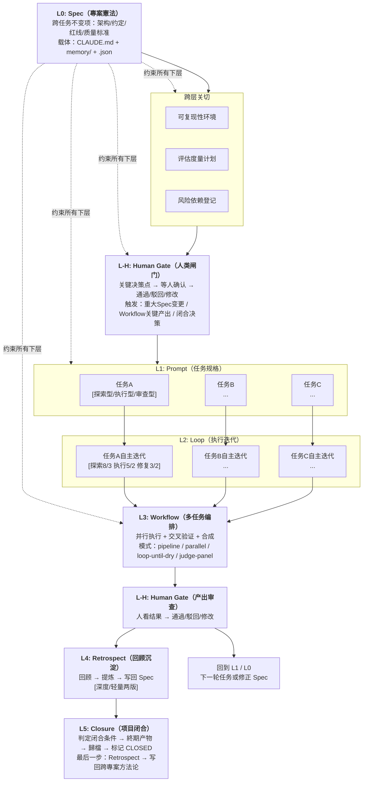
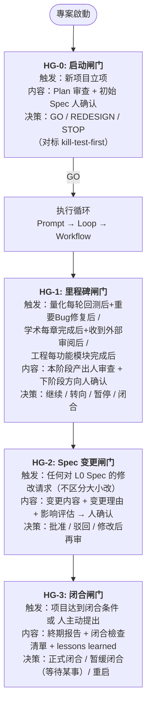
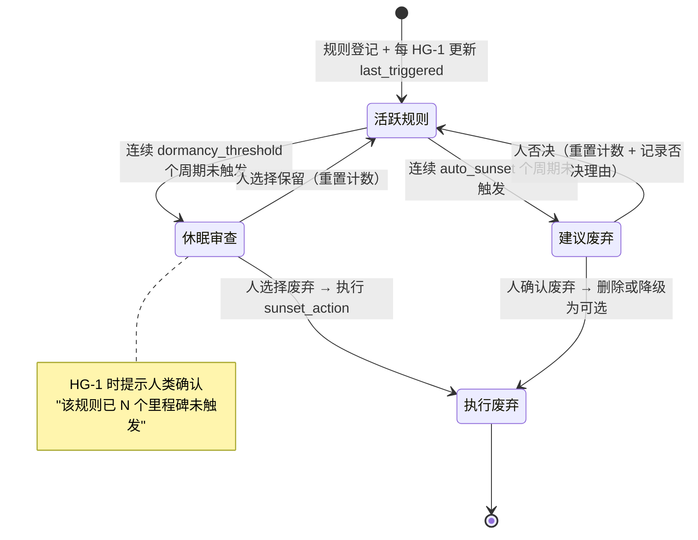
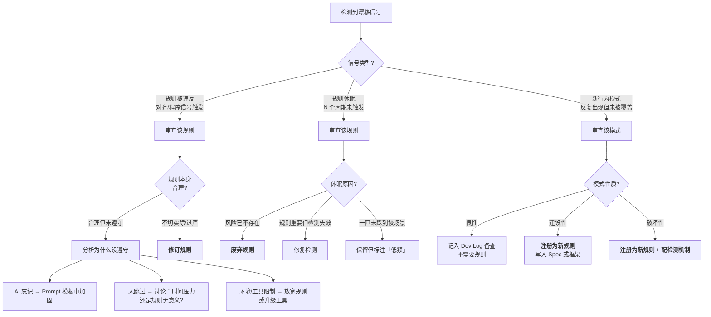
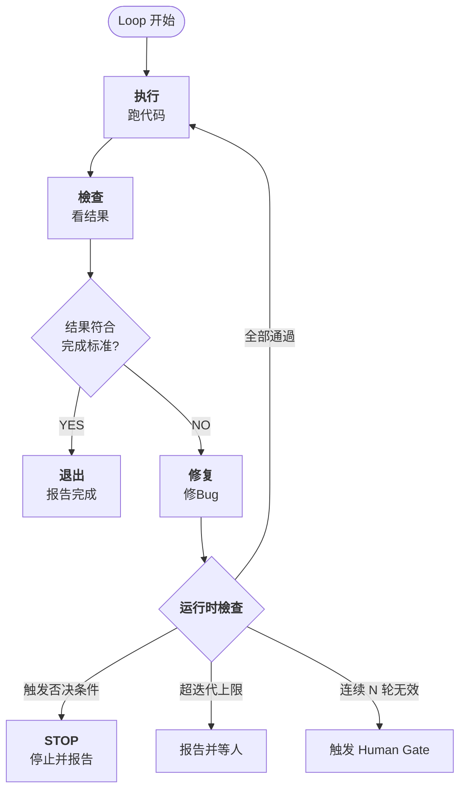
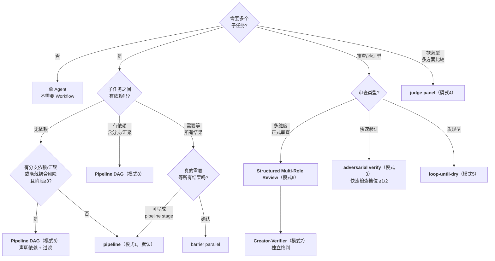

# AI協作專案全生命週期框架

> **版本**: v1.6.4（**v1.6.4：prompt-tdd A1 實驗寫回 §6.3.2——Flow-as-Node 巢狀工作流對照證據 [E-] ceiling-limited**）  
> **日期**: 2026-06-22  
> **生成模型**: DeepSeek-V4-Pro (via Claude Code CLI shell)  
> **v1.6.4 新增（2026-06-22，DeepSeek-V4-Pro via Claude Code CLI）**: prompt-tdd A1 Flow-as-Node Tier 0 對照實驗寫回——新增 §6.3.2 Flow-as-Node 巢狀工作流對照證據 [E-] ceiling-limited（Tier 0 負證據；3/5 類別天花板，ΔF1=0.000）。經 7 輪雙後端審查鏈（Codex GPT-5.5 ×4 + Qwen qwen3.7-max ×3），0 未閉合發現。同時更新 header 後設資料新增 A1 寫回宣告。詳見 §14。  
> **v1.6.2 新增（2026-06-21，DeepSeek-V4-Pro via Claude Code CLI）**: 基於使用者記憶系統三次被動觀測事件（`method_llm_review_coverage_single_run` / `methodology_review_prompt_mechanical_checks` / `todo_verify_glm5_identity`）的跨案例分析，新增 §7.7「被動觀測：意外發現的發現機制」。概念經 Codex GPT-5.5 魔鬼代言人獨立審查（2026-06-21，總體判斷：有條件支援）——審查意見已系統性納入：定義收緊（不聲稱"只能被動發現"）、模式降級為"當前已識別"（非完備分類）、補擴充套件分類框架（待實證）、補 Failure Space（10 種失效模式+硬約束）、深度版 Retrospect 範本增強（發現方式/複核狀態/適用邊界）。伴隨更新：目錄、§14 變更記錄、§9 跨層交叉引用、附錄 C 深度版 Retrospect 範本。詳見 §14。  
> **v1.6 新增（2026-06-20，DeepSeek-V4-Pro via Claude Code CLI）**: 本次為 Minor 升級——7 項新增/增強。(P0) 來源為 A2+A3 深度覆盤 + Codex v1.5.5 交叉驗證：§9.6.1 證據等級二維表示 + §9.10 方法論片段三層模型 + §4.1.1.1 對照實驗設計強制檢查清單（6 項）。(P1) 來源為跨版本實踐規範化 + 審查反饋推導：§2.6 框架維護流程 + §1.8 誠實聲明 + §9.9 路徑 D + 附錄 H 反向交叉引用。詳見 §14。**注意**：本版由 DeepSeek-V4-Pro 單後端編輯，後經 Codex GPT-5.5 異後端交叉驗證（初審→重審，2 MAJOR + 多項 MEDIUM 全部修正閉合，見 §14 及 `_reviews/codex_v16_crosscheck_*`）。
> **Protocol 3 試跑1回寫（2026-06-16，Codex CLI 編輯）**: 首次真實試跑"方法論提取方法論"專案已閉合（M-tier，閉合時 14/20 loops；Phase 8 Kimi 核查後修正為閉合後 15/20，58 項發現，0 CRITICAL/MAJOR 遺留）。本次按試跑 Retrospect + Phase 7 系列審查 + `框架級成熟度評估表.md` §9，將 6 項 Protocol 3 改進寫回主檔案：C1/C5 測量方法、HG-0 Plan/Spec 雙審查、審查頻率適應性上調、HG 互動留存、C8 ≥2 輪異後端建議、S-tier 降級閾值備註。來源統一標註為"[Protocol 3 試跑1反饋，2026-06-16]"。  
> **Mermaid 視覺化轉換（2026-06-16，DeepSeek-v4-pro via Claude Code CLI）**: 將 6 處 ASCII/縮排文字圖轉為 ` ```mermaid ` 程式碼區塊（§1.2 生命週期總覽 / §3.2 閘門流程圖 / §3.7.4 規則退役狀態圖 / §3.7.6 策展決策樹 / §5.2 Loop 迴圈圖 / §6.3 模式選擇決策樹）。轉換方案經 **ChatGPT-5.5 (Codex CLI, GPT-5.5)** 獨立審閱確認——兩後端在 4/5 優先圖上共識、差異點（§3.2 vs §3.7.4 優先順序）已透過"全做"調和。遵循選擇性轉換原則：流程/決策/狀態遷移 → Mermaid；虛擬碼/表格/目錄樹 → 保留原樣。屬凍結期白名單內的"修確鑿 bug"——ASCII 框線圖在不同渲染環境易錯位、難維護，Mermaid 不改任何機制內容，僅改展示格式。  
> **PocketFlow 方法論轉化 A 類資產寫回（2026-06-18，DeepSeek-v4-pro via Claude Code CLI）**: 基於 PocketFlow 三輪獨立分析（DeepSeek-V4-Pro / ChatGPT-5.5 / GLM-5.2，2026-06-16~18）產出的 A 類資產（可直接寫回框架的方法論改進，無需額外驗證實驗），本版（v1.5.3）共寫回 3 項：(1) **B2 資產 → 新增 §9.9「閱讀導航與難度分層」**——按 ☆☆☆/★☆☆/★★☆/★★★ 標註 15 個章節/條目難度，提供 3 條推薦閱讀路徑；(2) **B1 資產 → 新增 §1.7「框架自身的架構原則：最小核心 + 示例外掛」**——定義核心（主檔案強制規則）vs 外掛（配套目錄參考實作）的區分標準及 4 種反模式警示；(3) **PF-反模式資產組 → 新增「附錄 H: 反模式清單」**——集中收納 4 條經獨立審查確認可遷移性的反模式，原 §6.5.1 檔案系統作 IPC 條目遷移至此並新增 PocketFlow 來源 3 條。伴隨更新：§1.4 末尾新增對 §9.9 和 §1.7 的交叉引用；§1.6 末尾新增對 §1.7 的交叉引用。所有新增內容標註來源為 "[PocketFlow方法論轉化，2026-06-18]"。詳見 §14。
> **prompt-tdd A2 實驗寫回（2026-06-19，DeepSeek-v4-pro via Claude Code CLI）**: prompt-tdd A2 Tier 1 對照實驗完成——prep/exec/post 分段 vs 一體式編號列表 prompt，程式碼審查域、GPT-5.5 (temp=0)、n=24/臂。H1 不被支援（A_flat correctness_rate=0.954 ≥ B_structured=0.935，方向與假設相反）。PF-8 資產從留白 [Sp] 更新為 [E-]（單域實驗不支援），誠實記錄於 §4.1.1。詳見 §14。
> **prompt-tdd A3 實驗寫回（2026-06-20，DeepSeek-V4-Pro via Claude Code CLI）**: prompt-tdd A3 Action Routing 對照實驗完成（v1 + Pilot）——宣告式 vs NL 路由描述，GPT-5.5 (temp=0)、中文路由任務、6-15 actions。兩個實驗均未檢測到格式效應（Δ=0, discordant率=0%），經 10 輪審查鏈確認（含 Codex GPT-5.5 ×4, Qwen qwen3.7-max ×3, 合併/諮詢/對齊各×1；非全為同質獨立審查輪）。PF-9 資產記錄為 [E-]（陰性結論；格式效應在上述條件下不可檢測），誠實記錄於 §6.3。詳見 §14。
> **prompt-tdd A1 實驗寫回（2026-06-22，DeepSeek-V4-Pro via Claude Code CLI）**: prompt-tdd A1 Flow-as-Node Tier 0 對照實驗完成——層級化工作流描述 vs 內容等價的扁平描述，編碼 Agent 工作流理解域、GPT-5.5 (temp=0)、n=20/臂。H1 不被支援（Δ median F1 = 0.000, 3/5 類別天花板）。經 7 輪雙後端審查鏈確認（Codex GPT-5.5 ×4 + Qwen qwen3.7-max ×3），0 未閉合發現。PF-A1-001 資產從留白 [Sp] 更新為 [E-] ceiling-limited（Tier 0 負證據；僅 C4/C5 有區分空間且每類 n=4），誠實記錄於 §6.3.2。詳見 §14。

> **凍結期編輯記錄（2026-06-14/15，跨天編輯）**: 本檔案 v1.5.1 凍結期內的結構性修訂由 **GLM-5.2 (via ZCode CLI shell)** 執行（編輯始於 2026-06-14 23:14，免費額度重新整理後於 2026-06-15 00:00 繼續完成）。**重要 provenance 宣告**：GLM-5.2 是框架審查鏈譜系之外的**第五個後端**（在 GLM-5.2 編輯者介入時，已有 DeepSeek-v4-pro / Opus 4.8 / ChatGPT-5.5 / Kimi-K2.7-Code / Qwen3.7-Max 五個後端，跨四個 CLI house：Claude / Codex / Kimi / Qwen）。GLM-5.2 在本次編輯中**僅承擔編輯者角色，非獨立審查者**——其修訂基於框架自身已記錄的證據（Codex 審查報告、§10.8 成熟度評估等）。**本次編輯引入了已標註的編輯者判斷（F9 成熟度評估的逐行分級與分佈估計、F10 協議 2 冷讀 prompt 與判讀規則），待獨立複核**。所有修訂項均為凍結期白名單內的"修確鑿 bug / 補零試跑誠實性產物"，無新增 [Sp] 節。**逐條修訂清單見 §14「v1.5.1 凍結期編輯記錄（GLM-5.2）」**。按框架 §9.2 獨立審查標準，本次編輯獨立性級別為 **[SEMI-ED]**（編輯獨立於內容創作，但 GLM-5.2 的修訂指令由使用者提供、修訂物件由使用者選定）。後續獨立審查者複核本批次修訂時，應：(a) 驗證每條修訂是否真屬"修 bug"而非"加機制"；(b) 驗證 GLM-5.2 是否引入了未宣告的實質性判斷。
> **凍結宣告（2026-06-14 起，2026-06-16 已滿足解除條件）**: v1.5.1 曾進入凍結期。在完成 ≥1 次真實試跑 + Retrospect 回寫（產出《框架級成熟度評估表》初版）之前，**不接受新增 [Sp] / 機制節**。凍結期內只允許：(a) 修確鑿 bug（版本漂移/引用失效/編輯錯亂）、(b) 執行已設計未跑的協議（OPEN-4 試讀、OPEN-1 verify）、(c) 補零試跑即可做的誠實性產物（框架級成熟度表）。**理由**：框架自身已記錄"加複雜度比減複雜度容易"的傾向（v1.3.2 修正路線圖"二次確認偏誤"教訓 + v1.5.1 同日 4 個 [Sp] 節連加），但尚未變成執行約束。凍結把教訓文字變成紀律。凍結解除條件 = 試跑 1 Retrospect 完成；該條件已由 Protocol 3 試跑1滿足，本版為試跑回寫。詳見 §14。
> **獨立審查**: v1.4: ChatGPT-5.5 (5.37) + Kimi-K2.7-Code (5.00) / v1.5: ChatGPT-5.5 C+ (5.43/10) / v1.5.1草案: Codex ChatGPT-5.5 R3(4.3,駁回)→R4(7.2,修改後透過)  
> **狀態**: **草案，兩次真實試跑已回寫（分析型+實驗型），仍待多專案驗證**（v1.6.4: prompt-tdd A1 實驗寫回 §6.3.2 [E-] ceiling-limited / v1.6.3: 維護流程補全+誠實聲明擴充套件 / v1.6.2: 被動觀測機制 / v1.6: 證據體系升級+維護性增強 / v1.5.5: prompt-tdd A3 實驗寫回 §6.3.1 [E-] / v1.5.4: prompt-tdd A2 實驗寫回 §4.1.1 [E-] / v1.5.2 寫回 Protocol 3 試跑1反饋；v1.5.1 新增: §3.7.0 事件流健康度監測 [Sp] + §3.7.4.1 自適應權重淘汰 [Sp] + §9.7 經驗注入上下文預算規則 [Sp] + §9.8 研究經驗物件(REO) [Sp]。方法論來源=Evolver專案分析(arXiv:2604.15097, 綜合評分4.1-4.2/10, 四輪獨立審查跨三個後端)。完整規格見 `_research/框架v1.5.1_新增節草案.md`。v1.5 新增: §6.2 模式8/9 + §9.2 + §9.6。v1.4 新增: §3.7.2.6/§5.3.1/§6.2/§6.5.1/§9.1/§1.5/§9.4/附錄H。v1.3 遺留 OPEN-1~4 狀態不變（OPEN-5 已於 v1.5.1 凍結期關閉 → §8.8））  
> **v1.5 方法論來源**: GitNexus分析專案（42K星程式碼知識圖譜工具全量分析+9-agent workflow+三輪獨立審查+證據分類實戰）。詳見 §14 變更記錄。  
> **v1.3 更新**: 新增 §3.7 漂移偵測層——將 OPEN-1"離散審查測不出連續漂移"從候選草案升級為正式化的連續監測層（五類漂移訊號 + 告警聚合 + 規則退役自動化 + 憲法審計 + 閉環策展 + 完整監測範本），設計受 headroom CacheAligner 的 detector-only 哲學啟發（只檢測不阻斷），經 ChatGPT-5.5 獨立裁決確認邊界。同步更新 §1.6 OPEN-1 為"已操作化 → §3.7，待試跑驗證"。詳見 §14 變更記錄。  
> **v1.2 更新**: 經三模型獨立審查鏈（ChatGPT-5.5 審查 → DeepSeek-v4-pro 再審查 → ChatGPT-5.5 回應 → Opus 4.8 再再審查）校準。本版改動：(1) 狀態從"已定稿"改為"草案凍結，等待試跑驗證"；(2) 新增 §1.4 使用強度分檔（最低強制版/預設版/完整版）；(3) 新增 §1.5 框架自身死亡判據；(4) 新增 §1.6 已知待決項登記 + §3.6 連續漂移與 Human Gate 頻率-覆蓋缺口（OPEN-1，審查鏈判定的最高殺傷發現）；(5) 修正 §13.1 外部對標"獨特貢獻"表述並補個人級/組織級對照表。詳見 §14 變更記錄。  
> **v1.1 更新**: 新增第 10 章"跨層產物：開發手冊（Dev Log）"——基於 ETF 專案 V3.6 程式碼頭部註釋實踐 + 網友經驗，形式化為累積式變更日誌 + FK 導航 + 獨立於程式碼的持久化產物  
> **配套檔案**: `AI協作專案全生命週期框架.json`、`_reviews/AI協作專案全生命週期框架_對ChatGPT-5.5回應的再再審查.md`（審查鏈最終意見）、`methodological-review-sop.md` + `.json`（獨立審查SOP v1.0.3，框架 §9.2 的操作性落地）、`meta-audit-checklist.md` + `.json`（元審查合規清單 v1.0.3，依據框架 §9.2 派生的執行層工具）。**歸檔說明**：中文名 v1.0 舊版（`獨立審查標準操作程式_SOP.{md,json}` + `元審查合規清單.{md,json}`）已被英文名 v1.0.3 取代，移至 `_archive/`；ChatGPT-5.5 headroom 對標三檔案審查的 `.json` 配套已在 v1.5.1 凍結期補齊。

---

## 目錄

1. [框架總覽](#1-框架總覽)
   - [1.7 框架自身的架構原則：最小核心 + 示例外掛](#17-框架自身的架構原則最小核心--示例外掛)
   - [1.8 已知侷限與誠實聲明](#18-已知侷限與誠實聲明)
2. [L0: Spec（專案憲法）](#2-l0-spec專案憲法)
   - [2.6 框架自身的維護流程](#26-框架自身的維護流程)
3. [L-H: Human Gate（人類閘門）](#3-l-h-human-gate人類閘門)
   - [3.6 已知缺口（OPEN-1）](#36-已知缺口待決--open-1連續漂移與-human-gate-頻率-覆蓋)
   - [3.7 漂移偵測層（v1.3 新增）](#37-漂移偵測層從離散閘門到連續觀測v13-草案)
4. [L1: Prompt（任務規格）](#4-l1-prompt任務規格)
   - [4.1.1.1 對照實驗設計強制檢查清單](#4111-對照實驗設計強制檢查清單)
5. [L2: Loop（執行迭代）](#5-l2-loop執行迭代)
6. [L3: Workflow（多工編排）](#6-l3-workflow多工編排)
7. [L4: Retrospect（回顧沉澱）](#7-l4-retrospect回顧沉澱)
   - [7.7 被動觀測：意外發現的發現機制](#77-被動觀測意外發現的發現機制)
8. [L5: Closure（專案閉合）](#8-l5-closure專案閉合)
9. [跨層關切](#9-跨層關切)
   - [9.6.1 證據等級的二維表示](#961-證據等級的二維表示內部強度--跨模型推廣性)
   - [9.9 閱讀導航與難度分層](#99-閱讀導航與難度分層)
   - [9.10 方法論片段範本：三層模型](#910-方法論片段範本三層模型)
   - [9.11 跨層可觀測性設計](#911-跨層可觀測性設計)
10. [跨層產物：開發手冊（Dev Log）](#10-跨層產物開發手冊dev-log)
11. [與現有系統整合](#11-與現有系統整合)
12. [附錄：範本與檢查清單](#12-附錄範本與檢查清單)
    - [附錄 H: 反模式清單](#附錄-h-反模式清單)
13. [外部參考與定位](#13-外部參考與定位)
14. [變更記錄（v1.1 → v1.6.4）](#14-變更記錄v11--v164)

---

## 1. 框架總覽

### 1.1 核心理念

本框架描述**如何用 AI 協作跑完一個完整專案**——不是某個具體專案的說明書，而是專案方法的元層次規範。

四個核心信念：

1. **方向盤 > 引擎**：方向正確比算力大更重要。Prompt（方向）弱而 Loop/Workflow（算力）強 = 高效奔向錯誤方向。
2. **分層不互相替代**：Spec/Prompt/Loop/Workflow 各管各的問題，上層弱不能靠下層強來彌補。
3. **從失敗中反向沉澱**：Spec 不是一次寫對的——是從每次失敗和驚喜中反向提煉的。
4. **AI 內部閉環 ≠ 人類審查**：框架覆蓋 AI 能做的事，但關鍵節點必須有人的判斷閘門。

### 1.2 完整生命週期檢視



> **圖1**：框架七層生命週期總覽。實線箭頭 = 資料/控制流；虛線箭頭 = Spec 約束關係。L-H 在流程中出現兩次：執行前（閘門）和產出後（審查）。

### 1.3 七層 + 四跨層關切速覽

| 層 | 名稱 | 管什麼 | 粒度 | 變化頻率 | 現有對應物 |
|----|------|--------|------|----------|-----------|
| L0 | Spec | 跨任務不變的東西 | 專案級 | 低頻（發現新約束時修訂） | CLAUDE.md + memory/ |
| L-H | Human Gate | AI不能替人做的決策 | 決策點 | 按里程碑觸發 | `feedback_independent_review_reminder.md` |
| L1 | Prompt | 單次任務的規格 | 任務級 | 每輪不同 | 會話中的具體指令 |
| L2 | Loop | 執行中的試錯收斂 | 輪次級 | 毫秒級 | 模型自主迭代（跑→錯→修） |
| L3 | Workflow | 多工的並行編排 | 編排級 | 按任務觸發 | kill-test-first + Claude Code Workflow 工具 |
| L4 | Retrospect | 回顧 → 提煉 → 寫回 | 里程碑級 | 每個里程碑/階段結束 | 專案覆盤歸檔報告.json |
| L5 | Closure | 專案何時結束、怎麼結束 | 專案級 | 一次性 | `project_status.md` 標記 CLOSED |

| 跨層關切 | 管什麼 | 現有對應物 |
|----------|--------|-----------|
| 可復現性 | 環境/依賴/資料/隨機種子 | `reference_python_versions.md`（部分） |
| 評估度量 | 怎麼判斷做得好不好 | kill-test-first 否決條件 + 三層評估分工 |
| 會話交接 | 跨會話狀態恢復 | memory/ 目錄 + `/session-end` skill |
| 風險依賴 | 外部依賴和風險追蹤 | 統一風險登記表（附錄 F） |
| Dev Log | 累積式變更日誌 + FK導航 + 時間軸 | 無——**本次新增產物**（基於 ETF 專案 V3.6 程式碼頭部實踐提煉） |

### 1.4 使用強度分檔（最低強制版 / 預設版 / 完整版）

本框架是**模式庫**，不是必做清單。同一份檔案按使用強度分三檔——先用最低強制版跑起來，達標後再升級，不要一上來就全量啟用。升級須滿足 §1.6 / §6.4 / §1.5 的復擴條件，不是預設就開。

| 檔位 | 適用 | 強制啟用 | 暫不啟用（升級項） |
|------|------|---------|-------------------|
| **最低強制版** | 任何專案、首次試跑 | S1–S4（狀態/路徑/約定/紅線）、HG-0/HG-1/HG-3、Workflow 三模式（pipeline / adversarial verify / discovery）、Dev Log 單時間軸（僅主檔案） | — |
| **預設版** | 進入穩定迭代後 | + S5/S6（成功標準/評估計劃）、HG-2 Spec 變更閘門、Retrospect 輕量版、風險登記 | — |
| **完整版** | 正式研究/交付級，且復擴條件達標 | 全量 | Dev Log 雙檢視+FK、Judge Panel、Loop-Until-Dry、Completeness Critic、HG-2 全量分級、深度 Closure 清單 |

**關鍵紀律**："30% 複雜度就能跑"——但必須說清是哪 30%，否則模式庫會被誤當成必做清單，淪為事實上的過度工程。本表就是那張說明。

> **與 §8.8 專案規模分檔的區別**：本節 A/B/C 三檔定義的是**框架本身用多少**（使用強度），§8.8 S/M/L 定義的是**專案閉合做多深**（閉合規模）。兩者正交——C 檔使用者可以跑 S 檔專案，A 檔使用者也可以跑 L 檔專案。不要混淆。
>
> **與 §9.9 閱讀導航的關係**：§9.9 提供按難度分層的章節對照表和推薦閱讀路徑——初次接觸框架的讀者可先查閱 §9.9 選擇適配自身背景的入口章節，而非逐節通讀。§1.4 回答"框架用多少"（使用強度分檔），§9.9 回答"從哪開始讀"（難度分層）。
>
> **與 §1.7 核心 vs 外掛的關係**：§1.4 管用多少、§1.7 管在哪找——強制規則看主檔案（核心），參考實作看配套目錄（外掛）。兩者正互動補：§1.4 回答"30% 複雜度就能跑——是哪 30%"，§1.7 回答"那 30% 就在這份主檔案裡，其餘 70% 在配套目錄——需要時再取"。

### 1.5 框架自身的死亡判據

**對稱性要求**：框架要求每個專案有死亡判據（S4）、每個 Prompt 有死亡判據（L1 第 4 要素），框架自己也必須有——否則框架的失敗永遠會被解釋成"執行不到位"而非"框架無效"。滿足**任一條**即觸發對應動作（在下一個真實專案預登記基線後評估）：

| 判據 | 閾值 | 動作 |
|------|------|------|
| 無改善 | 連續 3 個真實專案，交接恢復時間/返工率/漏記率/Bug 追溯時間相對歷史基線改善 < 20% | 大修 |
| 維護成本 | 框架維護+填表耗時 > 專案總工時 15% 且無可量化收益 | 降級為最低強制版 |
| 繞過率 | 連續 2 個專案，實際繞過 > 50% 的範本/閘門 | 重構（框架不適配真實工作） |
| Dev Log 失敗 | 10 次真實變更漏記 > 2 次，或連結錯誤 > 10%，自動化無法降到 5% 以下 | 取消"雙檢視+FK"，退回單一時間軸 |
| HG 過載 | HG-2 變更確認 > 70% 被直接批准且無實質討論 | 閘門分級 |
| 外部審查無增益 | 連續 3 次獨立模型審查未發現有價值問題 | 降頻或換審查方式 |

死亡判據的評估依賴下一個專案**預登記**的指標（交接恢復時間、Dev Log 漏記率、返工次數、HG 等待次數、審查發現率、框架維護耗時）。**沒有預登記基線，死亡判據無法觸發——見 §1.6 OPEN-2。**

### 1.6 已知待決項登記（Open Items）

> 單列、**不併入任何復擴表**——避免"嚴重性夷平"（把致命缺口和措辭小修放進同一張等高表格而抹平差異）。以下是框架**已知未解決**的問題，啟用前須知情。

| ID | 待決項 | 嚴重性 | 狀態 | 詳見 |
|----|--------|--------|------|------|
| **OPEN-1** | **連續漂移 / Human Gate 頻率-覆蓋缺口**：人審離散（按里程碑）、AI 執行連續（每輪 Loop），離散審查測不出連續方向漂移；HG 抽查頻率天然低於 AI 犯錯頻率。**處置軌跡**：v1.2提出→v1.3草案 Loop Drift Ledger（ChatGPT-5.5 獨立裁決條件採納：只觀測不阻斷）→v1.3正式化為 §3.7 漂移偵測層（五類訊號+告警聚合+規則退役+憲法審計+閉環策展+監測範本）。**現狀：已操作化 → §3.7，待試跑驗證**（ChatGPT-5.5 獨立審查確認邊界：只觀測不阻斷；§3.7 為未驗證監測方案，完成 2-3 個真實專案試跑後再評估是否降級嚴重性）。 | **高（結構性）→ 中（已有操作化方案，ChatGPT-5.5 獨立審查確認邊界，待實證驗證）** | **已操作化 → §3.7，待試跑驗證**。漂移偵測層與 §3.6 Loop Drift Ledger 互補：§3.6 定義賬本記錄什麼，§3.7 定義用什麼訊號觸發警覺、如何響應、如何度量。預登記6項驗證指標+退出條件仍待真實專案試跑。 | §3.6 + §3.7 |
| **OPEN-1 處置方案** | （已執行）v1.3草案→v1.3正式化。Loop Drift Ledger(§3.6) + 漂移偵測層(§3.7) 共同構成 OPEN-1 完整應對。ChatGPT-5.5獨立裁決(2026-06-13)條件採納，關鍵約束為"只覆蓋留下可觀察痕跡的漂移"+"不新增阻斷，只新增觀測"。DeepSeek-v4-pro(作者)與ChatGPT-5.5(獨立)的方向性分歧已調和——交集="新增觀測不新增阻斷"。**v1.4 新增**：§3.7.2.6 難度分層監測明確列為 OPEN-1 的子待驗證項（已預登記退出條件：連續 2 個 ML 專案無增益→降級或退役）。 | 中（有獨立裁決後佐證增強，待人類裁決+真實專案試跑） | 已執行→待驗證 | §3.6 + §3.7 + ChatGPT-5.5獨立審查報告 |
| **OPEN-1 Action** | **下一步**：安排至少一位未參與框架設計的零捲入人類專家，對 drift detection 層的方向（"新增觀測不新增阻斷"是否足夠、"閘門太多應減少"vs"覆蓋不夠應新增"的裁決）進行獨立裁決。截止日期：[待人類確認]。此 Action 由 Kimi-K2.7-Code v1.4 獨立審查（2026-06-13）提出並採納。 | — | 待執行 | — |
| OPEN-2 | 框架級死亡判據缺預登記基線——判據已寫入（§1.5）但無基線無法觸發 | 中 | **部分驗證（v1.5.2 試跑1回寫 + v1.6.4 試跑2回寫）**：預登記載體已建立=配套檔案 `框架級成熟度評估表.{md,json}`；兩條真實基線已記錄（分析型專案+實驗型專案），但死亡判據仍需連續專案資料才可觸發 | §1.5 + 框架級成熟度評估表 |
| OPEN-3 | 框架對使用者已有實踐的"提煉準確度"未評估——把 80 分實踐形式化成 60 分範本的風險（與"有無外部對標"是兩個問題，審查鏈未接戰） | 中 | 待評估 | — |
| OPEN-4 | 最低上手時間未測——目標使用者是個人、無 onboarding 資源；需非設計者試讀並計理解時間/誤解點 | 中 | 待實測 | §1.4 |
| OPEN-5 | Closure 缺"專案規模"分檔（半天探索 / 一週小專案 / 正式研究），現僅按專案型別分檔 | 低-中 | **已覆蓋 → §8.8**（v1.5.1 凍結期：新增 S/M/L 三檔閉合要求對照表，含檔位升級規則和與專案型別的正交說明） | §8.8 |

> **與 §1.7 核心 vs 外掛的關係**：§1.7 描述了框架材料自身的組織邏輯（核心 vs 外掛），其中配套目錄 `_reviews/` 和 `_protocols-and-tools/` 的部分內容與 OPEN-4（最低上手時間未測）直接相關——試讀者導航困惑的部分根因正是缺少顯式的核心/外掛說明。

### 1.7 框架自身的架構原則：最小核心 + 示例外掛

> **方法論來源**: PocketFlow 三輪獨立分析（DeepSeek-V4-Pro / ChatGPT-5.5 / GLM-5.2），2026-06-16。本條原則由 B1 資產"最小核心+示例外掛架構"直接轉化——PocketFlow 的"100 行核心 + 分難度 cookbook 體系"結構是一種有效的知識傳遞模式：核心提供執行保證，cookbook 提供使用正規化。該模式不依賴 PocketFlow 的具體實作（100 行並非目標數字，框架不應有"行數崇拜"），提取的是**結構分層的組織邏輯**。[PocketFlow方法論轉化，2026-06-18]

**框架自身也遵循這一原則。** 本框架的完整材料不是隻有這份主檔案——它有若干配套檔案（根目錄含主檔案及治理工具）和 4 個子目錄（`_reviews/`、`_research/`、`_protocols-and-tools/`、`_archive/`），讀者如果不知道"哪些是必須讀的、哪些是按需查的"，會被檔案數量淹沒。本節說明框架自身的組織邏輯，防止兩類根本性誤用：把參考實作當強制規則，或把強制規則當可選附錄跳過。

**核心 = 主檔案（本檔案）**：

核心檔案是框架的 **canonical source of truth**（規範來源）——不等於每句話都強制。具體來說：

- **最低強制核心**（§1.4 明確列出 + 死亡判據 §1.5 + 閘門規則 §3.2-3.5 + 逃生口 §4.3 + 閉合條件 §8 + §6.3 模式選擇決策樹）：有合規牙齒，違反會被死亡判據或審查標準捕獲
- **規範性參考**（`[Sp]` 推測機制如 §3.7.0/§9.7/§9.8、範本附錄 A-G、變更記錄 §14、候選 profile 如 §3.7.2.6）：在主檔案中以便查閱，但標註了證據等級和啟用條件，不等同於強制項
- **導航與元資訊**（§9.9、§13、本檔案後設資料）：輔助讀者高效使用框架，不產生合規義務

最低強制核心包括：
1. **七層 + 四跨層關切定義**（§1.3 速覽表）：各層管什麼、不重疊、不互相替代
2. **強制啟用清單**（§1.4 使用強度分檔的"最低強制版"列）：S1–S4、HG-0/HG-1/HG-3、Workflow 三模式、Dev Log 單時間軸。任何自稱"使用本框架"的專案若未啟用這些元件，視為未使用
3. **死亡判據**（§1.5）：框架自身有效性的可測量判定標準
4. **閘門觸發條件與決策規則**（§3.2–§3.5）：HG 在什麼節點觸發、人做什麼、AI 做什麼
5. **逃生口規則**（§4.3 + 附錄 B）：工具/資料不可用時停，不用替代資料
6. **閉合條件與分檔**（§8 + §8.8）：專案何時結束、做多深
7. **可復現性/評估/會話交接的最低標準**（§9）：跨層不可降級的下限

核心的特徵：**有合規牙齒**——違反它會被框架的死亡判據或審查標準捕獲。核心不回答"可以怎麼做"，只回答"必須怎麼做"和"什麼情況下可以豁免"。

**外掛 = 配套目錄（場景化參考實作）**：

四個配套目錄提供**場景化的應用範本、參考實作和治理記錄**。它們不是強制規則，而是"這裡有已驗證的做法，你可以直接用、改、或參考後自己設計"：

| 目錄 | 角色 | 類比（PocketFlow cookbook） | 使用方式 |
|------|------|---------------------------|---------|
| `_reviews/` | 獨立審查報告與提示詞存檔 | 審查類 cookbook（如 `pocketflow-judge`） | 做獨立審查時參考提示詞結構和評分維度；不要求每個專案產出等量審查 |
| `_research/` | 對標分析、版本草案、方法論研究 | 設計檔案類 cookbook（如各 cookbook 的 `docs/design.md`） | 需要理解某條原則的"為什麼"時查閱；不要求每個專案做同等深度的對標研究 |
| `_protocols-and-tools/` | 協議包、執行手冊、verify 工具 | 工具整合類 cookbook（如 `pocketflow-mcp`） | 執行特定協議時按手冊操作；不要求每個專案跑全部協議 |
| `_archive/` | 舊版歸檔——被取代但保留供追溯 | N/A（框架治理特有） | 查歷史版本或舊審查結論時翻閱；日常不讀 |

外掛的特徵：**無合規牙齒**——跳過它不會觸發死亡判據或導致審查 FAIL。外掛的價值在於"別人踩過的坑你不用再踩"，而非"你必須這樣踩"。

**核心 vs 外掛的區分標準**：

以下三條判定規則決定一項內容應進入核心檔案（主檔案）還是配套目錄：

| 判定規則 | 進核心（主檔案） | 進配套目錄 |
|---------|----------------|-----------|
| **普遍性** | 任何專案型別（量化/學術/工程/探索）都適用 | 僅特定型別或特定階段適用 |
| **強制性** | 不遵守會導致框架死亡判據觸發或審查 FAIL | 參考實作，不遵守僅損失效率而非合規 |
| **穩定性** | 跨版本穩定，修改需走 HG-2（Spec 變更閘門） | 可按需增刪，新增/刪除走 Dev Log 記錄即可 |

**邊界案例處理原則**：當一項內容無法確定該進核心還是外掛時，**預設進外掛**。理由：從外掛升級到核心只需一次編輯（且有 HG-2 閘門把關），從核心移除到外掛則需要證明"之前的強制要求是錯的"——成本不對稱。這與 v1.3.2 修正路線圖已記錄的教訓"加複雜度比減複雜度容易"一致。

**與 §1.4 使用強度分檔的關係**：

§1.4 和本節描述的是**兩個正交維度**，互補但不重疊：

| 維度 | §1.4 使用強度分檔 | §1.7 核心 vs 外掛 |
|------|------------------|-------------------|
| 問題 | **用多少**——從最低強制到完整版，逐步啟用 | **在哪找**——強制規則看主檔案，參考實作看配套目錄 |
| 粒度 | 主檔案內部的功能啟用開關（同檔案內） | 框架全部材料（跨檔案）的組織邏輯 |
| 正交性示例 | C 檔（完整版）使用者仍只讀核心檔案——但啟用的核心功能更多 | A 檔（最低強制版）使用者也可能需要查閱 `_reviews/` 中的審查範本來完成首次 HG-1 審查 |

互補關係：§1.4 回答"30% 複雜度就能跑——是哪 30%"，§1.7 回答"那 30% 就在這份主檔案裡，其餘 70% 在配套目錄——需要時再取，不需要時不碰"。兩條合在一起，使用者不會把"只需 30% 複雜度"誤解為"整個框架只有這份主檔案"。

**反模式警示**：

以下四種誤用模式是本框架最常見的"使用失敗"來源——不是框架有 bug，是讀者用錯了材料層次：

| # | 反模式 | 表現 | 後果 | 糾正 |
|---|--------|------|------|------|
| **A1** | **把外掛當核心讀** | 開啟 `_reviews/` 中的某份審查報告，以為其中的評分維度是強制範本，逐條套用到自己的專案審查 | 過度審查——把參考實作當合規清單，審查耗時膨脹但無增量價值 | 審查維度以主檔案 §9.2 為準；`_reviews/` 中的報告是"某次審查怎麼做的"，不是"每次審查必須怎麼做" |
| **A2** | **把核心當外掛跳過** | 只讀 §1.4 的"30% 複雜度就能跑"，跳過 §1.5 死亡判據、§3.2 閘門觸發條件、§4.3 逃生口規則 | 用了框架的"輕量"部分但沒裝剎車——專案跑偏時無退出機制 | 最低強制版不是"你挑著讀"，而是明確的固定清單：S1–S4 + HG-0/1/3 + Workflow 三模式 + 逃生口 |
| **A3** | **把配套目錄當可選裝飾** | 從不查閱 `_reviews/` 或 `_protocols-and-tools/`，所有審查從零設計、所有協議從零起草 | 重複造輪子——框架已提供審查 SOP（`methodological-review-sop.md`）和驗證包（`_protocols-and-tools/`），不用等於浪費已沉澱的方法論資產 | 遇到"怎麼做獨立審查"→ 先查 `_reviews/` 中的既往報告和 SOP；遇到"怎麼驗證框架合規"→ 先查 `_protocols-and-tools/` |
| **A4** | **外掛膨脹為核心** | 在配套目錄中發現有用的參考實作後，要求把它寫進主檔案成為強制規則 | 核心膨脹——主檔案從方法論原則退化為操作手冊合集，失去"最小核心"的可維護性 | 好的參考實作應留在配套目錄並做好索引（讓需要的人能找到），而非升級為強制規則（讓所有人都必須讀） |

**A4 特別警示**：本條原則本身（§1.7）也在它自己的管轄範圍內——描述"最小核心"原則的節不應膨脹為核心中最長的節。如果未來發現本節內容需要拆分（例如反模式表移到配套目錄、僅保留區分標準），應同樣適用"預設外掛"的邊界判定規則。

**演示證據**：

本原則並非純理論推導。框架兩次協議執行的對照提供了初步證據（未核實原始資料，據使用者報告）：

- 無顯式"核心 vs 外掛"說明時：試讀者不知從哪裡開始讀，2/4 項任務完成
- 有準索引（成熟度評估表作為間接導航）後：4/4 項任務完成

兩次對照的方向一致——顯式的組織說明降低了新讀者的認知負擔和導航成本。但此證據僅為 N=2 兩次試讀的對照，未達方法論意義的"已驗證"，標註為 **[Sp]**（推測有效，待更多試讀確認）。

> **與 §1 其他自指涉節的協調**：§1.4 定義用多少、§1.5 定義什麼時候算失敗、§1.6 定義已知不知道什麼、§1.7 定義材料如何組織。四條合在一起構成框架的"自我描述層"——框架不僅描述專案怎麼做，也描述自己怎麼被使用和被評估。新讀者建議按 §1.4 → §1.5 → §1.6 → §1.7 的遞進順序閱讀：先知道用多少，再知道怎麼判死，再知道有什麼已知缺口，最後知道去哪裡找東西。

> **與 §9.9 閱讀導航的關係**：§9.9 提供按難度分層的章節導航，告訴讀者從哪開始讀；本節說明核心/外掛材料的組織邏輯，告訴讀者哪些必須讀、哪些按需查——兩者互補：§1.7 管"在哪找"，§9.9 管"從哪開始讀"。

---

<a id="18-已知侷限與誠實聲明"></a>
### 1.8 已知侷限與誠實聲明（v1.6 新增）

> **來源**：Codex v1.5.5 交叉驗證 MAJOR #1——"三角驗證"措辭過度聲稱——的精神延伸：框架的自我描述應包含其已知侷限，而非僅記錄優勢和待辦。具體侷限條目來自覆盤報告 §9 和 Codex/Qwen 多輪審查的累積反饋。

框架在 v1.5.5 完成時（2026-06-20），以下系統性侷限已識別但尚未解決：

**1. 單模型證據主導**：框架中經過對照實驗驗證的方法論片段（§4.1.1 A2、§6.3.1 A3、§6.3.2 A1）基於 GPT-5.5 temp=0 單模型。**2026-06-20 更新**：A2 Qwen 跨模型重現已完成（qwen3.7-max, Δ=−0.014 方向一致），首次跨模型方向一致弱復現（非嚴格條件重現，見 §4.1.1 v1.6.1 更新段限制）。A1 和 A3 尚未經跨模型重現。三項實驗覆蓋了格式效應（A2/A3）和結構效應（A1），但跨任務方向一致觀察仍限 GPT-5.5。以上結論嚴格限定於 temp=0/CLI 預設中文結構化判別任務內。

**2. 單團隊實驗者效應**：所有對照實驗由同一團隊設計、執行、審查。以下因素未被分離：方法論片段遷移（跨實驗傳遞）vs 實驗者經驗增長（在實驗間變得更擅長設計實驗）vs 方法論選擇性關注（團隊本身就重視方法論提取）。

**3. 無獨立人類專家校準**：所有對照實驗的評分體系為 LLM-LLM（雙後端盲評評分者是被試模型之外的 LLM）。無獨立人類專家對程式碼審查的正確嚴重程度（A2）、路由決策的正確答案（A3）、方法論片段的"重要性"和"可遷移性"進行校準。LLM-LLM κ ≠ 評分正確性。

**4. 二維證據體系未試跑**：v1.6 新增的二維證據等級（內部強度 × 跨模型推廣性，§9.6.1）和三層 MF 範本（§9.10）均基於 A2+A3 兩個實驗的問題驅動設計，行為有效性待框架後續版本驗證。

**5. N=3 實驗的統計基礎**：框架的跨實驗模式（PX-1 至 PX-10）基於 N=3 的實驗（A1/A2/A3）。所有量化數字均來自 1-3 個資料點，不可作為引數估計推廣。三項實驗覆蓋了兩類效應（格式效應 A2/A3 + 結構效應 A1），但全部在同一模型（GPT-5.5）、同一溫度（temp=0）、同一語言（中文）條件下執行。

**6. 探索性 vs 確認性框架的深層張力**：A2 和 A3 在探索性和確認性框架之間搖擺——實驗實質上是探索性研究方法論的工具（此框架下方法論產出豐富是合理的），但被確認性假設檢驗框架所約束（此框架下陰性結論是"失敗的"）。Tier 0（探索性）和 Tier 1（確認性）的邊界在實踐中模糊——本框架尚未解決這一張力。

**7. 測試集區分度未分析**：A2 和 A3 的"天花板效應"和"陰性結果"均基於名義樣本量（n=20-24）。測試集專案的區分度（discrimination）未被分析——"有效樣本量"（區分性專案數）可能遠小於名義樣本量。有多少測試用例是所有 prompt 變體都做對的零區分度專案——未知。

**8. 框架自身的審查鏈侷限**：截至 v1.5.5，框架經 5 個後端 × 4 個 CLI house 的多輪審查（§14 審查鏈譜系）。但審查者池固定（同一團隊+模型）、停止規則內生於主觀判斷、審查者學習效應未控制。

**9. 作者-讀者同構假設**（v1.6.2 新增）：框架的設計者也是其當前唯一重度使用者。七層結構的優先順序、預設值、證據等級的直覺邊界、哪些概念需要解釋而哪些不需要——都反映了單一思維模式（金融工程專業學生，興趣驅動+方法論探索主導）。本檔案的定位是**半開放方法論**（個人方法論工具的開放釋出），而非通用框架——讀者應預期需要翻譯成本才能適配自己的場景。框架提供的不是通用規則，是經過證據標註的個人實踐模式。此侷限的嚴重性取決於框架是否會被設計者以外的人採用——若始終為個人工具，此為低嚴重性；若公開發布後他人嘗試直接套用，則升級為結構性風險。

**10. 外部依賴漂移風險**（v1.6.3 新增）：框架重度依賴 Claude Code CLI 的工具能力邊界（worktree/MCP/agent 子程序/上下文視窗）。工具鏈是 AI 協作領域變化最快的部分——新原生能力的出現可能使手寫 Workflow 模式冗餘，功能廢棄可能使依賴該功能的跨層關切失效。此外，模型退役（如 GPT-5.5、qwen3.7-max 等審查鏈中使用的模型）、上下文長度變化、平臺政策調整、價格結構變化均可能影響框架的操作假設。配套檔案 `外部依賴登記表` 提供當前依賴的快照，但框架沒有系統化的"外部依賴變化→框架影響"自動追蹤機制——依賴登記表依賴人工檢查節奏（每次 Minor 升級前全量檢查）。

> **v1.6.3 新增侷限來源**：侷限 #9 和 #10 均來自兩路異後端獨立審查——Codex GPT-5.5（魔鬼代言人視角）和 Qwen qwen3.7-max（完備性檢查視角），2026-06-21。兩後端在"外部依賴建模缺失""作者-讀者同構作為結構性風險"上零分歧收斂。審查報告存檔於 `_reviews/codex_review_audience_stability_20260621.txt` 和 `_reviews/qwen_review_audience_stability_20260621.txt`。

上述每條侷限在相關章節有詳細宣告（見交叉引用）。此集中宣告不代表這些侷限已"解決"或"減輕"——它只是確保新讀者在接觸框架的聲稱之前，先了解這些聲稱的邊界。

受限於作者的認知邊界和時間投入，本檔案不可避免地存在疏漏、不足甚至錯誤——後續版本將隨新證據和審查發現持續修訂。

---

## 2. L0: Spec（專案憲法）

### 2.1 定義

Spec 是專案的**跨任務不變項集合**。它不描述"這輪要做什麼"，而是描述"不管哪輪，這些東西都不能變——除非你發現了新約束並且人同意了"。

### 2.2 Spec 內容清單

每個專案應有以下 Spec 元件（按優先順序排列）：

| # | 元件 | 內容 | 必要性 | 現狀 |
|----|------|------|--------|------|
| S1 | 專案狀態 | 當前版本/階段/基線，是否活躍 | 必須 | `project_status.md` ✅ |
| S2 | 關鍵檔案路徑 | 程式碼/資料/檔案/產物的路徑索引 | 必須 | `reference_files.md` ✅ |
| S3 | 技術約定 | 語言版本、關鍵依賴、風控規則、績效基準 | 必須 | `key_technical_details.md` ✅ |
| S4 | 否決條件（紅線） | 什麼情況下專案應該停止或回退 | 必須 | kill-test-first 門1 ✅ |
| S5 | 成功標準 | 專案級成功度量（主指標+目標值+最低可接受值+輔指標） | 必須 | 須新建 |
| S6 | 評估計劃 | 測什麼、用什麼指標、什麼時候測、什麼算好。三層分工：AI自評每輪 + 獨立模型里程碑 + 人類關鍵決策 | 強烈建議 | 須新建（LIT教訓） |
| S7 | 重啟門檻 | 封存後什麼條件可以重啟 | 封存專案必須 | 形態匹配專案有 ✅ |
| S8 | 風險登記 | 外部依賴、潛在風險、Plan B。H影響+M及以上機率須觸發HG | 建議 | 須統一範本 |
| S9 | 可重現性聲明 | 學術/量化須 pip freeze+Python版本+隨機種子+資料快照（標註獲取日期和來源）；工程/探索最低記錄Python版本。不要求Docker | 學術/量化專案必須 | `reference_python_versions.md`（部分）✅ |
| S10 | 命名與檔案約定 | 版本號規則、檔案命名規範、目錄結構 | 多版本專案建議 | 各專案有習慣但未成文 |

### 2.3 Spec 的維護機制

Spec 不是一次寫完的。它的生命週期如下：

```
项目启动                执行中                    闭合时
   │                      │                         │
   ▼                      ▼                         ▼
┌──────────┐    ┌──────────────────┐    ┌──────────────────┐
│ 初始 Spec │    │ 反向沉淀到 Spec  │    │ 終期 Spec 歸檔    │
│ (最少 viable│──▶│ (Retrospect 触发)│──▶│ lessons learned  │
│  constitution)│    │ 每里程碑/出错后    │    │ → memory/       │
└──────────┘    └──────────────────┘    └──────────────────┘
```

**初始 Spec**：專案開始時只寫**確定的東西**——技術棧、紅線、成功標準的最粗略版本。不確定的留空，標註以待後續補充。

**反向沉澱**：每次 Retrospect（見 L4）後，把以下發現寫回 Spec：
- 新增的約束（"我們發現 X 不能和 Y 一起用"）
- 修正的假設（"原來以為 A 有效，實際只有 B 有效"）
- 新發現的對標物（"原來 FMTI 做過類似的"）
- 新的失敗模式

**Spec 變更規則**：所有 Spec 變更都走 Human Gate（HG-2）。不區分"小改 AI 可自決"——Spec 是憲法，改憲法必須人知道。AI 可以建議、但不能自己改。

**終期歸檔**：專案閉合時，提取跨專案可複用的方法論 → 寫回全域性 memory/（跨專案的教訓）。專案級 memory 永久保留，僅更新時效性標註（"X天前"→"已歸檔"），不刪除。超過 30 天未更新的 memory 條目在會話啟動時自動提醒"需驗證"。

### 2.4 與現有系統的對映

| Spec 元件 | 現有位置 | 覆蓋度 | 操作 |
|-----------|---------|--------|------|
| 專案狀態 | `memory/project_status.md` 等 | 80% | 保持，補 S5/S6/S8 |
| 檔案路徑 | `memory/reference_files.md` + `reference_project_paths.md` | 90% | 保持，補版本間遷移記錄 |
| 技術約定 | `memory/key_technical_details.md` | 70% | 補環境凍結、隨機種子 |
| 否決條件 | kill-test-first skill 門1 | 90% | 保持 |
| 成功標準 | 分散在專案檔案中 | 30% | 須新建——設主指標+目標值+最低可接受值 |
| 評估計劃 | 缺失 | 5% | 須新建——三層分工 |
| 風險登記 | 分散 | 20% | 須統一範本——H+M機率觸發HG |
| 命名約定 | 各專案習慣 | 40% | 可選——按需成文 |

### 2.5 Spec 範本

見附錄 A。

---

<a id="26-框架自身的維護流程"></a>
### 2.6 框架自身的維護流程（v1.6 新增）

> **來源**：編輯者從框架跨版本維護經驗（v1.5.1 凍結期/Mermaid 轉換/Protocol 3 試跑回寫）中推導的維護性增強，經 Codex 及 Qwen 多輪審查反饋中反覆出現的"框架組織/可維護性"關切確認需求。非單一審查報告的逐條對應——是跨版本實踐的規範化。證據等級 `[D/N/A]`（編輯者判斷，未經驗證）。

**版本號規則**：

- **格式**：`v<major>.<minor>.<patch>`（語意化版本）
- **Major 升級**（v1→v2）：框架核心架構變更——層增刪、核心信念修訂、Protocol 重大重定義。須跨 ≥3 後端獨立審查 + ≥1 次真實試跑。
- **Minor 升級**（v1.5→v1.6）：新增節/機制/方法論片段——不改變核心架構，但增加實質性內容。須跨 ≥2 後端獨立審查。
- **Patch 升級**（v1.5.3→v1.5.4）：修正/重組/交叉引用——不新增機制，修 bug/改善組織/更新證據。可單後端審查。

**Changelog 規範**（§14）：

1. 每版必須記錄：觸發事件、新增/修改的節、來源、證據等級
2. 版本時間線表同步更新（日期/版本/關鍵事件/證據/置信度）
3. 保留每版獨立快照（md 或 docx），不單信 changelog 文字
4. Major 和 Minor 升級須在版本頭（檔案前 15 行）新增標註段落

**寫回審查門**（新增內容進入主檔案前）：

| 變更型別 | 最低審查要求 | 示例 |
|---------|------------|------|
| 新 [Sp] 節 | ≥2 後端獨立審查，凍結期至少等 1 次試跑 | §9.7 經驗注入（Evolver→等待 Compact A/B 測試） |
| 新 [E-]/[E] 節 | ≥2 後端獨立審查（含異模型家族），0 MAJOR 未閉合 | §4.1.1 A2 寫回（6 輪審查透過） |
| 現有節修訂 | ≥1 後端審查，覆蓋修改 + 上下文節 | §6.3.1 A3 寫回 |
| 重組/交叉引用 | ≥1 後端檢查交叉引用有效性 | §6.5.1→附錄H 遷移 |

**三件套同步協定**：

每次 Minor 及以上版本升級後必須：
1. `.md` 主檔案 → 編輯完成後自檢交叉引用 + 版本標註一致性
2. `.json` 配套 → 從 `.md` 重新生成（透過 `_workflows/` 下的同步腳本半自動維護）。JSON 須包含 `version_timeline` + 新節的 `execution_contract`
3. `.docx` 配套 → 從 `.md` 重新轉換（透過 `_workflows/regenerate_docx.py` 半自動生成）。docx 頁尾須包含版本號 + 日期
4. `VERSION` 純文字檔案 → 寫入當前版本號（單行）。該檔案作為免解析的快速版本標識，供指令碼/CI 讀取
5. 同步驗證：至少 1 輪異後端審查檢查三件套 + VERSION 檔案版本一致性 + 內容忠實度

> **教訓（v1.6.1 同步，2026-06-20）**：VERSION 檔案自 v1.5.4 起未更新（跳了 v1.5.5/v1.6/v1.6.1 三個版本），因三件套同步協定未將其列為檢查項。現已補入。

**凍結期規則**（繼承 v1.5.1 教訓）：

- 框架在以下條件之一滿足前進入凍結期（不接受新 [Sp] 機制節）：(a) 上一批新增 [Sp] 節中 ≥50% 完成首次試跑驗證；(b) 框架級成熟度評估表 §9 中 ≥3 項從 [Sp] 晉升
- 凍結期內僅允許：修確鑿 bug、執行已設計未跑的協議、補誠實性產物（成熟度表/已知侷限宣告）
- 凍結解除條件：滿足進入條件的互補條件

**過渡條款**：§2.6 規定的 Minor 升級審查門（≥2 後端獨立審查）自 **v1.6 審查透過後的下一版起生效**。v1.6 自身由 DeepSeek-V4-Pro 單後端編輯，在 Codex 異後端交叉驗證透過前標記為 "pre-release draft"——這是首次將維護流程成文，不可避免地存在"規則制定者尚未遵守自身規則"的過渡期。

**已知侷限**：本維護流程本身未經獨立審查——它是跨版本維護實踐規範化 + v1.5.1 凍結期教訓的首次成文。版本號規則中 Major/Minor/Patch 的邊界判定（"核心架構變更"vs"實質性內容"vs"修正"）在實踐中可能有灰色地帶。

**規則退役判定**（v1.6.3 新增）：

框架目前只有"加入"機制（新反模式、新證據、新 Workflow 模式），缺少"畢業/退場"機制。以下三條退役觸發條件滿足任一即可標記候選，經 HG-2 確認後退役：

| # | 觸發條件 | 判據 | 示例 |
|---|---------|------|------|
| T1 | **工具鏈原生覆蓋** | 框架中手寫的規則/檢查被工具鏈原生能力替代，且替代後覆蓋率不降 | Claude Code 新增內建 TDD 迴圈 → 框架中手寫的 kill-test-first 工作流可降級為引用 |
| T2 | **持續無觸發** | 連續 3 個專案某規則未被觸發（無啟用記錄、無違規記錄、無因該規則而改變決策的記錄），且無證據表明"未被觸發恰恰是因為規則有效抑制了問題" | 某條反模式連續 3 個專案從未在任何 Spec/Loop 審查中被標記 |
| T3 | **規則疲勞** | 使用者已內化檢查習慣，顯式規則退化為噪音——即規則存在時和規則不存在時，實際行為無差異 | 已內化 Human Gate 觸發習慣後，顯式的閘門位置描述從"有用規範"退化為"已知道的資訊" |

**退役流程**：
1. 標記候選 → 在 DEV_LOG 中記錄觸發條件、證據、日期
2. 觀察期 → 至少 1 個專案的無規則表現（若 T1 則無觀察期，直接進入 HG-2）
3. HG-2 確認 → 人確認退役，規則從主檔案移除或降級為配套目錄中的歷史註記
4. 若退役後出現問題 → 規則恢復，但需附帶"為什麼退役過早"的分析

**與反模式 A4（外掛膨脹為核心）的關係**：退役是 A4 的結構性反向操作——A4 防止參考實作升級為強制規則，退役防止強制規則在失效後仍佔據核心位置。兩條機制互補：A4 管入口（什麼不該進核心），退役管出口（什麼該離開核心）。

**已知侷限**：以上退役判定規則本身未經試跑驗證——當前框架尚未有規則退役的實際案例。T2（持續無觸發）和 T3（規則疲勞）的"連續 3 個專案"閾值是基於 §1.5 死亡判據中"連續 3 個專案"的對稱設計，非實證校準。T3 的"規則疲勞"概念來自 Qwen qwen3.7-max 完備性審查（2026-06-21），在框架場景中的實際觸發頻率待觀察。

---

## 3. L-H: Human Gate（人類閘門）

### 3.1 為什麼需要這一層

AI 可以在 Spec 約束內自主執行 Loop + Workflow，但以下決策**不能也不應該由 AI 做**：

- "這個專案還要不要繼續" —— 價值判斷
- "這個 Spec 修改我同意嗎" —— 決策所有權
- "這個產出夠好到可以交付嗎" —— 品質標準
- "這個風險我接受嗎" —— 風險偏好

Human Gate 不是獨立的一層，而是**插入在關鍵節點上的跨層閘門**。

### 3.2 閘門位置與觸發條件



> **圖2**：四個 Human Gate 在專案生命週期中的位置與決策流。HG-0→HG-3 按專案推進順序排列。

**HG-0 雙檢查點（Protocol 3 試跑1反饋，2026-06-16）**：HG-0 不是隻審已經寫完的 Spec。它應包含兩個檢查點：
- **Plan 審查**：專案 plan 在 Phase 1 啟動前須經異後端獨立審查，確認目標、階段拆分、風險和成功標準沒有明顯缺陷。
- **Spec 審查**：Spec 檔案完成後再審查紅線、成功標準、不做什麼、評估計劃和風險登記。

M 檔及以上專案，Plan 審查為強制；S 檔專案可將 Plan 審查和 Spec 審查合併為一次 HG-0。若 Plan 未審即啟動，應作為已記錄的方法論失誤寫入 `project_spec.md` §0，不在事後抹平。

### 3.3 觸發頻率細則

| 專案型別 | HG-1 觸發頻率 | 額外觸發點 |
|----------|-------------|-----------|
| 量化策略 | 每輪迴測後 | 重要 Bug 修復後 |
| 學術寫作 | 每章完成後 | 收到外部審閱後 |
| 工程開發 | 每功能模組完成後 | 重大重構後 |

### 3.4 閘門型別

| 型別 | 描述 | 誰做 | AI 角色 |
|------|------|------|---------|
| **確認型** | AI 提出建議，人確認或駁回 | 人 | 準備選項 + 推薦 + 理由 |
| **決策型** | 多個可行方案，人選擇方向 | 人 | 列舉方案 + 利弊分析 + 不做選擇 |
| **審查型** | AI 產出交付物，人審查品質 | 人 | 交付 + 自評 + 標註不確定部分 |

### 3.5 AI 在閘門處的職責

1. 明確標註"這裡是 Human Gate，需要你的判斷"
2. 提供當前狀態的簡明摘要（不超過 5 個要點）
3. 如果涉及決策，列舉選項 + 利弊 + 推薦（標註理由和信心水平）
4. 標註不確定的部分（"以下我只有 X% 把握"）
5. 等人回覆，不替人做決定

**閘門互動留存（Protocol 3 試跑1反饋，2026-06-16）**：每次 HG 觸發時，DEV_LOG 必須記錄三項證據：(a) 人工響應時間戳；(b) 人工響應內容摘要（至少 1-2 句話，例如"使用者確認 OPEN-2→選項B，OPEN-3→選項B"）；(c) AI 是否如實傳達了選項而非替人決定。缺少任一項時，Protocol 3 的 C4 自動判 **IMPROVE**。這不是額外重負——HG 觸發頻率低，單次記錄成本極小。

### 3.6 已知缺口（待決 · OPEN-1）：連續漂移與 Human Gate 頻率-覆蓋

> **OPEN-1 單一事實源 = §1.6**（行 180-182 登記表）。本節（§3.6）是 OPEN-1 的**機制詳述層**——缺口定義 + 候選機制（Loop Drift Ledger）。§3.7 是**操作化層**（檢測/響應/度量）。§3.7.9 是**交叉引用表**。§14 治理宣告是**審查獨立性記錄**。OPEN-1 的狀態/嚴重性/處置軌跡以 §1.6 為準，本節及後續節只在首次出現時陳述定位，不重複狀態欄位——狀態變更只需改 §1.6 一處。
>
> 本節定義的缺口**不是** HG-2 粒度問題（那是"單個閘門對大小變更一視同仁"），而是一個正交的**覆蓋**問題。

**缺口**：當前 4 個閘門（HG-0/1/2/3）都是**離散事件觸發**——里程碑、Spec 變更、閉合。但 AI 在 Loop 內的執行是**連續**的。存在一類關鍵決策完全沒有被任何閘門覆蓋：

```
第 1 轮 Loop：AI 稍微放宽一个筛选条件     ┐
第 2 轮 Loop：AI 换一个信号权重           ├─ 每轮都在 Prompt 约束内，都不触发 HG-2
第 3 轮 Loop：AI 改一个评估阈值           ┘   （因为没改 Spec）
───────────────────────────────────────────────
三轮后：项目方向已偏，但 HG-1 要到下个里程碑才触发
```

**機制根源**：人的審查頻率（HG-1 按里程碑）天然低於 AI 的犯錯/漂移頻率（每輪 Loop）。**框架能解決"忘記登記"，但不能解決"AI 登記了但人不看"**——這是 Human Gate 頻率設計的阿喀琉斯之踵，也是本框架"AI 內部閉環 ≠ 人類審查"信念在執行層最尖銳的落點。它與 §10.8 已登記的待實證項"人在 HG-1 抽查的頻率是否夠（抽查頻率與 AI 漏記風險不匹配）"同構，但範圍更廣——不限於 Dev Log 漏記，而是任何 Loop 內的方向微調累積。

**最可能的失敗模式不是大爆炸，是緩慢漂移**：

```
AI 漏记 Dev Log（~15% 漏记率）→ Retrospect 基于不完整记录 → Spec 被不完全更新
  → 下轮 Prompt 基于微偏的 Spec → Loop 在微偏方向继续迭代 → 偏差累积
  → 到 HG-1 才被发现（但已跑了好几个 Loop）→ 修正，但效率已损失
```

**候選機制（v1.3草案，待驗證，不預設啟用）：Loop Drift Ledger（迴圈漂移賬本）**

基於 ChatGPT-5.5 獨立審查（2026-06-13）對三份 headroom 對標分析檔案的裁決，將候選機制從"方向一致性自我報告"升級為結構化漂移賬本。核心原則：**新增觀測，不新增阻斷；新增 drift ledger，不新增常態人工審批。**

賬本記錄欄位限定為**可驗證的事實**（非 AI 主觀判斷）：
- 本輪新增/刪除/放寬/收緊的約束（與上輪 Prompt/Spec 的逐欄位 diff）
- 資料來源、樣本、閾值、評估口徑的變更
- 輸出 schema 或關鍵章節結構的變更
- 本輪做出的不可逆或難逆選擇（如刪除檔案、覆蓋資料、改變方向）

三層架構：
1. **事實層（Fact）**：確定性檢測——Spec 錨點 hash + Prompt 引數 diff + 輸出 schema hash。不依賴 AI 判斷，純計算，可 diff、可複核。
2. **解釋層（Annotation）**：AI 對事實訊號的語義標註——"本輪為什麼動了這些引數"。必須與事實欄位**分欄呈現**，標註為低信任。
3. **裁決層（Judgment）**：HG-1 時人類閱覽 drift ledger，獨立判斷"這些變動在正確方向上嗎？需要回退嗎？"

**已知盲區（必須隨賬本一起報告）**：
- 未檢測到結構變化 ≠ 未發生語義漂移
- 注意力偏移、證據標準下降、預設假設變化可能不留下結構化痕跡
- Drift ledger 覆蓋的是"留下痕跡的漂移"，不是全部 OPEN-1

**與 ChatGPT-5.5 / DeepSeek-v4-pro 分歧點的調和**：
- DeepSeek-v4-pro 判定的"覆蓋不足"：由事實層+解釋層回應（新增觀測訊號）
- ChatGPT-5.5 判定的"閘門太多"：由裁決層回應（不新增阻斷，人只在 HG-1 看彙總賬本）
- 交集共識：新增觀測，不新增阻斷

**預登記驗證指標**（與 §1.5 死亡判據共用基線）：
- 每個里程碑 drift ledger 捕獲的實質變更數
- 人類判定為"有價值漂移訊號"的比例
- 誤報導致的審查耗時（警戒線：HG-1 審查耗時增加 >20%）
- 未被 ledger 捕獲但事後發現的漂移案例
- AI 主觀自評與客觀變更賬本的差異率
- 是否降低返工或方向回滾次數

若 2-3 個真實專案後 drift ledger 只產生噪音、未發現有價值問題，降級為可選。若多次提前發現方向偏移，升級為預設版機制。

**為什麼單列而不併入復擴表**：復擴表（§6.4 / §1.5）管的是"已有高階元件何時開啟"；本項是一個**應新增、而非應復擴**的能力。審查鏈中 ChatGPT-5.5 的回應把所有 Human Gate 意見都收斂到"HG-2 粒度過粗/分級"的舊維度，對這個新維度一字未接戰。

**獨立性提示（須隨本節一起讀）**：OPEN-1 由 DeepSeek-v4-pro（**= 框架作者本人**）在再審查中提出、由 Opus 4.8 在再再審查中背書——兩者都在 Claude-CLI 譜系內。**唯一獨立於框架創作的外部評審 ChatGPT-5.5 沒有接戰 OPEN-1，且其 HG 關切方向相反**（認為閘門太多、應減少摩擦，而非覆蓋不夠、應新增檢查）。因此 ChatGPT"未接戰"有兩種讀法：(a) 過程層面的迴避（沉默省略仍是弱實踐）；(b) 獨立聲音對"作者自識缺口"不予優先的判斷訊號。兩種並存。OPEN-1 當前**未達獨立交叉確認**——它最需要的不是再加一輪同譜系 AI 審查，而是**一個零捲入的人類來裁決方向之爭**。

<a id="37-漂移偵測層從離散閘門到連續觀測v13-草案"></a>
### 3.7 漂移偵測層：從"離散閘門"到"連續觀測"（v1.3）

> 本節是 §3.6 OPEN-1 的**操作化落地**——將"離散審查測不出連續漂移"這一結構性缺口，轉化為一個可部署、可觀測、不新增阻斷的連續監測層。它與 §3.6 的 Loop Drift Ledger（賬本機制）是互補關係：§3.6 定義**賬本記錄什麼**；§3.7 定義**用什麼訊號觸發警覺、如何響應、如何度量**。兩節共同構成 OPEN-1 的完整應對方案。本節設計受 headroom CacheAligner 的 detector-only 哲學啟發（只檢測不阻斷），經 ChatGPT-5.5 獨立裁決確認"新增觀測不新增阻斷"的邊界。

#### 3.7.0 事件流健康度監測（v1.5.1 新增）

> **完整規格**：見 `_research/框架v1.5.1_新增節草案.md` §3.7.0。本節僅保留定位摘要和介面定義。

**定位**：§3.7 漂移偵測層的**前置輸入源**。觀測事件流健康度（訊號密度、修復頻率、變更活性），輸出到 §3.7.3 作為普通監測項。**不新增獨立告警等級，不自動改變 Loop/Workflow 行為。** 與 §3.7.1 一致：只觀測，不阻斷。

**證據等級**：整體 `[Sp]`——思想源於 Evolver 專案（arXiv:2604.15097），行為有效性待試跑驗證。

**三條監測規則**（均 dry-run，不自動干預）：
1. **重複訊號頻率監測**：同一訊號在最近 8 週期中出現 ≥3 次 → 標記 `over_processed`，建議手動抑制
2. **修復迴圈監測**：連續 ≥3 次 `intent=repair` → 觸發 `repair_loop_alert`，HG-1 建議（不自動注入 explore）
3. **空週期監測**：連續 ≥5 次 `blast_radius=0` → 觸發 `steady_state_alert`（僅記錄，不提交 HG）

**健康度指標**：`health = clamp(0,1, 0.3×freq_score + 0.5×repair_score + 0.2×empty_score)`，輸入 §3.7.3 四級聚合。詳見草案 §3.7.0。

**禁用開關**：`EVENT_HEALTH_ENABLED=0`。**只觀測模式**（預設）：`EVENT_HEALTH_DRY_RUN=1`。

#### 3.7.1 設計原則

漂移偵測層遵循四條硬約束，任何實作不得違反：

| # | 原則 | 含義 | 反例（禁止） |
|---|------|------|-------------|
| 1 | **只觀測，不阻斷** | 檢測層產生訊號和告警，但不在 Loop 內插入新閘門。所有訊號彙總到 HG-1 由人一次性閱覽。**唯一例外**：連續紅級升級機制（§3.7.3）在滿足明確觸發條件時可強制 HG-1 提前——此為例外阻斷，條件須寫入 §3.2 觸發表 | 在每輪 Loop 後彈出"是否確認方向正確？"對話方塊 |
| 2 | **事實優先，解釋在後** | 檢測層的第一層訊號必須是可計算、可 diff、不依賴 AI 判斷的事實量；AI 語義標註是附加層，清楚標記為低信任 | 讓 AI 直接輸出"本輪漂移風險：低"作為唯一訊號 |
| 3 | **覆蓋留下痕跡的漂移** | 檢測層只承諾覆蓋**在結構化記錄中留下可觀察痕跡**的漂移。語義漂移、注意力偏移、標準下降若不留痕跡，明確宣告為盲區 | 聲稱"覆蓋全部漂移風險" |
| 4 | **退化路徑內建** | 每個檢測機制都預登記"何時關閉/降級"的條件。避免檢測層本身成為新的不可關閉的複雜度 | 檢測產生噪音但無關閉開關 |

#### 3.7.2 漂移訊號（五類核心 + 一個可選profile）

漂移不會以單一形態出現。本節定義五類核心可觀測訊號（3.7.2.1–3.7.2.5），每類對應一種漂移的表面痕跡，共同構成漂移檢測的**感測面**。3.7.2.6 為 **ML 專案可選監測 profile**（v1.4 新增），僅在專案涉及模型訓練/評估時啟用——單類訊號可能只是噪音，多類訊號同時觸發則構成強證據。

**訊號 1：句法訊號（Syntactic）**

檢測物件：格式、結構、schema 的偏離。

| 監測項 | 檢測方式 | 觸發閾值 |
|--------|---------|---------|
| 輸出 schema 變更 | 對每輪 Loop 輸出做 schema hash，比較相鄰兩輪 | 任意 schema 結構變更（新增/刪除/重新命名欄位） |
| Prompt 範本偏離 | 對每輪 Prompt 做範本指紋匹配——是否使用了規定的範本型別（探索型/執行型/審查型） | 未使用規定範本或範本要素缺失 >= 2 項 |
| 檔案命名約定違反 | 檢查新建檔案是否匹配 Spec S10 命名約定 | 單輪新增檔案 >= 1 個不匹配 |
| Dev Log 格式錯誤 | 檢查 Dev Log 條目是否包含必填欄位（日期/變更型別/FK/摘要） | 單條目缺失 >= 1 必填欄位 |
| 引用完整性 | 檢查檔案內交叉引用（如"見 §X.Y"）目標是否存在 | 斷鏈 >= 1 個 |

句法訊號的優勢是**極低主觀性、可複核**（純計算，不依賴 AI），劣勢是**覆蓋窄**——只檢測形式偏離，不檢測內容偏離。合法結構變更（如 Spec 範本升級導致的 schema 演化）可能產生誤報：首次出現→標記為"預期變更"並更新基線；重複出現→作為真異常處理。

**訊號 2：語義訊號（Semantic）**

檢測物件：內容層面的不一致、矛盾、provenance 缺失。

| 監測項 | 檢測方式 | 觸發閾值 |
|--------|---------|---------|
| 主張矛盾 | 對本輪產出中的關鍵主張與 Spec/上一輪 Retrospect 做語義一致性檢查（AI 輔助） | 發現 >= 1 個矛盾 |
| 資料/provenance 缺口 | 檢查關鍵數字、結論是否標註來源；引用是否可追溯 | 未標註來源的關鍵主張 >= 1 個 |
| 術語漂移 | 檢查關鍵術語的定義是否與 Spec S1 術語表一致 | 術語使用與定義偏離 >= 1 處 |
| 範圍蠕變 | 檢查本輪產出是否超出了 Prompt 定義的範圍 | 新增未授權探索方向 >= 1 個 |
| 邏輯跳躍 | 檢查結論是否有未經論證的前提跳躍（AI 輔助，標註信心水平） | >= 1 個跳躍且 AI 標註信心 < 80% |

語義訊號依賴 AI 判斷，**必須標註為低信任**，並和句法訊號分欄呈現（不得混排）。語義訊號觸發時，人的判斷權重 100%。

**訊號 3：程式訊號（Procedural）**

檢測物件：流程步驟的跳過、閘門的繞過、checklist 的遺漏。

| 監測項 | 檢測方式 | 觸發閾值 |
|--------|---------|---------|
| 步驟跳過 | 檢查 Prompt 定義的必要步驟是否全部執行 | 缺失 >= 1 個必要步驟 |
| 閘門繞過 | 檢查是否有 Spec 變更但未觸發 HG-2 | 1 次繞過即觸發 |
| Checklist 遺漏 | 檢查 Retrospect/Closure 等範本 checklist 的完成率 | 完成率 < 80% |
| 審查跳過 | 檢查是否有規定的外部審查/自我審查未執行 | 1 次跳過即觸發 |
| kill-test 未跑 | 檢查 kill-test-first skill 是否在指定節點被呼叫 | 規定節點未呼叫 |

程式訊號的優勢是**檢測方式明確**（步驟執行與否是二值的），劣勢是**只檢測跳沒跳過，不檢測做了但做得好不好**。

**訊號 4：對齊訊號（Alignment）**

檢測物件：產出與註冊意圖/規則的偏離。

| 監測項 | 檢測方式 | 觸發閾值 |
|--------|---------|---------|
| 成功標準偏離 | 檢查本輪產出是否仍在 Spec S5 成功標準定義的範圍內 | 觸及或偏離成功標準邊界 |
| 紅線逼近 | 檢查本輪行為是否接近或觸及 Spec S4 紅線 | 接近（距紅線一步）或觸及 |
| 不做什麼違反 | 檢查是否做了 Spec 中明確宣告不做的（**可選 Spec 欄位**——§2.2 當前 S1–S10 未含此元件；若專案 Spec 自定義了"明確不做什麼"清單則啟用此監測，否則降級為不檢測） | 1 次違反即觸發 |
| 優先順序偏離 | 檢查本輪投入時間的分配是否與 Spec 宣告的優先順序一致（**可選 Spec 欄位**——§2.2 當前 S1–S10 未含此元件；若專案 Spec 自定義了"優先順序宣告"則啟用，否則降級為不檢測） | 優先順序最低的任務佔了 > 30% 耗時 |
| 交付物規格偏離 | 檢查產出格式/內容是否符合 Spec 宣告的交付物規格（**可選 Spec 欄位**——§2.2 當前 S1–S10 未含此元件；若專案 Spec 自定義了"交付物規格"則啟用，否則降級為不檢測） | >= 1 項不符合 |

對齊訊號的檢測需要對比"實際行為"與"註冊規則"，是核心訊號中最接近"constitutional audit"（憲法審計）的——不問"這對不對"，只問"這符不符合註冊規則"。

> **可選元件降級宣告（v1.5.1 凍結期修訂，修 H2 殘留）**：上述"不做什麼 / 優先順序 / 交付物規格"三項監測依賴 Spec 中**當前未定義**的元件（§2.2 僅含 S1–S10）。早期版本寫"須先在 Spec 範本中顯式新增"——但這等同於向 Spec 注入 3 個新元件（S11/S12/S13），屬於"加機制"，違反凍結期紀律；且未新增就讓監測項懸空，造成 [I] 推斷鏈斷裂（監測依賴不存在的錨點）。凍結期改用**降級而非新增**：專案可按需在自身 Spec 自定義這三個欄位（不強制進 §2.2 全域性清單），未定義時該監測項降級為不檢測而非報錯。真正解決（是否把這三項升格為 S11/S12/S13 全域性 Spec 元件）留待更多試跑資料決定。

**訊號 5：績效訊號（Performance）**

檢測物件：品質指標的趨勢性下降。

| 監測項 | 檢測方式 | 觸發閾值 |
|--------|---------|---------|
| 審查透過率下降 | 統計最近 N 個 HG-1 的審查結果（透過/修改後透過/駁回） | 連續 2 個 HG-1 為"修改後透過"或 1 個為"駁回" |
| 返工率上升 | 統計最近 N 輪 Loop 中因方向錯誤而回退的比例 | 返工率 > 20% |
| 發現率衰減 | 統計最近 N 次 Retrospect 的"新發現"數量趨勢 | 連續 2 次 Retrospect 發現數為 0 |
| AI 信心-準確性偏差 | 對比 AI 標註的高信心（>80%）判斷與實際正確率 | 高信心判斷的錯誤率 > 20% |
| 審查耗時趨勢 | 統計人在 HG-1 的審查耗時 | 連續 2 次較基線增加 > 30%（可能意味著產出品質下降、人需更多時間糾錯） |

績效訊號是**滯後指標**——它們反映的是已經發生的漂移造成的後果，而非漂移本身。但它們也是**最終裁判**：如果前四類訊號都沒有觸發但績效訊號持續惡化，說明存在檢測層未覆蓋的盲區漂移。

##### 3.7.2.6 難度分層漂移（v1.4 新增 — ML 專案可選 profile，非獨立第六類）

> **定位**：本監測項為 **ML 專案可選 profile**——僅在專案涉及模型訓練/評估且存在按難度分層的測試資料時啟用。它與 §3.7.2.5（績效訊號）存在概念重疊（per-tier 準確率本質上是分層績效指標），但獨立列出是因為難度分佈偏移在平均績效中可能被掩蓋。**待試跑驗證其噪音/價值比**——若在 2 個真實 ML 專案中未提供優於平均績效監測的預警訊號，應降級為績效訊號子項或退役。

**動機**：Small_Scale 論文（ICLR 2026）採用 Easy/Medium/Difficult 三分法過濾訓練資料——方法僅在 Easy（全對）子集上訓練。這意味著如果測試資料的難度分佈發生偏移（Medium/Difficult 佔比上升），方法可能系統性失效，即使平均分不變。此類"資料難度分佈漂移"在現有五類核心訊號中未被獨立監測。

**檢測目標**：資料在模型能力不同層次上的表現分佈變化，而非僅看平均效能。

| 監測項 | 檢測方式 | 觸發閾值 |
|--------|---------|---------|
| 難度層樣本佔比漂移 | 統計各難度層（高/中/低 pass rate）樣本在最近 N 次評估中的佔比變化 | 任一層佔比變化 > 20%（相對） |
| Per-tier 準確率下降 | 統計各難度層的準確率趨勢 | 任一層準確率絕對下降 > 5% |
| 難度分佈整體偏移 | 統計難度分數的均值/中位數/偏度的趨勢 | 均值偏移 > 1σ 且持續 2 次評估 |
| 方法適用範圍侵蝕 | 方法僅適用於特定難度層時，追蹤適用層樣本佔比 | 適用層佔比 < 50%（從 > 70% 下降） |

**告警條件**：難度層佔比漂移 + per-tier 準確率下降同時觸發 → 升級到黃級。若方法適用範圍侵蝕觸發 → 直接升級到橙級（因為方法的核心假設正在被侵蝕）。

**退役條件**：連續 3 次評估難度分佈穩定（無監測項觸發）。

**案例**：Small_Scale 的 LCPO 方法僅在 Easy（pass rate = 1）子集上訓練——這是刻意的設計選擇（行為塑造而非能力獲取）。但如果部署環境中 Medium/Difficult 題目佔比從 30% 升到 60%，LCPO 將系統性低效。此類漂移無法從平均準確率檢測（可能被 Easy 題的高分掩蓋），但難度分層監測可以捕獲。

#### 3.7.3 訊號聚合與警示規則

單類訊號的單一監測項觸發不構成告警——可能是噪音。多類訊號、多個監測項同時觸發才升級為需要人類關注的事件。

**告警等級**：

| 等級 | 條件 | 響應 |
|------|------|------|
| **綠（正常）** | 所有監測項未觸發，或僅句法訊號有 <= 1 個孤立觸發 | 無需動作，訊號記入 drift ledger 備查 |
| **黃（關注）** | 任意 2 類訊號各觸發 >= 1 個監測項，**或**單類訊號觸發 >= 3 個監測項 | 訊號自動彙總到下一 HG-1 的 drift ledger 報告，標註為"需要人類掃讀" |
| **橙（警覺）** | 任意 3 類訊號各觸發 >= 1 個監測項，**或**程式/對齊類訊號觸發 >= 2 個 | 在下一 HG-1 前提前通知人類（非阻斷），建議審閱 drift ledger 摘要 |
| **紅（干預）** | 4 類以上核心訊號同時觸發，**或**績效訊號觸發 + 任意其他 1 類觸發，**或**閘門繞過訊號觸發 | **非同步通知**：向人類傳送"建議 HG-1 提前"通知，不強制暫停 Loop。**升級條件**：若連續 2 個紅級告警間隔 < 5 個 Loop，升級為**強制 HG-1 提前**——此為"觀測不阻斷"原則的明確例外，觸發條件寫入 §3.2 HG-1 觸發表 |

**聚合原則**：
- 句法訊號單類觸發不足以升級到橙/紅——它可能只是格式疏忽，不是方向漂移
- 程式訊號中的"閘門繞過"是一個**特權訊號**——單獨觸發即升級到紅，因為繞過 Human Gate 本身就是對框架最核心信念的違反
- 績效訊號需要與至少一個其他訊號類別組合才觸發紅——防止噪音（審查耗時可能因為產出更復雜而非更差而變長）

#### 3.7.4 規則退役自動化

本框架（含子節）中的所有顯式約束和規則，在登記時即攜帶生命週期管理欄位。目的是防止規則**只增不減**——每次事故/審查/覆盤都會往框架里加規則，如果不配套退役機制，框架會隨時間積累大量已過時但無人刪除的規則，最終變成"狼來了"效應（大量規則從未觸發使人麻木）。

**每條規則/約束的必填生命週期欄位**：

| 欄位 | 含義 | 示例 |
|------|------|------|
| `last_triggered` | 最近一次觸發該規則的會話日期 | `2026-06-13` |
| `dormancy_threshold` | 多少個週期（專案/里程碑）未觸發後進入"休眠審查" | `3` |
| `auto_sunset` | 多少個週期未觸發後自動標記為"建議廢棄" | `5` |
| `sunset_action` | 廢棄時的動作：`刪除` / `降級為可選` / `合併到父規則` | `降級為可選` |
| `owner_item` | 該規則關聯的 OPEN-? 或 Spec 元件 | `OPEN-1` 或 `S4` |

**退役流程**：



> **圖3**：規則退役的兩階段狀態遷移。dormancy_threshold 觸發休眠審查（非強制確認），auto_sunset 觸發建議廢棄（強制人類確認後執行）。
**與 §1.5 死亡判據的關係**：規則退役是**逐條規則的微觀清理**，死亡判據是**整個框架的宏觀生存力評估**。兩者互補：退役機制防止規則腐化->死亡判據條件更可能觸達真實問題而非虛假（被腐化規則掩蓋）。

#### 3.7.4.1 自適應權重淘汰（v1.5.1 新增，§3.7.4 的補充替代）

> **完整規格**：見 `_research/框架v1.5.1_新增節草案.md` §3.7.4.1。本節僅保留定位摘要。

**定位**：對 §3.7.4（規則退役自動化）的補充替代機制。用基於累積效能的動態權重調整替代"超時未觸發→退役"的靜態邏輯。非強制替換——操作者可選擇僅用靜態退役、僅用自適應權重、或兩者並行。

**證據等級**：整體 `[Sp]`——思想源於 Evolver 專案（arXiv:2604.15097），行為有效性待試跑驗證。

**機制概要**：每個方法論資產維護 `weight` 分數。成功 `weight += +0.05`，失敗 `weight += -0.15`（非對稱，失敗資訊量>成功），無影響 `weight += 0.0`。淘汰條件（兩條均為候選標記+HG確認，不自動移出活躍池）：(1) `weight ≤ -0.3` → `suppression_candidate`；(2) 連續 8 次無影響 → `inert_candidate`。Context-aware：同一資產在不同專案/市場環境下獨立維護權重。所有數值 [可組態]，首次試跑需敏感性分析。

**與 §3.7.4 的關係**：補充替代——新專案先用靜態退役，積累 ≥20 條事件後考慮啟用自適應權重。

#### 3.7.5 憲法審計（Constitutional Audit）

憲法審計是一個**週期性、非阻斷**的審查——不插入在 Hot Path（Loop 執行路徑），而是掛在 HG-1 的議程上。核心問題是：

> **"最近 N 個會話的實際行為，偏離了框架/專案 Spec 中註冊的規則嗎？"**

注意這個問題與現有審查的區別：
- HG-1 審查產出（"產出夠好嗎？"）——**品質審查**
- HG-2 審查變更（"同意這個變更嗎？"）——**變更審批**
- 憲法審計（"行為偏離規則嗎？"）——**一致性審計**

三者管不同維度，不互相替代。

**審計內容（每次 HG-1 執行）**：

1. **規則違反統計**：從 drift ledger 中提取最近 N 個 Loop 的規則違反記錄。標記：
   - **高頻違反的規則** -> 可能過嚴或不切實際 -> 建議修訂
   - **從未觸發的規則** -> 可能是死規則（已無關聯）或檢測失效 -> 觸發規則退役審查
   - **規則之間矛盾** -> 兩條規則在同一場景下給出相反指令 -> 標記為需人類裁定

2. **行為-註冊偏差**：隨機抽查 2-3 輪 Loop，對比：
   - Prompt 中的約束 vs 實際執行
   - Spec 中的品質標準 vs 實際產出品質
   - 註冊的檢查清單 vs 實際完成的檢查項
   偏差 > 20% 觸發黃級告警。

3. **漂移累積度量**：計算從專案啟動到當前 HG-1 的**累計方向變更次數**（從 drift ledger 事實層提取）。如果單里程碑內的方向變更 > 3 次，標記為"高漂移專案"-> 建議縮短 HG-1 間隔。

4. **新增模式登記**：審計不僅是找違規，也是發現新規律。如果某個**未被現有規則覆蓋但反覆出現的行為模式**被識別，登記為一個新的候選規則（經人類確認後寫入 Spec 或框架）。

**審計輸出**：一份簡短的"憲法審計摘要"（不超過 1 頁），包含：
- 本週期觸發的規則違反 Top 3
- 建議修訂/廢棄的規則
- 新發現的候選模式
- 漂移累積趨勢（向上 / -> / 向下）
- 上次審計建議的執行情況

#### 3.7.6 閉環策展（Closed-Loop Curation）

漂移檢測的真正價值不在"發現漂移"，而在"把發現轉譯為框架/Spec 的改進"。沒有閉環策展，漂移檢測就只是報警器——人會逐漸忽略它（報警疲勞）。

**策展決策樹**：



> **圖4**：閉環策展決策樹——將漂移檢測訊號轉譯為框架/Spec 改進的三分支決策邏輯。
**策展的節奏**：
- 輕量策展：每輪 HG-1 隨憲法審計一起做，處理單條規則的觸發/休眠
- 深度策展：每 3-5 個里程碑或專案閉合時做一次，審查整個規則集的結構性健康——是否有系統性冗餘、矛盾、覆蓋盲區

**策展記錄**：每次規則的新增/修訂/廢棄都必須記錄：
- 觸發訊號（是什麼漂移/休眠觸發了策展）
- 策展決策（改了什麼、為什麼這麼改）
- 預期效果（改了之後預期什麼訊號會變）

這些記錄是框架檔案更高階版本更新時的**證據基礎**——沒有策展記錄，框架的演進就不可追溯，重複 §1.5 死亡判據中"外部審查無增益"的風險。

#### 3.7.7 監測範本（Schema）

以下範本定義漂移偵測層的結構化輸出格式。人類實作時可按此 schema 生成每輪 HG-1 的 drift ledger 報告，也可自動化（如 AI 指令碼按此格式生成 JSON）。

```
DriftDetectionReport {
  metadata: {
    report_id: str           // 唯一标识，如 "HG1-3-drift-2026-06-13"
    project: str             // 项目名称
    milestone: str           // 当前里程碑编号/名称
    hg1_date: date           // HG-1 日期
    period_covered: {        // 本报告覆盖的 Loop 范围
      from_loop: int
      to_loop: int
    }
    generated_by: str        // 生成者（人/AI/自动化脚本）
    model_provenance: str    // 如 AI 生成，记录后端模型
  }

  signal_summary: {          // 五类信号汇总
    syntactic: {
      triggers: [            // 触发的监测项列表
        {
          item: str,
          detail: str,
          first_seen_loop: int,
          evidence_ref: str,      // 引用源檔案:行号或 diff hash
          human_decision: "sustained" | "overruled" | "deferred" | null,
          false_positive: bool,
          review_minutes: int | null,  // 人处理该条耗时
          calibration_notes: str | null
        }
      ]
      trigger_count: int
      level: "green" | "yellow"
    }
    semantic: { /* 同上结构 */ }
    procedural: { /* 同上结构 */ }
    alignment: { /* 同上结构 */ }
    performance: { /* 同上结构 */ }
  }

  calibration_summary: {     // 校准统计（用于退出条件验证）
    total_triggers: int
    sustained_count: int      // 人类确认为真实信号
    overruled_count: int      // 人类驳回
    false_positive_count: int // 标记为误报
    avg_review_minutes: float // 平均每条处理耗时
    adoption_rate: float      // sustained / total_triggers (%)
  }

  aggregated_alert: {
    level: "green" | "yellow" | "orange" | "red"
    rationale: str           // 为什么是这个等级（引用 §3.7.3 规则）
    recommended_action: str  // 建议人类采取的行动
  }

  rule_lifecycle: [          // 规则退役审查
    {
      rule_id: str           // 规则在框架中的位置，如 "§3.6-rule1"
      rule_desc: str         // 规则简述
      last_triggered: date | null
      cycles_dormant: int    // 连续未触发周期数
      recommendation: "retain" | "review" | "sunset"
      reason: str
    }
  ]

  constitutional_audit: {
    top_violations: [        // 本周期违规 Top 3
      { rule_id: str, count: int, example: str }
    ]
    never_triggered_rules: [str]  // 从未触发的规则 ID 列表
    contradictory_rules: [        // 发现矛盾的规则对
      { rule_a: str, rule_b: str, conflict_desc: str }
    ]
    new_pattern_candidates: [     // 新发现的候选模式
      { pattern_desc: str, suggested_action: str }
    ]
    drift_accumulation: {
      direction_changes_this_milestone: int
      trend: "increasing" | "stable" | "decreasing"
    }
  }

  curation_log: [            // 闭环策展记录
    {
      trigger_signal: str    // 触发策展的信号
      decision: "rule_added" | "rule_revised" | "rule_deprecated"
      target_rule: str       // 涉及规则 ID
      rationale: str
      expected_effect: str
    }
  ]

  known_blind_spots: [str]   // 本次检测已知未覆盖的漂移类型（固定 + 项目特定）
}
```

**使用說明**：
- `signal_summary` 是核心：五類核心訊號 + 可選 profile 各一個子塊，AI 或指令碼按 §3.7.2 的監測項逐項檢查後填入
- `aggregated_alert` 是決策輔助：人類掃讀此塊即可判斷是否需要深入審查
- `rule_lifecycle` 是自維護：確保框架規則保持"被使用"的證據
- `constitutional_audit` 是元審查：不是審查產出，而是審查規則本身是否有效
- `curation_log` 是進化記錄：框架的每次修改都應有訊號來源
- `known_blind_spots` 是誠實聲明：至少包含 §3.6 註明的三類固定盲區（注意力偏移/證據標準下降/預設假設變化）+ 本專案特有的檢測覆蓋缺口

#### 3.7.8 已知限制與退出條件

**已知限制**（與 §3.6 盲區呼應）：

1. **語義漂移不可完全檢測**：注意力偏移、證據標準下降、預設假設變化可能在所有核心訊號中都不觸發，但專案方向已實質性偏離。檢測層不承諾覆蓋這些。
2. **訊號噪音比未知**：五類訊號的觸發閾值（如">= 3 個監測項"）是基於先驗設定的，未經驗證。真實專案中噪音率可能很高，需要迭代調整。
3. **檢測層自身的維護成本**：如果檢測層本身每次 HG-1 需要額外 > 30 分鐘的人類時間，它就成為它試圖解決的問題的一部分。
4. **AI 輔助判斷的偏差**：語義訊號依賴 AI 判斷（如"主張矛盾""邏輯跳躍"），AI 可能系統性地漏報或誤報。人與 AI 的"矛盾/跳躍"判斷標準可能不一致。
5. **聚合規則未經校準**：§3.7.3 的訊號聚合與警示規則是基於理論構造的，未經實證。低估或高估多類訊號的相關性是已知風險。

**退出/降級條件**（預登記到 §1.6）：

| 條件 | 閾值 | 動作 |
|------|------|------|
| 噪音過高 | 連續 3 個 HG-1，黃及以上告警的人類判定採納率 < 30%（即 70% 是誤報） | 調高各訊號的觸發閾值，或暫停語義訊號（只保留句法+程式+對齊） |
| 審查耗時超標 | 連續 2 個 HG-1，人類在 drift ledger 上的審查耗時 > HG-1 總耗時的 25% | 降級為"僅紅級上報"（黃/橙訊號自動歸檔，不呈送人類） |
| 無增量價值 | 連續 5 個 HG-1，憲法審計未發現任何新規則建議且未觸發任何規則退役 | 將憲法審計頻率從"每次 HG-1"降級為"每 3 個 HG-1" |
| AI 語義訊號品質差 | 語義訊號與人類判斷的一致率 < 60%（連續 3 次對比） | 禁用語義訊號，檢測層退回到只使用句法+程式+對齊訊號 |

**這些退出條件的元記錄**：退出條件本身也是規則，同樣受 §3.7.4 規則退役自動化管理——如果退出條件本身在 N 個週期後證明不適用（如閾值設定太低導致過早退出），也需要策展修訂。

#### 3.7.9 與框架其他部分的關係

| 關聯點 | 關係 | 說明 |
|--------|------|------|
| §3.6 OPEN-1 | **父問題** | §3.7 是 OPEN-1 的操作化方案；§3.6 定義缺口和賬本機制，§3.7 定義檢測、響應、度量 |
| §1.6 OPEN-1 | **狀態同步** | 當 §3.7 的退出條件觸發或驗證指標達標，須同步更新 §1.6 中 OPEN-1 的狀態 |
| §1.5 死亡判據 | **共享基線** | §3.7 的績效訊號監測項與 §1.5 的死亡判據使用同一套預登記指標（返工率/審查耗時/發現率） |
| §3.2 HG-1 | **掛載點** | 漂移檢測的所有人類接觸點（告警/憲法審計/策展）都掛在 HG-1 議程上，不新增獨立閘門 |
| §3.4 閘門型別 | **新增職責** | 在 HG-1 的"審查型"閘門基礎上，新增"憲法審計"子議程；人不只是審查產出品質，也審計規則-行為一致性 |
| §10 Dev Log | **資料來源** | Dev Log 的漏記率、格式完整性是句法訊號和程式訊號的輸入 |
| §9.2 獨立審查 | **審查方式** | 憲法審計中"AI 語義訊號"的校準應定期由獨立模型在隔離上下文中複審（避免檢測層自身的漂移） |
| §14 v1.3 | **登記** | 本節變更應登記到 §14，與 Loop Drift Ledger、分級逃生口、headroom 引用並列 |

---

## 4. L1: Prompt（任務規格）

### 4.1 定義

Prompt 是**單次任務的規格層**：做什麼、什麼算完成、什麼算失敗、有什麼特殊約束。

和 Spec 的關係：
- Spec 負責跨任務不變的 → Prompt 引用 Spec，不重複
- Prompt 負責本輪特異的 → 不要把 Prompt 裡的臨時約束寫成 Spec
- 如果某個約束在多輪 Prompt 中反覆出現 → 考慮反向沉澱到 Spec

### 4.1.1 執行合約：結構化prompt的對照證據 `[E-]`

> **來源**: prompt-tdd A2 Tier 1 對照實驗（PocketFlow §8.1 A2 轉化），2026-06-19  
> **證據等級**: `[B+ / M1*]`（二維標註，詳見 §9.6.1）——第一維 [B+]：單實驗強證據（n=24/臂，6輪異後端獨立審查，0未閉合MAJOR）。第二維 [M1*]：`*` 表示陰性方向一致——GPT-5.5 與 Qwen 兩模型家族均未檢測到 prep/exec/post 優於 flat（Qwen 重現見下方 v1.6.1 更新段）。M1*（非 M2）反映陰性方向一致的資訊增益低於陽性方向一致+Qwen 重現條件偏差，2026-06-24 經 Codex GPT-5.5 + Qwen qwen3.7-max 雙後端獨立審查後標註

**實驗問題**：prep/exec/post 三階段分段 prompt 是否優於內容等價的一體式編號列表 prompt？

**實驗設計**：程式碼審查域，GPT-5.5 (temp=0)，n=24/臂（12 train + 12 test，按 6 類別分層隨機，seed=42；主分析為 12 個 test 配對 case），雙 LLM 評分者盲評（DeepSeek Rater A + Codex Rater B），9 維評分量規（prep_file_purpose / prep_key_functions / prep_data_flow / exec_line_number / exec_type_label / exec_severity / post_fix_code / post_rationale / post_regression_check），預註冊鎖（`test_set.json.lock`，SHA256 雜湊凍結）。INVENTORY 等價協議確保兩臂 prompt 資訊量一致（P/E/Q/G 四資訊塊逐項核對透過）。

**結果**：H1 不被支援。A_flat（一體式編號列表）correctness_rate=0.954，B_structured（prep/exec/post 分段）correctness_rate=0.935，方向與假設相反。4 道科學門全部 FAIL：(1) 方向——3/12 個 test 配對 case A>B vs 1/12 個 test 配對 case B>A（8/12 持平），不支援 B 優勢；(2) 效應量——|Δ|=0.000 < 0.15 最低可檢測效應；(3) sign test——n_nonzero=4 < 5 最小樣本；(4) Cohen's κ——9/9 維退化（presence 天花板效應——GPT-5.5 對兩種格式均幾乎全覆蓋量規步驟，評分方差趨零）。無洩漏門 PASS。

**框架含義**：
1. **更多結構 ≠ 更好效果**——在本實驗的程式碼審查域/GPT-5.5 條件下，追加 prep/exec/post 階段標註未提升 correctness_rate。具體效果取決於任務域、模型、評分維度
2. **天花板效應的警示**——presence_coverage 出現天花板效應（兩臂均為 1.000），correctness_rate 仍有方差（0.778-1.000）但未顯示 B 組優勢。實驗設計應先透過 Tier 0 驗證基線變異度（見 PT-M1）
3. **反例價值**——本實驗雖不支援原假設，但為框架提供了"結構增強無效"的具體場景，防止將 prep/exec/post 作為通用最佳實踐寫入 §4.1

**侷限性**（誠實聲明）：單域（僅程式碼審查，不聲稱跨域推廣）/ 單模型（僅 GPT-5.5 temp=0）/ 單語言（中文）/ 單溫度（temp=0）/ 雙 LLM 評分者無人類 ground truth，κ 因天花板效應退化，僅能報告 correctness 一致性比率 / 樣本量 n=24/臂，當前 n_nonzero=4 未達到 sign test 最小要求 / 殘餘混淆（A 組編號列表本身也是輕量結構化，實驗測的是顯式 prep/exec/post 標籤 vs 編號列表）/ 陰性結果可能領域特異，不排除 prep/exec/post 在其他任務域中有顯著優勢

**實驗報告**：`../prompt-tdd/tests/pocketflow_assets/a2_prep_exec_post/experiment_report_tier1.md` + `.json`

**v1.6.1 更新——Qwen 跨模型重現（2026-06-20）**：A2 實驗經 Qwen Code CLI (qwen3.7-max, v0.18.3) 跨模型重現——48/48 收整合功，Codex GPT-5.5 單評分者盲評。結果：A_flat mean correctness=0.806, B_structured=0.792, Δ=−0.014，方向與 GPT-5.5 原實驗一致（A ≥ B，H1 不被支援）。Presence 天花板效應復現（兩臂均 1.000）。Discordance 37.5%（test-only 25.0%），評分工具有區分力但區分不偏向結構化格式。Qwen 結果與原實驗方向一致——格式效應陰性從 GPT-5.5 單點擴展到 GPT-5.5 + qwen3.7-max 雙模型點證據。但該"方向一致"為陰性方向一致（兩模型均未檢測到 prep/exec/post 優勢），且 Qwen 重現存在條件偏差（見下方限制），不等同於陽性效應的跨模型驗證。證據等級維持 [E-]，跨模型推廣性維度從 M0→M1*（非 M2——陰性方向一致+條件偏差，經 Codex+Qwen 雙後端獨立審查後降級，§9.6.1 規則 #6）。復現報告：`../prompt-tdd/tests/pocketflow_assets/a2_prep_exec_post/qwen_replication_report.md` + `.json`。**限制**：Qwen CLI 溫度為預設值未經外部驗證（非嚴格 temp=0）；CLI agent 模式（44/48 禁工具 `--max-tool-calls 0`，4/48 因需檔案讀取而重採集）；Codex 單評分者（κ 不可估計）。以上偏差在原實驗對比中已被誠實記錄（見覆現報告 §6）。上述三項限制與陰性結果的共同天花板風險（原實驗 A_flat correctness_rate=0.954 接近天花板）共同構成從 M2→M1* 的降級依據。

**交叉引用**：本結論與 §6.3（模式選擇決策樹）的"不做過度工程化"原則一致——不應為所有場景預設套用三階段分段格式。**v1.5.5 更新**：與 §6.3.1（路由宣告格式對照證據 [E-]）的 A3 發現共同構成 GPT-5.5 temp=0 中文結構化判別任務內的方向一致陰性觀察。**v1.6.1 更新**：A2 經 Qwen 跨模型方向一致的弱復現——非嚴格條件復現（§1.8 / §9.6.1），A3 尚未跨模型復現。**v1.6.4 發布前訂正**：證據標註從 [B+/M2] 修正為 [B+/M1*]（Codex+Qwen 雙後端獨立審查裁決，2026-06-24）。方法論片段 PT-M1（天花板效應檢測）、PT-M8（工程門/科學門分離）見 `../prompt-tdd/methodology_extraction/evidence_card_a2.md`。

<a id="4111-對照實驗設計強制檢查清單"></a>
#### 4.1.1.1 對照實驗設計強制檢查清單（v1.6 新增）

> **來源**：A2+A3 深度覆盤報告 §7.1——兩個對照實驗均暴露了 6 個薄弱環節。單靠設計者直覺不夠——需要一份在實驗設計完成、開跑前逐項透過的強制檢查清單。以下 6 項每項附 A2/A3 證據。清單證據等級：`[C+/M1]`（A2+A3 跨實驗模式識別，同 GPT-5.5）。

**【CK1】效能分析 / 最小可檢測效應量**

| 條件 | 要求 |
|------|------|
| 有先驗效應量 | 事前效能分析，計算檢測 Δ 所需最小 n |
| 無先驗效應量 | 事後報告"最小可檢測效應量"（給定實際 n 和 power=0.8，可檢測的最小 Δ） |
| Tier 0（探索性） | 不適用確認性效能框架，但須報告探索性結論的置信區間 |
| Tier 1（確認性） | 必須有——未執行效能分析的科學門自動 FAIL |

> **A2 證據**：Δ=15pp 預期在事後被證實過於樂觀。**A3 證據**：n=20 下 95% CI≈±10pp，完全不夠檢測細粒度格式效應。事後最小可檢測效應量分析應成為標配。

**【CK2】GT 預定義完整性**

在收集資料前必須書面化並預註冊的內容：

1. 邊緣用例決策規則（如"部分正確的答案算對還是錯？閾值是多少？"）
2. 多標籤輸出空間下"可接受答案集合"的顯式定義
3. GT 爭議升級仲裁流程：設計者初審 → 異後端審查者獨立判定 → 仲裁（不可由設計者單方面決定）
4. GT 爭議 vs 模型錯誤的分開記錄——不可混入同一統計

> **A2 證據**：exec_severity 37.5% 不一致率（雙評分者信度問題）。**A3 證據**：9/20 GT 爭議被 Codex 審查者發現，hard_008 從"模型錯誤"重分類為"GT 爭議"。

**【CK3】DV 型別 × 天花板解決方案的適用性矩陣**

| DV 型別 | 任務可供性 ≥2 維度 | 任務可供性 =1 維度 |
|---------|-------------------|-------------------|
| 連續 DV | 可切換替代連續 DV（須預檢驗替代 DV 方差） | 降級為描述性實驗 |
| 二分類 DV | 可引入輔助連續指標（置信度/logit 距離等） | **禁止僅靠增加任務難度**——必須重新設計任務或降級 |

> **A2 證據**：成功（連續→連續 DV 切換，correctness_rate 替代 presence_coverage）。**A3 證據**：失敗（任務可供性窄，Hard Mode 無效——增加難度在不增加區分度的任務上無效）。

**【CK4】測試集捷徑審計 + 反編造測試**

在收集 LLM 輸出前必須執行：

1. **捷徑審計**：檢測測試用例文字與 prompt 中任何關鍵詞/規則/示例的重合度。若重合度 >閾值 → 標記為"構念效度受損"
2. **反編造測試**：測試集中 >10% 用例應無目標行為（如無 bug 的程式碼片段、正確的路由決策對），用於檢測模型是否系統性編造
3. **異後端"模型視角"模擬稽核**：讓不同於被試模型的 LLM 以"如果我是被試模型，僅憑 prompt 文字我能猜到正確答案嗎？"的角度稽核測試集
4. **歸因矩陣**：測試集構念效度（高/低）× 模型策略性行為（有/無）→ 4 種歸因

> **A2 證據**：反編造測試揭露模型編造（測試集有效 + 模型編造）。**A3 證據**：關鍵詞重合導致構念效度受損（測試集無效——模型不是"理解"了路由規則，而是匹配了 prompt 中的關鍵詞）。

**【CK5】INVENTORY 等價性的異後端強制驗證**

執行流程：

```
设计者自评（全部标记 ✓/✗）
    ↓
异后端非设计者独立审查（不知道设计者自评结果）
    ↓
差异逐项仲裁（设计者 + 审查者面对面核对每一项 ✗）
    ↓
等價聲明中標註验证后端和审查者身份
```

> **A3 證據**：設計者自評全部標記 ✓ vs 異後端審查者（Codex GPT-5.5）發現 5 項措辭級不等價。單後端等價判斷不可信——它是 A3 實驗設計中最隱蔽的效度威脅。

**【CK6】修復-迴歸迴圈的變更複雜度審查門**

| 變更複雜度 | 定義 | 審查資源 | 審查必須詢問 |
|-----------|------|---------|------------|
| 措辭級 | 改 prompt 措辭/示例 | 1 輪異後端審查 | "措辭改變是否改變了任務理解？" |
| 引數級 | 改評分權重/閾值/樣本量 | 2 輪異後端審查 | "閾值改變對哪類案例衝擊最大？" |
| 元件級 | 改評分指令碼/DV 定義/測試集 | 3 輪 ≥2 後端審查 | "新元件引入的假設是什麼？" |
| 架構級 | 改實驗設計/研究問題/模型 | ≥4 輪 ≥3 後端審查 | "原設計解決的問題，新設計還能回答嗎？" |

> **A2 證據**：rubric 3 次迭代才收斂（元件級變更）。**A3 證據**：v2 設計經 Codex+Qwen 雙後端審查發現 37.5% 新缺陷（DV 退化 + 格式×數量混淆）。37.5% 來自單一未執行設計的審查預期——不作為引數估計推廣，僅作為保守提醒。

**使用方式**：

本清單按證據強度分為兩級——並非所有 6 項都是 Tier 1 硬門。

**Tier 1 硬門**（CK1-CK3，任一項 FAIL → 禁止進入 Tier 1 確認性階段）：

| 檢查項 | 理由 |
|--------|------|
| CK1 效能分析/最小可檢測效應量 | 功效不足的實驗連陰性結論都無法可靠報告——A2/A3 均事後發現 Δ 預期過度樂觀 |
| CK2 GT 預定義完整性 | GT 爭議是評分正確性的根基——A3 的 9/20 GT 爭議直接動搖了結論基礎 |
| CK3 DV×天花板解決方案適用性矩陣 | 天花板在單維度任務上致命——A3 的核心失敗模式，必須在資料收集前解決 |

**條件觸發/可豁免項**（CK4-CK6，FAIL 時記錄豁免理由、風險宣告和緩解措施後可進入 Tier 1）：

| 檢查項 | 觸發條件 | 豁免條件（示例） |
|--------|---------|----------------|
| CK4 捷徑審計+反編造測試 | LLM 被試模型為強模型（GPT-5.5 級及以上）且測試用例涉及 prompt 文字匹配 | 若測試用例為純數值/結構化資料，prompt 文字匹配風險低——記錄此判斷和理由後豁免 |
| CK5 INVENTORY 等價性異後端驗證 | 對照實驗涉及 ≥2 個 prompt 變體，且變體間包含語義等價的宣告式/NL 對映 | 若等價性是機械的（如替換佔位符、key→value 對映），可設計者單後端完成——但須記錄等價協議 |
| CK6 修復-迴歸迴圈審查門 | 實驗設計在 Tier 0 後經歷了結構性變更（元件級或以上） | 若 Tier 0 後僅有措辭級修正，豁免元件級及以上審查——但須在方法學宣告中列出所有 Tier 0→Tier 1 變更 |

**核對記錄要求**：所有 6 項均須在預註冊檔案中記錄核對結果（PASS/FAIL/EXEMPT+理由）。EXEMPT 項的理由將由異後端審查者在 Tier 1 啟動前稽核——審查者可升級 EXEMPT→FAIL。

**與現有協議的關係**：本清單是 §4.1.1 執行合約和 §9.2 獨立審查標準的補充——執行合約定義了"實驗應該有什麼"，獨立審查標準定義了"審查怎麼做"，本清單定義了"設計完成前必須檢查什麼"。

### 4.2 Prompt 三種範本

Prompt 按任務性質分化為三種範本（共用 6 要素框架，各有側重）：

| 範本型別 | 適用場景 | 完成標準 | 否決條件 | 核心特徵 |
|----------|---------|---------|---------|---------|
| **探索型** | 方向不確定的調查/研究 | 寬鬆——允許"證明不可行"算完成 | 強制先驗對標（防重複造輪子） | 重方向、輕效率 |
| **執行型** | 明確知道要什麼 | 精確——可驗證的具體產出 | 強制死亡判據（明確停止線） | 重效率、重可驗證 |
| **審查型** | 驗證/稽核/找問題 | 覆蓋度——至少覆蓋 N 個維度 | 強制多視角 + 強制標註不確定 | 重覆蓋、重誠實 |

### 4.3 最小可行 Prompt 六要素

所有三種範本都包含以下 6 個要素：

```
1. 目标（做什么）
   - 一句话描述输出物
   - 如果有多个输出物，列优先级

2. 输入（从哪里开始）
   - 数据/文件/上次产出的路径
   - 相关 Spec 的引用

3. 完成标准（什么算做完）
   - 可验证的完成条件
   - 反例：什么不算完成

4. 否决条件（什么算失败）
   - 来自 kill-test-first 门1 的红线
   - 本任务特有的停止条件

5. 约束（不能做什么）
   - 来自 Spec 的技术/风格约束
   - 本任务特有的边界

6. 逃生口（超出范围时怎么办）
   - 如果发现需要改 Spec → 触发 HG-2
   - 如果发现任务的前提假设不成立 → 停止并报告
   - 如果所需工具/数据不可用（bash 失效、讀不到/建不了檔案、数据缺失）→ 立即停止并报告，**绝不用替代/假设/记忆中的数据继续**（ETF R5 消融教训：工具失效时用了错数据 → "两版本一致"虚假结论）
```

**分級逃生口（v1.3草案，基於 CCR 案例研究 + ChatGPT-5.5 裁決）**

當前三條規則屬於 Level 3（硬失效·停止報告）——這是 ETF R5 消融事故血的教訓，不可削弱。以下新增 L1 和 L2 不替代 L3，而是處理不同層次的資訊不完整性。

**Level 1：檢索/驗證恢復**
- 觸發：資訊可能不完整，但存在已知、可用、來源隔離、時效明確的檢索或驗證路徑
- 動作：(a) 向執行者告知不完整的程度和檢索路徑 (b) 提供檢索/驗證介面 (c) 執行者自主判斷是否需要更多資訊
- 硬約束：檢索返回的資料必須與被替代資料**同源**——不同源的資料直接觸發 Level 3。檢索輪次上限 3 輪。
- 適用例項：搜尋結果被截斷→提供完整查詢引數；檔案內容被輪次壓縮→提供 headroom_retrieve hash；資料庫取樣返回→提供分頁/匯出端點

**Level 2：同源降級繼續（限縮版）**
- 觸發：資訊品質下降但來自**同一資料來源**——僅時效、精度或覆蓋度下降，資料來源未替換
- 動作：(a) 標註不確定性來源、程度和影響範圍 (b) 僅繼續執行**不依賴該缺失資訊的可逆準備工作**（草稿、候選清單、待驗證假設、下一步計劃）(c) **不得**用於最終判斷、外部提交、高風險結論
- 硬紅線：凡關鍵結論依賴缺失資訊，必須停止或升級到人類裁決。不同資料來源替換（如用舊版回測結果替代當前缺失資料）= Level 3，絕不走此路徑。
- 適用例項：實時資料來源不可用→用最近快取標註 staleness(同源)；API 返回部分欄位失敗→用可用欄位標註缺失維度(同源)

**Level 3：停止報告（保留為最高硬安全層）**
- 保留當前三條規則不變
- 增加升級關係說明：Level 3 是最終兜底——L1 檢索路徑不可用 且 L2 降級不安全/不可標註/異源替換 時到達此層級

**分級逃生口升級規則**：
L1(檢索恢復) → L2(同源降級) → L3(停止報告)
- 從低層向高層升級需要明確理由
- L3 觸發的硬條件：檢索路徑不可用 | 資料來源被替換(異源) | 不確定性不可標註 | 降級資訊已導致錯誤 | 工具/資料完全不可用
- 條件恢復後允許高層降回低層繼續執行

**Kill-test(ETF R5 事故復現)**: bash不可用+檔案無法建立+回測資料缺失。L1檢索路徑不可用→升級。AI有上一輪快取結果——但這是**異源資料**(不同版本的輸入)，不是同源降級→L2不適用→直接L3停止報告。透過。

### 4.4 Prompt 品質自檢

寫完 Prompt 後，AI 應自問：

1. **方向對不對？** —— 如果目標本身就偏了，執行再好也沒用
2. **完成標準可驗證嗎？** —— "做好"和"做完"不同，後者必須有可驗證的終點
3. **否決條件觸發時，AI 能自己停下來嗎？** —— 還是需要人盯著？
4. **有沒有 Spec 已經覆蓋的約束被重複寫了？** —— 如果是，該刪就刪
5. **有沒有應該沉澱到 Spec 的新約束？** —— 如果是，標記為 Retrospect 候選
6. **Prompt 組裝過程中有沒有矛盾訊號？** —— 來自 Spec 的約束注入、工具 schema 重疊、過期 memory 條目汙染——這三路資訊匯聚到 Prompt 時，是否產生過互相矛盾的指令？（若發現矛盾，HG-1 干預，記錄到 Dev Log 作為漂移訊號）**依據**：ETCLOVG 綜述指出 Dynamic Prompt Assembly 是"最容易出錯的環節"——規則注入衝突/工具 schema 重疊/過期上下文汙染（Li et al., 2026）。

### 4.5 與 kill-test-first 的整合

kill-test-first 的門1（事前否決位）直接嵌入 Prompt 的"否決條件"欄：

```
否决条件（来自 kill-test-first 门1）：
- [ ] 獨立性聲明：本任务不依赖未验证的外部假设 ____
- [ ] 可证伪命题：如果 ____ 不成立，本任务结论无效
- [ ] 先验对标：已知 ____ 做过类似工作，本任务差异在于 ____
- [ ] 死亡判据：如果 ____（可测量阈值），停止并不再尝试
- [ ] 质量门槛：交付前必须通过 ____（最廉价的有效测试）
- [ ] 三态结果：GO（继续）/ STOP（停止）/ REDESIGN（最多 2 次）
```

---

## 5. L2: Loop（執行迭代）

### 5.1 定義

Loop 是**模型在 Prompt 約束內的自主試錯收斂過程**。模型跑 → 看結果 → 發現錯誤 → 修 → 再跑，直到滿足完成標準或觸發否決條件。

### 5.2 Loop 的工作模式



> **圖5**：單輪 Loop 的執行-檢查-修復迴圈。三種退出路徑（達標/否決/上限）從修復後的統一"執行時檢查"節點並行分派——任一觸發即退出，全部透過則繼續迭代。原 ASCII 版列為 Loop 週期外的並行關注項，Mermaid 版以此結構消除"固定順序檢查"的誤導。

**獨立審查頻率的適應性上調（Protocol 3 試跑1反饋，2026-06-16）**：固定觸發節點不取消，但專案可基於特徵上調審查頻率。若滿足任一條件，建議從"閉合前一次"升級為"每 Phase 後一次"：(a) 專案含 ≥3 個概念性判斷 Phase；(b) 專案型別為方法論/概念歸類；(c) 前期審查發現的 MAJOR 密度 >3 項/Phase。頻率調整本身必須記錄在 DEV_LOG 中，作為 Protocol 3 的過程證據。

### 5.3 收斂條件（按任務型別分檔）

| 收斂型別 | 探索型 | 執行型 | 修復型 | 說明 |
|----------|--------|--------|--------|------|
| 達標退出 | 完成標準滿足 或 "證明不可行" | 完成標準全部滿足 | Bug 修復 + 迴歸透過 | — |
| 否決退出 | 觸發否決條件 | 觸發否決條件 | 觸發否決條件 | kill-test-first 門1 |
| 迭代上限 | **8 輪** | **5 輪** | **3 輪** | 達到上限 → 報告並等人 |
| 無效迴圈 | **連續 3 輪**無改善 | **連續 2 輪**無改善 | **連續 2 輪**無改善 | → 觸發 Human Gate |
| 人控退出 | 人看結果說"停" | 同 | 同 | HG-1 |

**設計理由**：探索型給更多空間（方向不確定），修復型快進快出（Bug 應精確打擊），執行型居中。

**理論支撐**：Visual Para-Thinker（Xu et al., 2026, arXiv 2602.13310）從模型架構層面發現純縱向推理（單鏈深挖）會遇到**探索高原**（plateau）——模型鎖死在特定思維模式裡，繼續加推理長度也跳不出來。這為本框架的"連續 N 輪無改善 → 退出而非繼續硬挖"提供了獨立的理論驗證：收斂條件不只是為了省 token，更是為了**防止模型陷入區域性最優而不自知**。

#### 5.3.1 能力獲取 vs 行為塑造（v1.4 新增，概念標籤）

並非所有 AI 協作任務都是"從不會到會"。Small_Scale 專案（ICLR 2026）揭示了一種被忽視的任務型別：**模型已經具備正確完成任務的能力，訓練/最佳化的目標只是改變輸出行為偏好（如長度、風格、格式），而非提升準確率**。區分這兩種目標對設定合理的收斂條件至關重要。

| 維度 | 能力獲取 (Capability Acquisition) | 行為塑造 (Behavior Shaping) |
|------|----------------------------------|---------------------------|
| **目標** | 從不會/部分會 → 穩定會 | 從會但不優雅 → 會且優雅 |
| **訓練/最佳化資料** | 需要覆蓋不同難度和場景 | 可以在已掌握的簡單樣例上操作 |
| **核心評估指標** | 準確率/成功率提升 | 行為指標變化（長度/風格/格式合規率）+ 準確率不降 |
| **泛化驗證需求** | 必須驗證跨難度/跨域泛化 | 驗證行為偏好遷移（1-2個代表域即可），不要求能力提升 |
| **典型場景** | 學習新技能、擴充套件到新領域 | 修剪冗餘輸出、調整寫作風格、統一格式規範 |
| **收斂判據傾向** | 能力提升 + 泛化 | 行為變化達標 + 原能力不變 |

> **注意**：此為**概念標籤**，非新增任務型別分檔。上述區分用於幫助設定合理的評估指標和收斂預期——如果將行為塑造任務誤標為能力獲取，可能設定過高的泛化驗證要求而浪費資源。現有三種任務型別（探索/執行/修復）的收斂條件不變。

**案例**：LCPO 在數學題 Easy 子集（模型已全對）上做偏好最佳化——訓練前後 MATH-500 準確率不變（92%），但輸出長度減少 57%。跨域（MMLU/GPQA）驗證了行為偏好的遷移性，但準確率未提升——這恰好是行為塑造的預期結果。

### 5.4 Loop 日誌記錄

**僅記錄關鍵轉折點**，不每輪全量記錄：

| 記錄觸發 | 記錄內容 |
|----------|---------|
| 否決條件觸發 | 哪個條件 + 當前狀態 + 為什麼觸發 |
| 方向改變 | 原方向 → 新方向 + 改變原因 |
| 意外發現 | 發現內容 + 潛在影響 |

正常迭代（透過→繼續→透過）不記，以省 token。詳細資訊在 Retrospect 中回溯。

### 5.5 Loop 與 Claude Code `/loop` 命令的關係

- `/loop` 是 Claude Code 提供的**定時迴圈原語**（每 N 分鐘觸發一次）
- 本框架的 Loop 層是**概念層**：不限於定時觸發，可以是手動的、事件驅動的、條件觸發的
- `/loop` 適合：輪詢型任務（檢查部署狀態、等待外部事件）
- 概念 Loop 適合：迭代型任務（跑回測→看結果→修→再跑）

---

## 6. L3: Workflow（多工編排）

### 6.1 定義

Workflow 是**多個子任務的編排層**：拆解、並行、交叉驗證、合成。它解決單執行緒 Loop 覆蓋不夠廣的問題。

### 6.2 編排模式庫

#### 模式 1: Pipeline（流水線）—— **預設首選**

```
  Items ──▶ Stage 1 ──▶ Stage 2 ──▶ Stage 3 ──▶ Results
              (A,B,C       (A,B,C       (A,B,C
               并行)        并行)        并行)
  
  特点：无阶段间 barrier。A 在 Stage 3 时 B 可能还在 Stage 1。
  适用：绝大多数多阶段任务。
  反例：不要因为"想先看完所有 Stage 1 结果"就用 barrier——写成 Stage 2 的开头逻辑。
```

#### 模式 2: Barrier Parallel（屏障並行）—— **僅在需要全域性資訊時用**

```
  Items ──▶ [所有 Finder 并行] ──▶ barrier（等全部完成）──▶ 全局去重/排序 ──▶ [精选项并行处理]
  
  适用：需要跨所有结果做去重、排序、或判断"有没有结果"的场景。
  反例："我想先整理一下结果再继续"——这是 pipeline 中间的 transform stage。
```

#### 模式 3: Adversarial Verify（對抗驗證）—— kill-test-first 魔鬼代言人的落地

```
  产出 ──▶ [验证者A: 正确性视角] ──┐
         ├─▶ [验证者B: 安全性视角] ──┼──▶ 投票 ──▶ 存活/淘汰
         └─▶ [验证者C: 可复现视角] ──┘
  
  适用：重要产出需要多视角独立审查。
  注意：验证者必须用不同的 prompt 角度（不是同一 prompt 跑 N 次）。
  
  存活阈值（按任务关键性）：
  - 常规审查：≥ 2/3 通过
  - 关键决策：≥ 3/5 通过
  - 快速檢查：≥ 1/2 通过
  
  **路径隔离原则**：Visual Para-Thinker（Xu et al., 2026）在架构层透過 Pa-Attention 机制强制路径间不互相污染，证实了"隔离不够 → 路径间伪独立 → 假多样性"。映射到本模式的设计纪律：三个审查者的 prompt 必须有**实质不同的审视框架**（不只是措辞不同），审查上下文必须**不共享中间结果**（每个审查者独立接触原始产出，不看其他审查者的判断），否则产出的"多样性"可能是假的。
```

#### 模式 4: Judge Panel（評委團）—— 解法空間寬時用

```
  同一个问题 ──▶ [方案A: MVP优先] ──┐
              ├─▶ [方案B: 风险优先] ──┼──▶ 独立评分 ──▶ 选最优 + 嫁接其他优点
              └─▶ [方案C: 用户优先] ──┘
  
  适用：有多种合理解法，不确定哪个最好。
  成本高，仅在单次尝试大概率不够时使用。
```

#### 模式 5: Loop-Until-Dry（迭代至枯竭）—— 發現型任務

```
  seen = []
  dry_count = 0
  while dry_count < 2:   # K=2
      batch = parallel(FINDERS.map(f => agent(f)))
      fresh = batch.filter(item not in seen)
      if fresh.empty:
          dry_count++
      else:
          dry_count = 0
          seen.add_all(fresh)
          parallel(fresh.map(verify))
  
  适用：未知数量的发现型任务（找 Bug、找边缘情况）。
  K=2：连续两轮无新发现即停止。
```

#### 模式 6: Completeness Critic（完備性審查）—— 收尾時用

```
  产出 ──▶ Critic Agent: "什么缺失了？——哪些维度没覆盖？哪些来源没读？哪些假设没检验？"
         ──▶ 缺失项清单 ──▶ 如果非空 ──▶ 派发新一轮任务
```

#### 模式 7: Creator-Verifier（獨立驗證）—— **強制性預設包裝**

```
  产出 ──▶ [Creator: 生成产出]
         ──▶ [Verifier: 独立后端模型 + 隔离上下文，从正确性/安全性/可复现性三视角审查]
         ──▶ 若 Verifier 驳回 → Creator 修订 → 重新验证（最多 3 轮）

  适用：任何正式交付物或关键决策产出。
  强制：Verifier 必须满足双轴独立性（后端模型不同 + 上下文隔离），否则降级为普通自评。
  不适用：快速探索原型（使用模式 3 Adversarial Verify 的快速檢查档位 ≥1/2）。
  
  实证基础：Microsoft/GitHub/Factory.ai 数据——独立验证带来 +12-26% 正确性提升（来源：Agent Harness Engineering 综述, Li et al., 2026）。
  
  与模式 3 的关系：Creator-Verifier 是**跨层包装模式**（包裹任一其他模式做最终验证），
  Adversarial Verify 是**同层验证模式**（在 Workflow 层内做多视角验证）。
  两者可以叠加：Pipeline 产出 → Adversarial Verify（3视角）→ Creator-Verifier（独立模型做终判）。
```

#### 模式 8: Pipeline DAG（宣告式管道執行）—— 多階段專案預設編排

```
  阶段 A (scan) ────┐
  阶段 B (structure) ─┤ 依賴聲明
  阶段 C (parse) ─────┤ deps: ['structure', 'scan']
  阶段 D (resolve) ───┤ deps: ['parse']
                      ▼
  Runner: Kahn 拓扑排序 → 检测循环/缺依赖/重复 → 顺序执行
         每阶段只收到其声明依赖的输出（过滤隐藏耦合）
         getOutput<T>(deps, 'name') → 类型化上游结果提取
```

**來源**: GitNexus 14 階段攝入管道（runner.ts, types.ts）+ 本輪 GitNexus 分析 9-agent workflow 實戰驗證。

**適用**: 階段數 ≥ 3、階段間有明確依賴關係的多階段專案。典型場景：併購重組 8 階段流水線、ETF 多輪分析、框架生命週期執行。

**關鍵紀律**:
- 每階段顯式宣告 `name` + `deps`（上游階段名陣列），Runner 自動推導執行順序
- Runner 只傳遞**宣告依賴**的輸出給每階段——防止階段間透過未宣告通道產生隱藏耦合
- 迴圈依賴在啟動時即被 Kahn 演算法檢測（含具體迴圈路徑 + 被阻塞依賴計數），非執行時才發現
- 型別引數 mismatches 為執行時錯誤（非編譯時），須在階段實作中做防禦性校驗

**與模式 1 (pipeline) 的關係**: Pipeline DAG 是模式 1 的**嚴格化升級**——模式 1 的 pipeline 隱式傳遞所有上游結果，Pipeline DAG 顯式宣告依賴並在 Runner 層強制過濾。觸發條件：**有分支依賴/匯聚、中間輸出複用、或隱藏耦合風險**——三階段線性管道通常不需要 DAG 機制（直接 pipeline 即可）。

**Python 參考實作**: ~100 行——`Phase[T]` 協議（name/deps/execute）+ `runner`（Kahn 排序 + 順序執行 + 錯誤包裝）+ `PipelineResult` namedtuple。核心邏輯與語言無關，TypeScript/JavaScript 版本同等簡潔。

**本輪實戰驗證**: GitNexus 分析專案的 9-agent workflow（6 並行維度 → 綜合 → 報告）可建模為 Pipeline DAG——6 個維度 agent 的 deps 均為空（可並行），綜合 agent 的 deps=['arch','code_quality','ai_integration','lang_coverage','product','security']，報告 agent 的 deps=['synthesis','methodology']。此結構暴露了當前設計的一個缺陷：綜合階段是"合併判決"而非"仲裁張力"——6 個並行維度的矛盾在綜合時才發現，R2 審查建議增加中間"矛盾檢測"階段。

#### 模式 9: Structured Multi-Role Review（結構化多角色審查）—— 產出品質保障

```
  PR/产出 ──▶ [角色1: 事实历史学家] ──┐
           ├─▶ [角色2: 分支/过程卫生] ──┤ 依赖DAG
           ├─▶ [角色3: 风险架构师] ─────┤ (角色1,2完成
           ├─▶ [角色4: 测试/CI验证者] ──┤  后并行)
           ├─▶ [角色5: 安全边界审查] ───┤
           ├─▶ [角色6: 文档/DoD审查] ───┘
           └─▶ [角色7: 综合批评者] ──── 硬关卡: 非空禁止发出最终审查

  双模式:
  - Swarm: 并行子代理 (Claude Code Agent tool)
  - Solo:  单代理顺序执行所有角色 (Codex/Gemini/Cursor/Copilot)
  输出合同在两种模式下完全相同

**Solo 模式獨立性聲明**：Solo 模式提供**角色分离**（每角色从不同 prompt 框架出发），但不保证**上下文独立性**——单代理顺序执行时，后序角色在上下文内已暴露于前序角色的判断，存在锚定风险。对于关键决策，Solo 模式输出应再经独立的 Creator-Verifier（模式 7）做终判。
```

**來源**: GitNexus PR Swarm Review 系統（`pr-swarm-review/orchestration.md` + 7 個 personas/）。

**適用**: 任何正式交付物的多維度審查——程式碼 PR、分析報告、方法論資產、論文草稿。

**與 Creator-Verifier (模式 7) 的關係**: Creator-Verifier 是**單視角終判**（一個 Verifier 做正確性/安全性/可復現性三視角），Structured Multi-Role Review 是**多角色深度分工**（7 個獨立角色各聚焦一個維度）。兩者互補：先 Multi-Role Review 做廣度覆蓋 → 再 Creator-Verifier 做獨立終判。Multi-Role Review 的 Solo 模式相容非 Claude Code 的 CLI 工具——單一代理順序執行所有角色但在上下文內保持每角色的獨立性。

**硬關卡紀律**（模式核心價值）: Lane 7（綜合批評者）是硬關卡——其"釋出前必須修正"段非空時禁止發出最終審查。這是 Pipeline DAG 的"宣告依賴"邏輯在審查領域的應用：綜合批評的輸出是後續步驟的阻塞依賴。

**本專案實戰**: 三輪審查（R1/R2/R3）本質上是 Solo 模式的三次迭代——每輪聚焦不同維度組合（R1 事實+結構、R2 過程+認知、R3 決策+競爭+框架）。三輪互補設計優於單輪全維度審查，因為每輪的維度聚焦防止了審查者的認知過載。

### 6.3 模式選擇決策樹



> **圖6**：Workflow 編排模式選擇決策樹。從"是否需要多子任務"出發，按任務性質（依賴/審查/探索）路由到對應的編排模式。
**模式 8/9 的適用邊界**（v1.5 新增）:
- 模式 8 (Pipeline DAG) 觸發條件從"階段數≥3"修訂為"**有分支依賴/匯聚、中間輸出複用、或隱藏耦合風險**"——三階段線性管道通常不需要 DAG 機制。
- 模式 9 (Multi-Role Review) 的角色集為程式碼 PR 最佳化，論文/方法論資產/分析報告需替換"分支衛生""CI"等角色為領域適應版本。Solo 模式提供**角色分離**但不保證**上下文獨立性**——單代理順序執行時各角色的判斷可能被前序角色錨定。

#### 6.3.1 路由宣告格式對照證據 `[E-]`

> **來源**: prompt-tdd A3 Action Routing 對照實驗（PocketFlow §8.1 A3 轉化），2026-06-20  
> **實驗模型**: GPT-5.5 (via Codex CLI, temp=0)  
> **審查**: 10 輪審查鏈（Codex GPT-5.5 ×4, Qwen qwen3.7-max ×3, 合併×1, 雙後端諮詢×1, 屍檢對齊×1；含合併/諮詢/對齊等非同質獨立審查輪），0 未閉合發現  
> **證據等級**: `[E-]` — 陰性結論；格式效應在 GPT-5.5 temp=0 中文路由任務上不可檢測

**實驗歷程**：

| 實驗 | 條件 | 結果 | 解讀 |
|------|------|:----:|------|
| A3 v1 | 6 actions, 單標籤, temp=0 | Δ=0, 天花板 | 任務過易——無法區分 |
| A3 Pilot | 15 actions, strict DV, 長度控, 關鍵詞去耦, temp=0 | Δ=0, 0% discordant | 任務難度提升後仍無法區分 |

兩個實驗均未檢測到宣告式 vs NL 路由描述的格式效應。Pilot 的 0% discordant（n=15）給出 95% 置信上界約 18%（Rule of 3）。Codex+Qwen 雙後端 GT/評分審查確認結論不受評分指令碼 bug（acceptable_paths 雙重使用 + meta action 結構性懲罰）影響。

**框架含義**：

1. **陰性結論的方法論價值**——宣告式路由語法在程式碼層面的優勢（可維護性、人類可讀性）不必然轉化為 LLM prompt 層面的準確率優勢。這防止了框架錯誤地將程式碼層面的設計原則升級為 prompt 工程建議。
2. **決策樹的一致性**——本結論與 §6.3 模式選擇決策樹的"不做過度工程化"原則一致：路由描述的格式選擇不應被提升為方法論要求。
3. **兩個任務域中的方向一致陰性觀察**——A2（程式碼審查域，§4.1.1）和 A3（路由決策域，本節）在 GPT-5.5 temp=0 中文結構化判別任務內得出方向一致的陰性觀察。此"一致"嚴格限定於同一模型-溫度-語言組合內——非跨模型三角驗證（覆盤 PX-10 已被推翻：兩個實驗共享 GPT-5.5 temp=0 的深層特徵，真正的三角驗證需要跨模型/跨溫度/跨語言設計）。

**重要限定**（誠實聲明）：
1. 以上結論限 GPT-5.5 + temp=0 + 中文路由任務。溫度>0、其他模型、其他語言、其他任務型別上的格式效應未被本實驗檢驗，不應被視為"已證偽"
2. temp>0 下格式對路由穩定性的效應未被檢驗——溫度可能是格式效應的調節變數
3. 宣告式路由語法在程式碼層面的價值（可維護性、人類可讀性）不受此實驗影響
4. A3 v2 設計（15 actions, n=50, multi_label DV）經 Codex+Qwen 雙後端審查發現 DV 退化+格式×數量混淆，未執行——其設計審查發現作為"修復-迴歸"迴圈的方法論教訓被記錄

**交叉引用**：本結論與 §4.1.1（執行合約 [E-]）的 A2 發現共同構成 GPT-5.5 temp=0 中文結構化判別任務內的方向一致陰性觀察——prep/exec/post 分段（§4.1.1）和宣告式路由描述（本節）在 GPT-5.5 條件下均未提升 LLM 輸出品質。**v1.6.1 更新**：§4.1.1 A2 已經 Qwen qwen3.7-max 跨模型重現確認陰性方向一致（首次跨模型方向一致復現）；本節 A3 尚未經跨模型重現。方法論片段 A3-M1（格式效應低於檢測閾值）/A3-M2（DV 選擇陷阱）/A3-M3（修復-迴歸迴圈）見 `../prompt-tdd/tests/pocketflow_assets/a3_action_routing/a3_closure_report.md`。

#### 6.3.2 Flow-as-Node 巢狀工作流對照證據 `[E-]` ceiling-limited

> **來源**: prompt-tdd A1 Flow-as-Node 對照實驗（PocketFlow §8.1 A1 轉化），2026-06-22  
> **實驗模型**: GPT-5.5 (via Codex CLI, temp=0)  
> **審查**: 7 輪雙後端審查鏈（Codex GPT-5.5 ×4 + Qwen qwen3.7-max ×3），0 未閉合發現  
> **證據等級**: `[E-]` ceiling-limited — Tier 0 負證據；3/5 類別天花板，僅 C4/C5 有區分空間且每類 n=4

**實驗歷程**：

| 階段 | 內容 | 結果 |
|------|------|:----:|
| Tier 0 | 20 條測試用例 × 2 臂, 5 類別（C1 節點歸因/C2 執行路徑追蹤/C3 影響分析/C4 錯誤定位/C5 修改規劃） | Δ median F1 = 0.000 |

H1（層級化工作流描述的 LLM 理解 F1 > 內容等價的扁平描述）不被支援。3/5 類別（C1-C3）為天花板（median F1 = 1.000），僅 C4（Δ=+0.029）和 C5（Δ=-0.062）有區分空間，每類 n=4。Discordant 率 30% 恰好處於 Gate #4 閾值。

**關鍵方法學發現**（7 輪審查驅動）：

1. **層級編號解析效應**（Codex Q1 + Qwen Q2）——B_nested 的層級編號導致 LLM 將父級子流標識（"2""2.3""4"）誤認為獨立執行節點。已在主 DV 中過濾（Option C：雙模型共識），洩漏率作為次因變數追蹤。
2. **CK4 捷徑汙染**（Codex R4 + Qwen R5，雙模型收斂）——C1 的子流標籤（"CodeAnalysis 子流"）直接洩題。捷徑偏向 B_nested，但 B 在此優勢下仍未產生可檢測的正向效應。
3. **C5 評分系統性缺陷**（Codex R1）——初版全部返回 0.500。經 `normalize_added_nodes` 擴充套件 + `placement_reasonable` 欄位修復後恢復。
4. **編號體系與巢狀結構混淆**（Qwen Q4）——IV 操作化同時引入層級結構和層級編號，當前設計不可分離。

**框架含義**：

1. **結構效應與格式效應並列陰性**——A1 測試的是比 A2/A3 更深層的操作化（組織結構 vs 格式標記），但在 GPT-5.5 temp=0 下同樣未檢測到效應。這擴充套件了 PX-10（"程式碼層面的架構優勢不必然轉化為 prompt 層面的 LLM 效能增益"）的覆蓋範圍——從格式效應（A2 分段、A3 宣告式）延伸至結構效應（A1 巢狀）。
2. **低權重增量**——A1 的貢獻受限於 3/5 天花板和 CK4 捷徑汙染。它在 A2+A3 兩點基礎上增加了一個結構操作化維度下的陰性觀察點，但不應被理解為獨立的強驗證。
3. **捷徑偏向下的保守陰性**——CK4 確認捷徑偏向 B_nested（B 組擁有更多可直接匹配的文字線索），B 在此不公平優勢下仍未表現更好。這降低了（但未排除）隱性陽性解釋的可信度。

**重要限定**（誠實聲明）：
1. 陰性結論不否定 Flow-as-Node 在程式碼層面的架構價值（可維護性/模組化/可複用性）——僅限 LLM prompt 層面
2. 結論限 GPT-5.5 + temp=0 + 編碼 Agent 工作流理解任務。其他模型/溫度/任務域/巢狀深度未被檢驗
3. 編號體系與巢狀結構在當前設計中不可分離——層級編號解析效應可能汙染了測量
4. CK4 捷徑審計發現 C1/C2/C5 存在實質性捷徑偏向 B_nested
5. C3 的 acceptable_node_set 寬容度可能人為抬高了 F1
6. C5 自由文字評分仍有 rubric 殘餘不確定性，僅 Tier 0 描述性使用
7. 僅 C4/C5 提供實際區分空間，每類 n=4，非推斷性結論

**交叉引用**：本結論與 §4.1.1（A2 [E-]）和 §6.3.1（A3 [E-]）共同構成三項 [E-] 級對照證據鏈——覆蓋格式效應（A2 分段、A3 宣告式）和結構效應（A1 巢狀 ceiling-limited），在 GPT-5.5 temp=0 條件下均未檢測到 prompt 工程模式對 LLM 輸出品質的提升。完整閉合報告見 `../prompt-tdd/tests/pocketflow_assets/a1_flow_as_node/a1_closure_report.md`。

### 6.4 Pipeline 升級觸發條件

滿足以下**任一條件**時從當前模式升級到更復雜模式：

1. **pipeline 產出連續 2 輪被 HG-1 駁回**——說明當前編排深度不夠（升級到 Pipeline DAG 模式8）
2. **發現 pipeline 遺漏了關鍵維度**——說明覆蓋不夠廣（加 adversarial verify 模式3 或 completeness critic 模式6）
3. **階段間出現未宣告的資料依賴導致 bug**——說明隱藏耦合風險（升級到 Pipeline DAG 模式8，利用宣告依賴過濾）
4. **單次嘗試失敗，且根因可能是方案不夠多樣**——說明解法空間寬（升級到 judge panel 模式4）
5. **正式交付物需要多維度審查**——從單視角 adversarial verify 升級到 Structured Multi-Role Review 模式9

### 6.5 與 kill-test-first 魔鬼代言人的對映

kill-test-first 的"魔鬼代言人審查"是 Workflow 層的一個特化模式（adversarial verify）：

| kill-test-first 概念 | Workflow 實作 |
|----------------------|---------------|
| 魔鬼代言人審查 | 獨立 Agent，用對立視角的 prompt，不共享原產出 Agent 的上下文 |
| 多視角交叉 | 至少 3 個不同審查角度（正確性/安全性/可復現性/資訊理論/實踐性） |
| 審查結論 | 結構化輸出（透過/不透過/有條件透過 + 理由 + 建議修改） |

#### 6.5.1 反模式清單（v1.5.3 重組）

> 反模式已集中收納至 **[附錄 H：反模式清單](#附錄-h-反模式清單)**。原"檔案系統作 IPC"條目已遷移為附錄 H.1，另新增 PocketFlow 來源的 3 條反模式（極簡主義隱性成本 / 繼承層次膨脹 / 重試-狀態耦合）。反模式檢索和維護均以附錄 H 為準，此處僅保留交叉引用。

---

## 7. L4: Retrospect（回顧沉澱）

### 7.1 定義

Retrospect 是**在每個里程碑/階段/出錯事件後，強制執行的回顧——提煉——寫回迴圈**。

它回答三個問題：
1. **什麼生效了？** → 該保留、該強化
2. **什麼沒生效？** → 該放棄、該修正
3. **什麼該寫回 Spec？** → 跨任務通用的約束/發現

### 7.2 為什麼需要顯式化

"從每次失敗和驚喜中反向沉澱"如果不形式化，完全依賴人的主動性和記憶力。沒有強制觸發機制，沉澱就不穩定。

### 7.3 觸發條件與範本選擇

| 觸發事件 | Retrospect 粒度 | 使用範本 | 聚焦 |
|----------|----------------|---------|------|
| 里程碑完成 | 中等 | **輕量版** | 本階段的發現 |
| 外部審查後 | 輕量 | **輕量版** | 提取可泛化的教訓 |
| 重大錯誤/Bug | 深度 | **深度版** | 根因分析 + 系統性影響評估 |
| 否決條件觸發 | 深度 | **深度版** | 為什麼觸發 + 下次怎麼避免 |
| 專案閉合前 | 全面 | **深度版**（S 檔專案例外 → 預設輕量版，見 §8.8） | 跨專案方法論提煉 |

### 7.4 Retrospect 範本（輕量版 vs 深度版）

**輕量版**（常規里程碑、外部審查後）：
```
1. 生效清单（Keep doing）
2. 失效清单（Stop doing / Change）
3. 意外发现（Surprises）
4. Spec 更新候选
5. 下次改进（Action items）
```

**深度版**（重大錯誤、否決觸發、閉合前）：
```
1. 生效清单（Keep doing）
2. 失效清单（Stop doing / Change）
3. 意外发现（Surprises）—— 每条可选标注：发现方式 / 复核状态 / 适用边界（详见 §7.7.5）
4. 根因分析（Root cause —— 为什么失效？系统性还是偶发？）
5. 系统性影响评估（这个发现對其他專案/模块的影响？）
6. Spec 更新候选（→ 提给 Human Gate HG-2）
7. 跨项目方法论候选（→ 写回 memory/）
8. Protocol 3 / 框架层反馈（如适用：C1-C8 裁决、证据缺口、HG/审查频率教训）
9. 下次改进（具体 action items）
```

> **已有部分覆蓋，本次強化（Protocol 3 試跑1反饋，2026-06-16）**：原深度版已覆蓋失效、意外和系統性影響；本次把 Protocol 3 指標裁決和證據缺口顯式納入閉合前 Retrospect，避免 C1/C4/C5 這類"沒有失敗但證據不足"的發現被漏寫。

### 7.5 最小發現數要求（防走過場）

每次 Retrospect 必須產出：
- **至少 1 條失效**（stop doing 或 change）
- **至少 1 條意外**（正面驚喜或負面驚嚇）

如果確實找不到，標註"本輪未發現失效/意外"並說明原因（是太順利還是審查不夠深）。不是強行製造假髮現——是強制你認真找。

> **S 檔例外（Protocol 3 試跑1反饋，2026-06-16）**：S 檔輕量專案的 Protocol 3 最小要求可降為"至少 1 條失效 **或** 至少 1 條意外"。這是待實證的降級閾值，需透過一次 S 檔試跑驗證，不可直接外推到 M/L 檔。

### 7.6 Retrospect 流程

```
1. AI 跑 Retrospect → 出草稿（按輕量/深度範本）
2. Human Gate：草稿给人过目，确认或修改
3. 人确认后 → AI 执行写回：
   ├── 專案級 Spec 更新 → 本專案 Spec 文件
   ├── 跨项目方法论 → memory/（全局 lessons learned）
   └── 本阶段记录 → 项目 Retrospect 日志（备查）
```

**AI 不能跳過人直接改 Spec。** Retrospect 本身也要走 Human Gate。

### 7.7 被動觀測：意外發現的發現機制

> **來源**：使用者記憶系統三次被動觀測事件的跨案例分析 + Codex GPT-5.5 魔鬼代言人獨立審查（2026-06-21）  
> **證據等級**：`[C+ / N/A]`（跨案例模式識別，非 LLM 來源；N=3 來自同一使用者/工作流，樣本多樣性不足；分類框架經 Codex 異後端審查但未經獨立專案驗證）

#### 7.7.1 定義與概念邊界

**被動觀測**是指某項知識並非當前活動的直接檢索目標，而是透過該活動產生的副訊號、差異、摩擦、殘留物或後設資料被暴露。

它回答的不是"發現了什麼"（內容維度，由 §7.4 的"意外發現"欄位覆蓋），而是"怎麼被發現的"（機制維度）。

**關鍵洞察**：你無法直接計劃發現一個完全未知的具體物件，但可以計劃製造更高機率暴露未知物件的觀測條件。被動觀測不是消極等待——它需要主動設計觀測面（如保留冗餘呼叫、記錄 telemetry、執行配套同步、跨後端對比後設資料）。

**概念邊界**——以下場景說明"被動觀測"與相近概念的區分：

| 場景 | 內容維度 | 機制維度 | 是否屬於被動觀測 |
|------|---------|---------|----------------|
| 重複呼叫暴露覆蓋率差異 | 意外 | 被動（冗餘的副產品） | ✅ 被動觀測 |
| 同步操作暴露版本漂移 | 意外 | 被動（一致性維護的副產品） | ✅ 被動觀測 |
| 審查過程暴露 provenance 不匹配 | 意外 | 被動（審查的副產品） | ✅ 被動觀測 |
| 主動調查 A 問題時發現 B 問題 | 意外 | **主動**（調查行為本身是目標導向的） | ❌ 意外但機制非被動 |
| 例行監控發現預設異常 | **不意外**（預設了檢測條件） | 被動（流程的副產品） | ❌ 被動但不意外 |
| 專門設計的 fuzz testing 發現 bug | 未知但可預期 | **主動**（測試以發現 bug 為目標） | ❌ |

> **命名說明**："被動"指知識獲取並非該活動被執行的直接目的——不是指"不設計"或"消極等待"。更接近英文的 *opportunistic observation* / *incidental discovery* / *byproduct evidence*。若後續發現更好的中文命名，本節標題保留修改權。

#### 7.7.2 經驗種子：三次被動觀測事件

以下三次事件均已閉合為 memory 條目。**注意**：樣本全部來自同一使用者、同一工作流、同一類 AI 協作專案（檔案/審查/版本治理），分類基於 N=3 歸納，不聲稱完備：

| # | 機制 | 發現內容 | 觸發活動 | 產物 |
|---|------|---------|---------|------|
| 1 | **冗餘暴露** | 同後端同 prompt 兩次執行 13/14 重合 1 獨有；單次 LLM 審查覆蓋率 < 100%，同後端重複跑也有增量 | Codex 兩次獨立呼叫的偶然重疊（非有意設計） | `method_llm_review_coverage_single_run` |
| 2 | **一致維護暴露** | 獨立審查 prompt 須顯式包含版本號 grep/交叉引用有效性/配套檔案同步等零語義負擔機械檢查項 | v1.5.5 三件套（md/json/CLAUDE.md）同步操作時偶然發現 header-footer 版本漂移 | `methodology_review_prompt_mechanical_checks` |
| 3 | **審查附帶暴露** | CLI telemetry（glm-5）≠ 模型自報（Qwen3-Max），provenance 身份不端 | Phase 7.5 多後端審查流程中，不同後端的後設資料對比附帶發現 | `todo_verify_glm5_identity` |

**三種機制的界定條件**：

1. **冗餘暴露**：同一或等價任務的多次獨立執行產生可對比輸出，差異/重疊模式暴露單次操作的覆蓋率邊界或穩定性特徵。**關鍵條件**：多次執行之間不存在共享上下文（否則差異被壓縮），且產生可對比的結構化輸出。
2. **一致維護暴露**：為維護多檔案/多版本/多格式一致性而執行的同步操作，暴露靜態檢查難以發現的版本漂移、引用斷裂或語義不一致。**關鍵條件**：維護操作本身有明確的"預期一致"基準（否則無法區分"異常差異"和"正常變體"）。
3. **審查附帶暴露**：以驗證/評估特定假設為目標的審查過程，附帶發現與審查目標正交的洞察——特別是多後端審查產生可對比的後設資料（如各後端自報身份、工具呼叫模式、錯誤處理策略）。**關鍵條件**：審查框架包含跨後端對比機制（否則附帶訊號不可見）。

#### 7.7.3 擴充套件框架：被動觀測渠道分類（待實證）

以下分類來自 Codex GPT-5.5 魔鬼代言人審查的概念推導（2026-06-21），**尚未經實證驗證**。用途是提示後續 Retrospect 中留意未覆蓋的觀測渠道——非檢查清單（不應要求每次覆蓋全部）：

| 渠道型別 | 定義 | 經驗覆蓋 | 示例 |
|---------|------|---------|------|
| **比較型** | 重複執行/多後端/交叉驗證中的差異暴露 | ✅ 種子 1 | 同 prompt 多次執行對比、多後端輸出 diff |
| **維護型** | 同步/遷移/重構/格式轉換中的不一致暴露 | ✅ 種子 2 | md↔json 同步、版本升級遷移、格式轉換 |
| **審查型** | review/audit/red team 中的附帶發現 | ✅ 種子 3 | 多後端審查的後設資料對比、審查目標外的問題 |
| **執行型** | 日誌/telemetry/diff/trace/耗時/錯誤率中的異常模式 | ❌ 未覆蓋 | token 消耗異常、工具呼叫頻率突變、超時模式 |
| **失敗型** | 報錯/崩潰/格式破壞/test flake 暴露隱藏假設 | ❌ 未覆蓋 | 特定條件下復現的崩潰、編碼錯誤、路徑假設 |
| **使用型** | 他人執行/交接/onboarding 中的卡頓點暴露檔案隱性知識 | ❌ 未覆蓋 | 新使用者無法復現流程、檔案步驟被跳過 |
| **時漂型** | 間隔後重跑/複審/版本對比暴露依賴變化或概念腐化 | ❌ 未覆蓋 | 三個月後重跑失敗、API 變更、概念定義漂移 |
| **缺失型** | 本應出現的引用/測試/輸出/證據缺失暴露未覆蓋區域 | ❌ 未覆蓋 | grep 預期存在的內容為空、測試覆蓋盲區 |

> **使用方式**：當 Retrospect 的"意外發現"為空時，可逐渠道自問"這個渠道有沒有可能遺漏的訊號？"——作為窮盡性提示，非強制覆蓋要求。

#### 7.7.4 Failure Space：失效模式與約束

被動觀測容易被浪漫化——"意外發現"聽起來像免費午餐。以下約束防止濫用。

**硬約束**：

> 被動觀測只能生成**候選洞察**，不能直接生成結論。進入方法論資產（memory/框架寫回）前必須經過：(a) **複核**——確認訊號不是噪聲/隨機性/一次性事件；(b) **歸因**——確認發現機制的解釋合理（區分"訊號來源"和"根因"）；(c) **適用邊界標註**——明確該洞察在什麼條件下可能不成立。

**已知失效模式**：

| 失效模式 | 描述 | 緩解措施 |
|---------|------|---------|
| **倖存者偏差** | 只記錄被發現的 surprise，忽略大量未被觀測到的問題 | 缺失型渠道（§7.7.3）可部分對沖；定期自問"有什麼可能遺漏了？" |
| **偽模式化** | 一次偶然事件被過度抽象為方法論規則 | 要求 ≥2 次獨立觀測或異後端確認後才能寫回框架級方法論 |
| **噪聲誤讀** | 冗餘執行差異可能來自隨機性/溫度/上下文差異，非真實覆蓋率邊界 | 複核時排除取樣噪聲（多次重複驗證穩定性） |
| **觀測汙染** | 知道會被記錄後，執行者或 agent 改變行為，副訊號不再自然 | Retrospect 的記錄行為本身不宜在執行前宣告 |
| **成本失控** | "冗餘不是浪費"推過頭 → 無節制重複審查 | 冗餘須有明確的"可對比產出"前提，非盲目重複 |
| **錯誤歸因** | 同步暴露版本漂移，可能說明版本治理薄弱而非同步是好的發現機制 | 區分"訊號來源"（同步操作）和"根因"（版本治理流程缺陷） |
| **低可復現性** | 被動發現常不可重複，難以轉化為穩定流程 | 轉為主動檢查項前須驗證可復現性 |
| **確認偏誤** | 只把符合現有框架敘事的偶然發現納入案例 | 強制記錄"本輪 Retrospect 中未產生方法論的意外發現" |
| **副產品崇拜** | 過度重視 incidental insight，削弱主動驗證和系統性檢查 | 被動觀測不替代 §9.2 的主動驗證計劃 |
| **安全錯覺** | 一次多後端審查沒發現問題，不代表 provenance/coverage/consistency 已被驗證 | "未發現異常" ≠ "已確認正常" |

#### 7.7.5 與 Retrospect 範本的整合

**輕量版範本**（§7.4）保持不變——"意外發現"欄位維持現有格式，不強制要求標註發現方式（輕量版追求低摩擦，附加欄位會降低執行率）。

**深度版範本**（§7.4，附錄 C）的"意外發現"條目增強——每條意外發現可選附加以下子欄位：

```
3. 意外发现（Surprises）
   对每条意外发现，可选补充：
   - 发现内容：[原有字段，必填]
   - 发现方式：[冗余暴露 / 一致维护暴露 / 审查附带暴露 / 比较型 / 维护型 / 
                审查型 / 执行型 / 失败型 / 使用型 / 时漂型 / 缺失型 / 其他]
   - 复核状态：[未复核 / 复核确认（附证据）/ 复核驳回（附原因）/ 待异后端确认]
   - 适用边界：[该洞察在什么条件下可能不成立；边界未知则标注"未确定"]
```

**新增欄位的性質**：**可選而非強制**。當發現方式顯而易見或對後續使用無影響時可以跳過；當一條意外發現後續可能被寫回為方法論片段（§9.10）時，這四個欄位提供必要的溯源資訊——防止"知道有意外發現但忘了怎麼發現的、是否驗證過、適用邊界在哪"。

---

## 8. L5: Closure（專案閉合）

### 8.1 定義

Closure 是**專案正式結束的標準化流程**：判定閉合條件 → 生成終期產物 → 歸檔 → 提取跨專案方法論 → 標記 CLOSED。

### 8.2 閉合條件判定

滿足**任意一條**即可觸發閉合：

| 條件型別 | 具體條件 | 示例 |
|----------|----------|------|
| 目標達成 | 專案級成功標準全部滿足 | 論文提交、策略上線 |
| 紅線觸發 | kill-test-first 否決條件觸發且 REDESIGN 次數用盡（≤2 次） | 連續 3 輪 Calmar < 0.30 |
| 預算耗盡 | 時間/精力/資金預算用完 | BDC2026 A 階段截止 |
| 發現替代 | 另一條路徑被證明更優（須滿足三項證據門檻，見下） | FMTI 已做了更完善的工作 |
| 優先順序變更 | 外部原因導致本專案不再優先 | 畢業論文方向調整 |
| 人決定 | 使用者主動說不做了 | — |

### 8.3 "發現替代"的證據門檻

如以"發現更優替代"為由閉合，須**三項全滿足**：

1. **可驗證的公開記錄**：替代方案的論文/程式碼/報告（非口頭傳聞）
2. **同等或更嚴格標準上表現更好**：在與本專案相同或更嚴格的評估標準上比較
3. **經獨立模型審查確認**：至少 1 個其他模型審閱後同意"替代方案確實更優"

三項不全滿足 → 不能以"發現替代"閉合，繼續專案或走其他閉合條件。

### 8.4 閉合檢查清單

> **清單使用規則**：以下為 **L 檔（正式研究）完整清單**。S 檔（探索）和 M 檔（標準）按 §8.8 三檔對照表執行，不一定需要全部完成。檢查清單的執行深度應與專案規模匹配——不要用 L 檔流程壓死半天探索。

見附錄 D。核心項：

```
□ 闭合条件确认（基于哪个条件 + 证据）
□ 終期总结报告（.md）
□ 終期总结报告（.docx）[學術專案必須]
□ 项目评估分析（.md + .json）
□ 可复用遗产提取（代码模块/方法论/失败模式/数据资产）
□ 跨项目方法论写回 memory/（至少 3 条）
□ Retrospect 終期回顾（深度版）
□ 歸檔（三级分层，见下）
□ 外部审阅（終期报告至少经 1 个独立模型审阅）
□ 项目状态更新（project_status.md 标记 CLOSED + 封存基线 + 重启门槛）
□ 交付物双件生成（md + json）
□ 人最终确认（HG-3 闭合闸门）
□ 临时文件清理 + 敏感資訊檢查
```

### 8.5 歸檔路徑規範（三級分層）

```
../<專案名>/
├── archive/                    ← 終期报告 + 评估分析 + Retrospect
│   ├── 終期总结报告_v1.0.md
│   ├── 終期总结报告_v1.0.docx
│   ├── 项目评估分析.md
│   ├── 项目评估分析.json
│   └── Retrospect_終期回顾.md
├── code/                       ← 最終版代码
├── data/
│   └── raw/                    ← 原始数据快照（标注获取日期和来源）
├── docs/                       ← 設計文件、審查報告
└── project_spec.md             ← 專案 Spec（終版，隨專案歸檔）
```

### 8.6 Memory 保留策略

- 專案級 memory **永久保留**，不刪除
- 閉合時更新時效性標註："X天前"→"已歸檔"
- 超過 **30 天**未更新的條目在會話啟動時自動提醒"需驗證"
- 跨專案可複用的方法論提取到全域性 memory/，專案特有細節留在專案 memory 中

### 8.7 終期產物清單

| 產物 | 必要性 | 參考範本 |
|------|--------|----------|
| 終期總結報告 (.md) | 必須 | 形態匹配終期總結報告 v1.1 |
| 終期總結報告 (.docx) | 學術專案必須 | 同上 |
| 專案評估分析 (.md + .json) | 建議 | 形態匹配 + 併購重組 已有 |
| 歸檔包（程式碼+資料+檔案） | 必須 | 三級分層結構 |
| Retrospect 終期回顧（深度版） | 必須 | 附錄 C 深度版 |
| 複用包更新（如適用） | 可選 | 併購重組複用包 v1.2 |

### 8.8 專案規模分檔（v1.5.1 凍結期新增，補 OPEN-5）

> 當前 §8.2-8.7 對閉合流程的要求是"一刀切"的——半天探索和正式研究在檢查清單、終期產物、歸檔要求上沒有區分。本分檔按**專案投入規模**將閉合流程分為三檔，解決 §1.6 OPEN-5。

#### 分檔定義

| 檔位 | 規模 | 典型場景 | 投入 | 閉合觸發條件 |
|------|------|---------|------|-------------|
| **S（探索）** | 半天探索 | 驗證一個想法/工具/資料可行性；快速原型；"這個方向能不能做" | ≤4h，≤3 輪 Loop | 探索目標達成 或 預算耗盡（半天到） |
| **M（標準）** | 一週小專案 | 有明確交付物但範圍受限；單維度分析；工具指令碼開發 | ≤1 周，≤20 輪 Loop | 6 類閉合條件任一條 |
| **L（正式）** | 正式研究 | 學術論文、量化策略、分析方法論、多階段專案 | ≥1 周，無上限 | 6 類閉合條件任一條（但"發現替代"須滿足 §8.3 三項證據門檻） |

**分檔由使用者在專案啟動時（Spec 初始化）宣告**，不事後分類——事後分類會降低標準（"我們其實只是探索"）。HG-3（閉合閘門）確認閉合時複核分檔是否與專案實際投入匹配。

#### 三檔閉合要求對照

| 閉合要求 | S（探索） | M（標準） | L（正式） |
|---------|----------|----------|----------|
| **閉合條件確認** | ✅ 口頭/一行記錄 | ✅ 一頁記錄 | ✅ 正式記錄+證據 |
| **終期總結 (.md)** | ⚠️ 一頁筆記即可（含：做了什麼、結論、為什麼不繼續/下一步） | ✅ 完整終期總結 | ✅ 完整終期總結 |
| **終期總結 (.docx)** | ❌ 不要求 | ❌（學術專案除外） | ✅ 學術專案必須 |
| **專案評估分析 (.md+.json)** | ❌ 不要求 | ⚠️ 建議（非強制） | ✅ 必須 |
| **Retrospect** | ⚠️ 輕量版（§7.4）：3 句話回顧 | ✅ 輕量版或深度版（按 §7.4 判定） | ✅ 深度版（§7.4） |
| **歸檔（三級分層）** | ❌ 不要求（專案目錄留在原地即可） | ⚠️ 簡化為單層歸檔（終期產物放專案根目錄） | ✅ 完整三級分層（§8.5） |
| **外部審閱** | ❌ 不要求 | ⚠️ 至少 1 個獨立模型審閱終期產物 | ✅ 至少 1 個獨立模型審閱 + 建議多後端 |
| **跨專案方法論寫回** | ❌ 不要求（除非意外發現重要教訓） | ⚠️ 至少 1 條 | ✅ 至少 3 條（§8.6） |
| **專案狀態更新** | ✅ 標記 CLOSED 或 ABANDONED | ✅ 標記 CLOSED + 封存基線 | ✅ 標記 CLOSED + 封存基線 + 重啟門檻 |
| **HG-3 閉合閘門** | ⚠️ 簡化版：人確認"探索結論合理" | ✅ 正式：人確認閉合條件+檢查清單 | ✅ 正式：人確認閉合條件+檢查清單+外部審閱 |
| **臨時檔案清理** | ✅ 基本清理 | ✅ 清理 + 敏感資訊檢查 | ✅ 清理 + 敏感資訊檢查 |

**檔位升級規則**：專案啟動時宣告為 S 或 M，執行中發現實際投入超過該檔位定義上限 → 在下次 HG-1 自動升級到 M 或 L，同步更新閉合要求。**升級的測量來源**：Dev Log 中的實際耗時記錄 + Loop 輪次計數——HG-1 審查時對照分檔上限判斷是否觸發升級。

**與 §4.2 Loop 收斂條件的關係**：§4.2 的 8/5/3 輪是**單次任務收斂上限**（"幾輪內不出結果就退出"），本節的 ≤3/≤20/無上限是**專案級 Loop 總量上限**（"整個專案做了多少輪"）。兩個上限同時生效、取更嚴格者。例如：S 檔探索型專案——§4.2 單任務上限 8 輪 + §8.8 專案總量上限 3 輪 = 實際只做 3 輪（專案級更嚴）。

**與 §1.4 使用強度分檔的關係**：§1.4 定義 A/B/C 三檔（最低強制版/預設版/完整版）——那是**框架本身用多少**的分檔。本節 S/M/L 是**專案閉合做多深**的分檔。兩者正交：一個 C 檔（完整版框架）使用者可以跑一個 S 檔（半天探索）專案。不要混淆。

**與 §7.4 Retrospect 的關係**：§7.4 的預設規則是"專案閉合前 = 深度版"。本節 S 檔覆蓋此規則——S 檔預設輕量版；若 S 檔專案出現重要教訓（如發現框架級 bug），升級為深度版。M/L 檔仍走 §7.4 預設判定。

**Protocol 3 輕量專案適配備註（Protocol 3 試跑1反饋，2026-06-16）**：S 檔專案的 C6 最低要求可降至"≥1 失效 **或** ≥1 意外"；C8 最低要求可降至"1 輪異後端審查且評分 ≥6.0/10"。這兩個降級閾值本身尚未實證，需要一次 S 檔試跑驗證；M/L 檔仍按完整 Protocol 3 要求執行。

**分檔與專案型別的關係**：專案型別（§9.1 的學術/量化/工程/探索）和專案規模（本節的 S/M/L）是**正交的兩個維度**。專案型別決定"可復現性的最低要求"，專案規模決定"閉合流程的完整程度"。例如：一個半天量化探索（S + 量化）不需要 pip freeze 和終期報告，但需要記錄隨機種子和結論。

---

## 9. 跨層關切

### 9.1 可復現性（Reproducibility）

**按專案型別分檔要求**：

| 維度 | 學術/量化專案 | 工程/探索專案 |
|------|-------------|-------------|
| Python 版本 | 完整版本號 + 來源 | 最低記錄主版本號 |
| 依賴包 | `pip freeze` 完整凍結 | `requirements.txt` |
| 資料 | 資料快照 + 溯源指令碼，存 `data/raw/`，標註獲取日期和來源 | 記錄資料來源和獲取日期 |
| 隨機種子 | 所有隨機函式顯式設種子，種子寫在組態檔案 | 顯式設種子 |
| 執行環境 | OS + 關鍵硬體 | OS |
| 程式碼版本 | Git tag 標記關鍵版本 | Git commit hash |

**不要求 Dockerfile**（Windows 相容性差，量化專案依賴多）。Docker 僅在有跨平臺協作需求時可選。

**訓練-評估組態對齊**（v1.4 新增，適用於 ML 專案）：

> Small_Scale 案例：訓練 `cutoff_len=2300`（截斷 ~46% token）但評估 `max_tokens=32768`——訓練和評估使用不同的資料預處理路徑，學習到的分佈與評估分佈根本不同。

| 檢查項 | 檢查方法 | 不一致時的動作 |
|--------|---------|-------------|
| Tokenizer 一致性 | 訓練和評估是否使用同一 tokenizer 例項（含特殊 token/split 等引數） | 不一致必須在實驗報告中顯式討論影響 |
| 截斷/長度限制 | 訓練的 `max_length`/`cutoff_len` 與評估的 `max_tokens` 是否一致 | 不一致必須標註截斷比例 + 討論分佈偏移方向 |
| Chat template / system prompt | 訓練和評估是否使用同一範本（含 thinking 標記等特殊 token） | 不一致→評估結果不可直接歸因於訓練 |
| 取樣引數 | 訓練時的 temperature/top_p 與評估時是否可比（注意訓練通常用溫度 > 0，評估建議溫度 = 0） | 溫度不一致→標註評估方差來源 |
| 資料預處理管線 | tokenize/normalize/filter 是否是同一段程式碼（而非"同一邏輯的兩段實作"） | 不同實作→存在隱蔽不一致風險 |

**Import 完整性自檢**（v1.4 新增，v1.5.1 凍結期修訂——原引用的自寫指令碼已被獨立審查認定不可靠）：對於釋出/歸檔前的程式碼倉庫，建議執行靜態匯入分析，防止類似 Small_Scale 的 `utils/utils.py` 缺失導致評估流水線不可執行。**推薦使用成熟工具，而非自寫指令碼**：

| 工具 | 用途 | 命令示例 | 優勢 |
|------|------|---------|------|
| `pyflakes` | 檢測未定義名稱、未使用 import | `pyflakes <pkg_dir>` | 用 Python 自身 AST 解析，不誤報 builtins；最契合"缺匯入"檢測 |
| `pydeps` | 生成 import 依賴圖 + 檢測缺失 | `pydeps <pkg> --max-bacon=2 --show-missing` | 視覺化依賴關係，適合複雜專案 |
| `ruff` | 綜合 linter（含 pyflakes 規則集） | `ruff check <pkg_dir>` | 速度快，整合度高 |

**為什麼不用自寫 `ast.parse` 指令碼**：早期版本曾提供 `_research/import_integrity_check.py` 作為配套工具，但經 Codex CLI（ChatGPT-5.5）獨立審查（`_reviews/codex_review_import_checker.md`，裁決：不可用作釋出門），該指令碼存在高嚴重度正確性缺陷——手寫檔案探測無法模擬 Python import 機制，誤報 `sys`/`builtins` 等內建模組、漏報 C 擴充套件（`.pyd`/`.so`）和 namespace 包（PEP 420）。**這違反框架 §9.6 證據紀律**：一邊定義 [S]/[E]/[I]/[J]/[Sp] 體系要求聲稱校準，一邊引用未透過自身獨立審查的工具，是自我指涉的硬矛盾。凍結期決定換成熟工具（pyflakes 用 Python 標準 import 機制，不存在手寫探測的根本缺陷）。原指令碼保留在配套檔案中作為歷史記錄，**不再作為推薦工具引用**。

**組態 schema 驗證**（v1.4 新增，源 Small_Scale 12 個 `/path/to/` 佔位符）：對於路徑/引數/API 組態較複雜的專案，建議使用 Pydantic/Cerberus/JSON Schema 做啟動時組態驗證，而非執行時才暴露路徑錯誤。不要求所有專案（簡單指令碼專案不必要），但 ML 實驗/多服務專案中組態錯誤是最常見的"看起來能跑但實際不能"的失敗模式。

**介面退化識別**（v1.4 新增，從 §6.2 模式7移入——Kimi-K2.7-Code 審查指出原位置抽象層級錯位）：當統一介面無法容納子型別的本質差異時，面臨兩種選擇。
- **退化訊號**：出現 `if type == 'X'` 分支 + 被分支的型別 ≥ 2 + 每個分支的返回處理邏輯不同
- **決策規則**：分支數 ≤ 3 且各分支語義本質不同 → 接受 early pragmatic fork（須在註釋中標註退化理由和合並條件）；分支數 > 3 或分支間僅引數不同 → 投資抽象
- **案例**：Small_Scale 的 `CodeJudger.grade_answer()` 返回 `tuple` 而非 `bool`，導致 `autojudger.py` 出現 `if task == 'code'` 分支——可接受的 early fork 但退化點未被顯式標註

### 9.2 評估與度量（Evaluation & Measurement）

#### 預設評估指標集（按專案型別）

| 專案型別 | 主指標集 | 輔指標 |
|----------|---------|--------|
| **量化策略** | 夏普比率、Calmar比率、ICIR、最大回撤 | 盈虧比、年化收益、Beta |
| **學術寫作** | 創新性、嚴謹性、表達清晰度、文獻覆蓋度（ARS rubric） | 方法論適當性、可復現性 |
| **工程開發** | 功能完整性、效能、可維護性、測試覆蓋率 | 安全性、檔案品質 |

每個專案從預設集中選主指標 + 定目標值和最低可接受值。

#### 評估分工（三層互補）

| 層級 | 誰做 | 頻率 | 作用 |
|------|------|------|------|
| **AI 自評** | 執行任務的 AI | 每輪 Loop 後 | 快速反饋，糾偏 |
| **獨立模型審查** | 不同**後端模型** + 隔離上下文（見下"獨立性定義"） | 每個里程碑 | 外部視角，防 AI 自欺 |
| **人類審查** | 使用者 | 關鍵決策點（HG） | 最終拍板，價值判斷 |

**設計理由**：AI 自評不可靠（LIT 教訓：AI 四輪 self-review 後人類評估給 43/100），須有多層校驗。

#### 什麼才算"獨立審查"（v1.2 新增）

"獨立"不是看 CLI 牌子，而是看兩個軸：

| 軸 | 要求 | 反例（偽獨立） |
|----|------|---------------|
| **後端模型不同** | 審查者的**後端模型**與被審物件的作者**不同** | 同一後端換個殼/標籤再審一遍（如 Claude Code CLI 接 DeepSeek 審查同樣由 Claude Code CLI 接 DeepSeek 寫的東西） |
| **上下文隔離** | 審查在**新會話/隔離上下文**進行，不共享作者的對話歷史與會把作者結論灌進來的 memory | 審查者讀了作者的 memory/CLAUDE.md 裡的結論框架，被預先錨定 |

**強制記錄（否則不可恢復）**：每次獨立審查須**當場記**：後端模型 + CLI/殼 + 上下文是否隔離。**"Claude" 等 CLI 標籤 ≠ 後端模型**——只記殼名，事後無法判斷是否真獨立（ETF 教訓：V3.6 的 `Claude審閱` 檔案未記後端，獨立性現已不可考）。

**裸環境 checklist**：搭建真正隔離的審查環境，複用"多模型對照實驗"專案的三套裸環境 checklist + 治理審計，不要重造。

**反向偏差提醒**：審查的提示詞若由作者本人寫，會引入引導性偏差（本框架自身的審查鏈就踩過——見 §14 治理宣告）。

**操作性附件**：
- **獨立審查 SOP**（`methodological-review-sop.md` + `.json`）：將本節定義的獨立性標準操作化為完整的 14 章執行流程——包含觸發條件（T1-T4/S1-S3）、兩軸獨立性判定、三角色分工、四步一核執行流、裸環境 9 項 checklist、六維評分框架（D1-D6）、對抗式挑戰（A-E）、終判（KEEP/MINOR/MAJOR/DISCARD）、後置審計（A1-A8）、紅旗條款（R1-R9）、常見失敗模式。本框架定義"什麼算獨立"，SOP 定義"怎麼做獨立審查"。
- **元審查合規清單**（`meta-audit-checklist.md` + `.json`）：依據本節"清單審計"概念派生的 64 項執行層工具——用於審查框架自身是否遵守其規定的規範和最佳實踐。分四維度：Provenance 完整性（20 項）、審查獨立性（11 項）、記憶系統健康（15 項）、最佳實踐實際使用（18 項）。含預判、評分標準和審計日誌範本。框架作者不可自審，須由獨立審查者執行。

#### 多輪多後端獨立審查編排（v1.5 新增）

單輪審查有天然盲區——每輪只能聚焦有限維度。多輪審查可以互補覆蓋，但需要編排規則以防止輪次浪費或假多樣性。以下規範基於 GitNexus 分析專案三輪獨立審查（R1 ChatGPT-5.5 / R2 ChatGPT-5.5 / R3 Kimi-K2.7-Code）的實戰驗證。

**快捷通道**：如果你已經習慣在多個模型之間切換做審查，以下觸發條件表和判據矩陣可以跳過。你只需要三條規則——**(1) 每輪聚焦不同維度（不重疊）；(2) 先冷讀物件再對照前輪報告（防錨定）；(3) 三輪 AI 審查後仍有未解決分歧→升級至人類審查。** 其他的編排細節是為第一次嘗試多後端審查的人準備的——你已經在做了。

**何時需要多輪審查**：

| 條件 | 判斷 | 理由 |
|------|------|------|
| 審查物件複雜度高（多維度、長檔案） | 強烈建議多輪 | 單輪無法合理覆蓋所有維度 |
| 第一輪發現 ≥ 3 個"需修正"項 | 必須第二輪 | 修正後需要驗證，且修正可能引入新問題 |
| 前兩輪為同一後端 | 強烈建議第三輪換後端 | 同一後端可能共享盲區——滿足雙軸獨立性判據需要至少一個不同後端輪次 |
| 三輪後仍有"需修正"項 | 暫停，改由人類審查 | 三輪 AI 審查的邊際收益遞減——繼續迭代可能是在擬合審查者的偏好而非產出真實品質改善 |

**審查頻率適應性上調**：除里程碑/閉合前等固定觸發點外，若專案滿足 §5.2 的三類條件（概念判斷 Phase ≥3、方法論/概念歸類專案、前期 MAJOR 密度 >3/Phase），可將獨立審查從"閉合前一次"上調為"每 Phase 後一次"。該調整須寫入 DEV_LOG，作為 Protocol 3 的過程證據。（Protocol 3 試跑1反饋，2026-06-16）

**審查維度互補設計原則**：

1. **輪次間維度不重疊**：每輪聚焦不同維度組合——R1 事實準確+結構嚴謹、R2 過程品質+認知邊界、R3 決策價值+競爭格局+meta 分析
2. **前輪發現進入後輪上下文**：每輪須**先對被審物件做冷讀（blind-first assessment）**形成獨立判斷，再對照前輪報告——防止前輪結論錨定後輪判斷。若資源不允許冷讀，至少在兩輪間顯式記錄"哪些判斷受到前輪影響"
3. **維度輪換策略**：先做"硬"維度（事實、資料、一致性——可驗證），再做"軟"維度（決策價值、敘事框架、競爭定位——判斷型），最後做"meta"維度（多輪綜合）

**後端切換判據**：

| 輪次 | 後端策略 | 理由 |
|------|---------|------|
| R1 | 任一可用後端 | 初始化審查基線 |
| R2 | 可與 R1 相同 | 如果維度不重疊，同後端仍可互補 |
| R3 | **必須與 R1/R2 不同** | 前兩輪同後端已達邊際收益——換後端提供真正的獨立視角 |
| R4+ | 不推薦 | 超過三輪的 AI 審查收益遞減；改由人類審查或轉向實證複製 |

**Protocol 3 的 C8 最低要求（Protocol 3 試跑1反饋，2026-06-16）**：對 M/L 檔專案，"Codex CLI 交叉驗證"的最低要求從"1 輪異後端"強化為**建議 ≥2 輪異後端，且儘量來自不同模型家族**。理由是首次試跑 Phase 5 的 Codex+Qwen 雙輪審查零重疊：Codex 發現 17 項、Qwen 發現 16 項，合計 33 項完全不同發現；單輪遺漏率可能 >50%。若 M/L 檔專案只能完成 1 輪異後端審查，C8 應判 **IMPROVE** 而非 PASS。S 檔專案可豁免，1 輪異後端且評分 ≥6.0/10 即可。

**本框架的實戰案例**（GitNexus 分析專案，2026-06-14）：

| 輪次 | 後端 | 維度 | 評分 | 關鍵貢獻 |
|------|------|------|------|----------|
| R1 | ChatGPT-5.5 | 事實準確+分析嚴謹+獨立性+方法論品質+完整性 | C+ (5.98) | 發現 5 個事實錯誤、基準未整合、型別安全聲稱有誤 |
| R2 | ChatGPT-5.5 | 過程品質+領域深度+實用性+認知邊界 | B- (6.2) | 發現 JSON 不一致、過程缺硬關卡、過度泛化模式 |
| R3 | **Kimi-K2.7-Code** | 決策價值+競爭格局+敘事框架+meta 分析 | B- (5.70) | 首次引入不同後端視角——發現 MCP 可能是分析者自身工作流投射、中國視角盲點、競爭趨同被低估 |

三輪共識（強訊號）：分析詳盡但未達決策級、Sense benchmark 為最重要外部證據、原始碼品質過度代表。三輪均未發現的新盲區：多後端獨立驗證本身也可能有群體思維——如果三個後端碰巧在特定領域有共同盲區。

**操作清單**（每次多輪審查前檢查）：

- [ ] 每輪維度矩陣已設計（不重疊 + 從硬到軟 + 末輪 meta）
- [ ] 後端切換計劃已確定（滿足：至少一個輪次與作者後端不同）
- [ ] 每輪審查者在前輪報告基礎上獨立判斷（不被前輪結論錨定）
- [ ] 三輪後如仍有 ≥ 2 個未解決分歧 → 升級至人類審查

### 9.3 對話交接（Session Handoff）

#### 交接方式：做成 Skill 手動呼叫

不使用 Claude Code Stop hook 自動化（hook 會在每次會話結束時觸發包括快速問答，過度工程）。寫成一個 `/session-end` skill，手動呼叫執行交接檢查清單。

#### Session Start 檢查清單

- [ ] 讀 CLAUDE.md（自動）
- [ ] 讀 memory/MEMORY.md（自動）
- [ ] 逐條檢查 memory 時效性：超過 **30 天**的條目提醒"需驗證"
- [ ] 讀本專案 project_status.md
- [ ] 檢查未完成的 Next Steps
- [ ] 讀上次 Retrospect（如果有）
- [ ] 確認當前環境：Python 版本、工作目錄、資料可用性

#### Session End 檢查清單

- [ ] 更新 project_status.md（當前版本/階段 + 本輪完成 ≤5 條 + 發現的問題）
- [ ] 如有新發現 → 寫 Retrospect 或標記"Retrospect 候選"
- [ ] 如有未完成任務 → 寫 **標準化 Next Steps**：
  - 格式：`操作動詞開頭 + 具體檔案/命令 + 優先順序(P0/P1/P2) + 依賴（等什麼完成後才能做）`
  - 例：`執行 ../.../test.py 驗證result.csv範本 → P0 → 等資料更新後`
- [ ] 如新增/修改關鍵檔案 → 更新 reference_files.md
- [ ] 如有跨任務通用教訓 → 寫 memory/
- [ ] 標註本會話的特殊約束/發現（防下一會話遺忘）

### 9.4 風險與依賴追蹤（Risk & Dependency Register）

#### 觸發 Human Gate 的閾值

**H 影響 + M 及以上機率** → 必須觸發 Human Gate。即"很可能發生的高影響風險"需要人知情和決策。

其他風險在 Retrospect 時順帶審查，不單獨觸發 HG。

#### 風險登記表

每個專案在 Spec 中維護（見附錄 F 範本）：

| 欄位 | 說明 |
|------|------|
| 風險ID | R001, R002, ... |
| 風險描述 | 具體是什麼風險 |
| 影響 | H（專案失敗）/ M（嚴重延遲）/ L（可接受） |
| 機率 | H（>50%）/ M（10-50%）/ L（<10%） |
| 緩解措施 | 降低機率或影響的行動 |
| 觸發訊號 | 怎麼知道風險正在發生 |
| Plan B | 觸發後怎麼辦 |
| 狀態 | 監控中 / 已觸發 / 已緩解 |

反面案例：BDC2026 提交失敗——result.csv 範本和 A 榜打分規則沒有提前確認為風險項。

反面案例（v1.4 新增）：**嵌入式依賴維護陷阱**——Small_Scale 倉庫將 LLaMA-Factory（~300 檔案）完整嵌入作為子目錄，但自定義修改僅佔總程式碼 <5%。無 git submodule 宣告、無上游版本 pin、無 fork 點記錄 → 無法追蹤上游安全補丁/相容性修復/版本變更。**預防規則**：當外部依賴的自定義修改 <10% 總程式碼量時，應使用 pip 依賴 + 註冊/注入模式而非 fork 嵌入，並記錄 (a) 上游精確版本/commit (b) 修改 diff (c) 升級時需重新驗證的功能點。

### 9.5 安全邊界宣告（Security Boundary）

本框架設計用於**個人單使用者場景**，其安全模型依賴 Human Gate（人審）而非結構性隔離。在以下場景中當前安全邊界**足夠**：

- 資料和程式碼均儲存在本地磁碟
- 外部通訊限於可控 API 呼叫（模型推理、GitHub、資料來源）
- 無可信域外 Agent（所有 Agent 在使用者機器上執行）

**已知不覆蓋的風險**（Simon Willison 的 Lethal Trifecta）：

> **私有資料 + 不可信內容 + 外部通訊 = 資料外洩向量**

當前個人使用場景中三者交集極小，但當框架擴充套件到以下場景時，以下風險變為實質性：

| 擴充套件場景 | 新增風險 | 需要的升級 |
|---------|---------|-----------|
| 引用外部網頁/API 內容 | 不可信內容進入 Agent 上下文 → prompt injection | 沙箱隔離 + 內容過濾 |
| 共享專案/團隊協作 | 其他使用者的 Agent 操作共享資料 | 基於身份的執行許可權 + 操作審計 |
| Agent 自主推送到外部服務 | Agent 可直接寫入 GitHub/釋出到公開 URL | 預執行審批閘門（HG-2 升級為結構性阻斷） |
| 使用不可信 MCP Server | 第三方 MCP Server 讀取/修改檔案系統 | MCP Server 許可權白名單 + 檔案系統範圍限制 |

**升級觸發條件**：當框架首次應用於團隊專案或涉及外部 API 寫入操作時，須將 §9.5 重新評估並補充對應結構性安全措施（沙箱/身份閘道器/預執行策略引擎）。在此之前，當前 Human Gate 模型足夠。

---

### 9.6 證據分類與聲稱校準（v1.5 新增）

任何分析產出的可信度取決於其底層證據型別。未分類的聲稱容易在傳播中被升級——推斷變成斷言、判斷變成事實。本節定義五級證據分類體系，要求在正式交付物中標註關鍵聲稱的證據型別。

**五級分類**：

| 標籤 | 含義 | 驗證方式 | 可信度 | 適用場景 |
|------|------|----------|--------|---------|
| **[S]** | Source-verified（原始碼/檔案/資料直接驗證） | 直接讀取源檔案/資料確認 | 高（對靜態事實） | 程式碼行數、組態項、檔案存在性 |
| **[E]** | External-verified（外部獨立資料來源驗證） | 對照獨立外部資料來源確認 | 高（取決於外部源品質） | Benchmark 結果、API 返回資料、已發表論文 |
| **[I]** | Inferred（從已驗證證據推理） | 從 [S] 或 [E] 證據推理得出 | 中（依賴推理鏈強度） | 模式識別、趨勢判斷、因果推斷 |
| **[J]** | Expert judgment（專家判斷） | 基於領域經驗，無直接證據錨定 | 中低（取決於判斷者資質） | 定性評級、架構優雅度、程式碼可讀性 |
| **[Sp]** | Speculative（推測） | 基於有限資訊的猜想 | 低（需後續驗證） | 市場預測、估值、機率估計 |

**使用規則**：

1. **關鍵聲稱必須標註**：執行摘要、評分、評級、對比結論中的所有實質性聲稱須至少標註一次證據型別
2. **[J] 和 [Sp] 只能由獨立審查者驗證**：作者的 [J] 判斷可能被自身偏好扭曲——獨立審查者（滿足雙軸獨立性）的 [J] 判斷比作者的 [J] 更可靠。多輪多後端審查的交叉一致 [J] 是最強可用形式
3. **[I] 推斷鏈必須可追溯**：每個 [I] 聲稱須能從 [S] 或 [E] 前提重建推理路徑
4. **未驗證聲稱列入清單**：無法在當前條件下驗證的聲稱須列入"未驗證清單"並標註建議驗證方式——防止其被預設接受
5. **[Sp] 不得進入執行摘要的結論句**：推測可出現在分析正文但須顯式標註——執行摘要的結論句不應以推測為基礎

**典型分佈（健康分析報告）**：

| 證據型別 | 目標占比 | 過高風險 | 過低風險 |
|----------|---------|---------|---------|
| [S] | 50-70% | 過於固守可驗證但瑣碎的細節 | 缺乏實證基礎 |
| [E] | 10-20% | 外部資料過重→自身分析不足 | 缺乏獨立驗證 |
| [I] | 10-20% | 推理鏈過長→可信度衰減 | 不願從資料得出結論 |
| [J] | 5-10% | 判斷偽裝成事實 | 迴避必要的定性評估 |
| [Sp] | 0-5% | 推測被當作分析結論 | 完全迴避不確定性 |

**來源**: 本輪 GitNexus 分析專案實戰——R2 審查（ChatGPT-5.5）指出分析缺少顯式證據分類，導致 [J] 和 [Sp] 類聲稱（評分、收購機率、估值）被以同等權威呈現為 [S] 類聲稱。隨後在 §8.5-8.7 實施的五級分類體系經 R3 審查（Kimi-K2.7-Code）驗證有效——R3 評價"證據分類是真正的認識論紀律，對單會話分析來說不尋常的好"。

**與獨立審查的協同**：證據分類標註使獨立審查者能快速識別最需要驗證的聲稱型別（[J] 和 [Sp]），而非在所有聲稱上平均分配審查精力。這也是多輪審查維度互補設計的基礎——R1 驗證 [S] 和 [E]、R2 檢驗 [I] 推理鏈、R3 挑戰 [J] 和 [Sp]。

<a id="961-證據等級的二維表示內部強度--跨模型推廣性"></a>
#### 9.6.1 證據等級的二維表示：內部強度 × 跨模型推廣性（v1.6 新增）

> **來源**：Codex GPT-5.5 v1.5.5 交叉驗證 MAJOR #3——"MF 證據等級不應是一維的——同一實驗在 GPT-5.5 內部證據強度可能很高，但跨模型推廣性是另一維度"。A2+A3 覆盤 PX-10 反例確證了此問題：兩個實驗方向一致的陰性觀察曾被聲稱"三角驗證"，經對抗驗證發現兩個實驗共享 GPT-5.5 temp=0 深層特徵——在 GPT-5.5 內部證據強度很高（B+），但跨模型推廣性為零（僅單模型）。

**問題**：當前五級證據分類（[S]/[E]/[I]/[J]/[Sp]）是一維的——它描述的是"聲稱與其證據之間的關係"，但不區分"證據來自單一模型還是多模型交叉驗證"。在 AI 協作框架的場景中，大量方法論片段（MF）來源於 LLM 對照實驗——單模型實驗的內部效度可以很高（嚴格設計+多輪審查），但跨模型推廣性天然為零。

**解決方案**：對來源於 LLM 實驗的方法論聲稱，採用二維證據表示：

```
[证据等级] = [内部证据强度] × [跨模型推广性]
```

**第一維：內部證據強度**（繼承原五級分類，精細化）

| 等級 | 含義 | 典型來源 |
|------|------|---------|
| **A** | 多源交叉驗證——≥2 個獨立實驗/專案/方法得出方向一致的結論，且實驗間無共享深層特徵混淆 | ≥2 個獨立對照實驗，不同任務域/模型/團隊 |
| **B+** | 單實驗強證據——單實驗設計嚴謹（預註冊+INVENTORY等價+多輪獨立審查+GT校準），結論可信但限單域/單模型 | 單對照實驗，≥6 輪異後端獨立審查，0 未閉合 MAJOR |
| **B** | 單實驗中等證據——單實驗設計基本合理，但存在已知侷限（小樣本/單模型/特定評分偏見） | 單實驗，≥4 輪審查，少量 CAVEAT 未閉合 |
| **C+** | 多專案模式識別——跨 ≥2 個專案觀察到的模式，但未經過對照實驗檢驗 | 跨專案 Retrospect 綜合，≥2 後端獨立審查 |
| **C** | 單專案觀察——單個專案中發現的現象，未經跨專案驗證 | 單專案 Retrospect / 案例分析 |
| **D** | 專家判斷/推測——基於領域經驗但無系統證據 | 設計者判斷、文獻類推 |

**第二維：跨模型推廣性**（僅適用於 LLM 實驗類 MF，非 LLM 來源標 `N/A`）

| 等級 | 含義 | 條件 |
|------|------|------|
| **M3** | 跨 ≥3 個模型家族驗證——≥3 個不同模型家族的獨立實驗中方向一致 | ≥3 模型家族 × ≥2 實驗/專案 |
| **M2** | 跨 2 個模型家族驗證——2 個不同模型家族的實驗中方向一致 | 2 模型家族 × ≥1 實驗各 |
| **M1** | 兩實驗單模型家族——≥2 個獨立實驗/專案在同一模型家族內驗證，方向一致 | 1 模型家族 × ≥2 實驗/專案（如 A2+A3 同用 GPT-5.5） |
| **M0** | 單實驗單模型——僅在單一實驗中、單一模型家族上驗證，跨實驗/跨模型推廣性均未檢驗 | 1 模型家族 × 1 實驗（如 A2 單獨，或 A3 單獨） |

**模型家族定義**（用於 M 等級判定）：
- 同一家族內的不同版本（如 GPT-5.5 與 GPT-5）視為同一家族——它們共享訓練資料分佈和架構譜系
- 不同家族指：GPT 系列 / Claude 系列 / Gemini 系列 / DeepSeek 系列 / Qwen 系列 / GLM 系列 / Llama 系列等——由不同組織獨立訓練、架構和資料分佈差異顯著

**組合標註格式**：

```
[内部强度 / 跨模型推广性]  例如: [B+ / M0]  [C+ / M2]  [A / N/A]  [D / N/A]
```

**框架中現有 MF 的二維化示例**：

| MF 片段 | 舊標註 | 新標註 | 說明 |
|---------|--------|--------|------|
| A2 prep/exec/post（§4.1.1） | [E-] | [B+ / M1*] | 單實驗強證據 + Qwen 跨模型陰性方向一致（2026-06-20, qwen3.7-max, Δ=−0.014）。M1*：陰性方向一致+條件偏差→M2→M1*降級，經 Codex+Qwen 雙後端獨立審查（2026-06-24，§9.6.1 規則 #6） |
| A3 路由格式（§6.3.1） | [E-] | [B+ / M0] | 單實驗強證據（v1+Pilot，10 輪審查鏈），GPT-5.5 單模型 |
| PT-M1 天花板檢測 | [Sp] | [C+ / M1] | A2+A3 跨實驗模式（同 GPT-5.5），經對抗驗證修訂 |
| PT-M5 雙評分者盲評規程 | [Sp] | [B+ / M0] | A2 實驗的評分方法論，同 GPT-5.5 |
| §9.7 經驗注入 | [Sp] | [D / N/A] | 文獻類推，非自有實驗證據 |
| §9.8 REO | [Sp] | [D / N/A] | 設計規格，行為有效性待試跑 |

**使用規則**：

1. **僅 LLM 實驗類 MF 強制標註第二維**：來源於程式碼/檔案直接分析（[S]/[E] 類）的聲稱不涉及模型推廣性，第二維標註 `N/A`
2. **M0 不是缺陷**：單模型實驗標註 M0 是誠實聲明而非品質扣分——它表明"跨模型推廣性未經檢驗"，而非"跨模型推廣性不存在"
3. **M0→M1→M2→M3 升級路徑**：M0→M1 需要同模型家族內 ≥2 個獨立實驗/專案（如 A2 單獨→A2+A3 聯合）；M1→M2 需要 ≥1 個異模型家族的獨立復現；M2→M3 需要 ≥3 個模型家族的方向一致證據。升級不需要重做原實驗，需要的是新增獨立實驗/復現
4. **降級條件**：若異模型復現與原實驗方向相反 → 觸發重評，原 MF 可能降級或拆分（"在模型 X 上成立，在模型 Y 上不成立"）
5. **組合標註不替代誠實聲明**：二維標註是速查標籤——MF 片段的完整侷限性宣告仍保留在正文中
6. **陰性/零效應結果的 M 等級降級**（v1.6.4 發布前訂正，2026-06-24）：當跨模型驗證的結果為陰性（H1 不被支持）或零效應（Δ≈0），M 等級僅表示「結論方向跨模型一致（均未檢測到假設效應）」，不表示目標干預的有效性被跨模型驗證。陰性方向一致的資訊增益低於陽性方向一致——共同天花板/地板效應可使漏檢機率不獨立（如兩模型均因任務區分度不足而得出 null，而非獨立確認了 null）。此類條目應降一級標註（如 M2→M1*），`*` 註明「陰性方向一致」。本條經 Codex GPT-5.5 + Qwen qwen3.7-max 雙後端獨立審查後新增（審查報告見 `_reviews/m8m10_review_*_20260624.md`）

**與 §9.2 獨立審查標準的關係**：M 等級的提升需要異後端審查——但異後端審查 ≠ 異模型復現。異後端審查驗證的是實驗設計/執行的正確性（內部效度），異模型復現驗證的是結論跨模型的推廣性（外部效度）。兩者是互補的驗證路徑。

**已知侷限**：二維繫統本身是 `[C+ / N/A]`——基於 A2+A3 兩個實驗的問題驅動設計（Codex v1.5.5 MAJOR #3 + 覆盤 PX-10 反例），但二維標註體系的行為有效性尚未在框架後續版本中系統試跑。M 等級的"模型家族"分類學可能遺漏重要維度（如模型規模、訓練資料重疊度）。

---

### 9.7 經驗注入上下文預算規則（v1.5.1 新增）

> **完整規格**：見 `_research/框架v1.5.1_新增節草案.md` §9.7。本節僅保留定位摘要。

**定位**：跨層關切——約束向 AI 上下文注入的經驗摘要的格式和長度。**只約束注入層（compact_view ≤500 字元），不約束儲存層（完整 REO 存檔、事件日誌、審查報告）。**

**三條子規則**（操作規則；第 4 條為升級驗證規則，見草案 §9.7）：
1. **注入長度上限**：單條經驗摘要 ≤500 字元 [可組態：`MAX_EXPERIENCE_INJECTION_CHARS`]。超限鬚生成 compact_view，不得直接截斷
2. **結構化編碼優先**：預設 JSON 格式（`{"signal":"X","confidence":0.85,"context":"Y","source":"Z"}`），非自然語言
3. **歷史壓縮**：注入層僅保留最近 N 次事件 compact_view（N 預設 20）+ 統計摘要；儲存層保留全量

**來源證據等級**：`[Sp]`（推測）。思想源於 Evolver 專案（arXiv:2604.15097，綜合評分 4.1-4.2/10），但受限於 retained analyses 非 RCT、無統計推斷、單模型家族、單任務域、核心程式碼混淆。升級到 `[J]` 需完成子規則4（升級驗證規則）的量化場景 A/B 測試（30 因子 ×3 重複 × 雙臂，配對 Wilcoxon + bootstrap CI + hold-out + 量化風控指標）。詳見草案 §9.7。

### 9.8 研究經驗物件（REO）（v1.5.1 新增）

> **完整規格**：見 `_research/框架v1.5.1_新增節草案.md` §9.8。本節僅保留定位摘要和介面定義。

**定位**：跨層關切——結構化的經驗儲存和檢索機制，替代非結構化的"每次對話後寫 memory summary"模式。REO 分儲存層（完整 JSON 存檔）和注入層（compact_view ≤500 字元）。

**三類物件**：

| 型別 | 用途 | 儲存 |
|------|------|------|
| 驗證規則（Validation Rule） | 可跨專案複用的方法論規則 | `reo/rules/rule_*.json` |
| 成功快照（Success Snapshot） | 具體研究步驟的快照 | `reo/snapshots/snap_*.json` |
| 審計記錄（Audit Record） | 每次實驗的完整記錄 | `reo/events.jsonl`（append-only） |

**關鍵機制**：
- 正式 JSON Schema（`$schema`/required/enum/pattern，P4 已落地）
- 晉升閉環：Audit→Snapshot→Rule（含 hypothesis 身份匹配、跨專案引用計數、衝突檢測）
- 與 kill-test-first 協作：審計記錄透過 `pre_registration_id` 引用預註冊，預註冊中的 `kill_condition` 是 outcome 判斷的唯一 source of truth
- 所有晉升需操作者手動確認；衝突裁決 HG-2 人工處理
- 實施階段：Phase 0（事件 schema）→ Phase 1（最小可用+validator）→ Phase 2（半自動）→ Phase 3（按需推薦）

**證據等級**：整體 `[Sp]`——結構設計已完成（經 Codex 7.2/10 審查），但量化場景的行為有效性待試跑驗證。詳見草案 §9.8。

### 9.9 閱讀導航與難度分層

> **來源**：[PocketFlow方法論轉化，2026-06-18]。PocketFlow 用 ☆☆☆→★★★ 標註 cookbook 難度，讓使用者知道從哪開始。本框架全文約 3000 行，對無 AI 協作經驗的新讀者 intimidating——本節提供同類分層導航。

**定位**：跨層關切——降低框架入門門檻，幫助不同背景的讀者按難度梯度選擇入口路徑，而非被迫逐節通讀。難度標註為 `[Sp]`（推測級），基於框架設計者的單一視角，待讀者反饋校準。

**三級難度定義**：

| 標註 | 含義 | 典型讀者畫像 |
|------|------|-------------|
| ☆☆☆ 入門 | 概念定義/清單類，可獨立閱讀，無前置依賴 | 無需 AI 協作經驗 |
| ★☆☆ 基礎 | 操作流程類，需理解 AI 協作基本流程 | 至少用 AI 輔助寫過程式碼或檔案 |
| ★★☆ 進階 | 機制設計類，需實際專案經驗支撐理解 | 至少完整跑過 1 個 AI 協作專案 |
| ★★★ 高階 | 方法論/元層次類，需方法論背景 | 理解框架自身的證據分類體系（§9.6）或等效訓練 |

**章節難度對照表**：

| 章節 | 難度 | 型別 | 建議閱讀時機 |
|------|------|------|-------------|
| §1 框架總覽 | ☆☆☆ 入門 | 概念定義 | 所有人最先讀 |
| §2 L0 Spec | ☆☆☆ 入門 | 清單/範本 | 緊隨 §1，可直接套用 |
| §3 L-H Human Gate | ★☆☆ 基礎 | 操作流程 | 開始第一個專案前 |
| §4 L1 Prompt | ★☆☆ 基礎 | 操作流程 | 開始第一個專案前 |
| §10 Dev Log | ★☆☆ 基礎 | 操作流程 | 可獨立使用，隨時查閱 |
| §5 L2 Loop | ★★☆ 進階 | 機制設計 | 跑完首個專案後精讀 |
| §6 L3 Workflow | ★★☆ 進階 | 機制設計 | 需要多 Agent 編排時 |
| §7 L4 Retrospect | ★★☆ 進階 | 機制設計 | 專案至少完成一個里程碑後 |
| §8 L5 Closure | ★★☆ 進階 | 機制設計 | 專案收尾階段 |
| §9.1-9.5 操作性跨層關切 | ★★☆ 進階 | 操作規範（復現/評估/交接/風險/安全） | 跑完首個專案後精讀 |
| §9.6-9.10 方法論跨層關切 | ★★★ 高階 | 方法論/元層次（證據分類/二維等級/MF三層範本/經驗注入/REO） | 理解基礎工作流後精讀 |
| §9.9 閱讀導航 | ☆☆☆ 入門 | 導航工具 | 任何人首次閱讀框架前 |
| §9.10 MF 三層範本 | ★★★ 高階 | 方法論/範本設計 | 理解 §9.6 後精讀 |
| §11 與現有系統整合 | ★☆☆ 基礎 | 概念對照 | 按需查閱 |
| §12 附錄 A-G（範本/清單） | ☆☆☆ 入門 | 範本/清單 | 首次使用框架時直接套用 |
| §12 附錄 H（反模式清單）+ §13-14 | ★★☆ 進階 | 反模式/對標/變更 | 按需查閱 |

**三條推薦閱讀路徑**：

| 路徑 | 適用人群 | 閱讀順序 | 預計時間 |
|------|---------|---------|---------|
| **A: 最小啟動** | 首次接觸框架、想立刻開跑 | §1 → §2 → 按需跳至目標章節 | 15–20 min |
| **B: 標準實踐** | 已有 AI 協作經驗、想系統化 | §1 → §2 → §3 → §4 → §10 → §5（輕量版）→ §8.8（閉合分檔） | 45–60 min |
| **C: 完整方法論** | 方法論研究者、框架貢獻者 | 逐章通讀 §1–§14，重點覆蓋 §9 全系列（9.1–9.10） | 2–3 h |
| **D: 方法論遷移者** 🆕 | 已有完整方法論體系、想提取可遷移片段到本框架 | §9.6.1（二維證據等級）→ §9.10（三層MF範本）→ §9.6（證據分類）→ §9.2（獨立審查標準）→ 按需查閱附錄H（反模式）| 30–45 min |

**使用說明**：

1. **☆章節可速覽**：入門級章節以概念和清單為主——已熟悉 AI 協作概念的讀者可速覽 §1 後直接套用 §2 範本
2. **★☆章節建議實操後回讀**：基礎操作流程的"真值"在跑過一個專案後才顯現——首次閱讀理解架構即可，完成後回讀精進
3. **★★章節按需啟用**：進階章節不必一口氣讀完——遇到對應場景時精讀（多 Agent 編排→§6、專案收尾→§8、方法論沉澱→§7）
4. **★★★章節是框架的"為什麼"**：跨層關切回答的不是"怎麼做"而是"為什麼這樣設計"——不影響操作，但影響判斷品質
5. **標註本身是 [Sp]**：難度分級基於框架設計者的單一視角——不同背景讀者的感知可能差異顯著。升級到 `[J]` 需收集 ≥3 位不同背景讀者的難度感知反饋

**與 §1.4 使用強度分檔的關係**：§1.4 A/B/C 三檔定義**框架本身用多少**（使用強度），本節三條路徑定義**從哪開始讀**（閱讀順序）。兩者正交——C 檔使用者可從路徑 A 開始閱讀，A 檔使用者也可走路徑 C 以理解設計理由。不要混淆。

**與 §1.7 核心 vs 外掛的關係**：§1.7 說明框架材料分佈在主檔案（核心，必須讀）和 4 個配套目錄（外掛，按需查），本節則在此結構上疊加難度分層導航——§1.7 管"在哪找"，§9.9 管"從哪開始讀"。

**證據等級**：`[Sp]`（推測）。難度分層核心思想源於 PocketFlow cookbook 的實踐慣例（來源可追溯、可驗證），但應用於本框架的適用性未經讀者驗證。升級到 `[J]` 需：(a) 收集 ≥3 位不同背景讀者的反饋；(b) 將感知難度與標註對照；(c) 若 ≥2 位讀者對同一章節的感知偏差 ≥2 級，啟動重標。

---

<a id="910-方法論片段範本三層模型"></a>
### 9.10 方法論片段範本：三層模型（v1.6 新增）

> **來源**：A2+A3 深度覆盤報告 §6.1 組合洞察——PT-M1（天花板效應預警）在 A2→A3 的跨實驗傳遞中發生了靜默失效：設計者識別了天花板風險但選用了無效緩解方案（Hard Mode），因為 PT-M1 僅描述了"何時應該警惕天花板效應"，未獨立描述"什麼解決方案在什麼前提下可用"和"這個方案在什麼情況下會失效"。

**問題**：當前的方法論片段（MF）範本主要是一層的——核心欄位圍繞"問題識別條件"（何時警惕 X）。解決方案描述嵌入在正文中，但未系統性地將"解決方案適用條件"和"已知反例/失效模式"獨立為欄位。PT-M1 的 A2→A3 遷移斷裂表明：描述"警惕什麼"的知識與描述"怎麼做"和"什麼情況下不可行"的知識具有不同的邏輯模態，需要獨立維護。

**解決方案**：方法論片段範本從一層升級為三層：

```
[Fragment ID] — [名称] — [分类]

第一层：问题识别（Problem Space）
├── 核心问题描述
├── 问题识别条件：何时应警惕此问题
└── 检测方法：如何确认问题确实存在（而非类似但不同的问题）

第二层：解决方案（Solution Space）
├── 推荐解决方案
├── 解决方案适用条件（关键新增）：方案在什么前提下可用
├── 替代方案（当首选方案不适用时）
└── 方案选择决策树（可选）

第三层：已知反例与失效模式（Failure Space）（关键新增）
├── 已知反例：方案在什么情况下被观察到失效
├── 失效模式：方案为什么会失效（机制层面）
├── 静默失效信号：如何检测方案正在失效但未报告错误
└── 与其他 MF 的冲突/交互（可选）
```

**三層獨立維護規則**：

1. **三層回答不同的問題**：第一層回答"警惕什麼"（訊號），第二層回答"怎麼做"（行動的前提），第三層回答"什麼時候不該這麼做"（已知的陷阱）。三者不可互相替代。
2. **第三層是第二層的"測試覆蓋"**：每個解決方案的適用條件必須有對應的已知反例覆蓋——如果適用條件聲稱"前提 X 滿足時可用"，必須至少有一個反例說明"前提 X 不滿足時失效"或"前提 X 滿足但前提 Y 衝突時可能失效"。
3. **靜默失效訊號是強制欄位**：對於有自動化檢測潛力的失效模式，必須在第三層指定可操作的檢測訊號（如"A2→A3 遷移時，若目標 DV 為二分類且任務可供性=1，則 PT-M1 的標準方案不可用"）。
4. **三層可獨立更新**：某層的證據增強不要求其他層同步更新——例如跨模型重現確認了第二層的適用條件（跨模型推廣性提升），不需要第一層的問題描述也隨之改變。

**示例：PT-M1 的三層表示**：

```
[PT-M1] — 天花板效应预警与解决方案 — [设计审查]

第一层：问题识别
- 核心问题：对照实验中的天花板效应——所有实验条件表现一致接近满分，没有方差可供区分条件
- 识别条件：(a) 任一条件的准确率/得分接近满分（>95%）；(b) 或条件间方差趋零
- 检测方法：Tier 0 试点测试（n≥8/条件），计算每个条件的得分均值和方差，若 >95% 天花板 → 正式实验前必须调整

第二层：解决方案
- 推荐方案：切换替代因变量（DV）——找到有足够方差且与原始DV正相关的替代测量维度
- 适用条件：(a) 任务存在 ≥2 个正交评估维度；(b) 替代维度在实验条件下有足够的期望方差（需在 Tier 0 中预检验）；(c) 替代维度的测量误差可接受
- 替代方案：(a) 增加任务难度（仅当任务可供性 >1 个维度时有效）；(b) 降级为描述性实验（当任务可供性=1 且无替代DV时）
- 方案选择决策树：连续DV + 多维度 → 切换替代DV / 二分类DV + 多维度 → 引入辅助连续指标 / 任何DV + 单维度 → 禁止仅靠增加难度

第三层：已知反例与失效模式
- 已知反例（A3 静默失效）：A3 的路由任务是二分类单维度任务——PT-M1 的标准方案（切换替代DV）不可用，但设计者未收到警告 → 选用了无效缓解方案（Hard Mode）
- 失效机制：不是 PT-M1 "错误"——是它的知识表示不完整。当任务可供性=1 时，"切换DV"的前提不成立，但模板未独立声明这一前提
- 静默失效信号：若任务可供性=1（单一评估维度），设计者仍选择"增加任务难度/Hard Mode"作为天花板缓解方案（而非降级为描述性实验）→ 触发静默失效告警。A3 的问题不是"选了非标准方案"——是选了形式上像替代方案（增加难度）、前提条件上不适用的方案（单维度任务上增加难度不增加区分度）
- 跨模型推广性：PT-M1 的失效机制（任务可供性=1）是任务结构层面的约束，不依赖特定模型——预期跨模型可推广（待验证）
```

**現有 MF 片段的回溯適用**：

本三層模型是**描述框架的升級**——它改變了 MF 片段的表示格式，但不改變 MF 片段本身的證據強度。現有 MF 片段（PT-M1 至 PT-M11、A3-M1 至 A3-M3、MF-1 至 MF-7）不需要立即按三層範本重寫——重寫是機械轉換，不產生新知識。新產生或重大修訂的 MF 片段應使用三層範本。

**已知侷限**：

三層模型本身是 `[C+ / N/A]`（單專案跨實驗模式識別，非 LLM 來源）——基於 A2+A3 的 PT-M1 單一斷裂案例。三層欄位的邊界（第一層的"檢測方法"vs 第三層的"靜默失效訊號"是否可能重疊、第二層的"替代方案"是否需要獨立的適用條件欄位）可能需要更多斷裂案例來校準。

<a id="911-跨層可觀測性設計"></a>
### 9.11 跨層可觀測性設計（v1.6.2 新增，關聯 §7.7）

> **來源**：Codex GPT-5.5 魔鬼代言人審查對 §7.7 放置位置的建議——被動觀測不只發生在 Retrospect 階段，而是跨 L1-L5 全流程發生；§7.7 負責"如何在回顧中記錄和歸納"，本節負責"如何在全流程中設計可觀測性"。

被動觀測（§7.7）的經驗表明：知識獲取的渠道本身是一個值得設計的變數。不是所有洞察都能作為任務目標被計劃——但可以提高副訊號的可見性，讓意外發現更容易被捕獲。

**各層的可觀測性設計要點**：

| 層 | 可觀測性關切 | 示例 |
|----|------------|------|
| **L0 Spec** | CLAUDE.md / memory / 組態檔案是否包含版本號和最後修改時間戳？配套檔案是否可機械比對？ | 版本號嵌入 header + footer，確保 grep 可發現漂移 |
| **L1 Prompt** | Prompt 是否要求 agent 記錄副訊號（版本號、證據路徑、異常項、自報身份）？ | 審查 prompt 顯式要求記錄呼叫的後端名和版本 |
| **L2 Loop** | 迭代日誌是否捕獲否決條件觸發、方向改變和意外發現（§5.4）？是否保留了足夠的後設資料供事後對比？ | 保留原始輸出而非僅保留摘要，以便事後交叉對比 |
| **L3 Workflow** | 多 agent/後端編排是否產生可對比的結構化輸出？冗餘呼叫是否被記錄而非靜默丟棄？ | 多後端審查同時記錄各後端的自報身份和 telemetry |
| **L4 Retrospect** | 意外發現是否標註了發現方式、複核狀態和適用邊界（§7.7.5）？ | 深度版範本的三個可選子欄位 |
| **L5 Closure** | 閉合前 Retrospect 是否覆蓋了擴充套件分類框架中的未覆蓋渠道（§7.7.3）？ | 逐渠道自問"這個渠道有沒有可能遺漏的訊號？" |
| **跨層** | 配套檔案（md/json/VERSION）的同步是否為可觀測事件（而非純維護負擔）？ | 三件套同步指令碼輸出 diff 摘要，供事後審查 |

**原則**：

1. **不增加摩擦**：可觀測性設計應嵌入現有流程，而非新增獨立步驟。上述示例多為現有欄位的增強或現有操作的副輸出記錄。
2. **不替代主動驗證**：可觀測性是被動觀測的使能器，不替代 §9.2 的主動驗證計劃。兩者的關係是互補——主動驗證覆蓋已知風險，可觀測性覆蓋未知未知。
3. **不做過度工程**：不是所有層的所有操作都需要可觀測性設計。觸發條件：涉及跨檔案/跨版本/跨後端一致性的操作 ≥ 每月一次，或操作的錯誤成本 ≥ 需要重做 2 小時以上工作。

> **證據等級**：`[Sp]`（推測）。本節內容為 Codex 審查反饋的概念推導，非經驗實證。升級到 `[J]` 需：≥1 次專案中實測可觀測性設計（例如在 L1 prompt 中顯式要求記錄副訊號後，觀察到 ≥1 條原本不會被捕獲的意外發現）。

---


## 10. 跨層產物：開發手冊（Dev Log）

### 10.1 定義

開發手冊是專案的**累積式變更日誌**——以時間為主軸、以 FK 導航為橫向連結、以獨立 md 檔案為載體的跨層產物。它不是 Spec（管靜態憲法）、不是 Retrospect（管里程碑回顧）、不是會話交接（管跨會話狀態）。它是**"專案經歷了什麼"的完整記錄**。

### 10.2 為什麼需要——和現有產物的區別

作者在某 ETF 量化專案（V3.6）的程式碼頭部已經做了一份 80 行的結構化變更日誌（Bug ID / 嚴重級別 / 問題 / 根因 / 修復 / 影響 / 關聯審閱），內容品質很高。開發手冊和它的區別不是"做沒做"，而是五個維度：

| 維度 | 程式碼頭部註釋（現有做法） | 開發手冊（Dev Log） |
|------|------------------------|-------------------|
| **存放位置** | `.py` 檔案頭部（程式碼註釋） | 獨立的 `.md` 檔案（`DEV_LOG.md`） |
| **AI 會不會弄丟** | **會**——AI 重構程式碼時可能刪除/截斷註釋 | **不會**——程式碼和日誌是獨立檔案 |
| **導航結構** | 按版本號線性堆疊 | **主檔案**（時間軸 + 檔案樹 + FK）→ **分支檔案**（單次變更詳情） |
| **覆蓋範圍** | 僅當前 `.py` 檔案的變更 | **全專案所有檔案**（程式碼 + 設計檔案 + 組態 + 提示詞） |
| **組織軸** | 版本軸（V2.8→V2.9→V3.0→...） | **時間軸**為主（2026-05-16 → 05-17 → ...），版本為輔助標籤 |

程式碼頭部註釋可以繼續保留（作為快速參考），但**開發手冊是權威記錄**——程式碼註釋可以被覆蓋，DEV_LOG 只追加不刪除。

### 10.3 和框架各層的關係

| 層/關切 | 開發手冊的角色 |
|---------|-------------|
| L0 Spec | Spec 管"專案是什麼"，Dev Log 管"專案經歷了什麼" |
| L2 Loop | Loop 日誌（關鍵轉折點）**自動灌入** Dev Log |
| L4 Retrospect | Retrospect 從 Dev Log 中提取模式（不用翻聊天記錄） |
| L5 Closure | Dev Log 本身成為終期歸檔的一部分 |
| 會話交接 | Session End 時把本會話的改動**追加到** Dev Log |
| 評估度量 | Bug 統計（頻率/型別/根因分佈）可從 Dev Log 中自動提取 |

### 10.4 結構設計

#### 檔案佈局

```
项目根/
├── DEV_LOG.md              ← 主脉络索引（只记"什么时间改了哪，导航到哪"）
├── dev-logs/
│   ├── 2026-06-10_添加余弦预筛选.md
│   ├── 2026-06-09_修复波动率过滤单位Bug.md
│   ├── 2026-06-08_V3.6架构重构.md
│   └── ...
└── project_spec.md
```

#### 主檔案 DEV_LOG.md（保持精簡，只做索引和導航）

兩個檢視共用一個檔案：

**檢視一：檔案樹地圖（橫向——"改了哪些檔案"）**

以專案檔案樹為骨架，每個檔案下面列出影響過它的變更（連結到分支檔案）：

```markdown
# 开发手册：[專案名稱]

## 專案檔案樹地圖

形态匹配ETF策略/
├── strategy.py          ← [6/9 Bug修复] [6/8 重构] [5/17 BUGFIX-001]
├── backtest.py          ← [6/9 波动率单位修复] [5/18 BUGFIX-004]
├── signals.py           ← [6/10 余弦预筛选]
├── config.py            ← [6/10 参数调整] [6/8 参数调整]
├── timing.py            ← [6/8 新增文件]
├── 設計文件_V2.9.md      ← [5/16 V2.8修改意见]
└── 编码方案_V2.9.md      ← [5/16 编码方案修改]
```

**檢視二：時間軸（縱向——"什麼時候發生了什麼"）**

按日期倒序，每條記錄包含：日期、涉及檔案、原因一句話、關聯變更的 FK 連結、關聯審閱的 FK 連結：

```markdown
## 变更时间轴

### 2026-06-10 14:23 — 添加余弦预筛选
- **文件**: signals.py (+120行), config.py (+3行)
- **原因**: 全量DTW计算太慢（1.5h → 优化到20min）
- **详情**: → [dev-logs/2026-06-10_添加余弦预筛选.md]
- **关联变更**: 依赖 2026-06-08_V3.6架构重构 中的解耦设计
- **关联审阅**: —

### 2026-06-09 22:15 — 修复 VOL_ABSOLUTE_CAP 单位Bug
- **文件**: backtest.py (L234-L245), strategy.py (L89)
- **症状**: 波动率过滤100%触发，仓位被永久压制≤70%
- **根因**: 年化波动率(0.15~0.40)与日度CAP(0.022)单位不匹配
- **修复**: 删除年化(×√252)，恢复日度标准差单位
- **详情**: → [dev-logs/2026-06-09_修复波动率过滤单位Bug.md]
- **关联变更**: 无前置依赖
- **关联审阅**: GLM审阅结论_V3.6第1轮 预警#2 / Claude审阅意见_V3.6第1轮 第1节

### 2026-06-08 18:00 — V3.6 三层解耦架构
- **文件**: strategy.py (重构), signals.py (新增), timing.py (新增)
- **原因**: 将形态RF/显式择时/乘法融合三层解耦
- **详情**: → [dev-logs/2026-06-08_V3.6架构重构.md]
- **关联变更**: 依赖 V3.3 基线
- **关联审阅**: DeepSeek/GLM三方审阅共识
```

#### 分支檔案 dev-logs/（單次變更的完整記錄）

每條變更一個檔案。**格式直接基於你們 V3.6 程式碼頭部的 Bug 記錄格式**——它已經被實踐驗證過：

```markdown
# [日期] — [变更标题]

## 基本資訊
- **日期时间**: ____
- **涉及文件**: ____
- **变更类型**: [Bug修复 / 功能新增 / 架构重构 / 参数调整 / 设计修订]
- **严重级别**: [P0/P1/P2]（仅 Bug 修复）
- **关联版本**: ____
- **关联变更**: [FK链接到前置/后置变更]
- **关联审阅**: [FK链接到审阅报告]

## 症状（仅 Bug）
- 什么现象？

## 根因（仅 Bug）
- 为什么发生？
- 为什么之前没发现？

## 变更内容
- 具体改了什么（文件:行号 → 改前 → 改后）

## 影响分析
- 对绩效/功能的影响（量化）
- 对其他模块的影响

## 教训
- 这次变更的教训（将成为 Retrospect 的输入）
- 是否需要更新 Spec？（→ HG-2）
```

### 10.5 操作規範

**誰來寫**：AI 在每次程式碼/設計/組態變更後，自動追加到 Dev Log。

**什麼時候寫**：
- Bug 修復後 → 立即寫分支檔案 + 追加主檔案條目
- 功能新增/架構重構後 → 在當次會話結束前寫
- 引數調整後 → 輕量記錄（可以只寫主檔案一行，不一定要分支檔案）
- 對框架自身檔案（如 `CLAUDE.md`、`project_spec.md`、`spec/`、框架主檔案）的修改 → 記錄"框架操作耗時"估計，Phase 結束時彙總（Protocol 3 試跑1反饋，2026-06-16）

**AI 怎麼寫**：
1. 變更完成後，AI 在 `dev-logs/` 建立分支檔案（按 `YYYY-MM-DD_簡短描述.md` 命名）
2. AI 在主檔案 `DEV_LOG.md` 的**檔案樹地圖**中更新相關檔案條目
3. AI 在主檔案 `DEV_LOG.md` 的**時間軸**頂部追加新條目
4. 如果有 FK 關聯（依賴的前置變更、關聯的審閱報告），在兩端都加連結

**人不做什麼**：Dev Log 是 AI 自動維護的產物。人只需在 HG-1（里程碑閘門）時抽查 Dev Log 是否在正常更新。如果發現 AI 漏記了，在 Retrospect 時補。

**程式碼頭部註釋的定位**：繼續保留程式碼頭部的簡要變更記錄（作為快速參考），但它不再是權威記錄。程式碼頭部可以簡化為：

```python
# 变更历史详见: DEV_LOG.md
# 关键变更: [6/9 BUGFIX-001 波动率单位] [6/8 V3.6解耦重构]
```

### 10.6 和網友描述的對應關係

| 網友說的 | Dev Log 如何實作 |
|---------|-----------------|
| "像資料庫 FK 一樣有對映關係" | 主檔案到分支檔案的連結 + 檔案樹地圖到變更記錄的連結 + Bug 到關聯審閱的連結 |
| "一個主脈絡，分直線到區域性小檔案" | `DEV_LOG.md`（主脈絡）→ `dev-logs/`（區域性小檔案） |
| "縱向看是個開發時間軸" | 主檔案的"變更時間軸"檢視 |
| "橫向看是專案樹地圖" | 主檔案的"檔案樹地圖"檢視 |
| "幾月幾號幾點改了什麼" | 每條變更的日期時間戳 + 一句話描述 |
| "出現 bug 了，再小的問題也要記錄" | 分支檔案的完整 Bug 記錄（症狀/根因/修復/影響） |
| "AI 自己改別擅自動" | Dev Log 讓所有改動可追溯——AI 改了什麼、為什麼改，全在日誌裡 |
| "光靠註釋不夠，AI 一糊塗刪程式碼註釋就沒了" | Dev Log 是獨立檔案，改程式碼不影響日誌 |

### 10.7 和 Git 的關係

Git log 記錄的是"誰改了哪一行"，Dev Log 記錄的是"為什麼改、症狀是什麼、根因是什麼、影響了什麼"。兩者互補，不是替代：

| | Git | Dev Log |
|---|---|---|
| 記錄什麼 | 程式碼差異（what changed） | 變更意圖和上下文（why changed） |
| 粒度 | 每次 commit | 每個有意義的變更（多個 commit 可能是一條 Dev Log 條目） |
| Bug 追溯 | 透過 commit message（如果寫得好） | 透過症狀/根因/影響的結構化記錄 |
| 跨檔案關聯 | 僅限同一 commit 內的檔案 | 顯式的 FK 連結到任意檔案/檔案/審閱 |
| AI 可讀性 | 需要理解程式碼差異 | 自然語言，AI 可直接搜尋和追溯 |

### 10.8 成熟度評估

**總體判斷：地基紮實的概念，還不是成熟體系。** 核心前提成立、基礎格式已驗證，但關鍵假設（AI 自動維護的可靠性、多專案泛化能力、實際追溯效果）尚未經過實證檢驗。

#### 元件級評估

| 元件 | 成熟度 | 證據/理由 |
|------|--------|----------|
| **Bug 記錄格式**（ID/級別/症狀/根因/修復/影響/關聯審閱） | **已驗證** | ETF 專案 V3.6 程式碼頭部 80 行——17 個版本迭代中靠這套格式追溯了至少 5 個 P0 Bug（BUGFIX-001~005），格式本身被實戰驗證有效 |
| **"程式碼註釋不可靠"前提** | **已驗證** | 兩條獨立證據：(1) 網友獨立經驗——"AI 一糊塗刪程式碼註釋就沒了"；(2) ETF 專案自身——V3.6 程式碼頭部註釋依賴 AI 不截斷/不覆蓋它，存在單點故障風險 |
| **"獨立於程式碼的持久化"方向** | **已驗證** | 軟體工程基本原則——變更日誌和程式碼分開儲存（Git log 是獨立檔案體系，不是嵌在程式碼裡的），方向確定 |
| **AI 自動追加可靠性** | **待實證** | 零資料——AI 是否會在每次變更後自動追加？會不會漏記？會不會在跨會話時忘記更新主檔案？這些從未被測試過 |
| **雙檢視結構**（檔案樹地圖 + 時間軸） | **待實證** | 零資料——兩個檢視會不會互相矛盾？AI 維護兩份索引的一致性如何保證？未跑過 |
| **FK 導航健壯性** | **待實證** | 零資料——`dev-logs/2026-06-09_xxx.md` 這種檔案名-based 連結，在檔案重新命名、跨會話遷移後會不會斷？依賴 AI 或人的紀律性，無自動化校驗 |
| **輕量記錄 vs 分支檔案的分界判斷** | **待實證** | 零資料——"引數調整隻寫主檔案一行"vs"架構重構寫完整分支檔案"的邊界由 AI 自己判斷，AI 的判斷準確率未知 |
| **人在 HG-1 抽查的頻率是否夠** | **待實證** | 如果人三週沒觸發 HG-1（比如專案在快速迭代期），Dev Log 可能已累積大量遺漏而無人發現。抽查頻率與 AI 漏記風險不匹配 |
| **跨專案型別泛化** | **待實證** | 零資料——Bug 記錄格式來自量化策略專案。學術寫作的"變更"（段落重寫、論點調整）和工程開發的"變更"（介面變更、重構）是否適用同一套格式？僅有一個專案型別的樣本 |
| **AI 追溯效果** | **零資料** | 核心價值假設——"AI 查 Bug 時能自己從 Dev Log 追溯到根因"——從未被測試過。Dev Log 建好後，AI 是否真的能利用它高效追溯？還是仍需要翻聊天記錄？ |

#### 成熟度分佈

```
已验证 (3)          待实证 (6)           零数据 (1)
   │                  │                    │
   ├── Bug记录格式    ├── AI自动追加       └── AI追溯效果
   ├── 注释不可靠前提 ├── 双视图结构
   └── 独立持久化方向 ├── FK导航健壮性
                       ├── 轻量vs分支分界
                       ├── HG-1抽查频率
                       └── 跨类型泛化
```

3/10 已驗證（基礎），7/10 待實證或零資料（上層建築）。**地基紮實，上層建築還需要真實專案跑一遍。**

#### 推進成熟度的下一步

不在繼續設計，而在**拿一個真實專案試跑**：

1. 選一個活躍專案（BDC2026 後續工作、下一個新專案、或現有活躍專案）
2. 建 `DEV_LOG.md` + `dev-logs/`，按本章範本初始化
3. 讓 AI 在實際變更中自動維護，不額外干預
4. 跑 3-5 次 Bug 修復後，對照這份評估表逐項檢驗：
   - AI 漏記了多少次？漏記的原因是什麼？
   - 主檔案和分支檔案有沒有矛盾？
   - FK 連結有沒有斷？斷的原因是什麼？
   - 人在 HG-1 抽查時發現了什麼問題？
   - AI 在追溯 Bug 時是否真的用了 Dev Log 而非聊天記錄？
5. 跑完後做一次深度 Retrospect，把發現寫回本節的成熟度評估，更新各元件的成熟度級別

**到那時候，成熟度分佈從 3/10 → 接近 10/10，"地基紮實的概念"才能升級成"成熟體系"。**

> **全框架成熟度（v1.5.1 凍結期新增）**：本節的成熟度評估方法已推廣到整個框架——見配套檔案 `框架級成熟度評估表.{md,json}`。該表對 L0–L5 全部層 + 跨層關切 + §3.7 漂移偵測層 + 配套工具逐一標註"已驗證/部分驗證/待實證/零資料"，初版分佈約 30% 部分驗證 / 40% 待實證 / 30% 零資料。**該表同時是 §1.6 OPEN-2（死亡判據缺預登記基線）的預登記載體**——首次試跑前各行為基線，試跑後更新。本節（§10.8）是單一產物（Dev Log）的成熟度評估，該表是全框架的；兩者方法一致，範圍不同。

#### Protocol 3 預登記指標（C1-C8，試跑1後強化）

> **來源**：首次 Protocol 3 試跑（方法論提取方法論專案）Retrospect + Phase 7 系列審查反饋，2026-06-16。原始凍結表來自試跑專案 `spec/success_criteria.md`；本節把試跑後確認的測量口徑寫回父框架主檔案。

| # | 指標 | 目標值 | 失敗閾值 | 測量方式 | 框架對應 |
|---|------|--------|---------|---------|---------|
| **C1** | L1 Prompt 寫作時間 | 中位數 ≤20 分鐘/條 | >30 分鐘 | 每個 loop 開始前在 DEV_LOG 記錄當前時間戳（`HH:MM`），loop 結束後計算耗時；複雜 prompt 可標註"整合在 X 任務中，估計約 YY min" | §4.2 範本分化效率 |
| **C2** | L2 實際迭代輪數 | ≤8 輪/任務 | >8 輪不收斂 | DEV_LOG 逐 loop 記錄；"任務"粒度按 phase 級定義 | §5.3 探索收斂上限 |
| **C3a** | Dev Log 核心決策遺漏率 | <10% | ≥10% | 事後審計：HG 閘門決策 + phase 級方向決策是否全部記錄 | §10 Dev Log 可靠性 |
| **C3b** | Dev Log 一般過程遺漏率 | <25% | ≥25% | 事後審計：loop 條目覆蓋率 | §10 Dev Log 可靠性 |
| **C4** | HG 人工審查 | 必須人工過目並留證 | AI 自代（橡皮圖章） | 每次 HG 記錄人工響應時間戳、內容摘要、AI 是否如實傳達選項；缺任一項自動判 IMPROVE | §3.5 HG 互動留存 |
| **C5** | 框架維護耗時佔比 | 觀測指標（非硬條件） | — | DEV_LOG 維護"框架操作耗時"計數器；每次修改框架自身檔案記錄耗時估計，Phase 結束時彙總。首次試跑未完整計時屬於預期內：目標是建立基線，非達標 | §1.5 死亡判據 |
| **C6** | Retrospect 產出 | M/L：≥1 失效 + ≥1 意外；S：≥1 失效或 ≥1 意外 | 零真實發現 | Retrospect 報告逐項核實；S 檔降級閾值待實證 | §7.5 最小發現數要求 |
| **C7** | 總 loops | M：≤20（目標）/ ≤25（硬上限） | >25 | DEV_LOG loop 計數器；>20 觸發 HG-1 預警，>25 觸發重規劃 | §8.8 M-tier loop 預算 |
| **C8** | 獨立審查完成 | M/L：建議 ≥2 輪異後端（不同模型家族）+ 關鍵阻斷項已處理或明確豁免；S：1 輪異後端 ≥6.0/10 | 跳過/偽獨立/阻斷項未處理 | 審查報告 + 回應檔案；M/L 僅 1 輪異後端時判 IMPROVE 而非 PASS | §9.2 獨立審查要求 |

---

## 11. 與現有系統整合

### 11.1 整合總覽

```
本框架层         现有系统                         集成方式
──────────────────────────────────────────────────────────
L0: Spec        CLAUDE.md + memory/              已是 Spec 载体，补 S5/S6/S8
                kill-test-first 门1              Spec 的否决条件组件
                
L-H: Human Gate feedback_independent_           框架化——显式闸门 + 触发条件
                 review_reminder.md
                 
L1: Prompt      kill-test-first 门1              嵌入 Prompt 模板的"否决条件"栏
                每次会话的具体指令                按三种模板（探索/执行/审查）结构化
                
L2: Loop        模型自主迭代                      按任务类型分档收敛条件
                /loop 命令（定时）                /loop 是 Loop 定时特化
                
L3: Workflow    Claude Code Workflow 工具         直接对应，模式库指导编排选择
                kill-test-first 魔鬼代言人        对抗验证模式的 prompt 模板
                
L4: Retrospect  專案復盤歸檔報告.json             标准化模板 + 触发条件
                （并购重组项目已有雏形）            AI草稿→人确认→写回
                
L5: Closure     project_status.md CLOSED 标记    标准化檢查清單 + 三级分层歸檔
                形态匹配終期总结报告 v1.1          終期报告参考模板
                并购重组复用包 v1.2              跨專案方法论提取的参考
                
跨层: 可复现性  reference_python_versions.md      按项目类型分档要求
跨层: 评估度量  kill-test-first 否决条件          三层分工 + 默认指标集
跨层: 会话交接  memory/ 目录 + /session-end skill  标准化 Next Steps + 30天时效提醒
跨层: 风险依赖  分散在各檔案                       統一範本 + H+M概率触发HG
产物: Dev Log    ETF项目V3.6代码头部注释雏形           独立DEV_LOG.md + dev-logs/分支文档
                                                 AI自动维护，人HG-1时抽查
```

### 11.2 kill-test-first 完整對映

| kill-test-first 環節 | 框架層 | 觸發時機 | 輸出 |
|---------------------|--------|---------|------|
| 事前否決位 | L0 Spec (S4) + L1 Prompt（否決條件欄） | 專案啟動 + 每輪任務 | GO/STOP/REDESIGN 判定 |
| 預登記 | L0 Spec（凍結：測什麼、什麼指標、多少樣本） | 專案啟動後、執行前 | 預登記記錄 |
| 先驗對標 | L1 Prompt（"已知 X 做過類似，你的差異化貢獻 >10%"） | 每輪任務前 | 對標檢查結果 |
| 魔鬼代言人審查 | L3 Workflow（adversarial verify 模式） | 關鍵產出後 | 多視角審查報告 |
| 模型自主執行 | L2 Loop（在約束框內自由迭代） | 任務執行中 | 迭代產物 |

### 11.3 ARS 學術技能外掛整合

ARS 外掛覆蓋學術寫作的特定環節，在本框架中位於 Workflow 層：

| ARS 命令 | 框架對映 | 使用場景 |
|----------|---------|---------|
| `/ars-plan` | L1 Prompt 準備 | 學術專案的章節規劃 |
| `/ars-outline` | L1 Prompt 準備 | 詳細大綱 + 證據地圖 |
| `/ars-full` | L3 Workflow | 完整學術寫作流水線（research→write→review→revise→finalize） |
| `/ars-reviewer` | L3 Workflow（adversarial verify 特化） | 模擬同行評議 |
| `/ars-revision-coach` | L3 Workflow | 審稿意見 → 修改路線圖 |
| `/ars-citation-check` | L3 Workflow（審查型） | 引用錯誤檢查 |

### 11.4 Claude Code 原語對映

| Claude Code 功能 | 本框架對應 |
|-----------------|-----------|
| CLAUDE.md | L0 Spec 的入口檔案（專案級） |
| memory/ | L0 Spec 的跨專案儲存（使用者級） |
| `/loop` | L2 Loop 的定時特化實作 |
| Workflow 工具 | L3 Workflow 的執行引擎 |
| Skill 工具 | L1 Prompt 的特化範本（skill = 預設 Prompt + 領域知識） |
| `/session-end` skill | 會話交接的標準化執行器 |
| `/effort` | 控制 L2/L3 的資源投入深度 |

---

## 12. 附錄：範本與檢查清單

### 附錄 A: Spec 範本

```markdown
# [專案名稱] — 專案 Spec

> 版本: v__  
> 创建日期: ____  
> 最后更新: ____  
> 状态: [活跃 / 封存 / 闭合]

## S1: 项目状态
- 当前阶段: ____
- 当前版本: ____
- 封存基线: ____
- 最近完成: ____
- 下一步: ____

## S2: 关键文件路径
- 项目根目录: ____
- 代码: ____
- 数据: ____
- 文件: ____
- 产出: ____

## S3: 技术约定
- 语言/版本: ____
- 关键依赖: ____
- 核心约束: ____
- 绩效基准: ____

## S4: 否决条件（红线）
- [ ] ____  (如果触发 → STOP)
- [ ] ____  (如果触发 → REDESIGN，最多 2 次)
- [ ] ____  (如果触发 → 回到上一基线)

## S5: 成功标准
- 主指标: ____  目标: ____  最低可接受: ____
- 辅指标: ____  目标: ____
- 反例（什么不算成功）: ____

## S6: 评估计划
- 三层分工：AI自评每轮 + 独立模型里程碑 + 人类关键决策
- 默认指标集：[量化: 夏普+Calmar+ICIR+回撤+盈亏比 / 学术: 创新性+严谨性+表达+文献覆盖 / 工程: 功能+性能+可维护性+测试覆盖]
- 评估点1 (____): 指标____  通过阈值____
- 评估点2 (____): 指标____  通过阈值____
- 最终评估: ____

## S7: 重启门槛（封存项目）
- 门槛0: ____
- 门槛1: ____

## S8: 风险登记
见风险登记表（附录 F）。H影响+M及以上概率 → 触发 Human Gate。

## S9: 可重現性聲明
- [学术/量化] Python完整版本+来源: ____
- [学术/量化] pip freeze: ____
- [学术/量化] 数据快照: data/raw/ (获取日期: ____, 来源: ____)
- 随机种子: ____
- [工程/探索最低] Python主版本: ____

## S10: 命名与文件约定
- 版本号规则: ____
- 文件命名: ____
- 目录结构: ____
```

### 附錄 B: Prompt 範本

**共用框架（所有型別）**：

```markdown
## 任务: [一句话描述]

### 1. 目标
- 输出物: ____
- 优先级: [P0必须 / P1尽量 / P2锦上添花]

### 2. 输入
- 数据/文件: ____
- 相关 Spec: ____
- 参考上下文: ____

### 3. 完成标准
- [ ] ____ (可验证)
- [ ] ____ (可验证)
- 反例: ____ 不算完成

### 4. 否决条件（来自 kill-test-first 门1）
- 獨立性聲明: ____
- 可证伪命题: 如果 ____ 不成立，结论无效
- 先验对标: 已知 ____ 做过类似，本任务差异 ____
- 死亡判据: 如果 ____ → STOP
- 质量门槛: 交付前通过 ____
- 三态: GO / STOP / REDESIGN（最多 2 次）

### 5. 约束
- 来自 Spec: ____
- 本轮特有: ____

### 6. 逃生口
- 发现需改 Spec → 触发 HG-2
- 前提假设不成立 → 停止并报告
- 所需工具/数据不可用（bash失效/读不到文件/数据缺失）→ 停止并报告，绝不用替代数据继续
- 超出 scope → 记录但不执行，下轮讨论
```

**三種範本的差異化側重**：

| 要素 | 探索型 | 執行型 | 審查型 |
|------|--------|--------|--------|
| 完成標準 | 寬鬆——"證明不可行"算完成 | 精確——可驗證的具體產出 | 覆蓋度——至少覆蓋 N 個維度 |
| 否決條件 | 強制先驗對標（防重複造輪子） | 強制死亡判據（明確停止線） | 強制多視角 + 標註不確定 |
| 迭代上限 | 8 輪 / 連續 3 輪 | 5 輪 / 連續 2 輪 | 3 輪 / 連續 2 輪 |

### 附錄 C: Retrospect 範本

#### 輕量版（常規里程碑、外部審查後）

```markdown
## Retrospect: [事件/里程碑名称]

> 日期: ____  
> 触发事件: [里程碑完成 / 外部审查]  
> 关联项目版本: ____

### 1. 生效清单（Keep doing）
- ____

### 2. 失效清单（Stop doing / Change）
- ____ （至少 1 条；找不到标注原因）

### 3. 意外发现（Surprises）
- ____ （至少 1 条；找不到标注原因）

### 4. Spec 更新候选
- [ ] ____ → 提给 Human Gate HG-2

### 5. 下次改进
- [ ] ____
```

#### 深度版（重大錯誤、否決觸發、閉合前）

```markdown
## Retrospect: [事件/里程碑名称]

> 日期: ____  
> 触发事件: [重大错误 / 否决触发 / 闭合前]  
> 关联项目版本: ____

### 1. 生效清单（Keep doing）
- ____

### 2. 失效清单（Stop doing / Change）
- ____ （至少 1 条）

### 3. 意外发现（Surprises）
- 正面意外: ____
- 负面意外: ____ （至少 1 条）
  对每条意外发现，可选补充：
  - 发现方式: [冗余暴露 / 一致维护暴露 / 审查附带暴露 / 比较型 / 维护型 / 审查型 / 执行型 / 失败型 / 使用型 / 时漂型 / 缺失型 / 其他]
  - 复核状态: [未复核 / 复核确认(附证据) / 复核驳回(附原因) / 待异后端确认]
  - 适用边界: [该洞察在什么条件下可能不成立；若未知则标注"未确定"]
  （新增字段为可选——§7.7.5；当发现方式显而易见时可跳过）

### 4. 根因分析
- 失效的根源是什么？（系统性还是偶发？）
- 为什么之前没发现？

### 5. 系统性影响评估
- 这个发现对项目其他部分的影响？
- 是否影响其他项目或方法论假设？

### 6. Spec 更新候选
- [ ] ____ → 提给 Human Gate HG-2

### 7. 跨專案方法论候选
- [ ] ____ → 写回 memory/

### 8. 下次改进
- [ ] ____
```

### 附錄 D: Closure 檢查清單

```markdown
## Closure 檢查清單: [專案名稱]

> 闭合日期: ____  
> 闭合条件: [目标达成 / 红线触发 / 预算耗尽 / 发现替代 / 优先级变更 / 人决定]
> 如是"发现替代"——三项证据门槛确认: □可验证记录 □同等标准更优 □独立模型确认

### 終期产物
- [ ] 終期总结报告 (.md)
- [ ] 終期总结报告 (.docx) [學術專案必須]
- [ ] 项目评估分析 (.md + .json)
- [ ] 代码歸檔 (Git tag + 最后 commit hash: ____)
- [ ] 数据歸檔 (快照路径: data/raw/)

### 知识提取
- [ ] 可复用代码模块提取 (路径: ____)
- [ ] 失败模式清单更新
- [ ] 跨项目方法论写回 memory/（至少 3 条）
- [ ] 复用包更新（如适用）

### 审查
- [ ] 終期报告经至少 1 个独立模型审阅
- [ ] 人最终确认（HG-3 闭合闸门）

### 标记与歸檔
- [ ] project_status.md 标记 CLOSED
- [ ] 封存基線聲明
- [ ] 重啟門檻聲明（至少 3 个可验证门槛）
- [ ] 歸檔到 archive/（三级分层结构）
- [ ] Memory 时效性标注更新（"X天前"→"已歸檔"）

### 清理
- [ ] 临时文件清理（中间回测结果、调试脚本等）
- [ ] 敏感資訊檢查（API key、个人路径等）
```

### 附錄 E: 會話交接檢查清單

```markdown
## Session Start

- [ ] 读 CLAUDE.md（自动）
- [ ] 读 memory/MEMORY.md（自动）
- [ ] 逐条檢查 memory 时效性：超过 30 天的条目提醒"需验证"
- [ ] 读本项目 project_status.md
- [ ] 檢查未完成的 Next Steps
- [ ] 读上次 Retrospect（如果有）
- [ ] 确认当前环境：Python 版本、工作目录、数据可用性

## Session End

- [ ] 更新 project_status.md:
  - 当前版本/阶段
  - 本轮完成的事（≤5 条）
  - 本轮发现的 Bug/问题
- [ ] 如果有新发现 → 写 Retrospect 或标记 "Retrospect 候选"
- [ ] 如果有未完成任务 → 写标准化 Next Steps
  格式: `操作动词开头 + 具体文件/命令 + 优先级(P0/P1/P2) + 依赖`
  例: `运行 ../.../test.py 驗證範本 → P0 → 等数据更新后`
- [ ] 如果新增/修改关键文件 → 更新 reference_files.md
- [ ] 如果有跨任务通用教训 → 写 memory/
- [ ] 标注本会话的特殊约束/发现（防止下一会话遗忘）
```

### 附錄 F: 風險登記範本

```markdown
## 风险登记: [專案名稱]

| ID | 风险描述 | 影响(H/M/L) | 概率(H/M/L) | 缓解措施 | 触发信号 | Plan B | 状态 |
|----|---------|------------|------------|---------|---------|--------|------|
| R001 | ____ | ____ | ____ | ____ | ____ | ____ | 监控中 |
| R002 | ____ | ____ | ____ | ____ | ____ | ____ | 已触发 |
| R003 | ____ | ____ | ____ | ____ | ____ | ____ | 已缓解 |

**HG触发规则**: 影响=H 且 概率≥M → 必须触发 Human Gate
**更新频率**: 每次 Retrospect 时顺带檢查
```

### 附錄 G: 開發手冊範本

#### 主檔案範本（DEV_LOG.md）

```markdown
# 开发手册：[專案名稱]

> 最后更新: ____
> 维护方式: AI 自动追加，人在 HG-1 时抽查

---

## 專案檔案樹地圖

[專案名稱]/
├── strategy.py          ← [日期 变更简述] [日期 变更简述]
├── backtest.py          ← [日期 变更简述]
├── signals.py           ← [日期 变更简述]
├── config.py            ← [日期 变更简述]
├── 設計文件.md           ← [日期 变更简述]
└── ...

---

## 变更时间轴

### YYYY-MM-DD HH:MM — [变更标题]

- **文件**: ____
- **原因/症状**: ____
- **详情**: → [dev-logs/YYYY-MM-DD_简短描述.md]
- **关联变更**: ____
- **关联审阅**: ____

### YYYY-MM-DD HH:MM — [变更标题]

- **文件**: ____
- **原因/症状**: ____
- **详情**: → [dev-logs/YYYY-MM-DD_简短描述.md]
- **关联变更**: ____
- **关联审阅**: ____
```

#### 分支檔案範本（dev-logs/YYYY-MM-DD_簡短描述.md）

```markdown
# [YYYY-MM-DD] — [变更标题]

## 基本資訊
- **日期时间**: ____
- **涉及文件**: ____
- **变更类型**: [Bug修复 / 功能新增 / 架构重构 / 参数调整 / 设计修订]
- **严重级别**: [P0/P1/P2]（仅 Bug 修复）
- **关联版本**: ____
- **关联变更**: [FK: 前置变更的 dev-logs/ 文件名]
- **关联审阅**: [FK: 审阅报告的路径]

## 症状（仅 Bug）
- ____

## 根因（仅 Bug）
- ____
- 为什么之前没发现？____

## 变更内容
| 文件 | 位置 | 改前 | 改后 | 原因 |
|------|------|------|------|------|
| ____ | L____ | ____ | ____ | ____ |

## 影响分析
- 对绩效/功能的影响（量化）：____
- 对其他模块的影响：____

## 教训
- [ ] 是否需要更新 Spec？（→ HG-2）
- [ ] 是否有机性影响？（→ 檢查其他项目）
```

### 附錄 H: 反模式清單（v1.5.3 新增）

> **編號說明**：本附錄複用已取消的 H 編號。v1.4 曾將附錄 H 用作"候選模式庫"，經 Kimi-K2.7-Code 審查否決後取消——原內容已遷移至 §14 註記，未恢復。本版 H 是新主題（反模式清單），與舊 H 無關。

> **定位**：反模式是經獨立審查確認可遷移性的"不要這樣做"的教訓——案例事實和可遷移性經 ≥2 個獨立後端審查確認，但在本框架中的觸發頻率和治理收益仍為 `[Sp]`，待試跑驗證。每條反模式包含：具體案例、可觀測後果、正向替代規則、來源追溯。本附錄集中收納所有反模式，替代此前散落在 §6.5.1 的零散記錄。§6.5.1 原"檔案系統作 IPC"條目已遷移至此（H.1），另新增 PocketFlow 來源的 3 條反模式（H.2-H.4）。

> **使用方式**：在 Spec 設計（L0）、實作（L2）、編排（L3）等階段，對照本清單做一次快速自檢——"我是否正在重蹈其中某條反模式？"如匹配，按對應規則修正。

> **收錄標準**：一條經驗要進入本清單，須滿足：(1) 有具體專案案例（非假設）；(2) 經 ≥2 個獨立後端審查確認可遷移性；(3) 有可操作的正向替代規則（不止於"不要這樣"）。新增條目需經獨立審查後入庫。

---

#### H.1 檔案系統作 IPC

- **名稱**: 檔案系統作程序間通訊（IPC）
- **案例**: Small_Scale 倉庫使用 `gen_id.txt` 檔案作為推理指令碼 → 評估指令碼的程序間通訊通道——推理指令碼將輸出 parquet 路徑寫入檔案，評估指令碼讀取。
- **後果**:
  1. **競態**: 兩個推理執行同時寫 → 只有一個路徑被保留，另一個靜默丟失
  2. **原子性**: 部分寫入 = 損壞路徑，讀取方拿到殘缺資料
  3. **一致性**: 5 個推理指令碼中僅 3 個實際寫入此協議，其餘 2 個不參與——協議未被統一遵守
- **規則**: 即使是"只傳遞一個路徑"，也應該用 CLI 引數、stdout 或 pipe，而非檔案系統。如果必須用檔案（簡單 handoff），至少需要：原子寫入（write-then-rename）+ 唯一檔案名（含 timestamp/pid）+ 讀取方校驗檔案完整性。
- **來源**: [Small_Scale分析，2026-06-13]
- **適用層**: L2 (Loop), L3 (Workflow)
- **嚴重性**: 中——單執行緒場景可能不暴露，併發時靜默出錯，除錯困難
- **→ 相關正文**: §6.5.1（工作流反模式）、§4.1.1.1 CK5（INVENTORY等價性驗證——等價協議應走CLI引數而非檔案）

#### H.2 極簡主義的隱性成本

- **名稱**: 極簡主義的隱性成本（不為"極簡"犧牲正確性和可用性）
- **案例**: PocketFlow 以"零依賴"為設計目標，拒絕提供 LLM wrapper、embedding 工具、search 介面等參考實作。結果每個使用者在各自專案中重複實作這些基礎元件——產生了大量功能等價但品質參差的重複程式碼。安全實踐（API key 管理、重試策略、錯誤處理）因人而異，缺乏統一契約使元件互換困難。
- **後果**:
  1. **重複勞動**: N 個使用者 = N 套 LLM wrapper，每套獨立除錯相同的連線/重試/超時問題
  2. **標準化缺失**: 無統一介面契約 → 元件互換困難 → 生態碎片化，使用者無法共享改進
  3. **安全不統一**: API key 管理、錯誤重試、超時處理等最佳實踐靠個體自覺，缺乏基線保障
  4. **隱性成本轉移**: "零依賴"把整合成本從庫作者轉移給了每個使用者——總成本（N × 個人成本）遠高於作者提供一次參考實作的成本
- **規則**: 提供參考實作的同時允許替換，比完全不留實作更好。不為"極簡"犧牲正確性和可用性。參考實作應滿足三條：(a) 標註為"可替換"而非"必須使用"，降低鎖定感；(b) 暴露清晰介面契約，使替換有據可依——知道要實作哪些方法、遵守什麼語義；(c) 至少覆蓋 80% 使用者的常見路徑，大幅降低入門成本。
- **來源**: [PocketFlow方法論轉化，2026-06-18]
- **適用層**: L0 (Spec/設計哲學), L1 (Prompt/設計約束)
- **嚴重性**: 中——不阻斷功能，但系統性推高生態總成本，長期抑制社群貢獻
- **→ 相關正文**: §1.7 反模式 A1（把外掛當核心讀）——極簡主義若使核心功能依賴外部補充卻未提供參考實作，使用者被迫將社群零散實作當核心依賴；§9.10 第二層（解決方案適用條件）——"至少覆蓋 80% 使用者的常見路徑"是可操作的解決方案前提

#### H.3 繼承層次膨脹

- **名稱**: 繼承層次膨脹（正交維度用組合而非繼承）
- **案例**: PocketFlow 用 12 個類實作 sync/async × batch/parallel × node/flow 的笛卡爾積——`Node`, `Flow`, `BatchNode`, `BatchFlow`, `ParallelNode`, `ParallelFlow`, `AsyncNode`, `AsyncFlow`, `AsyncBatchNode`, `AsyncBatchFlow`, `AsyncParallelNode`, `AsyncParallelFlow`。每新增一個正交維度（如 streaming、distributed），類數量將翻倍——3 個維度 = 24 個類，4 個維度 = 48 個類。
- **後果**:
  1. **類爆炸**: N 個正交維度 → 2^N 個類，維護成本指數增長
  2. **程式碼重複**: 每個組合類重複實作相似的協調邏輯（如 AsyncParallelBatchNode 和 AsyncParallelBatchFlow 的併發編排程式碼高度重疊）
  3. **擴充套件阻力**: 新增一個維度需觸碰所有已有組合——修改面大，容易遺漏
  4. **測試負擔**: 每個組合類需要獨立測試，但測試場景高度重疊，投入產出比低
- **規則**: 正交維度優先用**組合（composition）**而非繼承（inheritance）。參考 Python `asyncio` 的設計——用 `asyncio.gather()` 組合任意協程，而非為每種併發模式建新類。判斷標準：如果一個類的命名包含 ≥2 個獨立維度的形容詞（如 `Async` + `Parallel` + `Batch`），應拆分為可組合的獨立元件——async/sync 是一個 mixin 或 wrapper，batch/parallel 是另一個獨立的執行策略物件，兩者透過組合而非繼承協作。
- **來源**: [PocketFlow方法論轉化，2026-06-18]
- **適用層**: L0 (Spec/架構約定), L2 (Loop/實作)
- **嚴重性**: 高——隨維度增長持續惡化，修復成本隨已有程式碼量累積，且新增維度的邊際成本遞增
- **→ 相關正文**: §1.7 反模式 A4（外掛膨脹為核心）——笛卡爾積繼承是"外掛膨脹為核心"的程式碼級表現：每個新維度使類數翻倍，最終要求把實作細節寫進主檔案；§4.1.1.1 CK6（修復-迴歸迴圈）——新增維度的邊際成本遞增意味著架構級變更需最高審查門

#### H.4 重試邏輯與併發狀態耦合

- **名稱**: 重試邏輯與併發狀態耦合（執行狀態不放例項欄位）
- **案例**: PocketFlow 的 `AsyncParallelBatchNode` 將重試計數器 `self.cur_retry` 存為例項欄位，被多個併發協程（透過 `asyncio.gather`）共享讀寫。每個協程進入 `for self.cur_retry in range(...)` 迴圈時會覆蓋該欄位；`await` 返回後的異常處理、fallback 判斷或使用者程式碼讀取到的 `cur_retry` 值可能已被其他協程改寫——導致重試邏輯的語義在併發下不可證。
- **後果**:
  1. **競態條件**: 併發訪問共享可變狀態 → 重試計數錯亂，某些任務被錯誤地多重重試，另一些任務的重試被跳過
  2. **正確性失效**: "最多重試 N 次"的保證在併發下不可證——單執行緒測試全部透過，生產併發才暴露
  3. **除錯困難**: 競態非確定性 → 問題難以復現（可能 100 次才出現 1 次），定位根因成本極高
  4. **隱蔽性**: 不正確的行為（重試被跳過或超額重試）不產生 error/log，靜默破壞語義
- **規則**: 執行狀態（重試計數、中間結果、進度標記、臨時快取）應為**區域性變數或棧變數**，不存例項欄位。例項欄位僅存組態（初始化引數、閾值、開關、連線池）。判斷標準：如果一個欄位的值在單次執行過程中會變化，且多個執行單元可能併發訪問同一例項——它就是執行狀態，必須區域性化。併發場景下，每個執行單元持有自己獨立的狀態副本（透過引數傳遞或閉包捕獲）。
- **來源**: [PocketFlow方法論轉化，2026-06-18]
- **適用層**: L2 (Loop/併發實作)
- **嚴重性**: 高——併發下靜默破壞正確性保證，單執行緒測試不可檢測，屬最難排查的缺陷類別
- **→ 相關正文**: §4.1.1.1 CK2（GT預定義完整性）——執行狀態的區域性化原則與 GT 爭議升級流程共享"單執行緒測試不可檢測→必須獨立審查"的邏輯；§9.10 第三層（靜默失效訊號）——重試-狀態耦合是"靜默失效"的典型：不產生 error/log 但語義被破壞

---

> **擴充套件預留**: 本清單當前收錄 4 條反模式。已知候選（待 ≥2 個專案驗證共性後入庫）：§3.7.4.1 自適應權重淘汰中的"靜態規則腐化"反模式思想（規則超時退役的靜態閾值無法適應不同規則的觸發頻率差異——來自 Evolver 專案，證據等級 [Sp]，待試跑驗證）。未來專案分析產出的新反模式按上方收錄標準評審後追加。

---

## 13. 外部參考與定位

### 13.1 本框架的定位（裁剪 + 整合，非原創）

> **v1.2 修正**：原 v1.1 把 Retrospect/Closure/Dev Log 標為"公開資料未找到形式化對應物 / 本框架獨特貢獻"——這個強斷言**不成立**（ChatGPT-5.5 審查與 DeepSeek-v4-pro 再審查一致指出）。Scrum Retrospective、SRE postmortem、ADR、Keep a Changelog、PMI/PRINCE2 Closure 都是真實存在的形式化實踐。本框架的價值**不在原創性，在於把這些散件裁剪並整合到個人 AI 協作場景**——個人化、輕量化、跨層整合、AI 可執行化。更誠實的表述是："未找到完全同構於本框架的個人 AI 協作輕量組合"。

透過搜尋 2025-2026 年 AI 代理/LLM 專案管理的公開資料，以下是本框架與外部工作的對照：

| 概念 | 外部對應物 | 本框架的位置 |
|------|-----------|-------------|
| 專案憲法 | SDD 的 Constitution / CLAUDE.md（行業共識） | L0 Spec——與行業一致，但擴充套件了 10 元件清單 |
| 人機閘門 | AWS HITL（pre/during/post inference）、SDD 的 Human Gates | L-H Human Gate——與行業一致，細化到 4 個閘門 + 3 種型別 |
| 結構化 Prompt | Conversation Routines（CR）、constraint decoupling | L1 Prompt——三種範本分化（探索/執行/審查），行業資料未做此分化 |
| 迭代執行 | Agentic loop / ReAct pattern | L2 Loop——行業通用，本框架加了按任務型別分檔的收斂條件 |
| 多 Agent 編排 | AWS 五模式（chain/route/parallelize/orchestrate/evaluate）、VIDE（Architect→Builder→Inspector） | L3 Workflow——6 種模式 + 模式選擇決策樹 + 升級觸發條件 |
| 變更日誌 | Git log / ADR / Keep a Changelog / decision log | Dev Log——**裁剪+整合**：把程式碼註釋中的變更記錄挪到獨立 md（防 AI 刪丟），加 FK 導航+時間軸主索引+全專案覆蓋（基於 ETF V3.6 實踐 + 網友經驗） |
| 回顧沉澱 | Scrum Sprint Retrospective（團隊會議）、SRE blameless postmortem（事故覆盤） | L4 Retrospect——**裁剪**：把團隊會議形式改造為個人+AI 的範本化回顧，增加 Spec 寫回機制 |
| 專案閉合 | PMI/PRINCE2 專案關閉流程（組織級：驗收簽字/預算結算/資源釋放） | L5 Closure——**裁剪**：把組織級關閉流程裁剪為個人專案的輕量檢查清單 + 歸檔規範 |
| 評估度量 | Golden set / LLM-as-judge / constraint compliance scoring | 跨層關切——三層分工（AI+獨立模型+人類），行業側重自動評估 |
| 會話交接 | Durable execution（Conductor/Orchestrator 層）、checkpoint/resume | 跨層關切——`/session-end` skill + 標準化 Next Steps |

#### 13.1.1 個人級 vs 組織級：為什麼"有對應實踐"不等於"同構"

外部對應物多為**組織級**實踐（多團隊、正式利益相關方、預算/階段關卡）。本框架是**個人/小團隊**場景。"存在對應實踐"成立，"完全同構"不成立——差異恰恰是本框架的裁剪價值所在：

| 維度 | 組織級（PRINCE2 Closure / Scrum Retro 等） | 本框架（個人 AI 協作） |
|------|------------------------------------------|----------------------|
| 適用規模 | 組織級專案（多團隊、正式利益相關方） | 個人/小團隊專案 |
| 觸發者 | 專案經理 + 專案委員會 / Scrum Master | 人 或 AI 建議 + Human Gate |
| 核心關切 | 驗收簽字、預算結算、資源釋放 | 防止無疾而終、知識提取、可重啟性、防 AI 漂移 |
| 執行者 | 團隊會議 | 人 + AI（範本化） |
| 產出 | 關閉報告/會議紀要/移交檔案 | 終期總結 + 評估分析 + Retrospect + memory 寫回 + Dev Log |

說"Scrum 已有 Retrospective，所以個人回顧沒價值"，類似於說"因為存在小組討論，個人日記就沒價值"——兩者解決的是**不同的問題**。

### 13.2 值得關注的外部工作

| 來源 | 核心貢獻 | 本框架可借鑑的 |
|------|---------|-------------|
| **Spec-Driven Development** (DeepLearning.AI, 2025) | 三件套（Constitution/Feature Spec/Steering），spec 和程式碼一起版本化，human gate between phases | 已內化——L0 Spec 結構與之高度一致 |
| **AWS Generative AI Atlas** (2025.10) | 三類別（workflow/autonomous/hybrid），S5 種編排模式，HITL 三階段 | 已內化——L3 模式庫 + L-H 閘門 |
| **Conversation Routines** (Robino, arXiv 2025) | 結構化 system prompt 嵌入業務邏輯，IF/THEN 控制流，使用者確認協議 | 可深化——Prompt 範本中的條件邏輯和確認協議 |
| **Constraint Decoupling** (Capital One, 2026.01) | 任務描述和約束分離為 checklist 提升合規 82%→91.5%；88% 成功編輯是重新措辭 | 已採納——本框架的 Prompt 範本已經將"否決條件"獨立為一欄 |
| **VIDE Framework** (Politecnico di Milano, 2025) | Architect→Builder→Inspector 三 Agent，SUS 84.4/100 | L3 adversarial verify 模式與之類似，VIDE 更側重程式碼生成 |
| **AI Project Spec Pattern** (danielrosehill, GitHub) | 模組化 spec 元素（PURPOSE/FEATURES/STACK/UI/INFRA/CONSTRAINTS 等），原子化避免巨型檔案 | 與我們的 S1-S10 元件清單思路一致 |
| **Production Agent Architecture** (n8n/Dataciders, 2026.04) | 四層 guardrail（Input→Tool→Output→Process），≤15 tools per agent | Guardrail 層我們尚未顯式覆蓋——可作為未來跨層關切 |
| **Visual Para-Thinker** (Xu et al., arXiv 2026.02) | 首個 MLLM 並行推理框架，Pa-Attention 路徑隔離 + LPRoPE，證實純縱向推理遇探索高原 + 路徑隔離不足致偽多樣性 | **已內化**——為 L2 Loop 無效迴圈退出和 L3 adversarial verify 路徑隔離提供了獨立的理論驗證 |
| **headroom 三元件 (CacheAligner / SmartCrusher / CCR)** | (1) detector-only 哲學(檢測與處置解耦, §3.6 Loop Drift Ledger 的架構原則來源) (2) 多訊號優先順序排序(約束>錨點>相關性, Workflow 模式選擇的參照) (3) 可逆壓縮與分級恢復(§4.3 分級逃生口的方法論啟發) | 本框架可借鑑的是**架構原則**而非具體機制——headroom 操作在確定性位元組層(錯誤=關鍵詞匹配, 檢測=hash比較)，本框架操作在語義治理層。三項方法論啟發均標註為"可借鑑的架構原則"，未經跨域驗證，不等同於"已驗證的通用方法論"。詳見配套檔案《CacheAligner與AI框架OPEN-1對標分析》《SmartCrusher方法論提取》《CCR作為逃生口案例研究》及《ChatGPT-5.5獨立審查_headroom對標三檔案》。 |

### 13.3 後續迭代方向

以下外部實踐在當前框架中**尚未覆蓋**，留待以後專案經驗積累後決定是否引入：

| 方向 | 來源 | 描述 |
|------|------|------|
| Guardrail 層 | n8n/Dataciders | 四層防護（輸入→工具→輸出→流程）作為顯式的安全/品質層 |
| 許可權分級（Never/Always/Ask） | SDD community | 除了 Human Gate 的決策權外，AI 的工具使用許可權也可以三級管理 |
| Durable execution | Conductor/xpander.ai | 跨會話的執行狀態持久化和斷點續跑——超越當前"會話交接"的深度 |
| Agent 版本管理 | AWS Atlas | Agent 本身的 versioning/canary/rollback——目前我們只版本化管理程式碼和 Spec |
| Golden set 迴歸測試 | n8n/Dataciders | 策展測試用例集用於非確定性系統的迴歸測試——學術/量化產出目前靠人審查 |

---

## 14. 變更記錄（v1.1 → v1.6.4）

> 本節即框架"自食其果"——用自己的 Dev Log 實踐記錄自身的演進。

### 版本時間線（經獨立檔案證據核實）

> 以下時間線基於獨立檔案證據（舊版 docx/md 快照的版本頭與 footer）交叉核實。未核實條目標註置信度和證據來源，不單信 §14 changelog（v1.5.1 凍結期由 GLM-5.2 整理，已知將 v1.1→v1.2 日期 06-11 錯標為 06-13）。

| 日期 | 版本 | 關鍵事件 | 證據 | 置信度 |
|------|------|---------|------|--------|
| 2026-06-10 | v1.0 → v1.1 | 21 個決策點拍板，七層框架從 `13.txt`（已刪除）討論凝結為檔案；v1.1 新增第 10 章 Dev Log | v1.2 docx footer 回溯："21 個決策點已於 2026-06-10 拍板" | ✅ 確認 |
| 2026-06-11 | v1.2 | 三模型審查鏈（ChatGPT-5.5 → DeepSeek → ChatGPT-5.5 → Opus 4.8）校準；狀態從"已定稿"改為"草案凍結"；新增 §1.4 強度分檔/§1.5 死亡判據/§1.6 待決項(含 OPEN-1) | v1.2 docx 版本頭 `日期: 2026-06-11` + footer（歷史快照，已歸檔） | ✅ 確認 |
| 2026-06-13 | v1.3 → v1.4 | v1.3 新增 §3.7 漂移偵測層（五類訊號+監管聚合+規則退役+憲法審計）；v1.4 新增 §3.7.2.6/§5.3.1/§6.5.1/§9.1 等，經 ChatGPT-5.5(5.50+5.37)+Kimi(5.00) 三輪審查 | 僅 §14 changelog（GLM-5.2 事後整理；已知同日整理的 v1.1→v1.2 日期有誤）；無舊版檔案快照 | ⚠️ 存疑 |
| 2026-06-14 | v1.5 → v1.5.1 | v1.5 新增 §6.2 模式8(Pipeline DAG)+模式9(Multi-Role Review)+§9.2 多輪多後端審查+§9.6 五級證據分類；v1.5.1 新增四個 [Sp] 節（§3.7.0/§3.7.4.1/§9.7/§9.8），進入凍結期 | v1.5.1 md 版本頭 `日期: 2026-06-14` + 檔案時間戳 `Jun 14 18:47`（v1.5 同日無獨立快照；歷史快照已歸檔） | ✅ 確認 |
| 2026-06-16 | v1.5.2 | Protocol 3 首次真實試跑完成（方法論提取方法論，M-tier），凍結解除；6 項改進寫回（C1/C5 測量/HG-0 雙檢查/審查頻率/C8 異後端/S-tier 閾值） | 版本頭操作記錄（活動期自記，非事後歸檔） | 🟡 較可信 |
| 2026-06-18 | v1.5.3 | PocketFlow A 類資產寫回——§1.7 最小核心+示例外掛、§9.9 閱讀導航、附錄 H 反模式清單 | 版本頭操作記錄（活動期自記） | 🟡 較可信 |
| 2026-06-19 | v1.5.4 | prompt-tdd A2 Tier 1 實驗寫回——§4.1.1 執行合約 [E-]（prep/exec/post 未證實優於一體式） | 當日操作；三件套全量同步 + Codex 交叉驗證透過 | ✅ 確認 |
| 2026-06-20 | v1.5.5 | prompt-tdd A3 Action Routing 實驗寫回——§6.3.1 路由宣告格式對照證據 [E-]（宣告式未證實優於 NL） | 當日操作；A3 閉合報告寫回（活動期自記） | 🟡 較可信 |
| 2026-06-20 | v1.6 | Minor 升級：P0 證據體系升級（§9.6.1/§9.10/§4.1.1.1）+ P1 維護性增強（§2.6/§1.8/§9.9路徑D/附錄H反向引用） | 當日操作；經 Codex GPT-5.5 初審(FAIL_WITH_MAJOR)→修正→重審(FAIL_WITH_CAVEATS)→修正閉合；三件套同步 | 🟡 較可信（當日操作，.md+JSON 經 Codex 審查閉合，.docx 待目視確認） |
| 2026-06-20 | v1.6.1 | Patch 升級：A2 Qwen qwen3.7-max 跨模型重現寫回——§4.1.1 新增復現段落 + §1.8 侷限宣告更新 + §6.3.1 交叉引用更新 + §9.6.1 A2 證據二維 M0→M2；伴隨改進：§2.6 三件套同步協定新增 VERSION 檔案檢查（教訓：VERSION 自 v1.5.4 起未更新）+ JSON root changelog 清理（→ metadata.changelog_legacy） | 當日操作；Qwen 復現全流程資料可復現（raw_outputs_qwen/ + scores_qwen/ + qwen_replication_report.md/.json）；Codex GPT-5.5 交叉驗證報告透過 | 🟡 較可信（當日操作，復現資料完整，報告經 Codex 審查修正） |
| 2026-06-21 | v1.6.2 | Patch 升級：新增 §7.7「被動觀測：意外發現的發現機制」——基於使用者記憶系統三次被動觀測事件跨案例分析 + Codex GPT-5.5 魔鬼代言人獨立審查（總體判斷：有條件支援）。新增內容包括：定義與概念邊界（§7.7.1）、三次經驗種子（§7.7.2）、擴充套件分類框架待實證（§7.7.3）、Failure Space 10 種失效模式+硬約束（§7.7.4）、深度版 Retrospect 範本增強（§7.7.5）。伴隨更新：目錄、metadata header、§9 跨層交叉引用、附錄 C 深度版範本。 | 當日操作；概念經 Codex GPT-5.5 異後端魔鬼代言人審查；審查意見已系統性納入（定義收緊/模式降級/補Failure Space/範本增強） | 🟡 較可信（當日操作，Codex 審查報告完整，跨後端驗證透過） |
| 2026-06-21 | v1.6.3 | Patch 升級（維護流程補全+誠實聲明擴充套件）：經兩路異後端獨立審查（Codex GPT-5.5 魔鬼代言人 + Qwen qwen3.7-max 完備性檢查）後執行——(1) §1.8 新增侷限 #9（作者-讀者同構）和 #10（外部依賴漂移）；(2) §2.6 新增"規則退役判定"子節；(3) 配套新增外部依賴登記表（.md+.json）+可調引數索引（.md）；(4) OPEN-4 試讀計時協議修訂。 | 當日操作（同日第二條 Patch）；兩後端在"外部依賴缺失""基本不變層過度聲稱""不需要通俗化是最弱結論"上零分歧收斂 | 🟡 較可信（當日操作，兩路審查報告完整，跨後端驗證透過） |
| 2026-06-22 | v1.6.4 | Minor 升級：prompt-tdd A1 Flow-as-Node Tier 0 實驗寫回——新增 §6.3.2 Flow-as-Node 巢狀工作流對照證據 [E-] ceiling-limited（Tier 0 負證據；3/5 類別天花板，ΔF1=0.000，7 輪雙後端審查鏈，0 未閉合發現）。Header 後設資料新增 A1 寫回宣告。 | 當日操作；§6.3.2 內容經 Codex V2 終態驗證(4M+2m 全修正)+Qwen 輕量框架文字檢查(一致確認)；VERSION 同步更新 | 🟡 較可信（當日操作，寫回內容經雙後端終態驗證） |

> **教訓**：v1.5.1 凍結期 GLM-5.2 整理 changelog 時將 v1.1→v1.2 實際日期 06-11 錯標為 06-13。沒有舊檔案快照的話該錯誤無法發現。框架未來的版本應保留每版獨立快照（md 或 docx），而非僅依賴 changelog 文字記錄。

### v1.6.3 維護流程補全 + 誠實聲明擴充套件（2026-06-21）

**觸發**：對框架受眾定位和內容穩定性分析的兩路異後端獨立審查——Codex GPT-5.5（魔鬼代言人視角）和 Qwen qwen3.7-max（完備性檢查視角），2026-06-21。兩後端在以下核心判斷上零分歧收斂："不需要通俗化"是最弱結論、⚪層"基本不變"過度聲稱、外部依賴建模缺失、OPEN-4 歸因過於單一。詳細審查報告存檔於 `_reviews/codex_review_audience_stability_20260621.txt` 和 `_reviews/qwen_review_audience_stability_20260621.txt`。方向選擇註記（為什麼不選"通用框架"方向）存檔於 `_research/通用框架可行性討論_20260621.md`。

**新增/修改**：

| # | 章節 | 變更 | 型別 |
|---|------|------|------|
| 1 | §1.8 | 新增侷限 #9「作者-讀者同構假設」——明確框架定位為"半開放方法論"（個人方法論工具的開放釋出），讀者應預期需要翻譯成本；新增侷限 #10「外部依賴漂移風險」——工具鏈能力變化/模型退役/平臺政策/價格結構等外部依賴的系統性風險宣告；新增交叉引用段標註雙後端審查來源 | 新增 |
| 2 | §2.6 | 新增"規則退役判定"子節——三條退役觸發條件（工具鏈原生覆蓋/持續無觸發/規則疲勞）+ 退役流程（標記→觀察→HG-2確認）+ 與反模式 A4 的關係 + 已知侷限 | 新增 |
| 3 | §14 | 版本時間線新增 v1.6.3 行 + 本變更節 | 伴隨 |
| 4 | metadata header | 版本 v1.6.2→v1.6.3，新增 v1.6.3 描述段 | 伴隨 |
| 5 | 配套檔案 | 新增 `_protocols-and-tools/外部依賴登記表.{md,json}`（雙件）+ `_protocols-and-tools/可調引數索引.md` | 新增 |
| 6 | OPEN-4 協議 | 修訂 `_protocols-and-tools/AI協作專案全生命週期框架_OPEN4試讀計時協議.md`——測試物件條件擴充套件為三檔（含無前置經驗新手）+ 新增"經驗前置宣告"欄位 + 判據追加推廣限定 | 修訂 |
| 7 | 檔案 footer | 版本號 + 狀態行更新至 v1.6.3 | 伴隨 |

**證據等級**：侷限 #9 和 #10 均為 `[J]`（編輯者判斷，經兩路異後端獨立審查確認方向但未經實證驗證）。規則退役判定為 `[Sp]`——觸發條件來自審查反饋推導和 §1.5 死亡判據的對稱設計，閾值（"連續 3 個專案"）非實證校準，"規則疲勞"概念在框架場景中的實際觸發頻率待觀察。

**審查獨立性**：兩路審查的後端獨立（GPT-5.5 ≠ qwen3.7-max ≠ DeepSeek-V4-Pro），上下文隔離（Codex CLI ≠ Qwen CLI ≠ Claude Code CLI），但審查提示詞由作者（DeepSeek-V4-Pro）設計——按框架 SOP 標準，獨立性級別為 **[SEMI]**。兩路審查從不同角度出發（魔鬼代言人 vs 完備性檢查），在核心判斷上收斂而非矛盾——但審查角度（非零捲入人類專家）本身由作者設定，這限制了發現的獨立廣度。

**三件套同步狀態**：本次為主檔案 `.md` 修改 + 配套檔案新增。`.json` 與 `.docx` 待同步（本次改動量小——~2 新增小節 + ~1 侷限條目，`.json` 需增量更新，`.docx` 可增量同步而非全量重生成）。

### v1.6.2 被動觀測機制寫入（2026-06-21）

**觸發**：使用者記憶系統三次被動觀測事件（`method_llm_review_coverage_single_run` / `methodology_review_prompt_mechanical_checks` / `todo_verify_glm5_identity`）均已閉合為 memory 條目且互相關聯——三者共享"知識獲取不作為活動直接目標"的底層模式。使用者要求將此方法論發現寫回框架。寫入前經 Codex GPT-5.5 魔鬼代言人獨立審查（2026-06-21），審查意見已系統性納入。

**來源檔案**：
- 使用者記憶系統三次被動觀測事件（跨案例分析）
- Codex GPT-5.5 魔鬼代言人審查（本次對話，總體判斷：有條件支援）

**新增/修改**：

| # | 章節 | 變更 | 型別 |
|---|------|------|------|
| 1 | §7.7 | 新增完整子節「被動觀測：意外發現的發現機制」——定義與概念邊界 + 三次經驗種子 + 擴充套件分類框架（待實證）+ Failure Space（10 種失效模式 + 硬約束）+ 深度版範本增強 | 新增 |
| 2 | 目錄 | 新增 §7.7 條目 | 伴隨 |
| 3 | metadata header | 版本 v1.6.1 → v1.6.2，日期 → 2026-06-21，新增 v1.6.2 描述段 | 伴隨 |
| 4 | §14 | 版本時間線新增 v1.6.2 行 + 本變更節 | 伴隨 |
| 5 | §9 | 新增交叉引用段落（→ §7.7） | 伴隨 |
| 6 | 附錄 C | 深度版 Retrospect 範本的"意外發現"增強——新增三個可選子欄位（發現方式/複核狀態/適用邊界） | 修改 |
| 7 | 配套 .json | 同步更新 metadata / L4_retrospect / cross_layer_observability / 附錄 C 對應條目 | 伴隨 |
| 8 | VERSION + README + CLAUDE.md | 版本號 + 統計數字 + 專案狀態/核心資產/版本脈絡/轉化路徑圖同步至 v1.6.2 | 伴隨 |
| 9 | `.docx` | **首次使用泛化管道全量重生成**（`docx_pipeline` Phase 2, pandoc 後端 + Mermaid 渲染器）。v1.6.1 僅後設資料修補，v1.6.2 為 v1.6 以來首次完整重生成——md ~297KB → docx 799KB，7 個 Mermaid 圖全部渲染，§7.7 + §9.11 完整渲染 | 重生成 |

**Codex 審查關鍵反饋及處理**：

| 審查意見 | 處理方式 |
|---------|---------|
| 定義過強（"某些知識只能被動發現"） | 改為"無法直接目標化，只能透過製造觀測條件間接暴露" |
| 三種模式不完備，不應聲稱分類已封閉 | 改為"當前已識別的三類常見模式"，補 8 渠道擴充套件分類框架（標註"待實證"） |
| 缺少 Failure Space | 新增 §7.7.4：10 種失效模式 + 硬約束（候選洞察≠結論） |
| 放置位置：僅 §7 不夠，涉及跨層可觀測性設計 | 主節放 §7.7，§9 加交叉引用 |
| 深度版 Retrospect 範本應增加溯源欄位 | 附錄 C 深度版新增"發現方式/複核狀態/適用邊界"三個可選欄位 |
| 概念命名："被動"可能被誤解為消極等待 | 保留"被動觀測"命名但加註命名說明，明確不是"不設計" |
| N=3 樣本侷限 | 明確標註來源侷限（同一使用者/工作流），擴充套件分類框架標註"待實證" |

**硬約束（寫死進框架）**：
> 被動觀測只能生成候選洞察，不能直接生成結論。進入方法論資產前必須經過複核、歸因和適用邊界標註。

**DOCX 全量重生成（首次泛化管道生產執行）**：

v1.6.1 時 DOCX 僅透過 `sync_v161_docx.py` 做後設資料修補（版本號 + 狀態 footer 替換），內容仍是舊版。v1.6.2 使用 `docx_pipeline` Phase 2 泛化工具（`../_tools/docx_pipeline/`）全量重生成：
- **後端**：pandoc 3.10 + Mermaid 渲染器（mmdc）
- **組態**：`project.yaml`（report 範本，微軟雅黑，A4）
- **產出**：799KB（vs 舊版後設資料修補版 844KB），939 段落，100 表格，7 個 Mermaid 圖全部渲染
- **狀態**：一鍵跑通，無報錯。這是泛化管道的**首次真實專案生產執行**（此前僅在 Phase 2 測試中驗證）。三件套自此全部為 v1.6.2 完整內容（非僅後設資料對齊）。

> **教訓**：v1.6.1 的後設資料修補是一種技術債務——docx 版本號說 v1.6.1 但內容缺失 A2 Qwen 復現段落。Pipeline 泛化完成後，後續版本升級應優先使用全量重生成。
>
> **被動觀測 — `keep_with_next` 大圖反效果**（2026-06-21）：Word 段落屬性 `keep_with_next`（標題與下文同頁）是標準排版實踐，但在 Mermaid 大圖場景中產生反效果——標題落在頁底時，標題+大圖超過剩餘頁高，Word 把兩者一起推到下一頁，結果前一頁只剩一行標題+整頁空白，比"標題留在頁底、圖獨佔下頁"更差。機制：`keep_with_next` 是區域性約束，只保證"當前段和下一段不分離"，不感知下一段高度。修復：在 `_apply_paragraph_styles()` 中實作選擇性 `keep_with_next`——標題後 1-3 段內檢測到 `<w:drawing>` 則取消約束（實測 6 個標題取消、161 個保留，空白頁消除）。適用邊界：後接短內容（正文段落、小表格）→ `keep_with_next` 有益；後接超大物件（高>半頁的圖片/表格）→ 應取消該標題的同頁約束。來源：[[reference_docx_keep_with_next_backfire]]（被動觀測，收尾自檢發現）。

### v1.6 證據體系升級 + 維護性增強（2026-06-20）

**觸發**：A2+A3 深度覆盤報告 §7 框架寫回建議（7 條）+ Codex v1.5.5 交叉驗證 MAJOR #1/#3 + 跨版本維護實踐規範化（P1 維護性增強來自 Codex/Qwen 審查中反覆出現的組織/導航/可維護性關切，非單一審查報告的逐條對應）。7 項新增/增強寫回，分 P0（證據體系升級）和 P1（維護性/導航增強）兩層。

**來源檔案**：
- `../prompt-tdd/methodology_extraction/retrospect_a2_a3_combined.md` §7（框架寫回建議——P0 三項來源）
- `./_reviews/codex_v155_crosscheck_20260620.txt`（Codex v1.5.5 MAJOR #1/#3——P0 拆軸 + P1 誠實聲明精神來源）
- P1 維護性增強（§2.6/路徑D/附錄H反向引用）非單一審查報告的逐條對應——是編輯者從框架跨版本維護實踐和 Codex/Qwen 多輪審查中反覆出現的組織/導航/可維護性關切中推導，證據等級 [D/N/A]

**P0——證據體系升級（3 項）**：

| ID | 改動 | 來源 | 型別 | 涉及位置 |
|---|------|------|------|---------|
| v1.6-1 | 新增 **§9.6.1 證據等級的二維表示**——將一維五級證據分類拆為二維（內部證據強度 A/B+/B/C+/C/D × 跨模型推廣性 M3/M2/M1/M0/N/A）。含兩維錨點定義、組合標註格式（`[內部 / 跨模型]`）、現有 MF 的二維化示例表（6 個）、使用規則 5 條、與 §9.2 獨立審查的關係 | Codex v1.5.5 MAJOR #3 + 覆盤 R5 | 新增 | §9.6.1 |
| v1.6-2 | 新增 **§9.10 方法論片段範本：三層模型**——MF 範本從一層（問題識別條件）升級為三層（問題識別 + 解決方案適用條件 + 已知反例/失效模式）。含範本 schema、三層獨立維護規則 4 條、PT-M1 完整三層表示示例、靜默失效訊號強制欄位要求 | 覆盤 §6.1（PT-M1 遷移斷裂）+ 覆盤 R2 | 新增 | §9.10 |
| v1.6-3 | 新增 **§4.1.1.1 對照實驗設計強制檢查清單**——6 項子檢查（CK1 效能分析 / CK2 GT 完整性 / CK3 DV×天花板矩陣 / CK4 捷徑審計+反編造 / CK5 INVENTORY 異後端驗證 / CK6 修復-迴歸審查門），每項附 A2/A3 證據和使用方式 | 覆盤 R1 | 新增 | §4.1.1.1 |

**P1——維護性/導航增強（4 項）**：

| ID | 改動 | 來源 | 型別 | 涉及位置 |
|---|------|------|------|---------|
| v1.6-4 | 新增 **§2.6 框架自身的維護流程**——版本號規則（語意化版本+升級審查門）、Changelog 規範、寫回審查門（按變更型別分檔）、三件套同步協定、凍結期規則 | 跨版本維護實踐規範化 + Codex/Qwen 審查中反覆出現的可維護性關切 | 新增 | §2.6 |
| v1.6-5 | 新增 **§1.8 已知侷限與誠實聲明**——集中宣告 8 條系統性侷限（單模型證據/單團隊效應/無人類校準/二維體系未試跑/N=2統計基礎/探索vs確認張力/測試集區分度/審查鏈侷限），每條指向相關章節 | Codex v1.5.5 MAJOR #1 精神 + 覆盤 §9 已知侷限（PM-1~PM-6 + §9.3/§9.4） | 新增 | §1.8 |
| v1.6-6 | **§9.9 新增路徑 D（方法論遷移者）**——第 4 條推薦閱讀路徑，面向已有方法論體系、想提取可遷移片段的讀者：§9.6.1→§9.10→§9.6→§9.2→附錄H，預計 30-45min | 編輯者從跨專案方法論遷移實踐（PocketFlow→框架/PilotDeck→框架/Evolver→框架）中推導的導航需求 | 擴充套件 | §9.9 |
| v1.6-7 | **附錄 H 反向交叉引用**——4 條反模式各自新增"→ 相關正文"行（H.1→§6.5.1/§4.1.1.1 CK5 / H.2→§1.7 反模式 A1/§9.10 / H.3→§1.7 反模式 A4/§4.1.1.1 CK6 / H.4→§4.1.1.1 CK2/§9.10） | 編輯者導航增強（審查反饋中反覆出現的"附錄孤島"問題） | 擴充套件 | 附錄 H |

**伴隨更新**：版本頭 v1.6→v1.6.1、§1.8 侷限宣告更新、§4.1.1 新增 Qwen 復現段落、§6.3.1 交叉引用更新、§9.6.1 A2 行證據二維 M0→M2、§14 標題與版本時間線更新。

**證據等級**：本次新增內容整體 `[C+/N/A]`（跨專案模式識別，非 LLM 實驗來源）——基於 A2+A3 兩個實驗的問題驅動設計（覆盤）和兩輪異後端交叉驗證的建議（Codex+Qwen），但二維體系、三層範本、檢查清單的行為有效性待框架後續版本的實際使用驗證。

**三件套同步狀態**：本次僅修改主檔案 `.md`。`AI協作專案全生命週期框架.json` 與 `.docx` 尚未同步至 v1.6，後續需執行三件套同步 + 異後端交叉驗證。

**未採納/降級清單**（覆盤 §7 建議共 7 條，v1.6 採納 P0 3 條 + P1 1 條，降級 4 條）：

| 覆盤建議 | 覆盤優先順序 | v1.6 處置 | 理由 |
|---------|----------|----------|------|
| §7.1 對照實驗設計強制檢查清單（CK1-CK6）| 拆分 P0/P1/P2 | ✅ 寫回 §4.1.1.1（P0 項硬門 / P1/P2 項條件觸發） | 覆盤明確 split priority——v1.6 遵循了 P0 硬門/P1條件觸發的分檔 |
| §7.2 MF 範本升級為三層模型 | P0 | ✅ 寫回 §9.10 | PT-M1 靜默失效 = 直接證據 |
| §7.7 全域性標註 GPT-5.5 temp=0 特殊性 | P2 | ✅ 部分吸收至 §1.8 侷限宣告 + §4.1.1/§6.3.1 誠實限定 | 用集中式 §1.8 替代逐節標註，降低維護成本和遺漏風險 |
| 跨模型推廣性獨立維度 | —（Codex MAJOR #3 + 覆盤通用主題） | ✅ 寫回 §9.6.1 | 非覆盤單條建議——是 Codex v1.5.5 MAJOR #3 和覆盤跨實驗綜合的合併推導 |
| §7.3 多輪異後端審查的收益管理 | P1 | ⏸️ 降級 → v1.7+ | 收益遞減的飽和點基於 N=2 實驗——需 ≥3 個專案資料驗證"連續 2 輪無 MAJOR→暫停"的泛化性 |
| §7.4 陰性實驗價值評估與歸檔標準 | P1 | ⏸️ 降級 → v1.7+ | 四維評估框架（結論/基礎設施/失敗模式知識/教育）體量大，獨立成章更合適 |
| §7.5 實驗間方法論傳遞審計 | P2 | ⏸️ 降級 → v1.7+ | PT-M1 單一斷裂案例不足以定義通用審計協議——需 ≥2 個傳遞斷裂案例 |
| §7.6 Tier 0/Tier 1 升級標準 | P2 | ⏸️ 降級 → v1.7+ | 當前 Tier 0→Tier 1 的升級規則已在 §4.1.1.1 CK1 中部分吸收（效能分析）；完整升級標準需獨立實驗線 |

**Codex v1.6 交叉驗證修正（2026-06-20，同日後修訂）**：v1.6 初版經 Codex GPT-5.5 異後端交叉驗證（`_reviews/codex_v16_crosscheck_20260620.txt`），判詞 FAIL_WITH_MAJOR_ISSUES——2 MAJOR + 7 MEDIUM + 2 OBSERVATION。修正：(1) Qwen P1 來源歸因修正——P1 維護性增強實際來源為跨版本實踐規範化+審查反饋推導；(2) §4.1.1.1 CK1-CK6 從一票否決改為分級制（CK1-CK3 Tier 1 硬門 / CK4-CK6 條件觸發可豁免）；(3) M0/M1 定義與示例統一；(4) PT-M1 靜默失效訊號修正；(5) §1.8 補遺漏（探索vs確認張力/測試集區分度）；(6) 附錄H反向引用錯號修正（H.2 A2→A1, H.3 A3→A4）；(7) §2.6 新增過渡條款；(8) §14 補未採納/降級清單。修正後經 Codex GPT-5.5 重審（`_reviews/codex_v16_crosscheck_rereview_20260620.txt`），判詞 FAIL_WITH_CAVEATS——2 MAJOR 已閉合，5 MEDIUM（殘留Qwen歸因措辭/侷限計數6→8/M0→M1升級規則/降級清單節號錯配/TOC錨點）全部修正。重審後追加修正：(a) §14 觸發行 Qwen 歸因去殘留；(b) §1.8 侷限數 6→8 同步；(c) §9.6.1 M0→M1 升級路徑分步化；(d) 降級清單按覆盤原節號重寫；(e) TOC 顯式錨點。JSON 配套經 Codex GPT-5.5 審查（`_reviews/codex_v16_json_crosscheck_20260620.txt`），判詞 FAIL_WITH_CAVEATS——3 MEDIUM + 1 MINOR 全部修正。

### v1.5.2 Protocol 3 試跑1回寫（2026-06-16）

**觸發**：首次真實試跑"方法論提取方法論"專案閉合。專案規模 M-tier，閉合時 14/20 loops；Phase 8 Kimi 事實核查後修正為閉合後 15/20，累計 58 項發現，0 CRITICAL/MAJOR 遺留。試跑 Retrospect 與 Phase 7 系列審查提出 6 項 Protocol 3 改進，本版按增量方式寫回父框架主檔案。

**來源檔案**：
- `../方法論提取方法論/archive/phase8_retrospect_report.md` §6
- `../方法論提取方法論/spec/success_criteria.md` C1-C8 預登記表
- `./框架級成熟度評估表.md` §9

| # | 改動 | 來源 | 型別 | 涉及位置 |
|---|------|------|------|---------|
| P3-0 | 版本頭與檔案狀態更新為 v1.5.2 "Protocol 3 試跑1回寫"，並記錄本次回寫範圍 | Protocol 3 試跑1反饋（2026-06-16） | 狀態更新 | `AI協作專案全生命週期框架.md:3`, `AI協作專案全生命週期框架.md:6`, `AI協作專案全生命週期框架.md:2461`, `AI協作專案全生命週期框架.md:2465`, `AI協作專案全生命週期框架.md:2733` |
| P3-1 | C1/C5 增加可操作測量方法：C1 以 DEV_LOG `HH:MM` 時間戳計 loop 耗時；C5 維護"框架操作耗時"計數器；首次試跑未完整計時標註為預期內基線問題 | Protocol 3 試跑1反饋（2026-06-16） | 修正 | `AI協作專案全生命週期框架.md:1869`, `AI協作專案全生命週期框架.md:1964`, `AI協作專案全生命週期框架.md:1970`, `AI協作專案全生命週期框架.md:1975` |
| P3-2 | HG-0 明確拆成 Plan 審查 + Spec 審查；M 檔及以上強制 Plan 先審後執行，S 檔可合併；未審即啟動須寫入 `project_spec.md` §0 | 同上 | 修正 | `AI協作專案全生命週期框架.md:294` |
| P3-3 | 獨立審查觸發增加適應性上調規則：概念判斷 Phase ≥3、方法論/概念歸類專案、或 MAJOR 密度 >3/Phase 時，從閉合前一次上調為每 Phase 後一次，並記錄在 DEV_LOG | 同上 | 強化 | `AI協作專案全生命週期框架.md:949`, `AI協作專案全生命週期框架.md:1536` |
| P3-4 | HG 互動記錄留存強制化：人工響應時間戳、內容摘要、AI 是否如實傳達選項；缺任一項時 C4 自動判 IMPROVE | 同上 | 修正 | `AI協作專案全生命週期框架.md:324`, `AI協作專案全生命週期框架.md:1974` |
| P3-5 | C8 最低異後端審查建議從 1 輪強化為 M/L 檔建議 ≥2 輪不同模型家族；僅 1 輪時 C8 判 IMPROVE；S 檔可 1 輪 ≥6.0/10 | 同上 | 強化 | `AI協作專案全生命週期框架.md:1553`, `AI協作專案全生命週期框架.md:1978` |
| P3-6 | S 檔 Protocol 3 適配備註：C6 降為"≥1 失效或 ≥1 意外"，C8 降為"1 輪異後端審查 ≥6.0/10"，並標註為待 S 檔試跑驗證 | 同上 | 備註 | `AI協作專案全生命週期框架.md:1287`, `AI協作專案全生命週期框架.md:1428`, `AI協作專案全生命週期框架.md:1976`, `AI協作專案全生命週期框架.md:1978` |
| P3-7 | 深度版 Retrospect 範本新增"Protocol 3 / 框架層反饋"項，用於顯式記錄 C1-C8 裁決、證據缺口、HG/審查頻率教訓 | 同上 | 強化 | `AI協作專案全生命週期框架.md:1273` |

**三件套同步狀態**：本次僅修改主檔案 `.md`。`AI協作專案全生命週期框架.json` 與 `.docx` 尚未同步，後續若釋出 v1.5.2 包，需要再執行三件套同步。

### v1.5.3 PocketFlow 方法論轉化 A 類資產寫回（2026-06-18）

**觸發**：PocketFlow 三輪獨立分析（DeepSeek-V4-Pro R1 + ChatGPT-5.5 R2 + GLM-5.2 R3，2026-06-16~18）產出的 A 類資產——可直接寫回框架的方法論改進，無需額外驗證實驗。共 3 項 A 類資產（B2、B1、C1-C3），經三個並行 agent 獨立規劃後統一執行寫回。

**來源檔案**：
- `../PocketFlow-analysis/Methodology_Asset_Conversion.md` §8.5 彙總表
- PocketFlow 三輪獨立審查報告（R1 DeepSeek / R2 ChatGPT-5.5 / R3 GLM-5.2）

| # | 改動 | 來源資產 | 型別 | 涉及位置 |
|---|------|---------|------|---------|
| PF-1 | 新增 **§9.9 閱讀導航與難度分層** [Sp]——按 ☆☆☆/★☆☆/★★☆/★★★ 標註 15 個章節/條目難度 + 3 條推薦閱讀路徑（A:最小啟動 15-20min / B:標準實踐 45-60min / C:完整方法論 2-3h）。含使用說明 5 條 + 與 §1.4/§1.7 的交叉引用 + 證據等級宣告 | B2（漸進式難度分層） | 新增 | §9.9 + §1.4 末尾交叉引用 |
| PF-2 | 新增 **§1.7 框架自身的架構原則：最小核心 + 示例外掛** [Sp]——定義核心（主檔案 7 類強制規則，有合規牙齒）vs 外掛（4 配套目錄，無合規牙齒）的區分標準（普遍性/強制性/穩定性 3 條判定規則）+ 邊界案例預設外掛原則 + 4 種反模式警示（A1 外掛當核心/A2 核心當外掛/A3 配套目錄當裝飾/A4 外掛膨脹為核心）+ N=2 演示證據 | B1（最小核心+示例外掛） | 新增 | §1.7 + §1.4/§1.6/§9.9 末尾交叉引用 |
| PF-3 | 新增 **附錄 H: 反模式清單**——集中收納 4 條反模式（H.1 檔案系統作 IPC / H.2 極簡主義隱性成本 / H.3 繼承層次膨脹 / H.4 重試-狀態耦合），含案例、後果、規則、來源、適用層、嚴重性。收錄標準：具體案例 + ≥2 獨立後端審查 + 可操作替代規則。擴充套件預留 1 條候選（靜態規則腐化） | PF-反模式資產組（極簡隱性成本/繼承層次膨脹/重試-狀態耦合；注：此處為資產編號，非 PocketFlow 源審查中的 C1-C4 缺陷編號） | 新增+重組 | 附錄 H + §6.5.1 重組為簡短交叉引用段 |
| PF-4 | **§6.5.1 重組**：原"檔案系統作 IPC"條目完整遷移至附錄 H.1，§6.5.1 替換為簡短交叉引用段指向附錄 H | PF-反模式資產組 | 重組 | §6.5.1 |
| PF-5 | **§1.4 末尾交叉引用更新**：在現有"與 §8.8 專案規模分檔的區別"之後，新增兩條引用塊——"與 §9.9 閱讀導航的關係"（B2）+ "與 §1.7 核心 vs 外掛的關係"（B1） | B2 + B1 | 交叉引用 | §1.4 末尾 |
| PF-6 | **§1.6 末尾交叉引用更新**：新增引用塊標註 OPEN-4 與缺少核心/外掛導航之間的關聯 | B1 | 交叉引用 | §1.6 末尾 |
| PF-7 | 版本頭更新：v1.5.2→v1.5.3；日期→2026-06-18；新增「PocketFlow 方法論轉化 A 類資產寫回」標註段落 | ALL | 版本 | 版本頭 |

**證據等級**：所有新增節均為 `[Sp]`（推測級）——方法論來源可追溯（PocketFlow 三輪獨立分析），但應用於本框架的有效性待試跑驗證。B1 §1.7 的 N=2 證據僅為方向性指示；B2 §9.9 的難度分級基於框架設計者單一視角；C1-C3 附錄 H 的 4 條反模式滿足收錄標準（≥2 獨立後端審查確認可遷移性），但在本框架場景中的實際觸發頻率待觀察。

**三件套同步狀態**：2026-06-18 已全量同步至 v1.5.3。`.json` 與 `.docx` 均已與 `.md` 版本一致。

### v1.5.5 B 類資產寫回——A3 Action Routing 實驗驗證 (2026-06-20)

**觸發**：prompt-tdd A3 Action Routing 對照實驗完成（DeepSeek-V4-Pro via Claude Code CLI）。實驗在路由決策域、GPT-5.5 (temp=0)、中文、6-15 actions 條件下，測試宣告式路由描述是否優於 NL 緊湊路由描述。

**結果**：v1（n=20）Δ=0 且天花板；Pilot（n=15）Δ=0、discordant率=0%。經 Codex+Qwen 雙後端 GT/評分審查確認結論不受評分指令碼 bug（acceptable_paths 雙重使用 + meta action 結構性懲罰）影響。Pilot 的 0% discordant 給出 95% 置信上界約 18%（Rule of 3）。

**實驗方法學品質**：經 10 輪審查鏈（Codex GPT-5.5 ×4, Qwen qwen3.7-max ×3, 合併×1, 雙後端諮詢×1, 屍檢對齊×1；含合併/諮詢/對齊等非同質獨立審查輪），0 未閉合發現。Pilot 含長度控制（NL 緊湊化）和關鍵詞去耦；評分指令碼經雙後端審查修正。

| ID | 變更 | 來源資產 | 操作 | 落點 |
|---|---|---|---|---|
| PF-9 | A3 資產狀態更新——**宣告式路由描述，在 GPT-5.5 temp=0 中文路由任務上未檢測到優於 NL 緊湊描述的格式效應**。在框架中誠實記錄為 `[E-]`（陰性結論；格式效應在上述條件下不可檢測） | A3（Action Routing） | 實證記錄 | §6.3.1 |

**證據等級**：`[E-]`（陰性結論；格式效應在 GPT-5.5 temp=0 中文路由任務上不可檢測）——兩個實驗（v1 + Pilot）完成，10 輪審查鏈透過（含合併、諮詢、屍檢對齊等非同質輪次），但結果為陰性且限於單模型/單溫度/單語言/單任務域。

**侷限性**（誠實聲明）：
1. 單模型（GPT-5.5 temp=0）——temp>0、其他模型上格式效應可能存在
2. 單語言（中文）——非中文語言的路由任務未測試
3. 單任務域（路由/分類）——非路由/分類類任務上格式效應可能存在
4. 溫度可能為調節變數——temp>0 下格式對路由穩定性的效應未被檢驗
5. 樣本量有限（Pilot n=15 給出 95% 置信上界約 18% via Rule of 3；v1 n=20 因天花板不宜簡單合併）

**A3 閉合報告**：`../prompt-tdd/tests/pocketflow_assets/a3_action_routing/a3_closure_report.md`

**A2+A3 方向一致的陰性觀察（限 GPT-5.5 temp=0 中文結構化判別任務內）**：A2（程式碼審查域，§4.1.1）和 A3（路由決策域，§6.3.1）在 GPT-5.5 temp=0 中文結構化判別任務內得出方向一致的陰性觀察——宣告式/結構化 prompt 格式在程式碼層面的優勢不必然轉化為 LLM prompt 層面的準確率優勢。注意此"一致"嚴格限定於同一模型-溫度-語言組合內，非跨模型三角驗證（覆盤 PX-10 已被推翻——兩個實驗共享 GPT-5.5 temp=0 的深層特徵）。

### v1.5.4 B 類資產寫回——A2 prep/exec/post 實驗驗證 (2026-06-19)

**觸發**：prompt-tdd A2 Tier 1 對照實驗完成（DeepSeek-V4-Pro via Claude Code CLI）。實驗在程式碼審查域、GPT-5.5 (temp=0)、n=24/臂條件下，測試 prep/exec/post 分段 prompt 是否優於內容等價的一體式編號列表 prompt。

**結果**：H1 不被支援。A_flat（一體式編號列表）correctness_rate=0.954，B_structured（prep/exec/post 分段）correctness_rate=0.935，方向與假設相反。科學門全部 FAIL（方向 1 vs 3、|Δ|=0.000<0.15、sign test n_nonzero=4<5、κ 退化）。

**實驗方法學品質**：經 6 輪異後端獨立審查（R1 Codex+ZCode / R2 Codex / R3 Qwen / R4 Codex / R5 Codex / R6 Qwen），0 未閉合發現。測試集 24 條（6 類別×4 條），train/test 分層隨機分割（seed=42），預註冊鎖凍結。expected_severity exact match 矩陣經兩輪審查校準。

| ID | 變更 | 來源資產 | 操作 | 落點 |
|---|---|---|---|---|
| PF-8 | A2 資產狀態更新——**prep/exec/post 三階段分段 prompt，在程式碼審查域、GPT-5.5 條件下未被證實優於一體式編號列表**。在框架中誠實記錄為 `[E-]`（單域實驗不支援），替代此前留白的 `[Sp]` | A2（prep/exec/post 三階段分段） | 實證記錄 | §4.1 執行合約（建議交叉引用） |

**證據等級**：`[E-]`（單域實驗不支援）——對照實驗完成（n=24 配對，6 輪獨立審查透過），但結果為陰性且限於單域/單模型。

**侷限性**（誠實聲明）：
1. 單域（程式碼審查）——不同領域的 prompt 結構敏感度可能不同
2. 單模型（GPT-5.5 temp=0）——其他模型可能對分段 prompt 有不同響應
3. 雙 LLM 評分者——無人類 ground truth；κ 因 presence 天花板效應退化
4. 樣本量僅滿足 sign test 最小功效
5. 殘餘混淆：A 組編號列表本身是輕量結構化（非"完全無結構"）

**實驗報告**：`../prompt-tdd/tests/pocketflow_assets/a2_prep_exec_post/experiment_report_tier1.md` + `.json`

### v1.5.1 凍結期宣告（2026-06-14 起）

**狀態**：v1.5.1 進入**凍結期**。在完成 ≥1 次真實試跑 + Retrospect 回寫之前，不接受新增 [Sp] 節或新機制。

**凍結的元理由**：
- 框架自身已記錄"加複雜度遠比減複雜度容易"的傾向——`_research/框架v1.3.2_修正路線圖.md` 自記"二次確認偏誤"教訓；v1.5.1 同日一次性新增 4 個 [Sp] 節（§3.7.0 / §3.7.4.1 / §9.7 / §9.8）。
- 截至 v1.5.1，**框架 5 個版本（v1.1→v1.5.1）、0 次真實端到端試跑**。§10.8 對 Dev Log 單一產物誠實標註了成熟度（3/10 已驗證），但全框架層面沒有等價物。
- 繼續加機制 = 繼續往"待實證/零資料"的地基上加蓋。凍結把"教訓文字"變成"執行約束"。

**凍結期內允許的改動**（白名單）：

| 型別 | 允許 | 示例 |
|------|------|------|
| 修確鑿 bug | ✅ | 版本漂移、引用失效、§14 結構錯亂、Spec 元件引用缺失 |
| 執行已設計未跑的協議 | ✅ | OPEN-4 試讀計時、OPEN-1 verify（降級替代） |
| 補零試跑即可做的誠實性產物 | ✅ | 《框架級成熟度評估表》（§10.8 模式的全框架推廣） |
| 新增 [Sp] / 機制節 | ❌ | — |
| 新增 OPEN-? | ⚠️ 僅當試跑中發現真問題 | — |

**凍結解除條件**（三選一）：
1. 首次真實試跑（A 類半天 或 B 類一週）完成 + Retrospect 回寫至《框架級成熟度評估表》
2. 試跑資料觸發 §1.5 死亡判據中的任一條（此時不是解凍，而是降級/大修）
3. 明確放棄試跑（此時框架狀態從"草案凍結"降級為"草案擱置"，不再期待實證驗證）

**凍結解除後的下一個版本**：標題應為 **v1.5.2 = "試跑 1 回寫"**，不是"加新機制"。試跑資料決定哪些節晉升、哪些降級/退役。

### v1.5.1 凍結期編輯記錄（GLM-5.2，2026-06-15）

> **編輯者**：GLM-5.2 (via ZCode CLI shell) —— 框架審查鏈譜系外第五個後端（在 GLM-5.2 介入時已有 DeepSeek-v4-pro / Opus 4.8 / ChatGPT-5.5 / Kimi-K2.7-Code / Qwen3.7-Max 五個後端跨四個 CLI house：Claude / Codex / Kimi / Qwen；詳見版本頭 provenance 宣告）。
> **編輯獨立性**：**[SEMI-ED]**（編輯獨立於內容創作，但修訂指令由使用者提供、修訂物件由使用者選定）。GLM-5.2 非獨立審查者。**本次編輯引入了已標註的編輯者判斷（F9 成熟度評估的逐行分級與分佈估計、F10 協議 2 冷讀 prompt 與判讀規則），待獨立複核**。
> **修訂範圍**：僅凍結期白名單項（修確鑿 bug + 補零試跑誠實性產物），無新增 [Sp] / 機制節。
> **後續審查者複核要點**：驗證每條修訂是否真屬"修 bug"而非"加機制"；驗證 GLM-5.2 是否引入未宣告的實質判斷。

| # | 修訂項 | 型別 | 理由 | 涉及位置 | 模型 |
|---|--------|------|------|---------|------|
| F1 | 版本頭加凍結期宣告 + 編輯者 provenance | 修 bug | "加複雜度傾向"已自記但未成紀律；按 §9.2 provenance 要求記後端 | 版本頭 | GLM-5.2 |
| F2 | 檔案去重：E2 中文名 v1.0 舊版（`獨立審查標準操作程式_SOP.{md,json}` + `元審查合規清單.{md,json}`）歸檔至 `_archive/`；刪 `__pycache__/`；補 `_research/ChatGPT-5.5獨立審查_headroom對標三檔案.json` | 修 bug | 71 檔案中 ≥5 個冗餘/產物；md+json 配對約定被一處破壞 | 目錄 | GLM-5.2 |
| F3 | §14 治理宣告審查覆蓋度描述修正：原"兩 house"遺漏 Kimi house；初次修正"兩 house→三 house"仍遺漏 Kimi；經 ChatGPT-5.5 複核後修正為五後端跨四 CLI house | 修 bug | 檔案低估自身審查覆蓋度；初次修正（GLM-5.2）資訊仍不完整，經獨立審查指正 | §14 治理宣告 | GLM-5.2（初次修正）/ DeepSeek-v4-pro（複核修正） |
| F4 | §14 結構錯亂修復：v1.5 節下混入的 v1.2 觸發段+兩張 v1.2 表剝離，新建獨立 `### v1.1 → v1.2` 節 | 修 bug | §14 自稱是"框架自食其果的 Dev Log"，Dev Log 本身錯亂損害可信度 | §14 v1.5 節 / 新建 v1.1→v1.2 節 | GLM-5.2 |
| F5 | 主 json 加 `freeze_status` 欄位（R4 指出的版本漂移在 v1.5.1 已修復，此為凍結期後設資料記錄） | 修 bug | 三件套一致性；json 版本漂移已修復但缺凍結期狀態標記 | `AI協作專案全生命週期框架.json` metadata | GLM-5.2 |
| F6 | §9.1 import 工具從自寫 `_research/import_integrity_check.py` 換成 pyflakes/pydeps/ruff；§14 記錄換工具 | 修 bug | 自寫指令碼被自家 Codex 審查（`_reviews/codex_review_import_checker.md`）認定不可靠（誤報 builtins、漏報 C 擴充套件/namespace 包），違反 §9.6 證據紀律的自我應用 | §9.1 / §14 v1.4 節 | GLM-5.2 |
| F7 | §3.7.2.4 對齊訊號"不做什麼/優先順序/交付物規格"從"須先在 Spec 範本新增元件"改為"可選 Spec 欄位，未定義時降級為不檢測" | 修 bug | 原措辭要求新增 S11/S12/S13 Spec 元件=加機制（違反凍結期）；未新增則監測懸空，造成 §9.6 [I] 推斷鏈斷裂 | §3.7.2.4 | GLM-5.2 |
| F8 | §3.6 頭注確立 OPEN-1 單一事實源 = §1.6，其餘處只陳述定位 | 修 bug | OPEN-1 故事在 5 處重複，狀態變更需同步多處易漏改 | §3.6 頭注 | GLM-5.2 |
| F9 | 新增配套檔案 `框架級成熟度評估表.{md,json}`——§10.8 模式的全框架推廣，初版分佈 ~30% 部分驗證 / 40% 待實證 / 30% 零資料 | 誠實性產物 | §9.6 證據紀律的自我應用缺口：框架對 Dev Log 應用了成熟度評估，對自己沒有；該表同時是 §1.6 OPEN-2 死亡判據的預登記基線載體 | 新檔案 + §10.8 交叉引用 + §1.6 OPEN-2 狀態更新 | GLM-5.2 |
| F10 | 新增 `_protocols-and-tools/v1.5.1凍結期_待執行協議清單.md`——整合 OPEN-4 試讀 / OPEN-1 verify 降級替代 / 首次試跑三協議執行指令 | 誠實性產物 | 三協議設計已完成但未跑；整合執行指令便於外部觸發 | 新檔案（後移入 _protocols-and-tools/） | GLM-5.2 |
| F11 | 本條編輯記錄 + 版本頭/§14 治理宣告的 provenance 補全 | 修 bug | 按 §9.2 "獨立審查須當場記後端 provenance" 要求，補全 GLM-5.2 編輯者身份 | §14 本節 | GLM-5.2 |
| F12 | 6 處 ASCII/縮排文字圖轉為 Mermaid（§1.2/§3.2/§3.7.4/§3.7.6/§5.2/§6.3）；經 ChatGPT-5.5 (Codex CLI) 產物級複核（mermaid-cli 實際渲染 6 圖 + 忠實性抽查 + 結構完整性檢查），修復 1 處語法錯誤（圖4 英文雙引號）和 1 處表達問題（圖5 guard 序列→並行分派） | 修 bug | ASCII 框線圖在不同渲染環境易錯位、難維護；Mermaid 不改任何機制內容僅改展示格式 | 版本頭 + §1.2/§3.2/§3.7.4/§3.7.6/§5.2/§6.3 + §14 F12 | DeepSeek-v4-pro |

**GLM-5.2 編輯者利益披露**：GLM-5.2 由 ZCode CLI 呼叫，**不共享**框架作者的 Claude-CLI memory/CLAUDE.md，**不共享** Codex/Qwen/Kimi house 的任何上下文。但修訂指令和修訂物件清單由**使用者**（人類，方向把控者）提供——GLM-5.2 沒有自主選擇修訂哪些項。這是其獨立性為 [SEMI-ED] 而非 [IND] 的原因。**本次編輯引入了已標註的編輯者判斷**：F1-F8 基於框架自身已記錄的證據（Codex 審查報告、§10.8 評估、§14 錯亂事實）；F9（框架級成熟度評估表）的逐行成熟度分級與 ~30/40/30 分佈估計是 GLM-5.2 的編輯者評估；F10 協議 2 的 Qwen 冷讀 prompt 與命中判讀規則是 GLM-5.2 新寫的協議元件。F9 檔案內部已自標 [J] 與"編輯者評估"，F10 已自標"唯一實質判斷"。上述判斷均待獨立複核。

**ChatGPT-5.5 獨立複核後修正（2026-06-15，DeepSeek-v4-pro 執行）**：經 ChatGPT-5.5 (Codex CLI, GPT-5, 341K token) 對 GLM-5.2 編輯全件的獨立複核（審查報告：`_reviews/codex_review_glm52_edits_report.md`），執行以下修正：(1) F3 provenance 補 Kimi house，治理宣告從"三 house"修正為四 CLI house + ZCode 編輯者介入；(2) 版本頭/§14 編輯記錄頭/利益披露/JSON 五處"未做新實質審查判斷"→"引入了已標註的編輯者判斷，待獨立複核"；(3) F3 錶行描述更新為反映初次修正不完整；(4) F4 刪除行 2490 重複貼上的 provenance 注意段；(5) F9/F10 日期修正：原 F9 版本歷史寫"2026-06-14"、檔案頭寫"2026-06-15"——GLM-5.2 編輯跨天（2026-06-14 23:14 起，額度重新整理後 2026-06-15 00:00 續），兩日期各有對應時段。修正為"2026-06-14/15（跨天編輯）"統一標註；"作者自評"→"GLM-5.2 編輯者評估"；(6) F10 協議 2 加"待獨立複核草案"安全鎖標註。**本次修正僅涉及 provenance 準確性、披露完整性、編輯品質——未引入新的框架機制，符合凍結期白名單。**

**OPEN-5 關閉（2026-06-15，DeepSeek-v4-pro 執行）**：新增 §8.8「專案規模分檔」——將閉合流程按專案投入規模分為 S（半天探索）/ M（一週小專案）/ L（正式研究）三檔，含分檔定義、閉合要求對照表、檔位升級規則、與專案型別的正交說明。同步更新 §8.4 檢查清單頭注（標註其為 L 檔完整清單）和 §1.6 OPEN-5 狀態（"待補"→"已覆蓋 → §8.8"）。此項屬於凍結期白名單內的"補零試跑即可做的誠實性產物"——§8 現有內容是 L 檔一刀切，補分檔不增加新機制，只區分已有機制的適用深度。

### v1.5.1 (2026-06-14) — 方法論源頭: Evolver 專案分析

**觸發**: Evolver 專案全量分析（arXiv:2604.15097，綜合評分 4.1-4.2/10，四輪獨立審查跨三個後端：DeepSeek R1 + Qwen R2 + Codex ChatGPT-5.5 R3→R4）。DeepSeek+Qwen 兩輪審查在 7/7 核心事實上完全收斂（0 證偽），證明多後端獨立審查可作為混淆阻擋時的補償驗證手段。Codex R3 駁回（4.3）——P0-P9 全量修正 → R4 透過（7.2，Δ+2.9）。

**新增**:

1. **§3.7.0 事件流健康度監測 [Sp]** — 漂移偵測層前置輸入源。三條監測規則（重複訊號頻率/修復迴圈/空週期），僅 dry-run 不自動干預。健康度公式 `health = clamp(0,1, 0.3×freq + 0.5×repair + 0.2×empty)`，輸出到 §3.7.3。預設 `EVENT_HEALTH_ENABLED=0`。

2. **§3.7.4.1 自適應權重淘汰 [Sp]** — 對 §3.7.4 靜態退役的補充替代。動態權重（成功 +0.05 / 失敗 -0.15 / 無影響 0.0），非對稱。淘汰條件：`weight ≤ -0.3` → suppression_candidate；連續 8 次無影響 → inert_candidate（均為候選標記+HG 確認）。Context-aware（不同專案/市場獨立維護權重）。

3. **§9.7 經驗注入上下文預算規則 [Sp]** — 3 條子規則：(1) 注入長度 ≤500 字元（超限生成 compact_view，不直接截斷）；(2) JSON 格式優先；(3) 注入層僅保留最近 N=20 次 compact_view+統計摘要，儲存層全量。只約束注入層，不約束儲存層。

4. **§9.8 研究經驗物件（REO）[Sp]** — 3 類物件（Validation Rule / Success Snapshot / Audit Record），分儲存層（完整 JSON）+注入層（compact_view ≤500）。晉升管道 Audit→Snapshot→Rule（含 hypothesis 身份匹配 + 跨專案引用計數 + 衝突檢測）。實施分四階段（Phase 0 事件 schema → Phase 3 按需推薦）。

**證據等級**: 四個新增節均為 [Sp]（推測級）——思想源於 Evolver 但受限於：retained analyses 非 RCT、無統計推斷、單模型家族（Gemini 3.1）、單任務域（科學程式碼求解）、核心程式碼混淆。升級到 [J] 需完成試跑驗證。§9.7 升級需完成量化場景 A/B 測試（30 因子 ×3 重複 × 雙臂）。

**配套檔案**:
- `_research/框架v1.5.1_新增節草案.md` — 四節的完整規格（經 Codex R4 7.2/10 審查）
- `_research/框架v1.5.1_新增節草案.json`
- `_reviews/框架v1.5.1_Codex審查報告.md` — Codex R3→R4 審查全記錄

**審查鏈**: DeepSeek R1（作者側）→ Qwen R2（跨後端，Δ0.1 高度收斂）→ Codex ChatGPT-5.5 R3（駁回，4.3）→ P0-P9 全量修正 → Codex ChatGPT-5.5 R4（修改後透過，7.2）

**v1.5.1 後仍待驗證**: 四個 [Sp] 節的行為有效性待試跑驗證；§9.7 子規則4 A/B 測試待執行；REO Phase 0-3 實施待啟動；OPEN-1~5 狀態不變。

---

### v1.5 (2026-06-14) — 方法論源頭: GitNexus 分析專案

**新增**:

1. **§6.2 模式 8: Pipeline DAG（宣告式管道執行）** — 多階段專案的預設編排模式。每階段顯式宣告 `name`/`deps`/`execute`，Runner 用 Kahn 演算法做拓撲排序+迴圈檢測+宣告依賴過濾。來源於 GitNexus 14 階段攝入管道的 runner.ts/types.ts 設計 + 本輪 9-agent workflow 實戰驗證。包含 Python 參考實作路徑和與模式 1 (pipeline) 的關係說明。

2. **§6.2 模式 9: Structured Multi-Role Review（結構化多角色審查）** — 7 個審查角色（事實歷史→分支衛生→風險架構→測試CI→安全邊界→檔案DoD→綜合批評）帶依賴 DAG + Swarm/Solo 雙模式 + Lane 7 硬關卡。來源於 GitNexus PR Swarm Review 系統（`pr-swarm-review/orchestration.md`+7 personas）。與模式 7 (Creator-Verifier) 互補——先 Multi-Role 廣度覆蓋→再 Creator-Verifier 獨立終判。

3. **§9.2 多輪多後端獨立審查編排** — 多輪審查的觸發條件、維度互補設計原則、後端切換判據（R1/R2 同後端可，R3 必須不同後端）、操作清單。基於本輪三輪獨立審查實戰（R1 ChatGPT-5.5 / R2 ChatGPT-5.5 / R3 Kimi-K2.7-Code）驗證。

4. **§9.6 證據分類與聲稱校準** — [S]/[E]/[I]/[J]/[Sp] 五級分類體系，含使用規則、目標分佈、與獨立審查的協同。來源於 R2 審查建議 + 本輪 §8.5-8.7 實施，經 R3 審查驗證有效。

**修改**:

5. 版本頭從 v1.4 更新至 v1.5，補 Kimi-K2.7-Code R3 審查記錄，標註方法論來源
6. 目錄更新以反映新增章節

> **§14 結構修復說明（v1.5.1 凍結期）**：原 v1.5 節下方曾混入 v1.2 的審查鏈觸發段和兩張 v1.2 改動表（歷史編輯錯亂，約 2026-06-13 重組時殘留）。凍結期已將這部分內容剝離至獨立的 `### v1.1 → v1.2` 節（見本節下方）。**provenance 注意（v1.2 審查鏈，從原位置遷出）**：框架 v1.1 三件、給 ChatGPT 的審查提示詞、以及再審查（②）**均由 Claude CLI 接 DeepSeek-v4-pro 生成**——同一模型身兼框架作者、提示詞作者、"再審查者"三職，全在作者一側。故再審查②實為**作者自辯，非獨立審查**；真正獨立於框架創作的只有 ChatGPT-5.5（①③）與 Opus 4.8（④）。
### v1.2 → v1.3（2026-06-13，基於 v1.3 草案正式化）

**觸發**：ChatGPT-5.5 對 headroom 對標三檔案的獨立裁決（Codex CLI, 710K token, 2026-06-13）+ OPEN-1 從"候選草案"到"操作化方案"的演進。v1.3 草案中的 Loop Drift Ledger（§3.6 三層架構）和分級逃生口（§4.3 L1/L2/L3）已於此前寫入，本版正式化新增 §3.7 漂移偵測層——將"只觀測不阻斷"的連續監測方案完整落地。

**v1.3 改動清單**：

| # | 改動 | 來源 | 型別 |
|---|------|------|------|
| 8 | 新增 **§3.7 漂移偵測層**（v1.3 草案→正式化）。從"離散閘門"到"連續觀測"的操作化落地：五類漂移訊號（句法/語意/程序/對齊/績效）+ 四級警示聚合（綠/黃/橙/紅）+ 規則退役自動化（生命週期欄位+退役流程）+ 憲法審計（HG-1 議程子項）+ 閉環策展（決策樹+策展節奏）+ 完整監測範本（DriftDetectionReport schema）+ 已知限制與退出條件 + 跨框架關聯表。設計受 headroom CacheAligner 的 detector-only 哲學啟發（只檢測不阻斷），經 ChatGPT-5.5 獨立裁決確認邊界。§3.7 與 §3.6 Loop Drift Ledger 互補：§3.6 定義賬本記錄什麼，§3.7 定義用什麼訊號觸發警覺、如何響應、如何度量——兩節共同構成 OPEN-1 完整應對。 | headroom CacheAligner 對標分析 + ChatGPT-5.5 條件採納裁決 + DeepSeek/ChatGPT 分歧調和（交集="新增觀測不新增阻斷"，§3.7 在設計上嚴格遵循此約束） | 新增 |
| 9 | **§1.6 OPEN-1 狀態更新**：從"待決——候選機制已起草"→"已覆蓋 → §3.7"。保留完整處置軌跡（v1.2提出→v1.3草案 Loop Drift Ledger→v1.3正式化 §3.7）。嚴重性從"高（結構性）"→"中（已有操作化方案，待實證驗證）"。同步更新 OPEN-1 處置方案行標註"已執行→待驗證"。 | §3.7 正式化（本版核心改動） | 修正 |
| 10 | **§14 結構更新**：標題從"v1.1→v1.2"→"v1.1→v1.3"；v1.3 草案條目重組為正式 v1.2→v1.3 條目；原草案啟用條件/配套檔案/治理宣告保留以供追溯 | 本版交付 | 結構 |
| 11 | **版本號升級**：v1.2 → v1.3（md header + 狀態行 + 配套 JSON） | 本版交付 | 版本 |
| 12 | **跨引用更新**：§3 目錄新增 §3.6 + §3.7 子項；§1.6 OPEN-1 ref 新增 §3.7；各地 §14 引用更新為 v1.3 | 本版交付 | 維護 |

**本版繼承 v1.3 草案已寫入內容（非本版新增，但隨 v1.3 一併正式化）**：

| 先行改動 | 位置 | 寫入於 | 狀態 |
|----------|------|--------|------|
| Loop Drift Ledger 三層架構（事實層/解釋層/裁決層）+ 預登記 6 項驗證指標 + 盲區宣告 | §3.6 | v1.3 草案（2026-06-13 早前） | 正式化 |
| 分級逃生口 L1/L2/L3 + 升級規則 + ETF R5 kill-test | §4.3 | v1.3 草案（2026-06-13 早前） | 正式化 |
| headroom 三元件條目（標註為"可借鑑的架構原則"） | §13.2 | v1.3 草案（2026-06-13 早前） | 正式化 |
| §1.6 OPEN-1 處置方案·ChatGPT-5.5 獨立裁決記錄 + 分歧調和 | §1.6 | v1.3 草案（2026-06-13 早前） | 正式化 |

**v1.3 正式化後仍待驗證**（登記在 §1.6 + §3.7.8 退出條件）：

- OPEN-1 操作化方案（§3.6 + §3.7）的整體有效性——6 項預登記指標 + 退出條件是否在真實專案中觸發/生效/誤報
- OPEN-2（死亡判據缺預登記基線）、OPEN-3（提煉準確度未評估）、OPEN-4（最低上手時間未測）、OPEN-5（Closure 缺規模分檔）

### v1.3 修訂（2026-06-13，按 ChatGPT-5.5 獨立審查）

**觸發**：ChatGPT-5.5（Codex/GPT-5, 獨立後端+隔離上下文）對框架 v1.3 + methodological-review-sop + meta-audit-checklist 的六維獨立審查（加權總分 6.1/10，裁決：修改後透過）。

**修訂改動清單**：

| # | 改動 | 來源審查發現 | 型別 |
|---|------|------------|------|
| 13 | **§1.6 OPEN-1 狀態**："已覆蓋"→"已操作化，待試跑驗證"。嚴重性補充 ChatGPT-5.5 獨立審查確認邊界。 | H1（High）："已覆蓋"過早，§3.7 是未驗證監測方案 | 修正 |
| 14 | **§3.7.2 對齊訊號 Spec 編號**：S3→S5（成功標準）；S5/S6/S7 "不做什麼/優先順序/交付物規格"標註為"若 Spec 未定義此欄位須先顯式新增"。 | H2（High）：Spec 元件編號與 §2.2 定義不一致 | 修正 |
| 15 | **§3.7.3 紅級告警**：從"例外升級→觸發額外審查點"改為"非同步通知→連續2紅且間隔<5 Loop→強制HG-1提前"。§3.7.1 原則註釋唯一例外。 | H3（High）：紅級與"只觀測不阻斷"邊界不清 | 修正 |
| 16 | **§3.7.2 句法訊號**："零誤判"→"極低主觀性、可複核"。補充合法結構變更的誤報處理規則。 | M4（Moderate） | 修正 |
| 17 | **§3.7.7 schema**：每個 trigger 新增 evidence_ref/human_decision/false_positive/review_minutes/calibration_notes 欄位。新增 calibration_summary 塊（adoption_rate 等）。 | M5（Moderate）：schema 缺校準欄位 | 新增 |
| 18 | **§3.7 標題 + §3.7.9**："v1.3 草案"→"v1.3"，消除草案/正式化矛盾。 | C5.5 一致性發現 | 修正 |

**SOP 修訂（同一審查觸發）**：

| # | 改動 | 來源 | 型別 |
|---|------|------|------|
| 19 | **SOP §1.2**：T2/T3 豁免從靜默跳過改為"須記錄風險接受人/原因/時間戳"。 | M6（Moderate） | 修正 |
| 20 | **SOP 評估規則**：D2（事實準確性）從"評推理不評結論"約束中排除——先驗證事實與結論。 | M7（Moderate） | 修正 |
| 21 | **SOP C8**："Ruby純淨"→"rubric 純淨"（筆誤）。 | L10（Low） | 修正 |

**元審查清單修訂（同一審查觸發）**：

| # | 改動 | 來源 | 型別 |
|---|------|------|------|
| 22 | **清單**：拆分 [個人專案] 標註項與通用項；新增"使用說明"指引外部審查者跳過個人項。 | M8（Moderate） | 結構 |
| 23 | **清單**：執行項預判 PASS/FAIL 移至"附錄：作者預判記錄"；正文替換為"[待獨立審查]"；評分 rubric 排除預判。 | M9（Moderate） | 結構 |

**v1.3 配套檔案**（`./`）：
- `CacheAligner與AI框架OPEN-1對標分析.{md,json}` — P0+P1 修正完成
- `SmartCrusher方法論提取.{md,json}` — P0+P1 修正完成
- `CCR作為逃生口案例研究.{md,json}` — P0+P1 修正完成
- `_research/ChatGPT-5.5獨立審查_headroom對標三檔案.md` — 獨立裁決（Codex CLI, 710K token）
- `獨立審查_ChatGPT-5.5_審查報告.{md,json}` — ChatGPT-5.5 對框架 v1.3 + SOP + 元審查清單的六維獨立審查（加權 6.1/10，修改後透過；本版修訂按此意見執行）
- `headroom對標分析_封存說明.{md,json}` — 封存基線 + 啟用條件

**治理宣告（獨立性更正，v1.2 寫入，v1.3 保留，v1.5.1 凍結期補 R5 事實）**：整條審查鏈至今**全為 AI** + 使用者（人類，方向把控者）——**框架至今未經任何零捲入人類專家審查**（OPEN-1 Action 待執行）。但審查的**後端覆蓋度**已被 v1.5.1 凍結期前的 R5 審查擴充。按 CLI 棧分為四個 house：**Claude Code CLI house**（共享同一套 memory/ 與 CLAUDE.md）= DeepSeek-v4-pro（框架作者 + 提示詞作者 + 再審查②）+ Opus 4.8（再再審查④）；**Codex CLI house**（獨立棧，不共享 memory）= ChatGPT-5.5（審查① + 回應③ + v1.3/v1.4/v1.5/v1.5.1 多輪審查）；**Kimi Code CLI house**（獨立棧）= Kimi-K2.7-Code（v1.4 獨立審查，5.00/10）；**Qwen CLI house**（第四後端，v1.5 R5 新增）= Qwen3.7-Max（v1.5 R5 審查，驗證 R4 修正）。**v1.5.1 凍結期內，ZCode CLI house（第五個 CLI，GLM-5.2）作為編輯者介入——屬編輯者角色，非審查者**。故**框架作者 = 審查提示詞作者 = 再審查者，都是 DeepSeek-v4-pro**——真正獨立於框架創作的是 Codex house（ChatGPT-5.5）、Kimi house（Kimi-K2.7-Code）與 Qwen house（Qwen3.7-Max）。注意 Opus 4.8（再再審查④）與框架作者同在 Claude house、共享 memory，故對 OPEN-1 的背書帶 house 內偏置。**這使 OPEN-1 的佐證狀態偏弱**：緩慢漂移是作者的自我批評（與作者寫下的 §10.8 同源），有效但**未經零捲入人類獨立佐證**——唯一獨立外部評審 ChatGPT 沒接戰它，且 ChatGPT 的 HG 關切方向相反（"閘門太多應減少" vs 作者"覆蓋不夠應新增"）；R5（Qwen3.7-Max，第四後端）作為補充獨立聲音，但其審查提示詞仍由作者提供，獨立性級別為 [SEMI] 而非 [IND]。**因此本框架最需要的下一步是零捲入的人類專家 verify**——由人裁決"閘門太多"還是"漂移沒被覆蓋"，而非再加一輪同譜系 AI 審查。**資源約束下的降級替代**（v1.5.1 凍結期決定執行）：將已就緒的 `人類專家verify包.md` 餵給一個不讀作者 memory、不看作者審查 prompt 的獨立後端冷讀，只問"找出結構性缺口"，不提 OPEN-1 這個詞——若審查者獨立命中 OPEN-1，即真證據；若沒命中，OPEN-1 的"高殺傷"定性需降級。本框架"AI 內部閉環 ≠ 人類審查"的信念，恰好被審查鏈自身的侷限（作者多次自審 + 獨立聲音不交叉驗證 OPEN-1）所印證。

> **凍結期編輯者變更（v1.5.1，2026-06-15，GLM-5.2 補記，經 ChatGPT-5.5 複核修正）**：上述治理宣告描述的是 v1.2/v1.3 歷史上下文（當時本版編輯者 = Opus 4.8）。v1.5.1 凍結期內的結構性修訂（見 §14「v1.5.1 凍結期編輯記錄」）由 **GLM-5.2 (via ZCode CLI)** 執行——這是審查鏈譜系之外的**第五個後端、第五個 CLI house**。GLM-5.2 是**編輯者而非審查者**：其修訂基於框架自身已記錄證據（Codex 審查報告、§10.8 評估、§14 錯亂事實）。**本次編輯引入了已標註的編輯者判斷（F9 成熟度評估、F10 協議 2 prompt/判讀規則），待獨立複核**。本次編輯未改變治理宣告的核心結論（"框架未經零捲入人類專家審查"），但**新增了一個後端的編輯介入**——後續獨立審查者複核時，GLM-5.2 的編輯獨立性為 [SEMI-ED]（編輯獨立於內容創作，但修訂指令由使用者提供）。

### v1.3 → v1.4 (2026-06-13)

**觸發**：Small_Scale 專案（ICLR 2026 論文 "Pruning Long Chain-of-Thought"）的論文+程式碼全量審查。審查流程：DeepSeek-V4-Pro 透過 5-agent ultracode workflow 完成 22 findings（3C + 14M + 5m），從中提取 15 條方法論轉化建議 → ChatGPT-5.5（Codex CLI，獨立後端+隔離上下文）獨立審查全件（加權 5.50/10，修改後透過）→ v1.1 修訂（嚴重度重校準/M5重寫/證據等級體系/可復現性三層區分）→ 本版落地。

**v1.4 改動清單**：

| # | 改動 | 來源 | 型別 |
|---|------|------|------|
| 1 | §3.7.2.6 新增第 6 類漂移訊號"難度分層漂移"（4 監測項 + LCPO Easy-only 案例） | T2 | 新增 |
| 2 | §4.3 L2 案例補充：LLM 訓練-評估截斷不一致作為同源降級案例 | Small_Scale cutoff_len | 新增 |
| 3 | §5.3.1 新增"能力獲取 vs 行為塑造"概念區分表（6 維度 + LCPO 案例），標註為概念標籤非強制規則 | T3 | 新增 |
| 4 | §9.1 新增"介面退化識別"小節（退化訊號/決策規則/管控機制 + CodeJudger 案例；原放 §6.2 模式7，Kimi 審查指出抽象層級錯位後移入） | T4 | 新增→移位 |
| 5 | §6.5.1 新增反面模式"檔案系統作 IPC"（gen_id.txt 三缺陷 + 正確做法） | T13 | 新增 |
| 6 | §9.1 可復現性新增 2 項：訓練-評估組態對齊檢查表（5 子項）+ Import 完整性自檢引用 | T6, T7 | 新增 |
| 7 | §9.1 新增"組態 schema 驗證"建議（從 §1.5 死亡判據移入——原位置錯位，Codex v1.4 審查指出後修正） | T12 | 新增→移動 |
| 8 | §9.4 追加反面案例"嵌入式依賴維護陷阱"（LLaMA-Factory 案例 + 預防規則） | T11 | 新增 |
| 9 | "最佳化目標分解"模式入庫（原為附錄 H，Kimi 審查指出過早→取消正式編號，內容移至 §14 作為候選模式註記；H.2 與 §9.1 合併） | T1, T7 | 新增→降級 |
| 10 | §14 變更記錄（本條） | — | 新增 |

**有意未落地的轉化條目**（T14/T15，P3 常識級跨專案聯結）：
- T14 "廉價過濾前置"：已在併購重組專案 playbook 中獨立存在，不重複納入框架核心
- T15 "實驗條件一致性"：已被 §9.1 訓練-評估組態對齊覆蓋，不單獨列條目
- 處置：deferred — 作為跨專案模式留在 Small_Scale 轉化分析中，待更多專案驗證共性後再決定是否納入

**配套檔案同步更新**（v1.4）：
- `kill-test-first/SKILL.md`：門 1 新增步驟 6.5"可復現性預檢關"（4 項檢查 + 版本繫結子項）（T5, T9）
- `meta-audit-checklist.md`：v1.0.1→v1.0.2，64→67 items，新增 I-012 版本繫結 + B-019 正則驗證 + B-020 evidence_level 標註（T8, T9, T10）
- `methodological-review-sop.md`：v1.0.1→v1.0.2，§5 新增 C10 版本繫結 + §10 新增 A9 版本繫結審計 + §11.2 JSON schema 新增 version_binding 和 evidence_level 欄位（T9, T10）

**v1.4 後修訂**（2026-06-13，按 ChatGPT-5.5 v1.4 獨立審查執行）：
- §3.7.2.6 從"第六類訊號"改為"ML 專案可選 profile"，標註噪音/價值退出條件
- 統一全文"五類"→"五類核心 + 一可選 profile"
- 從 §4.3 L2 刪除 cutoff_len 案例（Codex 指出：訓練-評估不一致是實驗歸因問題，非逃生口）
- §1.5 組態判據移至 §9.1（Codex 指出：死亡判據錯位）
- 附錄 H 改為"候選模式庫"（待 ≥5 條目後升級）
- T14/T15 處置狀態標註為 deferred

**v1.4 二次後修訂**（2026-06-14，按 Kimi-K2.7-Code v1.4 獨立審查執行）：
- 全量後設資料/JSON 同步（§14標題 v1.3→v1.4，meta-audit scope v1.3→v1.4，SOP A1-A8→A1-A9）
- 審查獨立性降級：[IND]→[SEMI]——ChatGPT-5.5審查提示詞/維度由作者撰寫，按框架SOP C8 rubric不純淨
- OPEN-1 新增 Action：安排零捲入人類專家 verify，截止日期[待人類確認]
- 附錄 H 正式取消——H.1"最佳化目標分解"模式移入本節約 25 行註記；H.2 與 §9.1 Import 完整性自檢合併
- 介面退化識別從 §6.2 模式7 移至 §9.1（原位置抽象層級錯位）
- Import 完整性自檢：v1.4 曾交付自寫指令碼 `_research/import_integrity_check.py`，**v1.5.1 凍結期改用成熟工具（pyflakes/pydeps/ruff）**——原指令碼經 Codex 獨立審查認定不可靠（誤報 builtins、漏報 C 擴充套件/namespace 包），原指令碼保留作歷史記錄，不再作推薦工具（詳見 §9.1）

**"最佳化目標分解 / 干擾項剝離"模式**（原附錄 H.1 遷移至此）：
> 來源：Small_Scale 論文 LCPO 損失函式設計。當損失函式中兩個訊號混雜，不透過調參緩解，而是迴歸數學推導識別並移除干擾項。適用條件：(1)兩個目標方向不完全一致 (2)可形式化推導梯度 (3)移除干擾項後剩餘訊號足夠。識別訊號：調參反覆失敗/損失曲線非單調/reward差異不隨步數增長。此為**候選跨層模式**——目前僅 LCPO 單案例支撐，待 ≥2 個獨立驗證案例後升級為正式附錄條目。

**方法論來源**：Small_Scale 專案全量分析（`../small-scale-analysis/`），含 5-agent workflow 審查報告 v1.1 + 方法論轉化分析 v1.1。經三輪獨立審查：ChatGPT-5.5 審查轉化建議（5.50）→ ChatGPT-5.5 審查 v1.4 產物（5.37）→ Kimi-K2.7-Code 審查 v1.4 產物（5.00，三角色審查）。

**本次迭代的獨立性狀態**：框架 v1.4 的修改由 DeepSeek-V4-Pro（Claude Code CLI house）執行。ChatGPT-5.5 兩輪審查的後端獨立（GPT-5 ≠ DeepSeek）且上下文隔離（Codex CLI ≠ Claude Code CLI），但**審查提示詞和維度由作者（DeepSeek-V4-Pro）設計**——按框架自身 SOP §2.1/§3.2 及 meta-audit I-004 標準，rubric 不純淨，獨立性級別為 **[SEMI]**（半獨立）。Kimi-K2.7-Code 審查同樣 rubric 由作者提供，亦為 [SEMI]。兩輪審查的方向一致（修改後透過），互不矛盾——但均非 [IND] 完全獨立。OPEN-1（零捲入人類專家 verify）和 OPEN-2（預登記基線）狀態不變。

### v1.1 → v1.2（2026-06-13，從 v1.5 節剝離遷回）

> 本節內容由 v1.5 節剝離遷回——原編輯錯亂導致 v1.2 改動寄生在 v1.5 節下。詳見 v1.5 節的"§14 結構修復說明（v1.5.1 凍結期）"。

**觸發**：四步審查鏈——ChatGPT-5.5 審查（8/10）→ DeepSeek-v4-pro 再審查 → ChatGPT-5.5 對再審查的回應 → Opus 4.8 再再審查。

**v1.2 改動清單**：

| # | 改動 | 來源審查意見 | 型別 |
|---|------|------------|------|
| 1 | 狀態"已定稿"→"草案凍結，等待試跑驗證" | ChatGPT-5.5 內部矛盾#1 + 再審查發現1（三方共識） | 修正 |
| 2 | 新增 §1.4 使用強度分檔（最低強制版/預設版/完整版） | 再審查 P0 + ChatGPT-5.5 回應 Top1（"強制/可選訊號不清"） | 新增 |
| 3 | 新增 §1.5 框架自身死亡判據 | ChatGPT-5.5 判斷7 + 再審查發現2（對稱性缺口，三方共識） | 新增 |
| 4 | 新增 §1.6 待決項登記 + §3.6 連續漂移/頻率-覆蓋缺口（OPEN-1） | 再審查盲點3+問題1（**ChatGPT-5.5 回應系統性迴避**；Opus 4.8 判定為最高殺傷發現，故單列防稀釋） | 新增 |
| 5 | 修正 §13.1 外部對標"獨特貢獻"表述 + 補 §13.1.1 個人級/組織級對照表 | ChatGPT-5.5 判斷5 + 再審查異議1（類別錯配，三方共識） | 修正 |

**v1.2 追加（同日，由 ETF 專案 provenance / 消融事故覆盤驅動）**：

| # | 改動 | 來源教訓 | 型別 |
|---|------|---------|------|
| 6 | §9.2 新增"什麼才算獨立審查"定義（後端模型不同 × 上下文隔離，**非看 CLI 牌子**）+ 強制當場記後端 provenance + cross-link 裸環境 checklist | "Claude"=CLI 殼非後端；過去多模型審閱獨立性不可考（ETF V3.6 `Claude審閱` 檔案未記後端） | 新增 |
| 7 | §4.3 + 附錄B 逃生口新增"所需工具/資料不可用 → 停止並報告，絕不用替代資料繼續" | ETF R5 消融事故：工具失效時用了錯資料 → "兩版本一致"虛假結論（2026-05-18 作廢重寫） | 新增 |

---

> **本檔案狀態**: v1.6.4，v1.6.4 prompt-tdd A1 實驗寫回 §6.3.2 Flow-as-Node 巢狀工作流對照證據 [E-] ceiling-limited（經7輪雙後端審查鏈：Codex GPT-5.5 ×4 + Qwen qwen3.7-max ×3，0未閉合發現），仍待多專案驗證。v1.6.3 維護流程補全+誠實聲明擴充套件（經Codex GPT-5.5 + Qwen qwen3.7-max 雙後端獨立審查寫入）——新增 §1.8 侷限#9/#10 + §2.6 規則退役判定 + 配套外部依賴登記表+可調引數索引。v1.6.2 新增 §7.7 被動觀測+§9.11 跨層可觀測性設計。v1.6.1 A2 Qwen 跨模型重現寫回（首次跨模型方向一致弱復現，證據二維 M0→M2；v1.6.4 發布前訂正 M2→M1*，經 Codex+Qwen 雙後端獨立審查）。v1.6 新增 §9.6.1（二維證據等級）+ §9.10（三層MF範本）+ §4.1.1.1（對照實驗設計強制檢查清單）+ §2.6（維護流程）+ §1.8（誠實聲明）+ §9.9 路徑D（方法論遷移者）+ 附錄H反向交叉引用。v1.5.5 新增 §6.3.1 路由宣告格式對照證據 [E-]（A3: 宣告式 vs NL 路由描述對照實驗，陰性結論，GPT-5.5 temp=0 中文路由任務）。v1.5.4 新增 §4.1.1 執行合約 [E-]（A2: prep/exec/post vs 一體式編號列表對照實驗，H1 不被支援）。v1.5.3 新增 §1.7（最小核心+示例外掛）+ §9.9（閱讀導航與難度分層）+ 附錄 H（反模式清單）。v1.5.2 寫回 Protocol 3 試跑1的 6 項改進。v1.5→v1.5.1 變更新增 §3.7.0/§3.7.4.1/§9.7/§9.8（四個[Sp]節）。方法論來源：prompt-tdd A1+A2+A3 三實驗鏈(7+6+10輪獨立審查) + PocketFlow 三輪獨立分析 + Protocol 3 試跑1 + 被動觀測三事件跨案例分析 + Evolver專案分析(arXiv:2604.15097, 綜合評分4.1-4.2/10)。v1.5.1草案經Codex ChatGPT-5.5 R3→R4審查(R3駁回4.3→R4修改後透過7.2)。v1.5新增§6.2模式8/9+§9.2+§9.6，經ChatGPT-5.5審查C+(5.43/10)。審查獨立性：[SEMI]——後端不同但提示詞由作者撰寫。**仍待驗證**：v1.6 新增節的行為有效性（二維體系/三層範本/檢查清單待試跑）；四個[Sp]節的行為有效性；§9.7 A/B測試(30因子×3重複×雙臂)；REO Phase 0-3實施；S-tier Protocol 3 降級閾值；A3 跨模型重現 + 更多工域驗證。
