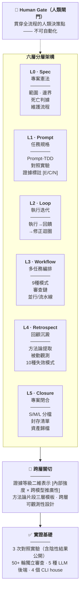

# AI 協作專案全生命週期框架

[](https://creativecommons.org/licenses/by/4.0/)

**版本**：v1.6.4（2026-06-22）  
**狀態**：Working Paper（持續更新中，引用請註明版本號）  
**許可**：CC BY 4.0  
**語言**：正體中文（以簡體中文原文為準，若有歧義從原文）  
**編碼**：UTF-8（全部文字檔案）  
**翻譯**：[简体中文](../README.md) · [English](../en/README.md)  
**AI 生成宣告**：本倉庫大部分內容由人機協作生成（詳見 [PUBLISHING.md](../PUBLISHING.md)）

[](../README.md)
[](../en/README.md)
[]()

> 📖 ~16.8萬字元 | 六層架構 | 3次對照實驗 | 50+輪多後端獨立審查 | Spec Coding · Prompt-TDD · 專案閉合



> **檔案名稱說明**：本譯文中的連結路徑保留簡體中文（與磁碟上的實際檔案名稱一致），連結文字則使用正體中文。此為刻意設計——確保連結在跨平臺環境中可正確解析。

一套描述「如何用 AI 協作跑完一個完整專案」的元層次操作規範——從啟動、執行、審查到封存的全生命週期流程框架。核心信念：方向盤 > 引擎、分層不互相替代、從失敗反向沉澱、AI 閉環 ≠ 人類審查。

> **定位宣告**：這是一個**半開放的個人方法論工具**——它不追求成為獨立於作者的「通用框架」（一個人不可能擁有覆蓋所有專案型別、工具鏈、驗證獨立性的經驗譜系）。它提供的是經過多後端審查和對照實驗證據標註的個人實踐模式。歡迎參考、改編、和貢獻反例；但讀者應預期需要翻譯成本才能適配自己的場景。詳見 §1.8 侷限 #9 和 `_research/通用框架可行性討論_20260621.md`。

### 專案性質

**這是一份小型技術檔案，不是軟體專案。** 本倉庫不包含可執行的應用程式、庫或 Web 服務。這裡的「程式碼」是檔案生成指令碼（MD → JSON/DOCX 轉換），「資料」是審查報告和案例研究，核心交付物是一份約 15 萬字元的 Markdown 檔案。

如果你在找：下載安裝指南、API 檔案、Demo 頁面 —— 這些這裡都沒有。  
如果你在找：一套經過實證檢驗的 AI 協作方法論框架 —— [`AI協作專案全生命週期框架.md`](AI协作项目全生命周期框架.md) 是入口。

---

## 主檔案規模

主檔案 `AI协作项目全生命周期框架.md` 是一份約 16 萬字元（約 310 KB）的 Markdown 文件，以中文為主，含若干程式碼區塊、表格和 Mermaid 圖表。精確的字元級統計隨版本變動，不在此維護；如需當前數值可執行 `_workflows/count_chars_v164.py`。

---

## 目錄結構

```
AI协作项目全生命周期框架/
│
├── AI协作项目全生命周期框架.md        ← 📖 主文档（入口）
├── AI协作项目全生命周期框架.json       ← 机器可读版
├── AI协作项目全生命周期框架.docx       ← Word 版（pandoc 生成）
├── README.md                           ← 本文件（结构导航）
├── CLAUDE.md                           ← AI 助手项目指令
├── PUBLISHING.md                       ← 发布边界与 AI 生成声明
├── LICENSE                             ← CC BY 4.0 许可证
├── VERSION                             ← 版本号（1.6.4）
├── project_status.md                   ← 项目状态追踪
├── reference_files.md                  ← 关键文件索引
├── project.yaml                        ← DOCX 管道项目配置
├── inventory.csv                       ← 文件清单（与发布包内容一致）
├── verify_version_consistency.py       ← 版本一致性校验脚本
├── .gitignore                          ← 发布包边界定义
│
├── _archive/                           ← 🗄 历史封存
│   ├── 元审查合规清单.{md,json}          — 框架自身合规审查
│   ├── 独立审查标准操作程序_SOP.{md,json} — 审查 SOP v1.0
│   ├── provenance_erratum_20260617.md   — 模型 provenance 勘误
│   ├── v1.5.1冻结期_待执行协议清单.md     — 冻结期协议清单（已归档）
│   └── docx_legacy_scripts/             — DOCX 旧版生成脚本归档（含 README 说明取代关系）
│
├── _mermaid_png/                       ← 🎨 图表源码 + 矢量图
│   └── *.mmd（源）/ *.emf（矢量）        — Mermaid 源码 + EMF 矢量图
│                                          （PNG/SVG/PDF 渲染缓存不入库，见 .gitignore）
│
├── _protocols-and-tools/               ← 📋 协议 + 工具 + 配套文档
│   ├── meta-audit-checklist.{md,json}   — 元审查合规清单 v1.0.4+（75 项）
│   ├── methodological-review-sop.{md,json} — 独立审查 SOP v1.0.4
│   ├── 框架级成熟度评估表.{md,json}       — 框架自身成熟度评估 v0.4
│   ├── 外部依赖登记表.{md,json}          — 工具链/模型/平台依赖追踪
│   ├── 可调参数索引.md                   — 魔法数字集中索引
│   ├── import_integrity_check.py        — Python 导入检查工具（已弃用，见主文档 §9.1）
│   ├── AI协作项目全生命周期框架_OPEN4试读计时协议.{md,json}
│   └── AI协作项目全生命周期框架_人类专家verify包.{md,json}
│
├── _research/                          ← 🔬 案例研究材料
│   ├── CCR作为逃生口案例研究.{md,json}
│   ├── CacheAligner与AI框架OPEN-1对标分析.{md,json}
│   ├── ChatGPT-5.5独立审查_headroom对标三文档.{md,json}
│   ├── SmartCrusher方法论提取.{md,json}
│   ├── headroom对标分析_封存说明.{md,json}
│   ├── 通用框架可行性讨论_20260621.md
│   ├── 两次试跑对比_2026-06-22.md
│   └── drafts/                         — 废弃草案（v1.3.2 / v1.5.1）
│
├── _reviews/                           ← 🔍 多后端独立审查报告
│   ├── (各版本审查报告 + 交叉验证记录 .md/.json/.txt)
│   ├── prompts/                        — 审查提示词
│   ├── last_messages/                  — CLI 输出片段
│   └── retrospects/                    — 复盘记录
│
├── _workflows/                         ← ⚙ 构建 + 同步 + 翻译脚本
│   ├── regenerate_docx.py               — DOCX 全量重生成（Mermaid + pandoc + 样式）
│   ├── regenerate_inventory.py          — 重生成 inventory.csv
│   ├── count_chars_v164.py              — 字符级统计
│   ├── sync_v16{1,2,3,4}_docx.py        — 各版本 DOCX 同步（历史）
│   ├── i18n/                            — 翻译管道（术语表 + 翻译/检查脚本 + 审查报告）
│   └── *.js                            — Workflow 定义脚本
│
└── zh-Hant/                            ← 🌏 正體中文翻譯
    ├── README.md
    ├── AI协作项目全生命周期框架.md
    └── reference_files.md
```

---

## 快速導航

| 你想…… | 從這裡開始 |
|---------|-----------|
| 瞭解框架內容 | [`AI協作專案全生命週期框架.md`](../AI协作项目全生命周期框架.md) |
| 機器處理/交叉分析 | [`AI協作專案全生命週期框架.json`](../AI协作项目全生命周期框架.json) |
| 瞭解專案當前狀態和待辦 | [`project_status.md`](../project_status.md) |
| 查詢特定檔案 | [`reference_files.md`](../reference_files.md) |
| 檢視獨立審查記錄 | [`_reviews/`](../_reviews/) |
| 檢視審查 SOP | [`_protocols-and-tools/methodological-review-sop.md`](../_protocols-and-tools/methodological-review-sop.md) |
| 瞭解框架成熟度 | [`_protocols-and-tools/框架級成熟度評估表.md`](../_protocols-and-tools/框架级成熟度评估表.md) |

---

## 子目錄命名約定

| 字首 | 含義 |
|------|------|
| `_` | AI 工作中間產物（不被人類直接消費） |
| 無字首 | 人類直接消費的核心檔案 |

`_archive` / `_mermaid_png` / `_reviews` / `_workflows` 均為 AI 工作目錄。  
`_protocols-and-tools` / `_research` 人類可讀，但非主檔案。

---

## 三件套約定

主檔案同時維護三種格式：

| 格式 | 用途 | 消費者 |
|------|------|--------|
| `.md` | 權威版本 | 人類 + AI |
| `.json` | 結構化配套 | 機器（指令碼消費、交叉驗證） |
| `.docx` | 傳統分發 | 人類（Word 閱讀/列印） |

`.json` 和 `.docx` 均由 `.md` 派生，修改以 `.md` 為準。

---

## 審查鏈

本框架經 **5 種後端 × 5 個 CLI** 的多輪獨立審查，審查譜系記錄於主檔案 § 審查鏈。所有審查報告歸檔於 [`_reviews/`](_reviews/)。

---

## 相關專案 | Related Projects

本倉庫是方法論上游，以下 6 個倉庫均為其派生或實證專案：

```
ai-collaboration-framework  ← 方法論上游（本倉庫）
├── independent-review-toolkit   ← §9.2 審查 SOP 提取
├── prompt-tdd-methodology       ← §4.1.1 實驗方法論提取
├── claude-skills               ← §9.2–§9.3 Claude Code 技能提取
├── docx-pipeline               ← DOCX 生成管道提取
├── ma-case-study-pipeline      ← 六層框架實證案例
└── etf-pattern-match-pybind11  ← 採用審查/觀測/閉合協定
```

| 專案 | 關係 |
|------|------|
| [**Independent Review Toolkit**](https://github.com/redamancy231-create/independent-review-toolkit) | **上游提取**：從本文檔 §9.2 + 50+ 輪實戰審查提煉的審查 SOP。**複製 prompt 即可用**。 |
| [**Prompt-TDD Methodology**](https://github.com/redamancy231-create/prompt-tdd-methodology) | **上游提取**：Prompt 對照實驗方法論案例手冊——SOP + 兩個真實實驗（含陰性結果）。 |
| [**Claude Skills**](https://github.com/redamancy231-create/claude-skills) | **上游提取**：3 個 Claude Code Skill——會話交接 · CLAUDE.md 編寫 · 事前否決。從本文檔 §9.2–§9.3 提煉。 |
| [**DOCX Pipeline**](https://github.com/redamancy231-create/docx-pipeline) | **上游提取**：Markdown → 中文 DOCX 泛化管道——雙後端 + Mermaid + 4 範本。從本文檔的 DOCX 生成管道提煉。 |
| [**M&A Case Study Pipeline**](https://github.com/redamancy231-create/ma-case-study-pipeline) | **下游實證**：框架六層理念在併購重組案例中的八階段端到端實證（含交叉雙盲審 + 對照實驗 + 可複用 playbook）。 |
| [**ETF Pattern Match — pybind11**](https://github.com/redamancy231-create/etf-pattern-match-pybind11) | **下游採用**：pybind11/C++20 加速實踐——採用本框架的多後端審查、被動觀測、專案閉合協定。DTW 34× / pattern match 53×。 |

---

*生成模型：DeepSeek-V4-Pro (via Claude Code CLI) · 2026-06-22*  
*目錄結構與檔案計數校正：Claude Opus 4.8 (via Claude Code CLI) · 2026-06-23 — 移除已遷出的建置產物/快取與 `_backups/` 條目，對齊發布套件真實結構（經 Codex GPT-5.5 獨立清點交叉驗證）*